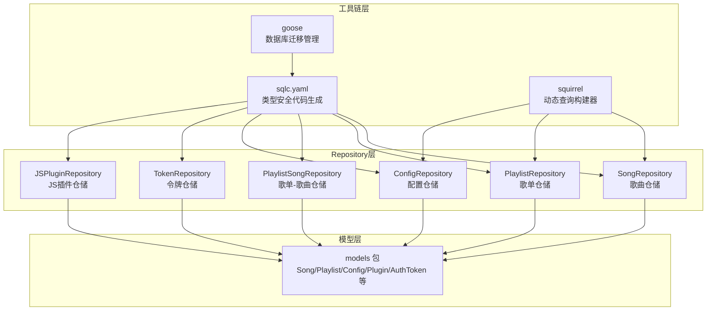
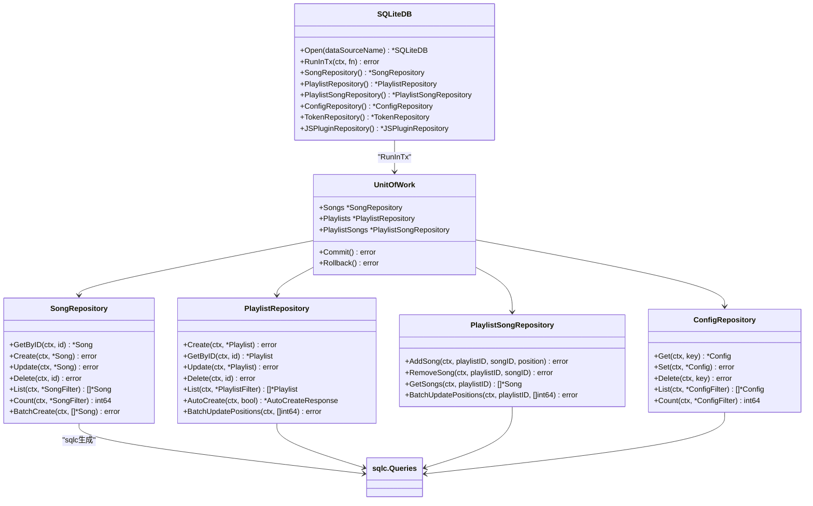
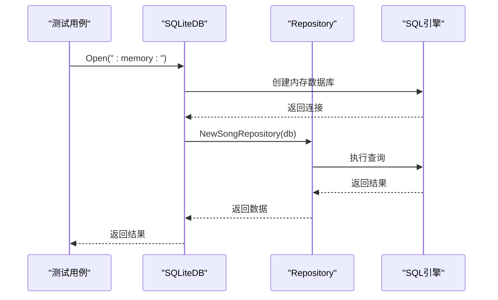
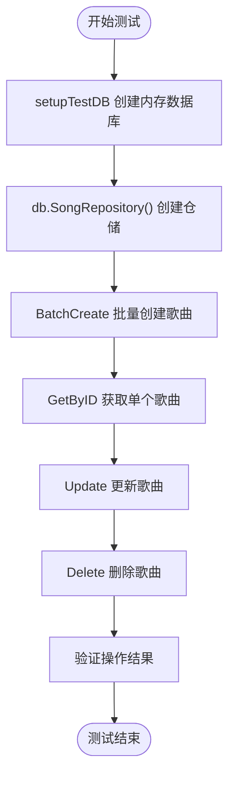
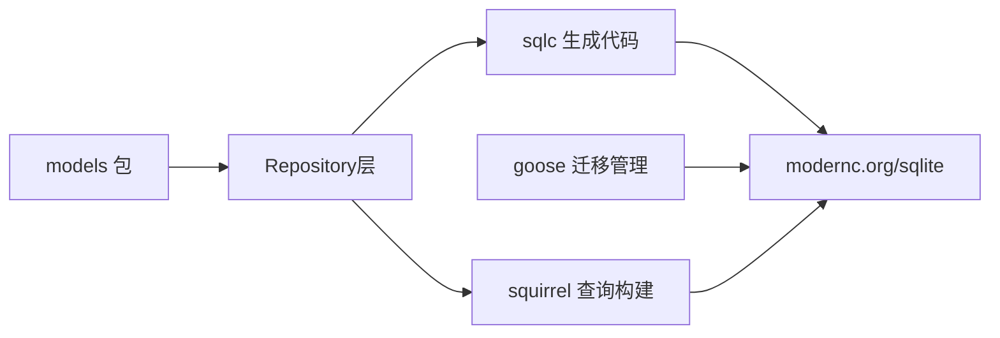

# 数据库设计

<cite>
**本文引用的文件**
- [internal/database/sqlite.go](file://internal/database/sqlite.go)
- [internal/database/song_repository.go](file://internal/database/song_repository.go)
- [internal/database/playlist_repository.go](file://internal/database/playlist_repository.go)
- [internal/database/playlist_song_repository.go](file://internal/database/playlist_song_repository.go)
- [internal/database/config_repository.go](file://internal/database/config_repository.go)
- [internal/database/jsplugin_repository.go](file://internal/database/jsplugin_repository.go)
- [internal/database/token_repository.go](file://internal/database/token_repository.go)
- [internal/database/sqlite_test.go](file://internal/database/sqlite_test.go)
- [sqlc.yaml](file://sqlc.yaml)
- [internal/database/sqlc/queries/songs.sql](file://internal/database/sqlc/queries/songs.sql)
- [internal/database/sqlc/queries/playlists.sql](file://internal/database/sqlc/queries/playlists.sql)
- [internal/database/sqlc/queries/playlist_songs.sql](file://internal/database/sqlc/queries/playlist_songs.sql)
- [internal/database/sqlc/queries/configs.sql](file://internal/database/sqlc/queries/configs.sql)
- [internal/database/sqlc/queries/tokens.sql](file://internal/database/sqlc/queries/tokens.sql)
- [internal/database/sqlc/queries/js_plugins.sql](file://internal/database/sqlc/queries/js_plugins.sql)
- [internal/models/models.go](file://internal/models/models.go)
</cite>

## 更新摘要
**变更内容**
- 完全重构数据库层架构，从直接数据库接口转向Repository模式
- 引入sqlc工具链生成类型安全的数据库访问代码
- 采用goose进行数据库迁移管理
- 实现squirrel动态查询构建器
- 新增UnitOfWork事务管理框架
- 统一错误处理语义和接口设计
- 基于内存数据库的完整测试架构

## 目录
1. [简介](#简介)
2. [项目结构](#项目结构)
3. [核心组件](#核心组件)
4. [架构总览](#架构总览)
5. [详细组件分析](#详细组件分析)
6. [依赖关系分析](#依赖关系分析)
7. [性能考量](#性能考量)
8. [故障排查指南](#故障排查指南)
9. [结论](#结论)
10. [附录](#附录)

## 简介
本文件系统性梳理 MiMusic 的全新数据库设计与实现，重点围绕基于 SQLite 的纯 Go 实现方案，阐述数据库架构选择、核心表结构、索引与查询优化、数据访问层模式（Repository 风格）、事务管理、迁移与版本策略，并提供 SQL 示例与性能优化建议。新架构采用 sqlc、goose、squirrel 工具链，实现类型安全的数据库访问、声明式的迁移管理和灵活的动态查询构建。

## 项目结构
数据库相关代码集中在 internal/database 目录，采用"工具链 + Repository + 模型"的分层组织方式：
- 工具链层：sqlc（类型安全的数据库访问）、goose（迁移管理）、squirrel（动态查询构建）
- Repository 层：SongRepository、PlaylistRepository、PlaylistSongRepository、ConfigRepository、TokenRepository、JSPluginRepository
- 模型层：models 包中的实体结构体与常量
- 初始化与迁移：sqlc.yaml 配置文件和 goose 迁移脚本

**更新** 完全重构为Repository模式，引入sqlc、goose、squirrel工具链

章节来源
- [internal/database/sqlite.go:19-24](file://internal/database/sqlite.go#L19-L24)
- [sqlc.yaml:1-17](file://sqlc.yaml#L1-17)

## 核心组件
- SQLiteDB：基于 modernc.org/sqlite 驱动的纯 Go SQLite 实现，启用 WAL、超时、外键、缓存等优化
- Repository 模式：每个领域（歌曲、歌单、配置、令牌、插件）都有独立的仓储实现
- sqlc：自动生成类型安全的数据库访问代码，支持接口和结构体
- goose：数据库迁移管理，支持版本控制和回滚
- squirrel：动态查询构建器，支持复杂条件查询和分页
- UnitOfWork：事务管理框架，确保跨仓储的一致性操作

**更新** 新增Repository模式和工具链层组件

章节来源
- [internal/database/sqlite.go:19-24](file://internal/database/sqlite.go#L19-L24)
- [internal/database/song_repository.go:16-27](file://internal/database/song_repository.go#L16-L27)
- [internal/database/playlist_repository.go:22-34](file://internal/database/playlist_repository.go#L22-L34)
- [internal/database/config_repository.go:15-25](file://internal/database/config_repository.go#L15-L25)

## 架构总览
数据库层采用"工具链驱动 + Repository模式 + UnitOfWork事务管理"的现代化架构，结合 SQLite 的 WAL 模式与索引策略，确保高并发读取与良好写入吞吐。通过 sqlc 自动生成类型安全的数据库访问代码，通过 goose 管理数据库迁移，通过 squirrel 构建灵活的动态查询。

**更新** 完全重构为Repository模式，新增UnitOfWork事务管理

图表来源
- [internal/database/sqlite.go:79-102](file://internal/database/sqlite.go#L79-L102)
- [internal/database/song_repository.go:16-27](file://internal/database/song_repository.go#L16-L27)
- [internal/database/playlist_repository.go:22-34](file://internal/database/playlist_repository.go#L22-L34)
- [internal/database/playlist_song_repository.go:13-22](file://internal/database/playlist_song_repository.go#L13-L22)
- [internal/database/config_repository.go:15-25](file://internal/database/config_repository.go#L15-L25)

## 详细组件分析

### 工具链配置与生成
- sqlc.yaml：配置 sqlc 工具链，指定 SQLite 引擎、查询目录、迁移目录、Go 代码输出等参数
- 类型安全生成：sqlc 自动生成 Queries 接口和结构体，提供编译时类型检查
- 接口生成：启用 emit_interface 选项，生成统一的 DBTX 接口
- SQL 包配置：使用 database/sql 包，支持事务和连接池

**更新** 新增sqlc工具链配置和类型安全生成机制

章节来源
- [sqlc.yaml:1-17](file://sqlc.yaml#L1-L17)

### Repository 模式实现
- 统一接口设计：所有仓储都实现相同的 CRUD 操作接口
- DBTX 支持：仓储接受 sqlc.DBTX 接口，既可接受 *sql.DB 也可接受 *sql.Tx
- 错误处理统一：使用 ErrNotFound 和标准错误包装
- 批量操作优化：支持批量创建、批量删除等高性能操作

**更新** 新增Repository模式的统一接口设计和错误处理

章节来源
- [internal/database/song_repository.go:16-27](file://internal/database/song_repository.go#L16-L27)
- [internal/database/playlist_repository.go:22-34](file://internal/database/playlist_repository.go#L22-L34)
- [internal/database/config_repository.go:15-25](file://internal/database/config_repository.go#L15-L25)

### UnitOfWork 事务管理
- 事务边界：RunInTx 方法提供统一的事务入口点
- 跨仓储一致性：UnitOfWork 确保多个仓储在同一事务中操作
- 自动回滚：函数返回错误时自动回滚事务
- panic 处理：捕获 panic 并确保事务回滚

**更新** 新增UnitOfWork事务管理框架

章节来源
- [internal/database/sqlite.go:79-102](file://internal/database/sqlite.go#L79-L102)

### 数据库初始化与迁移
- 初始化流程：Open 函数打开数据库，设置连接池与 DSN 参数，执行 goose 迁移
- 迁移策略：通过 goose 管理数据库版本，支持 Up/Down 操作
- 迁移嵌入：使用 go:embed 嵌入迁移文件，确保部署一致性
- 连接优化：WAL 模式、busy_timeout、synchronous、cache_size、foreign_keys 等参数优化

**更新** 新增goose迁移管理和连接优化配置

章节来源
- [internal/database/sqlite.go:26-67](file://internal/database/sqlite.go#L26-L67)

### 核心表结构设计
- 歌曲表 songs：存储本地/网络/电台歌曲元数据，包含类型、标题、艺人、专辑、时长、文件路径/URL、封面、歌词、媒体属性、时间戳等
- 歌单表 playlists：存储歌单元数据，包含类型、名称、描述、封面、标签（JSON 数组）、位置、时间戳
- 歌单-歌曲关联表 playlist_songs：多对多中间表，包含 position 与时间戳，支持排序与分页
- 配置表 configs：键值型配置，key 唯一，value 存储 JSON 字符串
- 令牌表 auth_tokens：认证令牌，支持类型、过期、撤销等
- 插件表 js_plugins：JS 插件元数据与状态

**更新** 新增JS插件表和令牌表结构

章节来源
- [internal/database/sqlc/queries/songs.sql](file://internal/database/sqlc/queries/songs.sql)
- [internal/database/sqlc/queries/playlists.sql](file://internal/database/sqlc/queries/playlists.sql)
- [internal/database/sqlc/queries/playlist_songs.sql](file://internal/database/sqlc/queries/playlist_songs.sql)
- [internal/database/sqlc/queries/configs.sql](file://internal/database/sqlc/queries/configs.sql)
- [internal/database/sqlc/queries/tokens.sql](file://internal/database/sqlc/queries/tokens.sql)
- [internal/database/sqlc/queries/js_plugins.sql](file://internal/database/sqlc/queries/js_plugins.sql)

### 索引策略与查询优化
- 索引覆盖：
  - songs：type、title、artist、added_at（降序）
  - playlists：type、labels（JSON 查询）、position
  - playlist_songs：playlist_id、song_id、(playlist_id, position)
  - configs：key
  - auth_tokens：token_id、token_type、expires_at、revoked_at
  - js_plugins：status
- 查询优化要点：
  - 使用 LIKE 白名单前缀匹配（%keyword%）进行关键词检索
  - 使用 JSON 查询 EXISTS(json_each(labels)) 进行标签过滤
  - 使用 LIMIT/OFFSET 实现分页，结合 ORDER BY 与合适索引
  - squirrel 动态构建复杂查询条件
  - sqlc 预编译查询提高性能

**更新** 新增squirrel动态查询构建和sqlc预编译优化

章节来源
- [internal/database/song_repository.go:202-253](file://internal/database/song_repository.go#L202-L253)
- [internal/database/playlist_repository.go:157-208](file://internal/database/playlist_repository.go#L157-L208)
- [internal/database/config_repository.go:67-121](file://internal/database/config_repository.go#L67-L121)

### 数据访问层模式与事务管理
- Repository 风格：每个领域都有独立的仓储实现，封装 SQL 与扫描逻辑
- 事务管理：UnitOfWork 提供跨仓储的事务一致性保证
- 批量操作：支持批量创建、批量删除等高性能操作
- 自动事务：复杂操作（如自动创建歌单）在仓储内部自动管理事务

**更新** 新增Repository模式和UnitOfWork事务管理

章节来源
- [internal/database/song_repository.go:275-303](file://internal/database/song_repository.go#L275-L303)
- [internal/database/playlist_repository.go:268-421](file://internal/database/playlist_repository.go#L268-L421)
- [internal/database/playlist_song_repository.go:107-125](file://internal/database/playlist_song_repository.go#L107-L125)

### 歌曲模块（SongRepository）
- 主要方法：GetByID、Create、Update、Delete、List、Count、BatchCreate、BatchDelete
- 关键点：支持按 type 与关键词检索；分页与排序；批量操作自动事务管理
- SQL 示例路径：
  - 获取歌曲：[internal/database/sqlc/queries/songs.sql](file://internal/database/sqlc/queries/songs.sql)
  - 创建歌曲：[internal/database/sqlc/queries/songs.sql](file://internal/database/sqlc/queries/songs.sql)
  - 批量创建：[internal/database/song_repository.go:275-303](file://internal/database/song_repository.go#L275-L303)
  - 批量删除：[internal/database/song_repository.go:255-273](file://internal/database/song_repository.go#L255-L273)

**更新** 新增SongRepository的批量操作和自动事务管理

章节来源
- [internal/database/song_repository.go:29-76](file://internal/database/song_repository.go#L29-L76)
- [internal/database/song_repository.go:202-253](file://internal/database/song_repository.go#L202-L253)
- [internal/database/song_repository.go:255-303](file://internal/database/song_repository.go#L255-L303)

### 歌单模块（PlaylistRepository）
- 主要方法：Create、GetByID、Update、Touch、Delete、List、Count、AutoCreate、BatchUpdatePositions
- 关键点：标签以 JSON 数组存储，支持标签过滤；自动创建歌单的复杂事务管理
- SQL 示例路径：
  - 创建歌单：[internal/database/sqlc/queries/playlists.sql](file://internal/database/sqlc/queries/playlists.sql)
  - 自动创建：[internal/database/playlist_repository.go:268-421](file://internal/database/playlist_repository.go#L268-L421)
  - 批量更新位置：[internal/database/playlist_repository.go:249-266](file://internal/database/playlist_repository.go#L249-L266)

**更新** 新增PlaylistRepository的自动创建和批量位置更新

章节来源
- [internal/database/playlist_repository.go:36-155](file://internal/database/playlist_repository.go#L36-L155)
- [internal/database/playlist_repository.go:249-266](file://internal/database/playlist_repository.go#L249-L266)
- [internal/database/playlist_repository.go:268-421](file://internal/database/playlist_repository.go#L268-L421)

### 关联模块（PlaylistSongRepository）
- 主要方法：AddSong、RemoveSong、GetSongs、GetSongsPaginated、CountSongs、ReplaceSong、BatchUpdatePositions
- 关键点：支持歌曲替换和批量位置更新；复杂操作自动事务管理
- SQL 示例路径：
  - 添加歌曲：[internal/database/sqlc/queries/playlist_songs.sql](file://internal/database/sqlc/queries/playlist_songs.sql)
  - 获取歌曲：[internal/database/sqlc/queries/playlist_songs.sql](file://internal/database/sqlc/queries/playlist_songs.sql)
  - 批量更新位置：[internal/database/playlist_song_repository.go:107-125](file://internal/database/playlist_song_repository.go#L107-L125)

**更新** 新增PlaylistSongRepository的批量位置更新和歌曲替换

章节来源
- [internal/database/playlist_song_repository.go:24-88](file://internal/database/playlist_song_repository.go#L24-L88)
- [internal/database/playlist_song_repository.go:107-125](file://internal/database/playlist_song_repository.go#L107-L125)
- [internal/database/playlist_song_repository.go:127-160](file://internal/database/playlist_song_repository.go#L127-L160)

### 配置模块（ConfigRepository）
- 主要方法：Get、Set、Delete、List、Count
- 关键点：唯一键约束；ON CONFLICT DO UPDATE 实现幂等写入；关键词搜索使用 LIKE；分页与排序
- SQL 示例路径：
  - 获取配置：[internal/database/sqlc/queries/configs.sql](file://internal/database/sqlc/queries/configs.sql)
  - 设置配置：[internal/database/sqlc/queries/configs.sql](file://internal/database/sqlc/queries/configs.sql)
  - 列表查询：[internal/database/config_repository.go:67-101](file://internal/database/config_repository.go#L67-L101)

**更新** 新增ConfigRepository的动态查询构建

章节来源
- [internal/database/config_repository.go:27-65](file://internal/database/config_repository.go#L27-L65)
- [internal/database/config_repository.go:67-121](file://internal/database/config_repository.go#L67-L121)

### 令牌模块（TokenRepository）
- 主要方法：Create、Get、Revoke、ListActive、CleanExpired、IsRevoked
- 关键点：区分 access/refresh 类型；过期与撤销双重判断；活跃令牌查询基于 revoked_at 与 expires_at
- SQL 示例路径：
  - 创建令牌：[internal/database/sqlc/queries/tokens.sql](file://internal/database/sqlc/queries/tokens.sql)
  - 活跃令牌列表：[internal/database/sqlc/queries/tokens.sql](file://internal/database/sqlc/queries/tokens.sql)

**更新** 新增令牌仓储的完整实现

章节来源
- [internal/database/token_repository.go](file://internal/database/token_repository.go)

### JS插件模块（JSPluginRepository）
- 主要方法：Create、Get、Update、Delete、List、UpdateStatus
- 关键点：状态枚举（active/inactive/error）；按创建时间倒序；支持按文件路径查询
- SQL 示例路径：
  - 创建插件：[internal/database/sqlc/queries/js_plugins.sql](file://internal/database/sqlc/queries/js_plugins.sql)
  - 列表查询：[internal/database/jsplugin_repository.go](file://internal/database/jsplugin_repository.go)

**更新** 新增JS插件仓储的完整实现

章节来源
- [internal/database/jsplugin_repository.go](file://internal/database/jsplugin_repository.go)

### 数据库迁移与版本管理
- 迁移管理：通过 goose 管理数据库版本，支持 Up/Down 操作
- 迁移嵌入：使用 go:embed 嵌入迁移文件，确保部署一致性
- 版本策略：配合应用版本与构建信息，确保不同版本间的数据结构兼容与平滑升级
- 迁移示例：songs 表的 cache_hash 字段迁移

**更新** 新增goose迁移管理和版本控制

章节来源
- [internal/database/sqlite.go:57-67](file://internal/database/sqlite.go#L57-L67)

### 基于内存数据库的测试架构

**更新** 新增基于内存数据库的测试架构

图表来源
- [internal/database/sqlite_test.go:11-18](file://internal/database/sqlite_test.go#L11-L18)

### Repository 模式测试示例

**更新** 新增Repository模式的测试流程

图表来源
- [internal/database/sqlite_test.go:34-112](file://internal/database/sqlite_test.go#L34-L112)

## 依赖关系分析
- 外部依赖：modernc.org/sqlite（纯 Go SQLite 驱动）、github.com/pressly/goose（迁移管理）、github.com/Masterminds/squirrel（查询构建）
- 内部依赖：models 包提供结构体与常量，被各模块实现引用
- 工具链依赖：sqlc 生成代码，goose 管理迁移，squirrel 构建查询
- 模块内聚：每个仓储职责清晰，通过统一接口解耦

**更新** 新增工具链依赖关系

图表来源
- [internal/database/song_repository.go:3-14](file://internal/database/song_repository.go#L3-L14)
- [internal/database/playlist_repository.go:3-20](file://internal/database/playlist_repository.go#L3-L20)
- [internal/database/config_repository.go:3-13](file://internal/database/config_repository.go#L3-L13)

章节来源
- [internal/database/song_repository.go:3-14](file://internal/database/song_repository.go#L3-L14)
- [internal/database/playlist_repository.go:3-20](file://internal/database/playlist_repository.go#L3-L20)
- [internal/database/config_repository.go:3-13](file://internal/database/config_repository.go#L3-L13)

## 性能考量
- WAL 模式：提升并发读性能，读写不互相阻塞
- 连接池：最大打开连接数、空闲连接数与生命周期合理配置，避免写锁竞争
- 缓存与同步：适度的 page cache 与 NORMAL 同步级别平衡性能与可靠性
- 查询优化：
  - 为高频过滤与排序字段建立索引
  - 使用 LIMIT/OFFSET 实现分页，避免全表扫描
  - JSON 标签过滤使用 EXISTS(json_each(...))，必要时考虑物化标签或二级索引
  - sqlc 预编译查询提高性能
  - squirrel 动态构建复杂查询条件
  - 批量操作：批量插入歌单-歌曲关联时分批（如 500 行/批），降低单次事务压力
  - 事务边界：将多步写入包裹在单一事务中，减少锁持有时间
- 错误处理：统一的错误包装和类型检查，减少运行时错误

**更新** 新增sqlc预编译和squirrel动态查询的性能优化

章节来源
- [internal/database/sqlite.go:29-36](file://internal/database/sqlite.go#L29-L36)
- [internal/database/song_repository.go:275-303](file://internal/database/song_repository.go#L275-L303)
- [internal/database/playlist_repository.go:392-413](file://internal/database/playlist_repository.go#L392-L413)

## 故障排查指南
- 常见错误类型：
  - 记录不存在：Get* 返回 ErrNotFound
  - 更新/删除影响行数为 0：通常表示主键不存在
  - 事务回滚：确认 RunInTx 中的错误传播
  - sqlc 代码生成错误：检查 sqlc.yaml 配置和查询语法
  - goose 迁移失败：检查迁移文件语法和版本号
- 排查步骤：
  - 检查 SQL 日志与参数绑定
  - 核对索引是否存在，特别是 JSON 标签查询
  - 确认事务是否正确提交或回滚
  - 校验 DSN 参数与连接池配置
  - 验证 sqlc 查询文件语法
  - 检查 goose 迁移文件格式
- 相关实现参考：
  - Repository CRUD 操作：[internal/database/song_repository.go:29-76](file://internal/database/song_repository.go#L29-L76)
  - 批量操作：[internal/database/song_repository.go:255-303](file://internal/database/song_repository.go#L255-L303)
  - 自动创建歌单：[internal/database/playlist_repository.go:268-421](file://internal/database/playlist_repository.go#L268-L421)
  - UnitOfWork 事务管理：[internal/database/sqlite.go:79-102](file://internal/database/sqlite.go#L79-L102)

**更新** 新增工具链相关的故障排查指导

章节来源
- [internal/database/song_repository.go:29-76](file://internal/database/song_repository.go#L29-L76)
- [internal/database/playlist_repository.go:268-421](file://internal/database/playlist_repository.go#L268-L421)
- [internal/database/sqlite.go:79-102](file://internal/database/sqlite.go#L79-L102)

## 结论
MiMusic 的全新数据库层以 SQLite 纯 Go 实现为核心，采用 sqlc、goose、squirrel 工具链驱动的现代化架构，结合 Repository 模式和 UnitOfWork 事务管理，实现类型安全、可维护、高性能的数据库访问层。通过 sqlc 自动生成类型安全的数据库访问代码，通过 goose 管理数据库迁移，通过 squirrel 构建灵活的动态查询，确保系统的可扩展性和可维护性。基于内存数据库的完整测试架构为代码质量提供了坚实保障。建议在生产环境中持续关注查询计划与索引命中情况，配合监控与日志进行性能与稳定性治理。

## 附录
- 工具链配置：[sqlc.yaml](file://sqlc.yaml)
- Repository 接口：[internal/database/song_repository.go](file://internal/database/song_repository.go)
- 迁移管理：[internal/database/sqlite.go](file://internal/database/sqlite.go)
- 测试架构：[internal/database/sqlite_test.go](file://internal/database/sqlite_test.go)