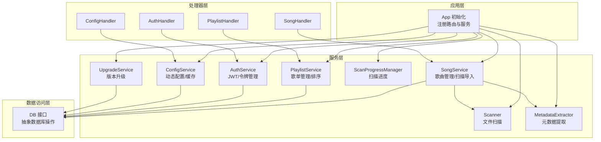
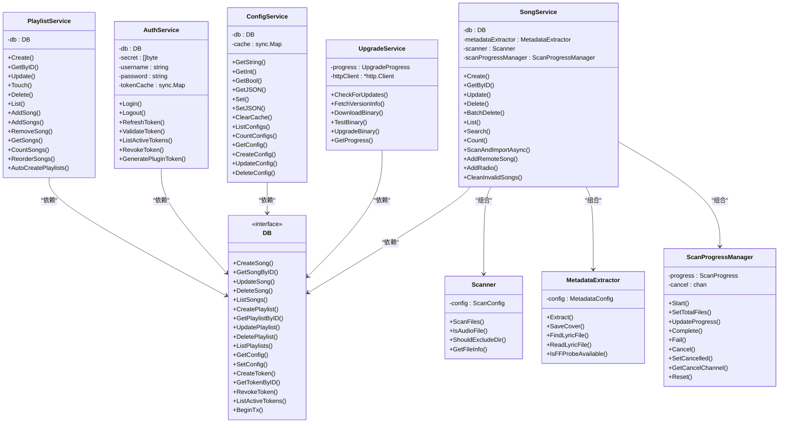
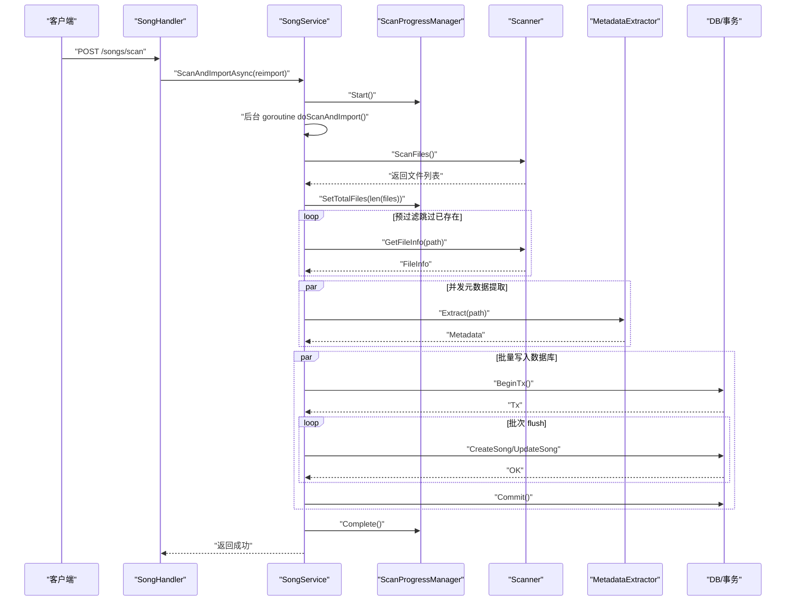
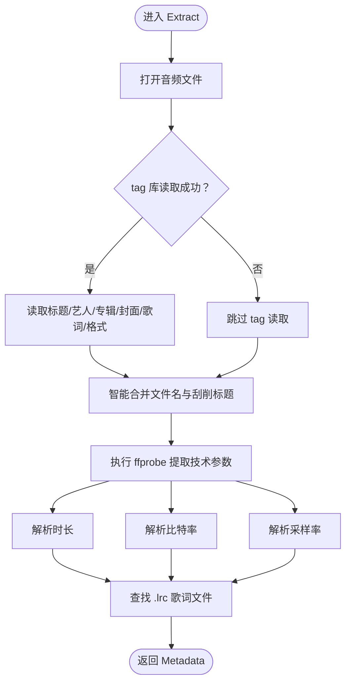
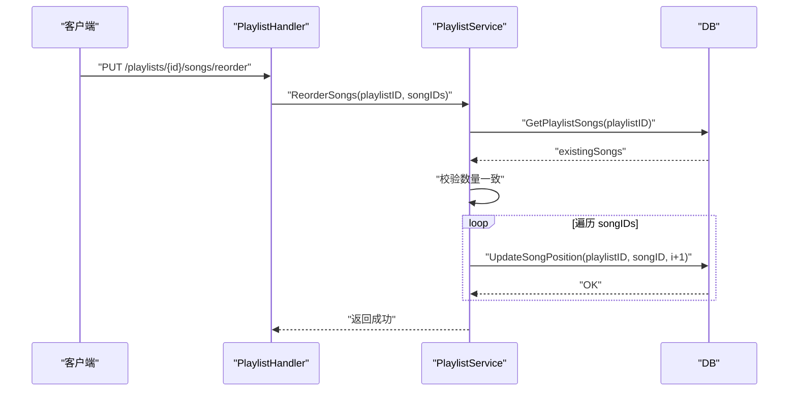
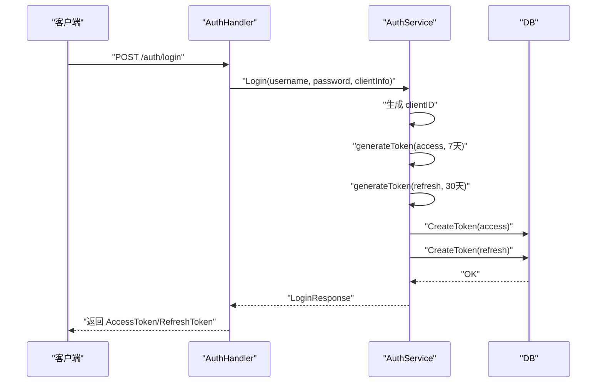
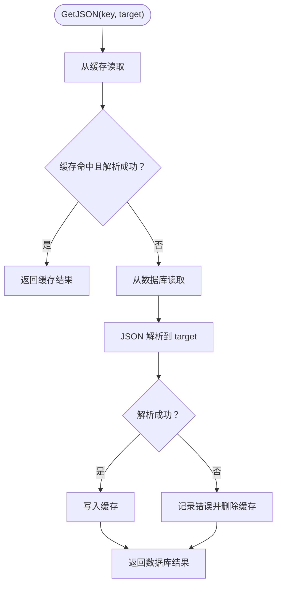
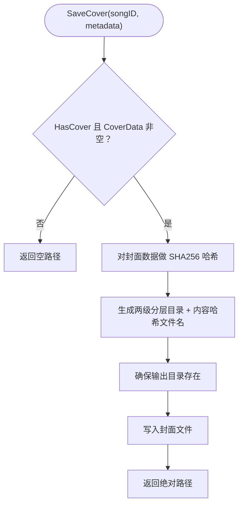
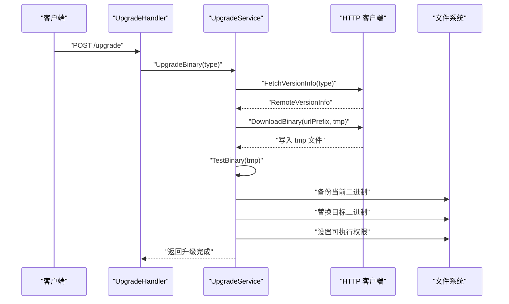
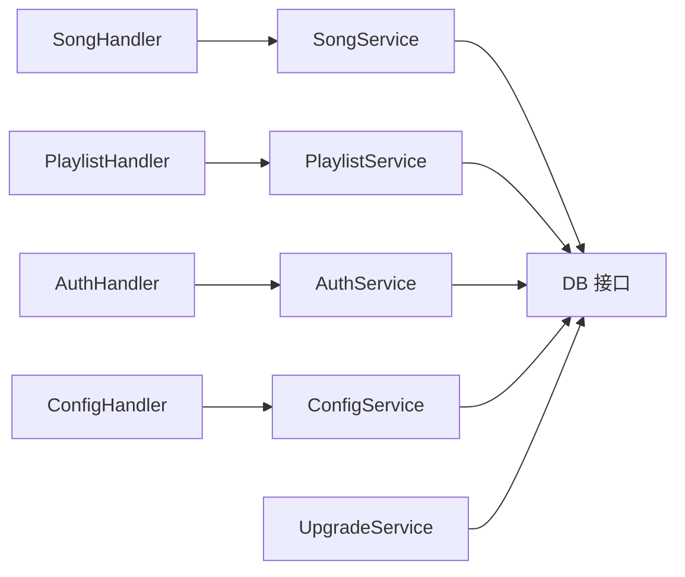

# 服务层设计

<cite>
**本文引用的文件**
- [internal/services/song_service.go](file://internal/services/song_service.go)
- [internal/services/playlist_service.go](file://internal/services/playlist_service.go)
- [internal/services/auth_service.go](file://internal/services/auth_service.go)
- [internal/services/config_service.go](file://internal/services/config_service.go)
- [internal/services/scanner.go](file://internal/services/scanner.go)
- [internal/services/metadata.go](file://internal/services/metadata.go)
- [internal/services/scan_progress.go](file://internal/services/scan_progress.go)
- [internal/services/upgrade_service.go](file://internal/services/upgrade_service.go)
- [internal/handlers/music.go](file://internal/handlers/music.go)
- [internal/handlers/playlist.go](file://internal/handlers/playlist.go)
- [internal/handlers/auth.go](file://internal/handlers/auth.go)
- [internal/handlers/config.go](file://internal/handlers/config.go)
- [internal/database/database.go](file://internal/database/database.go)
- [internal/models/models.go](file://internal/models/models.go)
- [internal/app/app.go](file://internal/app/app.go)
</cite>

## 目录
1. [简介](#简介)
2. [项目结构](#项目结构)
3. [核心组件](#核心组件)
4. [架构总览](#架构总览)
5. [详细组件分析](#详细组件分析)
6. [依赖分析](#依赖分析)
7. [性能考虑](#性能考虑)
8. [故障排查指南](#故障排查指南)
9. [结论](#结论)
10. [附录](#附录)

## 简介
本文件系统性梳理 MiMusic 服务层设计，围绕“职责分离、清晰边界、可扩展性”展开，重点覆盖以下服务：
- 音乐服务：歌曲管理、元数据提取、音频分析、扫描导入
- 歌单服务：歌单 CRUD、歌曲排序、自动歌单创建
- 认证服务：JWT 双 Token、令牌管理、插件专用 Token
- 配置服务：动态配置、配置缓存与验证
- 扫描服务：本地音乐扫描、文件监控与进度管理
- 升级服务：远程版本检测、二进制下载与安全升级

文档同时给出服务间依赖关系、通信机制、扩展与自定义最佳实践，并提供性能优化建议与故障排查要点。

## 项目结构
服务层位于 internal/services，采用“按领域划分”的模块组织方式，每个服务封装独立业务能力，并通过统一的数据库接口与处理器层对接。

图表来源
- [internal/app/app.go:64-227](file://internal/app/app.go#L64-L227)
- [internal/services/song_service.go:16-32](file://internal/services/song_service.go#L16-L32)
- [internal/services/playlist_service.go:11-21](file://internal/services/playlist_service.go#L11-L21)
- [internal/services/auth_service.go:24-32](file://internal/services/auth_service.go#L24-L32)
- [internal/services/config_service.go:15-27](file://internal/services/config_service.go#L15-L27)
- [internal/services/scanner.go:18-28](file://internal/services/scanner.go#L18-L28)
- [internal/services/metadata.go:25-74](file://internal/services/metadata.go#L25-L74)
- [internal/services/scan_progress.go:44-58](file://internal/services/scan_progress.go#L44-L58)
- [internal/services/upgrade_service.go:29-47](file://internal/services/upgrade_service.go#L29-L47)
- [internal/database/database.go:8-64](file://internal/database/database.go#L8-L64)

章节来源
- [internal/app/app.go:64-227](file://internal/app/app.go#L64-L227)

## 核心组件
- 歌曲服务（SongService）
  - 职责：歌曲 CRUD、批量删除、搜索统计、扫描导入、清理无效本地歌曲、远程/电台歌曲添加
  - 关键特性：并发元数据提取、批量数据库写入、事务保障、扫描进度管理、封面文件管理
- 歌单服务（PlaylistService）
  - 职责：歌单 CRUD、添加/移除歌曲、分页查询、统计、重新排序、自动创建歌单
  - 关键特性：类型约束校验、内置歌单保护、位置计算
- 认证服务（AuthService）
  - 职责：登录/登出、刷新令牌、令牌列表、撤销、插件专用 Token、内存缓存与清理
  - 关键特性：双 Token（Access/Refresh）、JWT 声明、撤销检查、插件 Token 特殊处理
- 配置服务（ConfigService）
  - 职责：配置读取/写入、缓存、JSON 解析/序列化、列表与统计
  - 关键特性：缓存一致性、类型转换与容错
- 扫描服务（Scanner/MetadataExtractor/ScanProgressManager）
  - 职责：文件扫描、音频格式识别、元数据提取、封面保存、扫描进度跟踪
  - 关键特性：软链接防护、循环检测、并发 worker、管道式批处理
- 升级服务（UpgradeService）
  - 职责：版本信息获取、二进制下载、可用性测试、备份与替换、进度上报
  - 关键特性：Docker 环境适配、原子替换、失败回滚

章节来源
- [internal/services/song_service.go:16-552](file://internal/services/song_service.go#L16-L552)
- [internal/services/playlist_service.go:11-213](file://internal/services/playlist_service.go#L11-L213)
- [internal/services/auth_service.go:24-461](file://internal/services/auth_service.go#L24-L461)
- [internal/services/config_service.go:15-198](file://internal/services/config_service.go#L15-L198)
- [internal/services/scanner.go:18-177](file://internal/services/scanner.go#L18-L177)
- [internal/services/metadata.go:25-416](file://internal/services/metadata.go#L25-L416)
- [internal/services/scan_progress.go:44-209](file://internal/services/scan_progress.go#L44-L209)
- [internal/services/upgrade_service.go:29-322](file://internal/services/upgrade_service.go#L29-L322)

## 架构总览
服务层遵循“接口抽象 + 领域服务 + 处理器绑定”的分层设计：
- 数据访问层以 DB 接口抽象数据库操作，便于替换实现与测试
- 服务层封装业务规则与流程编排，避免处理器直接耦合底层细节
- 处理器层负责 HTTP 请求解析、参数校验、响应封装，调用对应服务
- 服务间通过组合与依赖注入建立协作关系，如 SongService 组合 Scanner 与 MetadataExtractor

图表来源
- [internal/database/database.go:8-64](file://internal/database/database.go#L8-L64)
- [internal/services/song_service.go:16-32](file://internal/services/song_service.go#L16-L32)
- [internal/services/playlist_service.go:11-21](file://internal/services/playlist_service.go#L11-L21)
- [internal/services/auth_service.go:24-32](file://internal/services/auth_service.go#L24-L32)
- [internal/services/config_service.go:15-27](file://internal/services/config_service.go#L15-L27)
- [internal/services/scanner.go:18-28](file://internal/services/scanner.go#L18-L28)
- [internal/services/metadata.go:25-74](file://internal/services/metadata.go#L25-L74)
- [internal/services/scan_progress.go:44-58](file://internal/services/scan_progress.go#L44-L58)
- [internal/services/upgrade_service.go:29-47](file://internal/services/upgrade_service.go#L29-L47)

## 详细组件分析

### 音乐服务（SongService）
- 设计要点
  - 通过组合 Scanner 与 MetadataExtractor 实现“扫描 + 元数据提取 + 导入”的流水线
  - 使用并发 worker 池与通道实现 CPU/IO 并行，结合批量事务写入提升吞吐
  - 提供扫描进度管理器，支持取消、失败、完成状态与进度上报
  - 封面文件与歌曲记录联动：创建后补写封面路径，删除歌曲时清理封面文件
- 关键流程（异步扫描导入）

图表来源
- [internal/services/song_service.go:181-376](file://internal/services/song_service.go#L181-L376)
- [internal/services/scan_progress.go:74-134](file://internal/services/scan_progress.go#L74-L134)
- [internal/services/scanner.go:30-48](file://internal/services/scanner.go#L30-L48)
- [internal/services/metadata.go:76-184](file://internal/services/metadata.go#L76-L184)

- 元数据提取算法（标题合并）

图表来源
- [internal/services/metadata.go:76-184](file://internal/services/metadata.go#L76-L184)
- [internal/services/metadata.go:308-367](file://internal/services/metadata.go#L308-L367)

章节来源
- [internal/services/song_service.go:16-552](file://internal/services/song_service.go#L16-L552)
- [internal/services/metadata.go:25-416](file://internal/services/metadata.go#L25-L416)
- [internal/services/scan_progress.go:44-209](file://internal/services/scan_progress.go#L44-L209)
- [internal/services/scanner.go:18-177](file://internal/services/scanner.go#L18-L177)

### 歌单服务（PlaylistService）
- 设计要点
  - 严格类型约束：普通歌单仅允许 local/remote，电台歌单仅允许 radio
  - 内置歌单保护：禁止删除带 built_in 标签的歌单
  - 位置计算：新增歌曲自动追加到最后，批量添加跳过已存在
  - 自动创建歌单：根据目录结构生成歌单并统计歌曲数量
- 关键流程（重新排序）

图表来源
- [internal/services/playlist_service.go:180-201](file://internal/services/playlist_service.go#L180-L201)
- [internal/handlers/playlist.go:414-441](file://internal/handlers/playlist.go#L414-L441)

章节来源
- [internal/services/playlist_service.go:11-213](file://internal/services/playlist_service.go#L11-L213)
- [internal/handlers/playlist.go:1-473](file://internal/handlers/playlist.go#L1-473)

### 认证服务（AuthService）
- 设计要点
  - 双 Token 模型：Access（7 天）/Refresh（30 天），登录即保存至数据库并清理过期
  - 内存缓存：TokenClaims + 过期时间 + 撤销标记，定时清理过期缓存
  - 插件专用 Token：不持久化，仅内存使用，100 年后过期，签名验证保证安全
  - 登出/撤销：支持按客户端撤销一对 Token，并清理缓存
- 关键流程（登录）

图表来源
- [internal/services/auth_service.go:94-164](file://internal/services/auth_service.go#L94-L164)
- [internal/handlers/auth.go:27-62](file://internal/handlers/auth.go#L27-L62)

章节来源
- [internal/services/auth_service.go:24-461](file://internal/services/auth_service.go#L24-L461)
- [internal/handlers/auth.go:1-254](file://internal/handlers/auth.go#L1-L254)

### 配置服务（ConfigService）
- 设计要点
  - 三层读取策略：缓存 -> 数据库 -> 默认值
  - JSON 配置：支持结构体反序列化与序列化，错误时清理缓存
  - 类型转换：字符串/整数/布尔，失败回退默认值并记录警告
- 关键流程（获取 JSON 配置）

图表来源
- [internal/services/config_service.go:83-112](file://internal/services/config_service.go#L83-L112)

章节来源
- [internal/services/config_service.go:15-198](file://internal/services/config_service.go#L15-L198)

### 扫描服务（Scanner/MetadataExtractor/ScanProgressManager）
- 设计要点
  - Scanner：递归扫描目录，软链接防护与循环检测，支持排除目录与格式过滤
  - MetadataExtractor：优先 tag 库读取，辅以 ffprobe 精确参数，歌词与封面处理
  - ScanProgressManager：状态机驱动，支持取消、失败、完成、重置
- 关键流程（封面保存与去重）

图表来源
- [internal/services/metadata.go:186-210](file://internal/services/metadata.go#L186-L210)
- [internal/services/metadata.go:212-235](file://internal/services/metadata.go#L212-L235)

章节来源
- [internal/services/scanner.go:18-177](file://internal/services/scanner.go#L18-L177)
- [internal/services/metadata.go:25-416](file://internal/services/metadata.go#L25-L416)
- [internal/services/scan_progress.go:44-209](file://internal/services/scan_progress.go#L44-L209)

### 升级服务（UpgradeService）
- 设计要点
  - Docker 环境适配：通过环境变量判断运行环境
  - 下载进度：包装 io.Reader 实时上报进度
  - 原子替换：下载 -> 测试 -> 备份 -> 替换 -> 权限设置 -> 优雅退出
- 关键流程（升级二进制）

图表来源
- [internal/services/upgrade_service.go:186-244](file://internal/services/upgrade_service.go#L186-L244)
- [internal/services/upgrade_service.go:112-158](file://internal/services/upgrade_service.go#L112-L158)
- [internal/services/upgrade_service.go:160-183](file://internal/services/upgrade_service.go#L160-L183)

章节来源
- [internal/services/upgrade_service.go:29-322](file://internal/services/upgrade_service.go#L29-L322)

## 依赖分析
- 服务间依赖
  - SongService 依赖 Scanner、MetadataExtractor、ScanProgressManager 与 DB
  - PlaylistService、AuthService、ConfigService、UpgradeService 分别依赖 DB 或外部 HTTP 客户端
- 处理器与服务绑定
  - SongHandler -> SongService
  - PlaylistHandler -> PlaylistService
  - AuthHandler -> AuthService
  - ConfigHandler -> ConfigService
- 数据访问层抽象
  - DB 接口统一了数据库操作契约，Tx 接口支持事务内操作

图表来源
- [internal/handlers/music.go:17-27](file://internal/handlers/music.go#L17-L27)
- [internal/handlers/playlist.go:15-25](file://internal/handlers/playlist.go#L15-L25)
- [internal/handlers/auth.go:15-25](file://internal/handlers/auth.go#L15-L25)
- [internal/handlers/config.go:15-25](file://internal/handlers/config.go#L15-L25)
- [internal/database/database.go:8-64](file://internal/database/database.go#L8-L64)

章节来源
- [internal/handlers/music.go:1-450](file://internal/handlers/music.go#L1-L450)
- [internal/handlers/playlist.go:1-473](file://internal/handlers/playlist.go#L1-L473)
- [internal/handlers/auth.go:1-254](file://internal/handlers/auth.go#L1-L254)
- [internal/handlers/config.go:1-253](file://internal/handlers/config.go#L1-L253)
- [internal/database/database.go:8-118](file://internal/database/database.go#L8-L118)

## 性能考虑
- 扫描与导入
  - 并发元数据提取：固定 worker 数量，通道缓冲避免阻塞
  - 批量事务写入：降低磁盘 fsync 次数与 WAL 刷写开销
  - 预过滤：基于已存在本地歌曲路径快速跳过，减少 IO
- 认证缓存
  - 内存缓存 + 定时清理，避免频繁数据库查询与撤销检查
- 配置缓存
  - 读多写少场景下显著降低数据库压力
- 文件系统
  - 封面分层目录 + 内容哈希命名，避免单目录文件过多
- 网络与升级
  - 下载进度回调，超时控制，测试阶段确保二进制可用性

[本节为通用指导，无需特定文件引用]

## 故障排查指南
- 扫描失败
  - 检查音乐目录是否存在、权限是否正确
  - 查看扫描进度状态与错误信息，确认是否被取消
  - 关注元数据提取失败日志，确认 ffprobe 可用性
- 令牌异常
  - 登录失败：确认用户名/密码与配置一致
  - 验证失败：检查撤销状态与缓存是否过期
  - 刷新失败：确认刷新令牌未过期且未被撤销
- 配置读取异常
  - JSON 解析失败：检查配置值格式，查看缓存清理逻辑
  - 类型转换失败：检查字符串到整数/布尔的转换
- 升级失败
  - 下载中断：检查网络与超时设置
  - 测试失败：确认二进制可执行权限与帮助命令返回码
  - 替换失败：检查备份与回滚逻辑

章节来源
- [internal/services/scan_progress.go:136-154](file://internal/services/scan_progress.go#L136-L154)
- [internal/services/metadata.go:261-267](file://internal/services/metadata.go#L261-L267)
- [internal/services/auth_service.go:326-371](file://internal/services/auth_service.go#L326-L371)
- [internal/services/config_service.go:83-112](file://internal/services/config_service.go#L83-L112)
- [internal/services/upgrade_service.go:112-158](file://internal/services/upgrade_service.go#L112-L158)

## 结论
MiMusic 服务层通过清晰的职责划分与强约束的领域模型，实现了高内聚、低耦合的服务架构。服务间通过接口抽象与依赖注入协作，处理器层专注于协议与响应封装，既保证了扩展性，又提升了可维护性。结合并发、批处理、缓存与事务等优化手段，整体具备良好的性能与可靠性。

[本节为总结性内容，无需特定文件引用]

## 附录
- 扩展与自定义最佳实践
  - 新增服务：实现 DB 接口方法，注入到 App 初始化流程，注册对应处理器
  - 修改扫描行为：调整 Scanner 配置（目录、排除、格式），注意软链接与权限
  - 自定义元数据：扩展 MetadataExtractor 的解析逻辑，确保与封面/歌词处理一致
  - 插件集成：利用 AuthService 生成插件专用 Token，注意生命周期与安全策略
- 常用配置键
  - music_path：音乐目录路径与排除目录
  - scan_config：扫描间隔、支持格式
  - ffprobe_path：ffprobe 可执行文件路径
  - cover_storage_path：封面存储根目录

章节来源
- [internal/app/app.go:91-144](file://internal/app/app.go#L91-L144)
- [internal/models/models.go:64-122](file://internal/models/models.go#L64-L122)