# 服务层设计

<cite>
本文档基于 `internal/services/` 目录下全部源文件编写，涵盖歌曲、歌单、认证、配置、扫描、缓存、音源编排、备份、升级、指纹等服务的职责划分、关键方法与依赖关系。
</cite>

## 目录

1. [设计原则](#1-设计原则)
2. [SongService -- 歌曲管理](#2-songservice----歌曲管理)
3. [PlaylistService -- 歌单管理](#3-playlistservice----歌单管理)
4. [AuthService -- 认证与 JWT](#4-authservice----认证与-jwt)
5. [ConfigService -- 配置管理](#5-configservice----配置管理)
6. [Scanner -- 文件扫描器](#6-scanner----文件扫描器)
7. [AutoScanner -- 自动扫描调度](#7-autoscanner----自动扫描调度)
8. [MetadataExtractor -- 音频元数据提取](#8-metadataextractor----音频元数据提取)
9. [ScanProgressManager -- 扫描进度追踪](#9-scanprogressmanager----扫描进度追踪)
10. [CacheService -- 音频缓存](#10-cacheservice----音频缓存)
11. [FingerprintService -- 音频指纹](#11-fingerprintservice----音频指纹)
12. [BackupService -- 备份恢复](#12-backupservice----备份恢复)
13. [UpgradeService -- 在线升级](#13-upgradeservice----在线升级)
14. [辅助服务与工具模块](#14-辅助服务与工具模块)
15. [source 子包 -- 音源编排架构](#15-source-子包----音源编排架构)
16. [playactivity 子包 -- 播放活动追踪](#16-playactivity-子包----播放活动追踪)
17. [服务间依赖关系图](#17-服务间依赖关系图)

---

## 1. 设计原则

服务层遵循以下核心约定：

- **依赖注入**：每个 Service 只接收 Repository 接口，不直接依赖 `*database.DB`。
- **事务管理**：跨表写操作通过 `Transactor.RunInTx` + `UnitOfWork` 完成，禁止在 service 层手动 `BeginTx`。
- **错误语义**：仓储层未命中统一返回 `database.ErrNotFound`，service 用 `errors.Is` 判别。
- **可选依赖**：部分 service 的依赖通过 `Set*` 方法延迟注入（如 `SongService.SetCacheService`），避免循环依赖和启动顺序问题。
- **接口隔离**：跨层调用均通过最小接口（如 `CacheSongFetcher`、`SongUpdater`、`Prober`）抽象，防止包间循环依赖。

**章节来源**：`internal/services/song_service.go`、`AGENTS.md`

---

## 2. SongService -- 歌曲管理

SongService 是服务层中最大的 service，负责歌曲的完整生命周期管理，包括本地文件扫描导入与远程歌曲管理。

### 核心依赖

| 依赖 | 类型 | 说明 |
|------|------|------|
| `SongRepository` | 接口 | 歌曲 CRUD、批量操作、指纹查询 |
| `Transactor` | 接口 | 事务执行器（`RunInTx`） |
| `MetadataExtractor` | 结构体 | 音频元数据提取 |
| `Scanner` | 结构体 | 文件系统扫描 |
| `ConfigService` | 结构体 | 读取扫描配置 |
| `PlaylistAutoCreator` | 接口 | 扫描后自动创建歌单 |
| `CacheService` | 可选注入 | 删除歌曲时联动清理缓存 |
| `FingerprintService` | 可选注入 | 扫描完成后自动计算指纹 |

### 关键方法

| 方法 | 说明 |
|------|------|
| `GetByID` / `List` / `Search` / `Count` / `ListIDs` | 歌曲查询，支持多条件过滤与分页 |
| `Update` / `Delete` / `BatchDelete` | 歌曲修改与删除，删除时联动清理封面和缓存 |
| `ScanAndImportAsync` | 异步触发本地文件扫描导入（4 worker 并发提取元数据，50 条批量事务写入） |
| `AddRemoteSongs` / `AddRadios` | 批量添加网络歌曲/电台，远程歌曲通过 `UpsertRemote` 按 `dedup_key` 去重 |
| `UpdateLyrics` | 更新歌词并尝试回写本地音频文件标签 |
| `UpdateSongDuration` / `UpdateSongSource` | 由 SourceOrchestrator 回调更新时长和音源信息 |
| `CleanInvalidSongs` | 清理文件已不存在或位于排除目录的歌曲记录 |
| `OrganizeSongs` | 批量移动/重命名本地歌曲文件，更新数据库路径 |
| `DownloadCover` / `SaveCoverFromData` | 封面下载与保存 |

### 扫描导入流程

`doScanAndImport` 采用三阶段流水线：

1. **预过滤**：对比磁盘文件与数据库已有路径，跳过未变更文件（含文件稳定性检测，10 秒内修改的文件视为正在写入）。
2. **并发提取**：4 个 worker goroutine 并行提取元数据（tag 库 + ffprobe 兜底），含垃圾 tag 检测（`fixSpamTags`：同目录超 50% 文件拥有相同 title/artist 时回退到文件名）。
3. **批量写入**：每 50 条通过 `RunInTx` 事务提交，减少 SQLite WAL 刷写开销。

扫描完成后依次触发：自动创建歌单（`runAutoCreatePlaylists`）、自动计算指纹（`runAutoFingerprint`）。

### 封面引用计数

`removeCoverIfUnreferenced` 是 package 级 helper，被 SongService 和 PlaylistService 共用。封面按内容哈希分层存储（SHA-256 前 4 字符做两层目录），多个歌曲/歌单可能共享同一物理文件，删除前必须确认引用计数为 0。

**章节来源**：`internal/services/song_service.go`

---

## 3. PlaylistService -- 歌单管理

PlaylistService 管理歌单的 CRUD 及歌单-歌曲关联操作。

### 核心依赖

| 依赖 | 类型 | 说明 |
|------|------|------|
| `PlaylistRepository` | 接口 | 歌单 CRUD、批量操作 |
| `PlaylistSongRepository` | 接口 | 歌单-歌曲关联（添加/移除/排序） |
| `SongRepository` | 接口 | 查询歌曲类型，封面引用计数 |
| `MetadataExtractor` | 结构体 | 封面保存 |

### 关键方法

| 方法 | 说明 |
|------|------|
| `Create` / `GetByID` / `Update` / `Delete` | 歌单 CRUD，内置歌单（`built_in`）禁止删除、仅允许修改封面 |
| `BatchDelete` | 批量删除，自动跳过内置歌单 |
| `AddSong` / `AddSongs` / `RemoveSong` | 歌曲关联操作，`AddSongs` 批量版先查类型过滤不兼容歌曲 |
| `GetSongs` / `CountSongs` | 分页获取歌单内歌曲 |
| `ReorderSongs` / `ReorderPlaylists` | 拖拽排序 |
| `UploadCover` | 上传歌单封面图片 |
| `Touch` | 更新最后播放时间 |

### 业务规则

- 歌单类型（`normal`/`radio`）决定可添加的歌曲类型，由 `playlist.CanAddSong(songType)` 校验。
- 内置歌单（id=1 收藏、id=2 电台收藏）的 `name`/`description`/`labels`/`type` 不可修改。

**章节来源**：`internal/services/playlist_service.go`

---

## 4. AuthService -- 认证与 JWT

AuthService 实现单用户认证模型，基于 JWT 双 Token（Access + Refresh）机制。

### 核心依赖

| 依赖 | 类型 | 说明 |
|------|------|------|
| `TokenRepository` | 接口 | Token 持久化与撤销状态查询 |
| `ConfigRepository` | 接口 | 读取 `jwt_secret` 密钥（仅构造时） |

### 关键方法

| 方法 | 说明 |
|------|------|
| `Login` | 校验用户名密码，生成 Access Token（7 天）+ Refresh Token（30 天） |
| `Logout` | 撤销 Access Token 及同客户端的 Refresh Token |
| `RefreshToken` | 旧 Token 对撤销，生成新 Token 对 |
| `ValidateToken` | JWT 签名验证 + 撤销状态检查，带 `sync.Map` 内存缓存（后台每分钟清理过期条目） |
| `GeneratePluginToken` | 插件专用永久 Token（100 年有效，不入库，进程重启后重新生成） |

**章节来源**：`internal/services/auth_service.go`

---

## 5. ConfigService -- 配置管理

ConfigService 封装通用 KV 配置的读写，带内存缓存层。

### 核心依赖

| 依赖 | 类型 | 说明 |
|------|------|------|
| `ConfigRepository` | 接口 | 配置 CRUD |

### 关键方法

- **读取**：`GetString` / `GetInt` / `GetBool` / `GetJSON` -- 类型化读取，缓存优先，缺失时返回默认值。
- **写入**：`Set` / `SetJSON` / `CreateConfig` / `UpdateConfig` / `DeleteConfig` -- 写 DB 后自动清除对应缓存。
- **缓存管理**：`ClearCache` / `ClearCacheKey` -- 手动失效。
- **CRUD**：`ListConfigs` / `CountConfigs` / `GetConfig` -- 供通用配置编辑器使用。

缓存使用 `sync.Map` 存储 `key → value` 映射，无 TTL 过期机制，依赖写操作时的主动失效。

**章节来源**：`internal/services/config_service.go`

---

## 6. Scanner -- 文件扫描器

Scanner 负责递归扫描音乐目录，返回所有受支持格式的音频文件路径。

### 核心依赖

无 Repository 依赖，纯文件系统操作。通过 `ScanConfig` 注入配置（音乐目录路径、排除规则、支持的格式列表）。

### 关键方法

- `ScanFiles` -- 递归扫描音乐目录，返回文件路径列表。使用 `filepath.EvalSymlinks` + `visited` map 防止循环软链接。
- `ShouldExcludeDir` -- 双模式排除：按完整路径精确匹配（`ExcludePaths`）+ 按目录名模式匹配（`ExcludeDirs`）。
- `IsFileInExcludedArea` -- 判断文件是否在排除区域（供 `CleanInvalidSongs` 使用）。
- `ListSubDirs` / `CollectAllDirNames` -- 前端目录树懒加载与自动补全。
- `GetFileInfo` -- 获取文件基本信息（大小/修改时间/格式）。

**章节来源**：`internal/services/scanner.go`

---

## 7. AutoScanner -- 自动扫描调度

按配置的时间间隔自动触发文件扫描。依赖 `SongService`（调用 `ScanAndImportAsync`）和 `ConfigService`（读取 `auto_scan` JSON 配置）。

关键方法：`GetConfig`（读取启用状态和间隔）、`ApplyConfig`（停止旧调度，启动新 ticker goroutine）、`Stop`。间隔秒数钳位到 [60, 86400] 范围。

**章节来源**：`internal/services/auto_scan.go`

---

## 8. MetadataExtractor -- 音频元数据提取

MetadataExtractor 从音频文件提取标题、艺术家、专辑、时长、封面、歌词等元数据。

### 核心依赖

无 Repository 依赖。通过 `MetadataConfig` 注入 ffprobe 路径、封面存储路径和标题来源配置。

### 关键方法

| 方法 | 说明 |
|------|------|
| `Extract` | 完整元数据提取：tag 库优先，ffprobe 兜底补齐时长/码率/采样率 |
| `ProbeForValidation` | 探测技术指标（时长/格式/码率/采样率/大小），供下载校验使用 |
| `SaveCover` / `SaveCoverData` | 按 SHA-256 内容哈希去重保存封面（`covers/{hash[0:2]}/{hash[2:4]}/{full_hash}.{ext}`） |
| `FindLyricFile` / `ReadLyricFile` | 查找同名 `.lrc` 文件并读取（覆盖内嵌歌词） |

标题决策：`TitleSource=tag`（默认）时 tag 有标题用 tag 的，否则用文件名；`TitleSource=filename` 始终用文件名。不做"最长公共子串去重 + 拼接"。

**章节来源**：`internal/services/metadata.go`

---

## 9. ScanProgressManager -- 扫描进度追踪

线程安全的状态机，追踪文件扫描导入的完整生命周期。状态流转：`idle → scanning → importing → creating_playlists → completed`，支持 `cancelling → cancelled` 和 `failed` 分支。

关键方法：`Start`（CAS 语义防并发）、`SetTotalFiles`、`UpdateProgress`（逐文件 imported/skipped/failed）、`Cancel`（channel 广播取消信号）、`Complete`/`Fail`。`ScanProgress` 结构体包含状态、总文件数、已扫描/导入/跳过/失败数、清理的过期文件数、当前文件路径、起止时间。

**章节来源**：`internal/services/scan_progress.go`

---

## 10. CacheService -- 音频缓存

CacheService 提供远程歌曲的透明缓存，包含原始音频缓存和转码缓存两部分。歌曲仍为 `remote` 类型，缓存命中时直接返回本地路径。

### 核心依赖

| 依赖 | 类型 | 说明 |
|------|------|------|
| `ConfigService` | 结构体 | 读写缓存配置（`music_cache_config`） |
| `CacheSongFetcher` | 接口（可选注入） | 插件歌曲的下载编排器（实际为 SourceOrchestrator） |

### 关键方法 -- 歌曲缓存（`cache_service_song.go`）

| 方法 | 说明 |
|------|------|
| `Get` | 统一入口：缓存命中直接返回 / 未命中则下载写入缓存 |
| `FindCachedFileBySong` | 按 `{id}.{cache_key}.{ext}` 格式查找缓存文件 |
| `EvictSong` | 删除指定歌曲的所有缓存（供 SongService 删除钩子调用） |

### 关键方法 -- 转码缓存（`cache_service_transcode.go`）

| 方法 | 说明 |
|------|------|
| `GetOrTranscode` | 格式相同直接返回 / 缓存命中返回 / miss 则 ffmpeg 转码后缓存 |
| `FindTranscodedFile` | 查找转码缓存文件（`{id}.{key}.tc.{format}`） |
| `NeedsTranscode` / `NormalizeFormat` | 格式标准化与转码判定 |

### 关键方法 -- 基础设施（`cache_service.go`）

| 方法 | 说明 |
|------|------|
| `GetCacheStats` | 统计缓存目录大小和文件数 |
| `CleanCache` | 清理全部缓存 |
| `EvictLRU` | LRU 淘汰：最大堆选出最旧文件，逐个删除直到低于上限 |
| `GetCacheConfig` / `UpdateCacheConfig` | 配置管理（`max_size`、`cache_dir`） |

### 缓存文件布局

```
cache_dir/{id/100%1000}/{id/10000%100}/{id}.{cache_key}.{ext}
```

`cache_key` 由 `cacheKeyOf` 计算：插件来源用 `sanitize(plugin + "_" + dedup_key)`，纯外链用 `"u" + md5(URL)[:12]`。防止跨 DB 重建后 ID 碰撞导致误命中。

### inflight 去重

同 `song.ID` 的并发请求通过 `inflightDownload` channel 去重，只下载一次。特殊处理：首请求被 `ctx.Canceled`（用户切歌）时，后续等待者会重新尝试下载而非传染取消错误。

### LRU 淘汰

使用 `container/heap` 实现最大堆，遍历时只保留最旧的 N 个文件（N = max(indexSize/4, 128)），内存开销 O(N) 而非 O(全部文件数)。超限时从最旧开始删除。

**章节来源**：`internal/services/cache_service.go`、`cache_service_song.go`、`cache_service_transcode.go`

---

## 11. FingerprintService -- 音频指纹

管理基于 Chromaprint 的音频指纹计算，用于重复歌曲检测。依赖 `SongRepository` 接口。

关键方法：`ComputeMissing`（4 worker 并发计算缺失指纹）、`RecomputeAll`（清空后全量重算）、`GetProgress`（返回 status/computed/total/failed）。若已有任务在运行，打断旧任务后重新启动。

底层工具：`ExtractFingerprint` 调用 `ffmpeg -f chromaprint` 提取 base64 指纹（15 秒超时）；`IsChromaprintAvailable` 首次调用时检测并缓存结果。

**章节来源**：`internal/services/fingerprint.go`

---

## 12. BackupService -- 备份恢复

实现歌单及其歌曲数据的导出与导入。依赖 `database.DB` 接口，通过 `RunInTx` + `UnitOfWork` 在单事务内完成导入。

- `Export` -- 导出所有歌单及其歌曲元数据为 `BackupData` 结构。
- `Import` -- 同名歌单合并歌曲；本地歌曲按 `file_path` 匹配（不存在则跳过）；远程/电台歌曲通过 `UpsertRemote` 按 `dedup_key` 去重；不创建新的 `built_in` 标签。

**章节来源**：`internal/services/backup_service.go`

---

## 13. UpgradeService -- 在线升级

UpgradeService 实现 Docker 环境下的在线升级与回退。无 Repository 依赖，使用 `httputil.NewClient` 创建代理感知的 HTTP 客户端。

### 关键方法

| 方法 | 说明 |
|------|------|
| `CheckForUpdates` | 只检查当前通道：dev 按 build_time 判断，release 按版本号判断；禁止 dev/release、full/lite 互切更新 |
| `UpgradeBinary` | 完整流程：下载 → 测试(-help) → 备份 → `os.Rename` 原子替换 → 延迟 5 秒 `os.Exit(0)` |
| `ResetToBaseImage` | 回退到 Docker 底包：`/app/songloft` → `/app/data/songloft` |
| `GetProgress` | 获取升级进度（状态/百分比/当前步骤） |

`getPlatformSuffix` 根据底包 Build Type（`full`/`lite`）拼接下载 URL 后缀，确保升级后类型一致。

**章节来源**：`internal/services/upgrade_service.go`

---

## 14. 辅助服务与工具模块

### 14.1 LyricFetcher -- 歌词获取（`lyric_fetcher.go`）

从 lyric URL 拉取歌词 payload。依赖 `InternalURLResolver` 将相对路径拼成本机绝对 URL。`Fetch` 方法解析 `{code, data: {lyric, tlyric, rlyric, lxlyric}}` 信封格式，限制 5 MB 响应体。

### 14.2 InternalURLResolver -- 内部 URL 解析（`internal_url.go`）

把以 `/` 开头的相对路径拼成 `http://127.0.0.1:{port}{path}?access_token={token}` 形态，供后端内部 HTTP 调用（歌词拉取、缓存下载等）使用。绝对 URL 原样返回。

### 14.3 moveFile -- 跨设备文件移动（`file_move.go`）

先尝试 `os.Rename`，若遇 `syscall.EXDEV`（跨设备）则回退到 copy + remove。典型场景：`os.CreateTemp("")` 在 `/tmp`（tmpfs），目标目录在 Docker volume。

### 14.4 WriteSongTags -- 元数据回写（`song_file_writer.go`）

把歌曲元数据完整回写到音频文件（`pkg/tag.WriteTag`，重建模式）。返回 `FileWriteStatus`（written/unchanged/skipped/failed）而非 error，实现"DB 必须成功，文件失败可降级"的半成功语义。写入前通过 `tagsUnchanged` 对比现有标签，一致则跳过。MP3/FLAC 支持写入，M4A/OGG 降级为日志。

### 14.5 IsHostnameAllowed -- SSRF 防护（`whitelist.go`）

内网封禁策略：DNS 解析域名后检查是否为回环/私有/链路本地/未指定地址，阻止 SSRF。解析失败放行，交由后续 HTTP 请求报错。

**章节来源**：`internal/services/upgrade_service.go`、`lyric_fetcher.go`、`internal_url.go`、`file_move.go`、`song_file_writer.go`、`whitelist.go`

---

## 15. source 子包 -- 音源编排架构

`internal/services/source/` 实现网络歌曲音源的探测、校验、切换与健康度反馈。采用三层编排架构，是 CacheService 与音源逻辑之间的唯一入口。

### 15.1 架构总览

```
CacheService.Get
       │
       ▼
SourceOrchestrator.Fetch(song, mode)
       │
       ├─ Step 1: 主源 + L1 插件内自搜
       │       └─ SourceFetcher.Fetch(主插件, source_data, allowFallback=true)
       │               ├─ 插件 /api/music/url → 获取下载 URL
       │               ├─ HTTP 下载 → 临时文件
       │               ├─ Prober.ProbeForValidation → 技术指标
       │               ├─ Validator.Validate → 完整性校验
       │               └─ Metrics.Record → 上报结果
       │
       └─ Step 2 (仅 ModeFallback): L2 跨插件 fan-out
               └─ SourceResolver.Discover → 候选音源列表
                       ├─ 并发调各插件 /api/search
                       ├─ similarityScore 相似度打分
                       ├─ Metrics.WeightedScore 加权排序
                       └─ 逐个 SourceFetcher.Fetch(候选, allowFallback=false)
```

### 15.2 SourceOrchestrator -- 编排器（`orchestrator.go`）

编排器是音源获取的最高层，协调 Fetcher、Resolver 和 SongUpdater。

**两种工作模式**：

| 模式 | 行为 | 适用场景 |
|------|------|----------|
| `ModeStrict` | 仅尝试主源 + L1 插件内自搜，失败立即返回 | cache HTTP handler 等同步路径 |
| `ModeFallback` | 全链路 fallback：主源 → L1 → L2 跨插件 fan-out | 后台批量任务 |

**关键方法**：

| 方法 | 说明 |
|------|------|
| `Fetch` | 编排整个下载链路，成功返回 `FetchResult`（含临时文件路径） |
| `AsyncReassign` | 后台静默切源：cache handler 失败时异步调用，5 分钟内同 songID 去重 |
| `persistIfChanged` | 成功后回写 song 的 `plugin_entry_path` / `source_data`，回填缺失的 `duration` |

**Fallback 策略**：

- L2 候选间 sleep `[FallbackInterval, FallbackInterval + FallbackJitter)` 防风控（默认 3-5 秒）。
- 总尝试次数受 `MaxAttempts` 限制（默认 4）。
- 错误分类决定是否 fallback：`IsFallbackable` 对 `InvalidAudioError`/`NetworkError`/`PluginInvocationError` 返回 true。

### 15.3 SourceFetcher -- 下载与校验（`fetcher.go`）

SourceFetcher 通过 `(plugin_entry_path, source_data)` 拉取一个临时文件并完成校验。

**依赖注入**（通过 `FetcherOpts`）：

| 依赖 | 说明 |
|------|------|
| `Prober` | `MetadataExtractor.ProbeForValidation` 的抽象 |
| `PluginInvoker` | `jsplugin.Manager.InvokeHTTP` 的抽象 |
| `SourceMetrics` | 结果上报 |
| `LoadValidationOpts` | 运行时热读校验配置 |

**Fetch 流程**：

1. 调用插件 `POST /api/music/url`：传 `source_data` + 可选 `fallback` hint。
2. HTTP 下载到临时文件（120 秒超时）。
3. `Prober.ProbeForValidation` 探测技术指标。
4. `Validate` 校验完整性（时长/码率/格式）。
5. 成功：上报 `OutcomeSuccess`，返回 `FetchResult`。失败：上报对应分类，清理临时文件。

### 15.4 SourceResolver -- 跨插件搜索（`resolver.go`）

SourceResolver 跨所有活跃音源插件搜索同名歌曲，返回排序后的候选音源。

**关键方法**：

| 方法 | 说明 |
|------|------|
| `Discover` | fan-out 并发调各插件 `/api/search`，按相似度打分 + 健康度加权排序 |

**排序算法**：

综合相似度 = 0.5 * titleSim + 0.3 * artistSim + 0.2 * durationSim

- `titleSim`：标准化后 Levenshtein 距离归一化。
- `artistSim`：多艺术家按 `/&,` 切分，取集合 IoU。
- `durationSim`：相对差归一化。

最终分数 = 综合相似度 * Metrics.WeightedScore（`0.3 + 0.7 * successRate`）。

**配置**：单个插件超时 5 秒，fan-out 总超时 8 秒，最低分 0.6，最多 5 候选，LRU 缓存 5 分钟。

### 15.5 SourceMetrics -- 健康度统计（`metrics.go`）

用环形 buffer（默认 200 条）维护每个插件最近 Fetch 结果，计算成功率和健康度三级分类：`green`（成功率 >= 0.8 且 samples >= 10）、`yellow`（介于两者之间或样本不足）、`red`（成功率 < 0.4 且 samples >= 10，Resolver 会过滤）。

关键方法：`Record`（上报结果）、`SuccessRate`/`Class`（查询健康度）、`WeightedScore`（`0.3 + 0.7 * successRate`，给 Resolver 排序用）、`Snapshot`（admin API 快照）。

### 15.6 Validator -- 文件完整性校验（`validator.go`）

`Validate` 是纯函数，判定下载文件是否完整：

1. 总开关关闭 → 直接通过（灰度降级）。
2. 时长绝对下限（默认 30 秒）。
3. 时长相对偏差（默认 0.85 ~ 1.5 倍预期时长）。
4. 平均码率下限（默认 8 kbps）。

### 15.7 错误分类（`errors.go`）

| 错误类型 | 说明 | 是否可 fallback |
|----------|------|-----------------|
| `InvalidAudioError` | 校验未通过（时长/码率不合格） | 是 |
| `NetworkError` | HTTP 层失败（DNS/超时/非 2xx） | 是 |
| `PluginInvocationError` | 插件调用失败 | 是 |
| `AllSourcesFailedError` | 所有候选都试过，终态错误 | 否 |

**图表来源**：`internal/services/source/orchestrator.go`、`fetcher.go`、`resolver.go`、`metrics.go`、`validator.go`、`errors.go`

---

## 16. playactivity 子包 -- 播放活动追踪

`internal/services/playactivity/` 维护"和某首歌相关"的进行中工作的 cancel 句柄，让用户切歌时旧工作能被一次性取消。

### 问题背景

issue #79：快速切歌仍会"转圈"。根因之一是后端无法从外部得知用户已放弃旧请求，旧的 HTTP play、prefetch、ffmpeg 转码、AsyncReassign 持续占用 plugin worker 和转码信号量。

### 核心类型

| 类型 | 说明 |
|------|------|
| `Registry` | 按 `(SessionKey, songID, Category)` 索引的 cancel 表 |
| `SessionKey` | 按客户端会话分桶（`client_id`），防止多客户端相互 cancel |
| `Category` | 工作类型：`play` / `prefetch` / `transcode` / `reassign` |

### 关键方法

| 方法 | 说明 |
|------|------|
| `Track` | 注册一条工作，返回派生 ctx + release 闭包（必须 defer 调用） |
| `Activate` | 标记某歌曲为当前活跃：cancel 同桶内其他歌曲的全部工作 + 同歌曲的 prefetch |
| `Size` / `TotalSize` | 诊断用：返回桶/全局 entry 数 |

### Activate 取消策略

调用 `Activate(sk, keepSongID)` 时：cancel 同桶内其他歌曲的全部工作 + 同歌曲的 prefetch；保留同歌曲的 play/transcode/reassign。取消操作先收集 entries、释放锁后再 cancel，避免重入。

`SourceOrchestrator` 通过 `ReassignTracker` 接口将 AsyncReassign 的 ctx 注册进 Registry，用户切歌时 reassign goroutine 立即让位。

**章节来源**：`internal/services/playactivity/registry.go`

---

## 17. 服务间依赖关系图

```mermaid
graph TD
    subgraph "核心业务 Service"
        SongSvc["SongService"]
        PlaylistSvc["PlaylistService"]
        AuthSvc["AuthService"]
        ConfigSvc["ConfigService"]
    end

    subgraph "扫描与元数据"
        Scanner["Scanner"]
        MetaExtractor["MetadataExtractor"]
        ScanProgress["ScanProgressManager"]
        AutoScanner["AutoScanner"]
    end

    subgraph "缓存与转码"
        CacheSvc["CacheService"]
    end

    subgraph "source 子包"
        Orchestrator["SourceOrchestrator"]
        Fetcher["SourceFetcher"]
        Resolver["SourceResolver"]
        Metrics["SourceMetrics"]
        Validator["Validator"]
    end

    subgraph "playactivity 子包"
        Registry["Registry"]
    end

    subgraph "其他 Service"
        FpSvc["FingerprintService"]
        BackupSvc["BackupService"]
        UpgradeSvc["UpgradeService"]
        LyricFetch["LyricFetcher"]
        URLResolver["InternalURLResolver"]
    end

    subgraph "Repository 接口"
        SongRepo["SongRepository"]
        PlaylistRepo["PlaylistRepository"]
        PlaylistSongRepo["PlaylistSongRepository"]
        TokenRepo["TokenRepository"]
        ConfigRepo["ConfigRepository"]
        Transactor["Transactor"]
    end

    %% SongService 依赖
    SongSvc --> SongRepo
    SongSvc --> Transactor
    SongSvc --> MetaExtractor
    SongSvc --> Scanner
    SongSvc --> ConfigSvc
    SongSvc --> ScanProgress
    SongSvc -.->|可选注入| CacheSvc
    SongSvc -.->|可选注入| FpSvc
    SongSvc -.->|PlaylistAutoCreator| PlaylistSvc

    %% PlaylistService 依赖
    PlaylistSvc --> PlaylistRepo
    PlaylistSvc --> PlaylistSongRepo
    PlaylistSvc --> SongRepo
    PlaylistSvc --> MetaExtractor

    %% AuthService 依赖
    AuthSvc --> TokenRepo
    AuthSvc -.->|构造时读取 jwt_secret| ConfigRepo

    %% ConfigService 依赖
    ConfigSvc --> ConfigRepo

    %% AutoScanner 依赖
    AutoScanner --> SongSvc
    AutoScanner --> ConfigSvc

    %% CacheService 依赖
    CacheSvc --> ConfigSvc
    CacheSvc -.->|CacheSongFetcher| Orchestrator

    %% source 子包依赖
    Orchestrator --> Fetcher
    Orchestrator --> Resolver
    Orchestrator -.->|SongUpdater| SongSvc
    Orchestrator -.->|ReassignTracker| Registry
    Fetcher --> Metrics
    Fetcher -.->|Prober| MetaExtractor
    Resolver --> Metrics

    %% FingerprintService 依赖
    FpSvc --> SongRepo

    %% LyricFetcher 依赖
    LyricFetch --> URLResolver

    %% BackupService 依赖（直接用 DB 接口）
    BackupSvc -.->|database.DB| Transactor

    style SongSvc fill:#e1f5fe
    style CacheSvc fill:#e8f5e9
    style Orchestrator fill:#fff3e0
    style Registry fill:#fce4ec
```



**图表来源**：`internal/services/` 全部源文件的构造函数与注入方法
