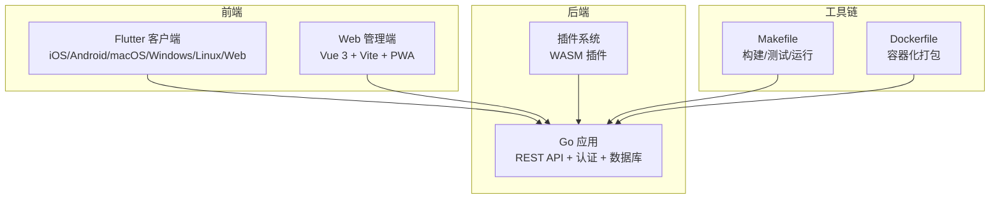
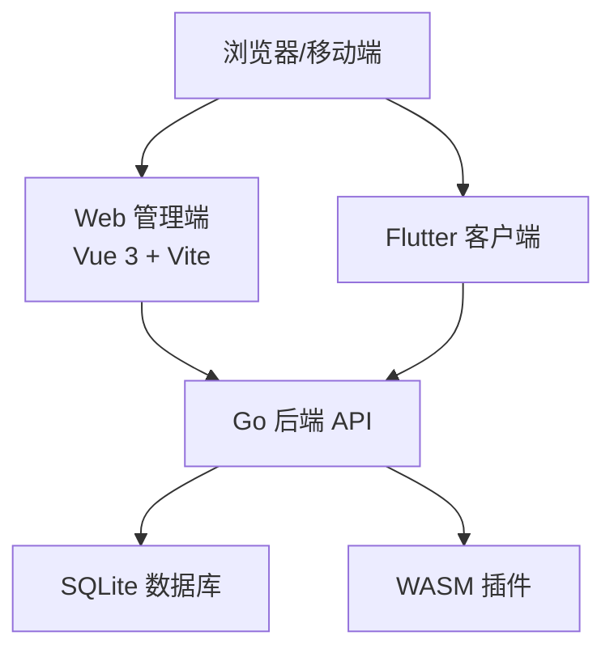
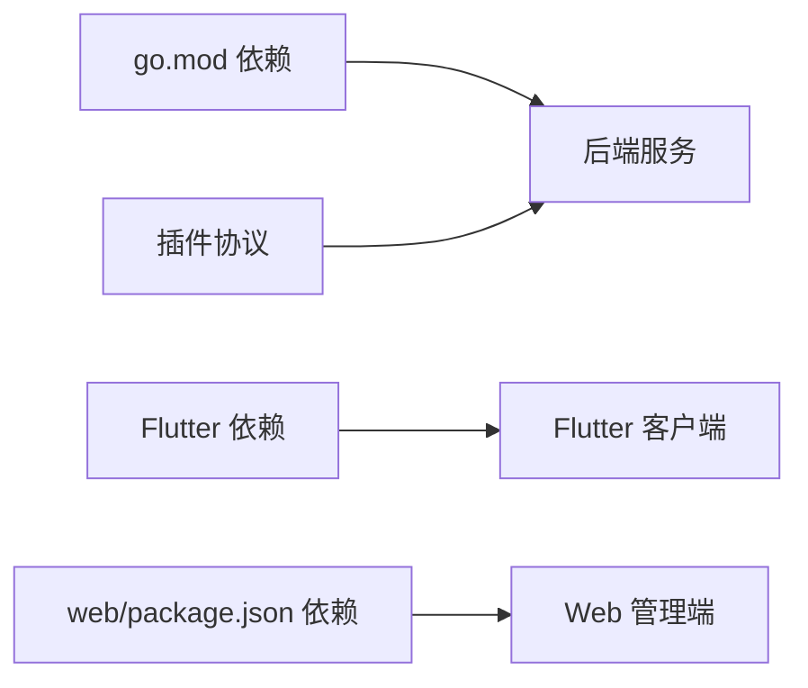

# 开发环境搭建

<cite>
**本文引用的文件**
- [README.md](file://README.md)
- [go.mod](file://go.mod)
- [Makefile](file://Makefile)
- [Dockerfile](file://Dockerfile)
- [frontend/pubspec.yaml](file://frontend/pubspec.yaml)
- [web/package.json](file://web/package.json)
- [web/tsconfig.json](file://web/tsconfig.json)
- [web/vite.config.ts](file://web/vite.config.ts)
- [frontend/analysis_options.yaml](file://frontend/analysis_options.yaml)
- [frontend/devtools_options.yaml](file://frontend/devtools_options.yaml)
</cite>

## 目录
1. [简介](#简介)
2. [项目结构](#项目结构)
3. [核心组件](#核心组件)
4. [架构总览](#架构总览)
5. [详细组件分析](#详细组件分析)
6. [依赖分析](#依赖分析)
7. [性能考虑](#性能考虑)
8. [故障排查指南](#故障排查指南)
9. [结论](#结论)
10. [附录](#附录)

## 简介
本指南面向希望在本地搭建 MiMusic 项目的开发者，涵盖系统要求、依赖安装、项目配置、开发工具推荐与配置，以及常见问题排查与不同操作系统下的特殊注意事项。项目采用 Go 作为后端、Flutter 作为跨平台客户端、Vue 3 + Vite 作为 Web 管理端，并通过 Makefile 统一管理构建与运行流程。

## 项目结构
MiMusic 采用多模块结构：
- 后端主工程：Go 模块，提供 REST API、认证、数据库、扫描与插件系统
- 前端 Flutter：跨平台客户端（iOS、Android、macOS、Windows、Linux、Web）
- Web 管理端：Vue 3 + Vite，提供 PWA、插件管理与系统配置界面
- 插件生态：Go 语言实现的 WASM 插件，通过协议与宿主交互
- Docker：提供容器化构建与运行

图表来源
- [README.md: 398-441:398-441](file://README.md#L398-L441)
- [frontend/pubspec.yaml: 1-60:1-60](file://frontend/pubspec.yaml#L1-L60)
- [web/package.json: 1-35:1-35](file://web/package.json#L1-L35)
- [Dockerfile: 1-77:1-77](file://Dockerfile#L1-L77)

章节来源
- [README.md: 398-441:398-441](file://README.md#L398-L441)

## 核心组件
- 后端服务：基于 Chi v5 路由框架，提供认证、歌曲、歌单、配置、扫描、插件、升级等接口；内置 SQLite 存储，支持 JWT 双 Token 认证。
- Flutter 客户端：统一的状态管理与路由，支持音频播放、权限管理、本地存储、WebView 加载插件页面。
- Web 管理端：Vue 3 + Vite，提供 PWA、插件管理、配置管理、升级管理等界面。
- 插件系统：基于 WebAssembly 的插件架构，支持动态扩展。
- 构建与运行：Makefile 提供一键构建、测试、运行、Swagger 文档生成；Dockerfile 提供容器化打包与运行。

章节来源
- [README.md: 19-38:19-38](file://README.md#L19-L38)
- [go.mod: 5-21:5-21](file://go.mod#L5-L21)
- [frontend/pubspec.yaml: 11-52:11-52](file://frontend/pubspec.yaml#L11-L52)
- [web/package.json: 14-33:14-33](file://web/package.json#L14-L33)

## 架构总览
后端通过 REST API 与前端交互，Web 管理端在独立部署模式下需在登录页配置后端地址；开发模式下通过 Vite 代理转发到后端。Flutter 客户端通过 WebView 加载插件页面并与后端通信。

图表来源
- [web/vite.config.ts: 163-182:163-182](file://web/vite.config.ts#L163-L182)
- [README.md: 257-278:257-278](file://README.md#L257-L278)

章节来源
- [web/vite.config.ts: 163-182:163-182](file://web/vite.config.ts#L163-L182)
- [README.md: 257-278:257-278](file://README.md#L257-L278)

## 详细组件分析

### 系统要求与版本约束
- Go 版本：项目要求 Go 1.26 或更高版本；Makefile 中记录了 Go 版本需求与运行时版本检查。
- Flutter SDK：前端 pubspec 指定 Flutter 最低版本与 Dart SDK 版本范围。
- Node.js 与包管理：Web 管理端使用 Vite + TypeScript，package.json 定义了脚本与依赖；项目未直接使用 Bun，但 Makefile 中存在构建 Nuxt Web 前端的脚本，表明可选使用 Bun。
- Docker：Dockerfile 基于 golang:1.26-alpine，提供完整的构建与运行环境。

章节来源
- [README.md: 21-23:21-23](file://README.md#L21-L23)
- [go.mod: 3](file://go.mod#L3)
- [Makefile: 4](file://Makefile#L4)
- [frontend/pubspec.yaml: 7-9:7-9](file://frontend/pubspec.yaml#L7-L9)
- [web/package.json: 1-35:1-35](file://web/package.json#L1-L35)
- [Dockerfile: 4](file://Dockerfile#L4)

### 依赖安装步骤
- Go 模块依赖
  - 使用 Makefile 下载与整理依赖：执行 make deps 与 make tidy。
  - Docker 构建阶段也会自动下载依赖并缓存模块。
- Flutter 依赖
  - 在 frontend 目录执行依赖安装（通常为 flutter pub get，可在 IDE 中完成）。
  - 项目提供 analysis_options.yaml 与 devtools_options.yaml，便于统一代码风格与 DevTools 配置。
- 前端包依赖（Web 管理端）
  - 在 web 目录执行包安装（如 npm install 或 yarn），项目使用 Vite + Vue + TypeScript + PWA 插件。
  - package.json 定义了开发与构建脚本，包括 dev、build、build:standalone、preview 等。

章节来源
- [Makefile: 268-278:268-278](file://Makefile#L268-L278)
- [Dockerfile: 22-28:22-28](file://Dockerfile#L22-L28)
- [frontend/analysis_options.yaml: 1-16:1-16](file://frontend/analysis_options.yaml#L1-L16)
- [frontend/devtools_options.yaml: 1-4:1-4](file://frontend/devtools_options.yaml#L1-L4)
- [web/package.json: 5-13:5-13](file://web/package.json#L5-L13)

### 项目配置方法
- 端口与数据库路径
  - 命令行参数：-port、-db。
  - 环境变量：LISTEN_PORT、DB_PATH。
  - 优先级：命令行参数高于环境变量。
- 认证与管理员账户
  - 默认管理员用户名与密码可通过命令行或环境变量设置；Docker 环境默认环境变量已预设。
- Swagger 文档
  - 开发环境构建包含 Swagger UI；通过 make swagger 生成/更新文档；访问地址为 http://localhost:58091/swagger/index.html。
- Web 管理端代理与独立部署
  - 开发模式下，Vite 代理将 /api、/music、/cover 请求转发到后端；独立部署模式下需在登录页配置后端地址。
- Docker 环境变量
  - ADMIN_USERNAME、ADMIN_PASSWORD、IN_DOCKER、暴露端口 58091、卷挂载 /app/music 与 /app/data。

章节来源
- [README.md: 359-385:359-385](file://README.md#L359-L385)
- [README.md: 257-278:257-278](file://README.md#L257-L278)
- [web/vite.config.ts: 163-182:163-182](file://web/vite.config.ts#L163-L182)
- [Dockerfile: 69-76:69-76](file://Dockerfile#L69-L76)

### 开发工具推荐与配置
- IDE 设置
  - Go：使用官方 Go 插件，启用 vet、fmt、测试与覆盖率；Makefile 提供统一入口。
  - Flutter：使用 Flutter SDK 与 Dart 插件，遵循 analysis_options.yaml 规则。
  - Vue：TypeScript + Vite 工程，遵循 tsconfig.json 与 package.json 脚本。
- 调试工具
  - 后端：使用 Go 运行器或 IDE 调试；Docker 环境可映射端口 58091 进行联调。
  - 前端：Flutter DevTools（analysis_options.yaml 已开启相关扩展）；Web 管理端使用 Vite 开发服务器。
- 代码格式化与质量
  - Go：make fmt、make vet、make lint（需安装 golangci-lint）。
  - Flutter：遵循 analysis_options.yaml 规则；DevTools 扩展可辅助调试。
  - Web：Vite + TypeScript 工程，按 package.json 脚本进行构建与预览。

章节来源
- [Makefile: 242-260:242-260](file://Makefile#L242-L260)
- [frontend/analysis_options.yaml: 1-16:1-16](file://frontend/analysis_options.yaml#L1-L16)
- [frontend/devtools_options.yaml: 1-4:1-4](file://frontend/devtools_options.yaml#L1-L4)
- [web/tsconfig.json: 1-38:1-38](file://web/tsconfig.json#L1-L38)
- [web/package.json: 5-13:5-13](file://web/package.json#L5-L13)

### 不同操作系统下的特殊配置
- macOS
  - 安装 Flutter SDK 与 Xcode 命令行工具；安装 SQLite（项目使用纯 Go 实现，无需额外配置）。
  - 如需使用 Docker，安装 Docker Desktop 并配置镜像加速（项目提供脚本）。
- Windows
  - 安装 Flutter SDK 与 Visual Studio Code；安装 Go 1.26+；安装 Git 以便拉取子模块。
  - 如需使用 Docker，安装 Docker Desktop 并配置镜像加速。
- Linux
  - 安装 Flutter SDK、Go 1.26+、Git；如需音频分析，安装 ffmpeg（ffprobe）。
  - Docker 使用官方镜像，按需配置镜像加速。

章节来源
- [README.md: 21-23:21-23](file://README.md#L21-L23)
- [README.md: 153-170:153-170](file://README.md#L153-L170)

## 依赖分析
- Go 模块依赖
  - 核心依赖：Chi v5、JWT、SQLite（modernc.org/sqlite）、WASM 运行时（wazero）、Swagger 工具链等。
  - 项目通过 go.mod 管理依赖，并在 Docker 构建阶段下载与校验。
- 前端依赖
  - Flutter：Riverpod、GoRouter、Dio、just_audio、permission_handler、shared_preferences 等。
  - Web：Vue 3、Pinia、Vue Router、Axios、Vite + PWA 插件、TailwindCSS、TypeScript 等。
- 插件生态
  - 通过 go-plugin 与 go-plugin-http 协议与宿主通信；插件以 .wasm 或 .zip 形式上传。

图表来源
- [go.mod: 5-21:5-21](file://go.mod#L5-L21)
- [frontend/pubspec.yaml: 11-52:11-52](file://frontend/pubspec.yaml#L11-L52)
- [web/package.json: 14-33:14-33](file://web/package.json#L14-L33)

章节来源
- [go.mod: 5-21:5-21](file://go.mod#L5-L21)
- [frontend/pubspec.yaml: 11-52:11-52](file://frontend/pubspec.yaml#L11-L52)
- [web/package.json: 14-33:14-33](file://web/package.json#L14-L33)

## 性能考虑
- 构建优化
  - Docker 构建使用缓存挂载（GOCACHE、GOMODCACHE）提升编译速度；可选使用 UPX 压缩二进制文件。
  - Vite 构建启用 PWA 与缓存策略，区分插件静态资源、API、静态资源与媒体资源的缓存策略。
- 运行时优化
  - SQLite 为纯 Go 实现，无需 CGO，减少部署复杂度。
  - Web 管理端通过 Workbox 的导航回退与运行时缓存策略优化用户体验。

章节来源
- [Dockerfile: 33-43:33-43](file://Dockerfile#L33-L43)
- [web/vite.config.ts: 37-99:37-99](file://web/vite.config.ts#L37-L99)

## 故障排查指南
- Go 版本不匹配
  - 症状：编译报错或版本检查失败。
  - 处理：使用 make version 检查当前版本，确保满足 Go 1.26+ 要求。
- Swagger 文档生成失败
  - 症状：执行 make swagger 报错提示未安装 swag。
  - 处理：按提示安装 swag，然后重新生成。
- 端口占用
  - 症状：启动后端服务提示端口冲突。
  - 处理：通过 -port 或 LISTEN_PORT 指定其他端口。
- Docker 构建网络问题
  - 症状：国内网络环境下构建缓慢或失败。
  - 处理：使用项目提供的镜像加速脚本配置 Docker Buildx。
- Web 管理端代理问题
  - 症状：开发模式下 API 404 或跨域。
  - 处理：确认 Vite 代理配置是否正确；独立部署模式下在登录页配置后端地址。
- Flutter 依赖安装失败
  - 症状：flutter pub get 失败。
  - 处理：检查网络与 Flutter SDK；必要时使用镜像源或代理。

章节来源
- [Makefile: 262-267:262-267](file://Makefile#L262-L267)
- [Makefile: 295-303:295-303](file://Makefile#L295-L303)
- [README.md: 153-170:153-170](file://README.md#L153-L170)
- [web/vite.config.ts: 163-182:163-182](file://web/vite.config.ts#L163-L182)

## 结论
通过本指南，您可以在不同操作系统上快速搭建 MiMusic 的开发环境。建议优先使用 Makefile 提供的一键命令完成依赖安装、构建与运行；在开发模式下结合 Swagger 文档与 Vite 代理提升调试效率；在生产环境使用 Docker 容器化部署并配置镜像加速以提高构建稳定性。

## 附录
- 常用命令速查
  - 查看帮助：make help
  - 下载依赖：make deps
  - 整理依赖：make tidy
  - 开发构建：make build
  - 生产构建：make build-prod
  - 运行开发服务：make run
  - 运行生产服务：make run-prod
  - 生成 Swagger：make swagger
  - 清理产物：make clean
  - Docker 构建：make docker-build
  - Docker 运行：make docker-run

章节来源
- [README.md: 42-76:42-76](file://README.md#L42-L76)
- [Makefile: 34-324:34-324](file://Makefile#L34-L324)