# 数据库操作指南

<cite>
**本文档引用的文件**
- [database.go](file://internal/database/database.go)
- [sqlite.go](file://internal/database/sqlite.go)
- [db.go](file://internal/database/sqlc/db.go)
- [sqlc.yaml](file://sqlc.yaml)
- [0001_init.sql](file://internal/database/migrations/0001_init.sql)
- [0002_scan_auto_create_include_subdirs.sql](file://internal/database/migrations/0002_scan_auto_create_include_subdirs.sql)
- [unit_of_work.go](file://internal/database/unit_of_work.go)
- [song_repository.go](file://internal/database/song_repository.go)
- [playlist_repository.go](file://internal/database/playlist_repository.go)
- [playlist_song_repository.go](file://internal/database/playlist_song_repository.go)
- [config_repository.go](file://internal/database/config_repository.go)
- [songs.sql](file://internal/database/queries/songs.sql)
- [playlists.sql](file://internal/database/queries/playlists.sql)
- [playlist_songs.sql](file://internal/database/queries/playlist_songs.sql)
- [configs.sql](file://internal/database/queries/configs.sql)
- [errors.go](file://internal/database/errors.go)
- [song_service.go](file://internal/services/song_service.go)
- [config_service.go](file://internal/services/config_service.go)
- [settings_provider.dart](file://frontend/lib/features/settings/presentation/providers/settings_provider.dart)
</cite>

## 更新摘要
**变更内容**
- 新增了 `scan_auto_create_include_subdirs` 配置迁移文件
- 更新了配置项说明和使用场景
- 添加了配置迁移版本号更新
- 增加了配置服务的布尔值处理机制说明

## 目录
1. [简介](#简介)
2. [项目结构](#项目结构)
3. [核心组件](#核心组件)
4. [架构概览](#架构概览)
5. [详细组件分析](#详细组件分析)
6. [配置管理系统](#配置管理系统)
7. [依赖关系分析](#依赖关系分析)
8. [性能考虑](#性能考虑)
9. [故障排除指南](#故障排除指南)
10. [结论](#结论)

## 简介

本指南详细介绍了 mimusic 项目中的数据库操作架构和实现细节。该项目采用 SQLite 作为主要数据库存储，结合 sqlc 自动生成的类型安全查询代码，以及 squirrel 构建的动态查询构建器，实现了高效、可靠的音乐数据管理功能。

数据库系统围绕以下核心概念构建：
- **仓储模式**：每个实体类型都有专门的仓储类负责数据访问
- **事务管理**：通过 UnitOfWork 实现跨表原子操作
- **类型安全**：使用 sqlc 生成强类型查询方法
- **动态查询**：使用 squirrel 构建灵活的查询条件
- **配置管理**：通过 configs 表管理应用配置项

## 项目结构

数据库相关代码主要位于 `internal/database` 目录下，采用清晰的分层架构：

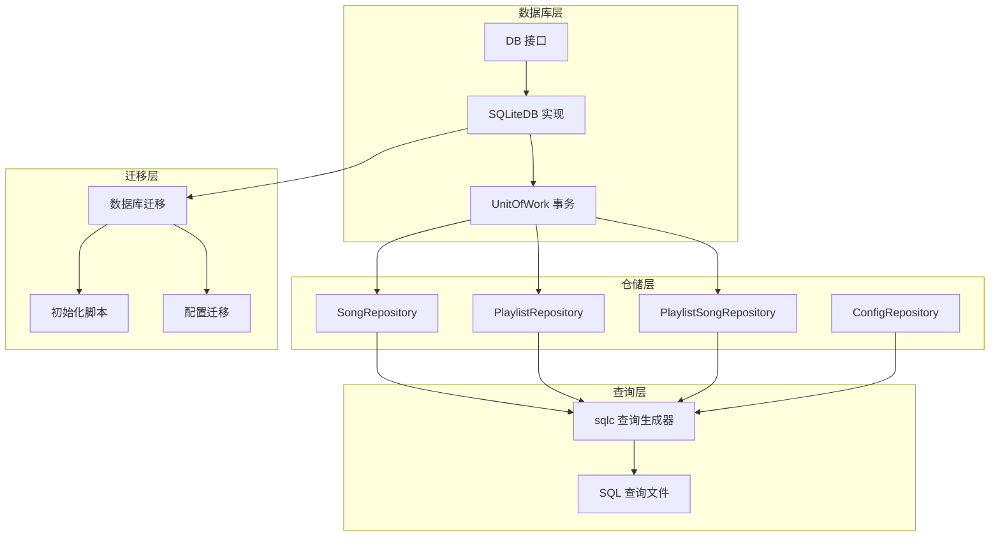
```mermaid
graph TB
subgraph "数据库层"
DB[DB 接口]
SQLiteDB[SQLiteDB 实现]
UnitOfWork[UnitOfWork 事务]
end
subgraph "仓储层"
SongRepo[SongRepository]
PlaylistRepo[PlaylistRepository]
PSRepo[PlaylistSongRepository]
ConfigRepo[ConfigRepository]
end
subgraph "查询层"
SQLC[sqlc 查询生成器]
Queries[SQL 查询文件]
end
subgraph "迁移层"
Migrations[数据库迁移]
InitSQL[初始化脚本]
ConfigMigration[配置迁移]
end
DB --> SQLiteDB
SQLiteDB --> UnitOfWork
UnitOfWork --> SongRepo
UnitOfWork --> PlaylistRepo
UnitOfWork --> PSRepo
SongRepo --> SQLC
PlaylistRepo --> SQLC
PSRepo --> SQLC
ConfigRepo --> SQLC
SQLC --> Queries
SQLiteDB --> Migrations
Migrations --> InitSQL
Migrations --> ConfigMigration
```

**图表来源**
- [database.go:7-21](file://internal/database/database.go#L7-L21)
- [sqlite.go:19-24](file://internal/database/sqlite.go#L19-L24)
- [unit_of_work.go:3-10](file://internal/database/unit_of_work.go#L3-L10)
- [0002_scan_auto_create_include_subdirs.sql:1-7](file://internal/database/migrations/0002_scan_auto_create_include_subdirs.sql#L1-L7)

**章节来源**
- [database.go:1-28](file://internal/database/database.go#L1-L28)
- [sqlite.go:1-133](file://internal/database/sqlite.go#L1-L133)
- [sqlc.yaml:1-17](file://sqlc.yaml#L1-L17)

## 核心组件

### 数据库接口层

数据库接口定义了统一的数据访问抽象，支持事务管理和多种仓储类型的访问：

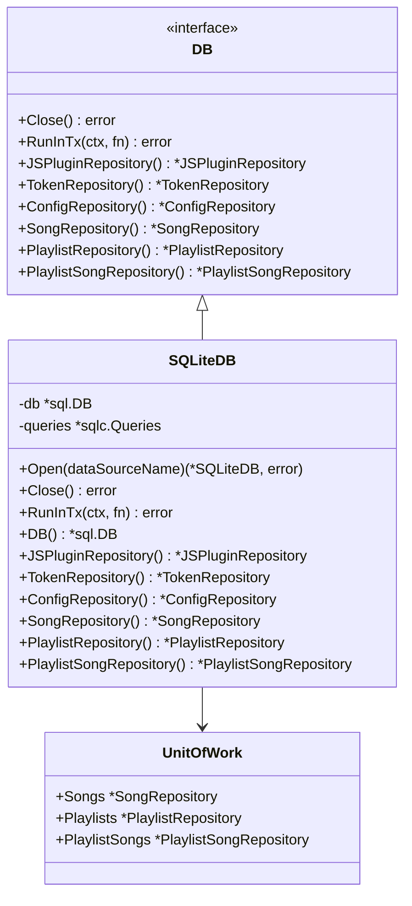
```mermaid
classDiagram
class DB {
<<interface>>
+Close() error
+RunInTx(ctx, fn) error
+JSPluginRepository() *JSPluginRepository
+TokenRepository() *TokenRepository
+ConfigRepository() *ConfigRepository
+SongRepository() *SongRepository
+PlaylistRepository() *PlaylistRepository
+PlaylistSongRepository() *PlaylistSongRepository
}
class SQLiteDB {
-db *sql.DB
-queries *sqlc.Queries
+Open(dataSourceName) (*SQLiteDB, error)
+Close() error
+RunInTx(ctx, fn) error
+DB() *sql.DB
+JSPluginRepository() *JSPluginRepository
+TokenRepository() *TokenRepository
+ConfigRepository() *ConfigRepository
+SongRepository() *SongRepository
+PlaylistRepository() *PlaylistRepository
+PlaylistSongRepository() *PlaylistSongRepository
}
class UnitOfWork {
+Songs *SongRepository
+Playlists *PlaylistRepository
+PlaylistSongs *PlaylistSongRepository
}
DB <|-- SQLiteDB
SQLiteDB --> UnitOfWork
```

**图表来源**
- [database.go:8-21](file://internal/database/database.go#L8-L21)
- [sqlite.go:19-55](file://internal/database/sqlite.go#L19-L55)
- [unit_of_work.go:3-10](file://internal/database/unit_of_work.go#L3-L10)

### 仓储模式实现

每个实体都实现了专门的仓储类，提供类型化的数据访问方法：

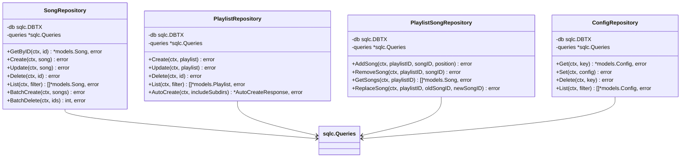
```mermaid
classDiagram
class SongRepository {
-db sqlc.DBTX
-queries *sqlc.Queries
+GetByID(ctx, id) *models.Song, error
+Create(ctx, song) error
+Update(ctx, song) error
+Delete(ctx, id) error
+List(ctx, filter) []*models.Song, error
+BatchCreate(ctx, songs) error
+BatchDelete(ctx, ids) int, error
}
class PlaylistRepository {
-db sqlc.DBTX
-queries *sqlc.Queries
+Create(ctx, playlist) error
+Update(ctx, playlist) error
+Delete(ctx, id) error
+List(ctx, filter) []*models.Playlist, error
+AutoCreate(ctx, includeSubdirs) *AutoCreateResponse, error
}
class PlaylistSongRepository {
-db sqlc.DBTX
-queries *sqlc.Queries
+AddSong(ctx, playlistID, songID, position) error
+RemoveSong(ctx, playlistID, songID) error
+GetSongs(ctx, playlistID) []*models.Song, error
+ReplaceSong(ctx, playlistID, oldSongID, newSongID) error
}
class ConfigRepository {
-db sqlc.DBTX
-queries *sqlc.Queries
+Get(ctx, key) *models.Config, error
+Set(ctx, config) error
+Delete(ctx, key) error
+List(ctx, filter) []*models.Config, error
}
SongRepository --> sqlc.Queries
PlaylistRepository --> sqlc.Queries
PlaylistSongRepository --> sqlc.Queries
ConfigRepository --> sqlc.Queries
```

**图表来源**
- [song_repository.go:16-448](file://internal/database/song_repository.go#L16-L448)
- [playlist_repository.go:22-751](file://internal/database/playlist_repository.go#L22-L751)
- [playlist_song_repository.go:13-182](file://internal/database/playlist_song_repository.go#L13-L182)
- [config_repository.go:15-122](file://internal/database/config_repository.go#L15-L122)

**章节来源**
- [database.go:7-28](file://internal/database/database.go#L7-L28)
- [sqlite.go:79-133](file://internal/database/sqlite.go#L79-L133)
- [unit_of_work.go:1-11](file://internal/database/unit_of_work.go#L1-L11)

## 架构概览

数据库系统采用分层架构设计，确保了良好的关注点分离和可维护性：

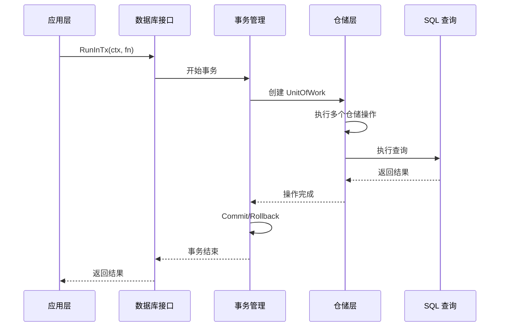
```mermaid
sequenceDiagram
participant App as 应用层
participant DB as 数据库接口
participant Tx as 事务管理
participant Repo as 仓储层
participant SQL as SQL 查询
App->>DB : RunInTx(ctx, fn)
DB->>Tx : 开始事务
Tx->>Repo : 创建 UnitOfWork
Repo->>Repo : 执行多个仓储操作
Repo->>SQL : 执行查询
SQL-->>Repo : 返回结果
Repo-->>Tx : 操作完成
Tx->>Tx : Commit/Rollback
Tx-->>DB : 事务结束
DB-->>App : 返回结果
```

**图表来源**
- [sqlite.go:79-102](file://internal/database/sqlite.go#L79-L102)
- [unit_of_work.go:3-10](file://internal/database/unit_of_work.go#L3-L10)

### 数据模型关系

系统的核心数据模型包括歌曲、歌单和播放列表关系：

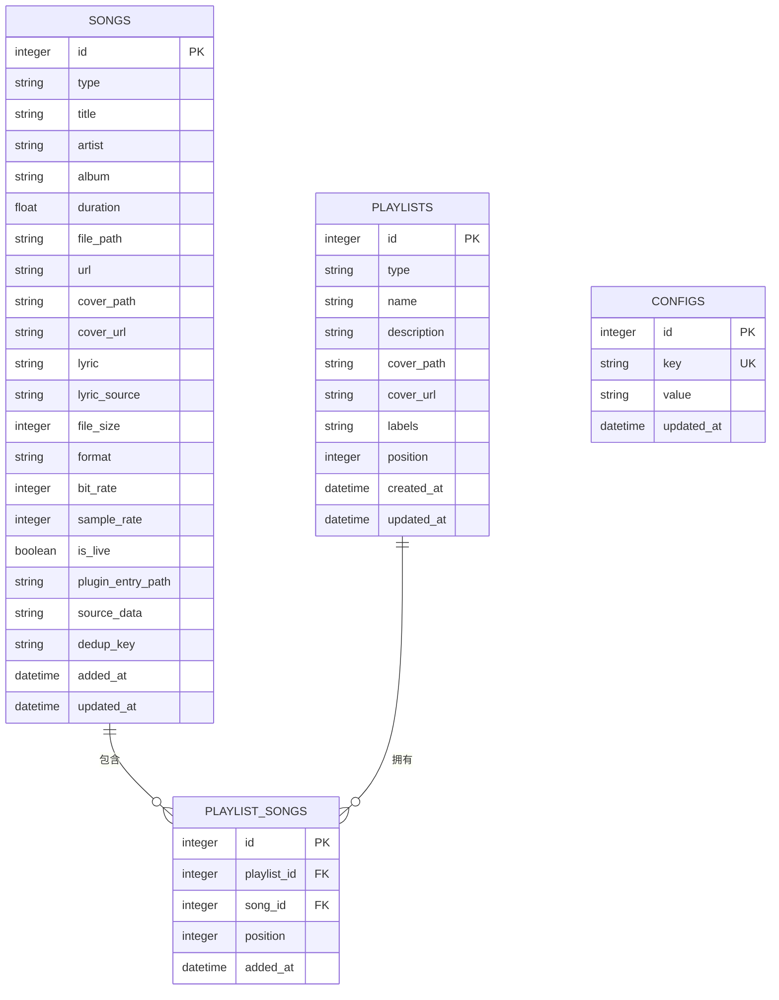
```mermaid
erDiagram
SONGS {
integer id PK
string type
string title
string artist
string album
float duration
string file_path
string url
string cover_path
string cover_url
string lyric
string lyric_source
integer file_size
string format
integer bit_rate
integer sample_rate
boolean is_live
string plugin_entry_path
string source_data
string dedup_key
datetime added_at
datetime updated_at
}
PLAYLISTS {
integer id PK
string type
string name
string description
string cover_path
string cover_url
string labels
integer position
datetime created_at
datetime updated_at
}
PLAYLIST_SONGS {
integer id PK
integer playlist_id FK
integer song_id FK
integer position
datetime added_at
}
CONFIGS {
integer id PK
string key UK
string value
datetime updated_at
}
SONGS ||--o{ PLAYLIST_SONGS : "包含"
PLAYLISTS ||--o{ PLAYLIST_SONGS : "拥有"
```

**图表来源**
- [0001_init.sql:3-102](file://internal/database/migrations/0001_init.sql#L3-L102)

**章节来源**
- [0001_init.sql:1-191](file://internal/database/migrations/0001_init.sql#L1-L191)

## 详细组件分析

### SQLite 数据库连接管理

SQLiteDB 实现了数据库连接的完整生命周期管理，包括连接池配置和迁移执行：

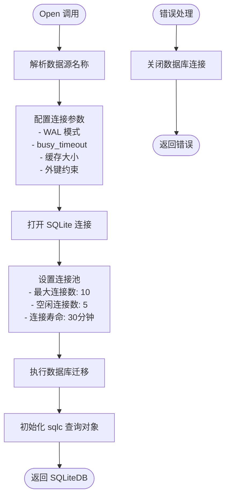
```mermaid
flowchart TD
Start([Open 调用]) --> ParseDSN["解析数据源名称"]
ParseDSN --> Configure["配置连接参数<br/>- WAL 模式<br/>- busy_timeout<br/>- 缓存大小<br/>- 外键约束"]
Configure --> OpenDB["打开 SQLite 连接"]
OpenDB --> SetPool["设置连接池<br/>- 最大连接数: 10<br/>- 空闲连接数: 5<br/>- 连接寿命: 30分钟"]
SetPool --> RunMigrations["执行数据库迁移"]
RunMigrations --> CreateQueries["初始化 sqlc 查询对象"]
CreateQueries --> Return([返回 SQLiteDB])
Error([错误处理]) --> CloseDB["关闭数据库连接"]
CloseDB --> ReturnError([返回错误])
```

**图表来源**
- [sqlite.go:26-55](file://internal/database/sqlite.go#L26-L55)

#### 连接配置优化

数据库连接采用了多项性能优化配置：

| 配置项 | 值 | 作用 | 性能影响 |
|--------|-----|------|----------|
| journal_mode | WAL | 允许读写并发 | 显著提升并发性能 |
| busy_timeout | 10000ms | 遇到锁等待时间 | 减少 SQLITE_BUSY 错误 |
| synchronous | NORMAL | WAL 模式下的安全级别 | 平衡安全性与性能 |
| cache_size | 10000 | 页缓存大小约40MB | 提升查询性能 |
| foreign_keys | 1 | 启用外键约束 | 确保数据完整性 |

**章节来源**
- [sqlite.go:28-55](file://internal/database/sqlite.go#L28-L55)

### 事务管理机制

UnitOfWork 提供了跨表原子操作的能力，确保复杂业务逻辑的一致性：

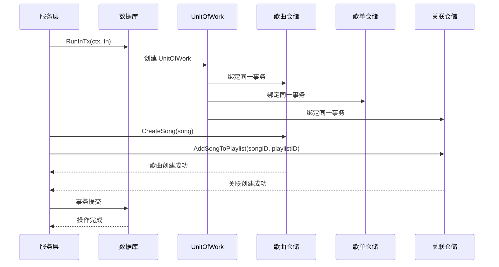
```mermaid
sequenceDiagram
participant Service as 服务层
participant DB as 数据库
participant UOW as UnitOfWork
participant SongRepo as 歌曲仓储
participant PlaylistRepo as 歌单仓储
participant PSRepo as 关联仓储
Service->>DB : RunInTx(ctx, fn)
DB->>UOW : 创建 UnitOfWork
UOW->>SongRepo : 绑定同一事务
UOW->>PlaylistRepo : 绑定同一事务
UOW->>PSRepo : 绑定同一事务
Service->>SongRepo : CreateSong(song)
Service->>PSRepo : AddSongToPlaylist(songID, playlistID)
SongRepo-->>Service : 歌曲创建成功
PSRepo-->>Service : 关联创建成功
Service->>DB : 事务提交
DB-->>Service : 操作完成
```

**图表来源**
- [sqlite.go:79-102](file://internal/database/sqlite.go#L79-L102)
- [unit_of_work.go:3-10](file://internal/database/unit_of_work.go#L3-L10)

#### 事务边界控制

事务管理遵循以下原则：

1. **自动事务管理**：对于底层为 `*sql.DB` 的操作，仓储会自动开始和提交事务
2. **嵌套事务避免**：如果已经在事务中，仓储会复用现有事务，避免嵌套事务
3. **异常安全**：使用 defer 和 recover 机制确保异常时正确回滚
4. **性能优化**：批量操作自动合并到单个事务中执行

**章节来源**
- [playlist_repository.go:435-459](file://internal/database/playlist_repository.go#L435-L459)
- [playlist_song_repository.go:162-181](file://internal/database/playlist_song_repository.go#L162-L181)

### 歌曲管理仓储

SongRepository 提供了完整的歌曲数据管理功能：

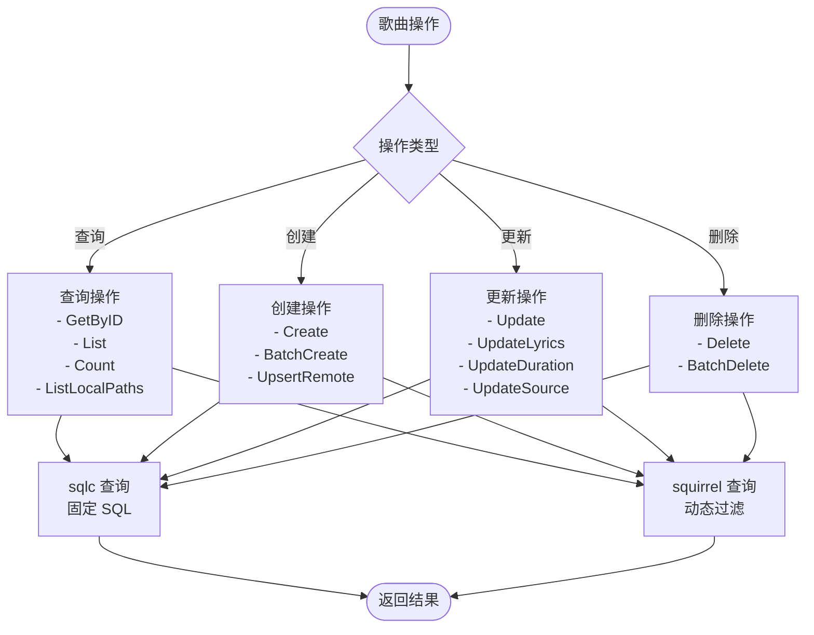
```mermaid
flowchart TD
Start([歌曲操作]) --> Type{"操作类型"}
Type --> |查询| QueryOps["查询操作<br/>- GetByID<br/>- List<br/>- Count<br/>- ListLocalPaths"]
Type --> |创建| CreateOps["创建操作<br/>- Create<br/>- BatchCreate<br/>- UpsertRemote"]
Type --> |更新| UpdateOps["更新操作<br/>- Update<br/>- UpdateLyrics<br/>- UpdateDuration<br/>- UpdateSource"]
Type --> |删除| DeleteOps["删除操作<br/>- Delete<br/>- BatchDelete"]
QueryOps --> SQLC["sqlc 查询<br/>固定 SQL"]
CreateOps --> SQLC
UpdateOps --> SQLC
DeleteOps --> SQLC
QueryOps --> Squirrel["squirrel 查询<br/>动态过滤"]
CreateOps --> Squirrel
UpdateOps --> Squirrel
DeleteOps --> Squirrel
SQLC --> End([返回结果])
Squirrel --> End
```

**图表来源**
- [song_repository.go:16-448](file://internal/database/song_repository.go#L16-L448)

#### 远程歌曲去重机制

系统实现了智能的远程歌曲去重策略：

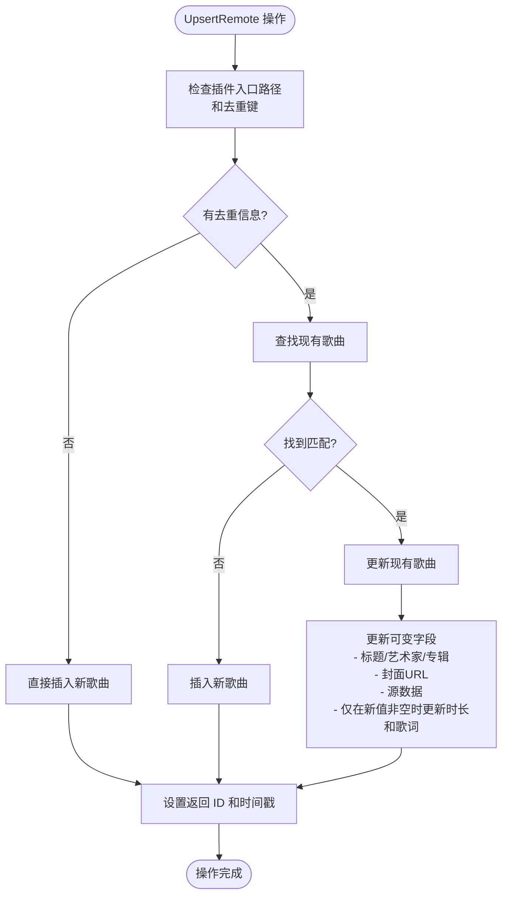
```mermaid
flowchart TD
Start([UpsertRemote 操作]) --> CheckKeys["检查插件入口路径<br/>和去重键"]
CheckKeys --> HasKeys{"有去重信息?"}
HasKeys --> |否| DirectInsert["直接插入新歌曲"]
HasKeys --> |是| FindExisting["查找现有歌曲"]
FindExisting --> Found{"找到匹配?"}
Found --> |否| InsertNew["插入新歌曲"]
Found --> |是| UpdateExisting["更新现有歌曲"]
UpdateExisting --> UpdateFields["更新可变字段<br/>- 标题/艺术家/专辑<br/>- 封面URL<br/>- 源数据<br/>- 仅在新值非空时更新时长和歌词"]
UpdateFields --> SetID["设置返回 ID 和时间戳"]
DirectInsert --> SetID
InsertNew --> SetID
SetID --> End([操作完成])
```

**图表来源**
- [song_repository.go:156-200](file://internal/database/song_repository.go#L156-L200)

**章节来源**
- [song_repository.go:156-200](file://internal/database/song_repository.go#L156-L200)
- [songs.sql:52-65](file://internal/database/queries/songs.sql#L52-L65)

### 歌单管理仓储

PlaylistRepository 实现了复杂的歌单管理功能：

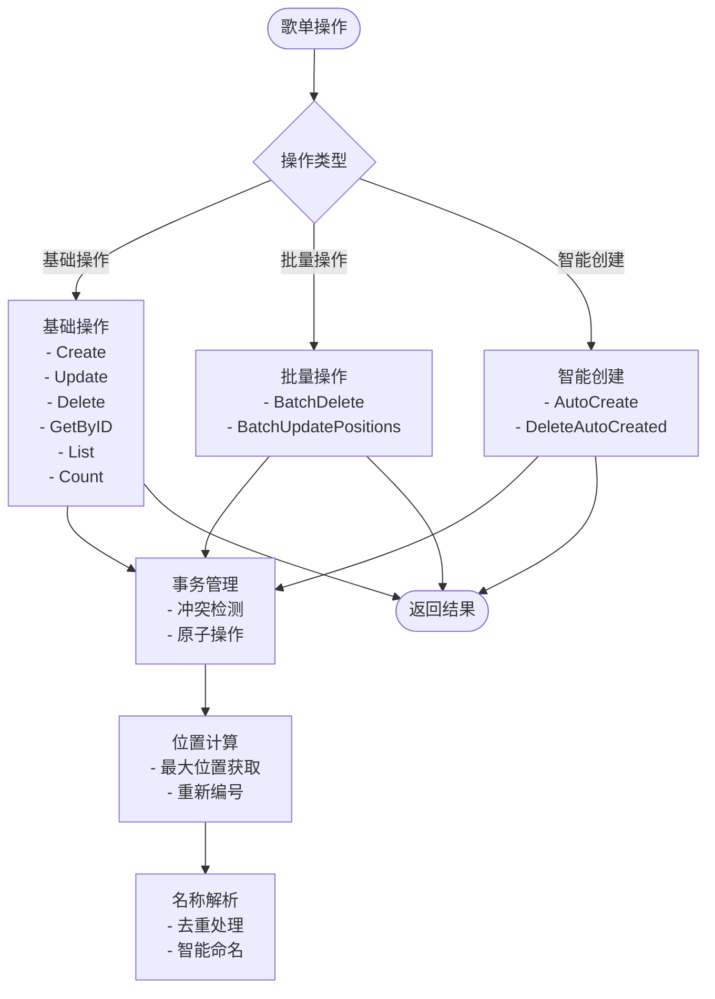
```mermaid
flowchart TD
Start([歌单操作]) --> Type{"操作类型"}
Type --> |基础操作| BasicOps["基础操作<br/>- Create<br/>- Update<br/>- Delete<br/>- GetByID<br/>- List<br/>- Count"]
Type --> |批量操作| BatchOps["批量操作<br/>- BatchDelete<br/>- BatchUpdatePositions"]
Type --> |智能创建| AutoCreate["智能创建<br/>- AutoCreate<br/>- DeleteAutoCreated"]
BasicOps --> Transaction["事务管理<br/>- 冲突检测<br/>- 原子操作"]
AutoCreate --> Transaction
BatchOps --> Transaction
Transaction --> PositionCalc["位置计算<br/>- 最大位置获取<br/>- 重新编号"]
PositionCalc --> NameResolve["名称解析<br/>- 去重处理<br/>- 智能命名"]
BasicOps --> End([返回结果])
BatchOps --> End
AutoCreate --> End
```

**图表来源**
- [playlist_repository.go:22-751](file://internal/database/playlist_repository.go#L22-L751)

#### 自动创建歌单算法

系统提供了智能的自动创建歌单功能：

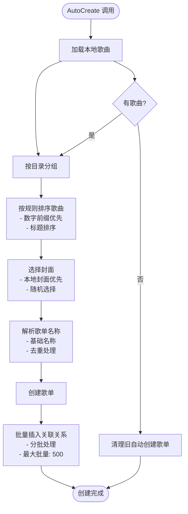
```mermaid
flowchart TD
Start([AutoCreate 调用]) --> LoadSongs["加载本地歌曲"]
LoadSongs --> GroupByDir["按目录分组"]
GroupByDir --> SortSongs["按规则排序歌曲<br/>- 数字前缀优先<br/>- 标题排序"]
SortSongs --> PickCover["选择封面<br/>- 本地封面优先<br/>- 随机选择"]
PickCover --> ResolveName["解析歌单名称<br/>- 基础名称<br/>- 去重处理"]
ResolveName --> CreatePlaylist["创建歌单"]
CreatePlaylist --> BatchInsert["批量插入关联关系<br/>- 分批处理<br/>- 最大批量: 500"]
BatchInsert --> End([创建完成])
LoadSongs --> NoSongs{"有歌曲?"}
NoSongs --> |否| CleanOld["清理旧自动创建歌单"]
CleanOld --> End
NoSongs --> |是| GroupByDir
```

**图表来源**
- [playlist_repository.go:268-421](file://internal/database/playlist_repository.go#L268-L421)

**章节来源**
- [playlist_repository.go:268-421](file://internal/database/playlist_repository.go#L268-L421)

### 关联表管理

PlaylistSongRepository 专门处理歌单和歌曲的多对多关系：

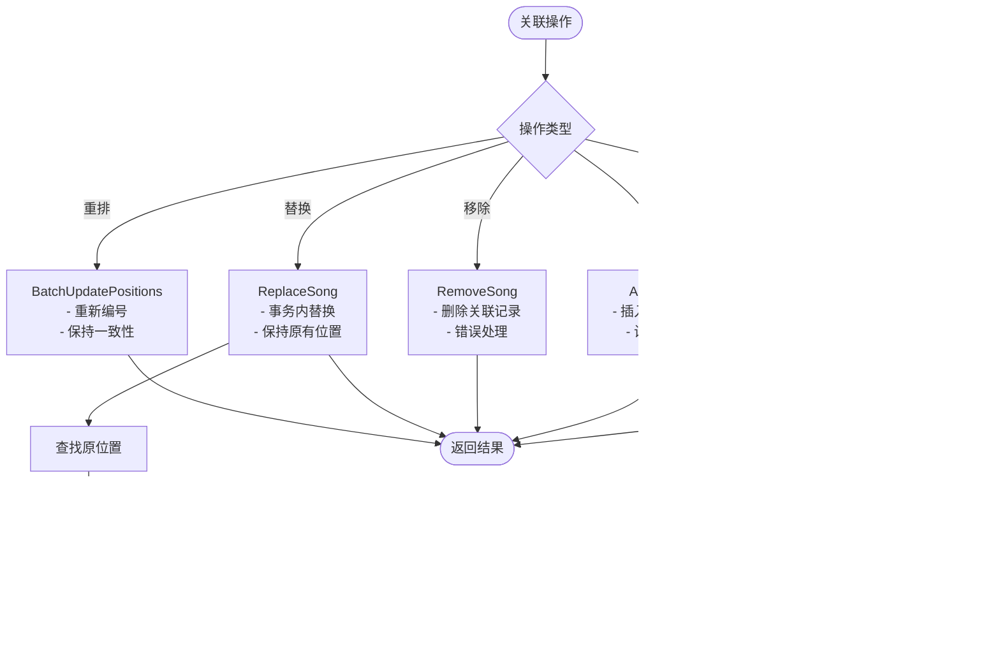
```mermaid
flowchart TD
Start([关联操作]) --> Type{"操作类型"}
Type --> |添加| AddSong["AddSong<br/>- 插入关联记录<br/>- 设置位置"]
Type --> |移除| RemoveSong["RemoveSong<br/>- 删除关联记录<br/>- 错误处理"]
Type --> |查询| QueryOps["查询操作<br/>- GetSongs<br/>- GetSongsPaginated<br/>- CountSongs<br/>- ListPlaylistsContainingSong"]
Type --> |替换| ReplaceSong["ReplaceSong<br/>- 事务内替换<br/>- 保持原有位置"]
Type --> |重排| Reorder["BatchUpdatePositions<br/>- 重新编号<br/>- 保持一致性"]
ReplaceSong --> FindPos["查找原位置"]
FindPos --> RemoveOld["移除旧关联"]
RemoveOld --> InsertNew["插入新关联"]
QueryOps --> Return([返回结果])
AddSong --> Return
RemoveSong --> Return
ReplaceSong --> Return
Reorder --> Return
```

**图表来源**
- [playlist_song_repository.go:13-182](file://internal/database/playlist_song_repository.go#L13-L182)

**章节来源**
- [playlist_song_repository.go:100-160](file://internal/database/playlist_song_repository.go#L100-L160)

## 配置管理系统

### 配置存储架构

系统通过 configs 表存储所有配置项，支持键值对形式的配置管理：

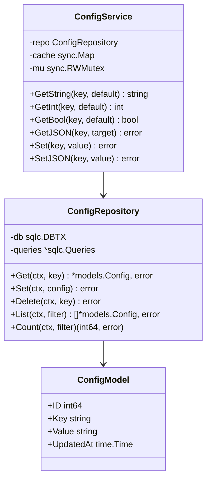
```mermaid
classDiagram
class ConfigRepository {
-db sqlc.DBTX
-queries *sqlc.Queries
+Get(ctx, key) *models.Config, error
+Set(ctx, config) error
+Delete(ctx, key) error
+List(ctx, filter) []*models.Config, error
+Count(ctx, filter) (int64, error)
}
class ConfigService {
-repo ConfigRepository
-cache sync.Map
-mu sync.RWMutex
+GetString(key, default) string
+GetInt(key, default) int
+GetBool(key, default) bool
+GetJSON(key, target) error
+Set(key, value) error
+SetJSON(key, value) error
}
class ConfigModel {
+ID int64
+Key string
+Value string
+UpdatedAt time.Time
}
ConfigRepository --> ConfigModel
ConfigService --> ConfigRepository
```

**图表来源**
- [config_repository.go:15-122](file://internal/database/config_repository.go#L15-L122)
- [config_service.go:24-90](file://internal/services/config_service.go#L24-L90)

### 配置迁移机制

系统通过 goose 迁移工具管理配置项的版本升级：

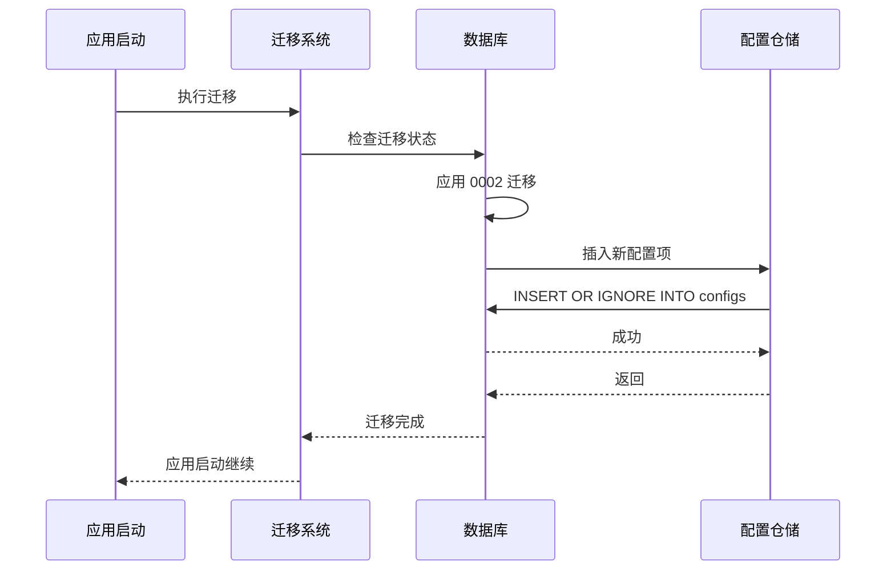
```mermaid
sequenceDiagram
participant App as 应用启动
participant Migration as 迁移系统
participant DB as 数据库
participant ConfigRepo as 配置仓储
App->>Migration : 执行迁移
Migration->>DB : 检查迁移状态
DB->>DB : 应用 0002 迁移
DB->>ConfigRepo : 插入新配置项
ConfigRepo->>DB : INSERT OR IGNORE INTO configs
DB-->>ConfigRepo : 成功
ConfigRepo-->>DB : 返回
DB-->>Migration : 迁移完成
Migration-->>App : 应用启动继续
```

**图表来源**
- [0002_scan_auto_create_include_subdirs.sql:1-7](file://internal/database/migrations/0002_scan_auto_create_include_subdirs.sql#L1-L7)

#### 新增配置项详解

**scan_auto_create_include_subdirs** 配置项用于控制扫描后自动创建歌单时的行为：

- **键名**: `scan_auto_create_include_subdirs`
- **默认值**: `false`
- **数据类型**: 布尔值（存储为字符串 "true"/"false"）
- **作用域**: 全局配置
- **使用场景**: 影响歌曲扫描后的自动歌单创建行为

**章节来源**
- [0002_scan_auto_create_include_subdirs.sql:1-7](file://internal/database/migrations/0002_scan_auto_create_include_subdirs.sql#L1-L7)
- [config_service.go:76-90](file://internal/services/config_service.go#L76-L90)
- [song_service.go:415-422](file://internal/services/song_service.go#L415-L422)

### 配置值类型处理

系统提供了多种配置值类型的处理机制：

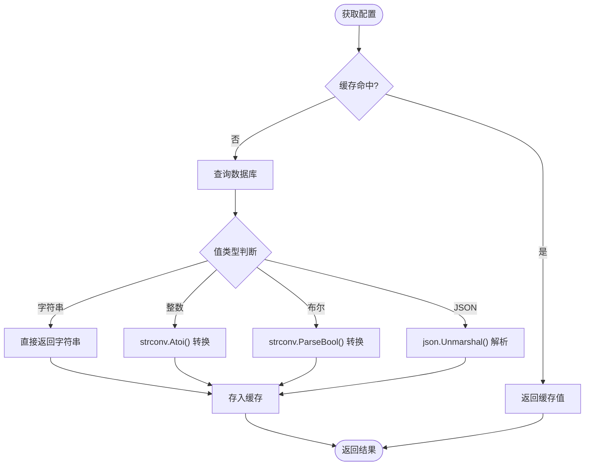
```mermaid
flowchart TD
Start([获取配置]) --> CacheCheck{"缓存命中?"}
CacheCheck --> |是| ReturnCache["返回缓存值"]
CacheCheck --> |否| DBQuery["查询数据库"]
DBQuery --> TypeCheck{"值类型判断"}
TypeCheck --> |字符串| ReturnString["直接返回字符串"]
TypeCheck --> |整数| ParseInt["strconv.Atoi() 转换"]
TypeCheck --> |布尔| ParseBool["strconv.ParseBool() 转换"]
TypeCheck --> |JSON| ParseJSON["json.Unmarshal() 解析"]
ReturnString --> CacheStore["存入缓存"]
ParseInt --> CacheStore
ParseBool --> CacheStore
ParseJSON --> CacheStore
CacheStore --> End([返回结果])
ReturnCache --> End
```

**图表来源**
- [config_service.go:38-121](file://internal/services/config_service.go#L38-L121)

**章节来源**
- [config_service.go:38-121](file://internal/services/config_service.go#L38-L121)

## 依赖关系分析

数据库系统的依赖关系清晰明确，遵循了良好的软件工程原则：

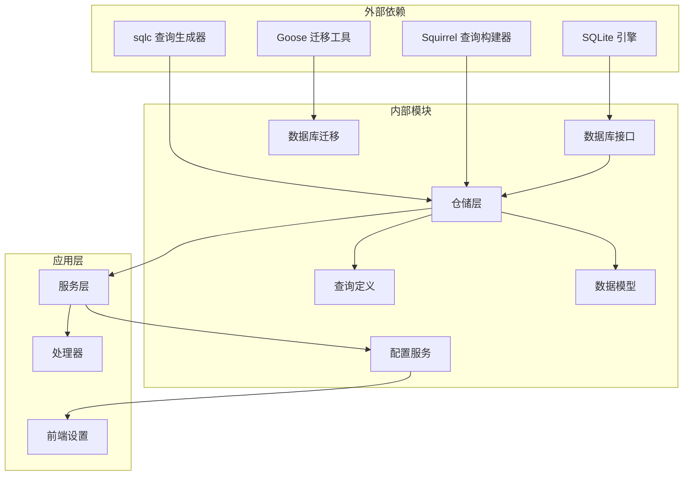
```mermaid
graph TB
subgraph "外部依赖"
SQlite[SQLite 引擎]
SQLC[sqlc 查询生成器]
Squirrel[Squirrel 查询构建器]
Goose[Goose 迁移工具]
end
subgraph "内部模块"
DBInterface[数据库接口]
Repositories[仓储层]
Queries[查询定义]
Migrations[数据库迁移]
Models[数据模型]
ConfigService[配置服务]
end
subgraph "应用层"
Services[服务层]
Handlers[处理器]
Frontend[前端设置]
end
SQlite --> DBInterface
SQLC --> Repositories
Squirrel --> Repositories
Goose --> Migrations
DBInterface --> Repositories
Repositories --> Queries
Repositories --> Models
Repositories --> Services
Services --> Handlers
Services --> ConfigService
ConfigService --> Frontend
```

**图表来源**
- [sqlite.go:3-14](file://internal/database/sqlite.go#L3-L14)
- [sqlc.yaml:2-11](file://sqlc.yaml#L2-L11)

### 数据流分析

系统中的数据流遵循以下模式：

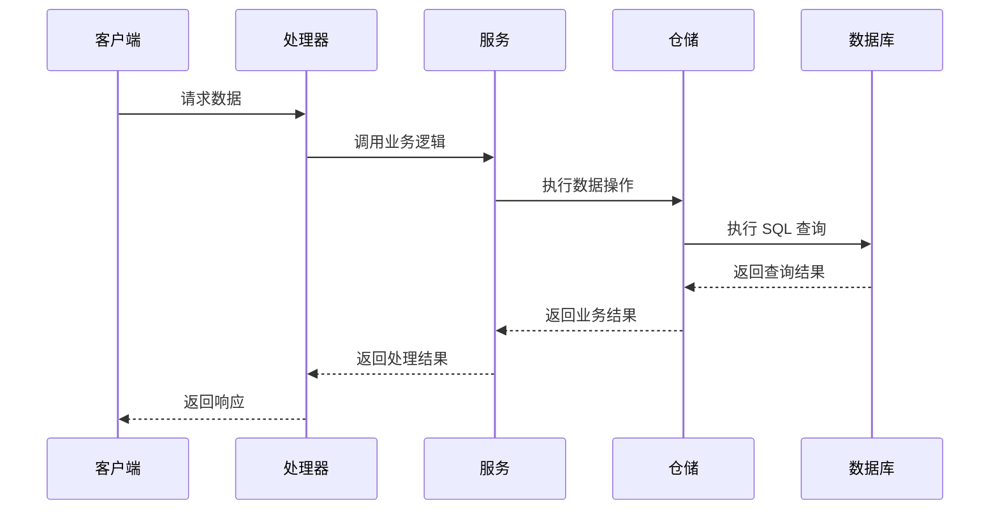
```mermaid
sequenceDiagram
participant Client as 客户端
participant Handler as 处理器
participant Service as 服务
participant Repo as 仓储
participant DB as 数据库
Client->>Handler : 请求数据
Handler->>Service : 调用业务逻辑
Service->>Repo : 执行数据操作
Repo->>DB : 执行 SQL 查询
DB-->>Repo : 返回查询结果
Repo-->>Service : 返回业务结果
Service-->>Handler : 返回处理结果
Handler-->>Client : 返回响应
```

**图表来源**
- [song_repository.go:29-38](file://internal/database/song_repository.go#L29-L38)
- [playlist_repository.go:77-89](file://internal/database/playlist_repository.go#L77-L89)

**章节来源**
- [song_repository.go:202-234](file://internal/database/song_repository.go#L202-L234)
- [playlist_repository.go:157-189](file://internal/database/playlist_repository.go#L157-L189)

## 性能考虑

### 查询优化策略

系统采用了多种查询优化技术：

1. **索引优化**：为常用查询字段建立索引
2. **查询缓存**：合理使用连接池减少连接开销
3. **批量操作**：支持批量插入和更新提高效率
4. **延迟加载**：关联数据按需加载

### 连接池配置

数据库连接池经过精心调优：

| 配置项 | 值 | 目的 |
|--------|-----|------|
| MaxOpenConns | 10 | 控制最大并发连接数 |
| MaxIdleConns | 5 | 保持空闲连接数量 |
| ConnMaxLifetime | 30min | 连接生命周期限制 |

### 内存管理

系统实现了高效的内存使用策略：

- **批量处理**：大量数据操作采用分批处理
- **延迟初始化**：查询结果按需扫描
- **资源回收**：及时释放数据库连接和结果集
- **配置缓存**：配置值缓存减少数据库查询

## 故障排除指南

### 常见错误类型

系统定义了标准的错误处理机制：

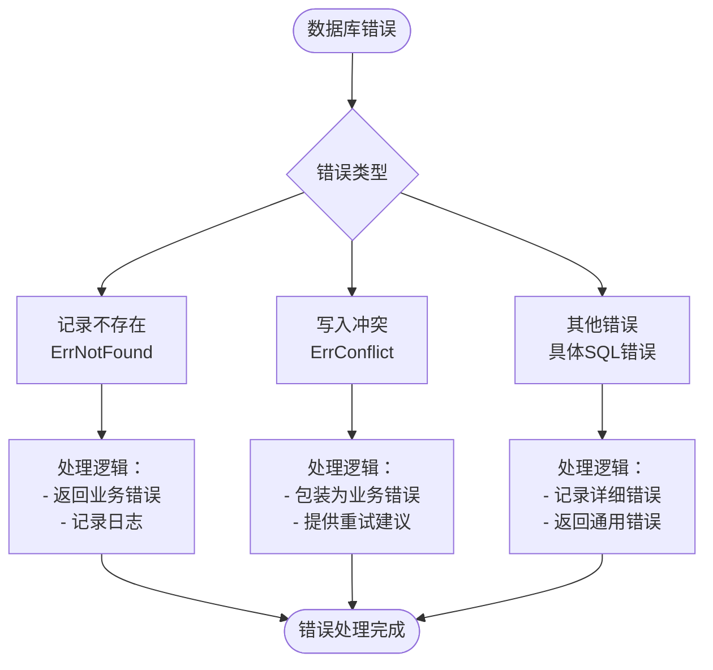
```mermaid
flowchart TD
Error([数据库错误]) --> Type{"错误类型"}
Type --> NotFound["记录不存在<br/>ErrNotFound"]
Type --> Conflict["写入冲突<br/>ErrConflict"]
Type --> Other["其他错误<br/>具体SQL错误"]
NotFound --> HandleNotFound["处理逻辑：<br/>- 返回业务错误<br>- 记录日志"]
Conflict --> HandleConflict["处理逻辑：<br/>- 包装为业务错误<br/>- 提供重试建议"]
Other --> HandleOther["处理逻辑：<br/>- 记录详细错误<br/>- 返回通用错误"]
HandleNotFound --> End([错误处理完成])
HandleConflict --> End
HandleOther --> End
```

**图表来源**
- [errors.go:5-12](file://internal/database/errors.go#L5-L12)

#### 错误处理最佳实践

1. **使用哨兵错误**：通过 `errors.Is()` 检查特定错误类型
2. **业务错误包装**：将数据库错误转换为有意义的业务错误
3. **日志记录**：详细记录错误上下文和堆栈信息
4. **重试策略**：对可恢复错误实施适当的重试机制

**章节来源**
- [errors.go:1-12](file://internal/database/errors.go#L1-L12)

### 数据库迁移问题

当遇到数据库迁移问题时，可以按照以下步骤排查：

1. **检查迁移状态**：确认迁移是否正确执行
2. **验证表结构**：确保所有表和索引都已创建
3. **测试连接**：验证数据库连接配置
4. **查看日志**：检查迁移过程中的错误信息

### 配置项问题

配置项相关的常见问题及解决方案：

1. **配置项缺失**：新安装的应用可能缺少某些配置项，需要执行迁移
2. **配置值格式错误**：布尔值必须为 "true"/"false" 字符串
3. **配置缓存失效**：修改配置后需要清除缓存或重启应用
4. **配置权限问题**：某些配置项可能需要管理员权限才能修改

**章节来源**
- [0002_scan_auto_create_include_subdirs.sql:1-7](file://internal/database/migrations/0002_scan_auto_create_include_subdirs.sql#L1-L7)

## 结论

mimusic 项目的数据库系统展现了现代 Go 应用的最佳实践：

### 设计优势

1. **清晰的分层架构**：接口抽象、仓储模式、查询生成器各司其职
2. **类型安全**：sqlc 生成的代码确保编译时类型检查
3. **高性能**：WAL 模式、连接池、批量操作等优化措施
4. **易维护性**：标准化的错误处理和日志记录
5. **可扩展性**：配置管理系统支持动态配置管理

### 技术亮点

- **事务管理**：通过 UnitOfWork 实现跨表原子操作
- **智能去重**：远程歌曲的智能去重机制
- **批量优化**：针对大数据量的操作进行了专门优化
- **查询灵活性**：sqlc 和 squirrel 的组合提供了强大的查询能力
- **配置管理**：通过 goose 迁移工具实现配置项的版本化管理

### 未来改进方向

1. **监控增强**：添加数据库性能指标监控
2. **备份策略**：实现自动备份和恢复机制
3. **查询优化**：持续分析慢查询并进行优化
4. **扩展性**：考虑支持其他数据库引擎的可能性
5. **配置热重载**：实现配置项的热重载功能

这个数据库系统为 mimusic 提供了稳定可靠的数据存储基础，支持了完整的音乐管理功能需求。新增的 `scan_auto_create_include_subdirs` 配置项进一步增强了系统的灵活性，允许用户根据需要控制扫描后自动创建歌单的行为。