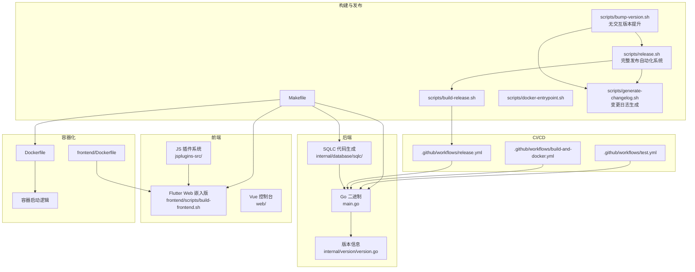
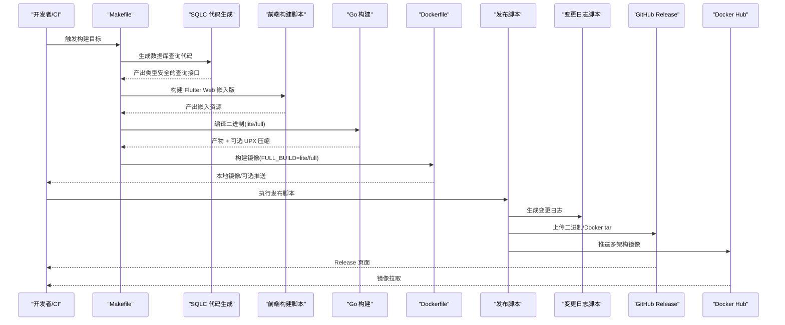
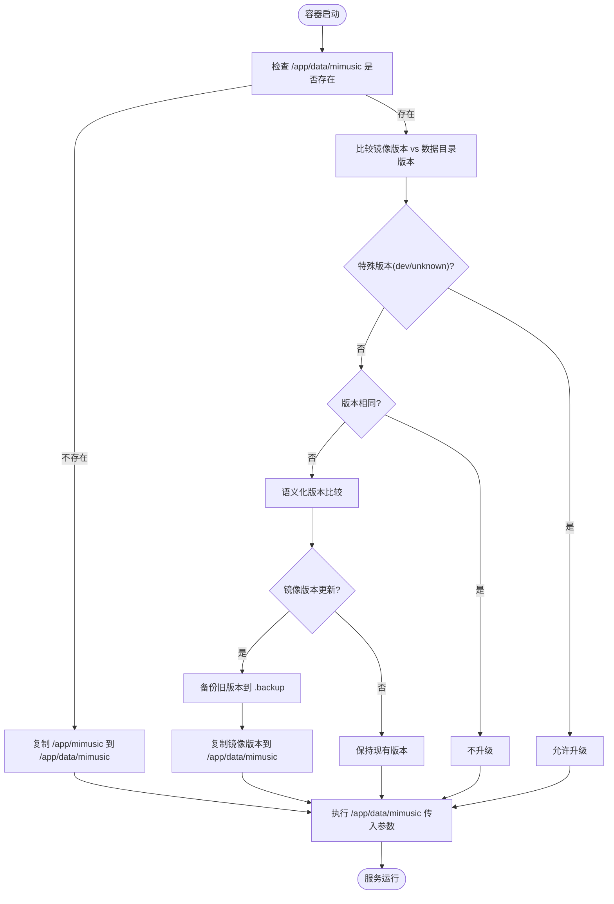
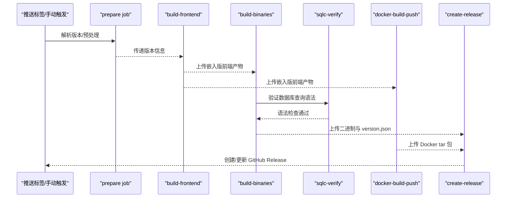
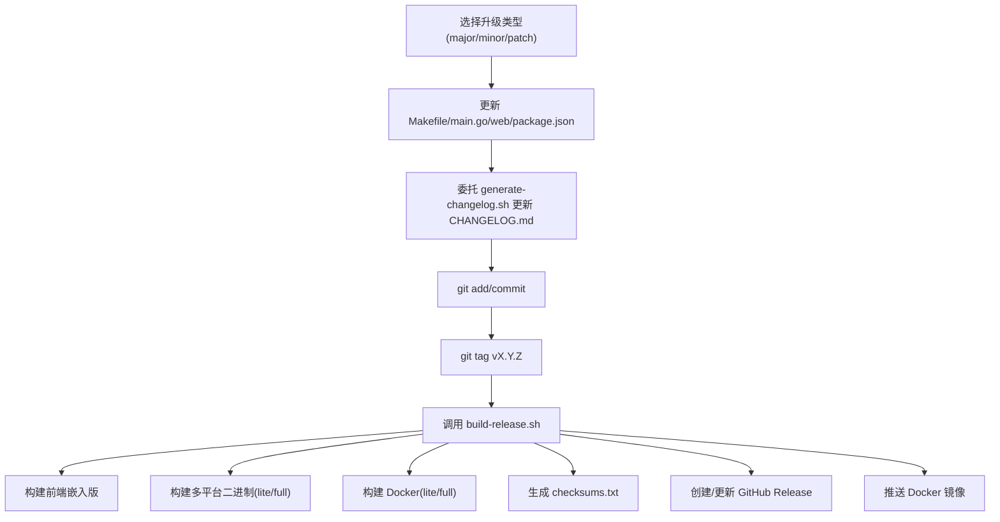

# 构建与部署

<cite>
**本文引用的文件**
- [Makefile](file://Makefile)
- [Dockerfile](file://Dockerfile)
- [scripts/release.sh](file://scripts/release.sh)
- [scripts/bump-version.sh](file://scripts/bump-version.sh)
- [scripts/docker-entrypoint.sh](file://scripts/docker-entrypoint.sh)
- [scripts/generate-changelog.sh](file://scripts/generate-changelog.sh)
- [frontend/Dockerfile](file://frontend/Dockerfile)
- [frontend/scripts/build-frontend.sh](file://frontend/scripts/build-frontend.sh)
- [.github/workflows/build-and-docker.yml](file://.github/workflows/build-and-docker.yml)
- [.github/workflows/test.yml](file://.github/workflows/test.yml)
- [.github/workflows/release.yml](file://.github/workflows/release.yml)
- [main.go](file://main.go)
- [internal/version/version.go](file://internal/version/version.go)
- [go.mod](file://go.mod)
- [frontend/pubspec.yaml](file://frontend/pubspec.yaml)
- [web/package.json](file://web/package.json)
- [CHANGELOG.md](file://CHANGELOG.md)
- [docs/swagger.yaml](file://docs/swagger.yaml)
- [docs/swagger.json](file://docs/swagger.json)
- [docs/docs.go](file://docs/docs.go)
- [internal/app/pprof_dev.go](file://internal/app/pprof_dev.go)
- [internal/app/router_dev.go](file://internal/app/router_dev.go)
- [internal/app/router_prod.go](file://internal/app/router_prod.go)
- [web_embed.go](file://web_embed.go)
- [web_embed_full.go](file://web_embed_full.go)
- [jsplugins-src/README.md](file://jsplugins-src/README.md)
- [jsplugins/README.md](file://jsplugins/README.md)
- [plugins/README.md](file://plugins/README.md)
- [internal/database/schema.go](file://internal/database/schema.go)
- [frontend/lib/features/jsplugin/presentation/providers/jsplugin_provider.dart](file://frontend/lib/features/jsplugin/presentation/providers/jsplugin_provider.dart)
- [frontend/lib/features/jsplugin/presentation/widgets/jsplugin_grid.dart](file://frontend/lib/features/jsplugin/presentation/widgets/jsplugin_grid.dart)
- [sqlc.yaml](file://sqlc.yaml)
- [internal/database/queries/songs.sql](file://internal/database/queries/songs.sql)
- [internal/database/queries/configs.sql](file://internal/database/queries/configs.sql)
- [internal/database/queries/js_plugins.sql](file://internal/database/queries/js_plugins.sql)
- [internal/database/sqlc/songs.sql.go](file://internal/database/sqlc/songs.sql.go)
- [internal/database/sqlc/db.go](file://internal/database/sqlc/db.go)
- [internal/database/sqlc/querier.go](file://internal/database/sqlc/querier.go)
</cite>

## 更新摘要
**所做更改**
- 新增 SQLC 集成目标和自动化代码生成功能
- 添加 sqlc 代码生成和校验的 Makefile 目标
- 更新数据库查询文件和生成的 SQLC 代码
- 增强 CI 环境下的数据库查询验证支持

## 目录
1. [简介](#简介)
2. [项目结构](#项目结构)
3. [核心组件](#核心组件)
4. [架构总览](#架构总览)
5. [详细组件分析](#详细组件分析)
6. [依赖关系分析](#依赖关系分析)
7. [性能考虑](#性能考虑)
8. [故障排查指南](#故障排查指南)
9. [结论](#结论)
10. [附录](#附录)

## 简介
本指南面向 MiMusic 项目的构建与部署，覆盖以下主题：
- Makefile 构建目标与交叉编译、多平台构建、UPX 压缩等
- Docker 镜像构建、容器运行、环境变量与热升级机制
- CI/CD 流程（GitHub Actions 工作流）、自动化测试与自动发布
- 版本发布流程（版本号管理、标签创建、发布包生成、GitHub Release）
- 生产部署最佳实践、性能优化与监控配置
- 不同部署场景的配置差异与注意事项
- **新增** SQLC 数据库查询代码生成集成，支持类型安全的数据库操作

**更新** 当前版本已从 1.3.16 升级到 1.3.17，包括新增full和lite构建变体支持、BUILD_TYPE参数、Docker构建增强、发布脚本改进以及新增SQLC数据库代码生成支持

## 项目结构
本项目采用"后端 Go + 前端 Flutter/Vue"的混合架构，并通过 Makefile、脚本与 GitHub Actions 实现统一的构建与发布流水线。**新增** SQLC 数据库查询代码生成系统，提供类型安全的数据库操作接口。

**图表来源**
- [Makefile:1-353](file://Makefile#L1-L353)
- [scripts/release.sh:1-805](file://scripts/release.sh#L1-L805)
- [scripts/build-release.sh:1-475](file://scripts/build-release.sh#L1-L475)
- [scripts/bump-version.sh:1-254](file://scripts/bump-version.sh#L1-L254)
- [scripts/docker-entrypoint.sh:1-123](file://scripts/docker-entrypoint.sh#L1-L123)
- [scripts/generate-changelog.sh:1-457](file://scripts/generate-changelog.sh#L1-L457)
- [frontend/Dockerfile:1-86](file://frontend/Dockerfile#L1-L86)
- [frontend/scripts/build-frontend.sh:1-561](file://frontend/scripts/build-frontend.sh#L1-L561)
- [.github/workflows/test.yml:1-123](file://.github/workflows/test.yml#L1-L123)
- [.github/workflows/build-and-docker.yml:1-356](file://.github/workflows/build-and-docker.yml#L1-L356)
- [.github/workflows/release.yml:1-525](file://.github/workflows/release.yml#L1-L525)
- [main.go:1-79](file://main.go#L1-L79)
- [internal/version/version.go:1-25](file://internal/version/version.go#L1-L25)
- [jsplugins-src/README.md](file://jsplugins-src/README.md)
- [sqlc.yaml](file://sqlc.yaml)

**章节来源**
- [Makefile:1-353](file://Makefile#L1-L353)
- [frontend/scripts/build-frontend.sh:1-561](file://frontend/scripts/build-frontend.sh#L1-L561)
- [Dockerfile:1-80](file://Dockerfile#L1-L80)
- [.github/workflows/release.yml:1-525](file://.github/workflows/release.yml#L1-L525)

## 核心组件
- 构建与打包
  - Makefile：提供统一构建目标（开发/生产、lite/full、跨平台、测试、清理、Docker 构建与运行等）
  - **新增** SQLC 集成：sqlc 目标用于生成数据库查询代码，sqlc-verify 目标用于 CI 环境下的查询语法校验
  - 前端构建：Flutter Web 嵌入版与独立版、桌面端（Linux/Windows/macOS）、移动端（Android/iOS）
  - 发布脚本：release.sh（完整发布自动化系统）、build-release.sh、bump-version.sh（无交互版本提升），负责版本号管理、标签创建、产物打包与发布
  - JS 插件系统：现代化的 JS 插件架构，位于 jsplugins-src/ 目录，支持独立开发和发布
- 容器化
  - Dockerfile：Go 二进制构建与 Alpine 运行时镜像，支持 FULL_BUILD 构建完整版
  - docker-entrypoint.sh：容器启动时的热升级逻辑（镜像版本与数据目录版本对比）
  - frontend/Dockerfile：前端构建专用镜像，支持多平台产物导出
- CI/CD
  - test.yml：单元测试、集成测试与覆盖率上报
  - build-and-docker.yml：手动触发的多平台二进制构建与 Docker 推送
  - release.yml：基于标签的自动发布流水线（二进制、Docker、GitHub Release）
- 变更日志管理
  - generate-changelog.sh：专门的变更日志生成脚本，支持 Conventional Commits 格式，提供多种输出模式

**章节来源**
- [Makefile:1-353](file://Makefile#L1-L353)
- [scripts/release.sh:1-805](file://scripts/release.sh#L1-L805)
- [scripts/build-release.sh:1-475](file://scripts/build-release.sh#L1-L475)
- [scripts/bump-version.sh:1-254](file://scripts/bump-version.sh#L1-L254)
- [scripts/docker-entrypoint.sh:1-123](file://scripts/docker-entrypoint.sh#L1-L123)
- [scripts/generate-changelog.sh:1-457](file://scripts/generate-changelog.sh#L1-L457)
- [frontend/Dockerfile:1-86](file://frontend/Dockerfile#L1-L86)
- [.github/workflows/test.yml:1-123](file://.github/workflows/test.yml#L1-L123)
- [.github/workflows/build-and-docker.yml:1-356](file://.github/workflows/build-and-docker.yml#L1-L356)
- [.github/workflows/release.yml:1-525](file://.github/workflows/release.yml#L1-L525)

## 架构总览
下图展示从源码到发布产物的关键流程：本地/CI 构建、前端嵌入、二进制与 Docker 产物生成、**新增** SQLC 代码生成、GitHub Release 与 Docker Hub 推送。

**图表来源**
- [Makefile:1-353](file://Makefile#L1-L353)
- [frontend/scripts/build-frontend.sh:1-561](file://frontend/scripts/build-frontend.sh#L1-L561)
- [Dockerfile:1-80](file://Dockerfile#L1-L80)
- [scripts/build-release.sh:1-475](file://scripts/build-release.sh#L1-L475)
- [sqlc.yaml](file://sqlc.yaml)

## 详细组件分析

### Makefile 构建目标与选项
- 版本与构建信息
  - VERSION、GIT_COMMIT、BUILD_TIME 通过 -ldflags 注入，便于运行时查询版本
  - **新增** BUILD_TYPE 参数用于区分 lite（默认）和 full 构建变体
  - **新增** GOAMD64=v1 指令集支持，确保开发环境与 CI/CD 管道行为一致，改善跨平台兼容性，特别是对较老硬件的支持
  - 内部版本模块 internal/version/version.go 提供版本查询接口，包含 BuildType 字段
  - **当前版本：1.3.17**（从 1.3.16 升级）
- 构建目标
  - 开发/生产：build、build-full、build-prod、build-prod-full
  - 跨平台：build-linux-prod、build-windows-prod、build-darwin-prod、build-all-prod、build-all-prod-full
  - 交叉编译：build-cross（GOOS/GOARCH/GOARM/EXTRA_TAGS/OUTPUT）
  - 前端：build-frontend-web、build-frontend-web-embedded、build-frontend-all 及各平台独立目标
  - **新增** 数据库：sqlc（生成 SQLC 代码）、sqlc-verify（CI 环境下的查询校验）
- 测试与质量
  - test、test-short、test-unit、test-coverage、bench、fmt、vet、lint、deps、tidy、swagger
- Docker
  - docker-build、docker-run（含默认管理员账号/密码与端口映射）
- 发布
  - release（调用 scripts/release.sh）、publish（调用 scripts/build-release.sh）、release-dry-run

**章节来源**
- [Makefile:1-353](file://Makefile#L1-L353)
- [internal/version/version.go:1-25](file://internal/version/version.go#L1-L25)
- [main.go:1-79](file://main.go#L1-L79)

### SQLC 数据库代码生成系统
**重要更新** 新增 SQLC 集成，提供类型安全的数据库查询代码生成：

- SQLC 配置
  - sqlc.yaml：配置文件定义数据库引擎（sqlite）、查询文件目录、迁移文件目录和生成目标
  - 支持 Go 语言生成，输出到 internal/database/sqlc/ 目录
  - 生成接口类型，启用 JSON 标签，支持空切片等特性
- 数据库查询文件
  - internal/database/queries/ 目录包含 SQL 查询文件
  - songs.sql：歌曲相关查询（增删改查、统计、去重等）
  - configs.sql：配置项查询（获取、设置、删除）
  - js_plugins.sql：JS 插件管理查询（列表、获取、创建、更新、删除等）
- 代码生成目标
  - sqlc：生成 SQLC 代码，需要安装 sqlc 工具
  - sqlc-verify：验证查询语法，不生成文件，用于 CI 环境
- 生成的代码结构
  - models.go：数据库模型定义
  - querier.go：Querier 接口定义
  - db.go：数据库连接接口
  - 具体查询文件：每个 SQL 文件对应一个 .sql.go 文件
  - 例如：songs.sql.go 提供 GetSongByID、CreateSong、UpdateSong 等方法

**章节来源**
- [sqlc.yaml](file://sqlc.yaml)
- [internal/database/queries/songs.sql](file://internal/database/queries/songs.sql)
- [internal/database/queries/configs.sql](file://internal/database/queries/configs.sql)
- [internal/database/queries/js_plugins.sql](file://internal/database/queries/js_plugins.sql)
- [internal/database/sqlc/songs.sql.go](file://internal/database/sqlc/songs.sql.go)
- [internal/database/sqlc/db.go](file://internal/database/sqlc/db.go)
- [internal/database/sqlc/querier.go](file://internal/database/sqlc/querier.go)

### 构建标签语法修正
**重要更新** Makefile 中的构建标签语法已从 `-tags "dev full"` 修正为 `-tags "dev,full"`，确保 Go 工具链正确解析构建标签。

- 构建标签说明
  - dev：开发模式（含 Swagger + pprof）
  - full：完整版（嵌入前端资源）
  - 使用 `-tags "tag1,tag2"` 语法组合多个标签
- 影响范围
  - 开发构建：`-tags "dev,full"` 确保同时启用开发模式和完整版功能
  - 生产构建：`-tags full` 仅启用完整版功能
  - 交叉编译：`-tags "$(EXTRA_TAGS)"` 支持动态标签组合

**章节来源**
- [Makefile:20-24](file://Makefile#L20-L24)
- [Makefile:84-90](file://Makefile#L84-L90)
- [Makefile:109](file://Makefile#L109)
- [Makefile:135](file://Makefile#L135)
- [Makefile:154](file://Makefile#L154)
- [Makefile:166](file://Makefile#L166)
- [Makefile:180](file://Makefile#L180)
- [Makefile:236](file://Makefile#L236)

### 前端构建（Flutter/Vue）
- Flutter Web 嵌入版与独立版
  - 通过 frontend/scripts/build-frontend.sh 统一入口，支持 web、web-embedded、linux、windows、macos、android、ios、all
  - 嵌入版产物用于 Go 二进制内嵌；独立版用于独立部署
- 前端 Dockerfile
  - frontend/Dockerfile 提供 Flutter SDK 环境，支持多平台构建与产物导出
- Vue 控制台
  - web/ 为 Vue 管理端，配合前端构建脚本生成静态资源
  - **注意**：web/package.json 中的版本 1.2.8 即将废弃，后续版本将移除该文件

**章节来源**
- [frontend/scripts/build-frontend.sh:1-561](file://frontend/scripts/build-frontend.sh#L1-L561)
- [frontend/Dockerfile:1-86](file://frontend/Dockerfile#L1-L86)
- [web/package.json:1-35](file://web/package.json#L1-L35)

### JS 插件系统架构
**重要更新** JS 插件系统已进行重大架构重组：

- 目录结构变化
  - 旧结构：plugins/ 目录包含 Go 插件
  - 新结构：plugins/ 目录保留为 Go 插件，jsplugins-src/ 目录用于 JS 插件源码
  - jsplugins/ 目录用于存放已构建的 JS 插件包
- 命名约定变更
  - 旧命名：mimusic-plugin-*
  - 新命名：mimusic-jsplugin-*
  - 例如：lxmusic → mimusic-jsplugin-lxmusic，xiaomi → mimusic-jsplugin-xiaomi
- 插件管理
  - JS 插件通过独立的构建系统管理，支持 TypeScript 开发
  - 插件清单文件 plugin.json 定义插件元数据
  - 支持权限管理和热重载功能

**章节来源**
- [jsplugins-src/README.md](file://jsplugins-src/README.md)
- [jsplugins/README.md](file://jsplugins/README.md)
- [plugins/README.md](file://plugins/README.md)
- [frontend/lib/features/jsplugin/presentation/providers/jsplugin_provider.dart](file://frontend/lib/features/jsplugin/presentation/providers/jsplugin_provider.dart)
- [frontend/lib/features/jsplugin/presentation/widgets/jsplugin_grid.dart](file://frontend/lib/features/jsplugin/presentation/widgets/jsplugin_grid.dart)

### Docker 部署方案
- Dockerfile
  - 多阶段构建：golang:alpine 作为构建镜像，Alpine 作为运行时
  - 支持 FULL_BUILD 构建完整版（嵌入前端）
  - 默认暴露 58091 端口，挂载 /app/music 与 /app/data
  - 环境变量：ADMIN_USERNAME、ADMIN_PASSWORD、IN_DOCKER、TZ=Asia/Shanghai
- docker-entrypoint.sh
  - **重大改进**：改进了热更新逻辑和版本比较算法
  - 启动时对比镜像内二进制与 /app/data/mimusic 的版本，若镜像版本更新则热替换
  - **增强的版本比较算法**：支持处理 dev/unknown 特殊版本、语义化版本号比较、去除后缀字符的数字提取
  - 支持 -version 查询版本，便于版本比较
- 运行方式
  - docker build -t mimusic:latest .
  - docker run -p 58091:58091 -v /your/music:/app/music -v /your/data:/app/data mimusic:latest

**图表来源**
- [scripts/docker-entrypoint.sh:1-123](file://scripts/docker-entrypoint.sh#L1-L123)
- [Dockerfile:1-80](file://Dockerfile#L1-L80)

**章节来源**
- [Dockerfile:1-80](file://Dockerfile#L1-L80)
- [scripts/docker-entrypoint.sh:1-123](file://scripts/docker-entrypoint.sh#L1-L123)

### CI/CD 流程（GitHub Actions）
- 测试工作流（test.yml）
  - 单元测试与集成测试，上传覆盖率至 Codecov
- 构建与 Docker（build-and-docker.yml）
  - 多矩阵平台构建二进制，手动触发
  - 构建 Docker 多架构镜像并推送
- 自动发布（release.yml）
  - 基于标签触发，自动构建二进制、Docker、生成 checksums.txt
  - 上传到 mimusic-org/mimusic 的 GitHub Release
- **新增** SQLC 集成
  - CI 环境下使用 sqlc-verify 目标验证查询语法
  - 确保数据库查询的正确性和类型安全

**图表来源**
- [.github/workflows/release.yml:1-525](file://.github/workflows/release.yml#L1-L525)
- [.github/workflows/build-and-docker.yml:1-356](file://.github/workflows/build-and-docker.yml#L1-L356)
- [.github/workflows/test.yml:1-123](file://.github/workflows/test.yml#L1-L123)

**章节来源**
- [.github/workflows/test.yml:1-123](file://.github/workflows/test.yml#L1-L123)
- [.github/workflows/build-and-docker.yml:1-356](file://.github/workflows/build-and-docker.yml#L1-L356)
- [.github/workflows/release.yml:1-525](file://.github/workflows/release.yml#L1-L525)

### 版本发布流程
- **完整发布自动化系统**：scripts/release.sh
  - **重大演进**：从简单的版本提升工具演进为完整的多平台发布自动化系统
  - **复杂命令行参数**：支持 major/minor/patch 升级类型、stable/dev 发布类型、`--skip-docker`、`--skip-frontend`、`--build-only` 等选项
  - **依赖检查**：自动检查 go、git、gh、flutter、docker、upx 等工具
  - **前端构建**：可选择跳过前端构建或使用已有的构建产物
  - **多平台交叉编译**：支持 linux/amd64、linux/arm64、linux/arm/v7、darwin/amd64、darwin/arm64、windows/amd64、windows/arm64
  - **Docker 多架构构建**：支持 linux/amd64、linux/arm64、linux/arm/v7 平台
  - **GitHub Release 创建**：自动生成 checksums.txt，支持正式版和开发版发布
  - **Docker 镜像推送**：自动推送多架构镜像到 Docker Hub
  - **变更日志集成**：委托给 generate-changelog.sh 处理
- **无交互版本提升**：scripts/bump-version.sh
  - 无交互、支持 CI 环境，最后输出新版本号（带 v 前缀）
  - **注意**：不再更新 web/package.json（该文件将废弃）
  - **重大改进**：增加了交互确认提示和自动推送功能，提升了 CI/CD 流水线的自动化程度
  - **委托变更日志生成**：现在委托给 generate-changelog.sh 处理
- **传统发布脚本**：scripts/build-release.sh
  - 构建前端嵌入版、多平台二进制（lite/full）、Docker 多架构镜像（lite/full）
  - 生成 checksums.txt，创建/更新 GitHub Release，推送 Docker 镜像
- **变更日志生成**：scripts/generate-changelog.sh
  - **全新独立脚本**：专门负责变更日志生成，支持多种输出模式
  - **Conventional Commits 格式**：自动解析提交信息，按类型分类生成变更日志
  - **多模式支持**：支持生成所有 tag 的完整 changelog、单版本 changelog、更新 CHANGELOG.md 文件
  - **智能分类**：按 feat、fix、docs、style、refactor、perf、test、build、ci、chore、revert 等类型分类
  - **兼容性**：兼容 Bash 3.2+（macOS 默认版本），解决管道子 shell 问题

**图表来源**
- [scripts/release.sh:1-805](file://scripts/release.sh#L1-L805)
- [scripts/bump-version.sh:1-254](file://scripts/bump-version.sh#L1-L254)
- [scripts/build-release.sh:1-475](file://scripts/build-release.sh#L1-L475)
- [scripts/generate-changelog.sh:1-457](file://scripts/generate-changelog.sh#L1-L457)

**章节来源**
- [scripts/release.sh:1-805](file://scripts/release.sh#L1-L805)
- [scripts/bump-version.sh:1-254](file://scripts/bump-version.sh#L1-L254)
- [scripts/build-release.sh:1-475](file://scripts/build-release.sh#L1-L475)
- [scripts/generate-changelog.sh:1-457](file://scripts/generate-changelog.sh#L1-L457)

### 依赖关系分析
- Go 模块与替换
  - go.mod 指定 Go 版本与依赖，包含 sqlite、quickjs、wazero、swag 等
  - replace 指向本地子模块（pkg/tag、plugin/pkg/go-plugin-http），确保构建一致性
- 前端依赖
  - Flutter 与 Vue 依赖分别在 frontend/pubspec.yaml 与 web/package.json 中声明
  - **注意**：web/package.json 将在后续版本中废弃，前端版本管理将迁移到其他位置
- JS 插件依赖
  - jsplugins-src/ 目录下的插件使用 pnpm 管理依赖
  - 支持 TypeScript 编译和构建
  - 插件间依赖通过 pnpm workspace 管理
- **新增** SQLC 依赖
  - sqlc.yaml 配置文件定义数据库查询生成规则
  - internal/database/queries/ 目录包含 SQL 查询文件
  - internal/database/sqlc/ 目录存储生成的 Go 代码

**章节来源**
- [go.mod:1-58](file://go.mod#L1-L58)
- [frontend/pubspec.yaml:1-60](file://frontend/pubspec.yaml#L1-L60)
- [web/package.json:1-35](file://web/package.json#L1-L35)
- [sqlc.yaml](file://sqlc.yaml)

## 性能考虑
- 二进制体积与启动速度
  - 生产构建默认启用 -s -w 去符号，可选 UPX 压缩（仅部分平台）
  - **新增** FULL_BUILD 嵌入前端资源，体积更大但部署更简单
  - **新增** BUILD_TYPE 参数用于区分 lite（默认）和 full 构建变体
  - **新增** GOAMD64=v1 指令集支持，改善跨平台兼容性，特别是对较老硬件的支持
- 前端资源
  - Flutter Web 构建时清理未使用的 Canvaskit 变体，减少体积
  - Vue 控制台使用 PWA 插件，提升离线体验
- 容器运行
  - Alpine 基础镜像 + 时区设置 Asia/Shanghai，减少镜像体积
  - **热升级优化**：改进的版本比较算法避免不必要的升级，降低中断风险
- JS 插件性能
  - JS 插件支持热重载，减少开发时的重启时间
  - 插件权限管理确保安全性
  - 前端 Riverpod 状态管理提升插件界面响应速度
- **新增** SQLC 性能优化
  - 类型安全的数据库操作减少运行时错误
  - 预编译的查询语句提高执行效率
  - 接口抽象简化数据库访问层代码

**章节来源**
- [Makefile:1-353](file://Makefile#L1-L353)
- [frontend/scripts/build-frontend.sh:1-561](file://frontend/scripts/build-frontend.sh#L1-L561)
- [Dockerfile:1-80](file://Dockerfile#L1-L80)

## 故障排查指南
- 构建失败
  - 缺少依赖：执行 make deps 或 go mod download
  - 缺少工具：UPX、Flutter、fastforge、ffmpeg 等
  - 版本不匹配：使用 make version 检查 Go 版本
  - **指令集兼容性问题**：如遇到 amd64 指令集相关错误，确保使用 GOAMD64=v1 支持
  - **构建标签语法错误**：确保使用正确的 `-tags "dev,full"` 语法，避免空格分隔导致的标签解析失败
  - **JS 插件构建失败**：检查 jsplugins-src/ 目录下的插件依赖和构建配置
  - **SQLC 代码生成失败**：检查 sqlc.yaml 配置和查询文件语法，确保安装了 sqlc 工具
- Docker 启动异常
  - 端口冲突：调整 -p 映射或停止占用进程
  - 权限问题：确认挂载目录权限与 SELinux 设置
  - **热升级失败**：检查 /app/data/mimusic 权限与改进的版本比较逻辑
- CI/CD 失败
  - 测试失败：查看 test.yml 的覆盖率与日志
  - 发布失败：检查 GitHub CLI、Docker Hub 登录状态与网络代理
  - **变更日志生成失败**：检查 generate-changelog.sh 的 Git 提交历史和 Conventional Commits 格式
  - **SQLC 校验失败**：检查查询文件语法和 sqlc-verify 目标的执行结果
- JS 插件问题
  - 插件加载失败：检查 jsplugins/ 目录下的插件包完整性
  - 权限不足：验证插件权限配置和宿主应用版本兼容性
  - 热重载失效：确认插件开发服务器正常运行

**章节来源**
- [Makefile:1-353](file://Makefile#L1-L353)
- [scripts/docker-entrypoint.sh:1-123](file://scripts/docker-entrypoint.sh#L1-L123)
- [.github/workflows/test.yml:1-123](file://.github/workflows/test.yml#L1-L123)
- [.github/workflows/release.yml:1-525](file://.github/workflows/release.yml#L1-L525)

## 结论
本指南提供了 MiMusic 从本地构建到 CI/CD 自动发布的完整路径，涵盖多平台二进制、Docker 镜像、前端嵌入与热升级等关键能力。**当前版本已升级到 1.3.17**，建议在生产环境中优先使用 FULL_BUILD 的完整版镜像以简化部署，并结合版本发布脚本与 GitHub Actions 实现稳定可靠的自动化发布。

**新增** SQLC 数据库代码生成系统的集成，为项目提供了类型安全的数据库操作能力，减少了运行时错误并提高了开发效率。建议在进行数据库查询相关的开发时，使用 sqlc 目标生成代码并在 CI 环境中使用 sqlc-verify 目标进行语法校验。

## 附录
- 常用命令速查
  - 本地开发：make run 或 make run-prod
  - 生产构建：make build-prod 或 make build-prod-full
  - 跨平台：make build-cross GOOS=linux GOARCH=amd64 OUTPUT=build/mimusic-linux-amd64
  - 前端：make build-frontend-web-embedded 或 make build-frontend-all
  - Docker：make docker-build；make docker-run
  - 发布：make release TYPE=patch|minor|major [RELEASE_TYPE=stable|dev]；或 make publish VERSION=vX.Y.Z [TYPE=stable|dev]
  - **变更日志**：./scripts/generate-changelog.sh --update-file 1.3.17
  - **JS 插件**：进入 jsplugins-src/ 目录进行插件开发和构建
  - **SQLC 代码生成**：make sqlc（生成代码）；make sqlc-verify（CI 校验）
- 环境变量参考
  - ADMIN_USERNAME、ADMIN_PASSWORD、IN_DOCKER、TZ、GOPROXY（Dockerfile 构建参数）
  - **新增** BUILD_TYPE（用于区分 lite/full 构建变体）
  - **新增** GOAMD64=v1（确保开发环境与 CI/CD 管道行为一致，改善跨平台兼容性）
- **版本信息**
  - 当前后端版本：1.3.17
  - 当前前端版本：1.0.12+1（Flutter）
  - Vue 控制台版本：1.2.8（即将废弃）
  - **注意**：web/package.json 将在后续版本中移除，前端版本管理将迁移至其他位置

### 版本历史更新
- **最新版本 1.3.17**（2026-04-10）
  - 版本升级到 1.3.17
  - 包含维护性更新和性能优化
  - **重大改进**：新增 BUILD_TYPE 参数支持 lite/full 构建变体
  - **重大改进**：Dockerfile 支持 FULL_BUILD 构建完整版镜像
  - **重大改进**：发布脚本同时构建 lite 和 full 版本
  - **重大改进**：scripts/docker-entrypoint.sh 改进热更新逻辑和版本比较算法
  - **重大改进**：scripts/bump-version.sh 委托变更日志生成给新脚本
  - **重大改进**：scripts/release.sh 重构简化发布流程
  - **重大改进**：Makefile 添加 GOAMD64=v1 指令集支持，改善跨平台兼容性
  - **重要修复**：构建标签语法从 `-tags "dev full"` 修正为 `-tags "dev,full"`，确保 Go 工具链正确解析构建标签
  - **架构重组**：JS 插件系统从 plugins/ 迁移到 jsplugins-src/，支持现代化开发流程
  - **命名规范**：插件命名从 mimusic-plugin-* 迁移到 mimusic-jsplugin-*，统一标识 JS 插件类型
  - **新增功能**：SQLC 数据库代码生成系统集成，提供类型安全的数据库操作
- **上一个版本 1.3.16**（2026-04-09）
  - 版本升级到 1.3.16
  - 包含维护性更新和性能优化
  - **重大改进**：scripts/docker-entrypoint.sh 改进热更新逻辑和版本比较算法
  - **重大改进**：scripts/bump-version.sh 委托变更日志生成给新脚本
  - **重大改进**：scripts/release.sh 重构简化发布流程
- **脚本重大改进**
  - scripts/bump-version.sh 增加了交互确认提示
  - 自动推送功能提升了 CI/CD 流水线效率
  - 支持 --dry-run 模式进行安全预览
  - **scripts/release.sh 从简单版本提升工具演进为完整的多平台发布自动化系统**
  - 新增复杂命令行参数、依赖检查、多平台交叉编译、Docker 多架构构建等高级功能
  - **新增 scripts/generate-changelog.sh 专门负责变更日志生成**
  - 支持 Conventional Commits 格式，提供多种输出模式和智能分类

### 指令集兼容性更新
- **GOAMD64=v1 指令集支持**
  - **新增** 在 Makefile 中添加 GOAMD64=v1 环境变量，确保开发环境与 CI/CD 管道行为一致
  - **改善** 跨平台兼容性，特别是对较老硬件的支持
  - **应用场景**：AMD64 架构的较老 CPU，这些 CPU 可能缺少较新的指令集扩展
  - **构建影响**：使用 v1 指令集会生成更兼容的二进制文件，但可能略微影响性能
  - **CI/CD 一致性**：GitHub Actions 工作流中也设置了 GOAMD64=v1 环境变量，确保与本地构建一致

### 构建标签语法修正详情
- **问题背景**
  - 原始语法：`-tags "dev full"`（使用空格分隔多个标签）
  - Go 工具链期望的语法：`-tags "dev,full"`（使用逗号分隔多个标签）
- **修复内容**
  - 将所有构建目标中的标签语法从空格分隔修正为逗号分隔
  - 确保开发模式和完整版功能能够正确同时启用
  - 保证交叉编译时 EXTRA_TAGS 参数能够正确传递标签组合
- **影响范围**
  - 开发构建：`-tags "dev,full"` 确保同时启用开发模式和完整版功能
  - 生产构建：`-tags full` 仅启用完整版功能
  - 交叉编译：`-tags "$(EXTRA_TAGS)"` 支持动态标签组合
- **验证方法**
  - 使用 `go build -tags "dev,full"` 验证标签解析
  - 检查生成的二进制是否包含 Swagger 和 pprof 功能
  - 确认完整版二进制是否嵌入前端资源

### JS 插件系统更新
- **目录结构调整**
  - plugins/ → 保留 Go 插件
  - jsplugins-src/ → 新增 JS 插件源码目录
  - jsplugins/ → JS 插件构建产物目录
- **命名约定标准化**
  - mimusic-plugin-* → mimusic-jsplugin-*
  - 区分 Go 插件和 JS 插件类型
- **开发流程优化**
  - 独立的 JS 插件开发环境
  - TypeScript 支持和现代构建工具
  - 热重载和权限管理
- **数据库支持**
  - 新增 js_plugins 表支持 JS 插件管理
  - 权限配置和版本控制
  - 状态跟踪和更新机制

### SQLC 数据库代码生成系统更新
- **配置文件**
  - sqlc.yaml：定义数据库引擎、查询目录、迁移目录和生成目标
  - 支持 SQLite 引擎，生成 Go 代码到 internal/database/sqlc/
  - 启用接口生成、JSON 标签、空切片支持等特性
- **查询文件组织**
  - internal/database/queries/ 目录按功能模块组织 SQL 查询
  - songs.sql：歌曲 CRUD 操作和统计查询
  - configs.sql：配置项管理查询
  - js_plugins.sql：JS 插件生命周期管理查询
- **代码生成流程**
  - make sqlc：生成类型安全的数据库操作代码
  - make sqlc-verify：CI 环境下验证查询语法正确性
  - 自动生成 models、querier、db 接口和具体查询实现
- **接口设计**
  - Querier 接口定义所有数据库操作方法
  - 类型安全的参数和返回值
  - 支持事务和上下文管理
  - 预编译查询语句提高执行效率

**章节来源**
- [jsplugins-src/README.md](file://jsplugins-src/README.md)
- [internal/database/schema.go:152-185](file://internal/database/schema.go#L152-L185)
- [sqlc.yaml](file://sqlc.yaml)
- [internal/database/queries/songs.sql](file://internal/database/queries/songs.sql)
- [internal/database/queries/configs.sql](file://internal/database/queries/configs.sql)
- [internal/database/queries/js_plugins.sql](file://internal/database/queries/js_plugins.sql)
- [internal/database/sqlc/songs.sql.go](file://internal/database/sqlc/songs.sql.go)
- [internal/database/sqlc/db.go](file://internal/database/sqlc/db.go)
- [internal/database/sqlc/querier.go](file://internal/database/sqlc/querier.go)