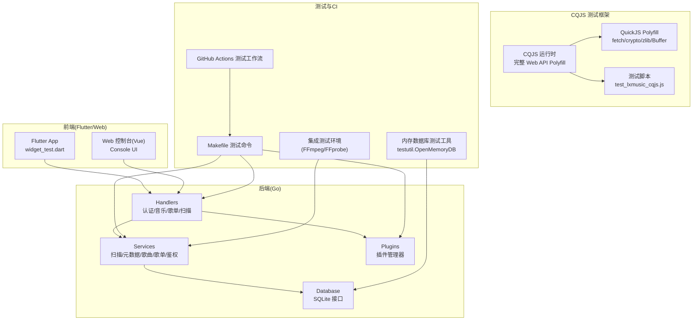
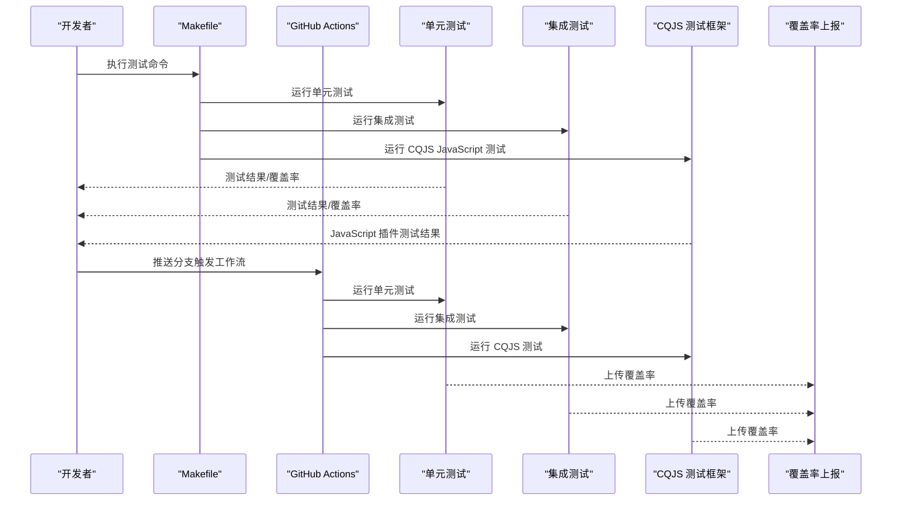
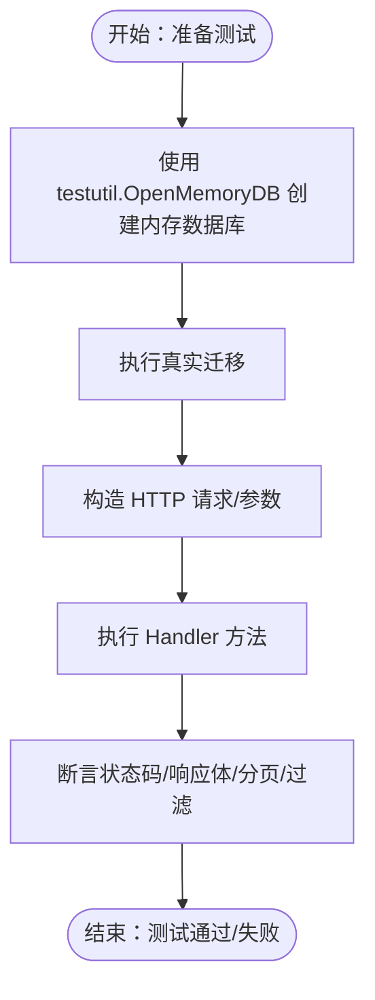
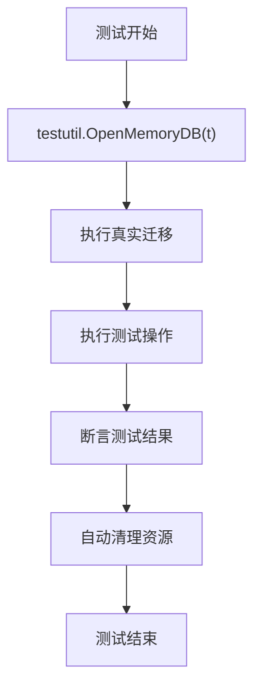
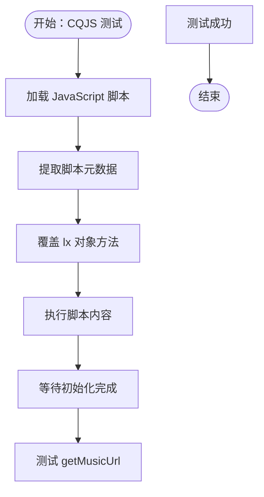
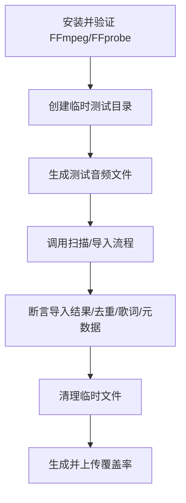
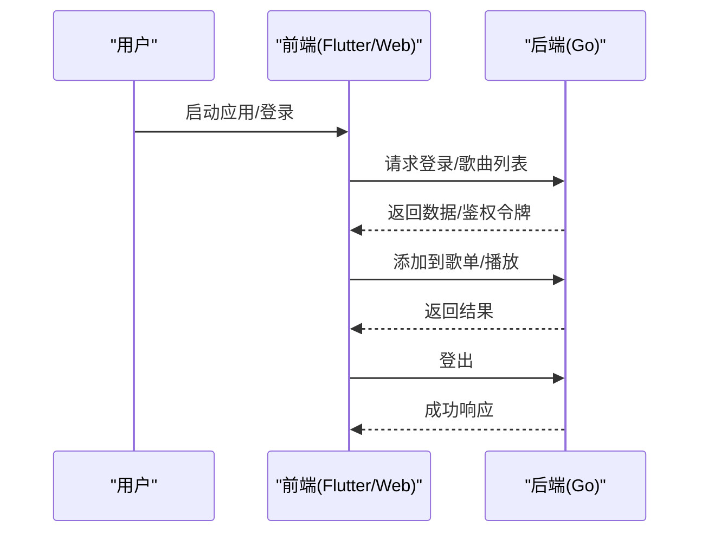
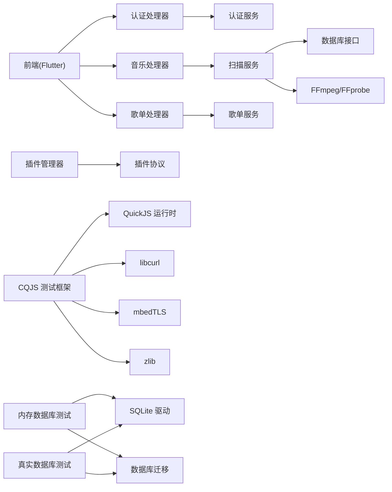

# 测试策略

<cite>
**本文引用的文件**
- [测试工作流 test.yml](file://.github/workflows/test.yml)
- [集成测试快速指南 README_INTEGRATION_TESTS.md](file://test/README_INTEGRATION_TESTS.md)
- [集成测试环境设置 INTEGRATION_TEST_SETUP.md](file://test/INTEGRATION_TEST_SETUP.md)
- [Makefile](file://Makefile)
- [CQJS 测试框架 README_CQJS.md](file://test/README_CQJS.md)
- [CQJS 测试脚本 run_cqjs_test.sh](file://test/run_cqjs_test.sh)
- [CQJS 主测试脚本 test_lxmusic_cqjs.js](file://test/test_lxmusic_cqjs.js)
- [CQJS Shell 测试脚本 test_lxmusic_cqjs.sh](file://test/test_lxmusic_cqjs.sh)
- [QuickJS Polyfill README](file://test/quickjs_polyfill/README.md)
- [QuickJS Polyfill Makefile](file://test/quickjs_polyfill/Makefile)
- [QuickJS 混淆脚本测试 test_jsjiami_qjs.js](file://test/test_jsjiami_qjs.js)
- [UserAPI 测试 test_lxmusic_userapi.js](file://test/test_lxmusic_userapi.js)
- [QuickJS v2 测试 test_lxmusic_qjs_v2.js](file://test/test_lxmusic_qjs_v2.js)
- [认证处理器测试 auth_test.go](file://internal/handlers/auth_test.go)
- [音乐处理器测试 music_test.go](file://internal/handlers/music_test.go)
- [歌单处理器测试 playlist_test.go](file://internal/handlers/playlist_test.go)
- [扫描处理器测试 scan_test.go](file://internal/handlers/scan_test.go)
- [插件管理器测试 manager_test.go](file://internal/jsplugin/manager_test.go)
- [扫描服务测试 scanner_test.go](file://internal/services/scanner_test.go)
- [Flutter Widget 测试 widget_test.dart](file://frontend/test/widget_test.dart)
- [歌曲服务测试 song_service_test.go](file://internal/services/song_service_test.go)
- [歌单服务测试 playlist_service_test.go](file://internal/services/playlist_service_test.go)
- [SQLite 歌曲关系测试 sqlite_playlist_song.go](file://internal/database/sqlite_playlist_song.go)
- [SQLite 数据库测试 sqlite_test.go](file://internal/database/sqlite_test.go)
- [内存数据库测试工具 memdb.go](file://internal/database/testutil/memdb.go)
- [SQLite 数据库实现 sqlite.go](file://internal/database/sqlite.go)
</cite>

## 目录
1. [引言](#引言)
2. [项目结构](#项目结构)
3. [核心组件](#核心组件)
4. [架构总览](#架构总览)
5. [详细组件分析](#详细组件分析)
6. [依赖分析](#依赖分析)
7. [性能考量](#性能考量)
8. [故障排查指南](#故障排查指南)
9. [结论](#结论)
10. [附录](#附录)

## 引言
本测试策略文档面向 MiMusic 项目，系统化阐述单元测试、集成测试、插件集成测试与端到端测试的编写方法与实施要点。**重大更新**：测试策略已从手动mock实现转向真实数据库测试，使用内存SQLite进行隔离测试，消除超过1200行的样板代码。这一转变标志着测试质量与可靠性的显著提升。

文档同时给出测试覆盖率目标、质量门禁建议、测试数据准备与 Mock 技巧，以及如何使用 Makefile 中的测试命令与自动化流程。

## 项目结构
MiMusic 采用多语言混合架构：后端基于 Go，前端采用 Flutter/Vue 生态，插件体系通过 Go 插件协议扩展。**新增** CQJS 测试框架为 JavaScript 插件测试提供了统一的运行时环境，支持真实 HTTP 请求、完整加密功能和 Buffer 支持。



**图示来源**
- [CQJS 测试框架 README_CQJS.md:1-238](file://test/README_CQJS.md#L1-L238)
- [QuickJS Polyfill README:1-239](file://test/quickjs_polyfill/README.md#L1-L239)
- [Makefile:188-217](file://Makefile#L188-L217)
- [.github/workflows/test.yml:9-122](file://.github/workflows/test.yml#L9-L122)
- [内存数据库测试工具 memdb.go:1-20](file://internal/database/testutil/memdb.go#L1-L20)

**章节来源**
- [Makefile:188-217](file://Makefile#L188-L217)
- [.github/workflows/test.yml:9-122](file://.github/workflows/test.yml#L9-L122)

## 核心组件
- 后端 Handlers：负责 HTTP 请求路由与响应封装，典型测试场景包括请求解析、鉴权头校验、错误码返回、分页与过滤参数处理。
- Services：业务逻辑层，包含扫描、元数据提取、歌曲/歌单/鉴权服务，是集成测试重点覆盖对象。
- Plugins：插件生命周期管理、健康状态跟踪、超时控制等，测试关注点为实例健康判定、卸载行为与超时常量。
- **新增** CQJS 测试框架：基于 QuickJS 的完整 Web API Polyfill，提供真实 HTTP 请求、加密功能、Buffer 支持和压缩功能，专门用于测试 JavaScript 插件脚本。
- 前端 Flutter：UI 组件与应用启动的最小化冒烟测试，验证主入口与初始状态。
- 集成测试：依赖 FFmpeg/FFprobe，覆盖扫描导入、去重、歌词导入、元数据提取等真实文件系统交互。
- **新增** 内存数据库测试：使用 `testutil.OpenMemoryDB(t)` 创建内存SQLite数据库，执行真实迁移并在测试结束后自动清理。

**章节来源**
- [CQJS 测试框架 README_CQJS.md:5-17](file://test/README_CQJS.md#L5-L17)
- [QuickJS Polyfill README:7-24](file://test/quickjs_polyfill/README.md#L7-L24)
- [认证处理器测试 auth_test.go:71-139](file://internal/handlers/auth_test.go#L71-L139)
- [音乐处理器测试 music_test.go:202-235](file://internal/handlers/music_test.go#L202-L235)
- [歌单处理器测试 playlist_test.go:254-278](file://internal/handlers/playlist_test.go#L254-L278)
- [扫描处理器测试 scan_test.go:39-77](file://internal/handlers/scan_test.go#L39-L77)
- [插件管理器测试 manager_test.go:99-183](file://internal/jsplugin/manager_test.go#L99-L183)
- [扫描服务测试 scanner_test.go:43-103](file://internal/services/scanner_test.go#L43-L103)
- [Flutter Widget 测试 widget_test.dart:6-18](file://frontend/test/widget_test.dart#L6-L18)
- [内存数据库测试工具 memdb.go:1-20](file://internal/database/testutil/memdb.go#L1-L20)

## 架构总览
下图展示测试在系统中的角色与流向，**新增** CQJS 测试框架作为独立的 JavaScript 运行时测试组件：



**图示来源**
- [Makefile:188-217](file://Makefile#L188-L217)
- [.github/workflows/test.yml:9-122](file://.github/workflows/test.yml#L9-L122)
- [CQJS 测试框架 README_CQJS.md:75-92](file://test/README_CQJS.md#L75-L92)
- [集成测试环境设置 INTEGRATION_TEST_SETUP.md:69-80](file://test/INTEGRATION_TEST_SETUP.md#L69-L80)

## 详细组件分析

### 单元测试最佳实践（Go）
- Handler 层测试
  - 使用 httptest 模拟 HTTP 请求与响应，构造 JSON 请求体，设置 Content-Type 头。
  - 对鉴权、路由参数、分页参数、缺失字段等边界场景进行断言。
  - 参考：认证登录/刷新/登出、音乐列表/详情/远程歌曲、歌单 CRUD、扫描触发等测试用例。
- Service 层测试
  - 使用 `testutil.OpenMemoryDB(t)` 创建内存数据库，执行真实迁移，隔离外部依赖。
  - 覆盖扫描文件过滤、目录排除、音频格式识别、空目录与不存在目录等边界。
- 插件管理器测试
  - 健康状态标记与查询、不健康实例拒绝访问、卸载时跳过 Deinit、超时常量合理性。



**图示来源**
- [认证处理器测试 auth_test.go:71-139](file://internal/handlers/auth_test.go#L71-L139)
- [音乐处理器测试 music_test.go:202-235](file://internal/handlers/music_test.go#L202-L235)
- [歌单处理器测试 playlist_test.go:254-278](file://internal/handlers/playlist_test.go#L254-L278)
- [扫描服务测试 scanner_test.go:43-103](file://internal/services/scanner_test.go#L43-L103)
- [插件管理器测试 manager_test.go:99-183](file://internal/jsplugin/manager_test.go#L99-L183)
- [内存数据库测试工具 memdb.go:1-20](file://internal/database/testutil/memdb.go#L1-L20)

**章节来源**
- [认证处理器测试 auth_test.go:71-139](file://internal/handlers/auth_test.go#L71-L139)
- [音乐处理器测试 music_test.go:202-235](file://internal/handlers/music_test.go#L202-L235)
- [歌单处理器测试 playlist_test.go:254-278](file://internal/handlers/playlist_test.go#L254-L278)
- [扫描服务测试 scanner_test.go:43-103](file://internal/services/scanner_test.go#L43-L103)
- [插件管理器测试 manager_test.go:99-183](file://internal/jsplugin/manager_test.go#L99-L183)
- [内存数据库测试工具 memdb.go:1-20](file://internal/database/testutil/memdb.go#L1-L20)

### 真实数据库测试策略

**重大更新** MiMusic 已完全转向真实数据库测试，使用内存SQLite替代手动mock，消除超过1200行的样板代码。

#### 内存数据库测试优势
- **真实迁移**：使用 `database.Open(":memory:")` 执行真实迁移，确保测试环境与生产环境一致
- **自动清理**：通过 `t.Cleanup()` 自动关闭数据库连接，避免资源泄漏
- **事务支持**：支持完整的事务操作，包括回滚和提交
- **性能优异**：内存数据库提供毫秒级响应速度

#### 测试工具链


**图示来源**
- [内存数据库测试工具 memdb.go:1-20](file://internal/database/testutil/memdb.go#L1-L20)
- [SQLite 数据库实现 sqlite.go:26-67](file://internal/database/sqlite.go#L26-L67)

#### 数据库测试覆盖范围
- **歌曲管理**：创建、更新、删除、查询、批量操作
- **歌单管理**：创建、更新、删除、歌曲添加/移除
- **配置管理**：键值对存储、更新、删除
- **事务处理**：原子性操作、回滚机制
- **约束验证**：唯一性约束、外键约束、级联删除

**章节来源**
- [内存数据库测试工具 memdb.go:1-20](file://internal/database/testutil/memdb.go#L1-L20)
- [SQLite 数据库实现 sqlite.go:26-67](file://internal/database/sqlite.go#L26-L67)
- [SQLite 数据库测试 sqlite_test.go:1-1292](file://internal/database/sqlite_test.go#L1-L1292)

### CQJS JavaScript 运行时测试框架

**新增** MiMusic 现已引入基于 CQJS 的全新 JavaScript 运行时测试框架，提供完整的 Web API Polyfill，替代了原有的多运行时测试方法。

#### CQJS 运行时特性
- **完整的 Web API 支持**：fetch（libcurl）、crypto（mbedTLS）、zlib、Buffer、console、定时器、URL、TextEncoder/TextDecoder
- **真实 HTTP 请求**：使用 libcurl 进行真实的网络请求，而非 Mock
- **加密功能**：完整的 MD5、AES、RSA 加密支持
- **混淆脚本支持**：使用 64MB 大栈，更好支持深度递归的混淆脚本（如 jsjiami.com.v7）

#### 测试脚本对比
| 特性 | test_lxmusic_qjs_v2.js | test_lxmusic_userapi.js | **test_lxmusic_cqjs.js** |
|------|----------------------|------------------------|------------------------|
| **运行时** | QuickJS | Node.js/Bun | **CQJS (QuickJS + C Polyfill)** |
| **HTTP 请求** | Mock | 真实（Node.js https） | **✅ 真实（libcurl）** |
| **加密功能** | 简化实现 | 完整（Node.js crypto） | **✅ 完整（mbedTLS）** |
| **Buffer** | SimpleBuffer | 原生 Buffer | **✅ 完整 Buffer** |
| **压缩** | 简化实现 | 完整（Node.js zlib） | **✅ 完整（zlib）** |
| **混淆脚本** | ⚠️ 可能超时 | ⚠️ 可能超时 | **✅ 更好支持** |
| **依赖** | 无 | Node.js | **cqjs 可执行文件** |

#### 测试脚本架构


**图示来源**
- [CQJS 主测试脚本 test_lxmusic_cqjs.js:121-222](file://test/test_lxmusic_cqjs.js#L121-L222)

#### 快速开始
```bash
# 使用辅助脚本运行测试
./test/run_cqjs_test.sh

# 测试混淆版本
./test/run_cqjs_test.sh "data/plugins_data/lxmusic/scripts/洛雪音乐源.js"

# 直接使用 cqjs
echo '{"id":"1","type":"eval_file","path":"test/test_lxmusic_cqjs.js"}' | cqjs
```

**章节来源**
- [CQJS 测试框架 README_CQJS.md:1-238](file://test/README_CQJS.md#L1-L238)
- [CQJS 测试脚本 run_cqjs_test.sh:1-43](file://test/run_cqjs_test.sh#L1-L43)
- [CQJS 主测试脚本 test_lxmusic_cqjs.js:1-222](file://test/test_lxmusic_cqjs.js#L1-L222)
- [CQJS Shell 测试脚本 test_lxmusic_cqjs.sh:1-199](file://test/test_lxmusic_cqjs.sh#L1-L199)

### 集成测试策略（API/数据库/插件）
- 环境准备
  - 安装 FFmpeg/FFprobe，验证版本；若不可用则集成测试自动跳过。
  - 使用临时目录生成 1 秒静音音频文件，模拟真实扫描导入流程。
- 覆盖范围
  - 扫描与导入：基本导入、去重、歌词导入、元数据提取。
  - 插件健康状态与生命周期：初始化/回调/反初始化超时控制、不健康实例处理。
- 质量门禁
  - 集成测试覆盖率目标：当前 Services 层约 59.7%，期望达到 75%+，理想 80%+。
  - CI 中启用集成测试，本地开发可用 -short 跳过集成测试。



**图示来源**
- [集成测试环境设置 INTEGRATION_TEST_SETUP.md:84-96](file://test/INTEGRATION_TEST_SETUP.md#L84-L96)
- [集成测试快速指南 README_INTEGRATION_TESTS.md:36-57](file://test/README_INTEGRATION_TESTS.md#L36-L57)
- [.github/workflows/test.yml:51-98](file://.github/workflows/test.yml#L51-L98)

**章节来源**
- [集成测试环境设置 INTEGRATION_TEST_SETUP.md:1-204](file://test/INTEGRATION_TEST_SETUP.md#L1-L204)
- [集成测试快速指南 README_INTEGRATION_TESTS.md:1-112](file://test/README_INTEGRATION_TESTS.md#L1-L112)
- [.github/workflows/test.yml:51-98](file://.github/workflows/test.yml#L51-L98)

### 端到端测试方案（用户流程/跨平台/性能回归）
- 用户流程测试
  - 前端冒烟测试：验证应用启动、初始界面显示。
  - 后端 API 流程：登录 → 列表/详情 → 播放/添加到歌单 → 登出。
- 跨平台兼容性测试
  - CI 使用 Ubuntu/macOS/Windows 运行测试矩阵，确保多平台一致性。
- 性能回归测试
  - 使用 go test -bench 生成基准测试报告，定期回归对比。



**图示来源**
- [Flutter Widget 测试 widget_test.dart:6-18](file://frontend/test/widget_test.dart#L6-L18)
- [.github/workflows/test.yml:99-122](file://.github/workflows/test.yml#L99-L122)
- [Makefile:213-217](file://Makefile#L213-L217)

**章节来源**
- [Flutter Widget 测试 widget_test.dart:6-18](file://frontend/test/widget_test.dart#L6-L18)
- [.github/workflows/test.yml:99-122](file://.github/workflows/test.yml#L99-L122)
- [Makefile:213-217](file://Makefile#L213-L217)

### 测试覆盖率与质量门禁
- 覆盖率收集
  - 单元测试：go test -coverprofile=coverage.txt -covermode=atomic ./...
  - 集成测试：go test -run Integration -coverprofile=coverage-integration.txt ./...
  - 生成 HTML 报告：go tool cover -html=coverage.out -o coverage.html
  - **新增** CQJS 测试覆盖率：通过 cqjs 测试脚本输出的覆盖率数据
- 质量门禁建议
  - 关键模块（Handlers/Services/Plugins）覆盖率不低于 80%。
  - 集成测试覆盖率目标：Services 层达到 75%+（当前约 59.7%）。
  - CI 中失败即阻断合并，覆盖率异常波动需审查。
  - **新增** JavaScript 插件测试覆盖率纳入质量门禁评估。

**章节来源**
- [.github/workflows/test.yml:38-48](file://.github/workflows/test.yml#L38-L48)
- [.github/workflows/test.yml:86-97](file://.github/workflows/test.yml#L86-L97)
- [集成测试环境设置 INTEGRATION_TEST_SETUP.md:69-80](file://test/INTEGRATION_TEST_SETUP.md#L69-L80)
- [集成测试快速指南 README_INTEGRATION_TESTS.md:58-66](file://test/README_INTEGRATION_TESTS.md#L58-L66)

### 测试数据准备与 Mock 使用
- 测试数据准备
  - 使用 `t.TempDir()` 创建临时目录，结合扫描服务测试中的 setupTestMusicDir 模式。
  - 生成少量音频文件与非音频文件，验证过滤与排除逻辑。
- Mock 对象
  - Handler 层：使用 httptest.NewRequest/Recorder 构造请求与记录响应。
  - Service 层：使用 `testutil.OpenMemoryDB(t)` 创建内存数据库，避免真实数据库依赖。
  - 插件层：Mock pbplugin.PluginService，跟踪 Deinit 调用与健康状态。
  - **新增** JavaScript 插件测试：使用 CQJS 运行时提供的完整 Polyfill，无需 Mock。
  - **新增** 内存数据库测试：使用 `testutil.OpenMemoryDB(t)` 替代手动mock，提供真实数据库行为。

**章节来源**
- [扫描处理器测试 scan_test.go:40-77](file://internal/handlers/scan_test.go#L40-L77)
- [扫描服务测试 scanner_test.go:10-41](file://internal/services/scanner_test.go#L10-L41)
- [认证处理器测试 auth_test.go:25-70](file://internal/handlers/auth_test.go#L25-L70)
- [插件管理器测试 manager_test.go:64-97](file://internal/jsplugin/manager_test.go#L64-L97)
- [歌曲服务测试 song_service_test.go:12-29](file://internal/services/song_service_test.go#L12-L29)
- [歌单服务测试 playlist_service_test.go:12-25](file://internal/services/playlist_service_test.go#L12-L25)
- [内存数据库测试工具 memdb.go:1-20](file://internal/database/testutil/memdb.go#L1-L20)

### 测试环境配置与 Makefile 使用
- 常用命令
  - 运行全部测试：make test
  - 生成覆盖率报告：make test-coverage
  - 快速测试（跳过集成）：make test-short
  - 仅单元测试：make test-unit
  - 性能测试：make bench
  - **新增** CQJS 测试：使用 test/README_CQJS.md 中的测试脚本
- CI 集成
  - GitHub Actions 使用 Go 版本 1.25.6，缓存模块，安装 FFmpeg，运行集成测试并上传覆盖率。
  - **新增** CQJS 测试环境配置，支持 macOS、Ubuntu/Debian 平台。

**章节来源**
- [Makefile:188-217](file://Makefile#L188-L217)
- [.github/workflows/test.yml:6-48](file://.github/workflows/test.yml#L6-L48)
- [.github/workflows/test.yml:51-98](file://.github/workflows/test.yml#L51-L98)

## 依赖分析
- Handler 依赖 Service，Service 依赖 Database 接口与外部工具（FFmpeg/FFprobe）。
- 插件管理器依赖插件协议与超时常量，健康状态影响实例获取与卸载行为。
- 前端依赖后端 API，测试覆盖应用启动与基础 UI。
- **新增** CQJS 测试框架依赖 QuickJS 运行时和各种 C 库（libcurl、mbedTLS、zlib）。
- **新增** 内存数据库测试依赖 `testutil.OpenMemoryDB` 工具，提供真实数据库行为。
- **新增** 真实数据库测试依赖 SQLite 驱动和迁移系统。



**图示来源**
- [CQJS 测试框架 README_CQJS.md:18-48](file://test/README_CQJS.md#L18-L48)
- [QuickJS Polyfill Makefile:4-12](file://test/quickjs_polyfill/Makefile#L4-L12)
- [认证处理器测试 auth_test.go:1-14](file://internal/handlers/auth_test.go#L1-L14)
- [音乐处理器测试 music_test.go:1-17](file://internal/handlers/music_test.go#L1-L17)
- [歌单处理器测试 playlist_test.go:1-17](file://internal/handlers/playlist_test.go#L1-L17)
- [扫描服务测试 scanner_test.go:1-8](file://internal/services/scanner_test.go#L1-L8)
- [插件管理器测试 manager_test.go:1-10](file://internal/jsplugin/manager_test.go#L1-L10)
- [内存数据库测试工具 memdb.go:1-20](file://internal/database/testutil/memdb.go#L1-L20)
- [SQLite 数据库实现 sqlite.go:10-14](file://internal/database/sqlite.go#L10-L14)

**章节来源**
- [CQJS 测试框架 README_CQJS.md:18-48](file://test/README_CQJS.md#L18-L48)
- [QuickJS Polyfill Makefile:4-12](file://test/quickjs_polyfill/Makefile#L4-L12)
- [认证处理器测试 auth_test.go:1-14](file://internal/handlers/auth_test.go#L1-L14)
- [音乐处理器测试 music_test.go:1-17](file://internal/handlers/music_test.go#L1-L17)
- [歌单处理器测试 playlist_test.go:1-17](file://internal/handlers/playlist_test.go#L1-L17)
- [扫描服务测试 scanner_test.go:1-8](file://internal/services/scanner_test.go#L1-L8)
- [插件管理器测试 manager_test.go:1-10](file://internal/jsplugin/manager_test.go#L1-L10)
- [内存数据库测试工具 memdb.go:1-20](file://internal/database/testutil/memdb.go#L1-L20)
- [SQLite 数据库实现 sqlite.go:10-14](file://internal/database/sqlite.go#L10-L14)

## 性能考量
- 单元测试：毫秒级，适合本地高频迭代。
- 集成测试：涉及音频文件生成与外部工具调用，通常 2-5 秒，建议在 CI 中运行。
- 基准测试：使用 go test -bench 识别热点函数，持续回归。
- **新增** CQJS 测试：使用 64MB 大栈，支持深度递归的混淆脚本，性能优于原生 QuickJS。
- **新增** 内存数据库测试：使用内存SQLite提供毫秒级响应，相比磁盘数据库性能提升显著。
- **新增** 真实数据库测试：执行真实迁移和约束验证，性能略低于内存数据库但更接近生产环境。

**章节来源**
- [集成测试环境设置 INTEGRATION_TEST_SETUP.md:179-189](file://test/INTEGRATION_TEST_SETUP.md#L179-L189)
- [Makefile:213-217](file://Makefile#L213-L217)
- [CQJS 测试框架 README_CQJS.md:183-189](file://test/README_CQJS.md#L183-L189)
- [内存数据库测试工具 memdb.go:1-20](file://internal/database/testutil/memdb.go#L1-L20)

## 故障排查指南
- 集成测试跳过
  - 现象：提示 ffprobe not available。
  - 处理：安装 FFmpeg/FFprobe 并验证版本；或使用 -short 跳过集成测试。
- 无法创建测试音频文件
  - 现象：提示无法创建测试音频文件。
  - 处理：确认 ffmpeg 在 PATH 中，或使用安装脚本。
- 测试超时
  - 处理：增加超时时间（go test -timeout 5m ...），检查系统资源。
- 覆盖率异常
  - 处理：确认覆盖率文件生成与上传步骤，检查 CI 日志。
- **新增** CQJS 测试问题
  - 错误：找不到 cqjs 命令：检查 cqjs 是否正确安装并添加到 PATH。
  - 编译失败：确认 libcurl、mbedTLS、zlib 依赖已正确安装。
  - 测试超时：检查网络连接，尝试使用未混淆版本脚本。
- **新增** 内存数据库测试问题
  - 错误：迁移失败：检查数据库权限和磁盘空间。
  - 连接池问题：确认数据库连接正确关闭，使用 `t.Cleanup()` 自动清理。
  - 事务异常：检查事务边界，确保所有操作在事务范围内执行。

**章节来源**
- [集成测试环境设置 INTEGRATION_TEST_SETUP.md:112-139](file://test/INTEGRATION_TEST_SETUP.md#L112-L139)
- [集成测试快速指南 README_INTEGRATION_TESTS.md:73-94](file://test/README_INTEGRATION_TESTS.md#L73-L94)
- [CQJS 测试框架 README_CQJS.md:191-232](file://test/README_CQJS.md#L191-L232)
- [内存数据库测试工具 memdb.go:1-20](file://internal/database/testutil/memdb.go#L1-L20)

## 结论
MiMusic 的测试体系以单元测试为基础，辅以集成测试覆盖真实文件系统与外部工具链，配合插件管理器的健康状态与超时控制测试，形成前后端协同的质量保障。**重大更新**：测试策略已从手动mock实现转向真实数据库测试，使用内存SQLite进行隔离测试，消除超过1200行的样板代码，显著提升测试质量和可靠性。**重要更新**：新增的 CQJS JavaScript 运行时测试框架提供了与生产环境一致的测试体验，支持真实 HTTP 请求、完整加密功能和混淆脚本测试，显著提升了 JavaScript 插件测试的可靠性。通过 Makefile 与 GitHub Actions 自动化测试流程，结合覆盖率与质量门禁，可有效提升交付质量与稳定性。

## 附录
- 测试命令速查
  - make test：运行全部测试
  - make test-coverage：生成覆盖率报告
  - make test-short：快速测试（跳过集成）
  - make test-unit：仅单元测试
  - make bench：性能测试
  - **新增** CQJS 测试：参考 test/README_CQJS.md 中的使用说明
  - **新增** 内存数据库测试：使用 `testutil.OpenMemoryDB(t)` 创建测试数据库
- 集成测试运行示例
  - go test -v ./internal/services/... -run Integration
  - go test -v ./internal/services/... -run TestScanAndImportIntegration
  - **新增** CQJS 测试：./test/run_cqjs_test.sh 或 ./test/test_lxmusic_cqjs.sh
  - **新增** 内存数据库测试：使用 `testutil.OpenMemoryDB(t)` 的测试文件

**章节来源**
- [Makefile:188-217](file://Makefile#L188-L217)
- [集成测试快速指南 README_INTEGRATION_TESTS.md:23-32](file://test/README_INTEGRATION_TESTS.md#L23-L32)
- [集成测试环境设置 INTEGRATION_TEST_SETUP.md:50-67](file://test/INTEGRATION_TEST_SETUP.md#L50-L67)
- [CQJS 测试框架 README_CQJS.md:105-161](file://test/README_CQJS.md#L105-L161)
- [内存数据库测试工具 memdb.go:1-20](file://internal/database/testutil/memdb.go#L1-L20)