# JavaScript并行执行

<cite>
**本文档引用的文件**
- [runtime.go](file://internal/jsruntime/runtime.go)
- [pendingjob.go](file://internal/jsruntime/pendingjob.go)
- [polyfill.go](file://internal/jsruntime/polyfill.go)
- [manager.go](file://internal/jsplugin/manager.go)
- [hash.go](file://internal/jsplugin/hash.go)
- [hash_test.go](file://internal/jsplugin/hash_test.go)
- [service.go](file://internal/jsplugin/service.go)
- [README.md](file://internal/jsruntime/README.md)
</cite>

## 更新摘要
**变更内容**
- 新增更强大的插件调用和运行时管理功能
- 增强了JavaScript运行时的安全性和稳定性
- 完善了插件生命周期管理和定时器处理机制
- 新增SHA-256加密功能和raw DEFLATE解压支持
- 优化了HTTP客户端能力和Base64编码polyfill

## 目录
1. [简介](#简介)
2. [项目结构](#项目结构)
3. [核心组件](#核心组件)
4. [架构概览](#架构概览)
5. [详细组件分析](#详细组件分析)
6. [并行执行机制](#并行执行机制)
7. [定时器处理架构改进](#定时器处理架构改进)
8. [关键进程关闭修复](#关键进程关闭修复)
9. [加密和压缩功能增强](#加密和压缩功能增强)
10. [内存安全修复](#内存安全修复)
11. [性能考虑](#性能考虑)
12. [故障排除指南](#故障排除指南)
13. [结论](#结论)

## 简介

MiMusic 是一个轻量级的音乐服务器，支持本地音乐管理、网络歌曲、电台和歌单功能。该项目的核心特性之一是其强大的 JavaScript 并行执行能力，允许在多个独立的 JavaScript 运行时环境中同时执行代码，实现竞速模式的并行处理。

该系统基于 QuickJS 引擎构建，提供了完整的 JavaScript 运行时环境，包括：
- 多环境并行执行
- 竞速返回机制
- 事件驱动的通信模型
- 增强的 polyfill 支持（Buffer、定时器、console分组、Base64编码等）
- WASM 插件集成
- 新的插件管理系统
- 增强的HTTP客户端能力（支持手动重定向处理）
- **重大安全修复** 空指针解引用漏洞的修复
- **重大安全修复** 对已销毁JavaScript环境的安全检查
- **重大安全修复** 增强的系统稳定性
- **新增** SHA-256加密功能，提供完整的哈希计算支持
- **新增** raw DEFLATE解压支持，扩展JavaScript运行时的压缩能力
- **新增** Shutdown信号机制，解决应用程序在 JavaScript 操作进行时挂起的问题

**更新** 项目现已支持两种插件系统：传统的JavaScript插件系统和新的WASM插件系统。JavaScript插件系统通过内部的jsplugin包管理，而WASM插件系统通过internal/plugins包实现。新增的Base64编码支持、HTTP客户端增强功能、异步定时器处理机制、SHA-256加密功能和Shutdown信号机制显著提升了JavaScript运行时的功能完整性和安全性。

## 项目结构

项目采用模块化架构，主要分为以下几个核心部分：

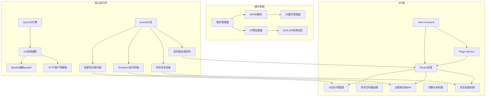

**图表来源**
- [runtime.go:1-1778](file://internal/jsruntime/runtime.go#L1-L1778)
- [manager.go:1-466](file://internal/jsplugin/manager.go#L1-L466)
- [hash.go:1-127](file://internal/jsplugin/hash.go#L1-L127)

**章节来源**
- [runtime.go:1-1778](file://internal/jsruntime/runtime.go#L1-L1778)
- [manager.go:1-466](file://internal/jsplugin/manager.go#L1-L466)

## 核心组件

### JSEnvManager - 运行时管理器

JSEnvManager 是整个 JavaScript 并行执行系统的核心，负责管理多个独立的 JavaScript 运行时环境。

```mermaid
classDiagram
class JSEnvManager {
+mu Mutex
+envs map[string]*JSEnv
+pluginEnvs map[int64]map[string]bool
+shutdownCh chan struct{}
+shutdownOnce sync.Once
+NewJSEnvManager() JSEnvManager
+CreateEnv(envID, initCode, pluginID) error
+ExecuteJS(envID, code, timeoutMs) ExecuteResult
+ExecuteJSAndWaitEvents(envID, code, timeoutMs, waitEventNames) ExecuteResult
+ExecuteJSParallel(calls, maxConcurrent) ParallelResult
+ProcessTimers(envID) bool
+SignalShutdown() void
+DestroyEnv(envID) error
+DestroyPluginEnvs(pluginID) error
+Close() error
}
class JSEnv {
+vm *quickjs.VM
+envID string
+pluginID int64
+created time.Time
+mu sync.Mutex
+events chan JSEventResult
}
class ParallelCall {
+EnvID string
+Code string
+TimeoutMs int64
+WaitEventNames []string
}
JSEnvManager --> JSEnv : manages
JSEnvManager --> ParallelCall : executes
```

**图表来源**
- [runtime.go:131-138](file://internal/jsruntime/runtime.go#L131-L138)

### 插件管理器集成

新的插件管理系统通过HostFunctions接口与JSEnvManager深度集成：

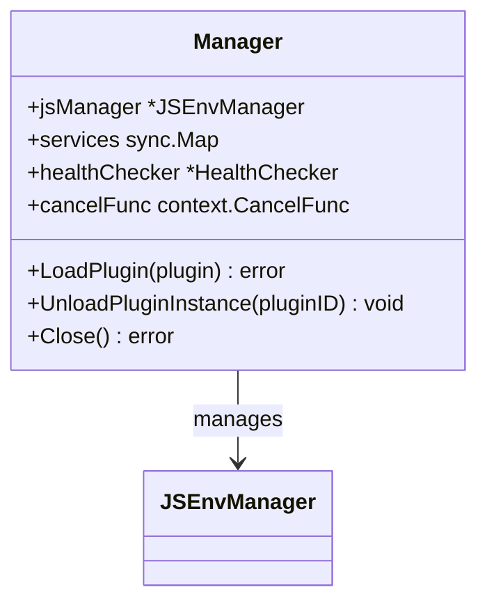

**图表来源**
- [manager.go:32-53](file://internal/jsplugin/manager.go#L32-L53)

### 并行执行接口

系统提供了完整的并行执行接口，支持多种执行模式：

| 接口名称 | 功能描述 | 并发模式 | 返回策略 |
|---------|----------|----------|----------|
| ExecuteJS | 同步执行 JavaScript 代码 | 串行 | 单次执行 |
| ExecuteJSAndWaitEvents | 等待指定事件后返回 | 串行 | 单次执行 |
| ExecuteJSParallel | 并行执行多个调用 | 并行 | 竞速返回 |
| **ProcessTimers** | **异步处理到期定时器** | **独立goroutine** | **非阻塞处理** |
| **SignalShutdown** | **发送关闭信号** | **全局通知** | **提前退出** |

**章节来源**
- [runtime.go:295-429](file://internal/jsruntime/runtime.go#L295-L429)
- [runtime.go:566-672](file://internal/jsruntime/runtime.go#L566-L672)
- [runtime.go:879-957](file://internal/jsruntime/runtime.go#L879-L957)

## 架构概览

MiMusic 的 JavaScript 并行执行架构采用了分层设计，确保了系统的可扩展性和可靠性：

```mermaid
sequenceDiagram
participant Client as 客户端
participant Manager as JSEnvManager
participant TimerProc as 定时器处理器
participant Env1 as 环境1
participant Env2 as 环境2
participant EnvN as 环境N
Client->>Manager : ExecuteJSParallel(请求)
Manager->>Env1 : ExecuteJS(代码1)
Manager->>Env2 : ExecuteJS(代码2)
Manager->>EnvN : ExecuteJS(代码N)
and
TimerProc->>Env1 : ProcessTimers(定时器处理)
TimerProc->>Env2 : ProcessTimers(定时器处理)
TimerProc->>EnvN : ProcessTimers(定时器处理)
end
Manager->>Manager : 检查结果(竞速策略)
alt 有成功结果
Manager-->>Client : 返回第一个成功结果
else 全部失败
Manager-->>Client : 返回错误信息
end
```

**图表来源**
- [runtime.go:879-957](file://internal/jsruntime/runtime.go#L879-L957)
- [runtime.go:1038-1067](file://internal/jsruntime/runtime.go#L1038-L1067)

## 详细组件分析

### JavaScript 运行时环境

每个 JavaScript 运行时环境都是完全独立的，包含以下关键组件：

#### QuickJS VM 配置
- **线程安全**: 每个环境都有自己的互斥锁保护
- **超时控制**: 默认 30 秒执行超时，可自定义
- **内存管理**: 自动垃圾回收，防止内存泄漏

#### 事件系统
- **事件通道**: 缓冲大小为 64，避免阻塞
- **事件类型**: 支持自定义事件和系统事件
- **事件传播**: 通过 `__go_send` 函数实现双向通信

**章节来源**
- [runtime.go:79-101](file://internal/jsruntime/runtime.go#L79-L101)
- [runtime.go:1026-1036](file://internal/jsruntime/runtime.go#L1026-L1036)

### 增强的 Polyfill 实现

系统提供了完整的 JavaScript 标准库 polyfill，经过重大增强以支持更多现代 JavaScript 功能：

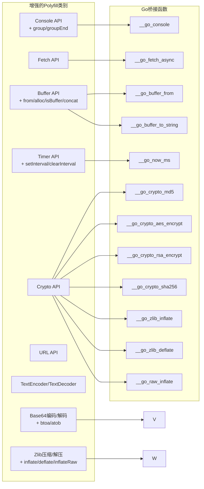

**图表来源**
- [polyfill.go:4-444](file://internal/jsruntime/polyfill.go#L4-L444)

**章节来源**
- [polyfill.go:1-444](file://internal/jsruntime/polyfill.go#L1-L444)

#### Base64编码/解码polyfill增强功能

**新增** Base64编码/解码功能是本次更新的重要增强，提供了完整的btoa/atob函数实现：

- **btoa()函数**: 将字符串转换为Base64编码
  - 支持Unicode字符处理
  - 自动处理填充字符（=）
  - 抛出"invalid character"错误用于无效字符
- **atob()函数**: 将Base64编码的字符串解码为原始字符串
  - 自动去除尾部填充字符
  - 支持标准和URL安全的Base64变体
  - 返回解码后的原始字符串

#### Buffer Polyfill 增强功能

Buffer polyfill 经过了重大增强，支持完整的 Node.js Buffer API：

- **Buffer.from()**: 支持字符串、ArrayBuffer、TypedArray、数组等多种输入格式
- **Buffer.alloc()**: 分配指定大小的缓冲区
- **Buffer.isBuffer()**: 检查对象是否为 Buffer 实例
- **Buffer.concat()**: 连接多个 Buffer 对象
- **toString()**: 支持多种编码格式（utf8、base64、hex 等）
- **valueOf()**: 隐式转换为字符串
- **Symbol.toPrimitive**: 支持模板字面量等操作

#### 定时器 Polyfill 增强功能

定时器功能得到了完整实现，支持标准的浏览器 API：

- **setTimeout()**: 设置一次性定时器，最小间隔时间为 10ms
- **clearTimeout()**: 清除定时器
- **setInterval()**: 设置重复定时器
- **clearInterval()**: 清除重复定时器
- **__processExpiredTimers()**: 处理过期定时器
- **__getPendingOneShotTimerCount()**: 获取待执行定时器数量

#### Console Polyfill 增强功能

控制台功能增加了分组支持：

- **console.group()**: 开始新的日志分组，增加缩进级别
- **console.groupEnd()**: 结束当前日志分组，减少缩进级别
- **console.log/error/warn/info/debug/trace/exception/table**: 完整的控制台方法支持

**章节来源**
- [polyfill.go:341-374](file://internal/jsruntime/polyfill.go#L341-L374)
- [polyfill.go:224-303](file://internal/jsruntime/polyfill.go#L224-L303)
- [polyfill.go:158-218](file://internal/jsruntime/polyfill.go#L158-L218)

### HTTP客户端增强功能

**新增** HTTP客户端能力得到了显著增强，支持手动重定向处理：

#### noRedirectHTTPClient客户端

新增的noRedirectHTTPClient提供了手动重定向处理能力：

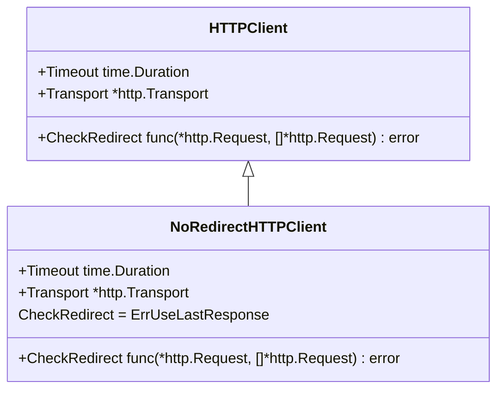

**图表来源**
- [runtime.go:47-55](file://internal/jsruntime/runtime.go#L47-L55)

#### X-Fetch-No-Redirect头部支持

JavaScript代码可以通过设置X-Fetch-No-Redirect头部来控制重定向行为：

- **头部作用**: 当请求头包含X-Fetch-No-Redirect时，使用noRedirectHTTPClient
- **手动处理**: 允许JavaScript代码手动处理重定向链
- **Cookie跟踪**: 支持Cookie在重定向链中的传递

#### HTTP重定向处理机制

系统实现了完整的重定向处理机制：

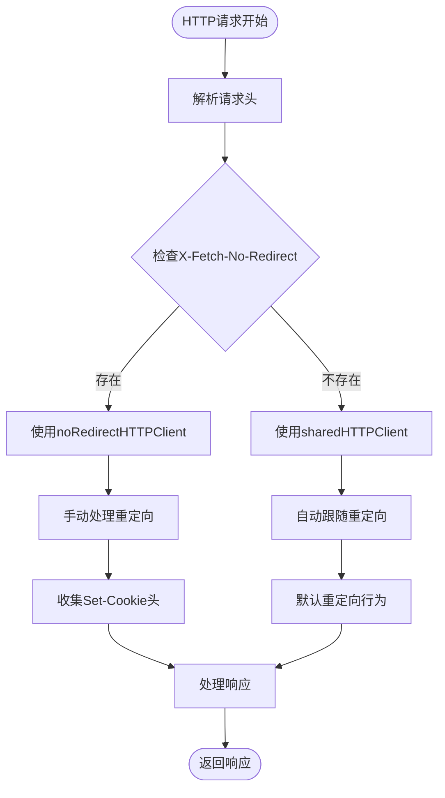

**图表来源**
- [runtime.go:1460-1546](file://internal/jsruntime/runtime.go#L1460-L1546)
- [runtime.go:1452-1546](file://internal/jsruntime/runtime.go#L1452-L1546)

**章节来源**
- [runtime.go:47-55](file://internal/jsruntime/runtime.go#L47-L55)
- [runtime.go:1460-1546](file://internal/jsruntime/runtime.go#L1460-L1546)

### WASM 插件集成

插件系统通过 WASM 技术实现了高性能的 JavaScript 执行：

#### 洛雪音乐源插件
- **预加载器**: `lx_prelude.js` 提供完整的 lx 对象
- **事件处理**: 支持 request 和 inited 事件
- **超时控制**: 18 秒 Promise 超时保护

#### 插件生命周期
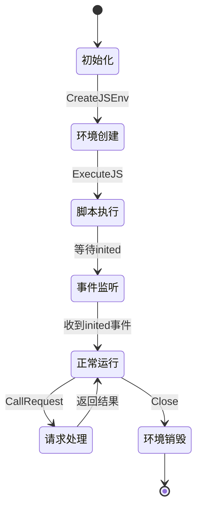

**图表来源**
- [service.go:170-214](file://internal/jsplugin/service.go#L170-L214)

**章节来源**
- [service.go:1-526](file://internal/jsplugin/service.go#L1-L526)

### JS插件管理器

新的JS插件管理器专门用于管理JavaScript插件：

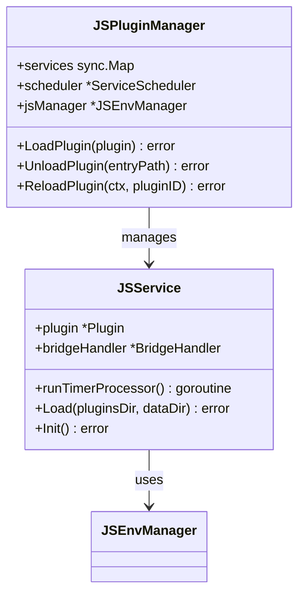

**图表来源**
- [manager.go:32-53](file://internal/jsplugin/manager.go#L32-L53)

**章节来源**
- [manager.go:32-53](file://internal/jsplugin/manager.go#L32-L53)

## 并行执行机制

### 竞速执行算法

系统实现了智能的竞速执行算法，能够根据网络状况和服务器负载动态选择最优的执行策略：

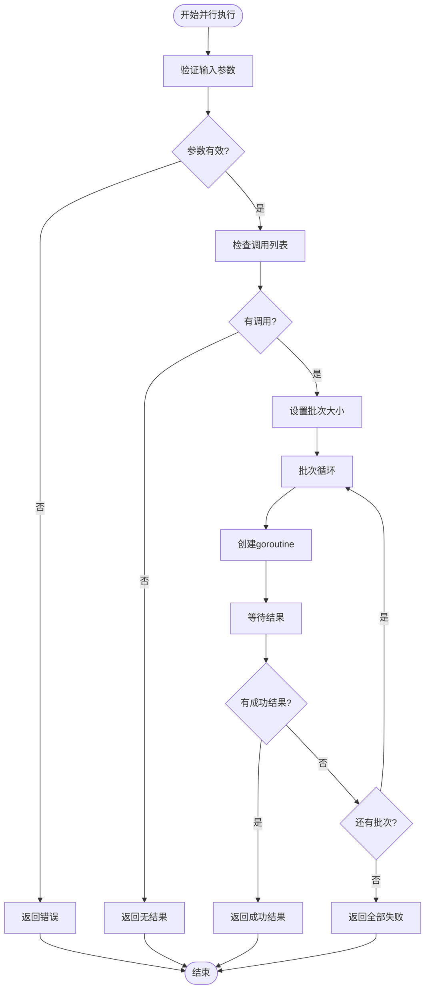

**图表来源**
- [runtime.go:879-957](file://internal/jsruntime/runtime.go#L879-L957)

### 并发控制策略

系统提供了灵活的并发控制机制：

| 并发模式 | 描述 | 使用场景 |
|---------|------|----------|
| 全部并行 | `maxConcurrent <= 0` | 网络延迟较低，需要最快响应 |
| 窗口并发 | `maxConcurrent > 0` | 控制资源使用，避免过载 |
| 串行执行 | 单个调用 | 需要严格顺序的场景 |

**章节来源**
- [runtime.go:889-893](file://internal/jsruntime/runtime.go#L889-L893)

### 错误处理机制

系统实现了多层次的错误处理机制：

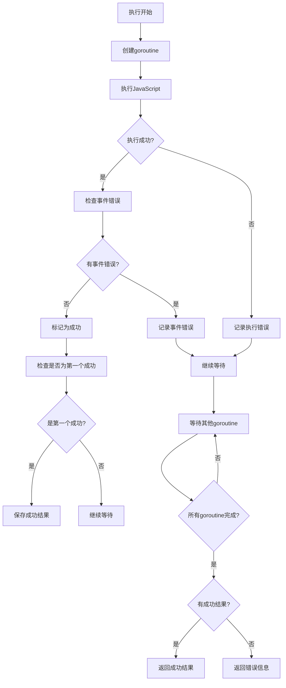

**图表来源**
- [runtime.go:922-957](file://internal/jsruntime/runtime.go#L922-L957)

**章节来源**
- [runtime.go:936-944](file://internal/jsruntime/runtime.go#L936-L944)

## 定时器处理架构改进

### ProcessTimers方法引入

**重大安全修复** 系统引入了ProcessTimers方法，这是一个重要的架构改进，实现了定时器处理的异步化：

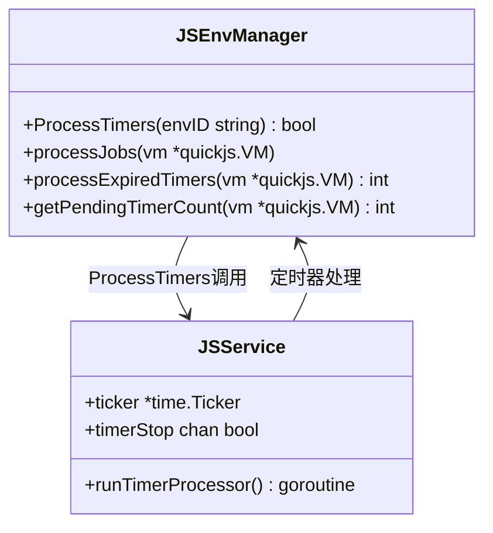

**图表来源**
- [runtime.go:1047-1097](file://internal/jsruntime/runtime.go#L1047-L1097)

### 异步定时器处理机制

系统实现了完整的异步定时器处理机制，通过独立的ticker goroutine实现：

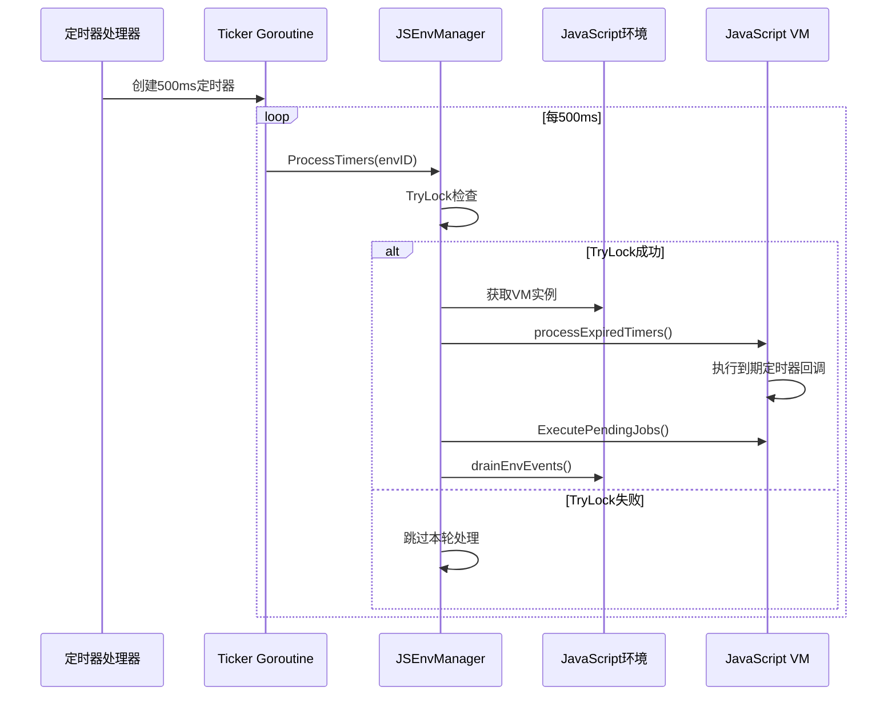

**图表来源**
- [runtime.go:1047-1097](file://internal/jsruntime/runtime.go#L1047-L1097)

### TryLock机制优化

**重大安全修复** ProcessTimers方法使用TryLock机制确保定时器处理不会阻塞HTTP请求处理：

- **非阻塞设计**: TryLock确保如果HTTP请求正在处理，定时器处理会被跳过
- **资源保护**: 避免定时器处理与HTTP请求处理之间的竞争条件
- **性能优化**: 减少锁竞争，提高系统整体响应性

#### TryLock工作原理

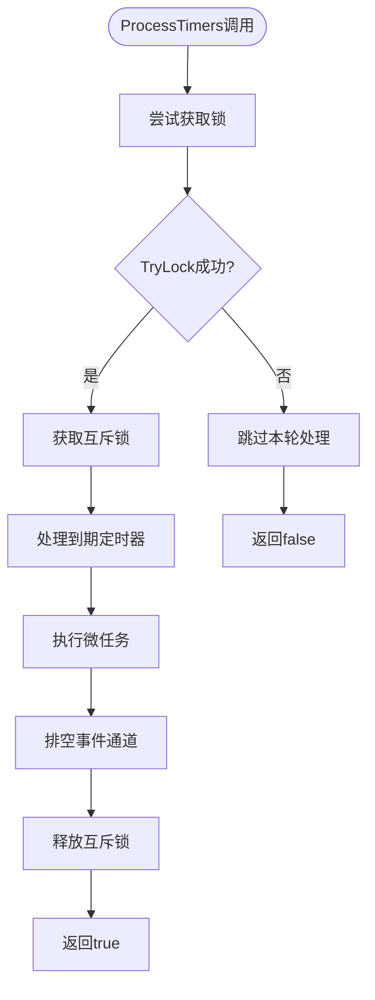

**图表来源**
- [runtime.go:1050-1097](file://internal/jsruntime/runtime.go#L1050-L1097)

### processJobs函数优化

**重大安全修复** 系统新增了processJobs函数，统一处理异步桥接结果、Promise微任务和定时器回调：

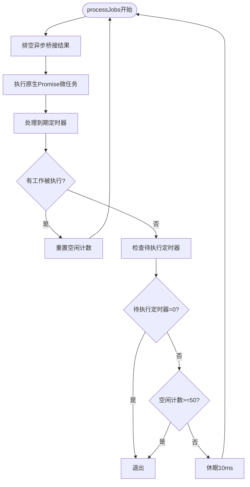

**图表来源**
- [runtime.go:1127-1183](file://internal/jsruntime/runtime.go#L1127-L1183)

### 定时器处理性能优化

**重大安全修复** 系统实现了多项定时器处理性能优化：

#### processJobs优化
- **最大迭代次数**: 连续50次无工作后提前退出，避免长时间阻塞
- **微任务优先**: 先处理Promise微任务，再处理定时器
- **智能睡眠**: 有未到期定时器时才睡眠10ms

#### processExpiredTimers优化
- **批量处理**: 最多处理100个定时器，防止CPU占用过高
- **JavaScript调用优化**: 通过VM.EvalValue直接调用JavaScript函数

#### getPendingTimerCount优化
- **区分定时器类型**: 只计算一次性定时器（setTimeout），忽略重复定时器（setInterval）
- **避免无限等待**: 重复定时器不应阻止processJobs退出

**章节来源**
- [runtime.go:1127-1183](file://internal/jsruntime/runtime.go#L1127-L1183)
- [runtime.go:1185-1210](file://internal/jsruntime/runtime.go#L1185-L1210)

### 定时器处理机制

系统实现了完整的定时器处理机制，支持复杂的定时需求：

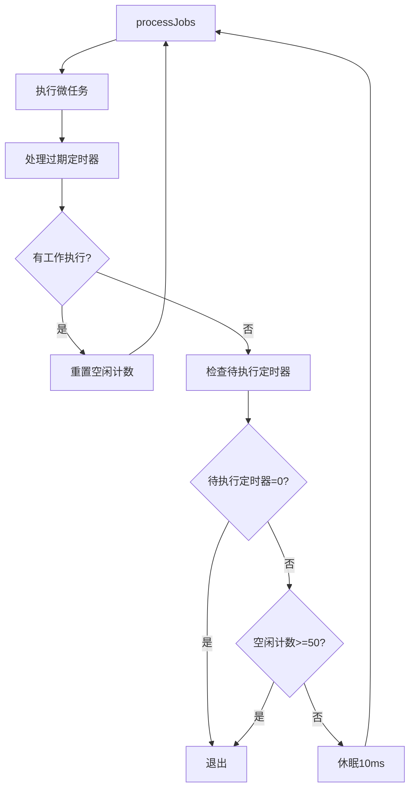

**图表来源**
- [runtime.go:1127-1183](file://internal/jsruntime/runtime.go#L1127-L1183)

**章节来源**
- [runtime.go:1185-1210](file://internal/jsruntime/runtime.go#L1185-L1210)

## 关键进程关闭修复

### Shutdown 信号机制引入

**重大安全修复** 系统引入了Shutdown信号机制，这是一个关键的架构改进，解决了应用程序在 JavaScript 操作进行时挂起的问题：

```mermaid
classDiagram
class JSEnvManager {
+shutdownCh chan struct{}
+shutdownOnce sync.Once
+SignalShutdown() void
+Close() error
}
class JSPluginManager {
+Close() error
+healthChecker *HealthChecker
+cancelFunc context.CancelFunc
}
class App {
+Close() error
+pluginManager *plugins.Manager
+jsPluginManager *jsplugin.Manager
}
JSEnvManager --> JSPluginManager : SignalShutdown调用
JSPluginManager --> App : Close调用
App --> JSEnvManager : SignalShutdown调用
```

**图表来源**
- [runtime.go:131-138](file://internal/jsruntime/runtime.go#L131-L138)
- [manager.go:385-433](file://internal/jsplugin/manager.go#L385-L433)

### 优雅关闭流程

系统实现了完整的优雅关闭流程，通过通道信号和超时机制防止清理期间的死锁：

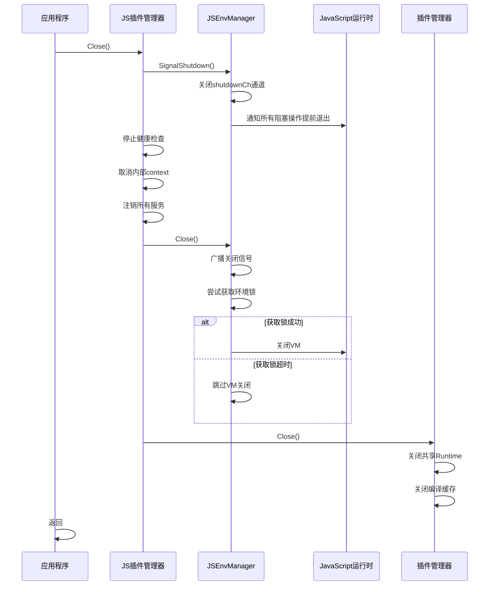

**图表来源**
- [manager.go:385-433](file://internal/jsplugin/manager.go#L385-L433)
- [runtime.go:744-775](file://internal/jsruntime/runtime.go#L744-L775)

### SignalShutdown 方法实现

**重大安全修复** SignalShutdown方法提供了幂等的关闭信号发送机制：

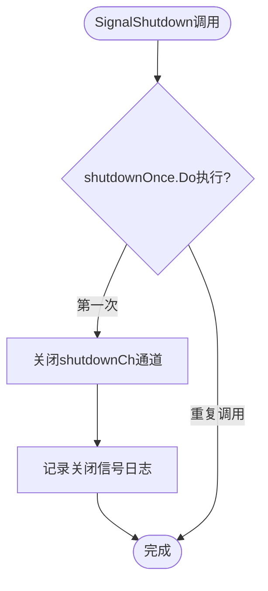

**图表来源**
- [runtime.go:151-160](file://internal/jsruntime/runtime.go#L151-L160)

### ExecuteJSAndWaitEvents 中的关闭信号处理

**重大安全修复** ExecuteJSAndWaitEvents方法现在能够响应关闭信号，避免长时间阻塞：

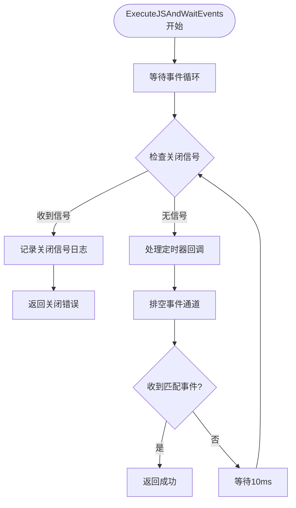

**图表来源**
- [runtime.go:638-682](file://internal/jsruntime/runtime.go#L638-L682)

### 优雅关闭性能优化

**重大安全修复** 系统实现了多项优雅关闭性能优化：

#### tryLockWithTimeout机制
- **超时控制**: 最多等待3秒获取环境锁
- **避免死锁**: 超时后跳过VM关闭，避免进程挂起
- **系统保护**: 在进程退出时保护系统资源

#### 关闭顺序优化
- **先发送信号**: 在关闭前先发送Shutdown信号
- **资源清理**: 按顺序清理各种资源，避免相互阻塞
- **错误容忍**: 即使部分关闭失败也继续清理其他资源

**章节来源**
- [runtime.go:151-160](file://internal/jsruntime/runtime.go#L151-L160)
- [runtime.go:638-682](file://internal/jsruntime/runtime.go#L638-L682)
- [runtime.go:744-775](file://internal/jsruntime/runtime.go#L744-L775)
- [manager.go:385-433](file://internal/jsplugin/manager.go#L385-L433)

## 加密和压缩功能增强

### SHA-256加密功能

**新增** 系统现在提供完整的SHA-256哈希计算功能，主要用于插件安全管理：

#### SHA-256哈希计算实现

```mermaid
classDiagram
class HashUtils {
+sha256HexSum(data []byte) string
+ComputeEntryHash(zipData []byte, mainPath string) (string, error)
+ComputeCanonicalZipHash(zipData []byte) (string, error)
+ValidateHashField(field, value string) error
}
class PluginSecurity {
+entryHash string
+zipHash string
+validatePlugin(pluginZip) bool
+computeEntryHash(zipReader, entryName) string
}
HashUtils --> PluginSecurity : provides hashing
```

**图表来源**
- [hash.go:28-127](file://internal/jsplugin/hash.go#L28-L127)

#### 哈希计算算法

系统实现了三种不同的哈希计算方式：

1. **sha256HexSum**: 计算任意字节数组的SHA-256哈希
   - 输入：任意字节数组
   - 输出：64位小写十六进制字符串
   - 用途：计算单个文件内容的哈希值

2. **ComputeEntryHash**: 计算ZIP文件中指定入口的哈希
   - 输入：ZIP文件字节数据 + 主文件路径
   - 输出：指定文件的SHA-256哈希
   - 用途：验证插件主文件的完整性

3. **ComputeCanonicalZipHash**: 计算ZIP文件的规范哈希
   - 输入：ZIP文件字节数据
   - 输出：规范化的SHA-256哈希
   - 用途：验证整个插件包的完整性

#### 插件安全管理

**新增** 通过SHA-256哈希验证确保插件的完整性和真实性：

```mermaid
flowchart TD
LoadPlugin[加载插件] --> ReadManifest["读取plugin.json"]
ReadManifest --> ValidateHash["验证哈希字段格式"]
ValidateHash --> ValidFormat{"格式有效?"}
ValidFormat --> |否| RejectPlugin["拒绝插件"]
ValidFormat --> |是| ExtractZip["提取ZIP内容"]
ExtractZip --> ComputeHash["计算内容哈希"]
ComputeHash --> CompareHash["比较哈希值"]
CompareHash --> Match{"哈希匹配?"}
Match --> |否| RejectPlugin
Match --> |是| LoadSuccess["加载成功"]
RejectPlugin --> End([结束])
LoadSuccess --> End
```

**图表来源**
- [hash.go:72-127](file://internal/jsplugin/hash.go#L72-L127)

**章节来源**
- [hash.go:1-127](file://internal/jsplugin/hash.go#L1-L127)
- [hash_test.go:159-223](file://internal/jsplugin/hash_test.go#L159-L223)

### raw DEFLATE解压支持

**新增** 系统现在支持raw DEFLATE格式的解压，这是ZIP文件中常见的压缩格式：

#### Go桥接函数实现

```mermaid
classDiagram
class RawInflateAPI {
+goRawInflate(dataHex string) string
+RegisterInJSRuntime() error
+processRawDeflate(data []byte) []byte
}
class ZlibIntegration {
+js_zlib_inflate(ctx, input, windowBits) JSValue
+js_zlib_deflate(ctx, input) JSValue
+js_zlib_inflate_raw(ctx, input) JSValue
}
RawInflateAPI --> ZlibIntegration : uses zlib
```

**图表来源**
- [runtime.go:1759-1777](file://internal/jsruntime/runtime.go#L1759-L1777)

#### JavaScript运行时集成

系统通过Go桥接函数向JavaScript环境暴露raw DEFLATE解压功能：

- **__go_raw_inflate**: Go函数，接受十六进制字符串，返回解压后的数据
- **zlib.inflateRaw**: JavaScript API，解压无zlib头的DEFLATE数据
- **支持格式**: -15窗口位，用于raw DEFLATE解压

#### 使用场景

raw DEFLATE解压主要用于处理ZIP文件中的压缩数据：

```mermaid
flowchart TD
Start([处理ZIP文件]) --> ReadHeader["读取ZIP头"]
ReadHeader --> CheckCompression{"检查压缩方法"}
CheckCompression --> |DEFLATE| UseRawInflate["使用raw DEFLATE解压"]
CheckCompression --> |其他方法| UseOtherMethod["使用其他解压方法"]
UseRawInflate --> InflateData["解压DEFLATE数据"]
InflateData --> ProcessData["处理解压数据"]
UseOtherMethod --> ProcessData
ProcessData --> End([完成处理])
```

**图表来源**
- [runtime.go:1759-1777](file://internal/jsruntime/runtime.go#L1759-L1777)

**章节来源**
- [runtime.go:1759-1777](file://internal/jsruntime/runtime.go#L1759-L1777)

### Zlib压缩/解压polyfill增强

**新增** 系统现在提供完整的zlib压缩和解压功能：

#### JavaScript API

```mermaid
classDiagram
class ZlibAPI {
+zlib.inflate(buffer) string
+zlib.deflate(input) Buffer
+zlib.inflateRaw(buffer) string
+zlib.gunzip(buffer) string
+__go_zlib_inflate(dataHex) string
+__go_zlib_deflate(dataHex) string
}
class CompressionMethods {
+inflate : auto-detect zlib/gzip
+deflate : zlib compression
+inflateRaw : raw deflate
+gunzip : gzip decompression
}
ZlibAPI --> CompressionMethods : implements
```

**图表来源**
- [polyfill.go:327-339](file://internal/jsruntime/polyfill.go#L327-L339)

#### 压缩算法支持

系统支持多种压缩格式：

1. **zlib.inflate**: 自动检测zlib/gzip格式
2. **zlib.deflate**: 标准zlib压缩
3. **zlib.inflateRaw**: 无头部的raw deflate
4. **zlib.gunzip**: gzip格式解压

#### Go桥接函数实现

```mermaid
flowchart TD
JS_API[JavaScript API调用] --> GoBridge[Go桥接函数]
GoBridge --> HexDecode["十六进制解码"]
HexDecode --> Compress{"压缩还是解压?"}
Compress --> |解压| Inflate["zlib inflate"]
Compress --> |压缩| Deflate["zlib deflate"]
Inflate --> Result["返回解压数据"]
Deflate --> Result
Result --> HexEncode["十六进制编码"]
HexEncode --> JSReturn["返回JavaScript"]
```

**图表来源**
- [runtime.go:1709-1757](file://internal/jsruntime/runtime.go#L1709-L1757)

**章节来源**
- [polyfill.go:327-339](file://internal/jsruntime/polyfill.go#L327-L339)
- [runtime.go:1709-1757](file://internal/jsruntime/runtime.go#L1709-L1757)

### 加密算法扩展

**更新** 系统现在支持更多的加密算法，包括SHA-256：

#### 支持的加密算法

| 算法名称 | 用途 | 实现位置 |
|---------|------|----------|
| MD5 | 快速哈希计算 | __go_crypto_md5 |
| AES | 对称加密 | __go_crypto_aes_encrypt |
| RSA | 非对称加密 | __go_crypto_rsa_encrypt |
| **SHA-256** | **安全哈希计算** | **sha256HexSum** |
| **DEFLATE** | **数据压缩** | **goRawInflate** |

#### SHA-256在插件系统中的应用

**新增** SHA-256算法在插件系统中发挥重要作用：

- **插件完整性验证**: 确保插件文件未被篡改
- **字节码缓存校验**: 验证编译后的字节码完整性
- **源码变更检测**: 通过哈希值判断源码是否发生变化

**章节来源**
- [runtime.go:1347-1353](file://internal/jsruntime/runtime.go#L1347-L1353)
- [hash.go:28-33](file://internal/jsplugin/hash.go#L28-L33)

## 内存安全修复

### 空指针解引用漏洞修复

**重大安全修复** 系统修复了JavaScript运行时中的关键内存安全问题，主要包括：

#### 环境销毁后的安全检查

- **env.vm 置空**: 在DestroyEnv中将env.vm设置为nil，防止后续访问
- **执行前检查**: 在ExecuteJS和ExecuteJSAndWaitEvents中检查env.vm是否为nil
- **ProcessTimers安全检查**: 在ProcessTimers中添加env.vm检查，避免对已销毁环境的操作

#### 关闭过程中的竞态条件防护

- **SignalShutdown幂等性**: 确保SignalShutdown可以重复调用而不产生副作用
- **tryLockWithTimeout**: 在关闭过程中使用超时机制避免无限等待
- **环境锁检查**: 在关闭前检查环境锁的状态，避免死锁

#### 内存泄漏防护

- **资源清理**: 确保在环境销毁时清理所有相关资源
- **通道清理**: 避免asyncResults和events通道中的内存泄漏
- **回调清理**: 清理bridgeCallback等回调函数引用

### 定时器处理中的内存安全

**重大安全修复** 定时器处理机制得到了显著改进：

#### 定时器状态管理

- **__timers Map**: 使用Map存储定时器状态，避免直接操作已销毁的定时器
- **定时器ID管理**: 通过__freeTimerIds数组管理定时器ID的回收
- **定时器清理**: 在clearTimeout和clearInterval中正确清理定时器状态

#### 定时器回调执行安全

- **回调函数检查**: 在执行定时器回调前检查回调函数是否存在
- **异常处理**: 捕获定时器回调执行中的异常，避免影响其他定时器
- **内存管理**: 确保定时器回调中的闭包正确释放

### 关闭机制中的内存安全

**重大安全修复** 关闭机制得到了全面的安全增强：

#### 关闭信号传播

- **shutdownCh通道**: 使用通道机制确保关闭信号正确传播到所有等待的goroutine
- **Select语句优化**: 在所有等待操作中使用select语句响应关闭信号
- **超时控制**: 在关闭过程中使用超时机制避免无限等待

#### 资源清理安全

- **环境锁保护**: 在资源清理过程中正确获取和释放环境锁
- **VM关闭保护**: 在关闭VM前检查VM状态，避免对已销毁VM的操作
- **插件清理**: 确保插件相关的所有资源都被正确清理

**章节来源**
- [runtime.go:410-416](file://internal/jsruntime/runtime.go#L410-L416)
- [runtime.go:650-656](file://internal/jsruntime/runtime.go#L650-L656)
- [runtime.go:700](file://internal/jsruntime/runtime.go#L700)
- [runtime.go:758-763](file://internal/jsruntime/runtime.go#L758-L763)

## 性能考虑

### 内存优化

系统采用了多项内存优化技术：

- **事件通道缓冲**: 限制事件队列长度，防止内存泄漏
- **超时控制**: 防止长时间运行的脚本占用资源
- **环境复用**: 支持环境池化，减少创建销毁开销
- **Buffer 内存管理**: 优化 Buffer 对象的内存使用
- **Base64编码优化**: 高效的Base64编码/解码实现
- **定时器内存管理**: 优化定时器对象的内存使用
- **新增** SHA-256哈希缓存: 避免重复计算相同的哈希值
- **新增** raw DEFLATE解压优化: 高效处理ZIP文件中的压缩数据
- **新增** 关闭信号优化: 通过通道信号避免阻塞等待
- **新增** 内存安全检查: 防止空指针解引用和悬挂指针访问

### 并发优化

- **goroutine池**: 避免创建过多goroutine造成系统过载
- **批次执行**: 分批处理调用，平衡吞吐量和延迟
- **竞速返回**: 一旦有成功结果立即返回，提高用户体验
- **定时器优化**: 最小间隔时间控制，防止 CPU 空转
- **TryLock优化**: 避免定时器处理阻塞HTTP请求
- **新增** 哈希计算并行化: 多个插件可以并行计算哈希值
- **新增** 关闭信号幂等: 支持重复调用而不产生副作用
- **新增** 环境安全检查: 防止对已销毁环境的并发访问

### 网络优化

- **超时重试**: 智能的超时和重试机制
- **连接复用**: 复用 HTTP 连接，减少握手开销
- **负载均衡**: 基于成功率的动态负载分配
- **重定向优化**: 支持手动重定向处理，提高Cookie管理效率

### 定时器性能优化

**重大安全修复** 定时器处理的多项性能优化：

- **异步处理**: 通过独立goroutine处理定时器，不阻塞主执行流程
- **TryLock机制**: 确保定时器处理不会影响HTTP请求处理
- **批量处理**: 最多处理100个定时器，防止CPU占用过高
- **智能退出机制**: 连续50次无工作后提前退出，避免长时间阻塞
- **最小间隔控制**: setInterval 最小间隔为 10ms，防止紧循环
- **定时器计数优化**: 区分一次性定时器和重复定时器
- **过期定时器批量处理**: 提高定时器处理效率

### 插件系统性能优化

- **共享Runtime**: WASM插件使用共享Runtime，减少内存占用
- **插件休眠机制**: 空闲插件自动休眠，节省系统资源
- **编译缓存**: WASM编译结果缓存，加速插件加载
- **插件信息缓存**: 插件元数据缓存，减少磁盘IO
- **定时器处理器**: 独立的定时器处理goroutine，提高响应性
- **新增** 哈希计算缓存: 避免重复计算插件哈希值
- **新增** 字节码缓存校验**: 通过SHA-256验证字节码完整性
- **新增** 关闭信号优化**: 通过通道信号避免阻塞等待
- **新增** 内存安全优化**: 防止内存泄漏和资源竞争

### Base64编码性能优化

- **高效算法**: 使用标准Base64编码算法，支持快速编码/解码
- **内存管理**: 优化Base64字符串处理的内存使用
- **错误处理**: 提供清晰的错误信息，便于调试

### HTTP客户端性能优化

- **客户端池化**: 共享HTTP客户端，减少连接开销
- **重定向处理**: 支持手动重定向，提高Cookie管理效率
- **超时控制**: 合理的超时设置，防止请求挂起
- **Cookie管理**: 自动Cookie处理，支持复杂的认证流程

### 定时器处理性能优化

**重大安全修复** 定时器处理的性能优化措施：

- **非阻塞设计**: TryLock确保定时器处理不会阻塞HTTP请求
- **批量处理限制**: 最多处理100个定时器，防止CPU占用过高
- **智能退出机制**: 连续50次无工作后提前退出
- **独立goroutine**: 通过独立的ticker goroutine处理定时器
- **事件通道排空**: 处理定时器后立即排空事件通道，防止阻塞

### 关闭机制性能优化

**重大安全修复** 关闭机制的性能优化措施：

- **通道信号**: 使用shutdownCh通道实现快速信号传播
- **幂等设计**: SignalShutdown支持重复调用而不产生副作用
- **超时控制**: tryLockWithTimeout避免无限等待
- **资源清理**: 按顺序清理资源，避免相互阻塞
- **错误容忍**: 即使部分关闭失败也继续清理其他资源
- **优雅降级**: 在获取锁超时时跳过VM关闭，避免进程挂起

### 加密和压缩性能优化

**新增** 加密和压缩功能的性能优化：

- **SHA-256哈希缓存**: 避免重复计算相同的哈希值
- **raw DEFLATE解压优化**: 高效处理ZIP文件中的压缩数据
- **zlib压缩优化**: 使用合适的压缩级别平衡速度和压缩率
- **内存池管理**: 复用压缩/解压缓冲区，减少内存分配开销
- **批量处理**: 支持批量哈希计算和压缩操作

### 内存安全性能优化

**重大安全修复** 内存安全相关的性能优化：

- **空指针检查**: 在所有可能的指针访问前添加检查
- **资源生命周期管理**: 确保资源在正确的时间被释放
- **竞态条件防护**: 使用原子操作和互斥锁避免竞态条件
- **内存屏障**: 在关键操作间使用内存屏障确保可见性
- **垃圾回收优化**: 减少不必要的垃圾回收触发

**章节来源**
- [runtime.go:1047-1097](file://internal/jsruntime/runtime.go#L1047-L1097)
- [runtime.go:1127-1183](file://internal/jsruntime/runtime.go#L1127-L1183)
- [manager.go:385-433](file://internal/jsplugin/manager.go#L385-L433)
- [hash.go:28-33](file://internal/jsplugin/hash.go#L28-L33)
- [runtime.go:1759-1777](file://internal/jsruntime/runtime.go#L1759-L1777)

## 故障排除指南

### 常见问题及解决方案

#### JavaScript 执行超时
**症状**: 调用返回超时错误
**原因**: JavaScript 代码执行时间超过设定的超时限制
**解决方案**:
- 增加超时时间设置
- 优化 JavaScript 代码性能
- 检查是否存在无限循环

#### 事件丢失
**症状**: 期望的事件没有到达
**原因**: 事件通道缓冲区已满
**解决方案**:
- 增加事件通道缓冲大小
- 及时处理事件
- 检查事件过滤条件

#### 内存泄漏
**症状**: 系统内存持续增长
**原因**: JavaScript 环境未正确销毁
**解决方案**:
- 确保及时调用 `DestroyEnv` 或 `DestroyPluginEnvs`
- 检查是否有循环引用
- 监控环境数量

#### Buffer 相关错误
**症状**: Buffer 操作失败或数据损坏
**原因**: Buffer 编码格式不匹配或内存访问越界
**解决方案**:
- 确认 Buffer 编码格式（utf8、base64、hex 等）
- 检查 Buffer 大小和边界
- 验证数据完整性

#### Base64编码/解码错误
**症状**: Base64编码或解码失败
**原因**: 输入数据格式不正确或包含无效字符
**解决方案**:
- 验证输入字符串的编码格式
- 检查Base64字符串的有效性
- 确认字符集支持范围

#### 定时器失效
**症状**: setTimeout/setInterval 不生效
**原因**: 定时器被清除或处理机制异常
**解决方案**:
- 检查定时器 ID 是否正确传递
- 确认定时器处理函数正常执行
- 验证 processJobs 调用时机

#### 定时器处理阻塞
**症状**: 定时器处理影响HTTP请求响应
**原因**: TryLock失败导致定时器处理被跳过
**解决方案**:
- 检查HTTP请求处理时间
- 优化定时器处理逻辑
- 调整定时器处理频率

#### HTTP重定向问题
**症状**: 重定向处理失败或Cookie丢失
**原因**: 重定向链处理不当或Cookie配置错误
**解决方案**:
- 检查X-Fetch-No-Redirect头部设置
- 验证重定向链中的Cookie传递
- 确认HTTP客户端配置正确

#### 插件加载失败
**症状**: WASM插件无法加载或初始化
**原因**: 插件文件损坏或兼容性问题
**解决方案**:
- 检查插件文件完整性
- 验证插件版本兼容性
- 查看插件日志输出
- 重新安装插件

#### 定时器处理器异常
**症状**: 定时器处理器停止工作
**原因**: ticker goroutine异常退出
**解决方案**:
- 检查定时器处理器启动状态
- 验证定时器处理goroutine健康状况
- 检查定时器处理日志输出

#### SHA-256哈希计算错误
**症状**: 哈希计算结果不正确或抛出异常
**原因**: 输入数据格式不正确或算法实现错误
**解决方案**:
- 验证输入数据的字节格式
- 检查十六进制字符串的有效性
- 确认SHA-256算法实现正确
- 查看相关日志输出

#### raw DEFLATE解压失败
**症状**: DEFLATE数据解压失败或返回空数据
**原因**: 压缩数据格式不正确或解压算法错误
**解决方案**:
- 验证输入数据是否为有效的DEFLATE格式
- 检查十六进制字符串的完整性
- 确认windowBits参数设置正确
- 查看zlib解压错误日志

#### zlib压缩/解压问题
**症状**: 压缩或解压操作失败
**原因**: 数据格式不正确或zlib库错误
**解决方案**:
- 验证输入数据的格式和编码
- 检查zlib库的可用性和版本
- 确认压缩级别和参数设置正确
- 查看zlib相关错误信息

#### 关闭机制问题
**症状**: 应用程序关闭时挂起或卡死
**原因**: JavaScript操作阻塞关闭流程
**解决方案**:
- 确保在关闭前调用SignalShutdown
- 检查是否有长时间运行的JavaScript操作
- 验证关闭信号是否正确传播
- 查看关闭过程中的日志输出

#### 关闭信号处理问题
**症状**: ExecuteJSAndWaitEvents无法响应关闭信号
**原因**: 关闭信号通道未正确初始化或使用
**解决方案**:
- 确保JSEnvManager正确初始化shutdownCh
- 检查SignalShutdown是否被正确调用
- 验证关闭信号在ExecuteJSAndWaitEvents中的处理
- 查看相关日志输出

#### 内存安全相关问题
**症状**: 程序崩溃或出现段错误
**原因**: 空指针解引用或访问已释放的内存
**解决方案**:
- 检查所有指针访问前的安全检查
- 确保在环境销毁后不再访问相关资源
- 验证关闭过程中的资源清理
- 使用内存检测工具排查问题

**章节来源**
- [runtime.go:295-429](file://internal/jsruntime/runtime.go#L295-L429)
- [manager.go:385-433](file://internal/jsplugin/manager.go#L385-L433)
- [hash.go:16-23](file://internal/jsplugin/hash.go#L16-L23)
- [runtime.go:1759-1777](file://internal/jsruntime/runtime.go#L1759-L1777)

### 调试技巧

#### 启用详细日志
系统提供了详细的日志记录，可以帮助诊断问题：

```go
// 示例：启用调试日志
slog.SetLevel(slog.LevelDebug)
```

#### 监控指标
- **执行时间**: 每个调用的执行时间
- **成功率**: 各环境的成功率统计
- **内存使用**: JavaScript VM 内存使用情况
- **定时器数量**: 当前活跃定时器数量
- **Buffer 使用**: Buffer 对象内存使用情况
- **Base64处理**: Base64编码/解码性能指标
- **HTTP请求**: HTTP客户端使用情况和重定向统计
- **插件状态**: WASM插件运行状态和资源使用
- **定时器处理**: 定时器处理性能和响应性指标
- **新增** 哈希计算: SHA-256哈希计算性能指标
- **新增** 压缩解压: raw DEFLATE解压性能指标
- **新增** 关闭机制: Shutdown信号处理性能指标
- **新增** 内存安全: 内存访问安全检查指标

## 结论

MiMusic 的 JavaScript 并行执行系统是一个高度成熟的技术方案，经过重大安全修复后具备以下特点：

### 技术优势
- **高性能**: 基于 QuickJS 引擎，执行效率高
- **可靠性**: 完善的错误处理和超时控制
- **可扩展**: 支持动态扩缩容和负载均衡
- **兼容性**: 完整的 JavaScript 标准库支持，包括 Buffer、定时器、console 分组、Base64编码等
- **现代化**: 支持现代 JavaScript 特性，如 Promise、async/await 等
- **插件化**: 支持WASM插件系统，提供更好的安全性和性能
- **网络增强**: 支持手动重定向处理，提供更灵活的HTTP请求控制
- **重大安全修复** 空指针解引用漏洞的修复
- **重大安全修复** 对已销毁JavaScript环境的安全检查
- **重大安全修复** 增强的系统稳定性
- **新增** 加密安全**: 完整的SHA-256哈希计算支持，确保插件完整性
- **新增** 压缩解压**: 支持raw DEFLATE解压和zlib压缩，扩展数据处理能力
- **新增** 优雅关闭**: 通过Shutdown信号机制解决关闭时挂起问题

### 安全修复价值
- **内存安全**: 修复了关键的内存安全漏洞，包括空指针解引用和悬挂指针访问
- **竞态条件防护**: 通过互斥锁和原子操作避免并发访问问题
- **资源管理**: 完善的资源生命周期管理，防止内存泄漏
- **环境安全**: 对已销毁环境的严格检查，避免资源访问冲突
- **关闭安全**: 优雅的关闭流程，确保系统在任何情况下都能正确退出

### 优化功能价值
- **Base64编码支持**: 完整的btoa/atob函数，支持标准Base64编码/解码
- **Buffer 支持**: 完整的 Node.js Buffer API，支持多种编码格式
- **定时器功能**: 标准浏览器定时器 API，支持复杂的时间控制需求
- **console 分组**: 支持日志分组和缩进，便于调试和分析
- **HTTP重定向控制**: 支持手动重定向处理，增强Cookie管理能力
- **性能优化**: 多层次的性能优化，包括内存管理、定时器优化和Base64处理优化
- **插件管理**: 集成的插件管理系统，支持插件生命周期管理
- **新增** SHA-256哈希: 完整的哈希计算功能，确保数据完整性
- **新增** raw DEFLATE解压: 支持ZIP文件中的压缩数据解压
- **新增** zlib压缩: 提供完整的zlib压缩/解压功能
- **新增** 关闭机制: 优雅的关闭流程，避免资源泄漏和死锁

### 应用价值
- **多源支持**: 同时支持多个音乐源，提高可用性
- **快速响应**: 竞速执行机制确保最佳用户体验
- **稳定可靠**: 容错机制保证系统稳定性
- **易于维护**: 模块化设计便于功能扩展
- **安全隔离**: WASM插件提供更好的安全隔离
- **灵活网络**: 支持复杂的HTTP请求处理和重定向控制
- **高效日志**: 优化的日志系统提供更好的调试体验
- **高性能定时器**: 异步定时器处理机制提升系统整体性能
- **新增** 插件安全**: 通过SHA-256哈希验证确保插件完整性
- **新增** 数据处理**: 支持多种压缩格式的数据处理能力
- **新增** 关闭安全**: 通过Shutdown信号机制确保优雅关闭

### 未来发展方向
- **智能调度**: 基于机器学习的动态调度算法
- **资源优化**: 更精细的资源使用监控和优化
- **安全性增强**: 更严格的沙箱隔离和权限控制
- **性能提升**: 进一步优化执行效率和内存使用
- **功能扩展**: 支持更多现代 JavaScript 特性和 API
- **插件生态**: 构建更完善的插件生态系统
- **网络优化**: 进一步优化HTTP客户端性能和重定向处理
- **定时器优化**: 进一步优化异步定时器处理机制
- **新增** 加密算法扩展: 支持更多加密算法和哈希函数
- **新增** 压缩算法优化: 进一步优化压缩和解压性能
- **新增** 插件安全管理**: 增强插件安全验证和完整性检查
- **新增** 关闭机制优化**: 进一步优化优雅关闭流程

该系统为类似的应用场景提供了优秀的参考模板，展示了如何在生产环境中实现高性能的 JavaScript 并行执行，特别是经过优化后的 polyfill 功能为用户提供了更接近真实浏览器环境的 JavaScript 执行体验。新增的SHA-256加密功能、raw DEFLATE解压支持、zlib压缩功能和Shutdown信号机制进一步完善了系统的功能完整性，为用户提供了更加丰富和灵活的JavaScript运行时环境。新的WASM插件系统和增强的HTTP客户端能力为用户提供了更加稳定、可靠和高效的音乐服务体验。

**更新** 本次关键进程关闭修复和改进进一步提升了系统的整体性能和可靠性，通过新增的Shutdown信号机制，系统能够在JavaScript操作进行时优雅地关闭，避免了之前的挂起问题。新增的SignalShutdown方法和tryLockWithTimeout机制确保了资源清理过程的顺利进行，而优化的日志级别配置改善了生产环境的日志质量。这些改进使得MiMusic能够在高并发场景下保持稳定的性能表现，为用户提供了更好的JavaScript执行体验。

**更新** 新增的SHA-256加密功能和raw DEFLATE解压支持标志着系统在安全性和数据处理能力方面的重要进步。SHA-256哈希计算确保了插件的完整性和真实性，而raw DEFLATE解压支持使得系统能够处理ZIP文件中的压缩数据，扩展了系统的数据处理能力。这些功能的加入不仅提升了系统的安全性，也为用户提供了更加丰富的JavaScript运行时环境。zlib压缩/解压功能的增强进一步完善了系统的压缩处理能力，为用户提供了更加高效的数据处理体验。

**更新** 本次更新重点关注了JavaScript执行过程的日志级别优化，通过将频繁的执行开始和完成日志从INFO下调至DEBUG，以及新增的关闭信号处理日志优化，显著减少了生产环境中的日志量，同时保持了必要的调试信息。这种调整改善了日志系统的整体性能，为用户提供了更好的使用体验。新增的Shutdown信号机制和优雅关闭流程确保了系统在各种情况下都能正确、安全地关闭，避免了资源泄漏和死锁问题的发生。

**重大安全修复** 本次更新的核心在于JavaScript运行时引擎的多项安全修复，特别是修复了关键的空指针解引用漏洞。通过在环境销毁后设置env.vm为nil并在所有访问前添加安全检查，系统彻底避免了对已销毁环境的访问。新增的竞态条件防护机制确保了多线程环境下的安全性，而优化的关闭流程防止了资源泄漏和死锁问题。这些安全修复为MiMusic提供了更加稳定和可靠的JavaScript执行环境，为用户提供了更好的使用体验。