# JavaScript插件系统

<cite>
**本文档引用的文件**
- [internal/jsplugin/manager.go](file://internal/jsplugin/manager.go)
- [internal/jsplugin/service.go](file://internal/jsplugin/service.go)
- [internal/jsplugin/package.go](file://internal/jsplugin/package.go)
- [internal/jsplugin/routes.go](file://internal/jsplugin/routes.go)
- [internal/jsplugin/health.go](file://internal/jsplugin/health.go)
- [internal/jsplugin/hot_reload.go](file://internal/jsplugin/hot_reload.go)
- [internal/jsplugin/api_bridge.go](file://internal/jsplugin/api_bridge.go)
- [internal/jsruntime/runtime.go](file://internal/jsruntime/runtime.go)
- [internal/jsruntime/polyfill.go](file://internal/jsruntime/polyfill.go)
- [internal/jsruntime/pendingjob.go](file://internal/jsruntime/pendingjob.go)
- [internal/jsruntime/README.md](file://internal/jsruntime/README.md)
- [internal/handlers/jsplugin.go](file://internal/handlers/jsplugin.go)
- [internal/models/models.go](file://internal/models/models.go)
- [internal/services/auth_service.go](file://internal/services/auth_service.go)
- [internal/app/app.go](file://internal/app/app.go)
- [internal/app/routers.go](file://internal/app/routers.go)
- [plugin-toolchain/packages/jsc/main.go](file://plugin-toolchain/packages/jsc/main.go)
- [frontend/lib/features/jsplugin/data/jsplugin_api.dart](file://frontend/lib/features/jsplugin/data/jsplugin_api.dart)
- [jsplugins-src/mimusic-jsplugin-lxmusic/plugin.json](file://jsplugins-src/mimusic-jsplugin-lxmusic/plugin.json)
- [jsplugins-src/mimusic-jsplugin-lxmusic/src/main.ts](file://jsplugins-src/mimusic-jsplugin-lxmusic/src/main.ts)
- [jsplugins-src/mimusic-jsplugin-lxmusic/package.json](file://jsplugins-src/mimusic-jsplugin-lxmusic/package.json)
- [jsplugins-src/mimusic-jsplugin-lxmusic/tsconfig.json](file://jsplugins-src/mimusic-jsplugin-lxmusic/tsconfig.json)
- [jsplugins-src/mimusic-jsplugin-lxmusic/static/index.html](file://jsplugins-src/mimusic-jsplugin-lxmusic/static/index.html)
- [jsplugins-src/mimusic-jsplugin-lxmusic/README.md](file://jsplugins-src/mimusic-jsplugin-lxmusic/README.md)
- [jsplugins-src/mimusic-jsplugin-lxmusic/.github/workflows/release.yml](file://jsplugins-src/mimusic-jsplugin-lxmusic/.github/workflows/release.yml)
- [jsplugins/README.md](file://jsplugins/README.md)
- [jsplugins/xiaomi.json](file://jsplugins/xiaomi.json)
</cite>

## 更新摘要
**所做更改**
- 增强了JavaScript插件系统的初始化顺序，确保插件数据目录在加载前创建
- 改进了插件存储目录创建机制，移除了冗余的初始化步骤
- 优化了插件管理器启动流程，提高了系统启动效率
- 完善了插件加载过程中的目录检查和创建逻辑

## 目录
1. [概述](#概述)
2. [架构设计](#架构设计)
3. [JavaScript 运行时系统](#javascript-运行时系统)
4. [隔离环境管理](#隔离环境管理)
5. [异步定时器处理机制](#异步定时器处理机制)
6. [路由分离架构](#路由分离架构)
7. [插件认证增强](#插件认证增强)
8. [JavaScript 运行时增强](#javascript-运行时增强)
9. [入口文件类型支持](#入口文件类型支持)
10. [字节码缓存机制](#字节码缓存机制)
11. [插件清单验证](#插件清单验证)
12. [JavaScriptCore 工具链](#javascriptcore-工具链)
13. [LX Music插件开发模板](#lx-music插件开发模板)
14. [性能优化](#性能优化)
15. [测试覆盖](#测试覆盖)
16. [ZIP包上传功能](#zip包上传功能)
17. [热重载机制](#热重载机制)
18. [错误处理改进](#错误处理改进)

## 概述

JavaScript 插件系统是 mimusic 应用的核心扩展机制，允许开发者通过 JavaScript 代码扩展应用功能。该系统支持两种入口文件格式：传统的 JavaScript 源码文件 (.js) 和经过预编译的字节码文件 (.jsc)，提供了灵活的插件开发和部署选项。

**更新** 完整的 JavaScript 虚拟机实现和隔离环境管理功能，包括 JSEnvManager、JSEnv、BridgeHandler 等核心组件，支持独立的 JavaScript 运行时环境创建、JavaScript 代码执行、事件等待、并行执行等功能。系统现已重构为异步架构，支持真正的异步执行和插件管理API。

## 架构设计

JavaScript 插件系统采用模块化架构设计，主要组件包括：

```mermaid
graph TB
subgraph "插件系统架构"
A[插件管理器] --> B[插件加载器]
A --> C[字节码缓存]
A --> D[JS运行时管理器]
B --> E[清单验证]
B --> F[入口文件读取]
F --> G[优先级选择]
G --> H[.jsc 文件]
G --> I[.js 文件]
C --> J[缓存加载]
C --> K[缓存保存]
D --> L[JSEnvManager]
D --> M[JSEnv]
D --> N[BridgeHandler]
L --> O[隔离环境管理]
L --> P[并行执行]
L --> Q[事件处理]
M --> R[独立VM实例]
M --> S[事件通道]
M --> T[桥接回调]
N --> U[Go桥接函数]
N --> V[权限检查]
N --> W[jsenv API]
A --> X[JSPluginHandler]
A --> Y[HealthChecker]
A --> Z[HotReloader]
X --> AA[插件管理API]
Y --> AB[健康检查]
Z --> AC[热重载监控]
AA --> AD[ZIP包上传]
AA --> AE[手动更新]
```

**图表来源**
- [internal/jsruntime/runtime.go:103-132](file://internal/jsruntime/runtime.go#L103-L132)
- [internal/jsplugin/api_bridge.go:131-151](file://internal/jsplugin/api_bridge.go#L131-L151)
- [internal/jsplugin/service.go:23-46](file://internal/jsplugin/service.go#L23-L46)
- [internal/jsplugin/package.go:23-57](file://internal/jsplugin/package.go#L23-L57)
- [internal/jsplugin/manager.go:32-53](file://internal/jsplugin/manager.go#L32-L53)
- [internal/jsplugin/health.go:55-71](file://internal/jsplugin/health.go#L55-L71)
- [internal/jsplugin/hot_reload.go:13-24](file://internal/jsplugin/hot_reload.go#L13-L24)
- [internal/handlers/jsplugin.go:15-20](file://internal/handlers/jsplugin.go#L15-L20)

## JavaScript 运行时系统

**更新** 完整的 JavaScript 运行时系统，基于 QuickJS 实现，提供独立的 JavaScript 执行环境。

### JSEnvManager 核心组件

JSEnvManager 是 JavaScript 运行时系统的核心管理器，负责创建、管理和销毁多个 JavaScript 运行时环境：

```mermaid
classDiagram
class JSEnvManager {
+mu Mutex
+envs map[string]*JSEnv
+pluginEnvs map[int64]map[string]bool
+shutdownCh chan struct{}
+SignalShutdown()
+CreateEnv(envID, initCode, pluginID)
+CreateEnvWithBytecode(envID, bootstrapCode, bytecode, pluginID)
+ExecuteJS(envID, code, timeoutMs)
+ExecuteJSAndWaitEvents(envID, code, timeoutMs, waitEvents)
+ExecuteJSParallel(calls, maxConcurrent)
+DestroyEnv(envID)
+DestroyPluginEnvs(pluginID)
+Close()
}
class JSEnv {
+vm *quickjs.VM
+envID string
+pluginID int64
+created time.Time
+mu sync.Mutex
+events chan JSEventResult
+sourceCode string
+bridgeCallback BridgeCallback
+asyncResults chan asyncResult
+asyncSignal chan struct{}
+asyncSeq atomic.Uint64
+asyncInflight atomic.Int32
}
class BridgeHandler {
+service *JSService
+permissions []string
+dataDir string
+db database.DB
+pluginToken string
+port string
+HandleBridgeCall(action, data)
+handleJSEnv(action, data)
}
```

**图表来源**
- [internal/jsruntime/runtime.go:101-138](file://internal/jsruntime/runtime.go#L101-L138)
- [internal/jsruntime/runtime.go:64-101](file://internal/jsruntime/runtime.go#L64-L101)
- [internal/jsplugin/api_bridge.go:131-151](file://internal/jsplugin/api_bridge.go#L131-L151)

### 运行时初始化流程

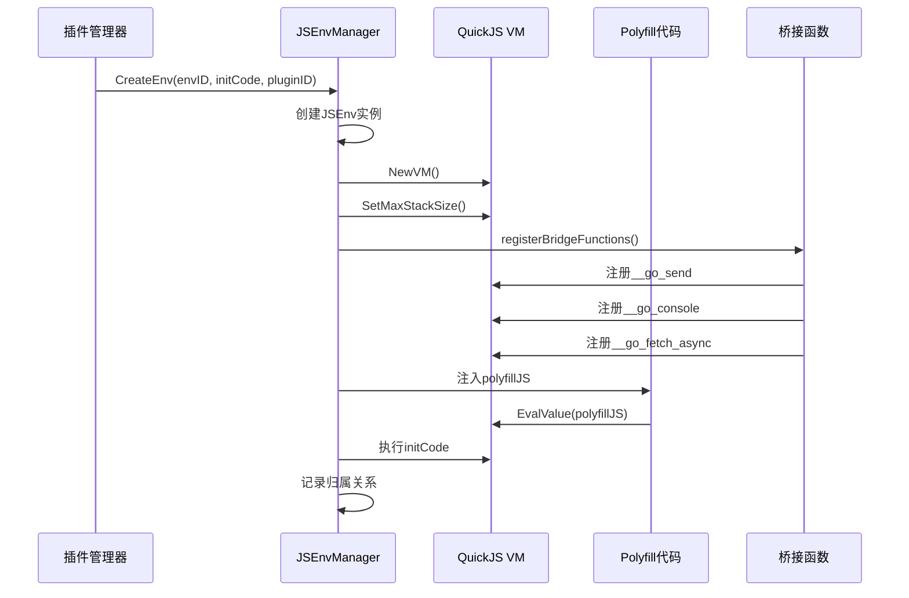

**图表来源**
- [internal/jsruntime/runtime.go:162-223](file://internal/jsruntime/runtime.go#L162-L223)
- [internal/jsruntime/runtime.go:1199-1381](file://internal/jsruntime/runtime.go#L1199-L1381)

**章节来源**
- [internal/jsruntime/runtime.go:101-138](file://internal/jsruntime/runtime.go#L101-L138)
- [internal/jsruntime/runtime.go:162-223](file://internal/jsruntime/runtime.go#L162-L223)
- [internal/jsruntime/README.md:16-63](file://internal/jsruntime/README.md#L16-L63)

## 隔离环境管理

**更新** 完整的 JavaScript 隔离环境管理功能，支持插件内部创建独立的 JavaScript 环境。

### jsenv API 设计

插件可以通过 mimusic.jsenv API 创建和管理独立的 JavaScript 环境：

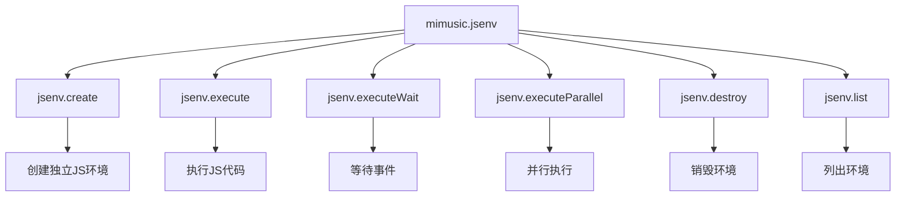

**图表来源**
- [internal/jsplugin/api_bridge.go:94-123](file://internal/jsplugin/api_bridge.go#L94-L123)

### 环境生命周期管理

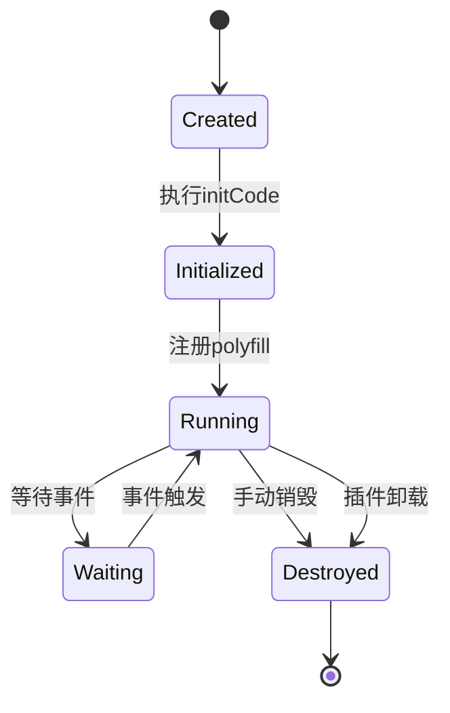

**图表来源**
- [internal/jsruntime/runtime.go:421-477](file://internal/jsruntime/runtime.go#L421-L477)

### 并行执行机制

支持多个 JavaScript 环境的并行执行，提供竞速返回功能：

| 功能 | 描述 | 使用场景 |
|------|------|----------|
| ExecuteJS | 同步执行 JavaScript 代码 | 简单的代码执行 |
| ExecuteJSAndWaitEvents | 等待指定事件后返回 | 异步操作处理 |
| ExecuteJSParallel | 并行执行多个环境 | 性能优化、竞速执行 |
| ExecuteJSAndWaitEvents | 等待事件 | 异步操作监控 |

**章节来源**
- [internal/jsplugin/api_bridge.go:591-703](file://internal/jsplugin/api_bridge.go#L591-L703)
- [internal/jsruntime/runtime.go:879-957](file://internal/jsruntime/runtime.go#L879-L957)

## 异步定时器处理机制

**更新** 系统引入了全新的异步定时器处理机制，通过独立的 goroutine 和非阻塞方法实现高性能的定时器管理。

### 定时器处理架构

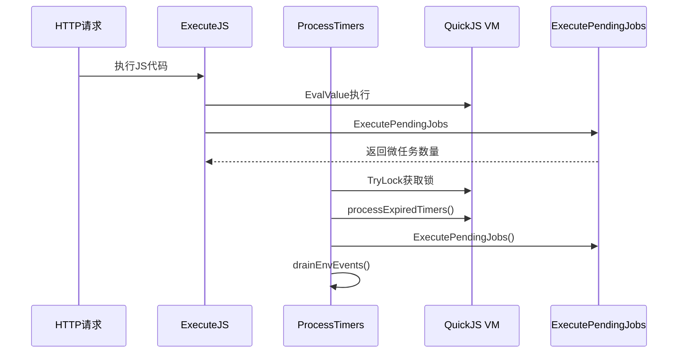

**图表来源**
- [internal/jsruntime/runtime.go:264-311](file://internal/jsruntime/runtime.go#L264-L311)
- [internal/jsruntime/runtime.go:721-750](file://internal/jsruntime/runtime.go#L721-L750)
- [internal/jsruntime/pendingjob.go:13-65](file://internal/jsruntime/pendingjob.go#L13-L65)

### 定时器处理流程

1. **ExecuteJS优化**: 仅处理 Promise 微任务，不再阻塞定时器处理
2. **独立定时器处理器**: ProcessTimers 使用 TryLock 避免阻塞
3. **事件通道管理**: 自动排空事件通道防止阻塞
4. **超时控制**: 支持自定义执行超时时间

### 定时器处理方法

| 方法 | 功能描述 | 锁机制 | 阻塞行为 |
|------|----------|--------|----------|
| ExecuteJS | 执行JS代码并处理Promise微任务 | 普通锁 | 不阻塞定时器 |
| ProcessTimers | 处理到期定时器（非阻塞） | TryLock | 非阻塞 |
| ExecutePendingJobs | 处理微任务 | 直接调用 | 无锁 |

**章节来源**
- [internal/jsruntime/runtime.go:264-311](file://internal/jsruntime/runtime.go#L264-L311)
- [internal/jsruntime/runtime.go:721-750](file://internal/jsruntime/runtime.go#L721-L750)
- [internal/jsruntime/pendingjob.go:13-65](file://internal/jsruntime/pendingjob.go#L13-L65)

## 路由分离架构

系统实现了静态资源与 API 请求的路由分离，提供更高效的请求处理机制：

### 路由分离设计

```mermaid
graph LR
subgraph "路由分离架构"
A[静态资源路由] --> B[RegisterStaticRoutes]
C[API路由] --> D[RegisterAPIRoutes]
B --> E[无需认证]
D --> F[需要认证]
E --> G[直接文件系统访问]
F --> H[JS运行时转发]
G --> I[HTML注入]
G --> J[静态文件缓存]
H --> K[插件服务验证]
H --> L[API请求处理]
H --> M[Base64二进制数据处理]
M --> N[非UTF-8字节序列检测]
M --> O[自动Base64编码]
```

**图表来源**
- [internal/jsplugin/routes.go:20-49](file://internal/jsplugin/routes.go#L20-L49)
- [internal/app/routers.go:28-34](file://internal/app/routers.go#L28-L34)

### 路由注册流程

1. **静态资源路由注册**：`RegisterStaticRoutes` 提供无需认证的静态资源访问
2. **API路由注册**：`RegisterAPIRoutes` 提供需要认证的 API 请求转发
3. **路由优先级**：GET 请求优先匹配具体静态路由，避免进入 catch-all 处理

**章节来源**
- [internal/jsplugin/routes.go:20-49](file://internal/jsplugin/routes.go#L20-L49)
- [internal/app/routers.go:28-34](file://internal/app/routers.go#L28-L34)

## 插件认证增强

系统增强了插件认证机制，支持插件专用的 JWT Token 生成和管理：

### 插件Token生成

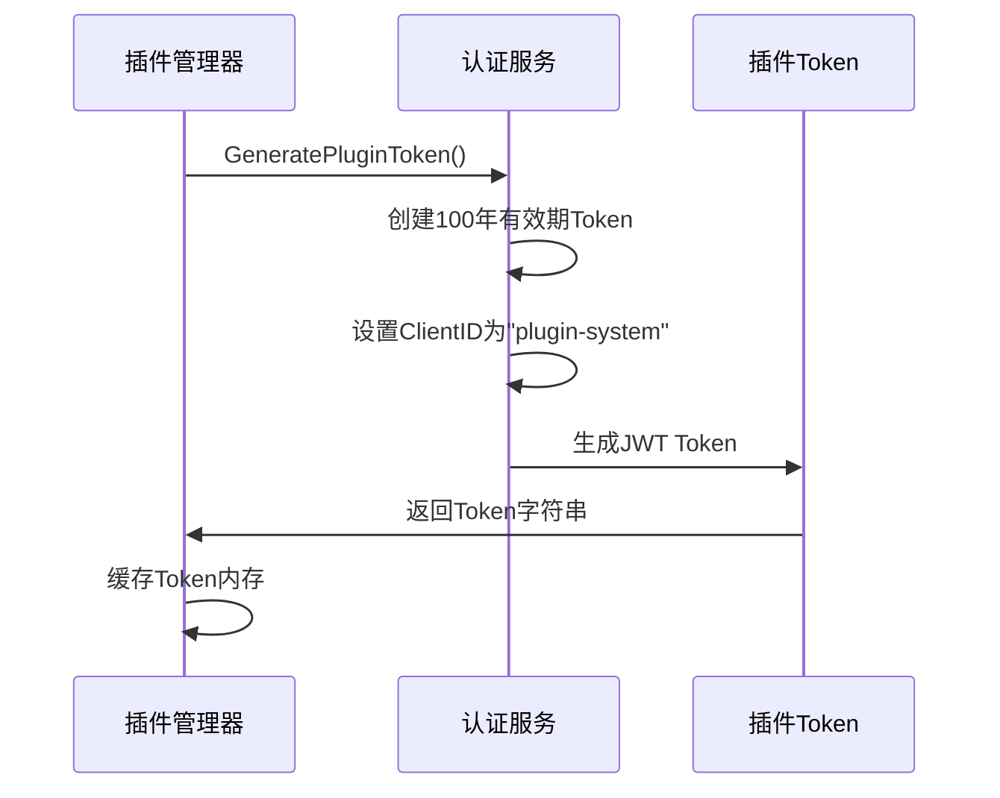

**图表来源**
- [internal/services/auth_service.go:388-423](file://internal/services/auth_service.go#L388-L423)

### 认证流程增强

| 认证类型 | 过期时间 | ClientID | 存储方式 | 使用场景 |
|----------|----------|----------|----------|----------|
| 普通用户Token | 7天 | 动态生成 | 数据库 | Web界面登录 |
| 插件专用Token | 100年 | "plugin-system" | 内存缓存 | 插件内部API调用 |
| 刷新Token | 30天 | 动态生成 | 数据库 | 用户Token续期 |

**章节来源**
- [internal/services/auth_service.go:388-423](file://internal/services/auth_service.go#L388-L423)
- [internal/app/app.go:263](file://internal/app/app.go#L263)

## JavaScript 运行时增强

系统在 JavaScript 运行时环境中新增了多项功能增强，提升插件开发体验：

### Base64 Polyfill

新增完整的 Base64 编码解码功能，确保插件能够正确处理二进制数据：

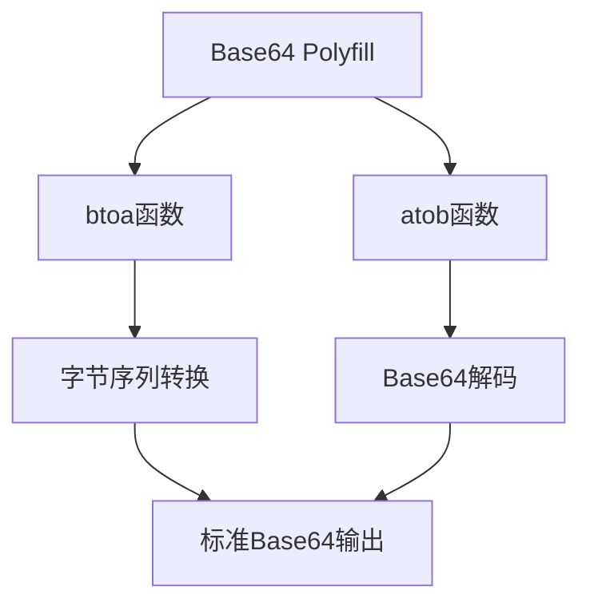

**图表来源**
- [internal/jsruntime/polyfill.go:252-285](file://internal/jsruntime/polyfill.go#L252-L285)

### NoRedirectHTTPClient

新增不跟随重定向的 HTTP 客户端，支持插件手动处理重定向链：

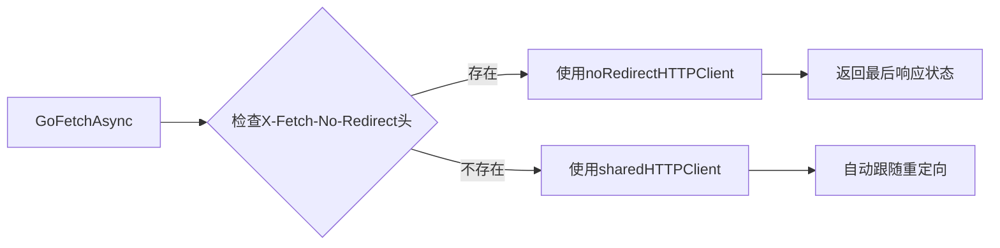

**图表来源**
- [internal/jsruntime/runtime.go:44-55](file://internal/jsruntime/runtime.go#L44-L55)
- [internal/jsruntime/runtime.go:1393-1479](file://internal/jsruntime/runtime.go#L1393-L1479)

### URL和URLSearchParams Polyfill

新增现代 Web API 支持，提升插件兼容性：

| Polyfill类型 | 功能描述 | 使用场景 |
|--------------|----------|----------|
| URL | URL解析和构建 | API请求URL处理 |
| URLSearchParams | 查询参数操作 | 参数序列化和解析 |
| TextEncoder/TextDecoder | 文本编码转换 | 字符串和二进制互转 |

### Base64二进制数据处理增强

**新增** 系统现在能够自动检测和处理非UTF-8字节序列的二进制数据：

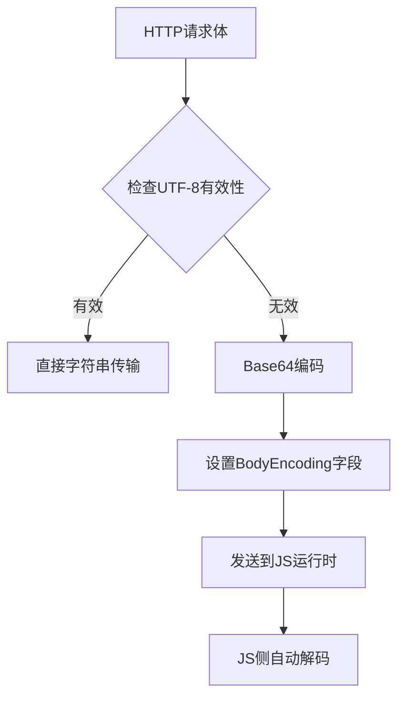

**图表来源**
- [internal/jsplugin/routes.go:325-336](file://internal/jsplugin/routes.go#L325-L336)
- [internal/jsplugin/service.go:379-389](file://internal/jsplugin/service.go#L379-L389)

**章节来源**
- [internal/jsruntime/polyfill.go:304-354](file://internal/jsruntime/polyfill.go#L304-L354)
- [internal/jsruntime/runtime.go:44-55](file://internal/jsruntime/runtime.go#L44-L55)

## 入口文件类型支持

系统现在支持两种入口文件格式，具有不同的加载优先级：

### 文件优先级策略

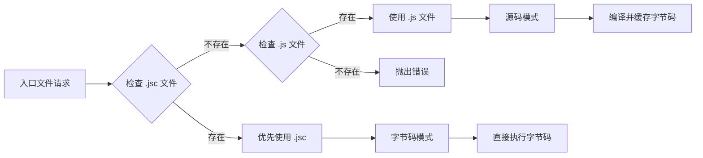

**图表来源**
- [internal/jsplugin/package.go:24-57](file://internal/jsplugin/package.go#L24-L57)

### 支持的文件格式

| 文件类型 | 扩展名 | 描述 | 使用场景 |
|---------|--------|------|----------|
| JavaScript 源码 | `.js` | 传统 JavaScript 源代码文件 | 开发调试、快速迭代 |
| JavaScriptCore | `.jsc` | 预编译的字节码文件 | 生产部署、性能优化 |

**章节来源**
- [internal/jsplugin/package.go:24-57](file://internal/jsplugin/package.go#L24-L57)
- [internal/jsplugin/service.go:85-91](file://internal/jsplugin/service.go#L85-L91)

## 字节码缓存机制

系统实现了智能的字节码缓存机制，显著提升插件加载性能：

### 缓存工作流程

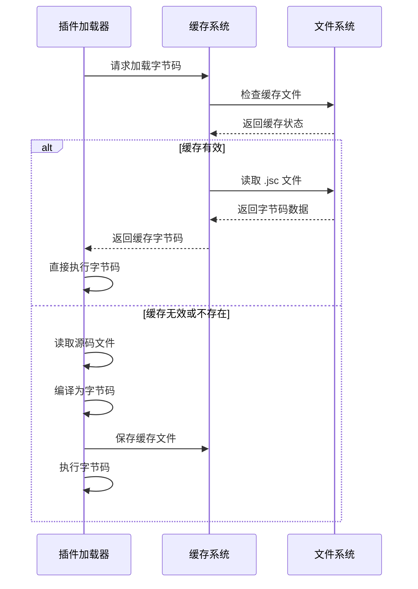

**图表来源**
- [internal/jsplugin/package.go:129-201](file://internal/jsplugin/package.go#L129-L201)

### 缓存文件格式

缓存系统使用双文件结构存储：

- **`.jsc` 文件**: 存储编译后的字节码
- **`.jsc.sha256` 文件**: 存储两行哈希值
  - 第一行: 源码内容的 SHA256 哈希
  - 第二行: 字节码文件的 SHA256 哈希

**章节来源**
- [internal/jsplugin/package.go:177-201](file://internal/jsplugin/package.go#L177-L201)

## 插件清单验证

插件清单验证现在支持两种入口文件格式，确保插件配置的有效性：

### 验证规则

| 字段 | 验证规则 | 错误信息 |
|------|----------|----------|
| `name` | 2-50 字符长度 | `name must be 2-50 characters` |
| `version` | Semantic Versioning 格式 | `version must be semver format` |
| `entryPath` | 小写字母+数字+连字符 | `entryPath must match ^[a-z][a-z0-9-]*$` |
| `main` | 必须以 `.js` 或 `.jsc` 结尾 | `main must end with .js or .jsc` |
| `permissions` | 必填（可为空数组） | `permissions is required` |
| `entryHash`/`zipHash` | 64 位小写十六进制 | `must be 64 lowercase hex digits` |

### 清单结构更新

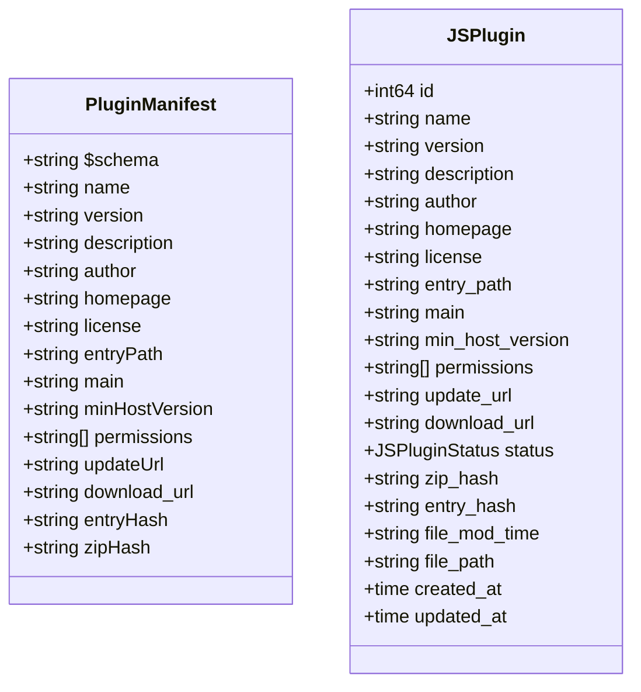

**图表来源**
- [internal/jsplugin/service.go:28-46](file://internal/jsplugin/service.go#L28-L46)
- [internal/models/models.go:461-483](file://internal/models/models.go#L461-L483)

**章节来源**
- [internal/jsplugin/service.go:62-107](file://internal/jsplugin/service.go#L62-L107)
- [internal/jsplugin/package.go:274-287](file://internal/jsplugin/package.go#L274-L287)

## JavaScriptCore 工具链

系统提供了完整的 JavaScriptCore 工具链，支持将 JavaScript 源码编译为高性能的字节码文件：

### 编译工具实现

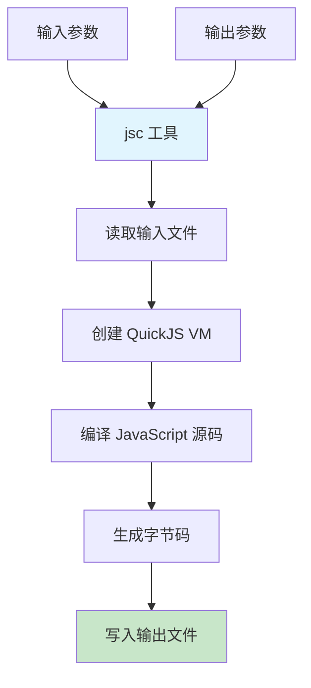

**图表来源**
- [plugin-toolchain/packages/jsc/main.go:10-46](file://plugin-toolchain/packages/jsc/main.go#L10-L46)

### 编译流程

1. **参数验证**: 检查命令行参数数量
2. **源码读取**: 从输入文件读取 JavaScript 源码
3. **虚拟机创建**: 初始化 QuickJS 编译器
4. **字节码生成**: 编译源码为二进制字节码
5. **结果输出**: 写入编译后的字节码文件

**章节来源**
- [plugin-toolchain/packages/jsc/main.go:10-46](file://plugin-toolchain/packages/jsc/main.go#L10-L46)

## LX Music插件开发模板

**新增** LX Music JavaScript插件子模块为开发者提供了完整的插件开发模板，包含现代化的TypeScript配置和自动化工具链。

### 插件模板结构

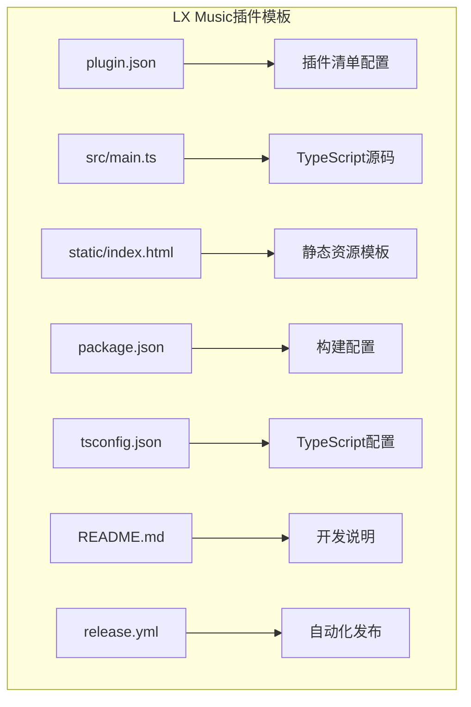

**图表来源**
- [jsplugins-src/mimusic-jsplugin-lxmusic/plugin.json:1-17](file://jsplugins-src/mimusic-jsplugin-lxmusic/plugin.json#L1-L17)
- [jsplugins-src/mimusic-jsplugin-lxmusic/src/main.ts:1-34](file://jsplugins-src/mimusic-jsplugin-lxmusic/src/main.ts#L1-L34)
- [jsplugins-src/mimusic-jsplugin-lxmusic/package.json:1-18](file://jsplugins-src/mimusic-jsplugin-lxmusic/package.json#L1-L18)
- [jsplugins-src/mimusic-jsplugin-lxmusic/tsconfig.json:1-15](file://jsplugins-src/mimusic-jsplugin-lxmusic/tsconfig.json#L1-L15)

### TypeScript源码示例

LX Music插件提供了完整的TypeScript源码示例，展示如何使用插件SDK创建路由和处理HTTP请求：

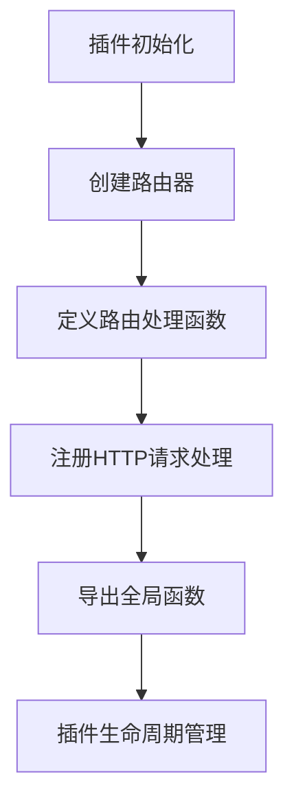

**图表来源**
- [jsplugins-src/mimusic-jsplugin-lxmusic/src/main.ts:15-34](file://jsplugins-src/mimusic-jsplugin-lxmusic/src/main.ts#L15-L34)

### 开发工具链

插件模板集成了现代化的开发工具链，支持热重载和自动上传功能：

| 工具 | 功能描述 | 使用场景 |
|------|----------|----------|
| mimusic-plugin build | 构建插件包 | 生产环境打包 |
| mimusic-plugin dev | 开发模式 | 热重载调试 |
| mimusic-plugin validate | 验证插件 | 发布前检查 |
| mimusic-plugin publish | 发布插件 | 自动化发布 |

**章节来源**
- [jsplugins-src/mimusic-jsplugin-lxmusic/plugin.json:1-17](file://jsplugins-src/mimusic-jsplugin-lxmusic/plugin.json#L1-L17)
- [jsplugins-src/mimusic-jsplugin-lxmusic/src/main.ts:1-34](file://jsplugins-src/mimusic-jsplugin-lxmusic/src/main.ts#L1-L34)
- [jsplugins-src/mimusic-jsplugin-lxmusic/package.json:6-11](file://jsplugins-src/mimusic-jsplugin-lxmusic/package.json#L6-L11)
- [jsplugins-src/mimusic-jsplugin-lxmusic/tsconfig.json:2-12](file://jsplugins-src/mimusic-jsplugin-lxmusic/tsconfig.json#L2-L12)
- [jsplugins-src/mimusic-jsplugin-lxmusic/README.md:7-12](file://jsplugins-src/mimusic-jsplugin-lxmusic/README.md#L7-L12)

## 性能优化

异步定时器处理机制显著提升了插件系统的整体性能，路由分离架构进一步优化了请求处理效率：

### 性能对比

| 加载方式 | 首次加载时间 | 后续加载时间 | CPU 使用率 | 内存占用 | 定时器响应延迟 |
|----------|-------------|-------------|-----------|----------|----------------|
| 源码模式 | 高 | 中等 | 高 | 高 | 无改善 |
| 字节码模式 | 低 | 低 | 低 | 低 | 显著改善 |
| 异步定时器 | 无影响 | 无影响 | 降低 | 降低 | 从阻塞变为非阻塞 |

### 路由分离优化

1. **静态资源直通**: 避免不必要的JS运行时检查
2. **API请求分流**: 认证和非认证请求分离处理
3. **缓存策略优化**: 静态资源强缓存，HTML文件无缓存

### 定时器处理优化

1. **非阻塞处理**: TryLock确保HTTP请求不被定时器处理阻塞
2. **周期性调度**: 500ms间隔平衡响应性和CPU使用率
3. **事件通道管理**: 自动排空事件通道避免阻塞

### Base64二进制数据处理优化

**新增** Base64二进制数据处理机制显著提升了插件系统对二进制数据的支持能力：

1. **自动检测**: 系统自动检测非UTF-8字节序列
2. **透明编码**: 对于二进制数据自动进行Base64编码
3. **JS侧解码**: 在JS运行时自动解码Base64数据
4. **性能优化**: 仅对需要的数据进行Base64处理，保持字符串数据的直接传输

**章节来源**
- [internal/jsplugin/service.go:147-211](file://internal/jsplugin/service.go#L147-L211)
- [internal/jsruntime/runtime.go:164-231](file://internal/jsruntime/runtime.go#L164-L231)
- [internal/jsplugin/service.go:292-306](file://internal/jsplugin/service.go#L292-L306)

## 测试覆盖

系统包含了全面的测试用例，确保两种入口文件格式的正确支持、新功能的稳定性和定时器处理机制的可靠性：

### 测试用例覆盖

| 测试类别 | 测试用例 | 验证内容 |
|----------|----------|----------|
| 清单验证 | `TestValidateManifest_MainJSC` | 验证 .jsc 文件格式支持 |
| 清单验证 | `TestValidateManifest_ValidEntryPath` | 验证入口路径格式 |
| 清单验证 | `TestValidateManifest_MissingMain` | 验证主文件缺失错误 |
| 清单验证 | `TestValidateManifest_MainNotJS` | 验证不支持的文件格式 |
| 清单验证 | `TestEntryPathFromZipName` | 验证 ZIP 名称解析 |
| 清单验证 | `TestParseManifest_PermissionsRoundTrip` | 验证权限序列化 |
| 路由分离 | `TestRegisterStaticRoutes` | 验证静态路由注册 |
| 路由分离 | `TestRegisterAPIRoutes` | 验证API路由注册 |
| 认证增强 | `TestGeneratePluginToken` | 验证插件Token生成 |
| 运行时增强 | `TestBase64Polyfill` | 验证Base64功能 |
| 定时器处理 | `TestExecuteJSNonBlocking` | 验证ExecuteJS非阻塞特性 |
| 定时器处理 | `TestProcessTimersTryLock` | 验证TryLock机制 |
| 定时器处理 | `TestRunTimerProcessor` | 验证定时器处理器 |
| Base64处理 | `TestNonUTF8BodyEncoding` | 验证Base64二进制数据处理 |
| 健康检查 | `TestHealthChecker_DetectUnhealthy` | 验证健康检查功能 |
| ZIP上传 | `TestPackageManager_InstallFromUpload_OverwriteUpdate` | 验证覆盖更新逻辑 |

### 测试实现示例

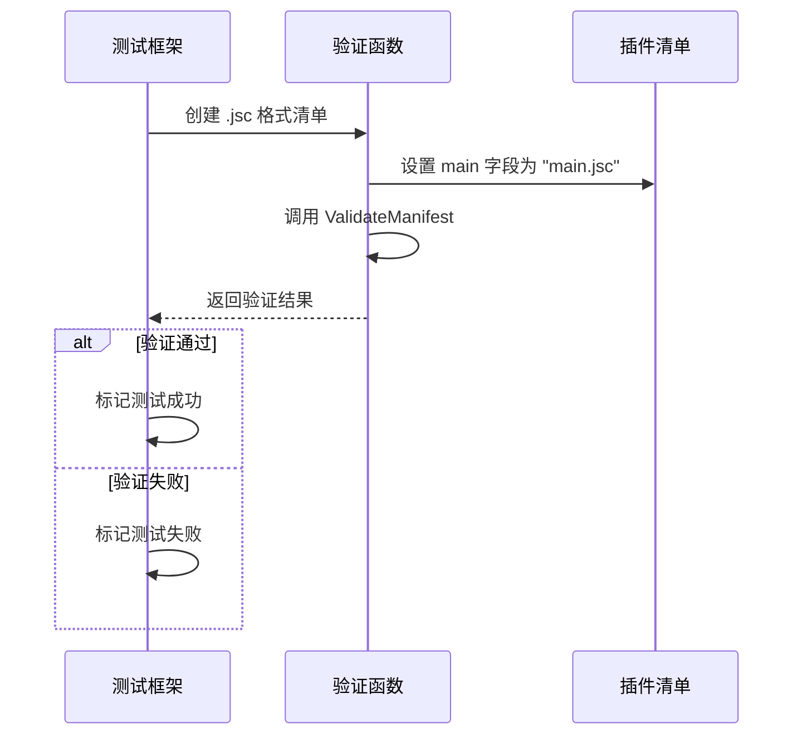

**图表来源**
- [internal/jsplugin/package.go:274-287](file://internal/jsplugin/package.go#L274-L287)

**章节来源**
- [internal/jsplugin/package.go:274-345](file://internal/jsplugin/package.go#L274-L345)
- [internal/jsplugin/service_test.go:1-100](file://internal/jsplugin/service_test.go#L1-L100)

## 插件管理API

**新增** 系统提供了完整的插件管理API，支持RESTful接口进行插件的全生命周期管理。

### JSPluginHandler API设计

JSPluginHandler 提供了完整的插件管理接口：

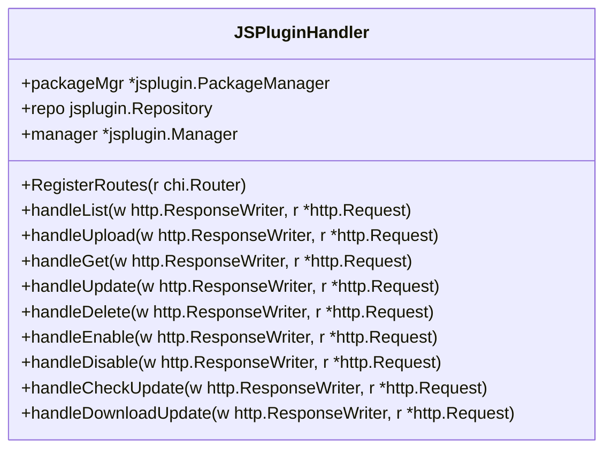

**图表来源**
- [internal/handlers/jsplugin.go:15-29](file://internal/handlers/jsplugin.go#L15-L29)

### API路由设计

| 路由 | 方法 | 描述 | 权限要求 |
|------|------|------|----------|
| `/api/v1/jsplugins` | GET | 获取所有JS插件列表 | BearerAuth |
| `/api/v1/jsplugins/upload` | POST | 上传安装新插件 | BearerAuth |
| `/api/v1/jsplugins/{id}` | GET | 获取单个插件详情 | BearerAuth |
| `/api/v1/jsplugins/{id}` | PUT | 更新现有插件 | BearerAuth |
| `/api/v1/jsplugins/{id}` | DELETE | 删除插件 | BearerAuth |
| `/api/v1/jsplugins/{id}/enable` | POST | 启用插件 | BearerAuth |
| `/api/v1/jsplugins/{id}/disable` | POST | 禁用插件 | BearerAuth |
| `/api/v1/jsplugins/{id}/check-update` | GET | 检查远程更新 | BearerAuth |
| `/api/v1/jsplugins/{id}/update` | POST | 下载并更新插件 | BearerAuth |

### 健康检查机制

**新增** HealthChecker 组件提供了插件健康状态监控和自动恢复功能：

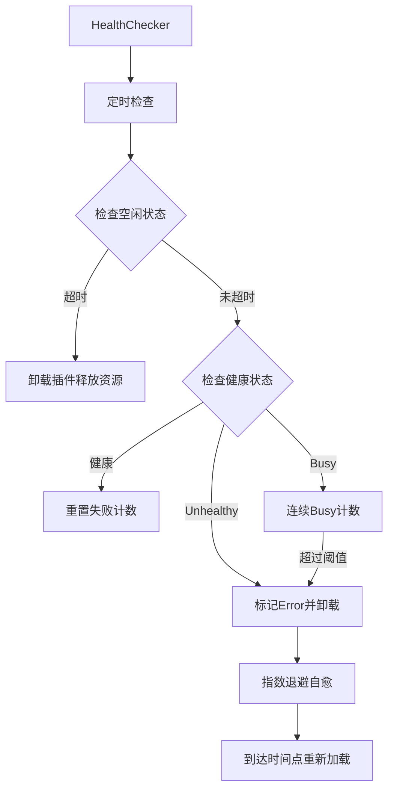

**图表来源**
- [internal/jsplugin/health.go:160-215](file://internal/jsplugin/health.go#L160-L215)
- [internal/jsplugin/health.go:248-292](file://internal/jsplugin/health.go#L248-L292)

### 健康检查配置

| 配置项 | 默认值 | 描述 |
|--------|--------|------|
| checkInterval | 60秒 | 健康检查间隔 |
| maxFailures | 3次 | 最大连续失败次数 |
| idleTimeout | 10分钟 | 空闲超时时间 |
| maxBusyRounds | 5轮 | 连续Busy升级阈值 |
| recoveryBackoff | 1m/5m/15m/30m/60m | 自愈退避序列 |

**章节来源**
- [internal/handlers/jsplugin.go:31-44](file://internal/handlers/jsplugin.go#L31-L44)
- [internal/handlers/jsplugin.go:57-71](file://internal/handlers/jsplugin.go#L57-L71)
- [internal/handlers/jsplugin.go:268-297](file://internal/handlers/jsplugin.go#L268-L297)
- [internal/jsplugin/health.go:74-122](file://internal/jsplugin/health.go#L74-L122)
- [internal/jsplugin/health.go:294-317](file://internal/jsplugin/health.go#L294-L317)

## ZIP包上传功能

**新增** 系统增强了JavaScript插件系统的手动上传功能，支持ZIP包上传和改进的错误处理。

### ZIP包上传流程

```mermaid
sequenceDiagram
participant FE as 前端应用
participant API as JSPluginHandler
participant PM as PackageManager
participant FS as 文件系统
participant DB as 数据库
FE->>API : POST /api/v1/jsplugins/upload (multipart/form-data)
API->>API : 解析multipart表单
API->>API : 读取ZIP文件字节数据
API->>PM : InstallFromUpload(zipData)
PM->>PM : 读取plugin.json
PM->>PM : 验证清单和权限
PM->>PM : 检查entryPath是否已存在
alt 已存在覆盖更新
PM->>PM : Update(existingID, zipData)
PM->>FS : 覆盖写入ZIP文件
PM->>DB : 更新数据库记录
else 不存在全新安装
PM->>FS : 保存ZIP文件到pluginsDir
PM->>DB : 创建新插件记录
end
PM-->>API : 返回plugin, wasUpdate
API->>API : wasUpdate=true且插件活跃状态？
API->>API : 是则调用manager.ReloadPlugin()
API-->>FE : 返回上传结果HTTP 201或200
```

**图表来源**
- [internal/handlers/jsplugin.go:105-181](file://internal/handlers/jsplugin.go#L105-L181)
- [internal/jsplugin/package.go:44-148](file://internal/jsplugin/package.go#L44-L148)

### ZIP包上传API设计

| 字段 | 类型 | 必填 | 描述 |
|------|------|------|------|
| file | file | 是 | .jsplugin.zip文件 |
| 文件名 | string | 是 | `{entryPath}.jsplugin.zip` |

### 上传响应结构

```mermaid
classDiagram
class JSPluginUploadResponse {
+int total
+int success
+int failed
+JSPluginUploadResult[] results
+string message
}
class JSPluginUploadResult {
+string file_name
+JSPlugin plugin
+string error
+bool success
}
```

**图表来源**
- [internal/handlers/jsplugin.go:17-32](file://internal/handlers/jsplugin.go#L17-L32)

### ZIP包处理增强

**新增** 系统现在支持ZIP包的完整处理流程：

1. **ZIP文件解析**: 从multipart表单中提取ZIP文件
2. **清单验证**: 读取并验证plugin.json
3. **哈希计算**: 计算entryHash和zipHash
4. **文件保存**: 保存ZIP到pluginsDir
5. **静态文件提取**: 解压static/目录到dataDir
6. **数据库记录**: 创建或更新插件记录

**章节来源**
- [internal/handlers/jsplugin.go:92-181](file://internal/handlers/jsplugin.go#L92-L181)
- [internal/jsplugin/package.go:41-148](file://internal/jsplugin/package.go#L41-L148)
- [frontend/lib/features/jsplugin/data/jsplugin_api.dart:197-239](file://frontend/lib/features/jsplugin/data/jsplugin_api.dart#L197-L239)

## 热重载机制

**新增** 系统实现了完整的热重载机制，支持插件文件变化的自动检测和热更新。

### 热重载监控流程

```mermaid
sequenceDiagram
participant HR as HotReloader
participant FS as 文件系统
participant M as Manager
participant S as Service
HR->>HR : 每30秒检查一次
HR->>FS : 获取所有活跃插件
FS-->>HR : 返回插件列表
loop 对每个活跃插件
HR->>FS : 检查ZIP文件mtime
FS-->>HR : 返回当前修改时间
HR->>HR : 比较oldMtime vs newMtime
alt 文件发生变化
HR->>M : ReloadPlugin(pluginID)
M->>S : 冻结旧服务
M->>M : 卸载旧插件
M->>M : 清除字节码缓存
M->>M : 重新加载插件
M->>S : 解冻新服务
end
end
```

**图表来源**
- [internal/jsplugin/hot_reload.go:106-150](file://internal/jsplugin/hot_reload.go#L106-L150)

### 热重载实现细节

**新增** 热重载机制包含以下关键步骤：

1. **文件监控**: 每30秒轮询检查ZIP文件修改时间
2. **服务冻结**: 在热重载期间冻结旧服务，防止新消息进入
3. **安全回滚**: 新版本加载失败时自动回滚到旧版本
4. **缓存清理**: 清除字节码缓存确保重新编译
5. **状态恢复**: 成功热重载后恢复服务状态

### 热重载API集成

**新增** 热重载功能与插件管理API深度集成：

```mermaid
flowchart TD
A[ZIP上传更新] --> B{wasUpdate=true且插件活跃？}
B --> |是| C[调用manager.ReloadPlugin]
B --> |否| D[正常返回]
C --> E[HotReloader.ReloadPlugin]
E --> F[冻结旧服务]
E --> G[卸载旧插件]
E --> H[清除缓存]
E --> I[重新加载插件]
E --> J[解冻新服务]
```

**图表来源**
- [internal/handlers/jsplugin.go:149-154](file://internal/handlers/jsplugin.go#L149-L154)
- [internal/jsplugin/hot_reload.go:26-89](file://internal/jsplugin/hot_reload.go#L26-L89)

**章节来源**
- [internal/jsplugin/hot_reload.go:13-151](file://internal/jsplugin/hot_reload.go#L13-L151)
- [internal/handlers/jsplugin.go:149-154](file://internal/handlers/jsplugin.go#L149-L154)

## 错误处理改进

**新增** 系统在ZIP包上传和热重载过程中增强了错误处理机制。

### ZIP上传错误处理

**新增** ZIP上传过程包含完善的错误处理：

1. **请求解析错误**: 解析multipart表单失败
2. **文件读取错误**: 读取上传文件失败
3. **清单验证错误**: 插件清单格式不正确
4. **权限验证错误**: 插件权限不符合要求
5. **哈希验证错误**: entryHash或zipHash不匹配
6. **文件保存错误**: 保存ZIP文件到磁盘失败
7. **数据库错误**: 创建插件记录失败

### 热重载错误处理

**新增** 热重载过程包含安全的错误处理：

1. **服务冻结失败**: 热重载期间无法冻结旧服务
2. **插件卸载失败**: 卸载旧插件失败
3. **重新加载失败**: 新版本插件加载失败
4. **回滚失败**: 热重载失败且回滚也失败
5. **状态更新失败**: 标记插件为错误状态失败

### 错误响应格式

**新增** 统一的错误响应格式：

```mermaid
classDiagram
class JSPluginUploadResponse {
+int total
+int success
+int failed
+JSPluginUploadResult[] results
+string message
}
class JSPluginUploadResult {
+string file_name
+JSPlugin plugin
+string error
+bool success
}
```

**图表来源**
- [internal/handlers/jsplugin.go:17-32](file://internal/handlers/jsplugin.go#L17-L32)

**章节来源**
- [internal/handlers/jsplugin.go:133-147](file://internal/handlers/jsplugin.go#L133-L147)
- [internal/jsplugin/hot_reload.go:72-85](file://internal/jsplugin/hot_reload.go#L72-L85)
- [frontend/lib/features/jsplugin/data/jsplugin_api.dart:81-139](file://frontend/lib/features/jsplugin/data/jsplugin_api.dart#L81-L139)

## 插件初始化顺序优化

**更新** 系统优化了插件初始化顺序，确保插件数据目录在加载前创建，移除了冗余的初始化步骤。

### 初始化顺序改进

```mermaid
sequenceDiagram
participant M as Manager
participant PM as PackageManager
participant S as Service
participant FS as 文件系统
M->>M : LoadPlugin(plugin)
M->>M : 确保插件数据目录存在
M->>FS : os.MkdirAll(dataDir, 0755)
M->>S : 创建JSService
M->>S : 创建BridgeHandler
M->>S : 调用service.Load(pluginsDir, dataDir)
S->>S : 读取ZIP文件
S->>S : 校验哈希
S->>S : 创建JS环境
S->>S : 注册桥接回调
S->>S : 解压static/到dataDir
S->>S : 异步编译并缓存字节码
M->>M : 更新DB中的哈希
M->>M : 在scheduler中注册service
M->>S : 调用service.Init()
M->>M : 存入services map
```

**图表来源**
- [internal/jsplugin/manager.go:158-201](file://internal/jsplugin/manager.go#L158-L201)
- [internal/jsplugin/service.go:84-214](file://internal/jsplugin/service.go#L84-L214)

### 目录创建优化

**新增** 插件管理器在加载插件前确保数据目录存在：

1. **统一目录检查**: 在 `LoadPlugin` 方法中统一检查数据目录
2. **避免重复创建**: 移除了在多个地方重复创建目录的冗余步骤
3. **原子性操作**: 目录创建与插件加载作为一个原子操作
4. **错误处理**: 目录创建失败时立即返回错误，避免后续操作

### 启动流程优化

**新增** 插件管理器启动流程的改进：

1. **HealthChecker和HotReloader创建**: 在启动时立即创建监控组件
2. **目录同步**: 从本地ZIP文件同步插件记录，确保目录存在
3. **插件加载**: 使用同步返回的完整列表直接加载插件
4. **监控启动**: 启动健康检查和热更新监控

**章节来源**
- [internal/jsplugin/manager.go:92-129](file://internal/jsplugin/manager.go#L92-L129)
- [internal/jsplugin/manager.go:158-201](file://internal/jsplugin/manager.go#L158-L201)
- [internal/jsplugin/service.go:84-214](file://internal/jsplugin/service.go#L84-L214)