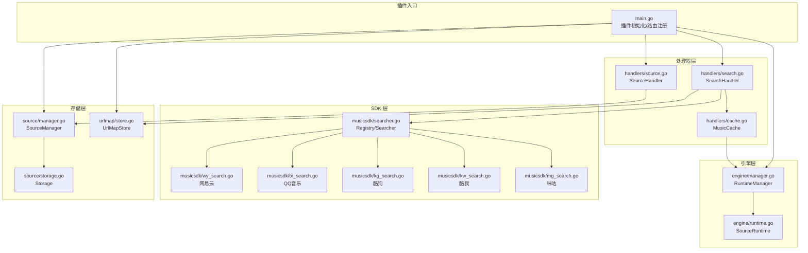
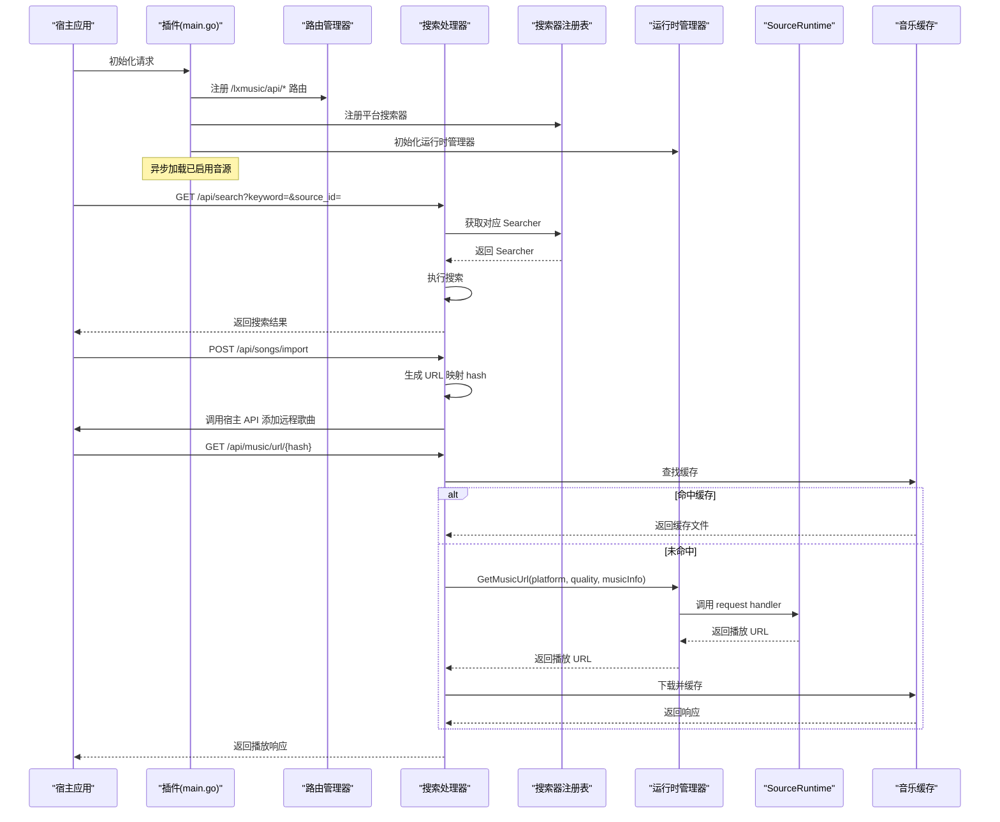
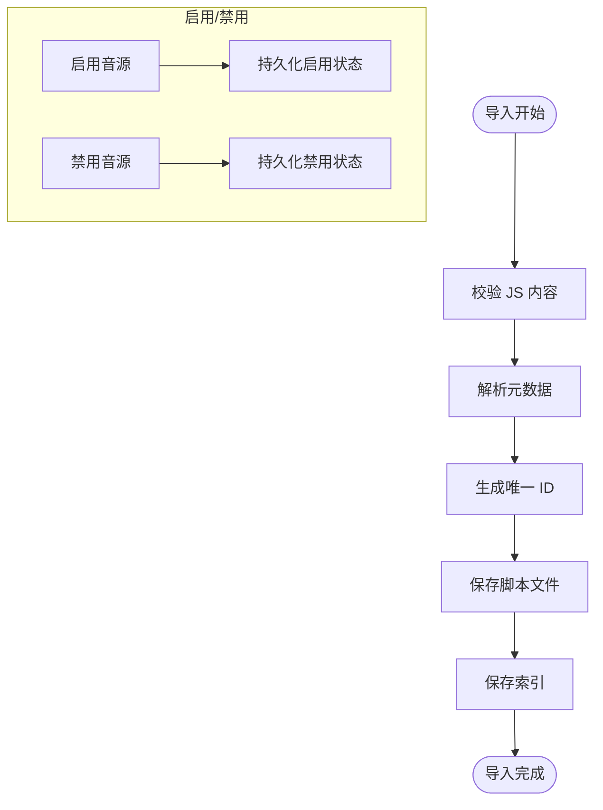
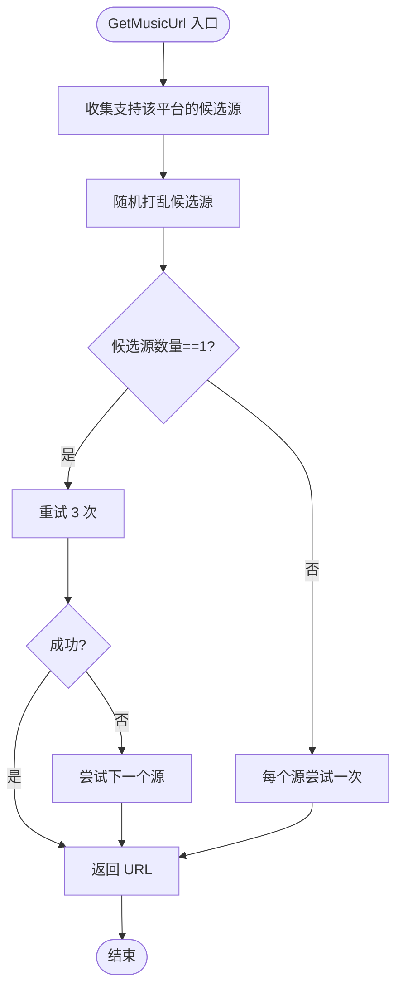
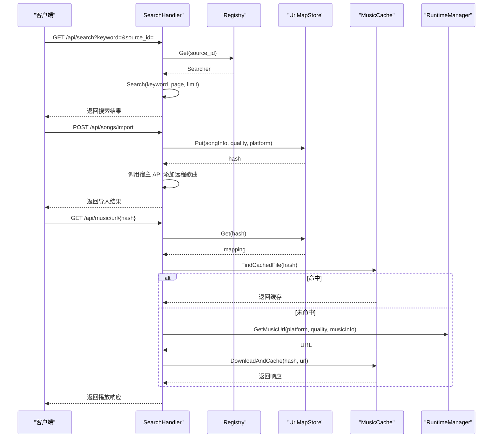
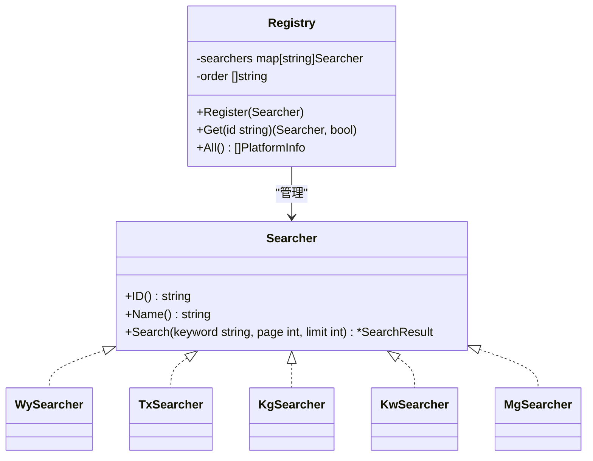
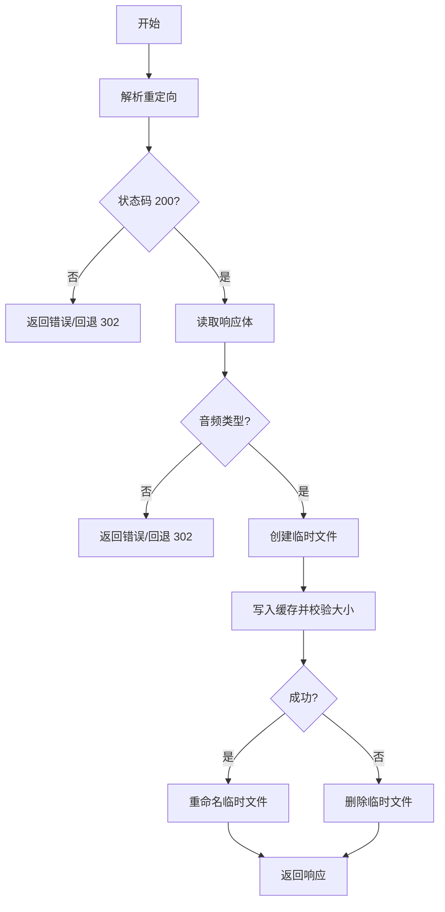
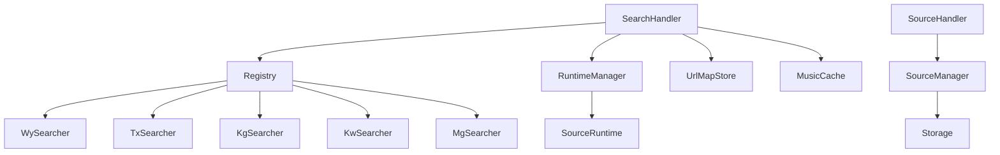

# LXMusic 插件

<cite>
**本文档引用的文件**
- [main.go](file://plugins/mimusic-plugin-lxmusic/main.go)
- [manager.go](file://plugins/mimusic-plugin-lxmusic/engine/manager.go)
- [runtime.go](file://plugins/mimusic-plugin-lxmusic/engine/runtime.go)
- [search.go](file://plugins/mimusic-plugin-lxmusic/handlers/search.go)
- [source.go](file://plugins/mimusic-plugin-lxmusic/handlers/source.go)
- [cache.go](file://plugins/mimusic-plugin-lxmusic/handlers/cache.go)
- [searcher.go](file://plugins/mimusic-plugin-lxmusic/musicsdk/searcher.go)
- [types.go](file://plugins/mimusic-plugin-lxmusic/musicsdk/types.go)
- [util.go](file://plugins/mimusic-plugin-lxmusic/musicsdk/util.go)
- [wy_search.go](file://plugins/mimusic-plugin-lxmusic/musicsdk/wy_search.go)
- [tx_search.go](file://plugins/mimusic-plugin-lxmusic/musicsdk/tx_search.go)
- [kg_search.go](file://plugins/mimusic-plugin-lxmusic/musicsdk/kg_search.go)
- [kw_search.go](file://plugins/mimusic-plugin-lxmusic/musicsdk/kw_search.go)
- [mg_search.go](file://plugins/mimusic-plugin-lxmusic/musicsdk/mg_search.go)
- [store.go](file://plugins/mimusic-plugin-lxmusic/urlmap/store.go)
- [manager.go](file://plugins/mimusic-plugin-lxmusic/source/manager.go)
- [storage.go](file://plugins/mimusic-plugin-lxmusic/source/storage.go)
</cite>

## 目录
1. [简介](#简介)
2. [项目结构](#项目结构)
3. [核心组件](#核心组件)
4. [架构总览](#架构总览)
5. [详细组件分析](#详细组件分析)
6. [依赖分析](#依赖分析)
7. [性能考虑](#性能考虑)
8. [故障排查指南](#故障排查指南)
9. [结论](#结论)
10. [附录](#附录)

## 简介
本文件面向 LXMusic 插件（洛雪音源）的实现文档，聚焦 mimusic-plugin-lxmusic 插件的音乐搜索与播放功能。文档系统性梳理了以下方面：
- 音乐 SDK 架构与多平台搜索器（网易云音乐、QQ音乐、酷狗音乐、酷我音乐、咪咕音乐）的接口实现
- 缓存机制设计与播放链接缓存策略
- 播放源管理器（多平台源切换与质量选择）工作原理
- 引擎运行时管理、静态资源服务与前端界面集成
- 插件与宿主应用的数据交互模式与错误处理机制

## 项目结构
mimusic-plugin-lxmusic 采用“插件 + WASM 运行时 + 多平台搜索器 + 播放缓存”的模块化设计。核心目录与职责如下：
- engine：运行时管理与 JS 环境交互
- handlers：HTTP 路由与业务处理（搜索、导入、播放 URL 获取、音源管理）
- musicsdk：多平台搜索器注册与实现
- source：音源导入、启用/禁用、持久化存储
- urlmap：播放 URL 映射与哈希生成
- static：前端静态资源（HTML/CSS/JS）

**图表来源**
- [main.go:42-139](file://plugins/mimusic-plugin-lxmusic/main.go#L42-L139)
- [manager.go:12-169](file://plugins/mimusic-plugin-lxmusic/engine/manager.go#L12-L169)
- [runtime.go:27-364](file://plugins/mimusic-plugin-lxmusic/engine/runtime.go#L27-L364)
- [search.go:21-330](file://plugins/mimusic-plugin-lxmusic/handlers/search.go#L21-L330)
- [source.go:21-310](file://plugins/mimusic-plugin-lxmusic/handlers/source.go#L21-L310)
- [cache.go:27-338](file://plugins/mimusic-plugin-lxmusic/handlers/cache.go#L27-L338)
- [searcher.go:18-60](file://plugins/mimusic-plugin-lxmusic/musicsdk/searcher.go#L18-L60)
- [wy_search.go:23-281](file://plugins/mimusic-plugin-lxmusic/musicsdk/wy_search.go#L23-L281)
- [tx_search.go:17-308](file://plugins/mimusic-plugin-lxmusic/musicsdk/tx_search.go#L17-L308)
- [kg_search.go:13-219](file://plugins/mimusic-plugin-lxmusic/musicsdk/kg_search.go#L13-L219)
- [kw_search.go:15-258](file://plugins/mimusic-plugin-lxmusic/musicsdk/kw_search.go#L15-L258)
- [mg_search.go:24-295](file://plugins/mimusic-plugin-lxmusic/musicsdk/mg_search.go#L24-L295)
- [manager.go:23-461](file://plugins/mimusic-plugin-lxmusic/source/manager.go#L23-L461)
- [storage.go:13-79](file://plugins/mimusic-plugin-lxmusic/source/storage.go#L13-L79)
- [store.go:16-165](file://plugins/mimusic-plugin-lxmusic/urlmap/store.go#L16-L165)

**章节来源**
- [main.go:42-139](file://plugins/mimusic-plugin-lxmusic/main.go#L42-L139)

## 核心组件
- 插件入口与初始化：负责注册路由、初始化音源管理器、搜索器注册表、URL 映射存储、静态资源服务，并设置定时器异步加载已启用音源。
- 搜索处理器：提供平台搜索、平台列表查询、批量导入歌曲至宿主应用、以及播放 URL 获取（含缓存与重试）。
- 源管理器：负责音源导入（JS/ZIP）、启用/禁用、持久化存储、逐帧异步加载到运行时。
- 运行时管理器：维护 SourceRuntime，支持多源轮询与重试、质量选择、平台能力检测。
- 音乐 SDK：统一的 Searcher 接口与 Registry，内置五个平台搜索器。
- 播放缓存：基于 hash 的本地缓存目录结构、内容类型识别、最小音频大小校验、重定向解析与回退策略。
- URL 映射：将歌曲信息与音质组合生成固定长度哈希，持久化存储，供播放 URL 获取流程使用。

**章节来源**
- [main.go:42-139](file://plugins/mimusic-plugin-lxmusic/main.go#L42-L139)
- [search.go:21-330](file://plugins/mimusic-plugin-lxmusic/handlers/search.go#L21-L330)
- [manager.go:23-461](file://plugins/mimusic-plugin-lxmusic/source/manager.go#L23-L461)
- [manager.go:12-169](file://plugins/mimusic-plugin-lxmusic/engine/manager.go#L12-L169)
- [runtime.go:27-364](file://plugins/mimusic-plugin-lxmusic/engine/runtime.go#L27-L364)
- [searcher.go:18-60](file://plugins/mimusic-plugin-lxmusic/musicsdk/searcher.go#L18-L60)
- [cache.go:27-338](file://plugins/mimusic-plugin-lxmusic/handlers/cache.go#L27-L338)
- [store.go:16-165](file://plugins/mimusic-plugin-lxmusic/urlmap/store.go#L16-L165)

## 架构总览
LXMusic 插件通过宿主提供的插件框架进行初始化与路由注册，随后在 WASM 环境中构建 JS 运行时，加载用户导入的音源脚本，实现多平台搜索与播放链接获取。播放 URL 获取流程结合 URL 映射与本地缓存，确保稳定与高效。

**图表来源**
- [main.go:115-139](file://plugins/mimusic-plugin-lxmusic/main.go#L115-L139)
- [search.go:37-85](file://plugins/mimusic-plugin-lxmusic/handlers/search.go#L37-L85)
- [search.go:119-248](file://plugins/mimusic-plugin-lxmusic/handlers/search.go#L119-L248)
- [search.go:250-329](file://plugins/mimusic-plugin-lxmusic/handlers/search.go#L250-L329)
- [manager.go:62-139](file://plugins/mimusic-plugin-lxmusic/engine/manager.go#L62-L139)
- [runtime.go:227-258](file://plugins/mimusic-plugin-lxmusic/engine/runtime.go#L227-L258)
- [cache.go:148-276](file://plugins/mimusic-plugin-lxmusic/handlers/cache.go#L148-L276)

## 详细组件分析

### 插件入口与路由注册
- 初始化阶段：设置插件 ID、创建音源管理器、运行时管理器、注册搜索器、初始化 URL 映射存储；设置定时器回调；注册音源与搜索相关路由。
- 路由设计：
  - 音源管理：列出、导入（文件/URL）、启用/禁用、删除
  - 搜索与导入：平台列表、搜索、批量导入歌曲
  - 播放 URL：按 hash 获取播放地址（无需认证）

**章节来源**
- [main.go:42-139](file://plugins/mimusic-plugin-lxmusic/main.go#L42-L139)

### 音源管理器（SourceManager）
- 职责：导入 JS/ZIP、启用/禁用、持久化存储、逐帧异步加载到运行时。
- 导入流程：校验 JS、解析元数据、去重、生成唯一 ID、保存脚本与索引。
- 加载策略：通过定时器逐帧加载，避免阻塞初始化。
- 存储：索引文件与脚本文件分离，便于快速读取与更新。

**图表来源**
- [manager.go:96-161](file://plugins/mimusic-plugin-lxmusic/source/manager.go#L96-L161)
- [manager.go:275-317](file://plugins/mimusic-plugin-lxmusic/source/manager.go#L275-L317)
- [storage.go:33-79](file://plugins/mimusic-plugin-lxmusic/source/storage.go#L33-L79)

**章节来源**
- [manager.go:23-461](file://plugins/mimusic-plugin-lxmusic/source/manager.go#L23-L461)
- [storage.go:13-79](file://plugins/mimusic-plugin-lxmusic/source/storage.go#L13-L79)

### 运行时管理器（RuntimeManager）
- 职责：缓存 SourceRuntime、按平台筛选候选源、随机轮询、重试策略、关闭清理。
- 多源轮询策略：
  - 单源：最多重试 3 次
  - 多源：每个源尝试一次
- 平台能力检测：通过 SourceRuntime.Config.Sources 判断支持情况。

**图表来源**
- [manager.go:62-139](file://plugins/mimusic-plugin-lxmusic/engine/manager.go#L62-L139)
- [runtime.go:260-284](file://plugins/mimusic-plugin-lxmusic/engine/runtime.go#L260-L284)

**章节来源**
- [manager.go:12-169](file://plugins/mimusic-plugin-lxmusic/engine/manager.go#L12-L169)
- [runtime.go:27-364](file://plugins/mimusic-plugin-lxmusic/engine/runtime.go#L27-L364)

### 搜索处理器（SearchHandler）
- 平台搜索：根据 source_id 从 Registry 获取对应 Searcher，执行搜索并返回结果。
- 平台列表：返回已注册平台信息。
- 批量导入：为每首歌生成 URL 映射 hash，构造宿主 API 请求体，调用宿主 API 添加远程歌曲。
- 播放 URL 获取：根据 hash 查找映射，检查缓存，未命中则调用 RuntimeManager.GetMusicUrl 获取 URL，下载并缓存，失败时回退到 302 重定向。

**图表来源**
- [search.go:37-85](file://plugins/mimusic-plugin-lxmusic/handlers/search.go#L37-L85)
- [search.go:87-103](file://plugins/mimusic-plugin-lxmusic/handlers/search.go#L87-L103)
- [search.go:119-248](file://plugins/mimusic-plugin-lxmusic/handlers/search.go#L119-L248)
- [search.go:250-329](file://plugins/mimusic-plugin-lxmusic/handlers/search.go#L250-L329)
- [store.go:42-67](file://plugins/mimusic-plugin-lxmusic/urlmap/store.go#L42-L67)
- [cache.go:148-276](file://plugins/mimusic-plugin-lxmusic/handlers/cache.go#L148-L276)
- [manager.go:62-139](file://plugins/mimusic-plugin-lxmusic/engine/manager.go#L62-L139)

**章节来源**
- [search.go:21-330](file://plugins/mimusic-plugin-lxmusic/handlers/search.go#L21-L330)

### 音源处理器（SourceHandler）
- 列出音源：返回基本信息（不含脚本内容）。
- 导入音源：支持 .js 与 .zip，解析并导入，必要时自动加载到运行时。
- 从 URL 导入：校验 URL，下载内容，复用导入逻辑。
- 启用/禁用：更新状态并同步到运行时；失败时回滚。
- 删除音源：先卸载运行时，再删除持久化文件。

**章节来源**
- [source.go:21-310](file://plugins/mimusic-plugin-lxmusic/handlers/source.go#L21-L310)

### 音乐 SDK 与多平台搜索器
- 接口与注册表：Searcher 接口定义 ID/Name/Search；Registry 维护注册顺序与映射。
- 类型系统：SearchResult/SearchItem/QualityInfo 统一跨平台数据模型。
- 工具函数：格式化时间、歌手名、HTML 实体解码、大小格式化等。
- 平台实现：
  - 网易云：EAPI 加密、AES-128-ECB、MD5 消息摘要、Origin 头
  - QQ音乐：JSON 请求体、设备参数、媒体 mid
  - 酷狗：关键词过滤、去重、音质枚举
  - 酷我：类 JSON 预处理、音质解析
  - 咪咕：签名算法、设备 ID、音质类型映射

**图表来源**
- [searcher.go:5-60](file://plugins/mimusic-plugin-lxmusic/musicsdk/searcher.go#L5-L60)
- [types.go:5-39](file://plugins/mimusic-plugin-lxmusic/musicsdk/types.go#L5-L39)
- [wy_search.go:23-281](file://plugins/mimusic-plugin-lxmusic/musicsdk/wy_search.go#L23-L281)
- [tx_search.go:17-308](file://plugins/mimusic-plugin-lxmusic/musicsdk/tx_search.go#L17-L308)
- [kg_search.go:13-219](file://plugins/mimusic-plugin-lxmusic/musicsdk/kg_search.go#L13-L219)
- [kw_search.go:15-258](file://plugins/mimusic-plugin-lxmusic/musicsdk/kw_search.go#L15-L258)
- [mg_search.go:24-295](file://plugins/mimusic-plugin-lxmusic/musicsdk/mg_search.go#L24-L295)

**章节来源**
- [searcher.go:18-60](file://plugins/mimusic-plugin-lxmusic/musicsdk/searcher.go#L18-L60)
- [types.go:5-39](file://plugins/mimusic-plugin-lxmusic/musicsdk/types.go#L5-L39)
- [util.go:11-119](file://plugins/mimusic-plugin-lxmusic/musicsdk/util.go#L11-L119)
- [wy_search.go:41-281](file://plugins/mimusic-plugin-lxmusic/musicsdk/wy_search.go#L41-L281)
- [tx_search.go:129-308](file://plugins/mimusic-plugin-lxmusic/musicsdk/tx_search.go#L129-L308)
- [kg_search.go:68-219](file://plugins/mimusic-plugin-lxmusic/musicsdk/kg_search.go#L68-L219)
- [kw_search.go:54-258](file://plugins/mimusic-plugin-lxmusic/musicsdk/kw_search.go#L54-L258)
- [mg_search.go:99-295](file://plugins/mimusic-plugin-lxmusic/musicsdk/mg_search.go#L99-L295)

### 播放缓存（MusicCache）
- 缓存目录：/lxmusic/music_cache，采用 16 位 hash 的两级目录组织（前 7 位/后 9 位）。
- 内容类型识别：根据 Content-Type 推断扩展名，支持常见音频格式。
- 下载与缓存：解析重定向、HEAD 检测、最小音频大小校验、临时文件写入与重命名。
- 回退策略：下载失败时返回 302 重定向至真实 URL。

**图表来源**
- [cache.go:148-276](file://plugins/mimusic-plugin-lxmusic/handlers/cache.go#L148-L276)
- [cache.go:278-337](file://plugins/mimusic-plugin-lxmusic/handlers/cache.go#L278-L337)

**章节来源**
- [cache.go:27-338](file://plugins/mimusic-plugin-lxmusic/handlers/cache.go#L27-L338)

### URL 映射（UrlMapStore）
- 作用：将歌曲信息与音质组合生成固定长度哈希，持久化存储映射关系。
- 哈希策略：对 songInfo（键排序）与 quality 序列化后取 SHA256 前 8 字节（16 位 hex）。
- 持久化：JSON 文件，版本化索引。

**章节来源**
- [store.go:16-165](file://plugins/mimusic-plugin-lxmusic/urlmap/store.go#L16-L165)

## 依赖分析
- 组件耦合：
  - SearchHandler 依赖 Registry、RuntimeManager、UrlMapStore、MusicCache
  - SourceHandler 依赖 SourceManager
  - RuntimeManager 依赖 SourceRuntime
  - SourceManager 依赖 Storage
- 外部依赖：
  - 宿主插件框架（路由、静态资源、定时器、JS 环境）
  - HTTP 客户端（插件 HTTP 客户端与原生 HTTP）
- 循环依赖：未发现循环依赖，模块边界清晰。

**图表来源**
- [search.go:21-330](file://plugins/mimusic-plugin-lxmusic/handlers/search.go#L21-L330)
- [source.go:21-310](file://plugins/mimusic-plugin-lxmusic/handlers/source.go#L21-L310)
- [manager.go:12-169](file://plugins/mimusic-plugin-lxmusic/engine/manager.go#L12-L169)
- [manager.go:23-461](file://plugins/mimusic-plugin-lxmusic/source/manager.go#L23-L461)
- [searcher.go:18-60](file://plugins/mimusic-plugin-lxmusic/musicsdk/searcher.go#L18-L60)

**章节来源**
- [search.go:21-330](file://plugins/mimusic-plugin-lxmusic/handlers/search.go#L21-L330)
- [source.go:21-310](file://plugins/mimusic-plugin-lxmusic/handlers/source.go#L21-L310)
- [manager.go:12-169](file://plugins/mimusic-plugin-lxmusic/engine/manager.go#L12-L169)
- [manager.go:23-461](file://plugins/mimusic-plugin-lxmusic/source/manager.go#L23-L461)
- [searcher.go:18-60](file://plugins/mimusic-plugin-lxmusic/musicsdk/searcher.go#L18-L60)

## 性能考虑
- 异步加载：Init 阶段仅注册路由与基础组件，已启用音源通过定时器逐帧加载，避免阻塞。
- 多源轮询：随机打乱候选源，降低单一源失败的影响；单源重试 3 次，多源各试一次，平衡成功率与延迟。
- 缓存策略：命中直接返回文件流，未命中才发起下载；下载失败回退 302，减少失败等待。
- 哈希与存储：URL 映射采用短哈希与 JSON 持久化，索引读写成本低。
- WASM 限制：缓存下载采用一次性读取与临时文件重命名，适配 WASM 环境的流式限制。

[本节为通用指导，无需具体文件分析]

## 故障排查指南
- 搜索失败：
  - 检查 source_id 是否正确注册
  - 查看对应平台 Searcher 的网络请求与响应状态
- 播放 URL 获取失败：
  - 确认 hash 是否存在于 UrlMapStore
  - 检查 MusicCache 的缓存目录权限与空间
  - 若下载失败，查看重定向解析与最小音频大小校验日志
- 音源加载失败：
  - 检查 JS 内容合法性与元数据解析
  - 确认 SourceManager 的启用状态与持久化索引
- 运行时调用失败：
  - 检查 SourceRuntime 的 inited 事件与配置
  - 确认 request handler 返回值结构

**章节来源**
- [search.go:66-71](file://plugins/mimusic-plugin-lxmusic/handlers/search.go#L66-L71)
- [cache.go:151-156](file://plugins/mimusic-plugin-lxmusic/handlers/cache.go#L151-L156)
- [cache.go:174-186](file://plugins/mimusic-plugin-lxmusic/handlers/cache.go#L174-L186)
- [manager.go:396-418](file://plugins/mimusic-plugin-lxmusic/source/manager.go#L396-L418)
- [runtime.go:104-132](file://plugins/mimusic-plugin-lxmusic/engine/runtime.go#L104-L132)

## 结论
LXMusic 插件通过清晰的模块划分与稳健的错误处理，实现了多平台音乐搜索与播放链接获取。其核心优势在于：
- 可扩展的搜索器注册表与统一的数据模型
- 健壮的播放 URL 获取与缓存策略
- 高效的音源导入与异步加载机制
- 与宿主应用的轻耦合交互与稳定的 WASM 运行时集成

[本节为总结性内容，无需具体文件分析]

## 附录
- 前端静态资源：通过静态文件处理器提供，路径前缀为 /lxmusic，便于宿主统一托管。
- 数据持久化：音源索引与脚本文件、URL 映射 JSON 文件均位于插件数据目录，便于备份与迁移。

**章节来源**
- [main.go:118-119](file://plugins/mimusic-plugin-lxmusic/main.go#L118-L119)
- [storage.go:20-31](file://plugins/mimusic-plugin-lxmusic/source/storage.go#L20-L31)
- [store.go:23-40](file://plugins/mimusic-plugin-lxmusic/urlmap/store.go#L23-L40)