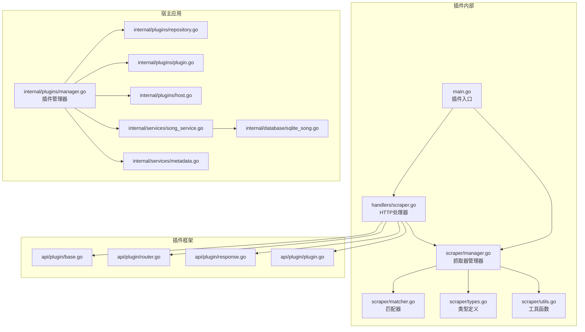
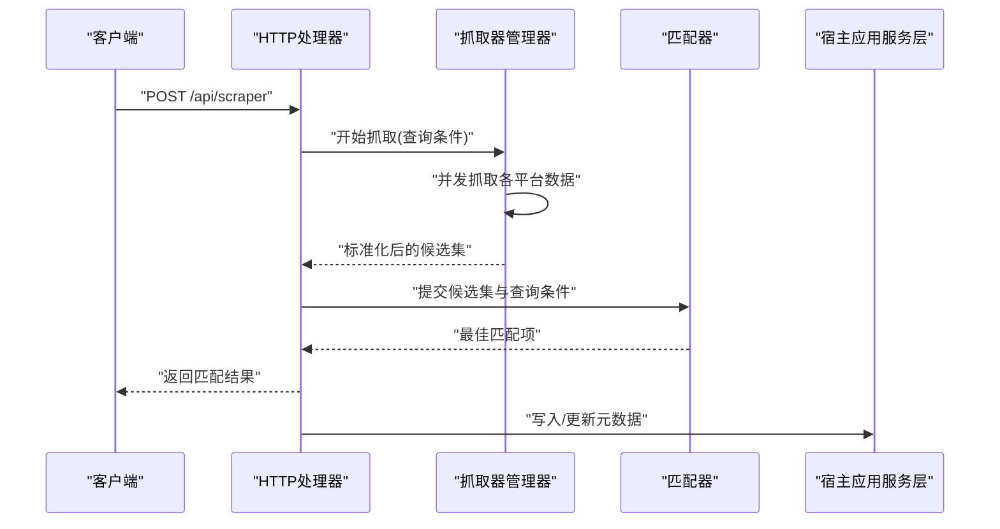
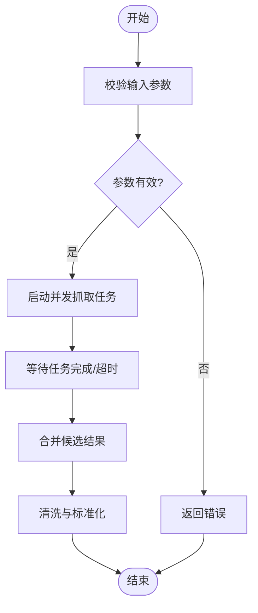
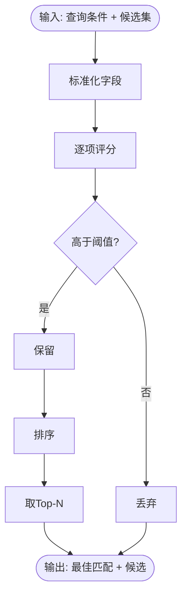
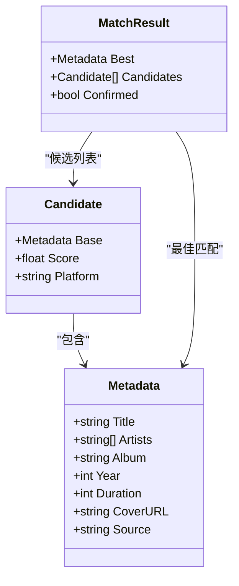
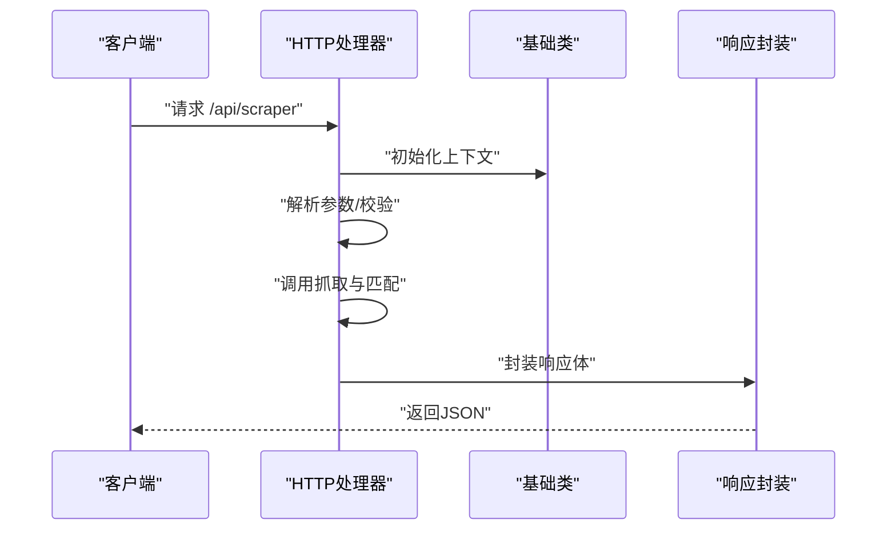
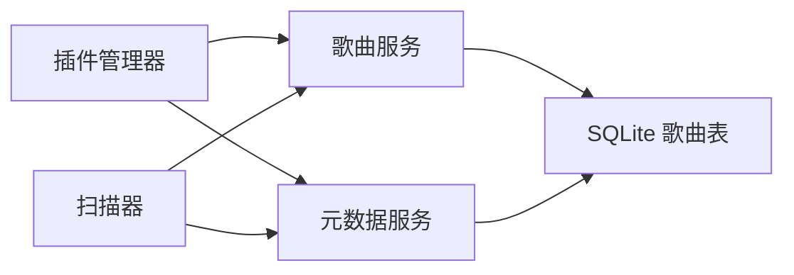
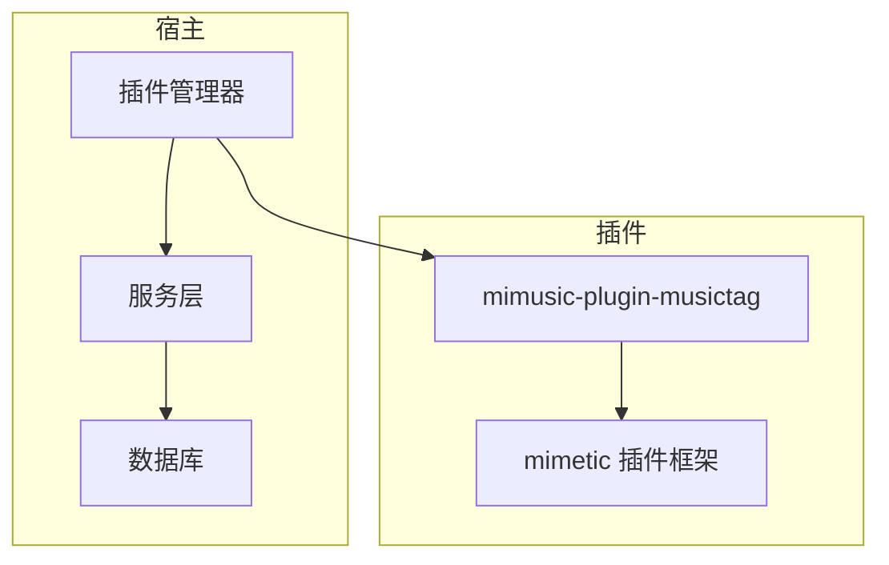

# MusicTag 插件

<cite>
**本文引用的文件**
- [main.go](file://plugins/mimusic-plugin-musictag/main.go)
- [manager.go](file://plugins/mimusic-plugin-musictag/scraper/manager.go)
- [matcher.go](file://plugins/mimusic-plugin-musictag/scraper/matcher.go)
- [types.go](file://plugins/mimusic-plugin-musictag/scraper/types.go)
- [utils.go](file://plugins/mimusic-plugin-musictag/scraper/utils.go)
- [scraper.go](file://plugins/mimusic-plugin-musictag/handlers/scraper.go)
- [go.mod](file://plugins/mimusic-plugin-musictag/go.mod)
- [plugin.go](file://mimusic-plugin/api/plugin/plugin.go)
- [router.go](file://mimusic-plugin/api/plugin/router.go)
- [response.go](file://mimusic-plugin/api/plugin/response.go)
- [base.go](file://mimusic-plugin/api/plugin/base.go)
- [manager.go](file://internal/plugins/manager.go)
- [host.go](file://internal/plugins/host.go)
- [plugin.go](file://internal/plugins/plugin.go)
- [repository.go](file://internal/plugins/repository.go)
- [song_service.go](file://internal/services/song_service.go)
- [metadata.go](file://internal/services/metadata.go)
- [scanner.go](file://internal/services/scanner.go)
- [sqlite_song.go](file://internal/database/sqlite_song.go)
- [sqlite.go](file://internal/database/sqlite.go)
- [sqlite_config.go](file://internal/database/sqlite_config.go)
- [models.go](file://internal/models/models.go)
- [constant.go](file://internal/models/constant.go)
- [main.go](file://main.go)
- [go.mod](file://go.mod)
</cite>

## 目录
1. [简介](#简介)
2. [项目结构](#项目结构)
3. [核心组件](#核心组件)
4. [架构总览](#架构总览)
5. [详细组件分析](#详细组件分析)
6. [依赖关系分析](#依赖关系分析)
7. [性能考量](#性能考量)
8. [故障排查指南](#故障排查指南)
9. [结论](#结论)
10. [附录](#附录)

## 简介
本文件为 MusicTag 插件的实现文档，聚焦 mimusic-plugin-musictag 插件在音频元数据抓取与匹配方面的设计与实现。文档从系统架构、组件职责、数据流、匹配算法、数据清洗与去重、缓存策略以及与宿主应用音乐库的集成与同步等方面进行全面剖析，并通过图示展示关键流程与类关系，帮助开发者快速理解与扩展该插件。

## 项目结构
MusicTag 插件位于 plugins/mimusic-plugin-musictag 目录下，采用 Go 语言实现，遵循 mimusic 插件框架规范。其核心目录与文件如下：
- 插件入口：main.go
- 抓取器与匹配器：scraper/manager.go、scraper/matcher.go、scraper/types.go、scraper/utils.go
- 处理器：handlers/scraper.go
- 插件框架适配：mimusic-plugin/api/plugin/*.go
- 宿主应用集成：internal/plugins/*（插件管理）、internal/services/*（服务层）、internal/database/*（数据库）

**图表来源**
- [main.go](file://plugins/mimusic-plugin-musictag/main.go)
- [manager.go](file://plugins/mimusic-plugin-musictag/scraper/manager.go)
- [matcher.go](file://plugins/mimusic-plugin-musictag/scraper/matcher.go)
- [types.go](file://plugins/mimusic-plugin-musictag/scraper/types.go)
- [utils.go](file://plugins/mimusic-plugin-musictag/scraper/utils.go)
- [scraper.go](file://plugins/mimusic-plugin-musictag/handlers/scraper.go)
- [base.go](file://mimusic-plugin/api/plugin/base.go)
- [router.go](file://mimusic-plugin/api/plugin/router.go)
- [response.go](file://mimusic-plugin/api/plugin/response.go)
- [plugin.go](file://mimusic-plugin/api/plugin/plugin.go)
- [manager.go](file://internal/plugins/manager.go)
- [repository.go](file://internal/plugins/repository.go)
- [plugin.go](file://internal/plugins/plugin.go)
- [host.go](file://internal/plugins/host.go)
- [song_service.go](file://internal/services/song_service.go)
- [metadata.go](file://internal/services/metadata.go)
- [sqlite_song.go](file://internal/database/sqlite_song.go)

**章节来源**
- [main.go](file://plugins/mimusic-plugin-musictag/main.go)
- [go.mod](file://plugins/mimusic-plugin-musictag/go.mod)

## 核心组件
- 抓取器管理器：负责协调多平台数据源抓取、请求调度、并发控制与错误恢复。
- 匹配器：对抓取到的候选结果进行评分与筛选，输出最佳匹配项。
- 类型与工具：统一数据模型、字段标准化、字符串规范化与清洗。
- HTTP 处理器：暴露 REST 接口，接收外部调用，桥接抓取与匹配流程。
- 插件框架适配：遵循 mimetic 插件协议，注册路由、响应封装与生命周期管理。
- 宿主集成：通过插件管理器与服务层对接，写入/更新音乐库元数据。

**章节来源**
- [manager.go](file://plugins/mimusic-plugin-musictag/scraper/manager.go)
- [matcher.go](file://plugins/mimusic-plugin-musictag/scraper/matcher.go)
- [types.go](file://plugins/mimusic-plugin-musictag/scraper/types.go)
- [utils.go](file://plugins/mimusic-plugin-musictag/scraper/utils.go)
- [scraper.go](file://plugins/mimusic-plugin-musictag/handlers/scraper.go)

## 架构总览
MusicTag 插件采用“处理器-抓取器-匹配器”三层结构：
- 处理器接收请求，解析参数，触发抓取器执行数据抓取。
- 抓取器管理器按平台聚合数据，统一格式化与清洗。
- 匹配器基于歌曲名、艺人、专辑等字段计算相似度，输出最优结果。
- 结果经响应封装返回给宿主应用，宿主应用的服务层将元数据写入音乐库。

**图表来源**
- [scraper.go](file://plugins/mimusic-plugin-musictag/handlers/scraper.go)
- [manager.go](file://plugins/mimusic-plugin-musictag/scraper/manager.go)
- [matcher.go](file://plugins/mimusic-plugin-musictag/scraper/matcher.go)
- [song_service.go](file://internal/services/song_service.go)

## 详细组件分析

### 抓取器管理器（调度与并发）
- 职责
  - 统一入口：接收查询条件，分发至各平台抓取器。
  - 并发控制：限制最大并发数，避免平台限流与资源争用。
  - 错误恢复：对失败请求进行重试与降级处理。
  - 数据聚合：合并来自不同平台的结果，去除重复条目。
- 关键流程
  - 参数校验与预处理。
  - 启动多个抓取任务，等待完成或超时。
  - 合并结果并进行初步清洗与标准化。
- 性能要点
  - 使用 goroutine 与 channel 控制并发与结果收集。
  - 对慢平台设置独立超时，保证整体吞吐。

**图表来源**
- [manager.go](file://plugins/mimusic-plugin-musictag/scraper/manager.go)

**章节来源**
- [manager.go](file://plugins/mimusic-plugin-musictag/scraper/manager.go)

### 匹配器（评分与筛选）
- 职责
  - 基于歌曲名、艺人名、专辑名等字段计算相似度。
  - 过滤低分候选，输出置信度最高的匹配项。
- 评分维度
  - 歌曲名相似度（模糊匹配/编辑距离）。
  - 艺人名匹配（精确/模糊，支持多艺人拼接）。
  - 专辑名匹配（精确/模糊）。
  - 发行年份/时长辅助权重。
- 输出
  - 最佳匹配项及其得分。
  - 可选的候选列表（用于人工确认）。

**图表来源**
- [matcher.go](file://plugins/mimusic-plugin-musictag/scraper/matcher.go)
- [utils.go](file://plugins/mimusic-plugin-musictag/scraper/utils.go)

**章节来源**
- [matcher.go](file://plugins/mimusic-plugin-musictag/scraper/matcher.go)
- [utils.go](file://plugins/mimusic-plugin-musictag/scraper/utils.go)

### 类型与数据模型
- 统一字段
  - 歌曲标题、艺人列表、专辑名称、发行年份、时长、封面 URL。
- 标准化规则
  - 去除多余空格与标点，统一大小写处理。
  - 艺人列表按常见分隔符拆分与合并。
- 去重策略
  - 基于“标题+艺人+专辑”的组合键去重。
  - 对相似度极高的条目进行合并与权重加权。

**图表来源**
- [types.go](file://plugins/mimusic-plugin-musictag/scraper/types.go)

**章节来源**
- [types.go](file://plugins/mimusic-plugin-musictag/scraper/types.go)

### HTTP 处理器（接口与响应）
- 路由
  - 提供 /api/scraper 接口，支持 GET/POST。
- 请求参数
  - 支持歌曲名、艺人名、专辑名、时长范围等查询条件。
- 响应
  - 成功：返回匹配结果与候选列表。
  - 失败：返回错误码与错误信息。
- 与插件框架集成
  - 使用插件基础类与响应封装，确保协议一致。

**图表来源**
- [scraper.go](file://plugins/mimusic-plugin-musictag/handlers/scraper.go)
- [base.go](file://mimusic-plugin/api/plugin/base.go)
- [response.go](file://mimusic-plugin/api/plugin/response.go)
- [router.go](file://mimusic-plugin/api/plugin/router.go)

**章节来源**
- [scraper.go](file://plugins/mimusic-plugin-musictag/handlers/scraper.go)

### 插件框架适配
- 注册路由与中间件，确保处理器可被宿主发现。
- 生命周期管理：启动时加载配置，关闭时释放资源。
- 错误处理：统一捕获异常并转换为标准响应。

**章节来源**
- [plugin.go](file://mimusic-plugin/api/plugin/plugin.go)
- [router.go](file://mimusic-plugin/api/plugin/router.go)
- [response.go](file://mimusic-plugin/api/plugin/response.go)

### 与宿主应用的集成与同步
- 插件管理器
  - 动态加载插件二进制，维护插件生命周期。
  - 提供插件间通信与状态查询能力。
- 服务层
  - 歌曲服务：写入/更新歌曲元数据，处理冲突与覆盖。
  - 元数据服务：标准化与持久化，支持批量导入。
- 数据库
  - SQLite 存储歌曲与播放列表，提供事务与索引优化。
- 扫描器
  - 驱动本地扫描，结合插件结果完善缺失元数据。

**图表来源**
- [manager.go](file://internal/plugins/manager.go)
- [repository.go](file://internal/plugins/repository.go)
- [plugin.go](file://internal/plugins/plugin.go)
- [host.go](file://internal/plugins/host.go)
- [song_service.go](file://internal/services/song_service.go)
- [metadata.go](file://internal/services/metadata.go)
- [sqlite_song.go](file://internal/database/sqlite_song.go)
- [scanner.go](file://internal/services/scanner.go)

**章节来源**
- [manager.go](file://internal/plugins/manager.go)
- [repository.go](file://internal/plugins/repository.go)
- [plugin.go](file://internal/plugins/plugin.go)
- [host.go](file://internal/plugins/host.go)
- [song_service.go](file://internal/services/song_service.go)
- [metadata.go](file://internal/services/metadata.go)
- [sqlite_song.go](file://internal/database/sqlite_song.go)
- [scanner.go](file://internal/services/scanner.go)

## 依赖关系分析
- 插件内部依赖
  - mimetic 插件框架：提供路由、响应与生命周期管理。
  - 标准库与第三方库：并发控制、HTTP、JSON、日志等。
- 宿主应用依赖
  - 插件管理器：动态加载与生命周期控制。
  - 服务层：歌曲与元数据操作。
  - 数据库：持久化存储与事务支持。

**图表来源**
- [go.mod](file://plugins/mimusic-plugin-musictag/go.mod)
- [go.mod](file://go.mod)

**章节来源**
- [go.mod](file://plugins/mimusic-plugin-musictag/go.mod)
- [go.mod](file://go.mod)

## 性能考量
- 并发与限流
  - 抓取器管理器应限制最大并发，避免平台封禁与资源耗尽。
  - 对慢平台设置独立超时，保障整体响应时间。
- 缓存策略
  - 结果缓存：对热门查询进行短期缓存，降低重复抓取成本。
  - 字段缓存：常用标准化规则与映射表缓存，减少重复计算。
- 匹配效率
  - 使用索引与前缀过滤减少候选集规模。
  - 分阶段评分：先粗筛后精评，提升吞吐。
- I/O 优化
  - 批量写入数据库，使用事务减少磁盘开销。
  - 异步写入与队列化处理，避免阻塞主线程。

## 故障排查指南
- 常见问题
  - 抓取失败：检查网络连通性、平台接口变更与限流策略。
  - 匹配率低：调整评分阈值与相似度算法参数。
  - 写入冲突：检查去重策略与数据库约束，避免重复记录。
- 日志与监控
  - 记录抓取耗时、成功率与错误堆栈，便于定位瓶颈。
  - 监控并发数与缓存命中率，评估系统健康度。
- 修复建议
  - 增加重试与熔断机制，提高鲁棒性。
  - 优化数据库索引与查询计划，减少写入延迟。

**章节来源**
- [manager.go](file://plugins/mimusic-plugin-musictag/scraper/manager.go)
- [matcher.go](file://plugins/mimusic-plugin-musictag/scraper/matcher.go)
- [sqlite_song.go](file://internal/database/sqlite_song.go)

## 结论
MusicTag 插件通过清晰的分层架构实现了跨平台元数据抓取与智能匹配，结合标准化与去重机制，确保了结果的准确性与一致性。配合宿主应用的服务层与数据库，能够高效地完成元数据补全与同步。未来可在缓存策略、评分算法与并发控制方面进一步优化，以应对更大规模的音乐库与更复杂的匹配场景。

## 附录
- 快速开始
  - 构建插件：在插件目录执行构建命令，生成可执行文件。
  - 部署插件：将插件二进制放入宿主应用插件目录，重启服务。
  - 调用接口：访问 /api/scraper，传入查询参数获取匹配结果。
- 最佳实践
  - 保持评分阈值与去重规则的一致性，避免结果漂移。
  - 定期清理缓存与过期数据，维持系统性能。
  - 在高并发场景下启用限流与熔断，保护下游服务。