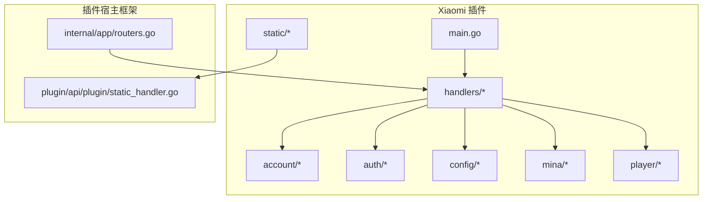
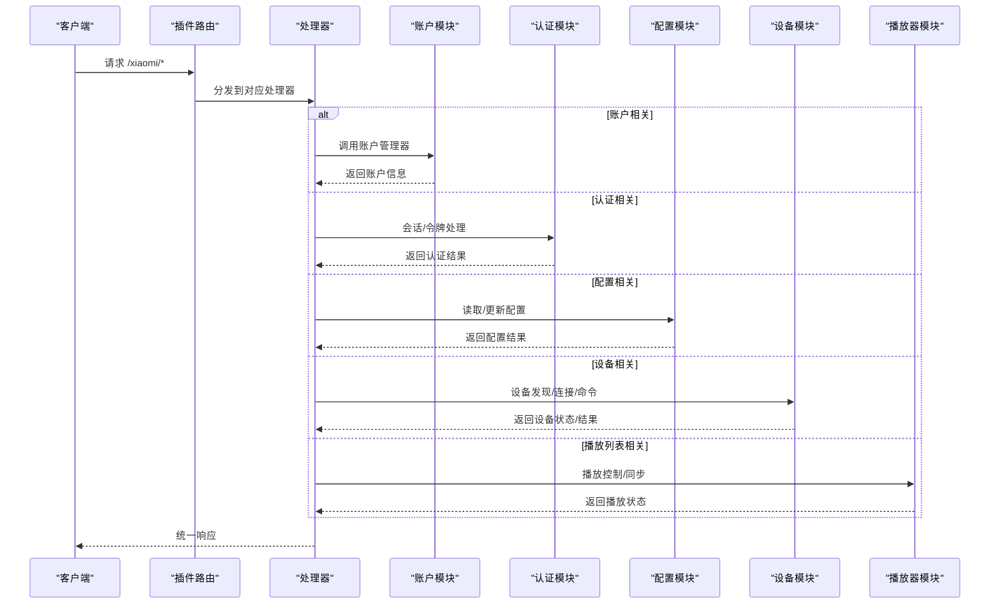
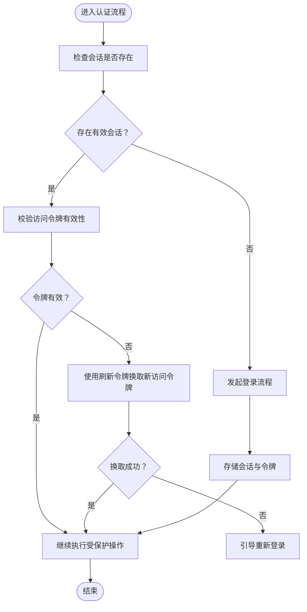
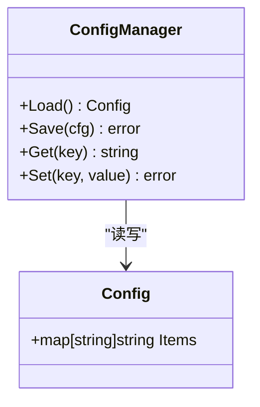
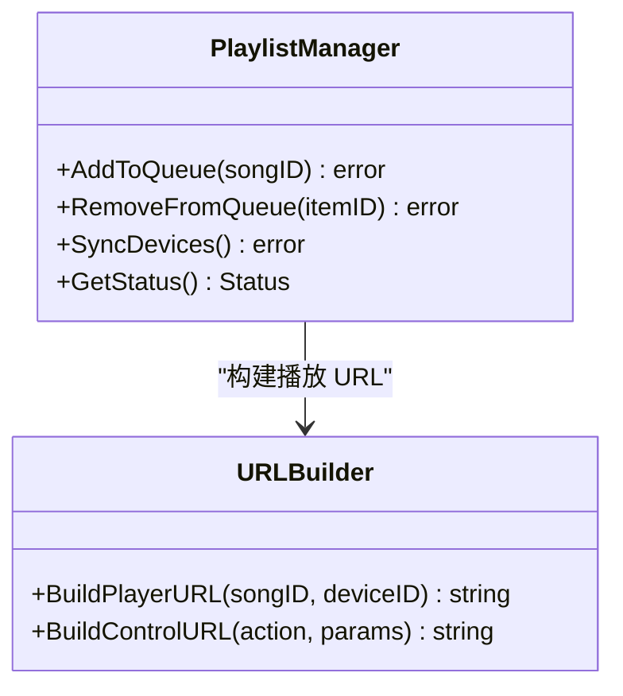
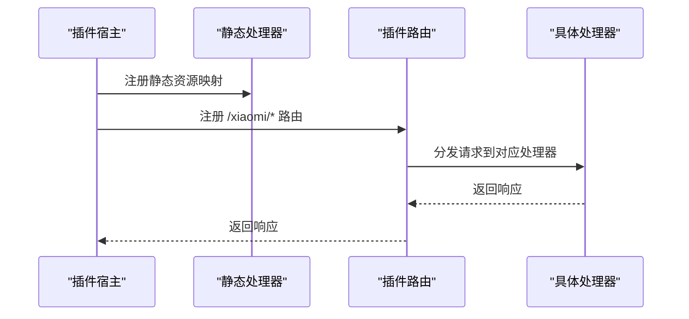
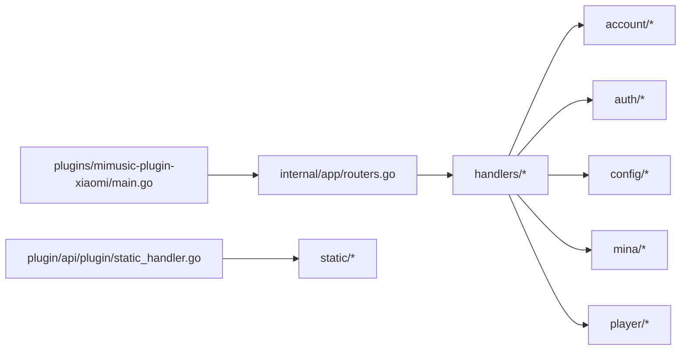

# Xiaomi 插件

<cite>
**本文引用的文件**
- [internal/app/routers.go](file://internal/app/routers.go)
- [internal/models/models.go](file://internal/models/models.go)
- [plugin/api/plugin/static_handler.go](file://plugin/api/plugin/static_handler.go)
- [plugins/mimusic-plugin-xiaomi/main.go](file://plugins/mimusic-plugin-xiaomi/main.go)
- [plugins/mimusic-plugin-xiaomi/README.md](file://plugins/mimusic-plugin-xiaomi/README.md)
- [plugins/mimusic-plugin-xiaomi/handlers/account_handler.go](file://plugins/mimusic-plugin-xiaomi/handlers/account_handler.go)
- [plugins/mimusic-plugin-xiaomi/handlers/auth_handler.go](file://plugins/mimusic-plugin-xiaomi/handlers/auth_handler.go)
- [plugins/mimusic-plugin-xiaomi/handlers/config_handler.go](file://plugins/mimusic-plugin-xiaomi/handlers/config_handler.go)
- [plugins/mimusic-plugin-xiaomi/handlers/device_handler.go](file://plugins/mimusic-plugin-xiaomi/handlers/device_handler.go)
- [plugins/mimusic-plugin-xiaomi/handlers/playlist_handler.go](file://plugins/mimusic-plugin-xiaomi/handlers/playlist_handler.go)
- [plugins/mimusic-plugin-xiaomi/account/manager.go](file://plugins/mimusic-plugin-xiaomi/account/manager.go)
- [plugins/mimusic-plugin-xiaomi/account/types.go](file://plugins/mimusic-plugin-xiaomi/account/types.go)
- [plugins/mimusic-plugin-xiaomi/auth/session.go](file://plugins/mimusic-plugin-xiaomi/auth/session.go)
- [plugins/mimusic-plugin-xiaomi/auth/types.go](file://plugins/mimusic-plugin-xiaomi/auth/types.go)
- [plugins/mimusic-plugin-xiaomi/config/manager.go](file://plugins/mimusic-plugin-xiaomi/config/manager.go)
- [plugins/mimusic-plugin-xiaomi/config/types.go](file://plugins/mimusic-plugin-xiaomi/config/types.go)
- [plugins/mimusic-plugin-xiaomi/mina/types.go](file://plugins/mimusic-plugin-xiaomi/mina/types.go)
- [plugins/mimusic-plugin-xiaomi/player/url_builder.go](file://plugins/mimusic-plugin-xiaomi/player/url_builder.go)
</cite>

## 目录
1. [简介](#简介)
2. [项目结构](#项目结构)
3. [核心组件](#核心组件)
4. [架构总览](#架构总览)
5. [详细组件分析](#详细组件分析)
6. [依赖关系分析](#依赖关系分析)
7. [性能考量](#性能考量)
8. [故障排查指南](#故障排查指南)
9. [结论](#结论)
10. [附录](#附录)

## 简介
本文件面向 Xiaomi 插件的实现与集成，聚焦于 mimusic-plugin-xiaomi 在小米生态中的角色与能力边界。根据仓库现有代码与文档线索，该插件以 WASM 形式作为后端插件运行，通过统一的插件宿主框架暴露 REST 接口，并提供与小米生态相关的账户、配置、设备与播放列表等能力。本文将从系统架构、组件职责、数据流与处理逻辑、依赖关系与性能优化等方面进行系统化梳理，并给出可操作的排障建议。

## 项目结构
Xiaomi 插件位于 plugins/mimusic-plugin-xiaomi 目录下，采用 Go 语言编写，遵循 mimusic 的插件开发规范。其主要模块包括：
- 账户与认证：account、auth
- 配置管理：config
- 设备与 Mina 服务：mina
- 播放器与播放列表：player
- HTTP 处理器：handlers
- 静态资源与入口：static、main.go、README.md



图表来源
- [plugins/mimusic-plugin-xiaomi/main.go](file://plugins/mimusic-plugin-xiaomi/main.go)
- [plugins/mimusic-plugin-xiaomi/handlers/account_handler.go](file://plugins/mimusic-plugin-xiaomi/handlers/account_handler.go)
- [plugins/mimusic-plugin-xiaomi/handlers/auth_handler.go](file://plugins/mimusic-plugin-xiaomi/handlers/auth_handler.go)
- [plugins/mimusic-plugin-xiaomi/handlers/config_handler.go](file://plugins/mimusic-plugin-xiaomi/handlers/config_handler.go)
- [plugins/mimusic-plugin-xiaomi/handlers/device_handler.go](file://plugins/mimusic-plugin-xiaomi/handlers/device_handler.go)
- [plugins/mimusic-plugin-xiaomi/handlers/playlist_handler.go](file://plugins/mimusic-plugin-xiaomi/handlers/playlist_handler.go)
- [internal/app/routers.go](file://internal/app/routers.go)
- [plugin/api/plugin/static_handler.go](file://plugin/api/plugin/static_handler.go)

章节来源
- [plugins/mimusic-plugin-xiaomi/main.go](file://plugins/mimusic-plugin-xiaomi/main.go)
- [plugins/mimusic-plugin-xiaomi/README.md](file://plugins/mimusic-plugin-xiaomi/README.md)
- [internal/app/routers.go](file://internal/app/routers.go)
- [plugin/api/plugin/static_handler.go](file://plugin/api/plugin/static_handler.go)

## 核心组件
- 账户系统：负责用户账户信息的读取与管理，提供账户相关的接口封装。
- 认证会话：维护会话状态与令牌生命周期，提供登录、刷新与撤销等能力。
- 配置管理：集中管理插件运行所需的配置项，支持读取与更新。
- 设备与 Mina 服务：抽象设备发现、连接与命令通信协议，支撑播放控制与状态同步。
- 播放列表管理：负责远程播放控制、设备间同步与状态管理。
- 静态资源与路由：通过插件静态处理器提供前端页面与脚本，结合后端路由暴露 API。

章节来源
- [plugins/mimusic-plugin-xiaomi/account/manager.go](file://plugins/mimusic-plugin-xiaomi/account/manager.go)
- [plugins/mimusic-plugin-xiaomi/account/types.go](file://plugins/mimusic-plugin-xiaomi/account/types.go)
- [plugins/mimusic-plugin-xiaomi/auth/session.go](file://plugins/mimusic-plugin-xiaomi/auth/session.go)
- [plugins/mimusic-plugin-xiaomi/auth/types.go](file://plugins/mimusic-plugin-xiaomi/auth/types.go)
- [plugins/mimusic-plugin-xiaomi/config/manager.go](file://plugins/mimusic-plugin-xiaomi/config/manager.go)
- [plugins/mimusic-plugin-xiaomi/config/types.go](file://plugins/mimusic-plugin-xiaomi/config/types.go)
- [plugins/mimusic-plugin-xiaomi/mina/types.go](file://plugins/mimusic-plugin-xiaomi/mina/types.go)
- [plugins/mimusic-plugin-xiaomi/player/url_builder.go](file://plugins/mimusic-plugin-xiaomi/player/url_builder.go)

## 架构总览
Xiaomi 插件通过统一的插件宿主框架注册路由与静态资源，对外提供 REST API。后端处理器根据业务域划分到 account、auth、config、device、playlist 等模块，各模块内部再细分为 manager、types 等文件，形成清晰的分层与职责边界。



图表来源
- [internal/app/routers.go](file://internal/app/routers.go)
- [plugins/mimusic-plugin-xiaomi/handlers/account_handler.go](file://plugins/mimusic-plugin-xiaomi/handlers/account_handler.go)
- [plugins/mimusic-plugin-xiaomi/handlers/auth_handler.go](file://plugins/mimusic-plugin-xiaomi/handlers/auth_handler.go)
- [plugins/mimusic-plugin-xiaomi/handlers/config_handler.go](file://plugins/mimusic-plugin-xiaomi/handlers/config_handler.go)
- [plugins/mimusic-plugin-xiaomi/handlers/device_handler.go](file://plugins/mimusic-plugin-xiaomi/handlers/device_handler.go)
- [plugins/mimusic-plugin-xiaomi/handlers/playlist_handler.go](file://plugins/mimusic-plugin-xiaomi/handlers/playlist_handler.go)

## 详细组件分析

### 账户系统
- 职责：提供账户信息的读取与管理，作为认证与配置的前置条件。
- 数据模型：账户类型定义了账户的基本属性与行为。
- 管理器：封装账户的增删改查与业务逻辑。

```mermaid
classDiagram
class AccountManager {
+GetAccount() Account
+UpdateAccount(data) error
+DeleteAccount(id) error
}
class Account {
+string ID
+string Name
+map[string]interface{} Extra
}
AccountManager --> Account : "管理"
```

图表来源
- [plugins/mimusic-plugin-xiaomi/account/manager.go](file://plugins/mimusic-plugin-xiaomi/account/manager.go)
- [plugins/mimusic-plugin-xiaomi/account/types.go](file://plugins/mimusic-plugin-xiaomi/account/types.go)

章节来源
- [plugins/mimusic-plugin-xiaomi/account/manager.go](file://plugins/mimusic-plugin-xiaomi/account/manager.go)
- [plugins/mimusic-plugin-xiaomi/account/types.go](file://plugins/mimusic-plugin-xiaomi/account/types.go)

### 认证与会话
- 会话管理：维护登录态、令牌刷新与撤销流程，确保安全访问。
- 令牌类型：区分访问令牌与刷新令牌，明确过期时间与撤销记录。
- 会话状态：提供会话查询、续期与失效处理。



图表来源
- [plugins/mimusic-plugin-xiaomi/auth/session.go](file://plugins/mimusic-plugin-xiaomi/auth/session.go)
- [plugins/mimusic-plugin-xiaomi/auth/types.go](file://plugins/mimusic-plugin-xiaomi/auth/types.go)

章节来源
- [plugins/mimusic-plugin-xiaomi/auth/session.go](file://plugins/mimusic-plugin-xiaomi/auth/session.go)
- [plugins/mimusic-plugin-xiaomi/auth/types.go](file://plugins/mimusic-plugin-xiaomi/auth/types.go)

### 配置管理
- 职责：集中管理插件配置项，支持读取与更新，保障运行参数的一致性。
- 类型定义：配置项的数据结构与默认值。
- 管理器：封装配置的持久化与变更通知。



图表来源
- [plugins/mimusic-plugin-xiaomi/config/manager.go](file://plugins/mimusic-plugin-xiaomi/config/manager.go)
- [plugins/mimusic-plugin-xiaomi/config/types.go](file://plugins/mimusic-plugin-xiaomi/config/types.go)

章节来源
- [plugins/mimusic-plugin-xiaomi/config/manager.go](file://plugins/mimusic-plugin-xiaomi/config/manager.go)
- [plugins/mimusic-plugin-xiaomi/config/types.go](file://plugins/mimusic-plugin-xiaomi/config/types.go)

### 设备与 Mina 服务
- 设备类型：抽象设备属性与能力，便于统一管理与扩展。
- 服务接口：定义设备发现、连接建立与命令通信协议，支撑播放控制与状态同步。

```mermaid
classDiagram
class Device {
+string ID
+string Name
+string Type
+bool IsOnline
+map[string]interface{} Capabilities
}
class MinaService {
+Discover() []Device
+Connect(deviceID) error
+SendCommand(deviceID, command) error
+GetStatus(deviceID) Status
}
MinaService --> Device : "管理"
```

图表来源
- [plugins/mimusic-plugin-xiaomi/mina/types.go](file://plugins/mimusic-plugin-xiaomi/mina/types.go)

章节来源
- [plugins/mimusic-plugin-xiaomi/mina/types.go](file://plugins/mimusic-plugin-xiaomi/mina/types.go)

### 播放列表管理与播放器 URL 构建
- 播放列表管理器：负责远程播放控制、设备间同步与状态管理，协调多设备播放一致性。
- URL 构建器：根据播放上下文生成可播放的 URL，确保跨设备一致的播放体验。



图表来源
- [plugins/mimusic-plugin-xiaomi/player/url_builder.go](file://plugins/mimusic-plugin-xiaomi/player/url_builder.go)

章节来源
- [plugins/mimusic-plugin-xiaomi/player/url_builder.go](file://plugins/mimusic-plugin-xiaomi/player/url_builder.go)

### HTTP 处理器与路由
- 路由注册：插件通过统一的路由注册机制挂载到 /xiaomi 前缀下。
- 处理器职责：按领域拆分，分别处理账户、认证、配置、设备与播放列表请求。
- 静态资源：通过插件静态处理器提供前端页面与脚本，结合后端路由暴露 API。



图表来源
- [internal/app/routers.go](file://internal/app/routers.go)
- [plugin/api/plugin/static_handler.go](file://plugin/api/plugin/static_handler.go)
- [plugins/mimusic-plugin-xiaomi/handlers/account_handler.go](file://plugins/mimusic-plugin-xiaomi/handlers/account_handler.go)
- [plugins/mimusic-plugin-xiaomi/handlers/auth_handler.go](file://plugins/mimusic-plugin-xiaomi/handlers/auth_handler.go)
- [plugins/mimusic-plugin-xiaomi/handlers/config_handler.go](file://plugins/mimusic-plugin-xiaomi/handlers/config_handler.go)
- [plugins/mimusic-plugin-xiaomi/handlers/device_handler.go](file://plugins/mimusic-plugin-xiaomi/handlers/device_handler.go)
- [plugins/mimusic-plugin-xiaomi/handlers/playlist_handler.go](file://plugins/mimusic-plugin-xiaomi/handlers/playlist_handler.go)

章节来源
- [internal/app/routers.go](file://internal/app/routers.go)
- [plugin/api/plugin/static_handler.go](file://plugin/api/plugin/static_handler.go)
- [plugins/mimusic-plugin-xiaomi/handlers/account_handler.go](file://plugins/mimusic-plugin-xiaomi/handlers/account_handler.go)
- [plugins/mimusic-plugin-xiaomi/handlers/auth_handler.go](file://plugins/mimusic-plugin-xiaomi/handlers/auth_handler.go)
- [plugins/mimusic-plugin-xiaomi/handlers/config_handler.go](file://plugins/mimusic-plugin-xiaomi/handlers/config_handler.go)
- [plugins/mimusic-plugin-xiaomi/handlers/device_handler.go](file://plugins/mimusic-plugin-xiaomi/handlers/device_handler.go)
- [plugins/mimusic-plugin-xiaomi/handlers/playlist_handler.go](file://plugins/mimusic-plugin-xiaomi/handlers/playlist_handler.go)

## 依赖关系分析
- 插件入口与路由：插件通过 main.go 启动，结合内部路由器注册，形成统一的 API 入口。
- 静态资源与前端：静态处理器负责将 /xiaomi/static/* 映射到插件内静态资源，供前端页面使用。
- 数据模型：插件信息与令牌等模型在内部模型中定义，为插件上传与认证提供基础数据结构。



图表来源
- [plugins/mimusic-plugin-xiaomi/main.go](file://plugins/mimusic-plugin-xiaomi/main.go)
- [internal/app/routers.go](file://internal/app/routers.go)
- [plugin/api/plugin/static_handler.go](file://plugin/api/plugin/static_handler.go)

章节来源
- [plugins/mimusic-plugin-xiaomi/main.go](file://plugins/mimusic-plugin-xiaomi/main.go)
- [internal/app/routers.go](file://internal/app/routers.go)
- [plugin/api/plugin/static_handler.go](file://plugin/api/plugin/static_handler.go)
- [internal/models/models.go](file://internal/models/models.go)

## 性能考量
- 路由与处理器分层：按领域拆分处理器，降低耦合，提升可维护性与扩展性。
- 会话与令牌：合理设置过期时间与刷新策略，避免频繁登录带来的性能损耗。
- 设备通信：对设备发现与命令发送进行批量与去重处理，减少网络往返。
- 播放队列同步：在多设备场景下，采用增量同步与冲突解决策略，降低带宽与 CPU 开销。
- 静态资源：通过静态处理器缓存与压缩，提升前端加载速度。

## 故障排查指南
- 插件未生效
  - 检查插件是否正确注册到 /xiaomi 前缀。
  - 确认插件文件路径与入口路径配置正确。
- 认证失败
  - 校验访问令牌是否过期，必要时使用刷新令牌。
  - 检查会话状态与撤销记录，确认是否存在异常。
- 设备无法连接
  - 确认设备在线状态与能力集。
  - 检查命令发送与返回状态，定位通信问题。
- 播放异常
  - 核对播放 URL 构建参数与设备支持能力。
  - 查看播放队列同步日志，排查设备间状态不一致。

章节来源
- [internal/app/routers.go](file://internal/app/routers.go)
- [plugins/mimusic-plugin-xiaomi/auth/session.go](file://plugins/mimusic-plugin-xiaomi/auth/session.go)
- [plugins/mimusic-plugin-xiaomi/mina/types.go](file://plugins/mimusic-plugin-xiaomi/mina/types.go)
- [plugins/mimusic-plugin-xiaomi/player/url_builder.go](file://plugins/mimusic-plugin-xiaomi/player/url_builder.go)

## 结论
Xiaomi 插件通过清晰的模块划分与统一的插件框架，实现了账户、认证、配置、设备与播放列表等核心能力。其架构具备良好的扩展性与可维护性，能够满足小米生态集成场景下的播放控制与状态同步需求。后续可在设备通信优化、播放队列一致性与前端交互体验方面持续改进。

## 附录
- 插件信息模型：包含插件名称、版本、入口路径、文件路径与状态等关键字段，用于插件上传与管理。
- 插件入口路径示例：/xiaomi，文件路径示例 xiaomi.wasm，用于插件注册与静态资源映射。

章节来源
- [internal/models/models.go](file://internal/models/models.go)