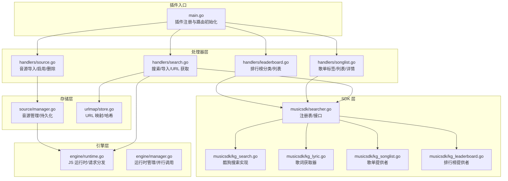
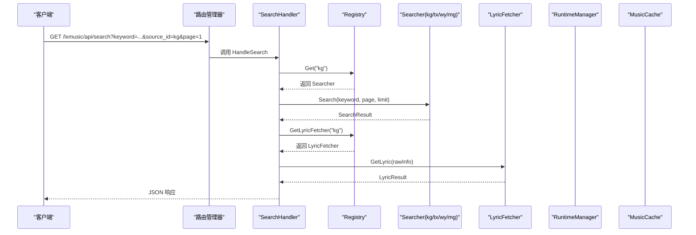
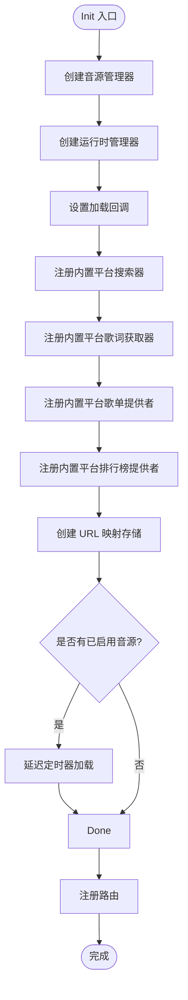
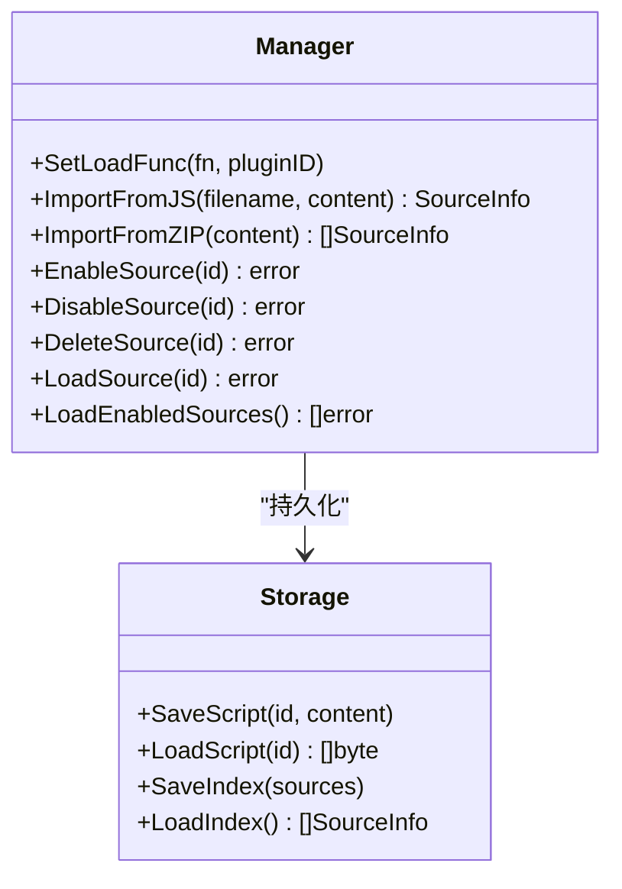
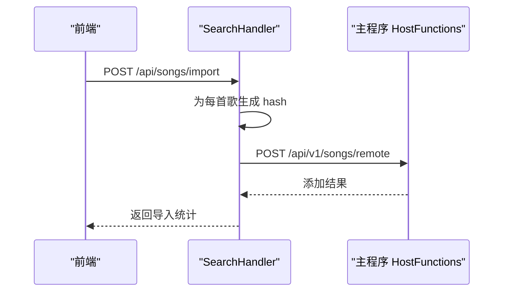
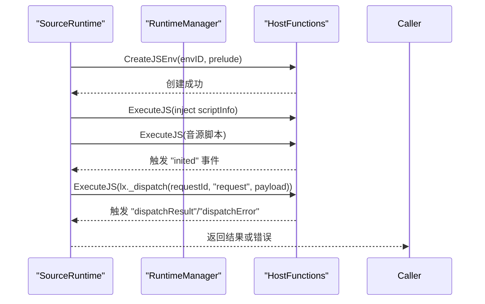
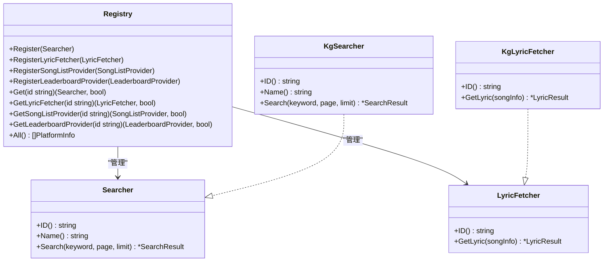
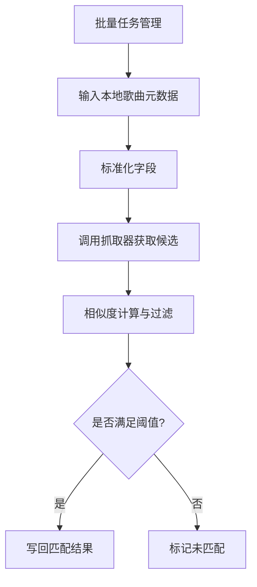
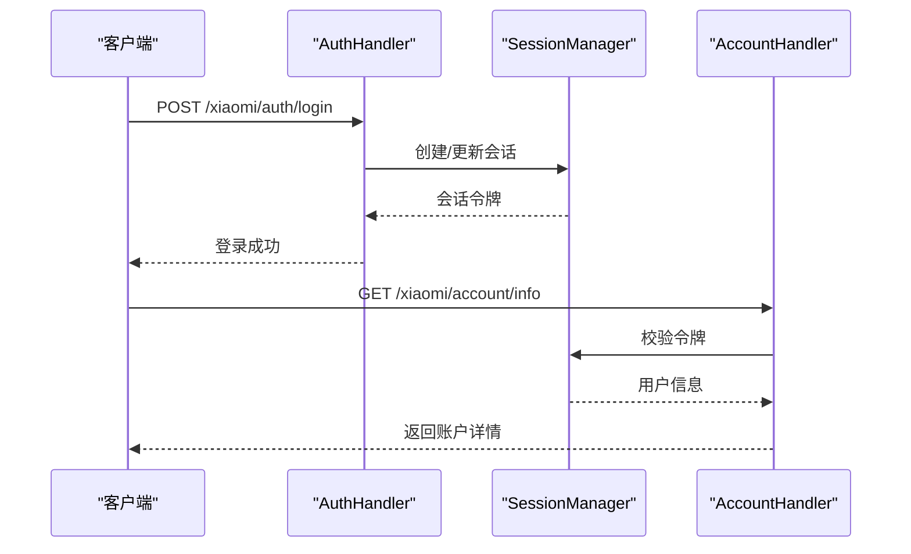
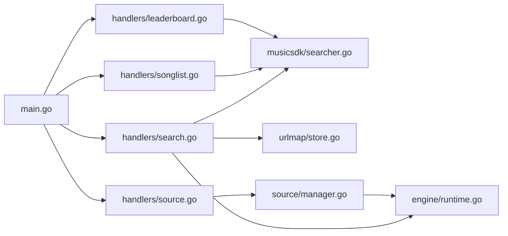

# 内置插件示例

<cite>
**本文引用的文件**
- [plugins/mimusic-plugin-lxmusic/main.go](file://plugins/mimusic-plugin-lxmusic/main.go)
- [plugins/mimusic-plugin-lxmusic/handlers/search.go](file://plugins/mimusic-plugin-lxmusic/handlers/search.go)
- [plugins/mimusic-plugin-lxmusic/handlers/source.go](file://plugins/mimusic-plugin-lxmusic/handlers/source.go)
- [plugins/mimusic-plugin-lxmusic/handlers/songlist.go](file://plugins/mimusic-plugin-lxmusic/handlers/songlist.go)
- [plugins/mimusic-plugin-lxmusic/handlers/leaderboard.go](file://plugins/mimusic-plugin-lxmusic/handlers/leaderboard.go)
- [plugins/mimusic-plugin-lxmusic/source/manager.go](file://plugins/mimusic-plugin-lxmusic/source/manager.go)
- [plugins/mimusic-plugin-lxmusic/source/parser.go](file://plugins/mimusic-plugin-lxmusic/source/parser.go)
- [plugins/mimusic-plugin-lxmusic/source/storage.go](file://plugins/mimusic-plugin-lxmusic/source/storage.go)
- [plugins/mimusic-plugin-lxmusic/engine/runtime.go](file://plugins/mimusic-plugin-lxmusic/engine/runtime.go)
- [plugins/mimusic-plugin-lxmusic/engine/manager.go](file://plugins/mimusic-plugin-lxmusic/engine/manager.go)
- [plugins/mimusic-plugin-lxmusic/urlmap/store.go](file://plugins/mimusic-plugin-lxmusic/urlmap/store.go)
- [plugins/mimusic-plugin-example/main.go](file://plugins/mimusic-plugin-example/main.go)
- [plugins/mimusic-plugin-musictag/main.go](file://plugins/mimusic-plugin-musictag/main.go)
- [plugins/mimusic-plugin-musictag/handlers/scraper.go](file://plugins/mimusic-plugin-musictag/handlers/scraper.go)
- [plugins/mimusic-plugin-musictag/scraper/manager.go](file://plugins/mimusic-plugin-musictag/scraper/manager.go)
- [plugins/mimusic-plugin-xiaomi/main.go](file://plugins/mimusic-plugin-xiaomi/main.go)
- [plugins/mimusic-plugin-xiaomi/handlers/account_handler.go](file://plugins/mimusic-plugin-xiaomi/handlers/account_handler.go)
- [plugins/mimusic-plugin-xiaomi/handlers/auth_handler.go](file://plugins/mimusic-plugin-xiaomi/handlers/auth_handler.go)
- [plugins/mimusic-plugin-xiaomi/handlers/config_handler.go](file://plugins/mimusic-plugin-xiaomi/handlers/config_handler.go)
- [plugins/mimusic-plugin-xiaomi/handlers/device_handler.go](file://plugins/mimusic-plugin-xiaomi/handlers/device_handler.go)
- [plugins/mimusic-plugin-xiaomi/handlers/playlist_handler.go](file://plugins/mimusic-plugin-xiaomi/handlers/playlist_handler.go)
- [plugins/mimusic-plugin-xiaomi/player/playlist_manager.go](file://plugins/mimusic-plugin-xiaomi/player/playlist_manager.go)
- [plugins/mimusic-plugin-xiaomi/player/url_builder.go](file://plugins/mimusic-plugin-xiaomi/player/url_builder.go)
- [plugins/mimusic-plugin-xiaomi/service/service.go](file://plugins/mimusic-plugin-xiaomi/service/service.go)
- [plugins/mimusic-plugin-xiaomi/config/manager.go](file://plugins/mimusic-plugin-xiaomi/config/manager.go)
- [plugins/mimusic-plugin-xiaomi/auth/service.go](file://plugins/mimusic-plugin-xiaomi/auth/service.go)
- [plugins/mimusic-plugin-xiaomi/auth/session.go](file://plugins/mimusic-plugin-xiaomi/auth/session.go)
- [plugins/musicsdk/searcher.go](file://plugins/musicsdk/searcher.go)
- [plugins/musicsdk/kg_search.go](file://plugins/musicsdk/kg_search.go)
- [plugins/musicsdk/kg_lyric.go](file://plugins/musicsdk/kg_lyric.go)
- [plugins/musicsdk/kg_songlist.go](file://plugins/musicsdk/kg_songlist.go)
- [plugins/musicsdk/kg_leaderboard.go](file://plugins/musicsdk/kg_leaderboard.go)
- [plugins/musicsdk/lyric_types.go](file://plugins/musicsdk/lyric_types.go)
</cite>

## 更新摘要
**所做更改**
- 新增 MusicTag 插件的详细实现分析，包括元数据抓取与匹配算法
- 新增 Xiaomi 插件的完整架构说明，涵盖账号管理、设备控制与播放列表功能
- 更新 lxmusic 插件以反映 musicsdk 的歌词功能集成、歌单提供者与排行榜提供者支持
- 增强音乐搜索插件的架构描述，突出搜索器注册表与歌词获取器的分离设计
- **新增官方插件示例**：mimusic-plugin-example 作为插件开发学习模板，提供最小可运行插件结构
- **更新 LX Music 插件架构**：新增歌单与排行榜功能，扩展 musicsdk 注册表的多类型提供者支持

## 目录
1. [简介](#简介)
2. [项目结构](#项目结构)
3. [核心组件](#核心组件)
4. [架构总览](#架构总览)
5. [详细组件分析](#详细组件分析)
6. [依赖分析](#依赖分析)
7. [性能考虑](#性能考虑)
8. [故障排查指南](#故障排查指南)
9. [结论](#结论)
10. [附录](#附录)

## 简介
本文件面向内置插件示例的实现与扩展，系统性解析以下插件：
- 示例插件：mimusic-plugin-example（基础插件开发模板）
- 音乐搜索插件：mimusic-plugin-lxmusic（音源管理、搜索、缓存与播放 URL 管理，新增歌单与排行榜支持）
- 元数据抓取插件：mimusic-plugin-musictag（元数据抓取与匹配算法）
- 小米生态插件：mimusic-plugin-xiaomi（账号、设备、播放列表与小米生态集成）

文档覆盖代码结构、关键算法、数据流、UI 设计思路与最佳实践，并提供扩展与定制建议。

## 项目结构
内置插件位于 plugins 目录下，每个插件独立构建与部署。lxmusic 插件采用模块化分层：
- engine：WASM 沙箱内的 JS 运行时与音源脚本执行
- handlers：HTTP 路由处理器（搜索、音源管理、缓存、歌单、排行榜）
- musicsdk：平台搜索器注册与实现（如酷狗、QQ、网易等），扩展支持歌单提供者与排行榜提供者
- source：音源导入、解析、启用/禁用与持久化
- urlmap：播放 URL 与歌曲信息的映射与哈希生成
- static：前端静态资源（HTML/CSS/JS）

**图表来源**
- [plugins/mimusic-plugin-lxmusic/main.go:63-198](file://plugins/mimusic-plugin-lxmusic/main.go#L63-L198)
- [plugins/mimusic-plugin-lxmusic/handlers/search.go:37-85](file://plugins/mimusic-plugin-lxmusic/handlers/search.go#L37-L85)
- [plugins/mimusic-plugin-lxmusic/handlers/source.go:37-69](file://plugins/mimusic-plugin-lxmusic/handlers/source.go#L37-L69)
- [plugins/mimusic-plugin-lxmusic/handlers/songlist.go:27-47](file://plugins/mimusic-plugin-lxmusic/handlers/songlist.go#L27-L47)
- [plugins/mimusic-plugin-lxmusic/handlers/leaderboard.go:27-47](file://plugins/mimusic-plugin-lxmusic/handlers/leaderboard.go#L27-L47)
- [plugins/mimusic-plugin-lxmusic/source/manager.go:29-51](file://plugins/mimusic-plugin-lxmusic/source/manager.go#L29-L51)
- [plugins/mimusic-plugin-lxmusic/engine/runtime.go:43-144](file://plugins/mimusic-plugin-lxmusic/engine/runtime.go#L43-L144)
- [plugins/mimusic-plugin-lxmusic/engine/manager.go:79-199](file://plugins/mimusic-plugin-lxmusic/engine/manager.go#L79-L199)
- [plugins/mimusic-plugin-lxmusic/urlmap/store.go:24-40](file://plugins/mimusic-plugin-lxmusic/urlmap/store.go#L24-L40)
- [plugins/musicsdk/searcher.go:18-60](file://plugins/musicsdk/searcher.go#L18-L60)
- [plugins/musicsdk/kg_search.go:68-121](file://plugins/musicsdk/kg_search.go#L68-L121)
- [plugins/musicsdk/kg_lyric.go:51-84](file://plugins/musicsdk/kg_lyric.go#L51-L84)
- [plugins/musicsdk/kg_songlist.go:18-34](file://plugins/musicsdk/kg_songlist.go#L18-L34)
- [plugins/musicsdk/kg_leaderboard.go:12-26](file://plugins/musicsdk/kg_leaderboard.go#L12-L26)

**章节来源**
- [plugins/mimusic-plugin-lxmusic/main.go:1-198](file://plugins/mimusic-plugin-lxmusic/main.go#L1-L198)

## 核心组件
- 插件注册与生命周期：插件在初始化阶段注册路由、静态资源与依赖组件；反初始化时清理运行时与音源管理器。
- 音源管理器：负责音源导入（JS/ZIP）、启用/禁用、持久化与加载到运行时。
- 搜索器注册表：统一管理平台搜索器（如酷狗、QQ、网易、咪咕），支持按 ID 获取与列出平台，扩展支持歌单提供者与排行榜提供者。
- 歌词获取器：独立于搜索器的歌词获取组件，通过注册表统一管理。
- JS 运行时：通过主程序提供的 proto 接口创建 JS 环境、注入预置脚本、执行音源脚本并监听事件。
- URL 映射与缓存：基于歌曲信息与音质生成短哈希，映射到平台与原始信息；播放时优先读取缓存。
- 处理器：封装 HTTP 路由，处理搜索、导入、音源管理、播放 URL 获取、歌单与排行榜功能。

**章节来源**
- [plugins/mimusic-plugin-lxmusic/main.go:42-198](file://plugins/mimusic-plugin-lxmusic/main.go#L42-L198)
- [plugins/mimusic-plugin-lxmusic/source/manager.go:29-51](file://plugins/mimusic-plugin-lxmusic/source/manager.go#L29-L51)
- [plugins/mimusic-plugin-lxmusic/musicsdk/searcher.go:18-60](file://plugins/mimusic-plugin-lxmusic/musicsdk/searcher.go#L18-L60)
- [plugins/mimusic-plugin-lxmusic/engine/runtime.go:43-144](file://plugins/mimusic-plugin-lxmusic/engine/runtime.go#L43-L144)
- [plugins/mimusic-plugin-lxmusic/engine/manager.go:79-199](file://plugins/mimusic-plugin-lxmusic/engine/manager.go#L79-L199)
- [plugins/mimusic-plugin-lxmusic/urlmap/store.go:42-61](file://plugins/mimusic-plugin-lxmusic/urlmap/store.go#L42-L61)
- [plugins/mimusic-plugin-lxmusic/handlers/search.go:37-85](file://plugins/mimusic-plugin-lxmusic/handlers/search.go#L37-L85)

## 架构总览
lxmusic 插件采用"插件入口 -> 处理器 -> SDK/存储/引擎"的分层架构。插件通过路由管理器注册 API，处理器协调搜索器、运行时与缓存；音源管理器负责脚本生命周期与持久化。

**图表来源**
- [plugins/mimusic-plugin-lxmusic/handlers/search.go:37-85](file://plugins/mimusic-plugin-lxmusic/handlers/search.go#L37-L85)
- [plugins/mimusic-plugin-lxmusic/musicsdk/searcher.go:41-59](file://plugins/mimusic-plugin-lxmusic/musicsdk/searcher.go#L41-L59)
- [plugins/mimusic-plugin-lxmusic/engine/runtime.go:227-258](file://plugins/mimusic-plugin-lxmusic/engine/runtime.go#L227-L258)

## 详细组件分析

### 示例插件（mimusic-plugin-example）
- 目标：提供最小可运行插件模板，演示插件注册、信息查询与基本生命周期钩子。
- 关键点：
  - 插件结构体与版本信息
  - GetPluginInfo 返回插件元信息
  - Init/Deinit 生命周期钩子
- UI 设计：可通过静态资源提供简单页面或占位页，便于调试与演示。

**章节来源**
- [plugins/mimusic-plugin-example/main.go](file://plugins/mimusic-plugin-example/main.go)

### 音乐搜索插件（mimusic-plugin-lxmusic）

#### 1) 插件入口与初始化流程
- 初始化步骤：
  - 创建音源管理器（WASM 沙箱内路径）
  - 初始化运行时管理器
  - 设置音源加载回调
  - 注册内置平台搜索器（酷狗、酷我、QQ、网易、咪咕）
  - 注册内置平台歌词获取器（酷狗、酷我、QQ、网易、咪咕）
  - 注册内置平台歌单提供者（酷狗、酷我、QQ、网易、咪咕）
  - 注册内置平台排行榜提供者（酷狗、酷我、QQ、网易、咪咕）
  - 初始化 URL 映射存储
  - 异步加载已启用音源（避免阻塞）
  - 注册路由（音源管理、搜索、导入、播放 URL、歌单、排行榜）
- 反初始化：清理运行时与音源管理器

**图表来源**
- [plugins/mimusic-plugin-lxmusic/main.go:63-198](file://plugins/mimusic-plugin-lxmusic/main.go#L63-L198)

**章节来源**
- [plugins/mimusic-plugin-lxmusic/main.go:63-198](file://plugins/mimusic-plugin-lxmusic/main.go#L63-L198)

#### 2) 音源管理（source/manager.go）
- 支持导入 JS 文件或 ZIP 包含多个 JS
- 导入时解析 JSDoc 元数据，生成唯一 ID，持久化索引与脚本
- 支持启用/禁用、删除与批量加载
- 加载失败自动禁用音源，保证系统稳定性

**图表来源**
- [plugins/mimusic-plugin-lxmusic/source/manager.go:20-51](file://plugins/mimusic-plugin-lxmusic/source/manager.go#L20-L51)
- [plugins/mimusic-plugin-lxmusic/source/manager.go:321-328](file://plugins/mimusic-plugin-lxmusic/source/manager.go#L321-L328)

**章节来源**
- [plugins/mimusic-plugin-lxmusic/source/manager.go:87-152](file://plugins/mimusic-plugin-lxmusic/source/manager.go#L87-L152)
- [plugins/mimusic-plugin-lxmusic/source/manager.go:239-308](file://plugins/mimusic-plugin-lxmusic/source/manager.go#L239-L308)

#### 3) 搜索与导入（handlers/search.go）
- 搜索：根据 source_id 获取对应 Searcher，执行搜索并返回结果
- 平台列表：列出已注册平台
- 批量导入：为每首歌生成 URL 映射哈希，构造远程歌曲 URL，调用主程序 API 添加
- 播放 URL 获取：通过 hash 查映射，优先缓存，否则获取真实 URL 并下载缓存
- 歌词获取：支持延迟加载与缓存写回，提升性能

**图表来源**
- [plugins/mimusic-plugin-lxmusic/handlers/search.go:119-248](file://plugins/mimusic-plugin-lxmusic/handlers/search.go#L119-L248)

**章节来源**
- [plugins/mimusic-plugin-lxmusic/handlers/search.go:37-85](file://plugins/mimusic-plugin-lxmusic/handlers/search.go#L37-L85)
- [plugins/mimusic-plugin-lxmusic/handlers/search.go:119-248](file://plugins/mimusic-plugin-lxmusic/handlers/search.go#L119-L248)
- [plugins/mimusic-plugin-lxmusic/handlers/search.go:250-330](file://plugins/mimusic-plugin-lxmusic/handlers/search.go#L250-L330)

#### 4) JS 运行时与请求分发（engine/runtime.go 与 engine/manager.go）
- 创建 JS 环境并注入预置脚本
- 执行音源脚本，解析 "inited" 事件获取 SourceConfig
- 通过 lx._dispatch 触发 request handler，等待 dispatchResult/dispatchError 事件
- 支持 musicUrl 等动作，返回 URL 或错误
- 运行时管理器支持多源并行调用与成功率排序

**图表来源**
- [plugins/mimusic-plugin-lxmusic/engine/runtime.go:43-144](file://plugins/mimusic-plugin-lxmusic/engine/runtime.go#L43-L144)
- [plugins/mimusic-plugin-lxmusic/engine/runtime.go:151-225](file://plugins/mimusic-plugin-lxmusic/engine/runtime.go#L151-L225)
- [plugins/mimusic-plugin-lxmusic/engine/manager.go:79-199](file://plugins/mimusic-plugin-lxmusic/engine/manager.go#L79-L199)

**章节来源**
- [plugins/mimusic-plugin-lxmusic/engine/runtime.go:27-144](file://plugins/mimusic-plugin-lxmusic/engine/runtime.go#L27-L144)
- [plugins/mimusic-plugin-lxmusic/engine/runtime.go:227-284](file://plugins/mimusic-plugin-lxmusic/engine/runtime.go#L227-L284)
- [plugins/mimusic-plugin-lxmusic/engine/manager.go:39-71](file://plugins/mimusic-plugin-lxmusic/engine/manager.go#L39-L71)

#### 5) 平台搜索器与歌词获取器（musicsdk/searcher.go 与具体实现）
- 接口定义：Searcher 提供 ID()/Name()/Search() 方法，LyricFetcher 提供 ID()/GetLyric() 方法
- 注册表：Registry 维护搜索器与歌词获取器映射，支持按 ID 获取与列出平台
- 酷狗搜索器示例：构造查询参数、发送请求、解析响应、去重与展开组合项、生成音质列表
- 酷狗歌词获取器：基于歌曲名称、歌手、哈希和时长搜索歌词，支持 LRC/KRC 格式

**图表来源**
- [plugins/musicsdk/searcher.go:5-60](file://plugins/musicsdk/searcher.go#L5-L60)
- [plugins/musicsdk/kg_search.go:13-29](file://plugins/musicsdk/kg_search.go#L13-L29)
- [plugins/musicsdk/kg_lyric.go:15-26](file://plugins/musicsdk/kg_lyric.go#L15-L26)

**章节来源**
- [plugins/mimusic-plugin-lxmusic/musicsdk/searcher.go:18-60](file://plugins/mimusic-plugin-lxmusic/musicsdk/searcher.go#L18-L60)
- [plugins/mimusic-plugin-lxmusic/musicsdk/kg_search.go:68-121](file://plugins/mimusic-plugin-lxmusic/musicsdk/kg_search.go#L68-L121)
- [plugins/mimusic-plugin-lxmusic/musicsdk/kg_lyric.go:51-84](file://plugins/mimusic-plugin-lxmusic/musicsdk/kg_lyric.go#L51-L84)

#### 6) URL 映射与哈希（urlmap/store.go）
- 映射存储：将 songInfo + quality 序列化后取 SHA256 前 16 位作为 hash
- 持久化：保存为 JSON 文件，支持 Put/Get/Delete
- 确定性：对嵌套 map 的 key 排序，保证哈希稳定

**章节来源**
- [plugins/mimusic-plugin-lxmusic/urlmap/store.go:42-104](file://plugins/mimusic-plugin-lxmusic/urlmap/store.go#L42-L104)
- [plugins/mimusic-plugin-lxmusic/urlmap/store.go:127-165](file://plugins/mimusic-plugin-lxmusic/urlmap/store.go#L127-L165)

#### 7) 音源导入与管理（handlers/source.go）
- 导入：支持 .js 与 .zip；解析元数据、生成 ID、持久化
- 启用/禁用：更新索引并加载/卸载到运行时
- 删除：卸载后删除脚本与索引
- 从 URL 导入：下载并复用导入逻辑

**章节来源**
- [plugins/mimusic-plugin-lxmusic/handlers/source.go:71-134](file://plugins/mimusic-plugin-lxmusic/handlers/source.go#L71-L134)
- [plugins/mimusic-plugin-lxmusic/handlers/source.go:136-222](file://plugins/mimusic-plugin-lxmusic/handlers/source.go#L136-L222)
- [plugins/mimusic-plugin-lxmusic/handlers/source.go:224-310](file://plugins/mimusic-plugin-lxmusic/handlers/source.go#L224-L310)

#### 8) 歌单功能（handlers/songlist.go）
- 标签获取：获取指定平台的歌单标签与分类
- 列表获取：按排序与标签获取歌单列表
- 详情获取：获取歌单详情与歌曲列表
- 搜索功能：按关键字搜索歌单
- 排序选项：获取平台支持的排序方式

**章节来源**
- [plugins/mimusic-plugin-lxmusic/handlers/songlist.go:27-179](file://plugins/mimusic-plugin-lxmusic/handlers/songlist.go#L27-L179)

#### 9) 排行榜功能（handlers/leaderboard.go）
- 分类获取：获取指定平台的排行榜分类
- 列表获取：获取排行榜歌曲列表与总数
- 页面处理：支持分页与页码控制

**章节来源**
- [plugins/mimusic-plugin-lxmusic/handlers/leaderboard.go:27-99](file://plugins/mimusic-plugin-lxmusic/handlers/leaderboard.go#L27-L99)

### 元数据抓取插件（mimusic-plugin-musictag）

#### 1) 插件入口与职责
- 提供元数据抓取与匹配能力，支持与本地音乐库进行比对与补全
- 通过处理器暴露抓取与匹配接口，供前端或主程序调用
- 集成 musicsdk 注册表，支持多平台元数据获取

**章节来源**
- [plugins/mimusic-plugin-musictag/main.go](file://plugins/mimusic-plugin-musictag/main.go)

#### 2) 抓取与匹配（handlers/scraper.go, scraper/*）
- 抓取器管理：统一调度不同来源的元数据抓取任务
- 匹配算法：基于标题、艺人、专辑等字段的相似度计算与阈值判定
- 工具函数：标准化文本、去除干扰字符、规范化大小写等
- 批量处理：支持歌单级别的批量元数据抓取与进度跟踪

**图表来源**
- [plugins/mimusic-plugin-musictag/scraper/manager.go](file://plugins/mimusic-plugin-musictag/scraper/manager.go)
- [plugins/mimusic-plugin-musictag/scraper/matcher.go](file://plugins/mimusic-plugin-musictag/scraper/matcher.go)
- [plugins/mimusic-plugin-musictag/scraper/utils.go](file://plugins/mimusic-plugin-musictag/scraper/utils.go)

**章节来源**
- [plugins/mimusic-plugin-musictag/handlers/scraper.go](file://plugins/mimusic-plugin-musictag/handlers/scraper.go)
- [plugins/mimusic-plugin-musictag/scraper/manager.go](file://plugins/mimusic-plugin-musictag/scraper/manager.go)
- [plugins/mimusic-plugin-musictag/scraper/matcher.go](file://plugins/mimusic-plugin-musictag/scraper/matcher.go)
- [plugins/mimusic-plugin-musictag/scraper/utils.go](file://plugins/mimusic-plugin-musictag/scraper/utils.go)

### 小米生态插件（mimusic-plugin-xiaomi）

#### 1) 插件入口与模块划分
- 账号与会话：登录、会话管理与令牌刷新
- 配置管理：插件配置项的增删改查
- 设备与播放：设备发现、播放列表管理与 URL 构建
- Mina 服务：与小米生态服务交互

**章节来源**
- [plugins/mimusic-plugin-xiaomi/main.go](file://plugins/mimusic-plugin-xiaomi/main.go)

#### 2) 账号与认证（handlers/account_handler.go, handlers/auth_handler.go, auth/*）
- 登录与会话：处理登录请求、维护会话状态与令牌
- 会话验证：提供中间件或接口校验登录状态
- 类型定义：统一账户、会话与认证相关的数据结构

**图表来源**
- [plugins/mimusic-plugin-xiaomi/handlers/auth_handler.go](file://plugins/mimusic-plugin-xiaomi/handlers/auth_handler.go)
- [plugins/mimusic-plugin-xiaomi/handlers/account_handler.go](file://plugins/mimusic-plugin-xiaomi/handlers/account_handler.go)
- [plugins/mimusic-plugin-xiaomi/auth/service.go](file://plugins/mimusic-plugin-xiaomi/auth/service.go)
- [plugins/mimusic-plugin-xiaomi/auth/session.go](file://plugins/mimusic-plugin-xiaomi/auth/session.go)

**章节来源**
- [plugins/mimusic-plugin-xiaomi/handlers/auth_handler.go](file://plugins/mimusic-plugin-xiaomi/handlers/auth_handler.go)
- [plugins/mimusic-plugin-xiaomi/handlers/account_handler.go](file://plugins/mimusic-plugin-xiaomi/handlers/account_handler.go)
- [plugins/mimusic-plugin-xiaomi/auth/service.go](file://plugins/mimusic-plugin-xiaomi/auth/service.go)
- [plugins/mimusic-plugin-xiaomi/auth/session.go](file://plugins/mimusic-plugin-xiaomi/auth/session.go)

#### 3) 配置与设备（handlers/config_handler.go, handlers/device_handler.go, config/*, mina/*）
- 配置管理：读取/写入插件配置，支持默认值与校验
- 设备管理：列举设备、状态同步与控制命令
- Mina 服务：封装与小米生态服务的交互协议与数据模型

**章节来源**
- [plugins/mimusic-plugin-xiaomi/handlers/config_handler.go](file://plugins/mimusic-plugin-xiaomi/handlers/config_handler.go)
- [plugins/mimusic-plugin-xiaomi/handlers/device_handler.go](file://plugins/mimusic-plugin-xiaomi/handlers/device_handler.go)
- [plugins/mimusic-plugin-xiaomi/config/manager.go](file://plugins/mimusic-plugin-xiaomi/config/manager.go)
- [plugins/mimusic-plugin-xiaomi/config/types.go](file://plugins/mimusic-plugin-xiaomi/config/types.go)
- [plugins/mimusic-plugin-xiaomi/service/service.go](file://plugins/mimusic-plugin-xiaomi/service/service.go)

#### 4) 播放列表与 URL 构建（player/*）
- 播放列表管理：拉取设备播放列表、切换曲目、控制播放
- URL 构建：根据设备与音质生成可播放 URL

**章节来源**
- [plugins/mimusic-plugin-xiaomi/player/playlist_manager.go](file://plugins/mimusic-plugin-xiaomi/player/playlist_manager.go)
- [plugins/mimusic-plugin-xiaomi/player/url_builder.go](file://plugins/mimusic-plugin-xiaomi/player/url_builder.go)

## 依赖分析
- 插件间耦合：lxmusic 插件内部模块高内聚（engine/handlers/musicsdk/source/urlmap），通过接口与注册表解耦
- 外部依赖：通过主程序提供的 HostFunctions 与路由管理器进行交互；HTTP 客户端用于下载与重定向解析
- 循环依赖：未见循环依赖迹象，模块边界清晰

**图表来源**
- [plugins/mimusic-plugin-lxmusic/main.go:63-198](file://plugins/mimusic-plugin-lxmusic/main.go#L63-L198)
- [plugins/mimusic-plugin-lxmusic/handlers/search.go:37-85](file://plugins/mimusic-plugin-lxmusic/handlers/search.go#L37-L85)
- [plugins/mimusic-plugin-lxmusic/handlers/source.go:37-69](file://plugins/mimusic-plugin-lxmusic/handlers/source.go#L37-L69)
- [plugins/mimusic-plugin-lxmusic/handlers/songlist.go:27-47](file://plugins/mimusic-plugin-lxmusic/handlers/songlist.go#L27-L47)
- [plugins/mimusic-plugin-lxmusic/handlers/leaderboard.go:27-47](file://plugins/mimusic-plugin-lxmusic/handlers/leaderboard.go#L27-L47)
- [plugins/mimusic-plugin-lxmusic/musicsdk/searcher.go:18-60](file://plugins/mimusic-plugin-lxmusic/musicsdk/searcher.go#L18-L60)
- [plugins/mimusic-plugin-lxmusic/source/manager.go:29-51](file://plugins/mimusic-plugin-lxmusic/source/manager.go#L29-L51)
- [plugins/mimusic-plugin-lxmusic/engine/runtime.go:43-144](file://plugins/mimusic-plugin-lxmusic/engine/runtime.go#L43-L144)
- [plugins/mimusic-plugin-lxmusic/urlmap/store.go:24-40](file://plugins/mimusic-plugin-lxmusic/urlmap/store.go#L24-L40)

**章节来源**
- [plugins/mimusic-plugin-lxmusic/main.go:63-198](file://plugins/mimusic-plugin-lxmusic/main.go#L63-L198)

## 性能考虑
- 异步加载：Init 阶段对已启用音源使用延迟定时器加载，避免阻塞启动
- 缓存优先：播放 URL 获取优先命中缓存，减少网络开销与延迟
- 并行调用：运行时管理器支持多源并行获取 URL，提升响应速度
- 成功率排序：按成功率降序选择音源，提高成功率与稳定性
- 下载校验：通过 Content-Type 与最小音频大小校验，避免错误响应与无效缓存
- 重定向解析：最多跟随 5 层重定向，平衡准确性与性能
- 批量导入：逐条导入并统计结果，便于快速反馈与失败定位
- 任务队列：MusicTag 插件使用定时器实现非阻塞的任务处理

## 故障排查指南
- 搜索失败：检查 source_id 是否正确、平台是否注册、网络连通性
- 导入失败：确认上传文件格式（.js/.zip）、文件内容合法性与元数据完整性
- 播放 URL 获取失败：查看缓存读取日志、重定向解析日志与下载日志
- 音源加载失败：查看运行时日志与回滚行为（自动禁用音源），修复脚本后重新启用
- 账号认证问题：核对会话令牌、过期时间与请求头设置
- 歌词获取失败：检查歌词获取器是否正确注册、平台 API 可用性与网络连接
- 歌单/排行榜功能异常：检查平台 ID、API 可用性与网络连接

**章节来源**
- [plugins/mimusic-plugin-lxmusic/handlers/search.go:67-71](file://plugins/mimusic-plugin-lxmusic/handlers/search.go#L67-L71)
- [plugins/mimusic-plugin-lxmusic/source/manager.go:387-409](file://plugins/mimusic-plugin-lxmusic/source/manager.go#L387-L409)

## 结论
内置插件示例展示了从基础模板到复杂功能（音源管理、搜索、缓存、播放 URL 管理、元数据抓取与匹配、小米生态集成、歌单与排行榜支持）的完整实现路径。通过模块化设计与清晰的分层架构，插件具备良好的可维护性与扩展性。建议在实际开发中遵循本文档的最佳实践，注重错误处理、性能优化与用户体验。

## 附录
- 扩展与定制建议：
  - 新增平台搜索器：实现 Searcher 接口并在 Init 中注册
  - 自定义缓存策略：调整缓存目录、过期策略与清理机制
  - UI 设计：利用静态资源提供简洁直观的操作界面，结合错误提示与进度反馈
  - 安全与鉴权：在需要认证的路由上启用鉴权中间件，严格校验会话与权限
  - 日志与监控：完善日志分级与关键指标上报，便于问题定位与性能分析
  - 歌词功能扩展：通过 LyricFetcher 接口添加新的歌词平台支持
  - 批量处理优化：MusicTag 插件可进一步优化任务调度与并发控制
  - **官方插件示例**：使用 mimusic-plugin-example 作为新插件开发的起点，遵循其最小化结构和标准生命周期钩子
  - **歌单与排行榜扩展**：通过 SongListProvider 与 LeaderboardProvider 接口扩展更多平台支持