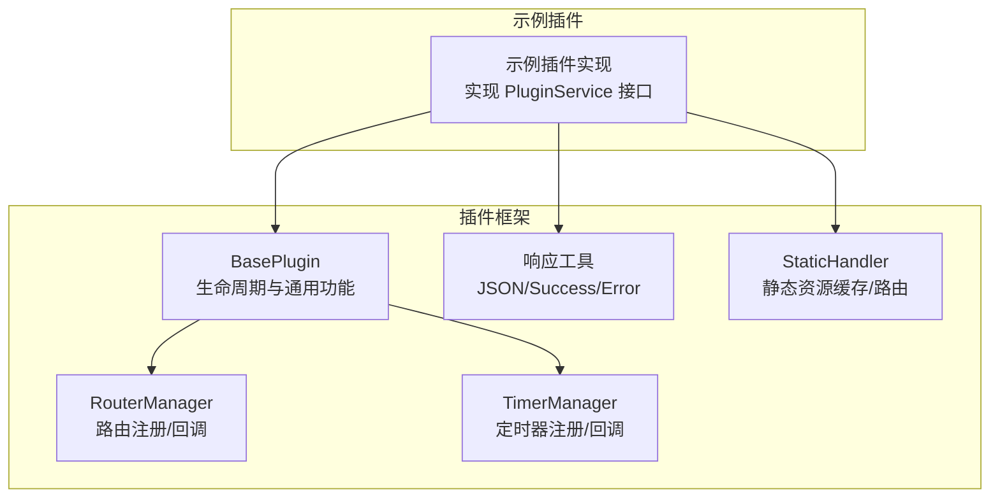
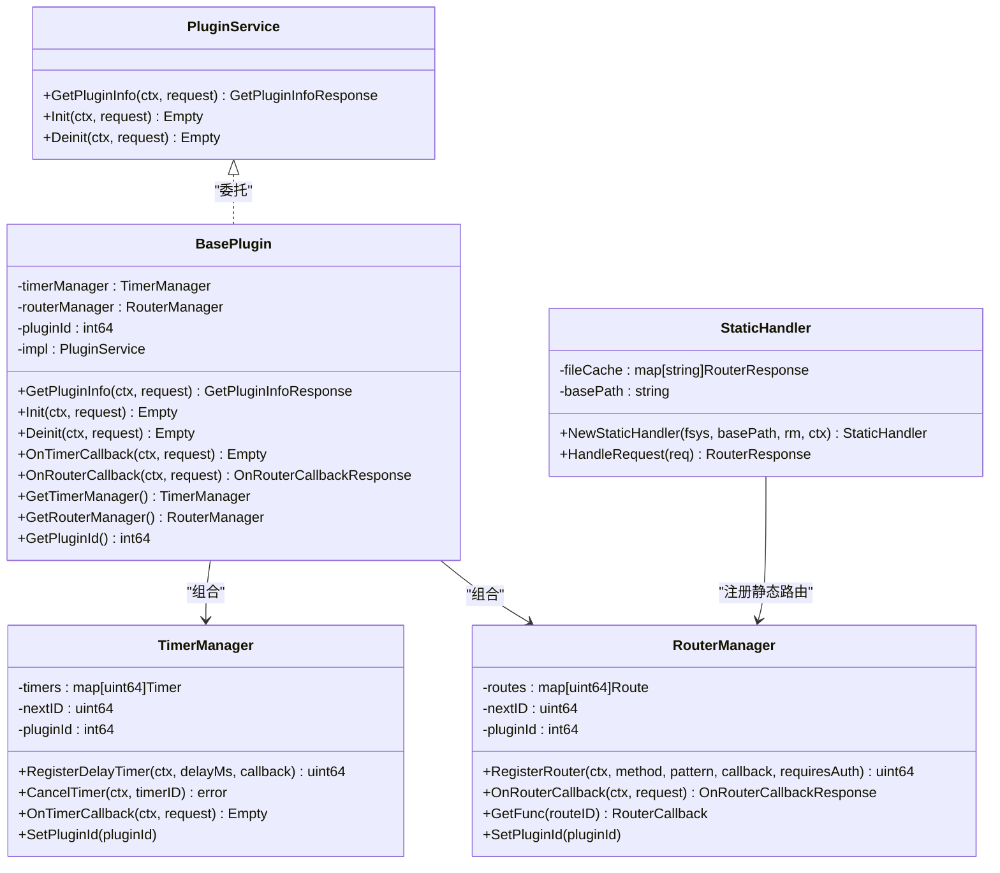
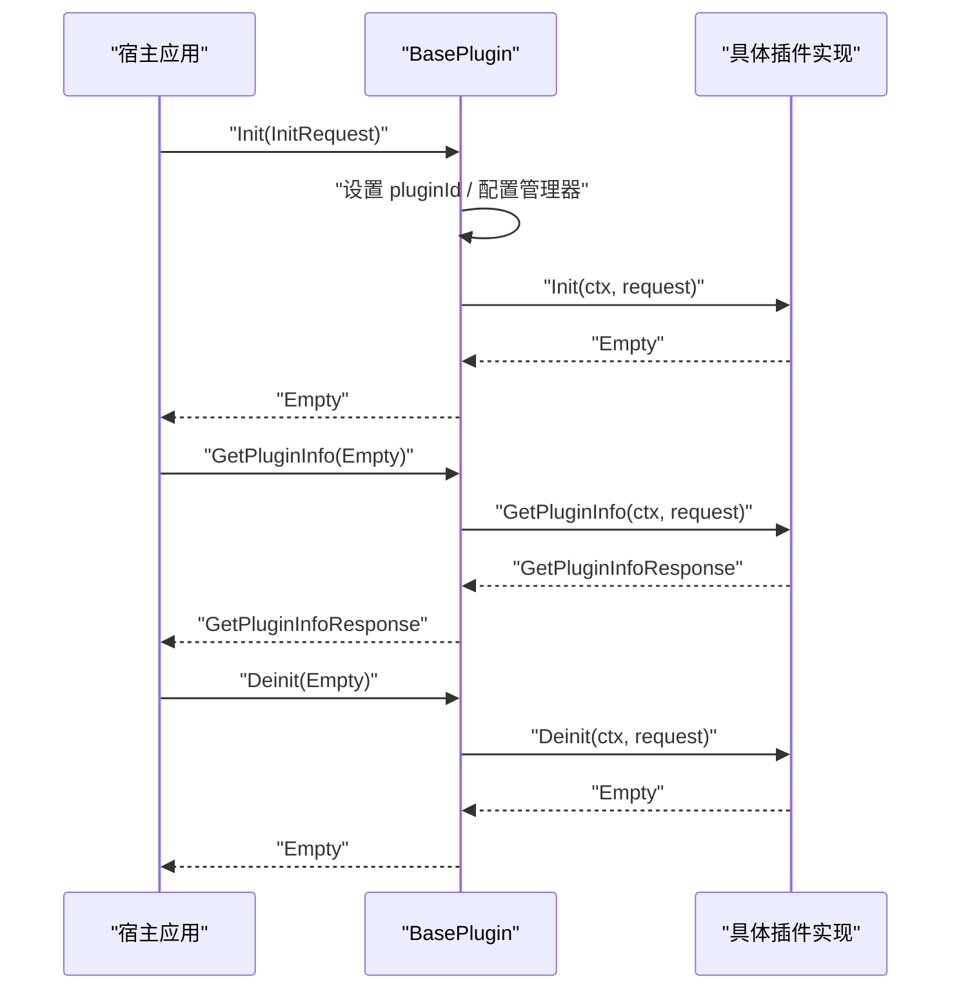
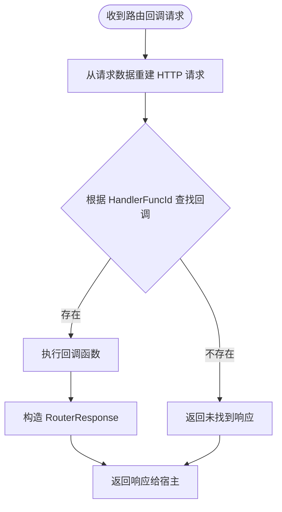
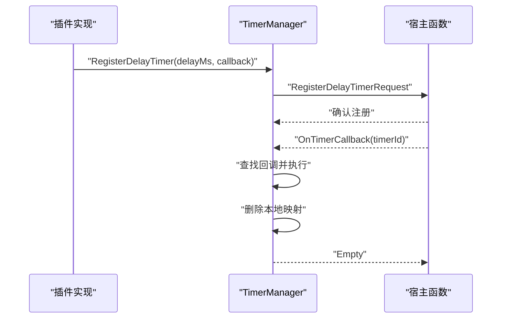
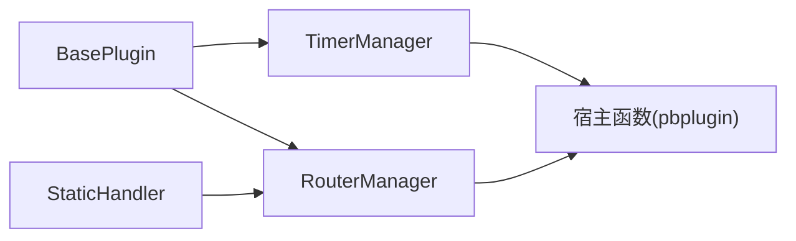

# 示例插件

<cite>
**本文引用的文件**
- [plugin/api/plugin/base.go](file://plugin/api/plugin/base.go)
- [plugin/api/plugin/router.go](file://plugin/api/plugin/router.go)
- [plugin/api/plugin/timer.go](file://plugin/api/plugin/timer.go)
- [plugin/api/plugin/static_handler.go](file://plugin/api/plugin/static_handler.go)
- [plugin/api/plugin/response.go](file://plugin/api/plugin/response.go)
</cite>

## 目录
1. [简介](#简介)
2. [项目结构](#项目结构)
3. [核心组件](#核心组件)
4. [架构总览](#架构总览)
5. [详细组件分析](#详细组件分析)
6. [依赖关系分析](#依赖关系分析)
7. [性能考量](#性能考量)
8. [故障排查指南](#故障排查指南)
9. [结论](#结论)
10. [附录](#附录)

## 简介
本文件面向希望开发基于 WASM 的插件开发者，系统解析 mimusic 插件框架的核心能力与示例插件的实现范式。重点覆盖以下主题：
- 插件基础架构与生命周期：PluginService 接口、BasePlugin 基类、GetPluginInfo/Init/Deinit 的职责与协作。
- 插件注册机制与路由管理：RouterManager 的路由注册、回调派发与静态资源托管。
- WASM 构建约束与插件元数据管理：构建标签、跨平台兼容性与元数据规范。
- HTTP 路由注册与响应封装：RouterResponse、JSONResponse/ErrorResponse/SuccessResponse 的使用。
- 生命周期管理与资源清理：定时器与路由的注册、取消与回调清理策略。

## 项目结构
示例插件位于 plugins/mimusic-plugin-example，其核心实现依赖于 plugin/api/plugin 包提供的通用能力：
- 基础接口与基类：定义插件服务接口与通用基类，负责生命周期调度与通用功能（定时器、路由）。
- 路由管理：提供路由注册、回调派发与静态资源托管能力。
- 定时器管理：提供延迟定时器注册、取消与回调触发。
- 响应封装：提供统一的 JSON 响应构造工具。

图表来源
- [plugin/api/plugin/base.go:35-127](file://plugin/api/plugin/base.go#L35-L127)
- [plugin/api/plugin/router.go:26-129](file://plugin/api/plugin/router.go#L26-L129)
- [plugin/api/plugin/timer.go:17-103](file://plugin/api/plugin/timer.go#L17-L103)
- [plugin/api/plugin/static_handler.go:16-196](file://plugin/api/plugin/static_handler.go#L16-L196)
- [plugin/api/plugin/response.go:10-41](file://plugin/api/plugin/response.go#L10-L41)

章节来源
- [plugin/api/plugin/base.go:17-127](file://plugin/api/plugin/base.go#L17-L127)
- [plugin/api/plugin/router.go:16-129](file://plugin/api/plugin/router.go#L16-L129)
- [plugin/api/plugin/timer.go:14-103](file://plugin/api/plugin/timer.go#L14-L103)
- [plugin/api/plugin/static_handler.go:16-196](file://plugin/api/plugin/static_handler.go#L16-L196)
- [plugin/api/plugin/response.go:10-41](file://plugin/api/plugin/response.go#L10-L41)

## 核心组件
- 插件服务接口 PluginService：定义 GetPluginInfo、Init、Deinit 三类生命周期方法，作为所有插件实现的契约。
- BasePlugin：封装通用能力，持有 TimerManager 与 RouterManager，负责在 Init/Deinit 期间设置插件 ID、调度回调与资源清理。
- RouterManager：维护路由表，支持注册 HTTP 路由、派发回调、与宿主通信完成路由注册。
- TimerManager：维护定时器表，支持注册延迟定时器、取消定时器、派发回调并清理本地映射。
- StaticHandler：预加载静态资源至内存，按路径缓存响应，自动注入鉴权桥接脚本，简化前端集成。
- 响应工具：提供 JSONResponse、ErrorResponse、SuccessResponse 统一输出格式。

章节来源
- [plugin/api/plugin/base.go:17-127](file://plugin/api/plugin/base.go#L17-L127)
- [plugin/api/plugin/router.go:16-129](file://plugin/api/plugin/router.go#L16-L129)
- [plugin/api/plugin/timer.go:14-103](file://plugin/api/plugin/timer.go#L14-L103)
- [plugin/api/plugin/static_handler.go:16-196](file://plugin/api/plugin/static_handler.go#L16-L196)
- [plugin/api/plugin/response.go:10-41](file://plugin/api/plugin/response.go#L10-L41)

## 架构总览
下图展示插件框架如何通过 BasePlugin 协调 RouterManager 与 TimerManager，并与宿主进行路由与定时器注册交互。

图表来源
- [plugin/api/plugin/base.go:17-127](file://plugin/api/plugin/base.go#L17-L127)
- [plugin/api/plugin/router.go:26-129](file://plugin/api/plugin/router.go#L26-L129)
- [plugin/api/plugin/timer.go:17-103](file://plugin/api/plugin/timer.go#L17-L103)
- [plugin/api/plugin/static_handler.go:16-196](file://plugin/api/plugin/static_handler.go#L16-L196)

## 详细组件分析

### 插件生命周期与注册机制
- 接口契约：PluginService 定义 GetPluginInfo/Init/Deinit 三类方法，分别用于元数据查询、初始化与清理。
- 基类实现：BasePlugin 在 Init 时设置 pluginId、配置定时器与路由管理器；在 Deinit 时将清理工作委托给具体实现。
- 注册流程：RegisterPlugin 将具体实现注入 BasePlugin，并通过 pbplugin.RegisterPluginService 完成框架级注册，使宿主可发现该插件。

图表来源
- [plugin/api/plugin/base.go:63-95](file://plugin/api/plugin/base.go#L63-L95)

章节来源
- [plugin/api/plugin/base.go:17-95](file://plugin/api/plugin/base.go#L17-L95)

### 路由管理器与 HTTP 路由注册
- 路由注册：RouterManager.RegisterRouter 支持指定 HTTP 方法、路径模式与回调函数，并可选择是否需要鉴权。注册完成后通过宿主函数向宿主上报路由信息。
- 回调派发：OnRouterCallback 从请求数据重建 HTTP 请求，根据 HandlerFuncId 查找回调并执行，最终将状态码、头与正文封装为响应返回。
- 静态资源：StaticHandler 预加载 static 目录下的所有文件，自动注入鉴权桥接脚本（针对 HTML），并注册 GET 路由以提供静态内容。

图表来源
- [plugin/api/plugin/router.go:91-129](file://plugin/api/plugin/router.go#L91-L129)

章节来源
- [plugin/api/plugin/router.go:53-129](file://plugin/api/plugin/router.go#L53-L129)
- [plugin/api/plugin/static_handler.go:57-150](file://plugin/api/plugin/static_handler.go#L57-L150)

### 定时器管理器与生命周期联动
- 定时器注册：RegisterDelayTimer 支持以毫秒为单位的延迟定时器注册，内部维护定时器映射并通过宿主函数上报。
- 取消与清理：CancelTimer 支持取消已注册定时器，同时在回调触发后清理本地映射，避免重复触发。
- 回调派发：OnTimerCallback 根据 TimerId 获取回调并执行，随后删除本地映射，确保一次性回调行为。

图表来源
- [plugin/api/plugin/timer.go:42-103](file://plugin/api/plugin/timer.go#L42-L103)

章节来源
- [plugin/api/plugin/timer.go:42-103](file://plugin/api/plugin/timer.go#L42-L103)

### 响应封装与错误处理
- JSONResponse：将任意数据序列化为 JSON，并设置标准的 Content-Type 头。
- ErrorResponse/SuccessResponse：提供统一的成功/失败响应结构，便于前端消费。

章节来源
- [plugin/api/plugin/response.go:10-41](file://plugin/api/plugin/response.go#L10-L41)

### WASM 构建配置与元数据管理
- 构建约束：所有插件代码均带有 wasip1 构建标签，确保仅在 WASM 环境编译与运行。
- 元数据管理：GetPluginInfo 用于返回插件名称、版本、描述、作者与主页等信息，作为插件元数据的标准入口。
- 与宿主交互：通过 pbplugin 生成的宿主函数完成路由与定时器的注册与回调派发。

章节来源
- [plugin/api/plugin/base.go:17-33](file://plugin/api/plugin/base.go#L17-L33)
- [plugin/api/plugin/base.go:56-68](file://plugin/api/plugin/base.go#L56-L68)

## 依赖关系分析
- 组件内聚：BasePlugin 将定时器与路由管理解耦为独立模块，降低耦合度并提升可测试性。
- 外部依赖：通过 pbplugin 与宿主进行协议交互；日志使用 log/slog；HTTP 解析依赖 net/http 与 bufio。
- 循环依赖：当前设计未见循环依赖迹象；RouterManager 与 TimerManager 仅通过回调 ID 与宿主交互，不直接相互依赖。

图表来源
- [plugin/api/plugin/base.go:35-127](file://plugin/api/plugin/base.go#L35-L127)
- [plugin/api/plugin/router.go:70-77](file://plugin/api/plugin/router.go#L70-L77)
- [plugin/api/plugin/timer.go:52-57](file://plugin/api/plugin/timer.go#L52-L57)

章节来源
- [plugin/api/plugin/base.go:35-127](file://plugin/api/plugin/base.go#L35-L127)
- [plugin/api/plugin/router.go:70-77](file://plugin/api/plugin/router.go#L70-L77)
- [plugin/api/plugin/timer.go:52-57](file://plugin/api/plugin/timer.go#L52-L57)

## 性能考量
- 静态资源预加载：StaticHandler 在初始化阶段遍历并缓存静态文件，减少运行期 IO，适合频繁访问的前端资源。
- 路由与定时器映射：RouterManager 与 TimerManager 使用 map 存储回调与定时器，查找与删除复杂度为 O(1)，满足高并发场景。
- 日志与错误处理：关键路径记录日志，便于定位问题；错误返回结构统一，有助于前端快速判断失败原因。

## 故障排查指南
- 路由回调未触发：检查路由注册时的 HandlerFuncId 是否正确，以及 OnRouterCallback 是否能从请求数据重建 HTTP 请求。
- 定时器未执行：确认 RegisterDelayTimer 已成功上报至宿主，且 OnTimerCallback 触发后本地映射已被清理。
- 静态资源 404：确认 basePath 与请求路径匹配，以及缓存中是否存在对应键值；HTML 文件是否正确注入鉴权桥接脚本。
- 响应格式异常：使用 JSONResponse/ErrorResponse/SuccessResponse 统一输出，避免手动拼接导致的 Content-Type 不一致。

章节来源
- [plugin/api/plugin/router.go:91-129](file://plugin/api/plugin/router.go#L91-L129)
- [plugin/api/plugin/timer.go:93-103](file://plugin/api/plugin/timer.go#L93-L103)
- [plugin/api/plugin/static_handler.go:152-176](file://plugin/api/plugin/static_handler.go#L152-L176)
- [plugin/api/plugin/response.go:10-41](file://plugin/api/plugin/response.go#L10-L41)

## 结论
示例插件遵循统一的插件接口与基类设计，结合 RouterManager 与 TimerManager 提供了清晰的生命周期管理与通用能力。通过 StaticHandler 与响应工具，开发者可以快速实现静态资源托管与标准化响应输出。建议在实际开发中：
- 明确插件元数据与权限模型，合理使用 requiresAuth 控制路由访问。
- 利用定时器实现周期性任务，注意在 Deinit 中取消未完成的定时器。
- 将静态资源集中管理并预加载，确保首屏加载性能与一致性。

## 附录
- 构建标签：所有插件代码均带有 wasip1 构建标签，确保在 WASM 环境编译。
- 插件 ID：BasePlugin 在 Init 时设置 pluginId，后续定时器与路由均绑定该 ID，便于宿主识别与管理。
- 鉴权桥接：StaticHandler 对 HTML 自动注入鉴权桥接脚本，简化前端从 URL 查询参数读取 access_token 的流程。

章节来源
- [plugin/api/plugin/base.go:56-87](file://plugin/api/plugin/base.go#L56-L87)
- [plugin/api/plugin/static_handler.go:178-196](file://plugin/api/plugin/static_handler.go#L178-L196)