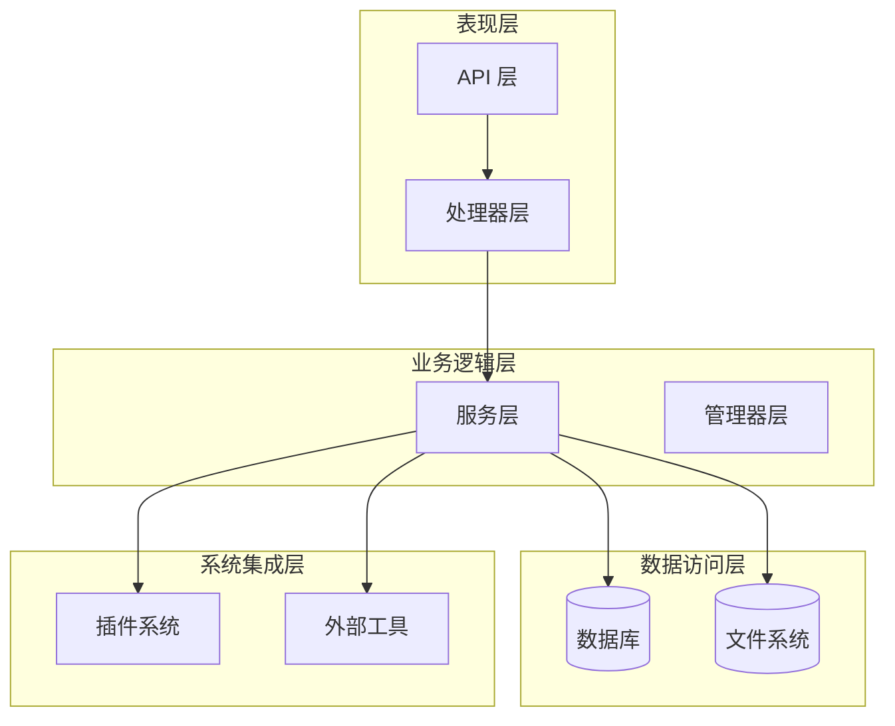
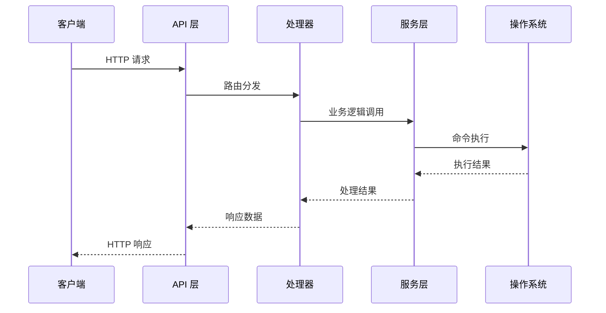
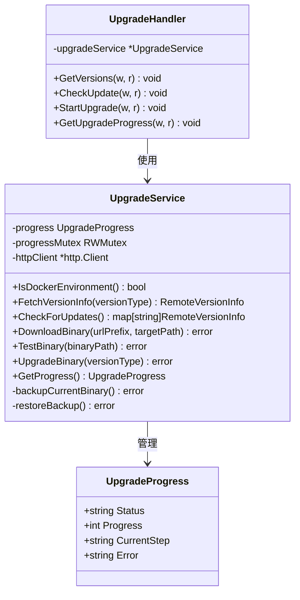
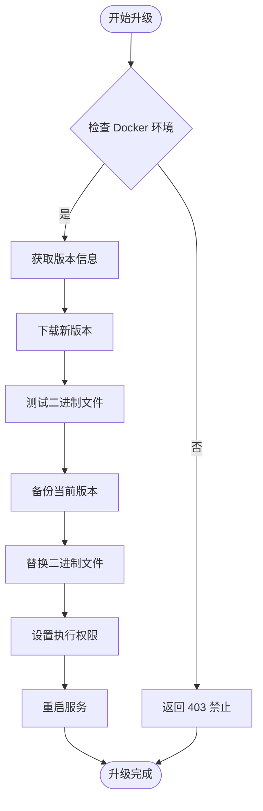
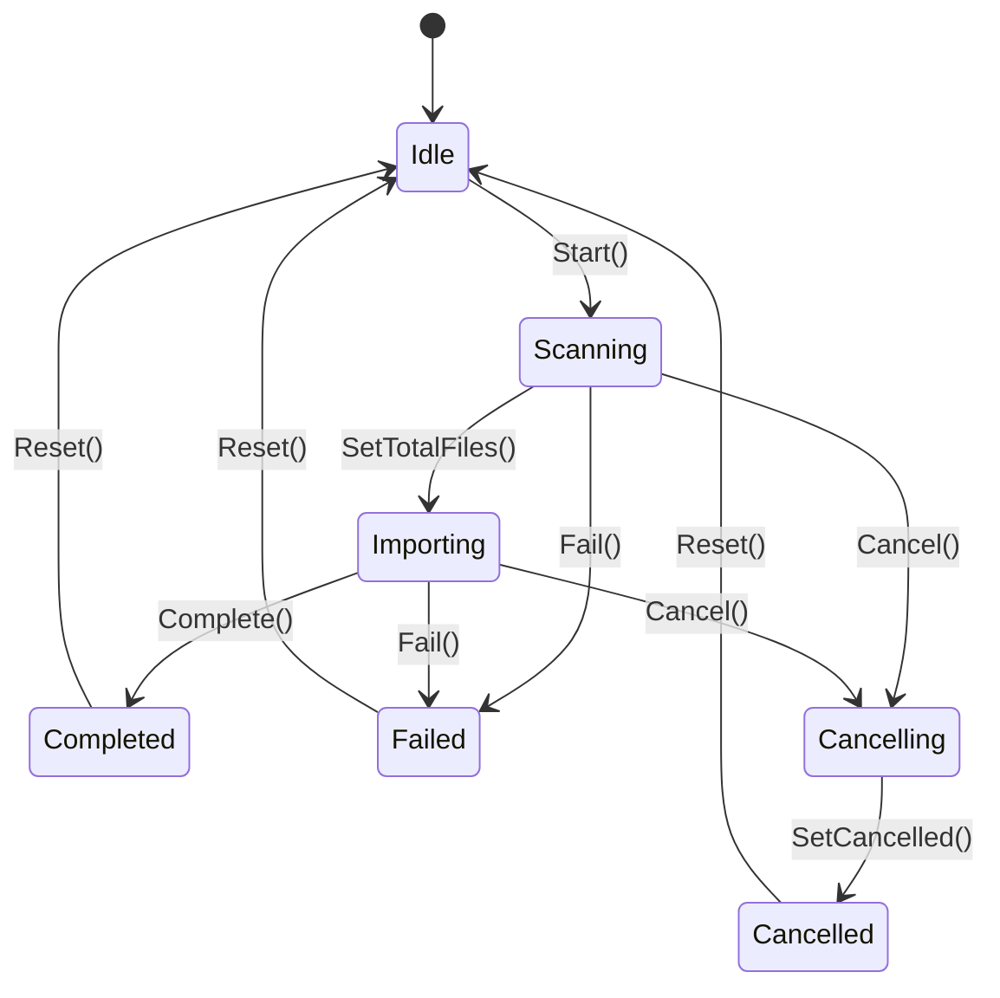
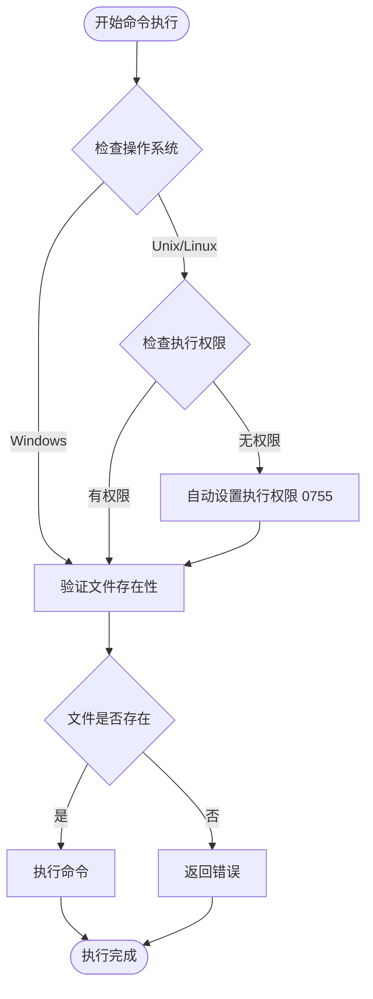
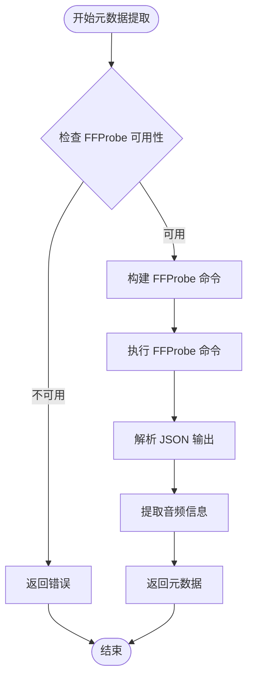
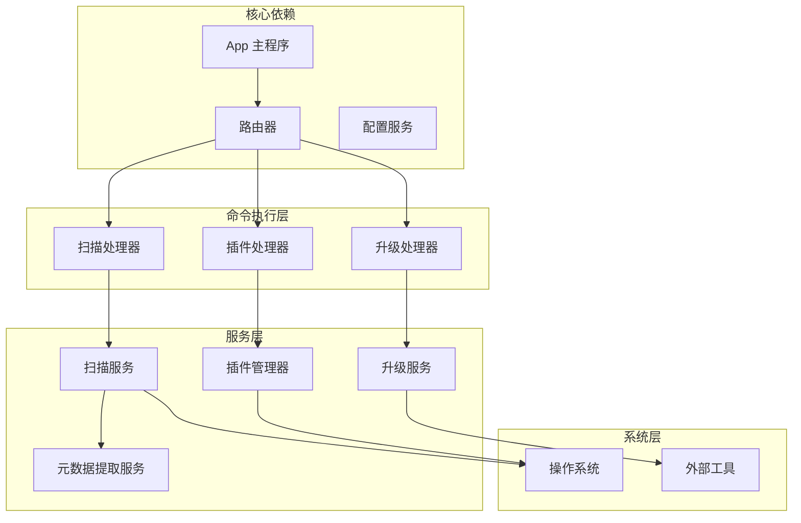

# 命令执行功能

<cite>
**本文档引用的文件**
- [main.go](file://main.go)
- [app.go](file://internal/app/app.go)
- [routers.go](file://internal/app/routers.go)
- [scan.go](file://internal/handlers/scan.go)
- [upgrade.go](file://internal/handlers/upgrade.go)
- [scanner.go](file://internal/services/scanner.go)
- [scan_progress.go](file://internal/services/scan_progress.go)
- [upgrade_service.go](file://internal/services/upgrade_service.go)
- [metadata.go](file://internal/services/metadata.go)
- [host.go](file://internal/plugins/host.go)
- [models.go](file://internal/models/models.go)
- [types.go](file://internal/config/types.go)
- [manager.go](file://internal/plugins/manager.go)
- [plugin.pb.go](file://plugin/api/pbplugin/plugin.pb.go)
- [handlers.go](file://plugins/mimusic-plugin-cloudflared/handlers.go)
</cite>

## 更新摘要
**变更内容**
- 更新了插件命令执行功能的文件权限处理机制
- 新增了自动可执行权限检测和设置功能
- 增强了错误处理和日志记录机制
- 完善了跨平台兼容性处理

## 目录
1. [简介](#简介)
2. [项目结构](#项目结构)
3. [核心组件](#核心组件)
4. [架构概览](#架构概览)
5. [详细组件分析](#详细组件分析)
6. [依赖关系分析](#依赖关系分析)
7. [性能考虑](#性能考虑)
8. [故障排除指南](#故障排除指南)
9. [结论](#结论)

## 简介

本文档深入分析 MiMusic 项目中的命令执行功能。MiMusic 是一个轻量级音乐服务器，提供了丰富的命令执行能力，包括系统升级、音乐扫描、插件命令执行等功能。本文档将详细解释这些功能的实现原理、架构设计和使用方法。

**更新** 本版本重点更新了插件命令执行功能的文件权限处理机制，消除了手动权限管理需求，增强了系统的自动化程度和安全性。

## 项目结构

MiMusic 采用典型的分层架构设计，主要分为以下几个层次：



**图表来源**
- [app.go:27-43](file://internal/app/app.go#L27-L43)
- [routers.go:20-26](file://internal/app/routers.go#L20-L26)

**章节来源**
- [main.go:30-63](file://main.go#L30-L63)
- [app.go:69-244](file://internal/app/app.go#L69-L244)

## 核心组件

MiMusic 的命令执行功能主要通过以下核心组件实现：

### 1. 应用主程序
应用主程序负责初始化整个系统，包括配置解析、服务初始化和路由注册。

### 2. 处理器层
处理器层负责接收 HTTP 请求并调用相应的服务层方法，包括：
- 扫描处理器：处理音乐文件扫描和导入
- 升级处理器：处理系统升级相关操作
- 插件处理器：处理插件相关的命令执行

### 3. 服务层
服务层包含具体的业务逻辑实现：
- 扫描服务：实现音乐文件的递归扫描和导入
- 升级服务：实现系统版本检查和升级流程
- 元数据提取服务：处理音频文件的元数据提取

### 4. 插件系统
插件系统提供了一个强大的扩展机制，允许插件执行外部命令并与宿主系统交互。

**更新** 插件命令执行功能现在具备自动文件权限检测和设置能力，消除了手动权限管理的需求。

**章节来源**
- [app.go:27-43](file://internal/app/app.go#L27-L43)
- [routers.go:28-125](file://internal/app/routers.go#L28-L125)

## 架构概览

MiMusic 的命令执行架构采用了分层设计和事件驱动模式：



**图表来源**
- [routers.go:43-124](file://internal/app/routers.go#L43-L124)
- [scan.go:39-58](file://internal/handlers/scan.go#L39-L58)

## 详细组件分析

### 1. 系统升级功能

系统升级功能是 MiMusic 的核心命令执行特性之一，主要用于在 Docker 环境中进行版本升级。

#### 升级服务架构



**图表来源**
- [upgrade_service.go:29-47](file://internal/services/upgrade_service.go#L29-L47)
- [upgrade.go:13-23](file://internal/handlers/upgrade.go#L13-L23)
- [models.go:277-294](file://internal/models/models.go#L277-L294)

#### 升级流程

系统升级采用异步执行模式，包含以下步骤：

1. **版本检查**：检查当前版本与远程版本的差异
2. **下载新版本**：从 GitHub 下载对应平台的二进制文件
3. **测试新版本**：执行 `-help` 命令验证二进制文件可用性
4. **备份当前版本**：创建当前版本的备份文件
5. **替换二进制文件**：将新版本文件替换到目标位置
6. **权限设置**：设置新版本文件的执行权限
7. **重启服务**：退出当前进程，让 Docker 自动重启容器

#### Docker 环境检测

升级功能仅在 Docker 环境中启用，通过检查环境变量 `IN_DOCKER` 来判断：



**图表来源**
- [upgrade.go:37-41](file://internal/handlers/upgrade.go#L37-L41)
- [upgrade_service.go:186-244](file://internal/services/upgrade_service.go#L186-L244)

**章节来源**
- [upgrade_service.go:18-322](file://internal/services/upgrade_service.go#L18-L322)
- [upgrade.go:1-185](file://internal/handlers/upgrade.go#L1-L185)

### 2. 音乐扫描功能

音乐扫描功能实现了对本地音乐文件的递归扫描和导入，是系统的核心数据处理能力。

#### 扫描器架构

```mermaid
classDiagram
class Scanner {
-config *ScanConfig
+ScanFiles(ctx) []string
-scanDir(ctx, dirPath, visited, files) error
+IsAudioFile(filename) bool
+ShouldExcludeDir(dirPath) bool
+GetFileInfo(filePath) FileInfo
}
class ScanConfig {
+string MusicPath
+[]string ExcludeDirs
+[]string SupportedFormats
}
class ScanProgressManager {
-mu RWMutex
-progress ScanProgress
-cancel chan struct{}
+Start() bool
+SetTotalFiles(total int) void
+UpdateProgress(currentFile, updateType) void
+Complete() void
+Fail(err) void
+Cancel() bool
+GetProgress() ScanProgress
}
class ScanProgress {
+ScanStatus Status
+int TotalFiles
+int ScannedFiles
+int ImportedFiles
+int SkippedFiles
+int FailedFiles
+string CurrentFile
+time.Time StartTime
+time.Time EndTime
+string Error
}
Scanner --> ScanConfig : 使用
ScanProgressManager --> ScanProgress : 管理
```

**图表来源**
- [scanner.go:18-28](file://internal/services/scanner.go#L18-L28)
- [scan_progress.go:44-49](file://internal/services/scan_progress.go#L44-L49)
- [scan_progress.go:30-42](file://internal/services/scan_progress.go#L30-L42)

#### 扫描算法

扫描器采用深度优先搜索算法，支持以下特性：

1. **递归扫描**：遍历指定目录下的所有子目录
2. **软链接支持**：正确处理符号链接，防止循环引用
3. **格式过滤**：根据配置的音频格式列表过滤文件
4. **排除规则**：支持排除特定目录（如临时目录）

#### 扫描进度管理

扫描进度采用线程安全的设计，支持实时查询扫描状态：



**图表来源**
- [scan_progress.go:74-91](file://internal/services/scan_progress.go#L74-L91)
- [scan_progress.go:119-134](file://internal/services/scan_progress.go#L119-L134)
- [scan_progress.go:156-175](file://internal/services/scan_progress.go#L156-L175)

**章节来源**
- [scanner.go:1-177](file://internal/services/scanner.go#L1-L177)
- [scan_progress.go:1-209](file://internal/services/scan_progress.go#L1-L209)

### 3. 插件命令执行功能

插件系统提供了强大的命令执行能力，允许插件在宿主环境中执行外部命令。

#### 插件主机架构

```mermaid
classDiagram
class HostFunctions {
-processes sync.Map
+ExecuteCommand(ctx, req) ExecuteCommandResponse
+StopCommand(ctx, req) StopCommandResponse
+GetCommandOutput(ctx, req) GetCommandOutputResponse
}
class managedProcess {
-cmd *exec.Cmd
-stdout *bytes.Buffer
-stderr *bytes.Buffer
-pluginID string
-done chan struct{}
}
class ExecuteCommandRequest {
+string ExecPath
+[]string Args
+bool Background
+map[string]string Env
+string PluginID
+string ProcessID
}
class ExecuteCommandResponse {
+bool Success
+string Message
+string ProcessID
+string Stdout
+string Stderr
+int ExitCode
}
HostFunctions --> managedProcess : 管理
HostFunctions --> ExecuteCommandRequest : 处理
HostFunctions --> ExecuteCommandResponse : 返回
```

**图表来源**
- [host.go:739-822](file://internal/plugins/host.go#L739-L822)
- [host.go:903-929](file://internal/plugins/host.go#L903-L929)

#### 命令执行模式

插件命令执行支持两种模式：

1. **前台模式**：等待命令执行完成，返回标准输出和错误输出
2. **后台模式**：立即返回，允许插件通过进程 ID 管理命令生命周期

#### 进程管理

系统使用 `sync.Map` 存储管理的进程信息，支持以下操作：

- **进程启动**：创建新的进程并存储进程信息
- **进程停止**：发送终止信号，支持优雅关闭和强制杀死
- **输出获取**：获取后台命令的标准输出和错误输出
- **状态监控**：监控进程的运行状态和退出码

**更新** 新增了自动文件权限检测和设置机制，消除了手动权限管理需求。

#### 文件权限处理机制

**更新** 插件命令执行功能现在具备智能的文件权限处理能力：



**图表来源**
- [host.go:730-739](file://internal/plugins/host.go#L730-L739)

**更新** 自动权限处理功能包括：
- **Unix/Linux 平台**：自动检测文件是否具有执行权限，如无权限则自动设置为 0755
- **Windows 平台**：自动添加 .exe 后缀并验证文件存在性
- **错误处理**：权限设置失败时返回详细错误信息
- **日志记录**：记录权限设置操作和结果

**章节来源**
- [host.go:730-929](file://internal/plugins/host.go#L730-L929)

### 4. 外部工具集成

系统集成了多个外部工具来增强功能：

#### FFProbe 集成



**图表来源**
- [metadata.go:289-306](file://internal/services/metadata.go#L289-L306)

系统使用 FFProbe 工具提取音频文件的详细信息，包括：
- **时长信息**：音频文件的播放时长
- **比特率**：音频文件的编码比特率
- **采样率**：音频文件的采样频率
- **格式信息**：音频文件的编码格式

**章节来源**
- [metadata.go:289-306](file://internal/services/metadata.go#L289-L306)

## 依赖关系分析

MiMusic 的命令执行功能涉及多个组件之间的复杂依赖关系：



**图表来源**
- [app.go:69-244](file://internal/app/app.go#L69-L244)
- [routers.go:28-125](file://internal/app/routers.go#L28-L125)

**章节来源**
- [app.go:69-244](file://internal/app/app.go#L69-L244)
- [routers.go:28-125](file://internal/app/routers.go#L28-L125)

## 性能考虑

### 1. 异步处理
系统广泛采用异步处理模式，特别是在升级和扫描功能中：
- **升级过程**：完全异步执行，不影响 API 响应
- **扫描过程**：扫描和导入分离，支持进度查询
- **插件命令**：支持后台执行，避免阻塞主进程

### 2. 内存管理
- **缓冲区管理**：使用 `bytes.Buffer` 存储命令输出
- **进程池管理**：使用 `sync.Map` 管理进程生命周期
- **文件系统操作**：优化文件扫描算法，避免重复访问

### 3. 并发控制
- **进度锁**：使用 `sync.RWMutex` 保护进度状态
- **上下文取消**：支持扫描和升级的取消操作
- **超时控制**：为外部命令执行设置合理的超时时间

**更新** 新增的权限处理机制具备以下性能特点：
- **懒加载**：仅在需要时检查和设置文件权限
- **缓存机制**：避免重复的文件权限检查
- **异步处理**：权限设置操作不会阻塞主流程

## 故障排除指南

### 1. 升级功能问题

**常见问题及解决方案**：

- **升级失败**：检查 Docker 环境变量 `IN_DOCKER` 是否设置为 `"true"`
- **下载超时**：检查网络连接和 GitHub 访问权限
- **二进制测试失败**：确认新版本二进制文件的可执行权限
- **备份恢复**：系统会在升级失败时自动尝试恢复备份

### 2. 扫描功能问题

**常见问题及解决方案**：

- **扫描无响应**：检查音乐目录权限和磁盘空间
- **文件过滤问题**：确认音频格式配置是否正确
- **软链接循环**：检查目录结构中的循环软链接
- **进度查询失败**：确认扫描服务是否正常运行

### 3. 插件命令执行问题

**常见问题及解决方案**：

- **命令执行失败**：检查命令路径和参数配置
- **进程无法停止**：确认插件 ID 验证和进程权限
- **输出获取失败**：检查进程是否仍在运行
- **环境变量问题**：确认额外环境变量的设置
- **权限设置失败**：检查文件系统权限和磁盘空间

**更新** 新增的权限处理问题排查：
- **权限设置失败**：检查文件系统权限、磁盘空间和文件完整性
- **自动权限检测失效**：确认操作系统支持文件权限检查
- **跨平台兼容性问题**：验证不同操作系统下的权限处理行为

**章节来源**
- [upgrade_service.go:264-304](file://internal/services/upgrade_service.go#L264-L304)
- [scan_progress.go:137-154](file://internal/services/scan_progress.go#L137-L154)
- [host.go:824-901](file://internal/plugins/host.go#L824-L901)

## 结论

MiMusic 的命令执行功能展现了现代 Go 应用程序的最佳实践：

1. **模块化设计**：清晰的分层架构和职责分离
2. **异步处理**：高效的并发处理和用户体验
3. **错误处理**：完善的错误处理和恢复机制
4. **扩展性**：插件系统提供了强大的扩展能力
5. **安全性**：严格的权限控制和输入验证
6. **自动化**：智能的文件权限处理减少了手动管理需求

**更新** 本次更新重点增强了插件命令执行功能的自动化程度，通过智能的文件权限检测和设置机制，消除了手动权限管理的需求，提高了系统的易用性和可靠性。新的权限处理机制支持跨平台兼容，包括 Unix/Linux 和 Windows 系统的不同处理策略，为用户提供了更加无缝的使用体验。

这些功能不仅满足了基本的音乐管理需求，还为未来的功能扩展奠定了坚实的基础。通过合理的设计和实现，MiMusic 成为了一个既实用又可扩展的音乐服务器解决方案。