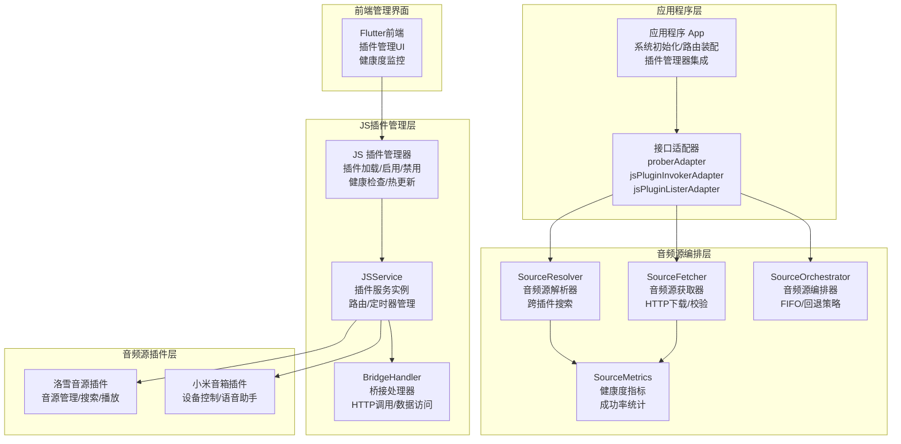
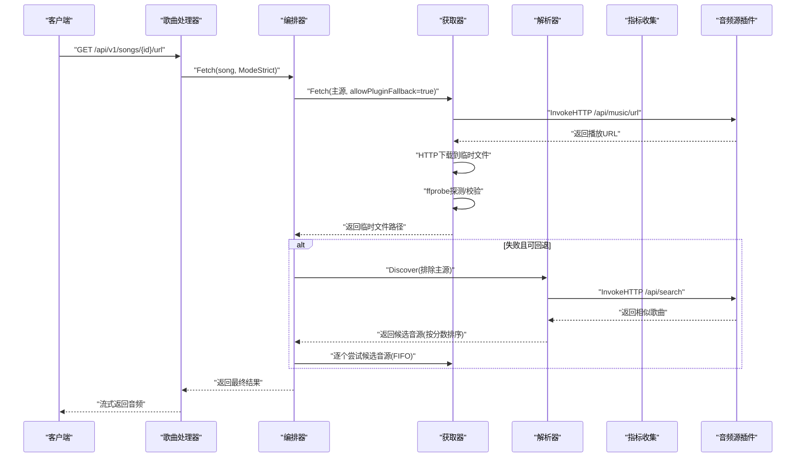
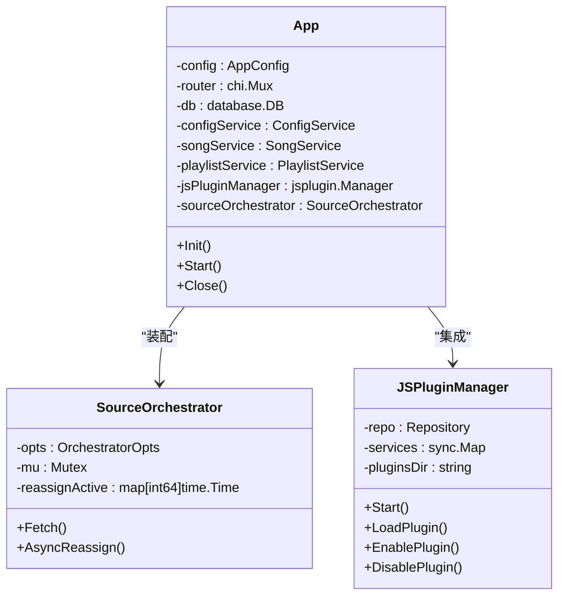
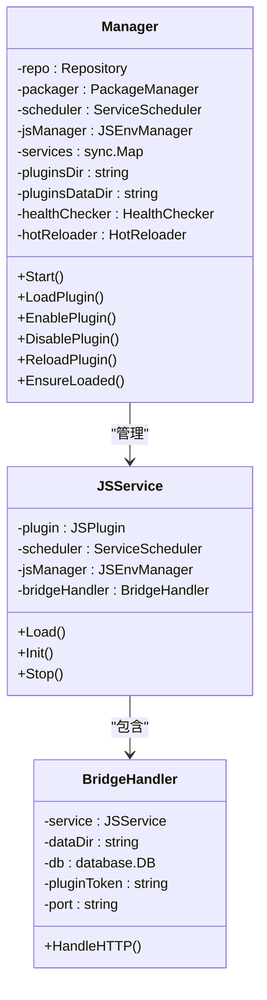
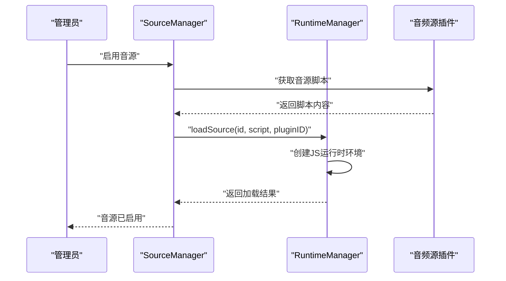
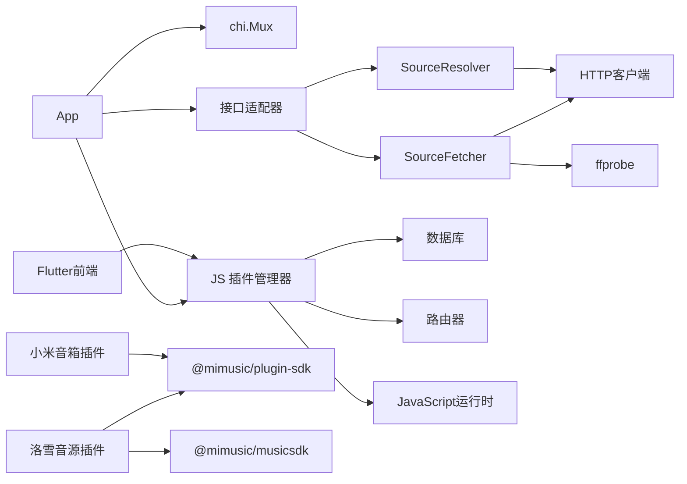

# 插件系统设计

<cite>
**本文档引用的文件**
- [internal/app/app.go](file://internal/app/app.go)
- [internal/app/source_adapters.go](file://internal/app/source_adapters.go)
- [internal/services/source/orchestrator.go](file://internal/services/source/orchestrator.go)
- [internal/services/source/fetcher.go](file://internal/services/source/fetcher.go)
- [internal/services/source/resolver.go](file://internal/services/source/resolver.go)
- [internal/services/source/metrics.go](file://internal/services/source/metrics.go)
- [internal/jsplugin/manager.go](file://internal/jsplugin/manager.go)
- [internal/handlers/music.go](file://internal/handlers/music.go)
- [internal/handlers/playlist.go](file://internal/handlers/playlist.go)
- [jsplugins-src/mimusic-jsplugin-lxmusic/src/main.ts](file://jsplugins-src/mimusic-jsplugin-lxmusic/src/main.ts)
- [jsplugins-src/mimusic-jsplugin-lxmusic/src/engine/manager.ts](file://jsplugins-src/mimusic-jsplugin-lxmusic/src/engine/manager.ts)
- [jsplugins-src/mimusic-jsplugin-lxmusic/src/handlers/source.ts](file://jsplugins-src/mimusic-jsplugin-lxmusic/src/handlers/source.ts)
- [jsplugins-src/mimusic-jsplugin-xiaomi/src/main.ts](file://jsplugins-src/mimusic-jsplugin-xiaomi/src/main.ts)
- [frontend/lib/features/jsplugin/presentation/providers/jsplugin_provider.dart](file://frontend/lib/features/jsplugin/presentation/providers/jsplugin_provider.dart)
- [frontend/lib/features/jsplugin/presentation/widgets/jsplugin_manager.dart](file://frontend/lib/features/jsplugin/presentation/widgets/jsplugin_manager.dart)
- [frontend/lib/features/jsplugin/data/jsplugin_api.dart](file://frontend/lib/features/jsplugin/data/jsplugin_api.dart)
</cite>

## 更新摘要
**所做更改**
- 重大架构变更：原有插件系统已被完全移除，新的音频源编排框架替代了插件功能
- 新的音频源编排框架包含 Fetcher、Resolver、Orchestrator 三层架构
- JS 插件管理器仍然存在，但现在专门用于管理音频源插件
- 音频源插件通过新的编排框架实现音源管理、搜索、播放等功能
- 移除了原有的 WASM 插件系统和相关的 JavaScript 运行时优化

## 目录
1. [简介](#简介)
2. [项目结构](#项目结构)
3. [核心组件](#核心组件)
4. [架构总览](#架构总览)
5. [详细组件分析](#详细组件分析)
6. [音频源编排框架](#音频源编排框架)
7. [JS 插件管理器](#js-插件管理器)
8. [音频源插件示例](#音频源插件示例)
9. [依赖关系分析](#依赖关系分析)
10. [性能考量](#性能考量)
11. [故障排查指南](#故障排查指南)
12. [结论](#结论)
13. [附录](#附录)

## 简介
本设计文档面向 MiMusic 音频源编排系统，系统采用新的三层架构设计，通过 Fetcher、Resolver、Orchestrator 三个核心组件实现音频源的统一管理、搜索和播放。系统经过重大架构变更，原有的插件系统已被完全移除，新的音频源编排框架提供了更高效、更稳定的音频源管理能力。

**重要说明**：本次更新反映了架构的重大变更，原有的插件系统已被新的音频源编排框架完全替代。新的系统专注于音频源管理，通过接口适配器与现有的 JS 插件管理器集成。

文档覆盖以下主题：
- 音频源编排框架的三层架构设计
- Fetcher、Resolver、Orchestrator 的职责分工
- JS 插件管理器的音频源插件支持
- 音频源插件的开发框架和接口定义
- 内置音频源插件示例（洛雪音源插件、小米音箱插件）
- 音频源管理机制（启用/禁用、健康度监控、自动切源）
- 性能优化策略和最佳实践
- 完整开发示例与调试技巧

## 项目结构
MiMusic 音频源编排系统主要由以下层次构成：
- 应用程序层：负责系统初始化、路由注册、服务装配和插件管理器集成
- 音频源编排层：包含 Fetcher、Resolver、Orchestrator 三层架构，负责音频源的统一管理
- JS 插件管理层：管理音频源插件的加载、启用、禁用和生命周期
- 音频源插件层：基于框架实现的音频源插件，包括洛雪音源插件、小米音箱插件等
- 前端管理界面：提供音频源插件的上传、管理、配置和监控功能

**图表来源**
- [internal/app/app.go:228-256](file://internal/app/app.go#L228-L256)
- [internal/app/source_adapters.go:16-46](file://internal/app/source_adapters.go#L16-L46)
- [internal/services/source/fetcher.go:79-95](file://internal/services/source/fetcher.go#L79-L95)
- [internal/services/source/resolver.go:54-87](file://internal/services/source/resolver.go#L54-L87)
- [internal/services/source/orchestrator.go:46-72](file://internal/services/source/orchestrator.go#L46-L72)
- [internal/services/source/metrics.go:104-121](file://internal/services/source/metrics.go#L104-L121)
- [internal/jsplugin/manager.go:32-53](file://internal/jsplugin/manager.go#L32-L53)

## 核心组件
- **应用程序 App**：负责系统初始化、路由装配、服务注册和插件管理器集成
- **接口适配器**：将现有服务适配为音频源编排框架所需的接口
- **SourceFetcher**：负责从音频源插件获取音频文件，包含 HTTP 下载和文件校验
- **SourceResolver**：负责跨插件搜索相似歌曲，提供音源推荐和自动切源
- **SourceOrchestrator**：负责音频源的编排和选择，实现 FIFO 和回退策略
- **SourceMetrics**：负责收集和分析音频源的健康度指标
- **JS 插件管理器**：管理音频源插件的生命周期，提供启用/禁用、健康检查等功能
- **音频源插件**：基于框架实现的音频源插件，提供搜索、播放、音源管理等功能

**章节来源**
- [internal/app/app.go:31-50](file://internal/app/app.go#L31-L50)
- [internal/app/source_adapters.go:16-46](file://internal/app/source_adapters.go#L16-L46)
- [internal/services/source/fetcher.go:79-95](file://internal/services/source/fetcher.go#L79-L95)
- [internal/services/source/resolver.go:54-87](file://internal/services/source/resolver.go#L54-L87)
- [internal/services/source/orchestrator.go:46-72](file://internal/services/source/orchestrator.go#L46-L72)
- [internal/services/source/metrics.go:104-121](file://internal/services/source/metrics.go#L104-L121)
- [internal/jsplugin/manager.go:32-53](file://internal/jsplugin/manager.go#L32-L53)

## 架构总览
下图展示新的音频源编排框架从"音频源获取"到"播放分发"的完整流程，以及与 JS 插件管理器的集成关系。

**图表来源**
- [internal/handlers/music.go:583-652](file://internal/handlers/music.go#L583-L652)
- [internal/services/source/orchestrator.go:88-142](file://internal/services/source/orchestrator.go#L88-L142)
- [internal/services/source/fetcher.go:133-242](file://internal/services/source/fetcher.go#L133-L242)
- [internal/services/source/resolver.go:114-207](file://internal/services/source/resolver.go#L114-L207)

## 详细组件分析

### 应用程序层（App）
- **职责**
  - 系统初始化和配置加载
  - 服务装配和依赖注入
  - 音频源编排框架的集成
  - JS 插件管理器的初始化和启动
- **关键点**
  - 通过接口适配器将现有服务适配为编排框架所需接口
  - 装配 SourceFetcher、SourceResolver、SourceOrchestrator 三层架构
  - 集成 JS 插件管理器，提供音频源插件支持

**图表来源**
- [internal/app/app.go:31-50](file://internal/app/app.go#L31-L50)
- [internal/app/app.go:228-256](file://internal/app/app.go#L228-L256)
- [internal/app/app.go:288-310](file://internal/app/app.go#L288-L310)

**章节来源**
- [internal/app/app.go:75-312](file://internal/app/app.go#L75-L312)
- [internal/app/app.go:228-256](file://internal/app/app.go#L228-L256)
- [internal/app/app.go:288-310](file://internal/app/app.go#L288-L310)

### 接口适配器层
- **职责**
  - 将现有服务适配为音频源编排框架所需的接口
  - 提供探针服务、插件调用器、插件列表器的适配实现
- **关键点**
  - proberAdapter：适配 MetadataExtractor 为 SourceFetcher 的探针接口
  - jsPluginInvokerAdapter：适配 JS 插件管理器为 SourceFetcher 的插件调用接口
  - jsPluginListerAdapter：适配 JS 插件管理器为 SourceResolver 的插件列表接口

**章节来源**
- [internal/app/source_adapters.go:16-46](file://internal/app/source_adapters.go#L16-L46)

### 音频源编排框架

#### SourceFetcher（音频源获取器）
- **职责**
  - 通过插件调用获取音频播放 URL
  - 下载音频文件到临时目录
  - 使用 ffprobe 进行音频文件探测和校验
- **关键点**
  - 支持插件内部自搜（L1 兜底）和严格模式（L2 跨插件回退）
  - 提供详细的错误分类和指标上报
  - 支持 HTTP 超时控制和文件清理

#### SourceResolver（音频源解析器）
- **职责**
  - 跨插件搜索相似歌曲
  - 基于相似度和健康度对候选音源进行评分
  - 提供 LRU 缓存机制避免重复搜索
- **关键点**
  - 并发调用多个活跃插件的搜索接口
  - 使用编辑距离和艺术家相似度算法
  - 支持健康度权重和过滤机制

#### SourceOrchestrator（音频源编排器）
- **职责**
  - 协调 Fetcher 和 Resolver 的工作流程
  - 实现 FIFO 和回退策略
  - 提供异步切源和去重机制
- **关键点**
  - 支持 ModeStrict 和 ModeFallback 两种工作模式
  - 实现候选音源的逐个尝试和间隔控制
  - 提供异步切源的去重和超时控制

**章节来源**
- [internal/services/source/fetcher.go:79-242](file://internal/services/source/fetcher.go#L79-L242)
- [internal/services/source/resolver.go:54-207](file://internal/services/source/resolver.go#L54-L207)
- [internal/services/source/orchestrator.go:46-173](file://internal/services/source/orchestrator.go#L46-L173)

### SourceMetrics（健康度指标）
- **职责**
  - 收集音频源的成功率和失败原因
  - 计算插件健康度分类（绿色/黄色/红色）
  - 提供加权评分机制
- **关键点**
  - 使用环形缓冲区存储最近的执行结果
  - 支持动态阈值配置和样本数量控制
  - 提供插件健康度快照用于管理界面展示

**章节来源**
- [internal/services/source/metrics.go:104-230](file://internal/services/source/metrics.go#L104-L230)

## 音频源编排框架

### FetchMode 工作模式
- **ModeStrict（严格模式）**
  - 仅尝试主源和插件内 L1 自搜
  - 失败立即返回，不进行 L2 跨插件回退
  - 适用于缓存 HTTP 处理器等同步路径
- **ModeFallback（回退模式）**
  - 全链路回退：主源 → L1 → L2
  - 适用于转换后台批量任务等可承受较长耗时的路径
  - 支持候选源间的间隔控制和抖动

### 音频源获取流程
1. **主源尝试**：调用 SourceFetcher.Fetch 获取音频文件
2. **插件内部自搜**：允许插件内部进行 L1 自搜获取更好的音源
3. **文件下载**：HTTP 下载到临时文件，支持超时控制
4. **文件探测**：使用 ffprobe 进行音频信息探测
5. **文件校验**：基于配置进行音频质量校验
6. **结果返回**：返回临时文件路径和音频信息

### 音频源解析流程
1. **候选发现**：调用 SourceResolver.Discover 获取候选音源
2. **并发搜索**：并行调用活跃插件的搜索接口
3. **相似度计算**：基于标题、艺术家、时长计算相似度
4. **健康度加权**：根据插件健康度对分数进行加权
5. **结果排序**：按分数降序排列并截取前 N 个候选

### 音频源编排策略
1. **FIFO 顺序**：按候选音源的顺序依次尝试
2. **间隔控制**：在候选间插入随机间隔防止风控
3. **去重机制**：异步切源的去重和超时控制
4. **回退策略**：失败时自动尝试下一个候选音源

**章节来源**
- [internal/services/source/orchestrator.go:12-44](file://internal/services/source/orchestrator.go#L12-L44)
- [internal/services/source/fetcher.go:118-132](file://internal/services/source/fetcher.go#L118-L132)
- [internal/services/source/resolver.go:110-114](file://internal/services/source/resolver.go#L110-L114)
- [internal/services/source/orchestrator.go:74-142](file://internal/services/source/orchestrator.go#L74-L142)

## JS 插件管理器

### 管理器架构
- **职责**
  - 管理音频源插件的生命周期
  - 提供插件的加载、启用、禁用、重载功能
  - 实现健康检查和热更新监控
  - 提供插件服务的按需懒加载
- **关键点**
  - 使用 singleflight 机制避免并发加载冲突
  - 支持插件数据目录的独立管理
  - 提供插件专用的 JWT Token 生成

**图表来源**
- [internal/jsplugin/manager.go:32-53](file://internal/jsplugin/manager.go#L32-L53)
- [internal/jsplugin/manager.go:158-201](file://internal/jsplugin/manager.go#L158-L201)
- [internal/jsplugin/manager.go:301-308](file://internal/jsplugin/manager.go#L301-L308)

**章节来源**
- [internal/jsplugin/manager.go:32-308](file://internal/jsplugin/manager.go#L32-L308)

### 插件生命周期管理
- **加载流程**
  1. 创建 JSService 实例
  2. 创建并关联 BridgeHandler
  3. 从 ZIP 文件加载插件内容
  4. 在调度器中注册服务
  5. 调用插件的初始化函数
- **启用/禁用**
  - 启用：更新数据库状态为 active 并加载插件
  - 禁用：卸载插件并更新数据库状态为 inactive
- **重载机制**
  - 卸载现有插件
  - 清除字节码缓存
  - 重新加载插件并更新哈希值

### 健康检查和热更新
- **健康检查**
  - 定期检查插件的运行状态
  - 实现指数退避的自愈机制
  - 支持插件错误状态的自动恢复
- **热更新监控**
  - 监控插件文件的修改时间
  - 自动检测并重载更新的插件
  - 支持插件数据目录的独立管理

**章节来源**
- [internal/jsplugin/manager.go:92-129](file://internal/jsplugin/manager.go#L92-L129)
- [internal/jsplugin/manager.go:250-299](file://internal/jsplugin/manager.go#L250-L299)
- [internal/jsplugin/manager.go:310-373](file://internal/jsplugin/manager.go#L310-L373)

## 音频源插件示例

### 洛雪音源插件（mimusic-jsplugin-lxmusic）
- **功能特性**
  - 支持多个音乐平台的音源管理
  - 提供音源的启用/禁用、导入/导出功能
  - 实现音源脚本的动态加载和运行时管理
  - 集成音乐搜索、排行榜、歌单等功能
- **架构设计**
  - SourceManager：管理音源的持久化和配置
  - RuntimeManager：管理音源脚本的运行时环境
  - Registry：注册和管理各个平台的搜索器和歌词获取器
  - 路由处理器：提供 /api/sources、/api/search、/api/music 等接口

**图表来源**
- [jsplugins-src/mimusic-jsplugin-lxmusic/src/handlers/source.ts:598-644](file://jsplugins-src/mimusic-jsplugin-lxmusic/src/handlers/source.ts#L598-L644)
- [jsplugins-src/mimusic-jsplugin-lxmusic/src/engine/manager.ts:28-53](file://jsplugins-src/mimusic-jsplugin-lxmusic/src/engine/manager.ts#L28-L53)

**章节来源**
- [jsplugins-src/mimusic-jsplugin-lxmusic/src/main.ts:49-112](file://jsplugins-src/mimusic-jsplugin-lxmusic/src/main.ts#L49-L112)
- [jsplugins-src/mimusic-jsplugin-lxmusic/src/engine/manager.ts:17-74](file://jsplugins-src/mimusic-jsplugin-lxmusic/src/engine/manager.ts#L17-L74)
- [jsplugins-src/mimusic-jsplugin-lxmusic/src/handlers/source.ts:321-644](file://jsplugins-src/mimusic-jsplugin-lxmusic/src/handlers/source.ts#L321-L644)

### 小米音箱插件（mimusic-jsplugin-xiaomi）
- **功能特性**
  - 多账号管理：支持配置和管理多个小米账号
  - 设备发现与控制：自动发现小爱音箱设备，支持播放控制、音量调节
  - 歌单管理：支持获取歌单列表、播放指定歌单、获取播放状态
  - 语音助手：集成语音命令识别和处理
  - 定时任务：支持定时播放和语音提醒功能
- **架构设计**
  - ConfigManager：管理插件配置和服务器地址
  - AccountManager：管理小米账号的认证和状态
  - MinaService：封装小米云服务 API
  - Scheduler：管理定时任务的执行
  - VoiceEngine：处理语音命令和对话

**章节来源**
- [jsplugins-src/mimusic-jsplugin-xiaomi/src/main.ts:40-126](file://jsplugins-src/mimusic-jsplugin-xiaomi/src/main.ts#L40-L126)

## 依赖关系分析
- **应用程序层依赖**
  - chi 路由器：注册音频源编排框架的路由
  - JS 插件管理器：提供音频源插件的支持
  - 服务层：提供探针、认证、缓存等服务
- **音频源编排框架依赖**
  - 接口适配器：适配现有服务为编排框架所需接口
  - HTTP 客户端：用于音频文件下载和插件调用
  - ffprobe：用于音频文件探测和校验
- **JS 插件管理器依赖**
  - 数据库：存储插件元数据和状态
  - 路由器：注册插件的 HTTP 路由
  - JavaScript 运行时：执行插件代码
- **音频源插件依赖**
  - 插件 SDK：提供统一的插件开发接口
  - 音乐 SDK：提供平台搜索和歌词获取功能
  - 前端 UI：提供插件管理界面

**图表来源**
- [internal/app/app.go:228-256](file://internal/app/app.go#L228-L256)
- [internal/app/source_adapters.go:16-46](file://internal/app/source_adapters.go#L16-L46)
- [internal/services/source/fetcher.go:83-95](file://internal/services/source/fetcher.go#L83-L95)
- [internal/jsplugin/manager.go:56-68](file://internal/jsplugin/manager.go#L56-L68)
- [jsplugins-src/mimusic-jsplugin-lxmusic/src/main.ts:18-40](file://jsplugins-src/mimusic-jsplugin-lxmusic/src/main.ts#L18-L40)

**章节来源**
- [internal/app/app.go:228-256](file://internal/app/app.go#L228-L256)
- [internal/app/source_adapters.go:16-46](file://internal/app/source_adapters.go#L16-L46)
- [internal/jsplugin/manager.go:56-68](file://internal/jsplugin/manager.go#L56-L68)

## 性能考量
- **音频源获取性能**
  - HTTP 超时控制：默认 120 秒，避免长时间阻塞
  - 文件下载优化：支持流式下载和临时文件管理
  - 探测和校验：使用 ffprobe 进行快速音频信息提取
- **跨插件搜索性能**
  - 并发调用：使用 goroutine 并发调用多个插件
  - LRU 缓存：避免重复的跨插件搜索
  - 相似度计算优化：使用编辑距离算法的高效实现
- **编排策略优化**
  - FIFO 顺序：简单的候选选择策略
  - 间隔控制：随机间隔防止风控检测
  - 去重机制：避免异步切源的重复尝试
- **插件管理性能**
  - singleflight 去重：避免并发加载冲突
  - 懒加载机制：按需加载插件服务
  - 健康检查优化：指数退避的自愈机制

## 故障排查指南
- **音频源获取失败**
  - 检查插件是否正常加载和初始化
  - 验证插件的 /api/music/url 接口是否返回有效 URL
  - 检查 HTTP 下载是否超时或网络连接问题
  - 确认 ffprobe 探测是否成功
- **跨插件搜索无结果**
  - 检查插件的 /api/search 接口是否正常
  - 验证插件是否处于活跃状态
  - 检查相似度计算和过滤配置
  - 确认 LRU 缓存是否影响搜索结果
- **编排策略问题**
  - 检查 FetchMode 配置是否正确
  - 验证候选音源的排序和选择逻辑
  - 确认异步切源的去重机制是否正常
  - 检查间隔控制和抖动配置
- **插件管理问题**
  - 检查插件的启用/禁用状态
  - 验证插件的数据目录权限
  - 确认健康检查和热更新功能
  - 检查插件专用的 JWT Token 生成

**章节来源**
- [internal/services/source/fetcher.go:133-242](file://internal/services/source/fetcher.go#L133-L242)
- [internal/services/source/resolver.go:114-207](file://internal/services/source/resolver.go#L114-L207)
- [internal/services/source/orchestrator.go:88-173](file://internal/services/source/orchestrator.go#L88-L173)
- [internal/jsplugin/manager.go:250-373](file://internal/jsplugin/manager.go#L250-L373)

## 结论
MiMusic 音频源编排系统通过新的三层架构设计，提供了高效、稳定、可扩展的音频源管理能力。系统将原有的插件系统重构为专门的音频源编排框架，通过 Fetcher、Resolver、Orchestrator 的明确分工，实现了音频源的统一管理、智能搜索和自动切源。

**重要更新**：本次架构变更标志着 MiMusic 从通用插件系统转向专业的音频源管理平台。新的系统具有以下关键优势：

- **专业化的音频源管理**：专注于音频源的获取、解析和编排，提供更精确的音质控制
- **高效的编排策略**：通过 FIFO 和回退策略，确保音频播放的稳定性和可靠性
- **智能的健康度监控**：基于成功率的健康度分类，自动优化音源选择
- **完善的插件管理**：JS 插件管理器提供完整的插件生命周期管理
- **优秀的性能表现**：并发搜索、LRU 缓存、超时控制等优化措施

这些改进使得 MiMusic 能够更好地处理复杂的音频源场景，为用户提供更优质的音乐播放体验。

## 附录

### 音频源编排最佳实践
- **插件开发最佳实践**
  - 使用统一的插件 SDK 接口
  - 实现健壮的错误处理和超时控制
  - 提供清晰的 API 文档和示例
  - 支持插件的动态加载和热更新
- **编排策略最佳实践**
  - 合理配置 FetchMode 以平衡性能和可靠性
  - 设置合适的超时时间和重试策略
  - 监控插件健康度并及时调整策略
  - 使用 LRU 缓存优化跨插件搜索性能
- **性能监控最佳实践**
  - 定期检查音频源的成功率和响应时间
  - 监控编排器的候选选择和回退情况
  - 分析插件的健康度变化趋势
  - 优化慢查询和高延迟的音源

### 常见问题与解决方案
- **音频源获取失败**
  - 检查插件是否正确实现 /api/music/url 接口
  - 验证网络连接和防火墙设置
  - 确认音频文件格式和质量符合要求
  - 检查 ffprobe 的安装和配置
- **跨插件搜索性能问题**
  - 优化插件的搜索接口实现
  - 调整并发数量和超时时间
  - 清理 LRU 缓存以避免陈旧数据
  - 检查相似度算法的计算复杂度
- **编排策略效果不佳**
  - 调整健康度阈值和权重配置
  - 优化候选音源的选择逻辑
  - 检查异步切源的去重机制
  - 分析用户播放行为数据优化策略

### 完整开发示例与调试技巧
- **开发步骤**
  - 使用插件 SDK 创建音频源插件项目
  - 实现 /api/music/url、/api/search 等核心接口
  - 集成音乐 SDK 提供平台搜索功能
  - 编译插件并部署到 jsplugins 目录
  - 通过启用接口激活插件，观察日志定位问题
- **调试技巧**
  - 启用详细的日志记录，关注编排器的工作流程
  - 使用最小化插件验证核心功能
  - 通过健康度监控分析插件性能
  - 监控音频源的成功率和响应时间
  - 分析用户播放数据优化编排策略

**章节来源**
- [internal/services/source/fetcher.go:133-242](file://internal/services/source/fetcher.go#L133-L242)
- [internal/services/source/resolver.go:114-207](file://internal/services/source/resolver.go#L114-L207)
- [internal/services/source/orchestrator.go:88-173](file://internal/services/source/orchestrator.go#L88-L173)
- [internal/jsplugin/manager.go:92-129](file://internal/jsplugin/manager.go#L92-L129)