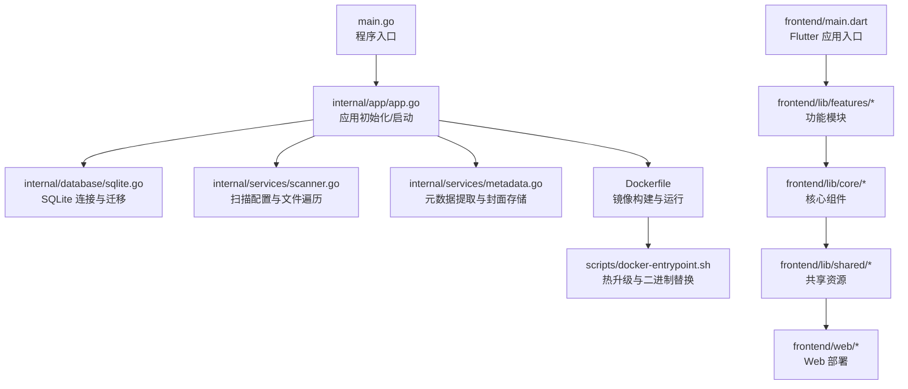
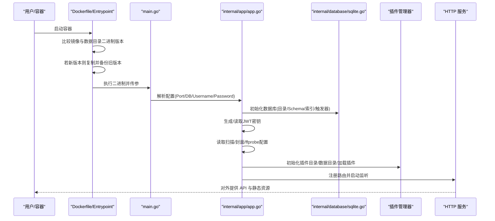
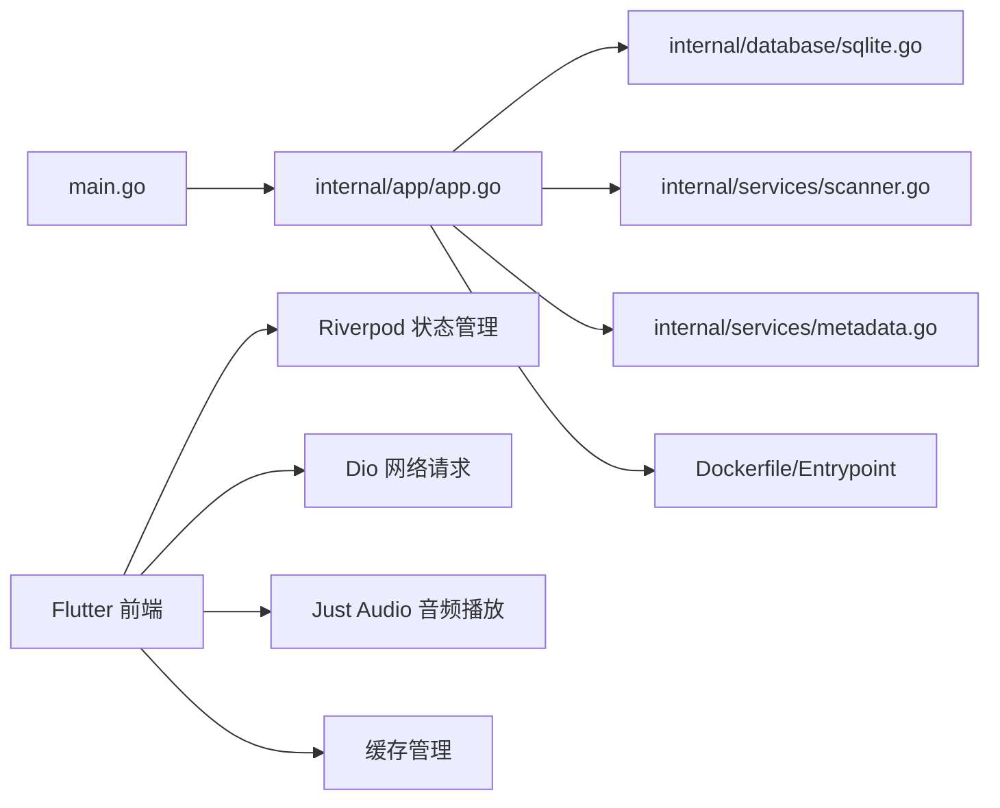

# 常见问题

<cite>
**本文引用的文件**
- [README.md](file://README.md)
- [docs/FAQ.md](file://docs/FAQ.md)
- [main.go](file://main.go)
- [internal/app/app.go](file://internal/app/app.go)
- [internal/config/types.go](file://internal/config/types.go)
- [Dockerfile](file://Dockerfile)
- [scripts/docker-entrypoint.sh](file://scripts/docker-entrypoint.sh)
- [internal/database/schema.go](file://internal/database/schema.go)
- [internal/database/sqlite.go](file://internal/database/sqlite.go)
- [internal/services/scanner.go](file://internal/services/scanner.go)
- [internal/services/metadata.go](file://internal/services/metadata.go)
- [internal/services/auth_service.go](file://internal/services/auth_service.go)
- [frontend/lib/features/auth/data/auth_repository.dart](file://frontend/lib/features/auth/data/auth_repository.dart)
- [frontend/lib/features/settings/presentation/widgets/cache_manager.dart](file://frontend/lib/features/settings/presentation/widgets/cache_manager.dart)
- [frontend/lib/core/storage/lyric_cache_service.dart](file://frontend/lib/core/storage/lyric_cache_service.dart)
- [frontend/lib/features/settings/data/cache_api.dart](file://frontend/lib/features/settings/data/cache_api.dart)
- [frontend/lib/features/playlist/presentation/providers/playlist_provider.dart](file://frontend/lib/features/playlist/presentation/providers/playlist_provider.dart)
- [frontend/lib/features/player/presentation/providers/player_provider.dart](file://frontend/lib/features/player/presentation/providers/player_provider.dart)
- [frontend/Dockerfile](file://frontend/Dockerfile)
- [frontend/BUILD_FRONTEND_GUIDE.md](file://frontend/BUILD_FRONTEND_GUIDE.md)
- [frontend/scripts/build-frontend.sh](file://frontend/scripts/build-frontend.sh)
- [frontend/scripts/docker-build-frontend.sh](file://frontend/scripts/docker-build-frontend.sh)
- [frontend/web/index.html](file://frontend/web/index.html)
- [frontend/pubspec.yaml](file://frontend/pubspec.yaml)
</cite>

## 目录
1. [简介](#简介)
2. [项目结构](#项目结构)
3. [核心组件](#核心组件)
4. [架构总览](#架构总览)
5. [详细组件分析](#详细组件分析)
6. [依赖分析](#依赖分析)
7. [性能考虑](#性能考虑)
8. [故障排查指南](#故障排查指南)
9. [结论](#结论)
10. [附录](#附录)

## 简介
本文件面向 MiMusic 用户与运维人员，提供安装、部署、配置、使用与升级维护的系统性常见问题解答。内容覆盖 Docker 卷挂载与权限、端口与管理员账号配置、音乐播放与扫描功能、版本升级与数据迁移等主题，并给出诊断步骤、操作指令与预防措施，帮助用户快速定位与解决实际问题。

**更新** 新增 Flutter 架构部署、缓存系统使用、批量操作等相关问题解答，涵盖前端构建、缓存清理、批量歌单操作等内容。

## 项目结构
- 后端主程序入口负责解析配置、初始化应用、启动 HTTP 服务与信号处理。
- 应用初始化阶段完成数据库连接、JWT 密钥生成、扫描与元数据配置、插件管理器初始化、路由注册与插件加载。
- Dockerfile 定义了多阶段构建、Alpine 基础镜像、时区设置、暴露端口、默认挂载点与入口脚本。
- 前端通过 Flutter 提供跨平台播放器界面，后端提供 REST API 与静态资源嵌入。
- **新增** 前端采用 Flutter 架构，支持 Web、桌面和移动端多平台部署，内置缓存管理系统和批量操作功能。

**图示来源**
- [main.go:30-63](file://main.go#L30-L63)
- [internal/app/app.go:64-227](file://internal/app/app.go#L64-L227)
- [internal/database/sqlite.go:23-53](file://internal/database/sqlite.go#L23-L53)
- [internal/services/scanner.go:31-48](file://internal/services/scanner.go#L31-L48)
- [internal/services/metadata.go:77-184](file://internal/services/metadata.go#L77-L184)
- [Dockerfile:45-77](file://Dockerfile#L45-L77)
- [scripts/docker-entrypoint.sh:76-114](file://scripts/docker-entrypoint.sh#L76-L114)
- [frontend/main.dart](file://frontend/lib/main.dart)

**章节来源**
- [main.go:30-63](file://main.go#L30-L63)
- [internal/app/app.go:64-227](file://internal/app/app.go#L64-L227)
- [Dockerfile:45-77](file://Dockerfile#L45-L77)
- [frontend/main.dart](file://frontend/lib/main.dart)

## 核心组件
- 配置解析与优先级：命令行参数优先于环境变量；管理员账号与数据库路径、端口均支持两种注入方式。
- 应用初始化：数据库目录与文件准备、JWT 密钥生成、扫描与元数据配置读取、封面存储目录创建、插件目录与数据目录准备、Tracely 监控初始化、路由与插件加载。
- Docker 运行：默认暴露端口、创建音乐与数据挂载目录、设置默认管理员账号、入口脚本实现镜像与数据目录二进制热替换升级。
- **新增** Flutter 前端架构：支持 Web 嵌入式部署、桌面应用打包、移动应用构建，内置缓存管理和批量操作功能。
- **新增** 缓存系统：服务端缓存管理、本地缓存清理、歌词缓存服务，支持多平台差异化缓存策略。

**章节来源**
- [internal/app/app.go:287-352](file://internal/app/app.go#L287-L352)
- [internal/config/types.go:3-9](file://internal/config/types.go#L3-L9)
- [Dockerfile:64-73](file://Dockerfile#L64-L73)
- [scripts/docker-entrypoint.sh:76-114](file://scripts/docker-entrypoint.sh#L76-L114)
- [frontend/lib/features/settings/presentation/widgets/cache_manager.dart:25-34](file://frontend/lib/features/settings/presentation/widgets/cache_manager.dart#L25-L34)

## 架构总览
下图展示从容器启动到服务运行的关键流程，包括配置解析、数据库初始化、JWT 密钥生成、扫描与元数据配置、插件管理、路由与监控初始化，以及 Docker 热升级逻辑。

**图示来源**
- [scripts/docker-entrypoint.sh:66-114](file://scripts/docker-entrypoint.sh#L66-L114)
- [main.go:30-63](file://main.go#L30-L63)
- [internal/app/app.go:64-227](file://internal/app/app.go#L64-L227)
- [internal/database/sqlite.go:23-53](file://internal/database/sqlite.go#L23-L53)

## 详细组件分析

### 安装与部署问题
- Docker 卷挂载与权限
  - 症状：容器内无法访问宿主机音乐文件或数据目录。
  - 诊断：确认挂载路径为绝对路径且容器内具备读取权限；检查 /app/music 与 /app/data 是否正确映射。
  - 操作：使用绝对路径挂载，例如 -v /宿主机音乐目录:/app/music -v /宿主机数据目录:/app/data。
  - 预防：在宿主机确保目录存在且权限允许；容器内默认创建 /app/music 与 /app/data 并赋予执行权限。
  
  **章节来源**
  - [docs/FAQ.md:16-24](file://docs/FAQ.md#L16-L24)
  - [Dockerfile:58-63](file://Dockerfile#L58-L63)

- Docker 热升级与版本不一致
  - 症状：升级镜像后服务未更新或提示版本相同。
  - 诊断：入口脚本比较镜像与数据目录二进制版本，若镜像版本更新则热替换。
  - 操作：确保数据目录挂载持久化；首次启动会复制二进制至数据目录；后续启动自动比较版本并替换。
  - 预防：保持数据卷稳定挂载；升级镜像后重启容器以触发版本比较与替换。
  
  **章节来源**
  - [scripts/docker-entrypoint.sh:66-114](file://scripts/docker-entrypoint.sh#L66-L114)
  - [Dockerfile:69-73](file://Dockerfile#L69-L73)

- 端口占用与监听异常
  - 症状：服务启动失败或端口被占用。
  - 诊断：确认 LISTEN_PORT 或 -port 参数有效；检查宿主机端口占用情况。
  - 操作：切换端口或释放占用端口；通过环境变量或命令行参数调整端口。
  - 预防：统一通过环境变量或命令行参数管理端口，避免冲突。
  
  **章节来源**
  - [internal/app/app.go:191-196](file://internal/app/app.go#L191-L196)
  - [internal/app/app.go:338-344](file://internal/app/app.go#L338-L344)

### 配置与运行问题
- 管理员账号设置
  - 症状：登录失败或提示缺少凭据。
  - 诊断：检查 ADMIN_USERNAME 与 ADMIN_PASSWORD 是否通过命令行或环境变量正确注入。
  - 操作：使用 -username/-password 或 ADMIN_USERNAME/ADMIN_PASSWORD 环境变量设置管理员账号。
  - 预防：在容器启动时明确设置管理员账号，避免空值导致初始化失败。
  
  **章节来源**
  - [internal/app/app.go:317-330](file://internal/app/app.go#L317-L330)
  - [docs/FAQ.md:36-44](file://docs/FAQ.md#L36-L44)

- 数据库路径与权限
  - 症状：数据库初始化失败或无法写入。
  - 诊断：确认 DB_PATH 指向的数据库文件与父目录存在且具备读写权限。
  - 操作：使用 -db 或 DB_PATH 指定数据库路径；确保目录存在并可写。
  - 预防：在启动前预创建数据库目录并授予合适权限。
  
  **章节来源**
  - [internal/app/app.go:69-73](file://internal/app/app.go#L69-L73)
  - [internal/app/app.go:332-336](file://internal/app/app.go#L332-L336)

- 扫描配置与封面存储
  - 症状：扫描不到音乐或封面无法显示。
  - 诊断：检查 music_path、exclude_dirs、supported_formats、cover_storage_path 配置；确认封面存储目录存在。
  - 操作：通过配置管理接口更新扫描与封面路径；确保封面存储目录存在且可写。
  - 预防：默认配置已包含常用扫描参数，可根据需要微调。
  
  **章节来源**
  - [internal/app/app.go:91-144](file://internal/app/app.go#L91-L144)
  - [internal/database/schema.go:140-147](file://internal/database/schema.go#L140-L147)

### 使用问题
- 音乐文件无法播放
  - 症状：播放失败或无声音。
  - 诊断：确认文件格式受支持；检查路径与权限；可选安装 ffprobe 以获取更准确的音频参数。
  - 操作：确保文件位于已配置的音乐目录；为容器挂载绝对路径；如需精确参数可安装 ffprobe。
  - 预防：使用受支持格式；保持目录结构清晰；定期扫描更新。
  
  **章节来源**
  - [docs/FAQ.md:52-59](file://docs/FAQ.md#L52-L59)
  - [internal/services/metadata.go:261-265](file://internal/services/metadata.go#L261-L265)

- 扫描功能异常
  - 症状：扫描长时间卡住或未发现新文件。
  - 诊断：检查扫描目录是否存在、排除目录设置是否合理、支持格式是否包含目标文件。
  - 操作：通过扫描接口触发异步扫描；查看扫描进度；必要时调整扫描配置。
  - 预防：定期触发扫描；避免将大量临时目录加入排除列表。
  
  **章节来源**
  - [internal/services/scanner.go:31-48](file://internal/services/scanner.go#L31-L48)
  - [internal/services/scanner.go:136-151](file://internal/services/scanner.go#L136-L151)

- 认证与 Token 管理
  - 症状：登录失败、Token 过期或无法撤销。
  - 诊断：确认管理员账号正确；检查 JWT 密钥生成与 Token 表状态；使用登出接口撤销会话。
  - 操作：登录获取 access_token；使用刷新接口续期；登出撤销当前会话所有 Token。
  - 预防：定期轮换密码；合理设置 Token 生命周期；使用前端仓库的登出逻辑清理本地 Token。
  
  **章节来源**
  - [internal/services/auth_service.go:212-243](file://internal/services/auth_service.go#L212-L243)
  - [internal/services/auth_service.go:245-261](file://internal/services/auth_service.go#L245-L261)
  - [frontend/lib/features/auth/data/auth_repository.dart:67-76](file://frontend/lib/features/auth/data/auth_repository.dart#L67-L76)

- **新增** 缓存系统使用问题
  - 症状：播放卡顿、加载缓慢或存储空间不足。
  - 诊断：检查服务端缓存大小限制、本地缓存占用情况；确认缓存清理功能正常。
  - 操作：通过设置页面调整缓存大小限制；清理服务端和本地缓存；重启应用生效。
  - 预防：定期清理缓存；根据设备存储情况合理设置缓存上限。
  
  **章节来源**
  - [frontend/lib/features/settings/presentation/widgets/cache_manager.dart:128-203](file://frontend/lib/features/settings/presentation/widgets/cache_manager.dart#L128-L203)
  - [frontend/lib/core/storage/lyric_cache_service.dart:113-130](file://frontend/lib/core/storage/lyric_cache_service.dart#L113-L130)
  - [frontend/lib/features/settings/data/cache_api.dart:49-73](file://frontend/lib/features/settings/data/cache_api.dart#L49-L73)

- **新增** 批量操作问题
  - 症状：批量删除歌单失败、批量移除歌曲无响应。
  - 诊断：检查网络连接、确认批量操作接口可用；查看操作日志。
  - 操作：重新尝试批量操作；检查选中项数量；等待操作完成。
  - 预防：避免同时进行大量批量操作；确保网络稳定。
  
  **章节来源**
  - [frontend/lib/features/playlist/presentation/providers/playlist_provider.dart:239-269](file://frontend/lib/features/playlist/presentation/providers/playlist_provider.dart#L239-L269)

### 升级与维护问题
- 版本升级与数据迁移
  - 症状：升级后功能异常或数据丢失。
  - 诊断：检查数据库迁移与 Schema；确认插件与配置兼容性。
  - 操作：停止服务后替换二进制或更新镜像；如遇异常可删除数据库文件后重启（会丢失用户数据）。
  - 预防：升级前备份数据卷；遵循官方发布说明；使用 Docker 热升级入口脚本。
  
  **章节来源**
  - [docs/FAQ.md:66-74](file://docs/FAQ.md#L66-L74)
  - [scripts/docker-entrypoint.sh:66-114](file://scripts/docker-entrypoint.sh#L66-L114)
  - [internal/database/sqlite.go:48-50](file://internal/database/sqlite.go#L48-L50)

- 验证下载完整性与查看版本
  - 症状：下载文件损坏或版本不匹配。
  - 诊断：使用校验文件验证；通过 API 或命令行查看版本信息。
  - 操作：下载 checksums.txt 并校验；使用 curl 获取版本信息。
  - 预防：始终使用官方渠道下载；升级前核对版本。
  
  **章节来源**
  - [docs/FAQ.md:76-90](file://docs/FAQ.md#L76-L90)
  - [README.md:84-93](file://README.md#L84-L93)

- **新增** Flutter 前端构建问题
  - 症状：构建失败、平台不支持或内存不足。
  - 诊断：检查 Flutter SDK 版本、平台依赖、系统资源；查看构建日志。
  - 操作：升级 Flutter 到推荐版本；安装缺失的平台依赖；增加系统内存。
  - 预防：使用官方推荐的 Flutter 版本；提前准备构建环境。
  
  **章节来源**
  - [frontend/BUILD_FRONTEND_GUIDE.md:228-276](file://frontend/BUILD_FRONTEND_GUIDE.md#L228-L276)
  - [frontend/scripts/build-frontend.sh:64-79](file://frontend/scripts/build-frontend.sh#L64-L79)

### Flutter 架构部署问题
- **新增** Web 嵌入式部署配置
  - 症状：Web 页面无法正常加载或资源路径错误。
  - 诊断：检查 deploy-mode.js 是否正确生成；确认 CanvasKit 配置；验证字体文件存在。
  - 操作：重新构建 Web 嵌入版；检查 index.html 中的部署模式配置；确保字体文件完整。
  - 预防：使用官方构建脚本；定期更新字体资源。
  
  **章节来源**
  - [frontend/scripts/build-frontend.sh:109-163](file://frontend/scripts/build-frontend.sh#L109-L163)
  - [frontend/web/index.html:38-41](file://frontend/web/index.html#L38-L41)

- **新增** 多平台并行构建
  - 症状：构建时间过长或部分平台失败。
  - 诊断：检查 CPU 核心数、内存使用情况；查看各平台日志。
  - 操作：使用并行构建脚本；分批构建减少内存压力；查看失败日志定位问题。
  - 预防：确保足够的系统资源；使用 SSD 提升构建速度。
  
  **章节来源**
  - [frontend/BUILD_FRONTEND_GUIDE.md:57-76](file://frontend/BUILD_FRONTEND_GUIDE.md#L57-L76)
  - [frontend/scripts/build-frontend.sh:419-499](file://frontend/scripts/build-frontend.sh#L419-L499)

## 依赖分析
- 组件耦合与职责
  - main.go 仅负责解析配置与启动应用，职责单一。
  - internal/app/app.go 负责初始化数据库、JWT、扫描与元数据、插件与监控，承担应用生命周期管理。
  - Dockerfile 与入口脚本共同实现镜像与数据目录的热升级与运行时配置。
  - **新增** Flutter 前端通过 Riverpod 进行状态管理，使用 Dio 进行网络请求，集成 Just Audio 进行音频播放。
- 外部依赖
  - SQLite：纯 Go 实现，无需 CGO；通过 DSN 参数优化并发与性能。
  - ffprobe：可选依赖，用于精确音频参数提取。
  - Tracely：前端监控 SDK，用于运行时指标上报。
  - **新增** Flutter 生态：Riverpod、Dio、Just Audio、cached_network_image 等第三方库。

**图示来源**
- [main.go:30-63](file://main.go#L30-L63)
- [internal/app/app.go:64-227](file://internal/app/app.go#L64-L227)
- [internal/database/sqlite.go:23-53](file://internal/database/sqlite.go#L23-L53)
- [Dockerfile:45-77](file://Dockerfile#L45-L77)
- [frontend/pubspec.yaml:11-46](file://frontend/pubspec.yaml#L11-L46)

**章节来源**
- [internal/database/sqlite.go:23-53](file://internal/database/sqlite.go#L23-L53)
- [internal/services/metadata.go:261-265](file://internal/services/metadata.go#L261-L265)
- [frontend/pubspec.yaml:11-46](file://frontend/pubspec.yaml#L11-L46)

## 性能考虑
- 数据库连接池与 WAL 模式：通过 DSN 参数启用 WAL、busy_timeout、synchronous、cache_size 与外键约束，提升并发读写性能与一致性。
- 扫描与元数据提取：扫描器支持软链接与排除目录，避免无效遍历；元数据提取优先使用 tag 库，必要时使用 ffprobe 补充精确参数。
- 插件与监控：插件目录与数据目录分离，便于隔离与维护；Tracely 客户端按配置周期上报心跳。
- **新增** Flutter 前端性能优化：使用 Riverpod 进行细粒度状态管理，避免不必要的重建；音频缓存策略优化播放体验；图片缓存减少网络请求。
- **新增** 缓存系统优化：服务端缓存大小限制防止磁盘占用过多；本地缓存清理功能定期释放空间；歌词缓存支持内存和文件双重缓存。

**章节来源**
- [internal/database/sqlite.go:24-40](file://internal/database/sqlite.go#L24-L40)
- [internal/services/scanner.go:50-114](file://internal/services/scanner.go#L50-L114)
- [internal/services/metadata.go:122-184](file://internal/services/metadata.go#L122-L184)
- [internal/app/app.go:206-217](file://internal/app/app.go#L206-L217)
- [frontend/lib/features/settings/presentation/widgets/cache_manager.dart:14-23](file://frontend/lib/features/settings/presentation/widgets/cache_manager.dart#L14-L23)

## 故障排查指南
- 启动失败
  - 检查配置：确认管理员账号、端口、数据库路径有效。
  - 检查权限：确保数据库目录与封面存储目录存在且可写。
  - 检查依赖：确认 ffprobe 可用（如需精确参数）。
- 认证失败
  - 使用登录接口获取 access_token；若过期使用刷新接口；登出撤销当前会话。
  - 前端登出逻辑会清理本地 Token，即使 API 调用失败也应主动清理。
- 扫描无结果
  - 确认扫描目录存在且未被排除；检查支持格式列表；触发扫描并查看进度。
- 升级后异常
  - 使用入口脚本热升级；如仍异常，删除数据库文件后重启（会丢失用户数据）。
- **新增** 缓存问题排查
  - 检查缓存大小限制是否合理；确认缓存清理功能正常；查看缓存统计信息。
- **新增** Flutter 构建问题排查
  - 检查 Flutter SDK 版本兼容性；确认平台依赖完整；查看构建日志定位错误。
- **新增** 批量操作问题排查
  - 检查网络连接稳定性；确认批量操作接口可用；查看操作返回状态。

**章节来源**
- [internal/app/app.go:317-330](file://internal/app/app.go#L317-L330)
- [internal/services/auth_service.go:212-243](file://internal/services/auth_service.go#L212-L243)
- [frontend/lib/features/auth/data/auth_repository.dart:67-76](file://frontend/lib/features/auth/data/auth_repository.dart#L67-L76)
- [internal/services/scanner.go:31-48](file://internal/services/scanner.go#L31-L48)
- [docs/FAQ.md:66-74](file://docs/FAQ.md#L66-L74)
- [frontend/lib/features/settings/presentation/widgets/cache_manager.dart:128-203](file://frontend/lib/features/settings/presentation/widgets/cache_manager.dart#L128-L203)
- [frontend/BUILD_FRONTEND_GUIDE.md:228-276](file://frontend/BUILD_FRONTEND_GUIDE.md#L228-L276)

## 结论
通过规范的配置注入、合理的目录与权限管理、完善的扫描与元数据提取策略，以及 Docker 热升级机制，MiMusic 能够在多种环境中稳定运行。**新增的 Flutter 架构**提供了更好的跨平台体验，**缓存系统**提升了播放性能，**批量操作**增强了用户体验。建议用户在部署前明确各项配置，定期备份数据，并遵循升级流程，以获得最佳体验。

## 附录
- 快速参考
  - 端口与数据库路径：通过 -port/-db 或 LISTEN_PORT/DB_PATH 环境变量设置。
  - 管理员账号：通过 -username/-password 或 ADMIN_USERNAME/ADMIN_PASSWORD 设置。
  - 扫描与封面：通过配置管理接口更新扫描配置与封面存储路径。
  - 升级：使用 Docker 热升级入口脚本；必要时删除数据库文件后重启。
  - **新增** 缓存管理：通过设置页面调整缓存大小限制；定期清理缓存释放空间。
  - **新增** Flutter 构建：使用并行构建脚本提升效率；确保平台依赖完整。
  - **新增** 批量操作：谨慎进行大量批量操作；确保网络连接稳定。

**章节来源**
- [internal/app/app.go:287-352](file://internal/app/app.go#L287-L352)
- [internal/database/schema.go:140-147](file://internal/database/schema.go#L140-L147)
- [scripts/docker-entrypoint.sh:66-114](file://scripts/docker-entrypoint.sh#L66-L114)
- [frontend/lib/features/settings/presentation/widgets/cache_manager.dart:257-264](file://frontend/lib/features/settings/presentation/widgets/cache_manager.dart#L257-L264)
- [frontend/BUILD_FRONTEND_GUIDE.md:57-76](file://frontend/BUILD_FRONTEND_GUIDE.md#L57-L76)
- [frontend/lib/features/playlist/presentation/providers/playlist_provider.dart:239-269](file://frontend/lib/features/playlist/presentation/providers/playlist_provider.dart#L239-L269)