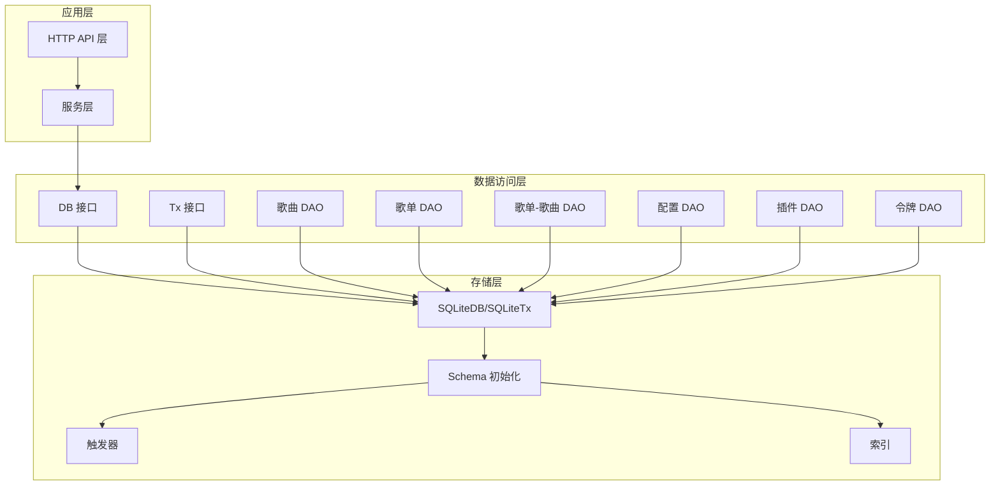
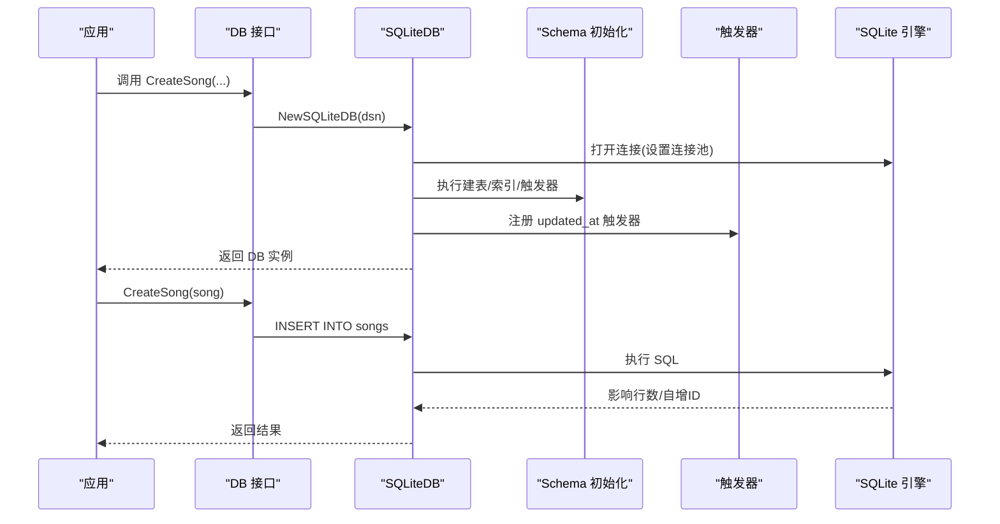
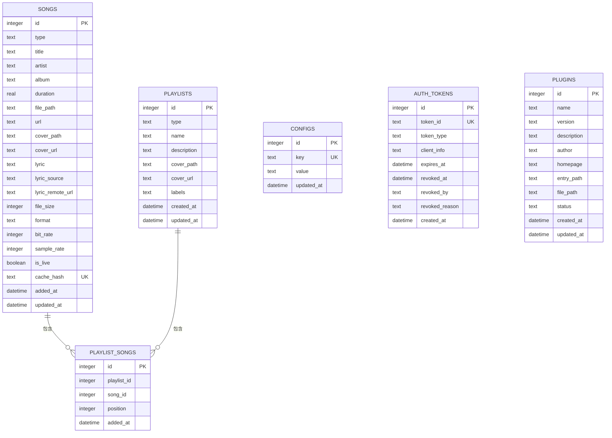
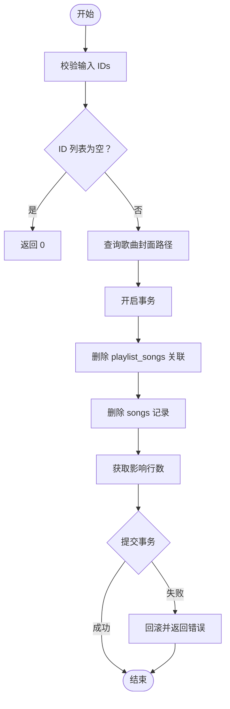
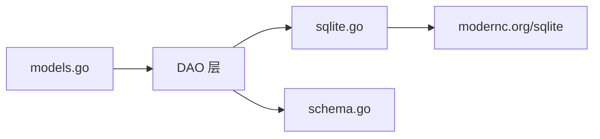

# 数据库模式设计

<cite>
**本文档引用的文件**
- [0001_init.sql](file://internal/database/migrations/0001_init.sql)
- [0002_scan_auto_create_include_subdirs.sql](file://internal/database/migrations/0002_scan_auto_create_include_subdirs.sql)
- [0003_lyric_json_payload.sql](file://internal/database/migrations/0003_lyric_json_payload.sql)
- [models.go](file://internal/models/models.go)
- [lyric.go](file://internal/models/lyric.go)
- [song_repository.go](file://internal/database/song_repository.go)
- [music.go](file://internal/handlers/music.go)
- [lyric_fetcher.go](file://internal/services/lyric_fetcher.go)
</cite>

## 更新摘要
**变更内容**
- 新增 lyric_remote_url 列：引入独立的歌词URL存储列，实现歌词内容与URL的分离
- 歌词JSON标准化：统一 songs.lyric 字段为 LyricPayload JSON 格式，支持多语言歌词存储
- 迁移脚本更新：0003_lyric_json_payload.sql 实现歌词数据的结构化迁移
- 歌词处理机制优化：支持URL延迟加载和JSON格式歌词的智能解析

## 目录
1. [简介](#简介)
2. [项目结构](#项目结构)
3. [核心组件](#核心组件)
4. [架构总览](#架构总览)
5. [详细组件分析](#详细组件分析)
6. [依赖分析](#依赖分析)
7. [性能考虑](#性能考虑)
8. [故障排查指南](#故障排查指南)
9. [结论](#结论)
10. [附录](#附录)

## 简介
本文件系统性梳理 MiMusic 的 SQLite 数据库模式设计，覆盖整体架构、表结构、关系设计、索引策略、约束定义、触发器、实体关系图（ERD）、数据迁移与版本管理、性能优化与查询技巧，以及数据库初始化脚本与变更最佳实践。目标是帮助开发者与运维人员快速理解并高效维护数据库层。

## 项目结构
数据库相关代码主要位于 internal/database 目录，采用"接口 + 具体实现 + 模型"的分层设计：
- 接口层：定义统一的 DB/Tx 接口，屏蔽具体存储实现细节
- 实现层：SQLiteDB/SQLiteTx 提供 SQLite 的具体实现，并负责连接池、DSN 参数、Schema 初始化与迁移
- 模型层：models 包定义业务实体及过滤器结构，用于 DAO 层参数传递与结果封装
- DAO 层：按功能拆分文件，分别处理歌曲、歌单、歌单-歌曲关联、配置、插件、认证令牌等 CRUD 与复杂查询

**图表来源**
- [0001_init.sql:1-191](file://internal/database/migrations/0001_init.sql#L1-L191)
- [0003_lyric_json_payload.sql:1-39](file://internal/database/migrations/0003_lyric_json_payload.sql#L1-L39)

**章节来源**
- [0001_init.sql:1-191](file://internal/database/migrations/0001_init.sql#L1-L191)
- [0003_lyric_json_payload.sql:1-39](file://internal/database/migrations/0003_lyric_json_payload.sql#L1-L39)

## 核心组件
- SQLiteDB/SQLiteTx：封装 SQLite 连接、事务、DSN 参数与 Schema 初始化
- DB/Tx 接口：统一对外能力，包含歌曲、歌单、歌单-歌曲、配置、插件、令牌等 CRUD 与聚合查询
- 模型与过滤器：Song、Playlist、PlaylistSong、Config、Plugin、AuthToken 及对应过滤器结构
- Schema：集中定义建表语句、索引、触发器与初始化数据
- DAO 方法：按表拆分的具体实现，涵盖基础 CRUD、分页、排序、条件过滤、批量操作等

**章节来源**
- [0001_init.sql:1-191](file://internal/database/migrations/0001_init.sql#L1-L191)
- [models.go:64-436](file://internal/models/models.go#L64-L436)
- [song_repository.go:16-455](file://internal/database/song_repository.go#L16-L455)

## 架构总览
数据库层以 SQLite 为核心，通过 DSN 参数启用 WAL 模式、超时重试、缓存与外键约束，确保并发读写与数据一致性。Schema 初始化时一次性创建所有表、索引与触发器，并插入内置歌单与默认配置。DAO 层围绕 DB/Tx 接口提供强类型方法，配合模型与过滤器实现灵活查询与批量操作。

**图表来源**
- [0001_init.sql:1-191](file://internal/database/migrations/0001_init.sql#L1-L191)
- [0003_lyric_json_payload.sql:1-39](file://internal/database/migrations/0003_lyric_json_payload.sql#L1-L39)

## 详细组件分析

### 表结构与字段定义
以下为核心表的字段与数据类型概览（基于建表语句与模型定义）：

- songs
  - id: 整型，主键，自增
  - type: 文本，NOT NULL，CHECK('local' | 'remote' | 'radio')
  - title: 文本，NOT NULL
  - artist/album: 文本
  - duration: 实数，默认 0
  - file_path/url/cover_path/cover_url: 文本
  - lyric/lyric_source/lyric_remote_url: 文本，lyric_source CHECK('file' | 'embedded' | 'scraped' | 'url' | 'cached' | '')
  - file_size/format/bit_rate/sample_rate: 整型，默认 0
  - is_live: 布尔，默认 0
  - cache_hash: 文本，默认 NULL，UNIQUE 约束
  - added_at/updated_at: 时间戳，默认 CURRENT_TIMESTAMP

- playlists
  - id: 整型，主键，自增
  - type: 文本，NOT NULL，CHECK('normal' | 'radio')
  - name: 文本，NOT NULL
  - description: 文本
  - cover_path/cover_url: 文本
  - labels: 文本，默认 '[]'
  - created_at/updated_at: 时间戳，默认 CURRENT_TIMESTAMP

- playlist_songs
  - id: 故障排查指南
  - playlist_id/song_id: 整型，NOT NULL
  - position: 整型，NOT NULL
  - added_at: 时间戳，默认 CURRENT_TIMESTAMP
  - 外键: playlist_id 引用 playlists(id) ON DELETE CASCADE
  - 外键: song_id 引用 songs(id) ON DELETE CASCADE
  - 唯一索引: (playlist_id, song_id)

- configs
  - id: 整型，主键，自增
  - key: 文本，NOT NULL，UNIQUE
  - value: 文本，NOT NULL
  - updated_at: 时间戳，默认 CURRENT_TIMESTAMP

- auth_tokens
  - id: 整型，主键，自增
  - token_id: 文本，NOT NULL，UNIQUE
  - token_type: 文本，NOT NULL，CHECK('access' | 'refresh')
  - client_info: 文本
  - expires_at: 时间戳，NOT NULL
  - revoked_at/revoked_by/revoked_reason: 文本/时间戳
  - created_at: 时间戳，默认 CURRENT_TIMESTAMP

- plugins
  - id: 整型，主键，自增
  - name/version/description/author/homepage/entry_path: 文本
  - file_path: 文本，NOT NULL
  - status: 文本，NOT NULL，CHECK('active' | 'inactive' | 'error')，默认 'inactive'
  - created_at/updated_at: 时间戳，默认 CURRENT_TIMESTAMP

**章节来源**
- [0001_init.sql:3-26](file://internal/database/migrations/0001_init.sql#L3-L26)
- [models.go:64-242](file://internal/models/models.go#L64-L242)

### 表关系设计与外键约束
- songs 与 playlist_songs：一对多，playlist_songs.song_id 外键引用 songs.id，级联删除保证歌曲删除时清理关联
- playlists 与 playlist_songs：一对多，playlist_songs.playlist_id 外键引用 playlists.id，级联删除保证歌单删除时清理关联
- configs：无外键，独立配置表
- auth_tokens：无外键，独立令牌表
- plugins：无外键，独立插件元数据表

**图表来源**
- [0001_init.sql:3-26](file://internal/database/migrations/0001_init.sql#L3-L26)

**章节来源**
- [0001_init.sql:45-54](file://internal/database/migrations/0001_init.sql#L45-L54)

### 索引策略设计
- 单列索引
  - songs: type, title, artist, added_at(倒序), cache_hash
  - playlists: type, labels
  - playlist_songs: playlist_id, (playlist_id, position)
  - configs: key
  - auth_tokens: token_id, token_type, expires_at, revoked_at
  - plugins: status
- 设计原则
  - 选择性高且常用过滤/排序字段建立索引
  - 复合索引优先满足最左前缀匹配，如 playlist_songs 的 (playlist_id, position) 用于按歌单定位并有序读取
  - 对时间字段建立倒序索引以支持"最新优先"场景
  - cache_hash 建立索引以支持基于哈希的快速查找

**章节来源**
- [0001_init.sql:105-124](file://internal/database/migrations/0001_init.sql#L105-L124)

### 约束定义
- NOT NULL：type/title/name/token_id/file_path/status 等关键字段强制非空
- CHECK：type/lyric_source/token_type/status 等枚举字段限定取值范围，歌词源现在包含 'url' 和 'cached' 选项
- UNIQUE：configs.key、auth_tokens.token_id、songs.cache_hash
- 默认值：added_at/updated_at/CURRENT_TIMESTAMP；duration/file_size/bit_rate/sample_rate/is_live 等数值字段默认 0 或布尔 0
- 外键与级联：playlist_songs 的两个外键均设置 ON DELETE CASCADE，确保删除歌单或歌曲时自动清理关联

**章节来源**
- [0001_init.sql:5-26](file://internal/database/migrations/0001_init.sql#L5-L26)

### 触发器设计
- 自动更新 updated_at：对 songs、playlists、configs、plugins 的 UPDATE 操作自动刷新 updated_at 字段，简化业务逻辑
- 设计目的：无需在每个更新方法中手动设置时间戳，降低出错概率并保持一致性

**章节来源**
- [0001_init.sql:127-160](file://internal/database/migrations/0001_init.sql#L127-L160)

### 初始化与内置数据
- 初始化内置歌单：收藏、电台收藏，带 built_in 标签，便于前端识别与管理
- 初始化默认配置：音乐目录、封面存储路径、扫描配置、ffprobe 路径、JWT 密钥等

**章节来源**
- [0001_init.sql:162-178](file://internal/database/migrations/0001_init.sql#L162-L178)

### 数据迁移与版本管理
- Schema 初始化：首次启动时执行 Schema，创建所有表、索引与触发器
- **更新** 0003 歌词JSON迁移：新增 lyric_remote_url 列，实现歌词内容与URL的分离存储
- 迁移策略：使用 json_object 和 json_valid 函数确保迁移的幂等性和数据完整性
- 建议：未来新增字段采用 ALTER TABLE 并忽略重复执行错误；复杂迁移使用事务包裹，失败回滚

**章节来源**
- [0003_lyric_json_payload.sql:1-39](file://internal/database/migrations/0003_lyric_json_payload.sql#L1-L39)

### DAO 层实现要点
- 歌曲（songs）
  - 支持类型过滤、关键词搜索（title/artist/album）、排序与分页
  - **新增** 支持基于 cache_hash 的去重插入和更新，使用 ON CONFLICT 子句
  - **新增** 支持基于 cache_hash 的精确查询和时长更新
  - **新增** 支持 lyric_remote_url 列的独立更新和查询
  - 批量删除歌曲时，先查询封面路径，再在事务中删除 playlist_songs 关联与歌曲记录
- 歌单（playlists）
  - 支持标签 JSON 过滤（EXISTS + json_each）、关键词搜索、排序与分页
  - 自动创建歌单：按目录结构批量生成歌单并插入 playlist_songs，使用预编译语句与事务提升性能
- 歌单-歌曲（playlist_songs）
  - 提供添加、移除、分页查询、统计与位置更新
- 配置（configs）
  - 使用 UPSERT（ON CONFLICT）实现键值对更新
- 插件（plugins）
  - 支持状态更新、按创建时间倒序查询
- 令牌（auth_tokens）
  - 支持撤销、过期清理、活跃令牌查询与失效检查

**章节来源**
- [song_repository.go:16-455](file://internal/database/song_repository.go#L16-L455)

### 查询流程示例（批量删除歌曲）

**图表来源**
- [song_repository.go:259-277](file://internal/database/song_repository.go#L259-L277)

### 歌词存储格式标准化
**新增** MiMusic 现在采用统一的 LyricPayload JSON 格式存储歌词：

- 歌词JSON格式
  - LyricPayload 结构：包含 lyric、tlyric、rlyric、lxlyric 四个字段
  - 空payload序列化：返回空字符串而非 "{}"，保持 SQL 判空逻辑一致性
  - 兼容性处理：支持历史裸 LRC 文本的自动转换

- URL歌词处理机制
  - lyric_remote_url 列专门存储歌词URL，与 lyric 列内容分离
  - lyric_source = 'url' 时，LyricRemoteURL 字段非空，Lyric 字段为空
  - 运行时通过 LyricFetcher 按需拉取歌词内容

- 迁移策略
  - URL来源：将原有 lyric 列中的URL移动到 lyric_remote_url，原列清空
  - 其他来源：使用 json_object 包装裸 LRC 文本为标准 LyricPayload JSON
  - 幂等保护：使用 json_valid 守卫避免重复包装已存在的JSON格式

**章节来源**
- [0003_lyric_json_payload.sql:3-21](file://internal/database/migrations/0003_lyric_json_payload.sql#L3-L21)
- [lyric.go:8-79](file://internal/models/lyric.go#L8-L79)
- [models.go:65-91](file://internal/models/models.go#L65-L91)

### 歌词获取与处理流程
**新增** 歌词获取的完整处理流程：

- 歌词来源分类
  - URL来源：通过 LyricFetcher 按需拉取，运行时转换为 LyricPayload
  - 本地来源：直接从 lyric 列解析 LyricPayload JSON
  - 缓存来源：歌词内容已标准化存储，直接返回

- API响应格式
  - 统一返回 LyricPayload JSON：{"lyric": "...", "tlyric": "...", "rlyric": "...", "lxlyric": "..."}
  - 支持多语言歌词：主歌词、翻译、罗马音、逐字歌词
  - 空歌词处理：payload 为空时返回 404 Not Found

- 处理逻辑
  - lyric_source = 'url'：调用 LyricFetcher 从 lyric_remote_url 获取歌词
  - 其他来源：直接解析 lyric 列的 JSON 格式
  - 兼容性：支持历史数据格式的自动转换

**章节来源**
- [music.go:707-774](file://internal/handlers/music.go#L707-L774)
- [lyric_fetcher.go:14-31](file://internal/services/lyric_fetcher.go#L14-L31)

## 依赖分析
- 组件耦合
  - DAO 层依赖 models 包的结构与过滤器
  - SQLiteDB 依赖 modernc.org/sqlite 驱动与内部 Schema
  - DB/Tx 接口解耦上层调用与具体实现
- 外部依赖
  - SQLite 驱动：modernc.org/sqlite
  - DSN 参数：WAL、busy_timeout、synchronous、cache_size、foreign_keys
- 潜在风险
  - SQLite 不支持部分 ALTER 语法，迁移需谨慎
  - 大批量插入建议使用事务与预编译语句

**图表来源**
- [models.go:64-436](file://internal/models/models.go#L64-L436)
- [0001_init.sql:1-191](file://internal/database/migrations/0001_init.sql#L1-L191)

**章节来源**
- [models.go:64-436](file://internal/models/models.go#L64-L436)
- [0001_init.sql:1-191](file://internal/database/migrations/0001_init.sql#L1-L191)

## 性能考虑
- 连接池与 DSN 优化
  - WAL 模式提升并发读性能
  - busy_timeout 减少 SQLITE_BUSY
  - synchronous=NORMAL 在 WAL 下已足够安全
  - cache_size=10000 降低磁盘 IO
  - foreign_keys=ON 保障一致性
- 索引策略
  - 为高频过滤/排序字段建立索引
  - 复合索引遵循最左前缀原则
  - **新增** cache_hash 建立索引以支持基于哈希的快速查找
  - **新增** lyric_remote_url 列支持独立的URL查询优化
- 批量操作
  - 使用事务包裹批量插入/删除
  - 预编译语句减少解析开销
  - 分批处理（如 playlist_songs 批量插入分片）
- **新增** 缓存优化
  - 基于 cache_hash 的去重插入减少重复数据
  - URL模式歌词的延迟加载机制减少不必要的网络请求
  - LyricPayload JSON格式减少解析开销

**章节来源**
- [0001_init.sql:105-124](file://internal/database/migrations/0001_init.sql#L105-L124)
- [song_repository.go:279-307](file://internal/database/song_repository.go#L279-L307)

## 故障排查指南
- 常见错误与定位
  - 记录不存在：GetXXXByID 返回"not found"，检查主键是否存在
  - 更新/删除未命中：RowsAffected 为 0，确认 ID 与过滤条件
  - 重复键冲突：UNIQUE 冲突（如 token_id/key/cache_hash），检查唯一性
  - 外键约束失败：尝试删除父表记录导致子表存在关联，先清理关联或使用级联删除
  - **新增** 歌词格式错误：Lyric 字段不是有效的 JSON 格式，检查迁移是否完成
  - **新增** URL歌词获取失败：LyricFetcher 无法从 lyric_remote_url 获取歌词
- 事务问题
  - 事务未提交即退出：确保显式 Commit/Rollback
  - 事务内查询异常：捕获错误并主动回滚
- 测试验证
  - 单元测试覆盖：创建/读取/更新/删除/分页/排序/级联删除/事务回滚等场景
  - **新增** 歌词迁移测试：验证 lyric_remote_url 列的正确迁移
  - **新增** 歌词格式兼容测试：验证 LyricPayload JSON 的解析和序列化

**章节来源**
- [song_repository.go:259-277](file://internal/database/song_repository.go#L259-L277)
- [music.go:744-774](file://internal/handlers/music.go#L744-L774)

## 结论
MiMusic 的数据库层以清晰的接口抽象、完善的约束与索引策略、合理的触发器与迁移机制，构建了稳定高效的本地音乐管理能力。通过事务与批量优化、WAL 并发与连接池配置，兼顾了易用性与性能。**新增的歌词JSON标准化和URL分离存储机制**进一步增强了系统的灵活性和性能表现。建议在后续演进中持续关注查询模式与热点字段，动态调整索引与分区策略，并将复杂迁移纳入自动化流程。

## 附录

### 数据库初始化脚本（摘要）
- 执行顺序
  1) 创建表（songs/playlists/playlist_songs/configs/auth_tokens/plugins）
  2) 创建索引（单列/复合）
  3) 创建触发器（updated_at）
  4) 插入内置歌单与默认配置
- **更新** 运行时迁移：移除了 playlists 表 cover_path 字段的运行时迁移，因为该字段已在 Schema 中定义
- **新增** 歌词迁移：执行 0003_lyric_json_payload.sql 脚本，标准化歌词存储格式

**章节来源**
- [0001_init.sql:1-191](file://internal/database/migrations/0001_init.sql#L1-L191)
- [0003_lyric_json_payload.sql:1-39](file://internal/database/migrations/0003_lyric_json_payload.sql#L1-L39)

### 数据结构变更最佳实践
- 新增字段
  - 使用 ALTER TABLE，忽略重复执行错误
  - 如需默认值，明确 DEFAULT
- 删除字段
  - SQLite 不支持直接 DROP COLUMN，建议迁移至新表后替换
- 修改约束
  - 遵循 SQLite 限制，必要时重建表
- 索引变更
  - 大表变更建议在低峰期执行，或使用在线 DDL 工具（如 SQLite 的扩展）
- 版本管理
  - 将迁移脚本纳入版本控制，记录变更原因与影响范围
  - 为每次重大变更打标签或版本号，便于回滚与追踪
- **新增** 歌词存储最佳实践
  - lyric_remote_url 列专门存储URL，避免与歌词内容混合
  - 使用 json_object 和 json_valid 确保迁移的幂等性
  - LyricPayload JSON 格式支持多语言歌词的统一处理

### 查询优化技巧
- 使用 EXIST + json_each 查询 JSON 数组字段（如 playlists.labels）
- 复合索引优先满足最左前缀（如 playlist_songs: (playlist_id, position)）
- 分页查询使用 LIMIT/OFFSET，结合 ORDER BY 索引字段
- 批量插入使用预编译语句与事务，分批提交（如 500 条一批）
- **新增** 基于哈希的快速查找
  - 使用 cache_hash 索引进行精确查询
  - 通过 ON CONFLICT 子句实现智能去重插入
  - 利用 UNIQUE 约束避免重复数据
- **新增** 歌词查询优化
  - lyric_remote_url 列支持独立的URL查询
  - LyricPayload JSON 格式减少解析开销
  - URL歌词的延迟加载避免不必要的网络请求

**章节来源**
- [0001_init.sql:105-124](file://internal/database/migrations/0001_init.sql#L105-L124)
- [song_repository.go:325-336](file://internal/database/song_repository.go#L325-L336)
- [music.go:728-774](file://internal/handlers/music.go#L728-L774)