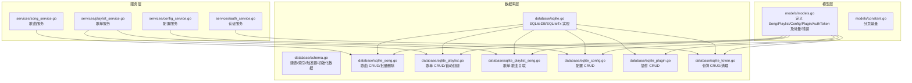
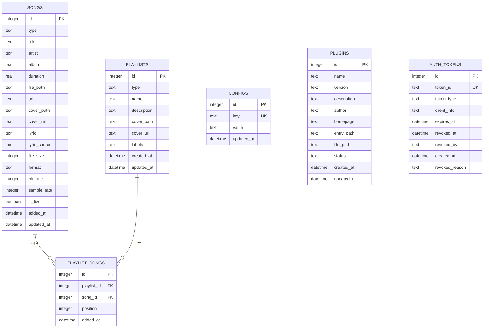
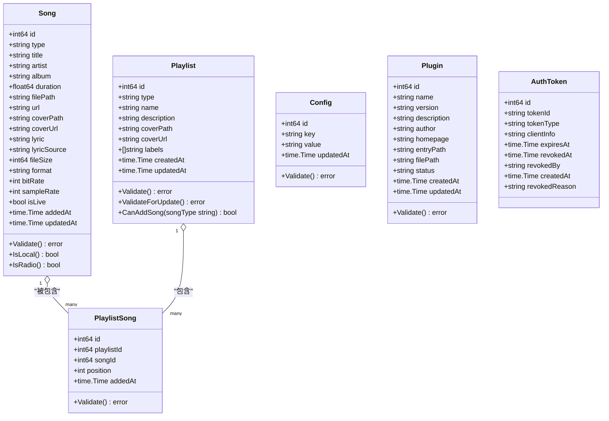
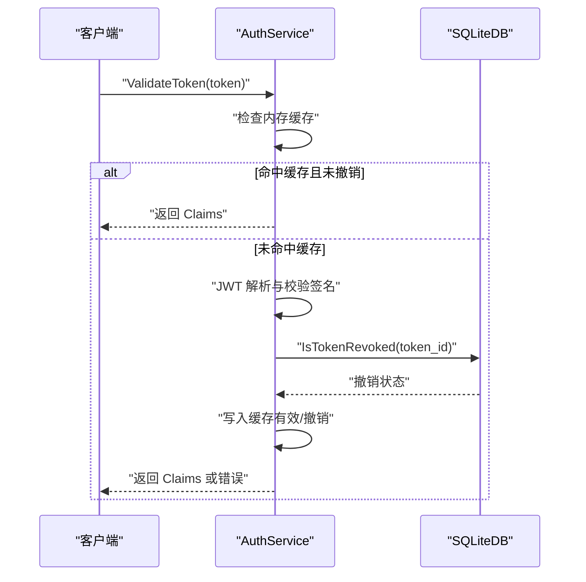

# 数据模型设计

<cite>
**本文档引用的文件**
- [internal/models/models.go](file://internal/models/models.go)
- [internal/models/constant.go](file://internal/models/constant.go)
- [internal/database/schema.go](file://internal/database/schema.go)
- [internal/database/sqlite.go](file://internal/database/sqlite.go)
- [internal/database/sqlite_song.go](file://internal/database/sqlite_song.go)
- [internal/database/sqlite_playlist.go](file://internal/database/sqlite_playlist.go)
- [internal/database/sqlite_playlist_song.go](file://internal/database/sqlite_playlist_song.go)
- [internal/database/sqlite_config.go](file://internal/database/sqlite_config.go)
- [internal/database/sqlite_plugin.go](file://internal/database/sqlite_plugin.go)
- [internal/database/sqlite_token.go](file://internal/database/sqlite_token.go)
- [internal/services/song_service.go](file://internal/services/song_service.go)
- [internal/services/playlist_service.go](file://internal/services/playlist_service.go)
- [internal/services/config_service.go](file://internal/services/config_service.go)
- [internal/services/auth_service.go](file://internal/services/auth_service.go)
</cite>

## 目录
1. [简介](#简介)
2. [项目结构](#项目结构)
3. [核心组件](#核心组件)
4. [架构概览](#架构概览)
5. [详细组件分析](#详细组件分析)
6. [依赖分析](#依赖分析)
7. [性能考虑](#性能考虑)
8. [故障排除指南](#故障排除指南)
9. [结论](#结论)
10. [附录](#附录)

## 简介
本文件系统性梳理 MiMusic 的数据模型设计，聚焦以下核心模型：
- Song（歌曲/电台）
- Playlist（歌单）
- Config（配置）
- Plugin（插件）
- AuthToken（认证令牌）

文档涵盖字段定义、数据类型与业务含义，数据库模式设计（表关系、索引、约束、触发器），数据验证与业务规则，数据访问模式、缓存策略与性能考量，以及数据生命周期与迁移策略。

## 项目结构
MiMusic 的数据层采用分层架构：
- 模型层：定义领域对象与常量、错误
- 数据库层：负责建模、迁移、SQL 访问与事务
- 服务层：封装业务逻辑、缓存与流程编排

**图表来源**
- [internal/models/models.go:1-436](file://internal/models/models.go#L1-L436)
- [internal/models/constant.go:1-15](file://internal/models/constant.go#L1-L15)
- [internal/database/schema.go:1-149](file://internal/database/schema.go#L1-L149)
- [internal/database/sqlite.go:1-80](file://internal/database/sqlite.go#L1-L80)
- [internal/database/sqlite_song.go:1-414](file://internal/database/sqlite_song.go#L1-L414)
- [internal/database/sqlite_playlist.go:1-487](file://internal/database/sqlite_playlist.go#L1-L487)
- [internal/database/sqlite_playlist_song.go:1-169](file://internal/database/sqlite_playlist_song.go#L1-L169)
- [internal/database/sqlite_config.go:1-146](file://internal/database/sqlite_config.go#L1-L146)
- [internal/database/sqlite_plugin.go:1-188](file://internal/database/sqlite_plugin.go#L1-L188)
- [internal/database/sqlite_token.go:1-203](file://internal/database/sqlite_token.go#L1-L203)
- [internal/services/song_service.go:1-552](file://internal/services/song_service.go#L1-L552)
- [internal/services/playlist_service.go:1-213](file://internal/services/playlist_service.go#L1-L213)
- [internal/services/config_service.go:1-198](file://internal/services/config_service.go#L1-L198)
- [internal/services/auth_service.go:1-461](file://internal/services/auth_service.go#L1-L461)

**章节来源**
- [internal/models/models.go:1-436](file://internal/models/models.go#L1-L436)
- [internal/database/schema.go:1-149](file://internal/database/schema.go#L1-L149)

## 核心组件

### Song（歌曲/电台）模型
- 字段与类型
  - id: 整数（自增主键）
  - type: 文本（枚举：local/remote/radio）
  - title: 文本（必填）
  - artist: 文本
  - album: 文本
  - duration: 浮点（秒）
  - file_path: 文本（本地文件路径，local 类型必填）
  - url: 文本（remote/radio 类型必填）
  - cover_path/cover_url: 文本（封面路径/URL）
  - lyric: 文本（歌词内容）
  - lyric_source: 文本（枚举：file/embedded）
  - file_size/bit_rate/sample_rate: 整数（字节/kbps/Hz）
  - is_live: 布尔（直播流）
  - added_at/updated_at: 时间戳（自动维护）
- 业务含义
  - 支持本地文件、网络流与电台三种类型
  - 本地歌曲必须提供 file_path；网络/电台必须提供 url
  - 支持歌词来源（文件或内嵌）
- 验证规则
  - 标题必填
  - 类型合法
  - 根据类型校验必填字段

**章节来源**
- [internal/models/models.go:64-122](file://internal/models/models.go#L64-L122)
- [internal/database/schema.go:5-26](file://internal/database/schema.go#L5-L26)
- [internal/database/sqlite_song.go:14-44](file://internal/database/sqlite_song.go#L14-L44)

### Playlist（歌单）模型
- 字段与类型
  - id: 整数（自增主键）
  - type: 文本（枚举：normal/radio）
  - name: 文本（必填）
  - description: 文本
  - cover_path/cover_url: 文本
  - labels: 数组文本（JSON，默认空数组）
  - created_at/updated_at: 时间戳（自动维护）
- 业务含义
  - normal：普通歌单，可包含 local/remote
  - radio：电台歌单，仅包含 radio
  - labels 支持内置标记（如 built_in）、自动创建标记（auto_created）
- 验证规则
  - 名称必填
  - 类型合法
  - 更新时 type 不允许变更

**章节来源**
- [internal/models/models.go:124-174](file://internal/models/models.go#L124-L174)
- [internal/database/schema.go:28-39](file://internal/database/schema.go#L28-L39)
- [internal/database/sqlite_playlist.go:17-47](file://internal/database/sqlite_playlist.go#L17-L47)

### PlaylistSong（歌单-歌曲关联）模型
- 字段与类型
  - id: 整数（自增主键）
  - playlist_id: 整数（外键 playlists.id，CASCADE）
  - song_id: 整数（外键 songs.id，CASCADE）
  - position: 整数（播放顺序）
  - added_at: 时间戳
- 业务含义
  - 多对多关系的中间表
  - position 保证播放顺序
  - 唯一约束：(playlist_id, song_id)

**章节来源**
- [internal/models/models.go:176-197](file://internal/models/models.go#L176-L197)
- [internal/database/schema.go:41-51](file://internal/database/schema.go#L41-L51)
- [internal/database/sqlite_playlist_song.go:10-43](file://internal/database/sqlite_playlist_song.go#L10-L43)

### Config（配置）模型
- 字段与类型
  - id: 整数（自增主键）
  - key: 文本（唯一键）
  - value: 文本（JSON 字符串）
  - updated_at: 时间戳（自动维护）
- 业务含义
  - 键值配置存储，value 通常为 JSON 结构
  - 支持初始化内置配置（如音乐目录、封面存储、扫描配置、JWT 密钥）

**章节来源**
- [internal/models/models.go:199-216](file://internal/models/models.go#L199-L216)
- [internal/database/schema.go:53-59](file://internal/database/schema.go#L53-L59)
- [internal/database/sqlite_config.go:13-44](file://internal/database/sqlite_config.go#L13-L44)

### Plugin（插件）模型
- 字段与类型
  - id: 整数（自增主键）
  - name/version/description/author/homepage: 文本
  - entry_path/file_path: 文本（必填）
  - status: 文本（枚举：active/inactive/error，默认 inactive）
  - created_at/updated_at: 时间戳（自动维护）
- 业务含义
  - 插件注册与状态管理
  - entry_path 为插件对外暴露的路由入口

**章节来源**
- [internal/models/models.go:218-242](file://internal/models/models.go#L218-L242)
- [internal/database/schema.go:74-87](file://internal/database/schema.go#L74-L87)
- [internal/database/sqlite_plugin.go:13-39](file://internal/database/sqlite_plugin.go#L13-L39)

### AuthToken（认证令牌）模型
- 字段与类型
  - id: 整数（自增主键）
  - token_id: 文本（唯一）
  - token_type: 文本（枚举：access/refresh）
  - client_info: 文本（客户端标识）
  - expires_at: 时间戳
  - revoked_at/revoked_by/revoked_reason: 文本（可选）
  - created_at: 时间戳
- 业务含义
  - 存储用户与插件系统使用的 JWT 令牌
  - 支持撤销、过期清理

**章节来源**
- [internal/models/models.go:368-379](file://internal/models/models.go#L368-L379)
- [internal/database/schema.go:61-72](file://internal/database/schema.go#L61-L72)
- [internal/database/sqlite_token.go:14-44](file://internal/database/sqlite_token.go#L14-L44)

## 架构概览

**图表来源**
- [internal/database/schema.go:4-148](file://internal/database/schema.go#L4-L148)

## 详细组件分析

### 数据库模式设计
- 表关系
  - songs 与 playlist_songs：一对多（歌曲可被多个歌单包含）
  - playlists 与 playlist_songs：一对多（歌单包含多首歌曲）
  - playlist_songs 唯一约束：(playlist_id, song_id)，防止重复添加
- 索引策略
  - songs：按 type/title/artist/added_at 建立索引，提升筛选与排序性能
  - playlists：按 type/labels 建立索引，支持标签过滤
  - playlist_songs：按 playlist_id 与 (playlist_id, position) 建立复合索引，加速查询与排序
  - configs：按 key 建立唯一索引
  - auth_tokens：按 token_id/token_type/expires_at/revoked_at 建立索引，支持活跃令牌查询与清理
  - plugins：按 status 建立索引
- 约束定义
  - CHECK 约束：限制 type/status/lyric_source 的取值范围
  - UNIQUE 约束：configs.key、auth_tokens.token_id
  - 外键约束：playlist_songs.playlist_id 与 song_id 引用主表，并启用 ON DELETE CASCADE
- 触发器设计
  - update_songs_updated_at/update_playlists_updated_at/update_configs_updated_at/update_plugins_updated_at：在 UPDATE 后自动刷新 updated_at
- 初始化数据
  - 内置歌单：收藏、电台收藏（built_in 标签）
  - 默认配置：音乐目录、封面存储、扫描配置、ffprobe 路径、JWT 密钥（随机生成）

**章节来源**
- [internal/database/schema.go:4-148](file://internal/database/schema.go#L4-L148)

### 数据访问模式与缓存策略
- SongService
  - 扫描与导入：并发元数据提取 + 批量数据库写入（事务），减少磁盘 IO 与锁竞争
  - 批量删除：先查询封面路径，再事务内删除关联与歌曲记录
- PlaylistService
  - 自动创建歌单：基于目录结构批量创建歌单与关联，使用预编译语句与多行 INSERT 优化
  - 歌单-歌曲操作：位置排序、分页查询、批量添加去重
- ConfigService
  - 缓存：sync.Map，支持字符串/整数/布尔/JSON 解析缓存，写入时失效对应 key
- AuthService
  - 内存缓存：TokenCacheEntry，定期清理过期缓存，支持插件系统专用永久 Token

**章节来源**
- [internal/services/song_service.go:180-485](file://internal/services/song_service.go#L180-L485)
- [internal/services/playlist_service.go:203-212](file://internal/services/playlist_service.go#L203-L212)
- [internal/services/config_service.go:15-198](file://internal/services/config_service.go#L15-L198)
- [internal/services/auth_service.go:17-73](file://internal/services/auth_service.go#L17-L73)

### 数据验证与业务规则
- Song
  - 标题必填；类型必须为 local/remote/radio；local 必须提供 file_path，remote/radio 必须提供 url
- Playlist
  - 名称必填；类型必须为 normal/radio；更新时不允许修改 type
  - CanAddSong 限制：normal 只能添加 local/remote；radio 只能添加 radio
- PlaylistSong
  - 不能为空的 playlist_id/song_id；position ≥ 1
- Config
  - key/value 必填；使用 ON CONFLICT(key) DO UPDATE 保证幂等
- Plugin
  - file_path 必填；status 限定枚举
- AuthToken
  - token_id 唯一；token_type 限定枚举；支持撤销与过期清理

**章节来源**
- [internal/models/models.go:87-122](file://internal/models/models.go#L87-L122)
- [internal/models/models.go:137-174](file://internal/models/models.go#L137-L174)
- [internal/models/models.go:185-197](file://internal/models/models.go#L185-L197)
- [internal/models/models.go:207-216](file://internal/models/models.go#L207-L216)
- [internal/models/models.go:233-242](file://internal/models/models.go#L233-L242)
- [internal/database/sqlite_config.go:31-44](file://internal/database/sqlite_config.go#L31-L44)

### 数据生命周期与保留策略
- 令牌生命周期
  - Access Token：短期（服务端配置），过期后需刷新
  - Refresh Token：长期（服务端配置），用于换取新令牌
  - 定期清理：CleanExpiredTokens 删除过期记录
- 歌单生命周期
  - 内置歌单（built_in）不可删除
  - 自动创建歌单（auto_created）由扫描流程重建，旧版本自动清理
- 配置生命周期
  - 初始化内置配置（music_path、cover_storage_path、scan_config、ffprobe_path、jwt_secret）
  - ConfigService 缓存写入即失效，确保一致性

**章节来源**
- [internal/database/sqlite_token.go:169-184](file://internal/database/sqlite_token.go#L169-L184)
- [internal/database/sqlite_playlist.go:262-297](file://internal/database/sqlite_playlist.go#L262-L297)
- [internal/database/schema.go:134-147](file://internal/database/schema.go#L134-L147)
- [internal/services/config_service.go:114-198](file://internal/services/config_service.go#L114-L198)

### 数据迁移与版本管理
- 初始化迁移
  - schema.go 中包含建表、索引、触发器与初始化数据
  - 运行时为已存在表添加 cover_path 字段（兼容历史版本）
- 版本信息
  - RemoteVersionInfo 与 UpgradeProgress 用于升级流程的状态跟踪（非数据库迁移）

**章节来源**
- [internal/database/sqlite.go:48-52](file://internal/database/sqlite.go#L48-L52)
- [internal/database/schema.go:105-148](file://internal/database/schema.go#L105-L148)
- [internal/models/models.go:264-290](file://internal/models/models.go#L264-L290)

## 依赖分析

**图表来源**
- [internal/models/models.go:64-379](file://internal/models/models.go#L64-L379)

**章节来源**
- [internal/models/models.go:64-379](file://internal/models/models.go#L64-L379)

## 性能考虑
- SQLite 优化
  - WAL 模式、busy_timeout、synchronous、cache_size、foreign_keys 等 DSN 参数优化
  - 连接池：最大打开连接 10，空闲 5，连接最长存活 30 分钟
- 查询优化
  - 为高频过滤与排序字段建立索引（songs/type/title/artist/added_at；playlists/type/labels；playlist_songs/playlist_id/position）
  - 使用复合索引（playlist_id, position）支持有序分页
- 写入优化
  - 扫描导入采用并发元数据提取 + 批量事务写入，批量大小 50
  - 自动创建歌单使用预编译语句与多行 INSERT，批量上限 500
- 缓存策略
  - ConfigService：读多写少的配置采用内存缓存，写入时失效
  - AuthService：令牌内存缓存 + 定期清理，插件专用永久 Token 不落库

**章节来源**
- [internal/database/sqlite.go:22-53](file://internal/database/sqlite.go#L22-L53)
- [internal/database/sqlite_song.go:215-485](file://internal/database/sqlite_song.go#L215-L485)
- [internal/database/sqlite_playlist.go:300-463](file://internal/database/sqlite_playlist.go#L300-L463)
- [internal/services/config_service.go:15-198](file://internal/services/config_service.go#L15-L198)
- [internal/services/auth_service.go:17-73](file://internal/services/auth_service.go#L17-L73)

## 故障排除指南
- 常见错误
  - 令牌相关：invalid credentials、invalid token、token expired、token revoked、invalid token type
  - 歌曲/歌单/插件/配置：缺失必填字段、非法类型、非法位置、找不到记录
- 排查要点
  - 认证：确认 token_id 是否存在、是否过期、是否被撤销；检查数据库初始化的 jwt_secret
  - 数据一致性：检查 UNIQUE/FOREIGN KEY/ CHECK 约束是否被违反
  - 性能问题：确认索引是否生效，关注批量写入事务大小与扫描进度
- 建议
  - 使用服务层接口进行数据操作，避免绕过验证
  - 对批量操作使用事务，确保原子性
  - 定期清理过期令牌与无效本地歌曲

**章节来源**
- [internal/models/models.go:34-62](file://internal/models/models.go#L34-L62)
- [internal/database/sqlite_token.go:169-202](file://internal/database/sqlite_token.go#L169-L202)
- [internal/services/song_service.go:84-145](file://internal/services/song_service.go#L84-L145)
- [internal/services/playlist_service.go:71-92](file://internal/services/playlist_service.go#L71-L92)

## 结论
MiMusic 的数据模型围绕“歌曲-歌单”关系展开，辅以配置、插件与认证令牌支撑完整功能闭环。数据库层通过严格的约束、索引与触发器保障数据一致性与性能；服务层通过缓存与批量事务优化关键路径。整体设计兼顾易用性与扩展性，适合桌面/移动端多端部署场景。

## 附录
- 分页常量
  - DefaultPaginationLimit：默认分页大小
  - MaxPaginationLimit：最大分页限制，用于批量场景
- 关键流程时序（令牌验证）

**图表来源**
- [internal/services/auth_service.go:326-371](file://internal/services/auth_service.go#L326-L371)
- [internal/database/sqlite_token.go:186-202](file://internal/database/sqlite_token.go#L186-L202)