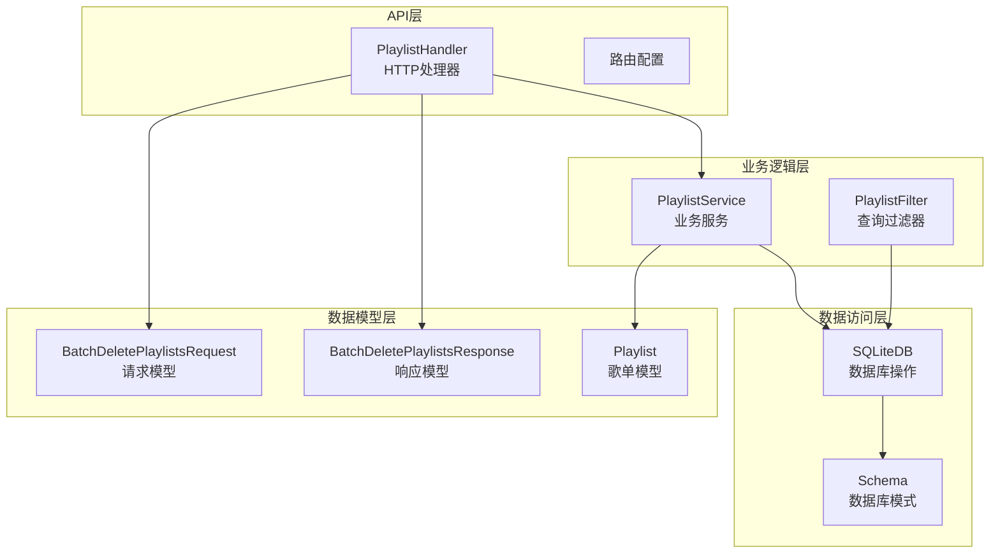
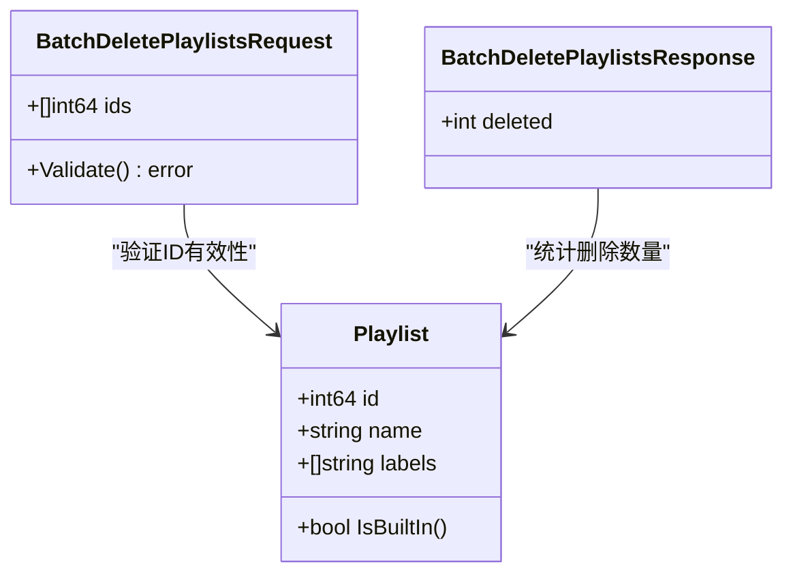
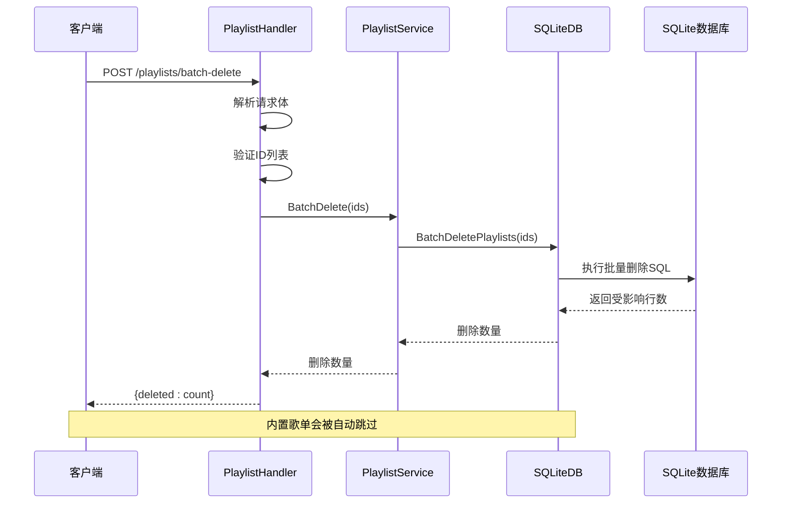
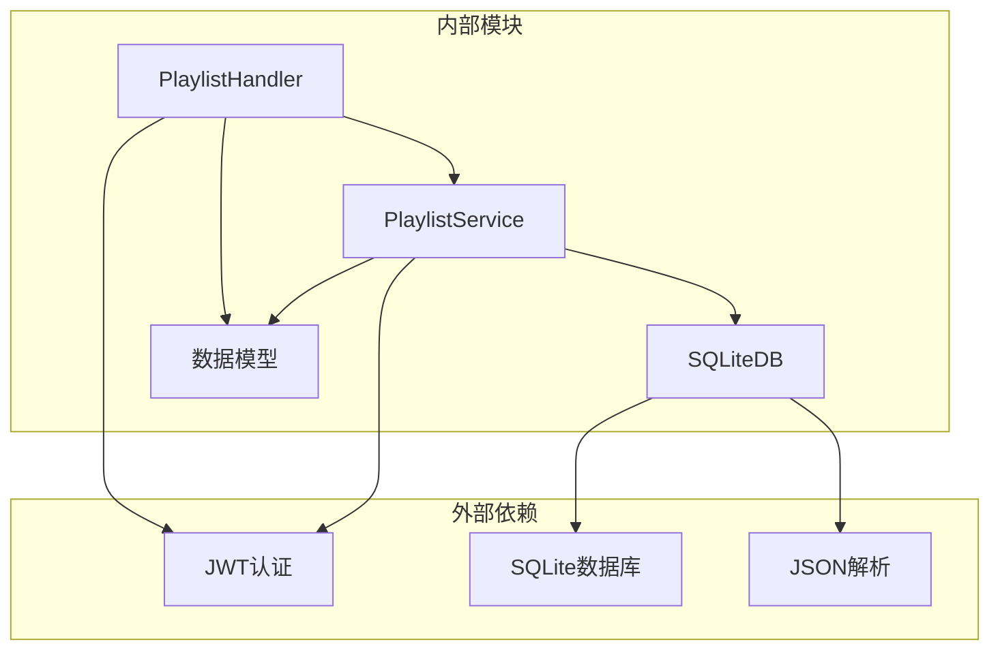

# 批量删除歌单响应模型

<cite>
**本文档引用的文件**
- [playlist.go](file://internal/handlers/playlist.go)
- [playlist_service.go](file://internal/services/playlist_service.go)
- [sqlite_playlist.go](file://internal/database/sqlite_playlist.go)
- [models.go](file://internal/models/models.go)
- [schema.go](file://internal/database/schema.go)
- [swagger.yaml](file://docs/swagger.yaml)
- [docs.go](file://docs/docs.go)
- [routers.go](file://internal/app/routers.go)
</cite>

## 目录
1. [简介](#简介)
2. [项目结构](#项目结构)
3. [核心组件](#核心组件)
4. [架构概览](#架构概览)
5. [详细组件分析](#详细组件分析)
6. [依赖关系分析](#依赖关系分析)
7. [性能考虑](#性能考虑)
8. [故障排除指南](#故障排除指南)
9. [结论](#结论)

## 简介

本文档详细分析了mimusic项目中批量删除歌单响应模型的设计与实现。该功能允许用户通过单个API调用同时删除多个歌单，系统会自动跳过内置歌单（如"收藏"和"电台收藏"），确保核心功能不受影响。

批量删除歌单是音乐管理系统中的重要功能，它提供了高效的批量操作能力，特别适用于需要清理大量临时或不需要的歌单场景。系统通过三层架构设计实现了这一功能，包括HTTP处理层、业务逻辑层和服务层，确保了功能的完整性、安全性和可维护性。

## 项目结构

mimusic项目采用典型的分层架构设计，批量删除歌单功能涉及以下关键模块：



**图表来源**
- [playlist.go:18-28](file://internal/handlers/playlist.go#L18-L28)
- [playlist_service.go:11-23](file://internal/services/playlist_service.go#L11-L23)
- [sqlite_playlist.go:268-300](file://internal/database/sqlite_playlist.go#L268-L300)

**章节来源**
- [playlist.go:1-603](file://internal/handlers/playlist.go#L1-L603)
- [playlist_service.go:1-286](file://internal/services/playlist_service.go#L1-L286)
- [sqlite_playlist.go:1-507](file://internal/database/sqlite_playlist.go#L1-L507)

## 核心组件

### 数据模型设计

批量删除歌单功能涉及两个核心数据模型：

#### BatchDeletePlaylistsRequest 请求模型
- **结构**: 包含一个整数数组 `ids`
- **用途**: 接收客户端发送的歌单ID列表
- **验证**: 确保至少包含一个有效的歌单ID
- **示例**: `[1, 2, 3, 4, 5]`

#### BatchDeletePlaylistsResponse 响应模型
- **结构**: 包含一个整数 `deleted`
- **用途**: 返回实际删除的歌单数量
- **含义**: 可能小于请求的ID数量，因为内置歌单会被跳过
- **示例**: `{"deleted": 3}`



**图表来源**
- [models.go:442-450](file://internal/models/models.go#L442-L450)
- [models.go:127-139](file://internal/models/models.go#L127-L139)

**章节来源**
- [models.go:442-450](file://internal/models/models.go#L442-L450)

### HTTP处理器实现

PlaylistHandler负责处理批量删除歌单的HTTP请求：

#### 主要职责
- 解析和验证请求数据
- 调用业务服务层执行删除操作
- 处理响应和错误情况
- 返回标准化的JSON响应

#### 关键流程
1. **请求解析**: 使用 `json.NewDecoder` 解析请求体
2. **数据验证**: 检查ID列表的有效性
3. **服务调用**: 调用 `playlistService.BatchDelete`
4. **响应构建**: 创建 `BatchDeletePlaylistsResponse` 对象
5. **错误处理**: 统一的错误响应格式

**章节来源**
- [playlist.go:249-284](file://internal/handlers/playlist.go#L249-L284)

### 业务服务层

PlaylistService提供批量删除的核心业务逻辑：

#### 核心方法
- **BatchDelete(ctx, ids)**: 执行批量删除操作
- **内部处理**: 调用数据库层的批量删除方法
- **返回值**: 实际删除的歌单数量

#### 业务规则
- 跳过内置歌单（标签包含 "built_in"）
- 支持空ID列表的安全处理
- 统一的错误处理机制

**章节来源**
- [playlist_service.go:119-131](file://internal/services/playlist_service.go#L119-L131)

### 数据库层实现

SQLiteDB实现具体的批量删除操作：

#### SQL实现
- 使用 `IN (...)` 子句批量删除
- 通过 `NOT EXISTS (SELECT 1 FROM json_each(labels) WHERE value = 'built_in')` 跳过内置歌单
- 返回受影响的行数作为删除数量

#### 性能优化
- 单次SQL执行完成批量操作
- 使用占位符防止SQL注入
- 原子性保证事务完整性

**章节来源**
- [sqlite_playlist.go:268-300](file://internal/database/sqlite_playlist.go#L268-L300)

## 架构概览

批量删除歌单功能遵循经典的三层架构模式：



**图表来源**
- [playlist.go:261-284](file://internal/handlers/playlist.go#L261-L284)
- [playlist_service.go:120-131](file://internal/services/playlist_service.go#L120-L131)
- [sqlite_playlist.go:282-299](file://internal/database/sqlite_playlist.go#L282-L299)

**章节来源**
- [routers.go:81](file://internal/app/routers.go#L81)

## 详细组件分析

### API接口设计

#### 接口规范
- **URL**: `/playlists/batch-delete`
- **方法**: `POST`
- **认证**: 需要Bearer Token
- **内容类型**: `application/json`
- **标签**: "歌单管理"

#### 请求格式
```json
{
  "ids": [1, 2, 3, 4, 5]
}
```

#### 响应格式
```json
{
  "deleted": 3
}
```

#### 错误处理
- **400错误**: 请求数据无效或缺少ID列表
- **500错误**: 服务器内部错误
- **标准错误格式**: `{"error": "message", "detail": "optional"}`

**章节来源**
- [swagger.yaml:1639-1674](file://docs/swagger.yaml#L1639-L1674)
- [docs.go:3234-3258](file://docs/docs.go#L3234-L3258)

### 数据库设计

#### 表结构
歌单表包含以下关键字段：
- `id`: 主键，自增
- `type`: 歌单类型（normal/radio）
- `name`: 歌单名称
- `labels`: JSON数组，存储标签信息
- `created_at/updated_at`: 时间戳

#### 标签系统
- **built_in**: 内置歌单标识
- **auto_created**: 自动创建歌单标识
- **JSON查询**: 使用 `json_each()` 函数进行标签查询

#### 级联删除
- 歌单删除时，相关的歌曲关联会自动删除
- 通过外键约束保证数据一致性

**章节来源**
- [schema.go:29-40](file://internal/database/schema.go#L29-L40)
- [schema.go:137-140](file://internal/database/schema.go#L137-L140)

### 安全性考虑

#### 内置歌单保护
系统通过标签机制保护内置歌单不被意外删除：
- 收藏歌单: `["built_in"]`
- 电台收藏: `["built_in"]`
- 删除操作会自动跳过这些歌单

#### 权限控制
- 需要有效的Bearer Token
- 通过中间件进行身份验证
- 支持细粒度的权限管理

#### 输入验证
- ID列表不能为空
- ID必须为有效的整数
- 防止SQL注入攻击

**章节来源**
- [sqlite_playlist.go:282-287](file://internal/database/sqlite_playlist.go#L282-L287)

## 依赖关系分析



**图表来源**
- [playlist.go:3-16](file://internal/handlers/playlist.go#L3-L16)
- [playlist_service.go:3-9](file://internal/services/playlist_service.go#L3-L9)

### 模块间耦合

#### 低耦合设计
- HTTP处理器只负责请求处理和响应
- 业务服务层封装核心逻辑
- 数据库层专注于数据持久化
- 各层之间通过清晰的接口通信

#### 依赖注入
- 通过构造函数传递依赖
- 支持测试替身（mock）对象
- 便于单元测试和集成测试

**章节来源**
- [playlist.go:24-28](file://internal/handlers/playlist.go#L24-L28)
- [playlist_service.go:17-23](file://internal/services/playlist_service.go#L17-L23)

## 性能考虑

### 批量操作优化

#### 单次SQL执行
- 使用 `IN (...)` 子句一次性删除多个歌单
- 避免多次数据库往返
- 减少事务开销

#### JSON查询优化
- 使用 `json_each()` 函数高效查询标签
- 避免复杂的字符串匹配
- 支持索引优化

#### 内存管理
- 流式处理大型ID列表
- 及时释放数据库连接
- 避免内存泄漏

### 并发安全性

#### 事务隔离
- 批量删除在单个事务中执行
- 确保原子性操作
- 防止部分删除状态

#### 锁机制
- SQLite自动处理并发锁
- 支持多用户同时操作
- 避免死锁情况

## 故障排除指南

### 常见问题

#### 删除数量不匹配
**现象**: 请求删除5个歌单，但响应显示只删除了3个
**原因**: 其中2个是内置歌单，被系统自动跳过
**解决方案**: 检查歌单标签，确认是否为内置歌单

#### 请求格式错误
**现象**: 返回400错误
**可能原因**:
- 缺少 `ids` 字段
- `ids` 不是数组格式
- 包含无效的ID值
**解决方案**: 验证请求格式，确保ID为有效整数

#### 权限不足
**现象**: 返回401或403错误
**原因**: 缺少有效的认证令牌
**解决方案**: 检查JWT令牌有效性

### 调试建议

#### 日志记录
- 记录请求参数和响应结果
- 跟踪数据库执行的SQL语句
- 监控错误发生的具体位置

#### 性能监控
- 监控批量删除操作的执行时间
- 分析数据库查询性能
- 识别潜在的瓶颈

**章节来源**
- [playlist.go:264-273](file://internal/handlers/playlist.go#L264-L273)

## 结论

批量删除歌单响应模型展现了mimusic项目在API设计、数据模型和架构组织方面的成熟实践。该模型通过清晰的分层设计、严格的数据验证和完善的错误处理机制，为用户提供了一个安全、高效且易于使用的批量操作功能。

### 设计优势

1. **安全性**: 内置歌单保护机制确保核心功能不受影响
2. **效率性**: 单次SQL执行实现批量操作，减少数据库往返
3. **可扩展性**: 清晰的接口设计支持未来功能扩展
4. **可维护性**: 低耦合设计便于代码维护和测试

### 技术亮点

- **JSON标签系统**: 灵活的元数据管理机制
- **原子性操作**: 事务保证数据一致性
- **标准化响应**: 统一的API响应格式
- **全面的错误处理**: 完善的异常情况处理

该响应模型不仅满足了当前的功能需求，还为未来的功能扩展奠定了坚实的基础，体现了现代Web应用开发的最佳实践。