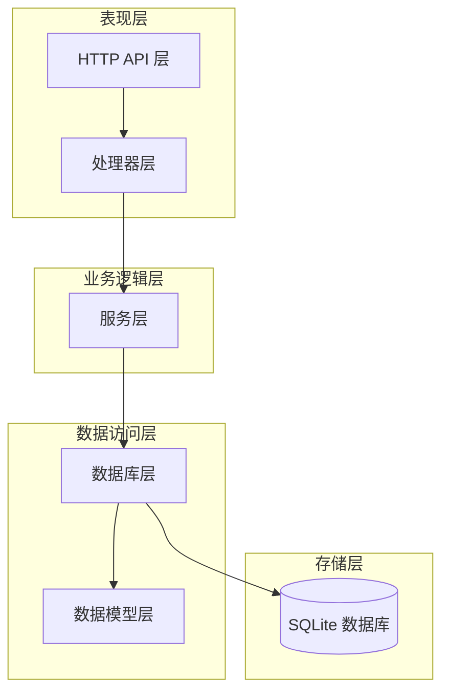
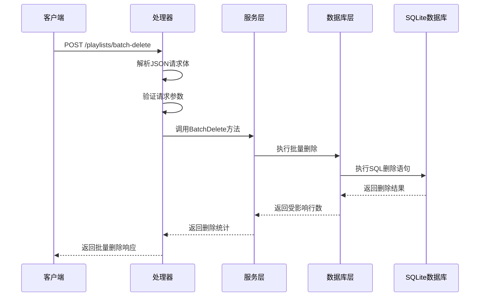
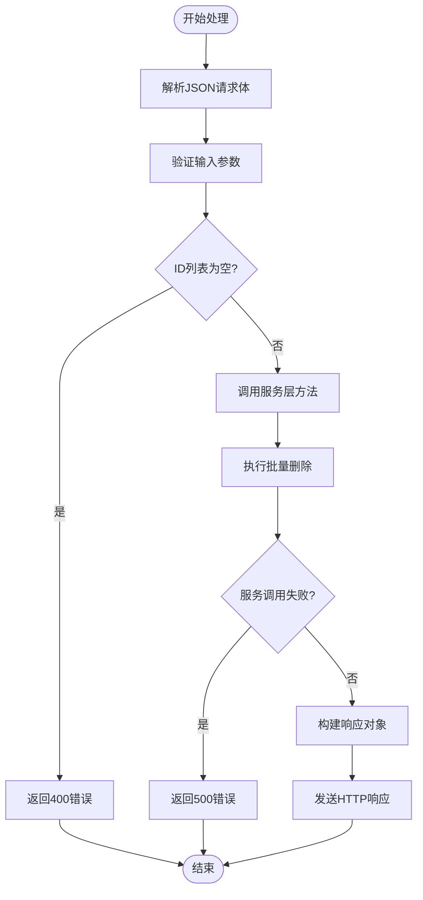
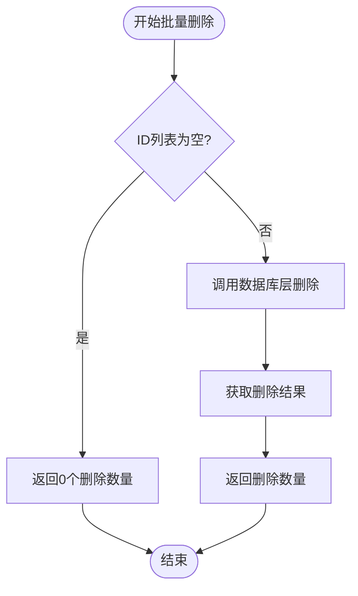
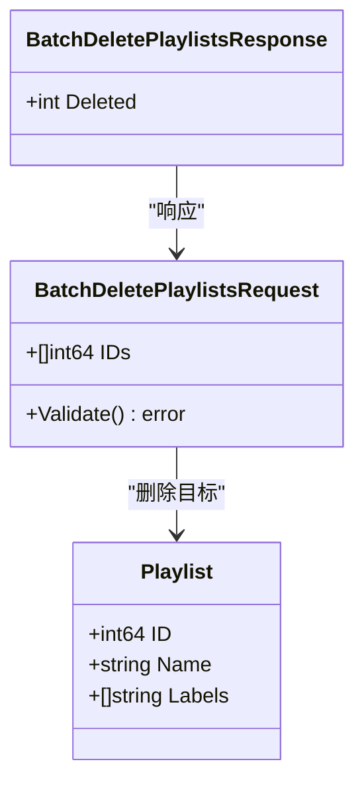
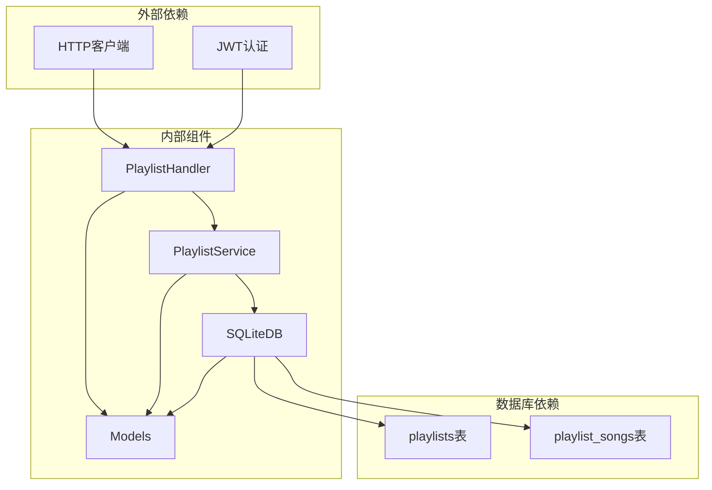

# 批量删除歌单请求模型

<cite>
**本文档引用的文件**
- [playlist.go](file://internal/handlers/playlist.go)
- [models.go](file://internal/models/models.go)
- [playlist_service.go](file://internal/services/playlist_service.go)
- [sqlite_playlist.go](file://internal/database/sqlite_playlist.go)
- [swagger.json](file://docs/swagger.json)
- [playlist_test.go](file://internal/handlers/playlist_test.go)
- [music.go](file://internal/handlers/music.go)
</cite>

## 更新摘要
**变更内容**
- 修正API文档中BatchDeletePlaylistsRequest和BatchDeleteSongsRequest模型示例
- 明确IDs字段应为单个整数示例而非数组
- 更新相关章节以反映API文档示例的修正

## 目录
1. [简介](#简介)
2. [项目结构](#项目结构)
3. [核心组件](#核心组件)
4. [架构概览](#架构概览)
5. [详细组件分析](#详细组件分析)
6. [依赖关系分析](#依赖关系分析)
7. [性能考虑](#性能考虑)
8. [故障排除指南](#故障排除指南)
9. [结论](#结论)

## 简介

本文档详细分析了音乐播放器系统中的批量删除歌单请求模型。该功能允许客户端一次性删除多个歌单，同时具备内置歌单保护机制，确保系统核心功能不受影响。本文档涵盖了从API设计、数据模型定义到完整的处理流程的技术细节。

**更新** 本次更新修正了API文档中模型示例，明确IDs字段应为单个整数示例而非数组，以保持API文档与实际实现的一致性。

## 项目结构

该项目采用典型的三层架构模式，主要分为以下层次：



**图表来源**
- [playlist.go:1-603](file://internal/handlers/playlist.go#L1-L603)
- [playlist_service.go:1-286](file://internal/services/playlist_service.go#L1-L286)
- [sqlite_playlist.go:1-507](file://internal/database/sqlite_playlist.go#L1-L507)

**章节来源**
- [playlist.go:1-603](file://internal/handlers/playlist.go#L1-L603)
- [models.go:1-451](file://internal/models/models.go#L1-L451)

## 核心组件

批量删除歌单功能的核心组件包括：

### 请求模型定义

批量删除歌单请求模型定义在数据模型层，包含以下关键要素：

- **批量删除请求结构**: `BatchDeletePlaylistsRequest`
- **批量删除响应结构**: `BatchDeletePlaylistsResponse`
- **ID列表字段**: `IDs []int64` - 要删除的歌单ID数组
- **响应字段**: `Deleted int` - 实际删除的歌单数量

**更新** API文档中的示例已修正，明确IDs字段应为单个整数示例而非数组。

### API端点设计

系统提供了专门的REST API端点用于批量删除操作：

- **端点路径**: `/playlists/batch-delete`
- **HTTP方法**: POST
- **认证要求**: Bearer Token
- **请求体**: JSON格式的批量删除请求
- **响应体**: JSON格式的批量删除响应

**章节来源**
- [models.go:442-451](file://internal/models/models.go#L442-L451)
- [swagger.json:3228-3270](file://docs/swagger.json#L3228-L3270)

## 架构概览

批量删除歌单功能遵循标准的MVC架构模式，各层职责明确：



**图表来源**
- [playlist.go:261-284](file://internal/handlers/playlist.go#L261-L284)
- [playlist_service.go:119-131](file://internal/services/playlist_service.go#L119-L131)
- [sqlite_playlist.go:268-300](file://internal/database/sqlite_playlist.go#L268-L300)

## 详细组件分析

### 处理器层实现

处理器层负责HTTP请求的接收和响应的发送：

#### 请求处理流程



**图表来源**
- [playlist.go:261-284](file://internal/handlers/playlist.go#L261-L284)

#### 错误处理机制

处理器实现了完善的错误处理机制：

- **请求解析错误**: 返回400状态码
- **参数验证失败**: 返回400状态码  
- **服务调用异常**: 返回500状态码
- **正常处理**: 返回200状态码和删除统计

**章节来源**
- [playlist.go:261-284](file://internal/handlers/playlist.go#L261-L284)

### 服务层实现

服务层封装了业务逻辑，提供了数据验证和业务规则检查：

#### 批量删除业务逻辑

服务层的批量删除方法实现了以下核心功能：

- **输入验证**: 检查ID列表的有效性
- **调用数据库层**: 执行具体的删除操作
- **错误处理**: 统一处理数据库操作异常
- **结果返回**: 返回删除的歌单数量

#### 内置歌单保护机制

服务层实现了重要的安全保护机制：



**图表来源**
- [playlist_service.go:119-131](file://internal/services/playlist_service.go#L119-L131)

**章节来源**
- [playlist_service.go:119-131](file://internal/services/playlist_service.go#L119-L131)

### 数据库层实现

数据库层提供了持久化存储能力，实现了高效的批量删除操作：

#### SQL实现细节

数据库层的批量删除SQL语句具有以下特点：

- **IN子句优化**: 使用动态IN子句匹配多个ID
- **JSON查询**: 使用`json_each`函数检查标签属性
- **原子性保证**: 整个删除操作在单个事务中执行
- **性能优化**: 避免循环逐个删除的低效方式

#### SQL执行计划

```sql
DELETE FROM playlists 
WHERE id IN (?, ?, ?, ...)
AND NOT EXISTS (SELECT 1 FROM json_each(labels) WHERE value = 'built_in')
```

这个SQL语句同时实现了：
1. **批量删除**: 通过IN子句一次性删除多个歌单
2. **内置保护**: 通过JSON查询排除带有"built_in"标签的歌单
3. **原子性**: 整个操作在单个事务中完成

**章节来源**
- [sqlite_playlist.go:268-300](file://internal/database/sqlite_playlist.go#L268-L300)

### 数据模型定义

数据模型层定义了批量删除功能所需的数据结构：

#### 请求模型结构



**图表来源**
- [models.go:442-451](file://internal/models/models.go#L442-L451)

#### 数据验证规则

批量删除请求模型包含以下验证规则：

- **ID列表不能为空**: 至少需要一个有效的歌单ID
- **ID类型正确**: 使用64位整数类型
- **标签过滤**: 内置歌单不会被删除
- **响应格式**: 返回删除的歌单数量

**章节来源**
- [models.go:442-451](file://internal/models/models.go#L442-L451)

## 依赖关系分析

批量删除歌单功能涉及多个组件之间的复杂依赖关系：



**图表来源**
- [playlist.go:18-28](file://internal/handlers/playlist.go#L18-L28)
- [playlist_service.go:11-23](file://internal/services/playlist_service.go#L11-L23)

### 组件耦合度分析

- **处理器与服务层**: 低耦合，通过接口分离关注点
- **服务层与数据库层**: 中等耦合，共享数据访问接口
- **数据库层与模型层**: 高耦合，直接操作数据结构
- **外部依赖**: 低耦合，通过中间件处理

**章节来源**
- [playlist.go:18-28](file://internal/handlers/playlist.go#L18-L28)
- [playlist_service.go:11-23](file://internal/services/playlist_service.go#L11-L23)

## 性能考虑

批量删除歌单功能在设计时充分考虑了性能优化：

### SQL优化策略

1. **批量操作**: 使用单条SQL语句处理多个删除操作
2. **索引利用**: 利用playlists表的主键索引进行高效查找
3. **JSON查询优化**: 使用`json_each`函数进行标签过滤
4. **事务管理**: 将整个操作包装在单个事务中

### 内存使用优化

- **流式处理**: 避免将大量数据加载到内存中
- **批量提交**: 使用批量插入和删除减少数据库往返
- **连接池**: 利用数据库连接池提高并发性能

### 并发安全性

- **事务隔离**: 使用数据库事务确保操作的原子性
- **锁机制**: SQLite自动处理并发访问的锁机制
- **回滚支持**: 出错时自动回滚所有更改

## 故障排除指南

### 常见问题及解决方案

#### 请求格式错误

**问题症状**: 返回400状态码，错误信息为"无效的请求数据"

**可能原因**:
- JSON格式不正确
- 缺少必要的字段
- 数据类型不匹配

**解决方法**:
1. 验证JSON格式的有效性
2. 确保包含`ids`字段
3. 确认ID值为整数类型

#### 权限不足

**问题症状**: 返回401或403状态码

**可能原因**:
- 缺少有效的Bearer Token
- Token已过期或无效
- 权限不足

**解决方法**:
1. 确保请求头包含正确的Authorization头
2. 验证Token的有效性和权限范围
3. 重新获取新的访问令牌

#### 数据库操作失败

**问题症状**: 返回500状态码，错误信息为"批量删除歌单失败"

**可能原因**:
- 数据库连接问题
- SQL执行错误
- 外键约束冲突

**解决方法**:
1. 检查数据库连接状态
2. 验证SQL语句的正确性
3. 检查相关表的外键约束

**章节来源**
- [playlist.go:261-284](file://internal/handlers/playlist.go#L261-L284)

### 调试技巧

1. **启用日志**: 在开发环境中启用详细的日志记录
2. **单元测试**: 使用提供的测试用例验证功能正确性
3. **数据库监控**: 监控SQL执行时间和资源使用情况
4. **性能分析**: 使用性能分析工具识别瓶颈

**章节来源**
- [playlist_test.go:1-852](file://internal/handlers/playlist_test.go#L1-L852)

## 结论

批量删除歌单请求模型展现了现代Web应用的良好实践：

### 设计优势

1. **清晰的分层架构**: 各层职责明确，便于维护和扩展
2. **完善的错误处理**: 全面的错误处理机制确保系统的稳定性
3. **性能优化**: 采用批量操作和SQL优化提升执行效率
4. **安全保护**: 内置歌单保护机制防止意外删除核心数据

### 技术亮点

1. **RESTful API设计**: 符合REST规范的简洁API接口
2. **数据验证**: 强类型的数据模型和严格的验证规则
3. **事务管理**: 确保操作的原子性和一致性
4. **JSON查询**: 利用SQLite的JSON功能实现灵活的数据查询

### 扩展建议

1. **批量操作限制**: 可以添加批量操作的最大数量限制
2. **操作审计**: 记录批量删除操作的日志信息
3. **异步处理**: 对于大量数据的删除操作，可以考虑异步处理
4. **进度反馈**: 为长时间运行的操作提供进度反馈

**更新** 本次更新修正了API文档中的模型示例，确保IDs字段的示例与实际实现保持一致，提高了API文档的准确性和可用性。

这个批量删除歌单功能为音乐播放器系统提供了高效、安全的批量管理能力，是系统架构设计的优秀示例。