# 核心数据模型

<cite>
**本文档引用的文件**
- [models.go](file://internal/models/models.go)
- [constant.go](file://internal/models/constant.go)
- [schema.go](file://internal/database/schema.go)
- [sqlite.go](file://internal/database/sqlite.go)
- [sqlite_song.go](file://internal/database/sqlite_song.go)
- [sqlite_playlist.go](file://internal/database/sqlite_playlist.go)
- [sqlite_playlist_song.go](file://internal/database/sqlite_playlist_song.go)
- [sqlite_config.go](file://internal/database/sqlite_config.go)
- [sqlite_token.go](file://internal/database/sqlite_token.go)
- [sqlite_plugin.go](file://internal/database/sqlite_plugin.go)
- [song_service.go](file://internal/services/song_service.go)
- [playlist_service.go](file://internal/services/playlist_service.go)
- [config_service.go](file://internal/services/config_service.go)
- [auth_service.go](file://internal/services/auth_service.go)
- [models_test.go](file://internal/models/models_test.go)
- [sqlite_test.go](file://internal/database/sqlite_test.go)
- [jsplugin.go](file://internal/handlers/jsplugin.go)
- [music.go](file://internal/handlers/music.go)
</cite>

## 更新摘要
**变更内容**
- 新增LyricURL字段用于客户端可见URL，提供统一的歌词访问端点
- 改进marshaling逻辑，自动生成不同内容类型的URL端点
- 新增LyricURLPath方法，统一处理歌词URL生成逻辑
- 更新PlaybackURL、CoverURLPath方法，确保URL生成的一致性

## 目录
1. [简介](#简介)
2. [项目结构](#项目结构)
3. [核心组件](#核心组件)
4. [架构概览](#架构概览)
5. [详细组件分析](#详细组件分析)
6. [依赖分析](#依赖分析)
7. [性能考虑](#性能考虑)
8. [故障排除指南](#故障排除指南)
9. [结论](#结论)

## 简介

MiMusic 是一个基于 Go 语言开发的音乐播放器，采用 SQLite 作为主要数据存储。本文档深入分析了系统的核心数据模型，包括歌曲/电台模型、歌单模型、歌单-歌曲关联模型、配置模型、插件模型和认证令牌模型。

系统采用分层架构设计，核心数据模型位于 `internal/models` 目录，数据库操作封装在 `internal/database` 目录，业务逻辑通过服务层进行组织。所有模型都经过严格的验证和约束，确保数据的完整性和一致性。

**更新** 最新的变更引入了LyricURL字段和改进的marshaling逻辑，实现了歌词URL的统一管理和客户端透明访问。

## 项目结构

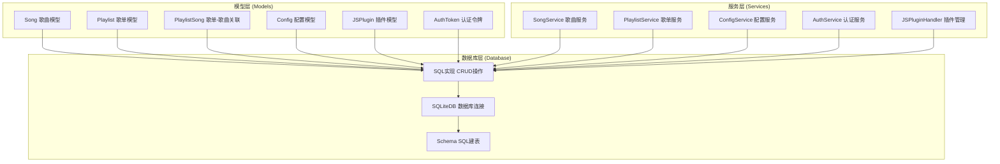

**图表来源**
- [models.go:64-436](file://internal/models/models.go#L64-L436)
- [schema.go:3-167](file://internal/database/schema.go#L3-L167)
- [sqlite.go:12-80](file://internal/database/sqlite.go#L12-L80)

**章节来源**
- [models.go:1-436](file://internal/models/models.go#L1-L436)
- [schema.go:1-167](file://internal/database/schema.go#L1-L167)

## 核心组件

### 歌曲/电台模型 (Song)

歌曲/电台模型是系统中最基础的数据实体，支持三种类型：

- **本地歌曲 (local)**: 存储在本地文件系统中的音频文件
- **网络歌曲 (remote)**: 通过 URL 播放的在线音频资源  
- **电台 (radio)**: 实时流媒体广播节目

**更新** 新增了歌词URL统一管理功能：

- **LyricURL**: 客户端可见的统一歌词URL端点
- **LyricURLPath**: 自动生成歌词访问端点的辅助方法

每个歌曲对象包含完整的元数据信息，包括基本属性、音频技术参数、封面信息和歌词管理。

**章节来源**
- [models.go:64-123](file://internal/models/models.go#L64-L123)
- [sqlite_song.go:14-44](file://internal/database/sqlite_song.go#L14-L44)

### 歌单模型 (Playlist)

歌单模型支持两种类型：

- **普通歌单 (normal)**: 包含本地和网络歌曲的静态集合
- **电台歌单 (radio)**: 专门用于收藏电台节目的特殊歌单

歌单模型引入了标签系统，支持对歌单进行分类和管理。内置标签包括 `built_in` 用于标识系统内置歌单。

**章节来源**
- [models.go:124-174](file://internal/models/models.go#L124-L174)
- [sqlite_playlist.go:17-47](file://internal/database/sqlite_playlist.go#L17-L47)

### 歌单-歌曲关联模型 (PlaylistSong)

这是一个多对多关系的中间表，实现了以下关键功能：

- **位置排序**: 通过 `position` 字段维护歌曲在歌单中的播放顺序
- **唯一性约束**: 确保同一歌单中不能重复添加同一首歌曲
- **级联删除**: 当删除歌曲或歌单时，自动清理关联关系

**章节来源**
- [models.go:176-197](file://internal/models/models.go#L176-L197)
- [sqlite_playlist_song.go:10-23](file://internal/database/sqlite_playlist_song.go#L10-L23)

### 配置模型 (Config)

配置模型采用键值对存储结构，其中值以 JSON 格式存储，支持复杂的配置数据：

- **键 (Key)**: 唯一标识配置项的字符串
- **值 (Value)**: JSON 格式的配置数据
- **唯一约束**: 键名在数据库层面保持唯一性

**章节来源**
- [models.go:199-216](file://internal/models/models.go#L199-L216)
- [sqlite_config.go:13-44](file://internal/database/sqlite_config.go#L13-L44)

### 插件模型 (JSPlugin)

**更新** 保留了完整的JSPlugin模型用于插件管理功能：

- **状态管理**: 支持激活、未激活、错误三种状态
- **版本控制**: 记录插件版本信息
- **权限管理**: 支持权限列表配置
- **文件管理**: 跟踪插件文件路径和入口点

**章节来源**
- [models.go:414-436](file://internal/models/models.go#L414-L436)
- [jsplugin.go:35-521](file://internal/handlers/jsplugin.go#L35-L521)

### 认证令牌模型 (AuthToken)

认证令牌模型实现了标准的双令牌机制：

- **访问令牌 (access)**: 短期有效的访问凭证，通常7天有效期
- **刷新令牌 (refresh)**: 长期有效的刷新凭证，通常30天有效期
- **撤销机制**: 支持令牌的主动撤销和过期清理

**章节来源**
- [models.go:368-402](file://internal/models/models.go#L368-L402)
- [sqlite_token.go:14-44](file://internal/database/sqlite_token.go#L14-L44)

## 架构概览

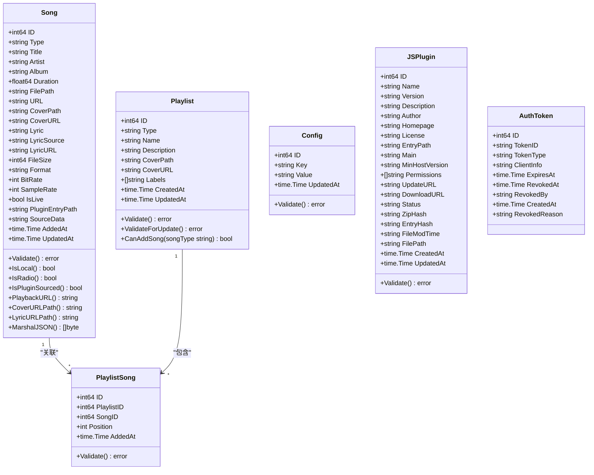

**图表来源**
- [models.go:64-436](file://internal/models/models.go#L64-L436)

## 详细组件分析

### 歌曲模型详细分析

#### 字段定义与业务含义

| 字段名 | 数据类型 | 业务含义 | 验证规则 |
|--------|----------|----------|----------|
| ID | int64 | 唯一标识符 | 自增主键 |
| Type | string | 歌曲类型 | local/remote/radio |
| Title | string | 歌曲标题 | 非空 |
| Artist | string | 艺术家/歌手 | 可选 |
| Album | string | 专辑名称 | 可选 |
| Duration | float64 | 播放时长(秒) | 非负数 |
| FilePath | string | 本地文件路径 | 本地歌曲必填 |
| URL | string | 网络地址 | 网络/电台必填 |
| CoverPath | string | 封面本地路径 | 可选 |
| CoverURL | string | 封面URL | 可选 |
| Lyric | string | 歌词内容 | 可选 |
| LyricSource | string | 歌词来源 | file/embedded/scraped/url/cached |
| LyricURL | string | 客户端可见歌词URL | 自动生成 |
| FileSize | int64 | 文件大小(字节) | 非负数 |
| Format | string | 音频格式 | 如mp3/flac |
| BitRate | int | 比特率(kbps) | 非负数 |
| SampleRate | int | 采样率(Hz) | 非负数 |
| IsLive | bool | 是否直播流 | 布尔值 |
| PluginEntryPath | string | 音源插件入口路径 | 可选 |
| SourceData | string | 音源元数据JSON | 可选 |
| AddedAt/UpdatedAt | time.Time | 时间戳 | 自动维护 |

#### 歌词URL统一管理机制

**更新** 新增了LyricURL字段和相关方法，实现了歌词URL的统一管理：

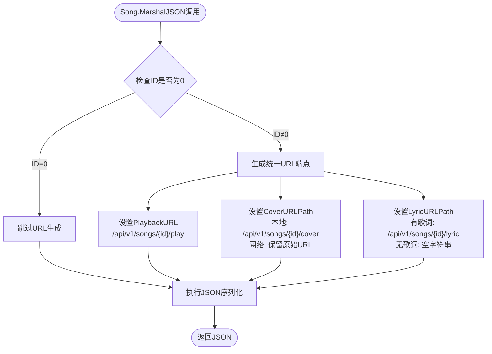

**图表来源**
- [models.go:138-146](file://internal/models/models.go#L138-L146)

#### LyricURLPath方法实现

LyricURLPath方法负责生成客户端可见的统一歌词URL：

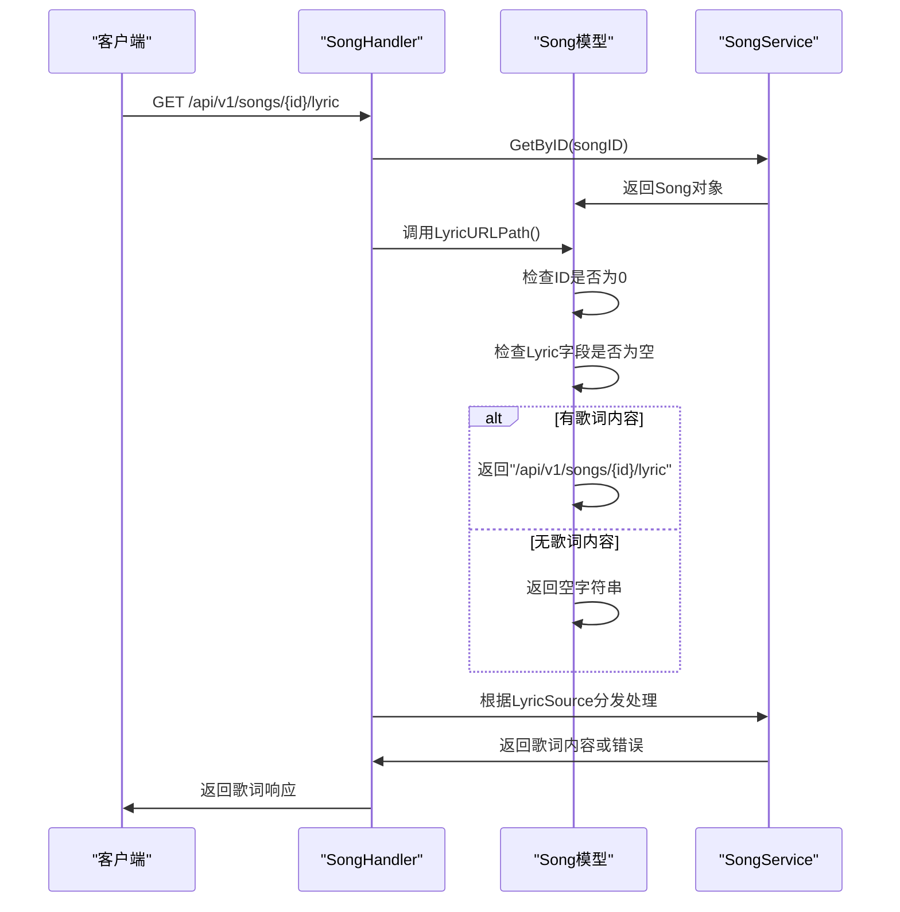

**图表来源**
- [models.go:120-129](file://internal/models/models.go#L120-L129)
- [music.go:673-710](file://internal/handlers/music.go#L673-L710)

#### 音频源识别机制

**更新** 新增了音频源识别功能，支持通过插件系统获取音频资源：

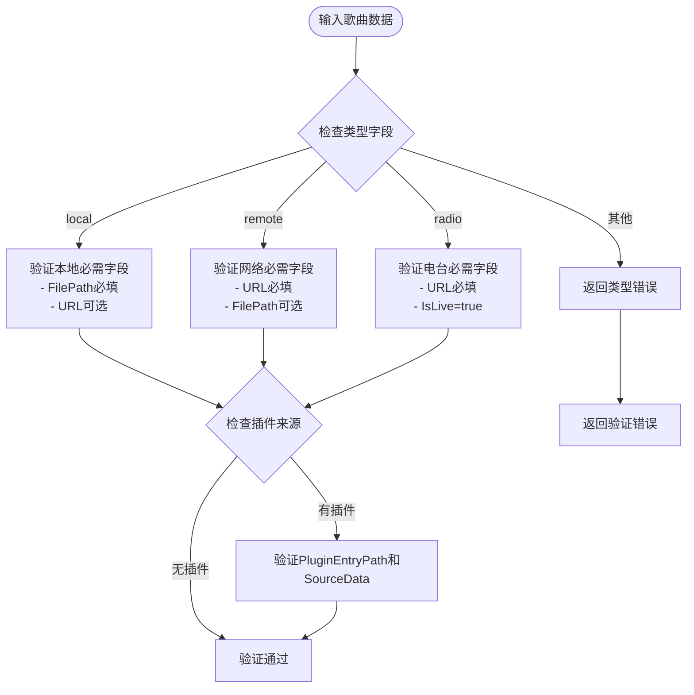

**图表来源**
- [models.go:87-112](file://internal/models/models.go#L87-L112)

#### 本地歌曲、网络歌曲和电台的区分

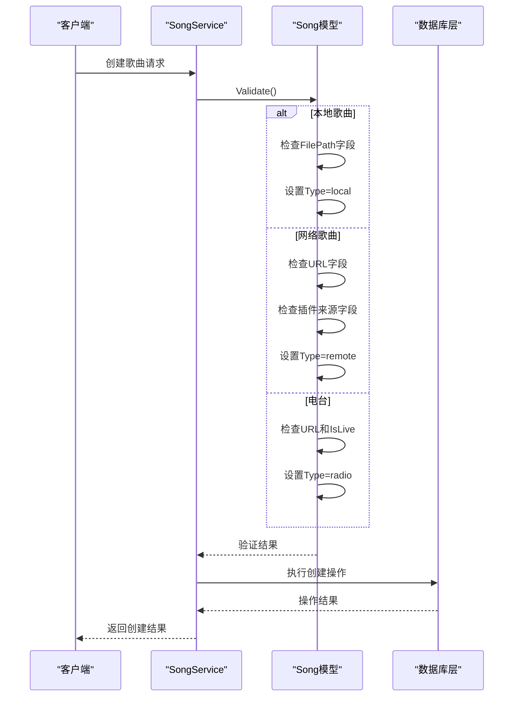

**图表来源**
- [models.go:87-123](file://internal/models/models.go#L87-L123)
- [song_service.go:44-57](file://internal/services/song_service.go#L44-L57)

**章节来源**
- [models.go:64-123](file://internal/models/models.go#L64-L123)
- [models_test.go:7-89](file://internal/models/models_test.go#L7-L89)

### 歌单模型详细分析

#### 普通歌单与电台歌单的区别

| 特性 | 普通歌单 (normal) | 电台歌单 (radio) |
|------|-------------------|------------------|
| 主要用途 | 存储本地/网络歌曲 | 存储电台节目 |
| 支持的歌曲类型 | local, remote | radio |
| 标签系统 | 支持多种标签 | 支持多种标签 |
| 内置支持 | 支持 | 支持 |
| 自动创建 | 支持 | 支持 |

#### 标签系统设计

歌单标签系统提供了灵活的分类机制：

- **built_in**: 内置系统歌单，不可删除
- **auto_created**: 自动创建的歌单，支持批量清理
- **自定义标签**: 用户可添加的业务标签

**章节来源**
- [models.go:124-174](file://internal/models/models.go#L124-L174)
- [sqlite_playlist.go:167-260](file://internal/database/sqlite_playlist.go#L167-L260)

### 歌单-歌曲关联模型分析

#### 多对多关系设计

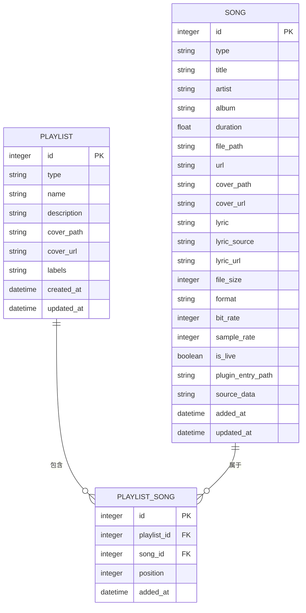

**图表来源**
- [schema.go:41-51](file://internal/database/schema.go#L41-L51)

#### 位置排序机制

歌曲在歌单中的位置通过 `position` 字段维护：

1. **自动排序**: 添加歌曲时自动分配下一个可用位置
2. **手动调整**: 支持重新排列歌曲顺序
3. **唯一约束**: 确保每个位置只对应一首歌曲

**章节来源**
- [models.go:176-197](file://internal/models/models.go#L176-L197)
- [sqlite_playlist_song.go:147-168](file://internal/database/sqlite_playlist_song.go#L147-L168)

### 配置模型详细分析

#### 键值对存储结构

配置模型采用灵活的键值对存储方式：

- **Key**: 唯一键名，支持层级结构
- **Value**: JSON格式的任意复杂数据
- **更新时间**: 自动维护最后修改时间

#### JSON格式值设计

配置值采用JSON格式存储，支持以下数据类型：

- **字符串**: `"path": "/music"`
- **数字**: `"port": 3000`
- **布尔值**: `"enabled": true`
- **数组**: `"formats": ["mp3","flac"]`
- **对象**: `"database": {"host":"localhost"}`

**章节来源**
- [models.go:199-216](file://internal/models/models.go#L199-L216)
- [config_service.go:83-112](file://internal/services/config_service.go#L83-L112)

### 插件模型详细分析

#### 完整属性结构

**更新** JSPlugin模型包含完整的插件生命周期信息：

| 属性 | 类型 | 描述 | 状态管理 |
|------|------|------|----------|
| ID | int64 | 插件唯一标识 | 系统自动生成 |
| Name | string | 插件显示名称 | 创建时设置 |
| Version | string | 版本号 | 支持升级 |
| Description | string | 功能描述 | 可选 |
| Author | string | 作者信息 | 可选 |
| Homepage | string | 官方网站 | 可选 |
| License | string | 许可证信息 | 可选 |
| EntryPath | string | 路由前缀（如 "myplugin"） | 唯一标识 |
| Main | string | 入口文件路径（如 "main.js"） | 默认main.js |
| MinHostVersion | string | 最低宿主版本要求 | 可选 |
| Permissions | []string | 权限列表 | JSON序列化 |
| UpdateURL | string | 更新URL | 可选 |
| DownloadURL | string | 下载URL | 可选 |
| Status | string | 激活状态 | active/inactive/error |
| ZipHash | string | ZIP文件SHA256 | 可选 |
| EntryHash | string | main.js/main.jsc内容SHA256 | 可选 |
| FileModTime | string | 文件修改时间 | 可选 |
| FilePath | string | ZIP文件相对路径 | 文件系统路径 |
| CreatedAt/UpdatedAt | time.Time | 时间戳 | 自动维护 |

#### 状态管理机制

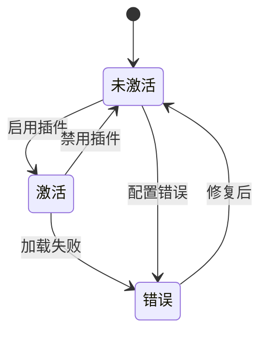

**图表来源**
- [models.go:414-436](file://internal/models/models.go#L414-L436)

**章节来源**
- [models.go:414-436](file://internal/models/models.go#L414-L436)
- [jsplugin.go:35-521](file://internal/handlers/jsplugin.go#L35-L521)

### 认证令牌模型详细分析

#### 双令牌机制设计

系统采用标准的OAuth 2.0双令牌机制：

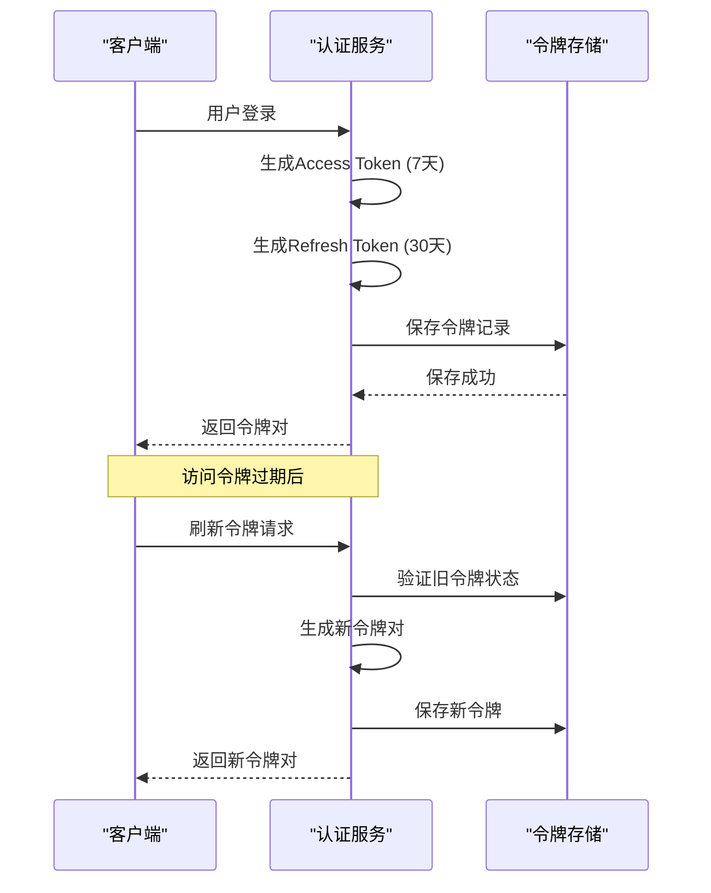

**图表来源**
- [auth_service.go:94-164](file://internal/services/auth_service.go#L94-L164)
- [auth_service.go:245-324](file://internal/services/auth_service.go#L245-L324)

#### 令牌验证流程

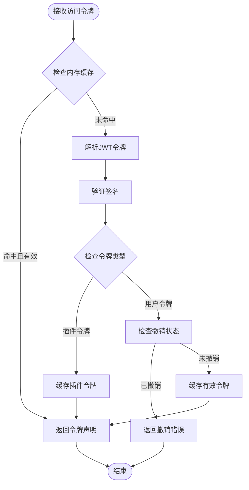

**图表来源**
- [auth_service.go:326-371](file://internal/services/auth_service.go#L326-L371)

**章节来源**
- [models.go:368-402](file://internal/models/models.go#L368-L402)
- [auth_service.go:94-164](file://internal/services/auth_service.go#L94-L164)

## 依赖分析

### 数据库层依赖关系

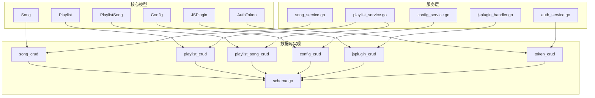

**图表来源**
- [schema.go:3-167](file://internal/database/schema.go#L3-L167)
- [sqlite_song.go:14-44](file://internal/database/sqlite_song.go#L14-L44)
- [sqlite_playlist.go:17-47](file://internal/database/sqlite_playlist.go#L17-L47)

### 业务逻辑依赖

服务层提供了完整的业务逻辑封装：

- **SongService**: 歌曲的完整生命周期管理
- **PlaylistService**: 歌单的创建、管理和歌曲操作
- **ConfigService**: 配置的读取、缓存和管理
- **AuthService**: 用户认证和令牌管理
- **JSPluginHandler**: JS插件的管理API

**章节来源**
- [song_service.go:16-32](file://internal/services/song_service.go#L16-L32)
- [playlist_service.go:11-21](file://internal/services/playlist_service.go#L11-L21)
- [config_service.go:15-27](file://internal/services/config_service.go#L15-L27)
- [auth_service.go:24-32](file://internal/services/auth_service.go#L24-L32)
- [jsplugin.go:35-521](file://internal/handlers/jsplugin.go#L35-L521)

## 性能考虑

### SQLite优化配置

系统采用了多项SQLite优化措施：

- **WAL模式**: 支持并发读写，提升性能
- **连接池**: 最大连接数10，空闲5个，超时30分钟
- **索引优化**: 为核心查询字段建立复合索引
- **触发器**: 自动维护更新时间戳
- **音频源索引**: 为PluginEntryPath建立条件索引

### 批量操作优化

- **批量插入**: 歌单-歌曲关联支持批量插入，每批最多500行
- **事务处理**: 扫描导入采用事务批量提交，减少磁盘IO
- **并发处理**: 元数据提取使用worker池并行处理

### 缓存策略

- **配置缓存**: ConfigService使用sync.Map缓存配置值
- **令牌缓存**: AuthService使用内存缓存令牌状态
- **自动清理**: 定期清理过期缓存条目

## 故障排除指南

### 常见验证错误

| 错误类型 | 触发条件 | 解决方案 |
|----------|----------|----------|
| 缺少标题 | Title为空 | 确保歌曲标题非空 |
| 无效类型 | Type不在允许范围内 | 检查类型字段值 |
| 本地歌曲缺少文件路径 | Type=local且FilePath为空 | 提供有效的本地文件路径 |
| 网络/电台缺少URL | Type=remote/radio且URL为空 | 提供有效的网络地址 |
| 歌单类型错误 | Playlist.Type不在允许范围内 | 检查歌单类型值 |
| 位置无效 | Position < 1 | 确保位置为正整数 |
| 歌词源无效 | LyricSource不在允许范围内 | 使用file/embedded/scraped/url/cached之一 |
| 插件状态无效 | Status不在允许范围内 | 使用active/inactive/error之一 |

### 数据完整性保证

系统通过多种机制确保数据完整性：

- **数据库约束**: 外键约束、CHECK约束、UNIQUE约束
- **业务验证**: 模型级别的数据验证
- **事务保证**: 关键操作使用事务确保原子性
- **索引优化**: 为常用查询字段建立索引

**章节来源**
- [models.go:34-62](file://internal/models/models.go#L34-L62)
- [schema.go:89-133](file://internal/database/schema.go#L89-L133)

## 结论

MiMusic的核心数据模型设计体现了良好的软件工程实践：

1. **清晰的层次结构**: 模型、数据库、服务层职责明确
2. **严格的验证机制**: 多层次的数据验证确保数据质量
3. **灵活的扩展性**: 插件系统和标签系统支持功能扩展
4. **完善的性能优化**: SQLite优化和缓存策略提升系统性能
5. **可靠的安全保障**: 双令牌机制和撤销机制确保系统安全
6. **音频源识别能力**: 新增的插件入口路径和源数据字段支持灵活的音频源管理
7. **统一的URL管理**: 新增的LyricURL字段和改进的marshaling逻辑实现了客户端透明的URL访问

**更新** 最新的变更引入了LyricURL字段和改进的marshaling逻辑，实现了歌词URL的统一管理和客户端透明访问。LyricURLPath方法确保了歌词端点的一致性生成，而MarshalJSON方法则将所有URL字段统一转换为服务端端点，简化了客户端的使用复杂度。

这些设计使得MiMusic能够高效地管理音乐数据，提供稳定可靠的用户体验，同时为未来的功能扩展奠定了坚实的基础。