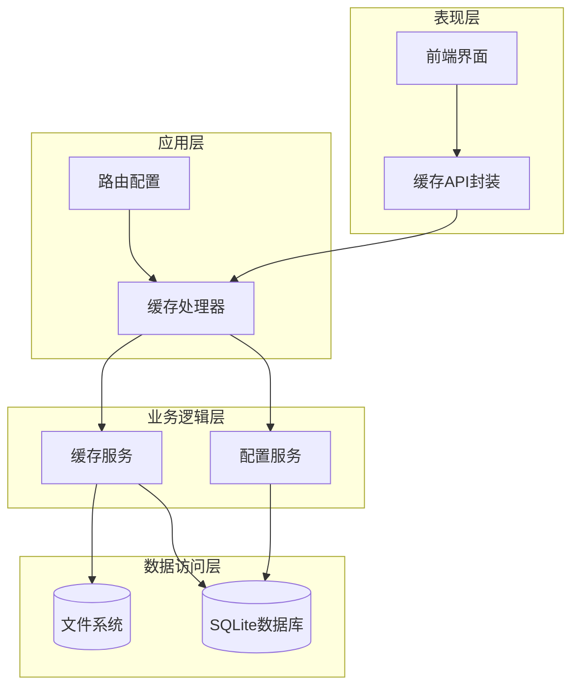
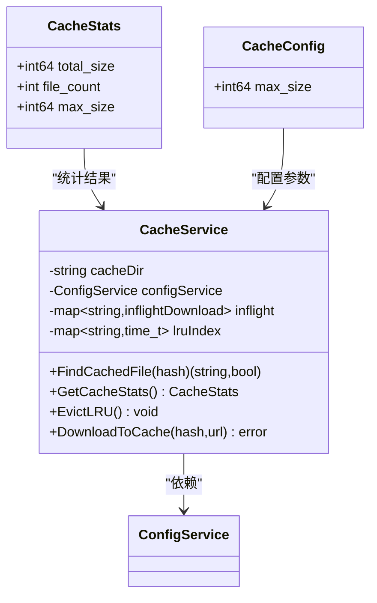
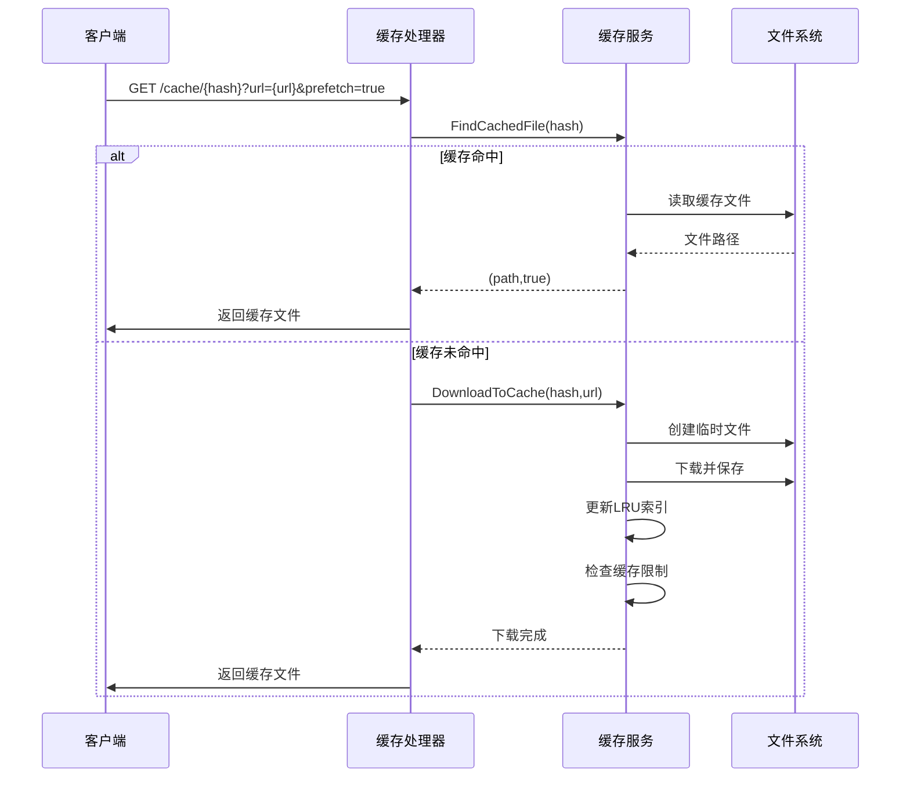
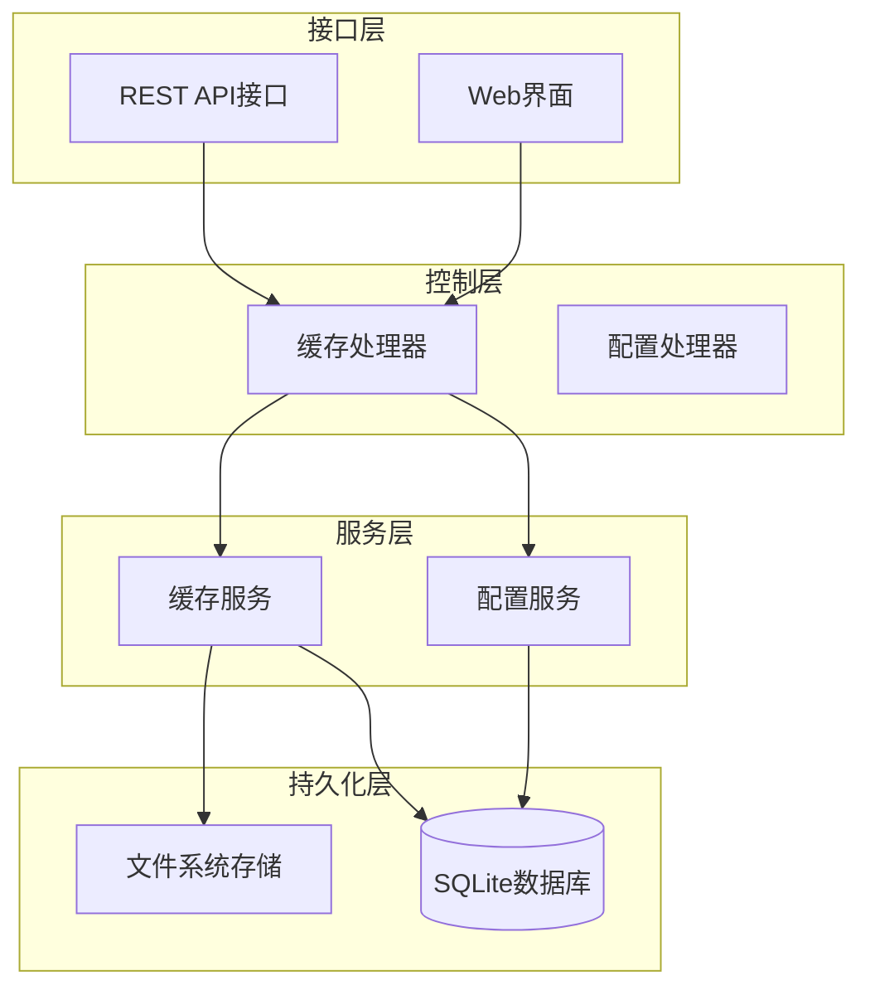
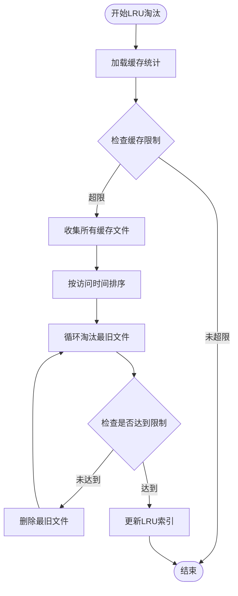
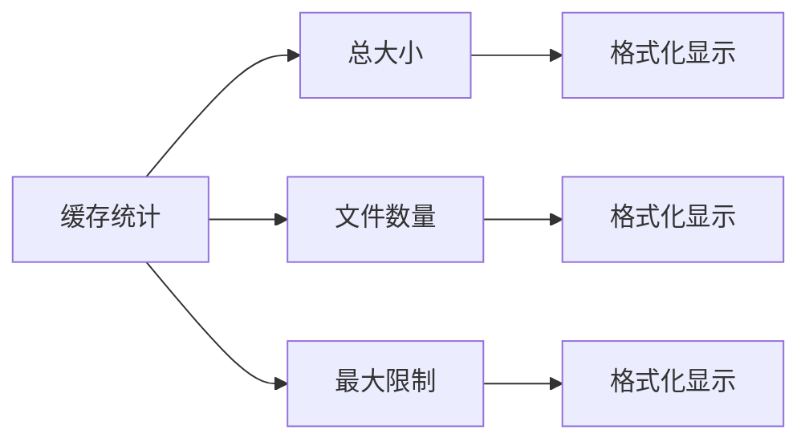
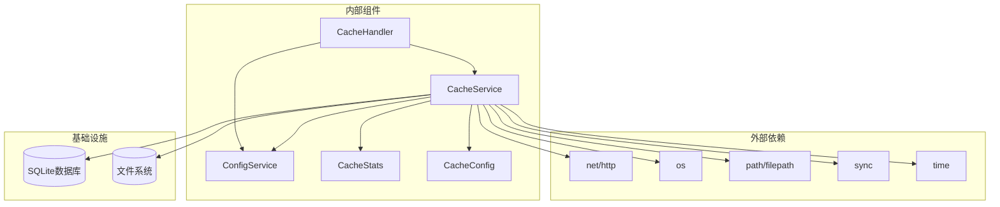

# 缓存统计模型

<cite>
**本文档引用的文件**
- [cache.go](file://internal/handlers/cache.go)
- [cache_service.go](file://internal/services/cache_service.go)
- [routers.go](file://internal/app/routers.go)
- [config_service.go](file://internal/services/config_service.go)
- [models.go](file://internal/models/models.go)
- [swagger.yaml](file://docs/swagger.yaml)
- [cache_api.dart](file://frontend/lib/features/settings/data/cache_api.dart)
- [cache_manager.dart](file://frontend/lib/features/settings/presentation/widgets/cache_manager.dart)
</cite>

## 目录
1. [简介](#简介)
2. [项目结构](#项目结构)
3. [核心组件](#核心组件)
4. [架构概览](#架构概览)
5. [详细组件分析](#详细组件分析)
6. [依赖关系分析](#依赖关系分析)
7. [性能考虑](#性能考虑)
8. [故障排除指南](#故障排除指南)
9. [结论](#结论)

## 简介

缓存统计模型是音乐播放器系统中一个关键的数据结构，用于跟踪和管理本地音乐缓存的状态。该模型提供了完整的缓存生命周期管理，包括缓存统计、配置管理和LRU淘汰策略。本文档深入分析了缓存统计模型的设计理念、实现细节和最佳实践。

## 项目结构

该项目采用分层架构设计，缓存统计功能主要分布在以下层次：

**图表来源**
- [cache.go:13-25](file://internal/handlers/cache.go#L13-L25)
- [cache_service.go:45-80](file://internal/services/cache_service.go#L45-L80)
- [routers.go:40-41](file://internal/app/routers.go#L40-L41)

**章节来源**
- [cache.go:1-199](file://internal/handlers/cache.go#L1-L199)
- [cache_service.go:1-610](file://internal/services/cache_service.go#L1-L610)
- [routers.go:1-268](file://internal/app/routers.go#L1-L268)

## 核心组件

缓存统计模型的核心组件包括：

### 缓存统计结构体

**图表来源**
- [cache_service.go:27-55](file://internal/services/cache_service.go#L27-L55)

### 缓存处理流程

**图表来源**
- [cache.go:42-115](file://internal/handlers/cache.go#L42-L115)
- [cache_service.go:146-178](file://internal/services/cache_service.go#L146-L178)

**章节来源**
- [cache_service.go:27-610](file://internal/services/cache_service.go#L27-L610)

## 架构概览

缓存统计模型采用分层架构，确保了良好的职责分离和可维护性：

**图表来源**
- [cache.go:13-25](file://internal/handlers/cache.go#L13-L25)
- [cache_service.go:45-80](file://internal/services/cache_service.go#L45-L80)
- [routers.go:117-125](file://internal/app/routers.go#L117-L125)

## 详细组件分析

### 缓存统计模型

缓存统计模型提供了三个核心数据结构：

#### CacheStats - 缓存统计信息
| 字段名 | 类型 | 描述 | 默认值 |
|--------|------|------|--------|
| total_size | int64 | 缓存文件总大小（字节） | 0 |
| file_count | int | 缓存文件数量 | 0 |
| max_size | int64 | 最大缓存限制（字节），0表示无限制 | 0 |

#### CacheConfig - 缓存配置
| 字段名 | 类型 | 描述 | 默认值 |
|--------|------|------|--------|
| max_size | int64 | 最大缓存大小（字节），0表示无限制 | 1GB |

#### inflightDownload - 并发下载追踪
| 字段名 | 类型 | 描述 |
|--------|------|------|
| done | chan struct{} | 下载完成信号通道 |
| err | error | 下载错误信息 |

**章节来源**
- [cache_service.go:27-43](file://internal/services/cache_service.go#L27-L43)

### 缓存服务实现

缓存服务实现了完整的LRU缓存管理机制：

#### 目录结构设计
缓存文件采用两级目录结构，基于文件名hash进行分布：
- hash长度≥4: `{cache_root}/{hash[0:2]}/{hash[2:4]}/{hash[完整hash]+扩展名}`
- hash长度<4: `{cache_root}/{hash}/{hash+扩展名}`

#### LRU索引管理

**图表来源**
- [cache_service.go:503-581](file://internal/services/cache_service.go#L503-L581)

**章节来源**
- [cache_service.go:82-581](file://internal/services/cache_service.go#L82-L581)

### API接口设计

系统提供了完整的缓存管理API：

#### 缓存查询接口
- `GET /api/v1/cache/{hash}` - 获取缓存文件
- `HEAD /api/v1/cache/{hash}` - 检查缓存状态

#### 缓存管理接口
- `GET /api/v1/cache-manage/stats` - 获取缓存统计信息
- `POST /api/v1/cache-manage/clean` - 清理全部缓存
- `GET /api/v1/cache-manage/config` - 获取缓存配置
- `PUT /api/v1/cache-manage/config` - 更新缓存配置

**章节来源**
- [cache.go:117-198](file://internal/handlers/cache.go#L117-L198)
- [routers.go:117-125](file://internal/app/routers.go#L117-L125)

### 前端集成

前端提供了完整的缓存管理界面：

#### 缓存统计显示

**图表来源**
- [cache_api.dart:5-24](file://frontend/lib/features/settings/data/cache_api.dart#L5-L24)
- [cache_manager.dart:370-403](file://frontend/lib/features/settings/presentation/widgets/cache_manager.dart#L370-L403)

**章节来源**
- [cache_api.dart:1-58](file://frontend/lib/features/settings/data/cache_api.dart#L1-L58)
- [cache_manager.dart:205-406](file://frontend/lib/features/settings/presentation/widgets/cache_manager.dart#L205-L406)

## 依赖关系分析

缓存统计模型的依赖关系体现了清晰的分层架构：

**图表来源**
- [cache.go:3-11](file://internal/handlers/cache.go#L3-L11)
- [cache_service.go:3-14](file://internal/services/cache_service.go#L3-L14)

**章节来源**
- [cache.go:1-11](file://internal/handlers/cache.go#L1-L11)
- [cache_service.go:1-14](file://internal/services/cache_service.go#L1-L14)

## 性能考虑

缓存统计模型在设计时充分考虑了性能优化：

### 并发控制
- 使用互斥锁保护共享状态
- inflight下载去重机制避免重复下载
- LRU索引使用读写锁提高并发性能

### 内存优化
- LRU索引仅存储hash到访问时间的映射
- 缓存配置使用数据库持久化
- 文件系统访问采用批量操作

### I/O优化
- 使用WAL模式提升SQLite并发性能
- 缓存文件采用两级目录结构减少单目录文件数量
- 支持Range请求实现部分文件传输

## 故障排除指南

### 常见问题及解决方案

#### 缓存统计不准确
**症状**: 缓存统计信息与实际不符
**可能原因**:
- LRU索引加载失败
- 文件系统权限问题
- 缓存目录损坏

**解决方案**:
1. 检查缓存目录权限
2. 重新加载LRU索引
3. 清理损坏的缓存文件

#### 缓存淘汰异常
**症状**: 缓存超过限制但仍不清理
**可能原因**:
- LRU索引不同步
- 淘汰算法错误
- 权限不足

**解决方案**:
1. 手动触发LRU检查
2. 检查文件系统权限
3. 重启服务重新加载索引

#### 并发下载问题
**症状**: 多个相同文件同时下载
**可能原因**:
- inflight状态管理错误
- 并发锁竞争
- 网络超时

**解决方案**:
1. 检查inflight状态清理
2. 优化锁竞争
3. 调整超时设置

**章节来源**
- [cache_service.go:393-424](file://internal/services/cache_service.go#L393-L424)
- [cache_service.go:503-581](file://internal/services/cache_service.go#L503-L581)

## 结论

缓存统计模型通过精心设计的数据结构和算法，为音乐播放器提供了高效、可靠的缓存管理能力。该模型的主要优势包括：

1. **完整的生命周期管理**: 从文件下载到LRU淘汰的全流程覆盖
2. **高性能设计**: 并发控制和内存优化确保系统稳定运行
3. **可扩展性**: 模块化设计便于功能扩展和维护
4. **用户友好**: 提供直观的统计信息和管理界面

该模型为类似的应用程序提供了优秀的参考实现，特别是在需要高效缓存管理的场景中。