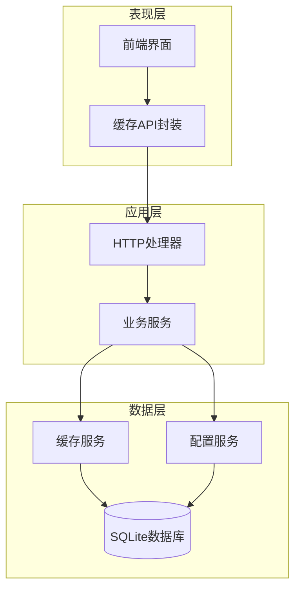
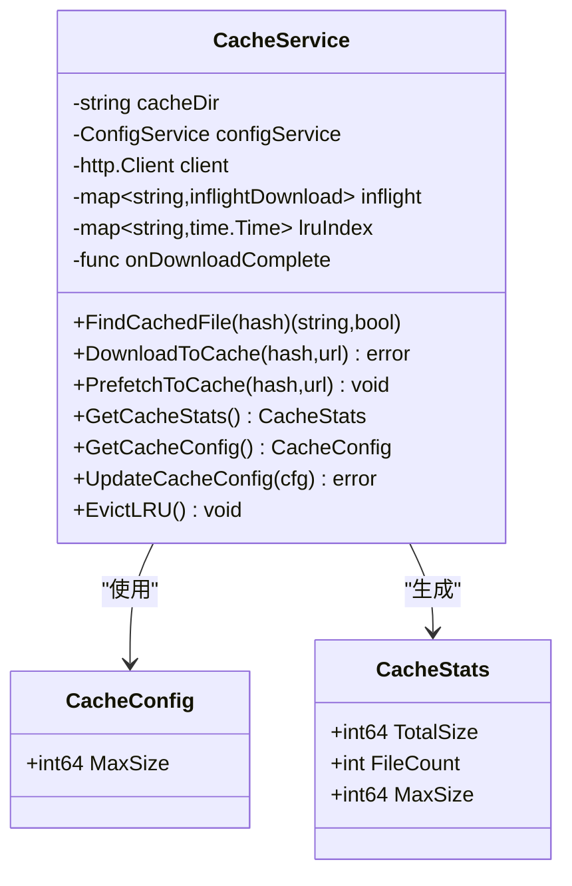
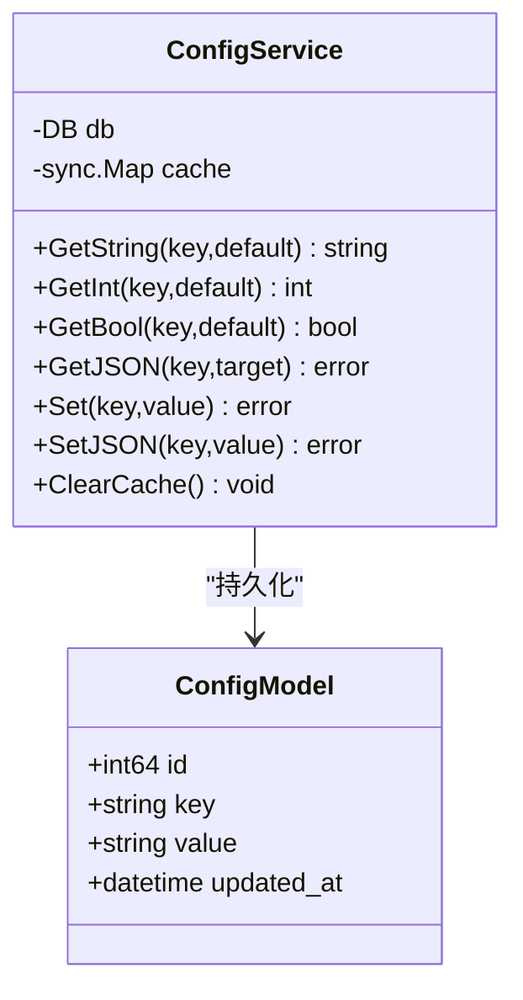
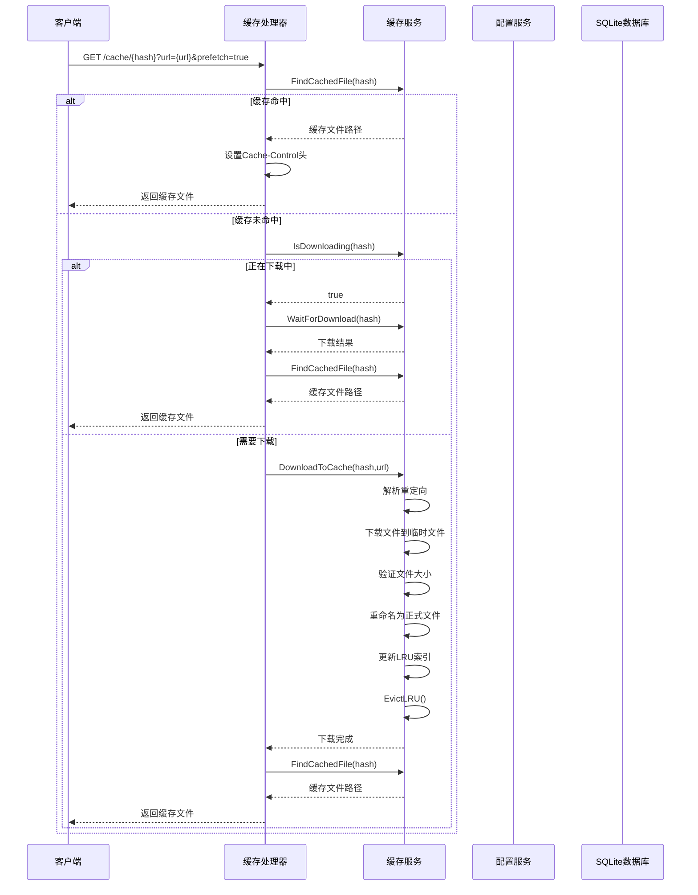
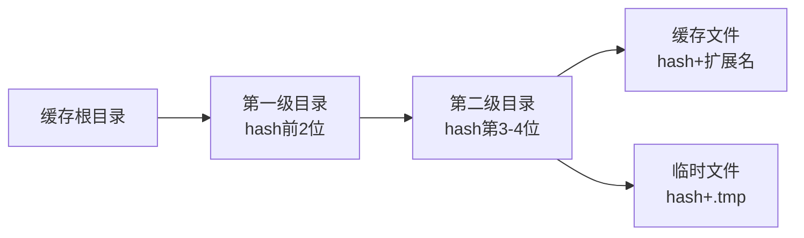
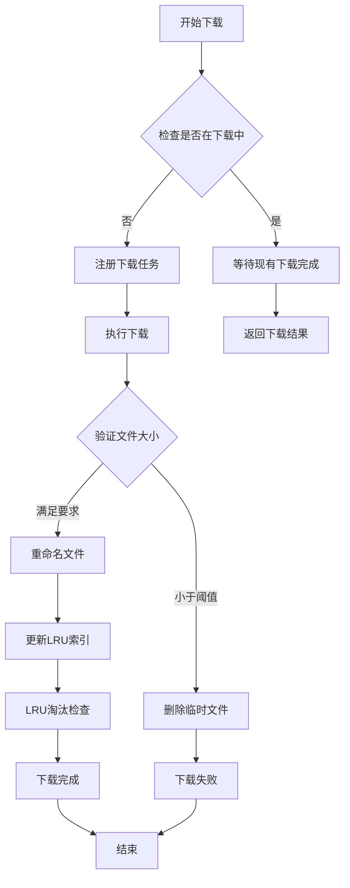
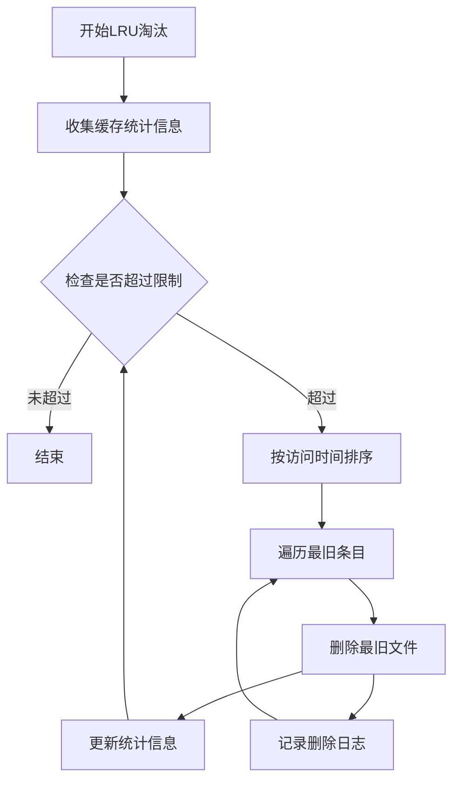
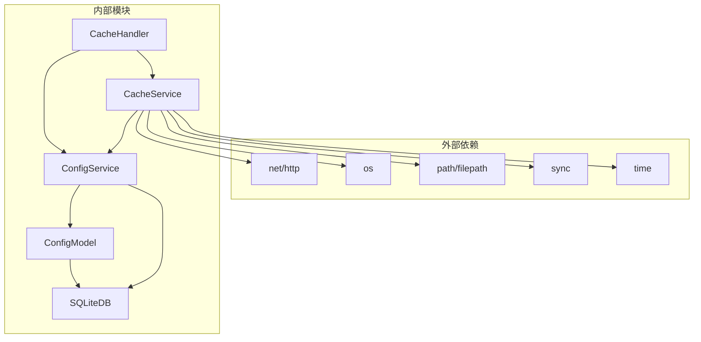

# 缓存配置模型

<cite>
**本文档引用的文件**
- [internal/services/cache_service.go](file://internal/services/cache_service.go)
- [internal/handlers/cache.go](file://internal/handlers/cache.go)
- [internal/services/config_service.go](file://internal/services/config_service.go)
- [internal/database/schema.go](file://internal/database/schema.go)
- [internal/app/app.go](file://internal/app/app.go)
- [frontend/lib/features/settings/data/cache_api.dart](file://frontend/lib/features/settings/data/cache_api.dart)
- [frontend/lib/features/settings/presentation/widgets/cache_manager.dart](file://frontend/lib/features/settings/presentation/widgets/cache_manager.dart)
</cite>

## 目录
1. [简介](#简介)
2. [项目结构](#项目结构)
3. [核心组件](#核心组件)
4. [架构概览](#架构概览)
5. [详细组件分析](#详细组件分析)
6. [依赖关系分析](#依赖关系分析)
7. [性能考虑](#性能考虑)
8. [故障排除指南](#故障排除指南)
9. [结论](#结论)

## 简介

MiMusic 是一个轻量级音乐服务器应用，提供了完整的音乐管理和播放功能。本文档专注于应用的缓存配置模型，详细分析了缓存系统的架构设计、配置管理机制以及前后端交互流程。

缓存配置模型是整个应用的重要组成部分，它负责管理音乐文件的本地缓存、配置持久化存储以及缓存策略的执行。该模型采用内容寻址存储（Content Addressable Storage）的设计理念，通过文件哈希值作为缓存标识，确保内容的唯一性和完整性。

## 项目结构

应用采用分层架构设计，主要包含以下层次：

**图表来源**
- [internal/app/app.go:181-183](file://internal/app/app.go#L181-L183)
- [internal/services/cache_service.go:62-80](file://internal/services/cache_service.go#L62-L80)
- [internal/services/config_service.go:22-27](file://internal/services/config_service.go#L22-L27)

**章节来源**
- [internal/app/app.go:1-200](file://internal/app/app.go#L1-L200)
- [internal/services/cache_service.go:1-610](file://internal/services/cache_service.go#L1-L610)

## 核心组件

### 缓存配置模型

缓存配置模型由三个核心组件构成：

1. **CacheConfig** - 缓存配置结构体
2. **CacheStats** - 缓存统计信息
3. **CacheService** - 缓存服务实现

**图表来源**
- [internal/services/cache_service.go:34-55](file://internal/services/cache_service.go#L34-L55)

### 配置管理系统

配置管理系统采用键值对存储方式，支持多种数据类型的配置管理：

**图表来源**
- [internal/services/config_service.go:15-27](file://internal/services/config_service.go#L15-L27)
- [internal/database/schema.go:54-60](file://internal/database/schema.go#L54-L60)

**章节来源**
- [internal/services/cache_service.go:34-610](file://internal/services/cache_service.go#L34-L610)
- [internal/services/config_service.go:15-198](file://internal/services/config_service.go#L15-L198)

## 架构概览

缓存配置模型的整体架构采用分层设计，各层职责明确：

**图表来源**
- [internal/handlers/cache.go:42-115](file://internal/handlers/cache.go#L42-L115)
- [internal/services/cache_service.go:149-281](file://internal/services/cache_service.go#L149-L281)

## 详细组件分析

### 缓存服务实现

缓存服务实现了完整的缓存管理功能，包括文件查找、下载、预加载和LRU淘汰策略。

#### 缓存目录结构

缓存文件采用两级目录结构，基于文件哈希值进行组织：

**图表来源**
- [internal/services/cache_service.go:82-93](file://internal/services/cache_service.go#L82-L93)

#### 并发下载控制

系统通过 `inflightDownload` 结构体实现并发下载去重：

**图表来源**
- [internal/services/cache_service.go:149-178](file://internal/services/cache_service.go#L149-L178)
- [internal/services/cache_service.go:180-281](file://internal/services/cache_service.go#L180-L281)

#### LRU淘汰算法

LRU（最近最少使用）算法通过维护访问时间索引来实现智能淘汰：

**图表来源**
- [internal/services/cache_service.go:503-581](file://internal/services/cache_service.go#L503-L581)

### 配置服务实现

配置服务提供了统一的配置管理接口，支持多种数据类型的配置存储：

#### 配置存储结构

配置数据存储在SQLite数据库的 `configs` 表中：

| 字段名 | 数据类型 | 描述 |
|--------|----------|------|
| id | INTEGER | 主键，自增 |
| key | TEXT | 配置键，唯一约束 |
| value | TEXT | 配置值，JSON格式存储 |
| updated_at | DATETIME | 更新时间戳 |

**章节来源**
- [internal/services/cache_service.go:16-25](file://internal/services/cache_service.go#L16-L25)
- [internal/services/cache_service.go:583-609](file://internal/services/cache_service.go#L583-L609)
- [internal/services/config_service.go:83-139](file://internal/services/config_service.go#L83-L139)

### HTTP处理器实现

HTTP处理器提供了RESTful API接口，支持缓存查询、配置管理和统计信息获取：

#### API接口定义

| 接口 | 方法 | 路径 | 功能描述 |
|------|------|------|----------|
| HandleGetCache | GET | `/cache/{hash}` | 获取缓存的音乐文件 |
| HandleGetCacheStats | GET | `/cache-manage/stats` | 获取缓存统计信息 |
| HandleCleanCache | POST | `/cache-manage/clean` | 清理全部缓存 |
| HandleGetCacheConfig | GET | `/cache-manage/config` | 获取缓存配置 |
| HandleUpdateCacheConfig | PUT | `/cache-manage/config` | 更新缓存配置 |

**章节来源**
- [internal/handlers/cache.go:13-199](file://internal/handlers/cache.go#L13-L199)

### 前端集成

前端提供了完整的缓存管理界面，支持缓存配置调整和状态监控：

#### 缓存大小选项

前端支持多种缓存大小配置选项：

| 选项值 | 标签 | 字节值 |
|--------|------|--------|
| 100 MB | 100 MB | 104857600 |
| 500 MB | 500 MB | 536870912 |
| 1 GB | 1 GB | 1073741824 |
| 2 GB | 2 GB | 2147483648 |
| 5 GB | 5 GB | 5368709120 |
| 10 GB | 10 GB | 10737418240 |
| 不限制 | 不限制 | 0 |

**章节来源**
- [frontend/lib/features/settings/presentation/widgets/cache_manager.dart:14-23](file://frontend/lib/features/settings/presentation/widgets/cache_manager.dart#L14-L23)
- [frontend/lib/features/settings/data/cache_api.dart:26-41](file://frontend/lib/features/settings/data/cache_api.dart#L26-L41)

## 依赖关系分析

缓存配置模型的依赖关系体现了清晰的分层架构：

**图表来源**
- [internal/services/cache_service.go:3-14](file://internal/services/cache_service.go#L3-L14)
- [internal/services/config_service.go:3-13](file://internal/services/config_service.go#L3-L13)

**章节来源**
- [internal/services/cache_service.go:1-610](file://internal/services/cache_service.go#L1-L610)
- [internal/services/config_service.go:1-198](file://internal/services/config_service.go#L1-L198)

## 性能考虑

### 缓存策略优化

1. **内容寻址存储**：使用文件哈希值作为缓存标识，确保内容唯一性
2. **LRU淘汰算法**：智能淘汰最久未使用的缓存文件
3. **并发下载去重**：避免重复下载相同内容
4. **异步预加载**：提升用户体验

### 性能指标

| 指标 | 默认值 | 说明 |
|------|--------|------|
| 最大缓存大小 | 1GB | 可配置，0表示不限制 |
| 最小音频文件大小 | 1KB | 小于该值的文件被视为错误响应 |
| 最大重定向层数 | 5层 | 防止无限重定向循环 |
| HTTP客户端超时 | 120秒 | 下载超时时间 |
| LRU索引更新频率 | 每次访问 | 实时更新访问时间 |

## 故障排除指南

### 常见问题及解决方案

1. **缓存文件无法下载**
   - 检查网络连接和源URL有效性
   - 验证文件大小是否满足最小要求
   - 查看重定向解析结果

2. **缓存空间不足**
   - 调整缓存大小限制配置
   - 手动清理不需要的缓存文件
   - 检查磁盘空间可用性

3. **LRU淘汰异常**
   - 检查文件权限和访问权限
   - 验证缓存目录结构完整性
   - 查看系统日志获取详细错误信息

**章节来源**
- [internal/services/cache_service.go:253-258](file://internal/services/cache_service.go#L253-L258)
- [internal/services/cache_service.go:504-581](file://internal/services/cache_service.go#L504-L581)

## 结论

MiMusic的缓存配置模型展现了优秀的软件架构设计，通过以下关键特性实现了高效的缓存管理：

1. **模块化设计**：清晰的分层架构，各组件职责明确
2. **高性能实现**：LRU算法、并发控制和异步处理
3. **易用性**：简洁的API接口和直观的配置管理
4. **可靠性**：完善的错误处理和日志记录机制

该缓存配置模型为音乐应用提供了稳定可靠的缓存基础，支持大规模音乐文件的高效管理和快速访问。通过合理配置缓存参数，用户可以在存储空间和访问速度之间找到最佳平衡点。