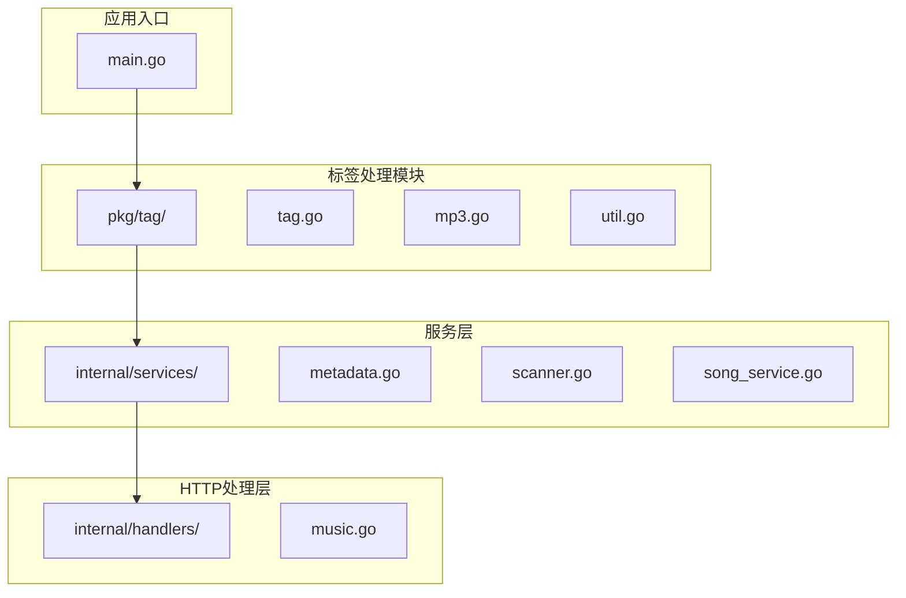
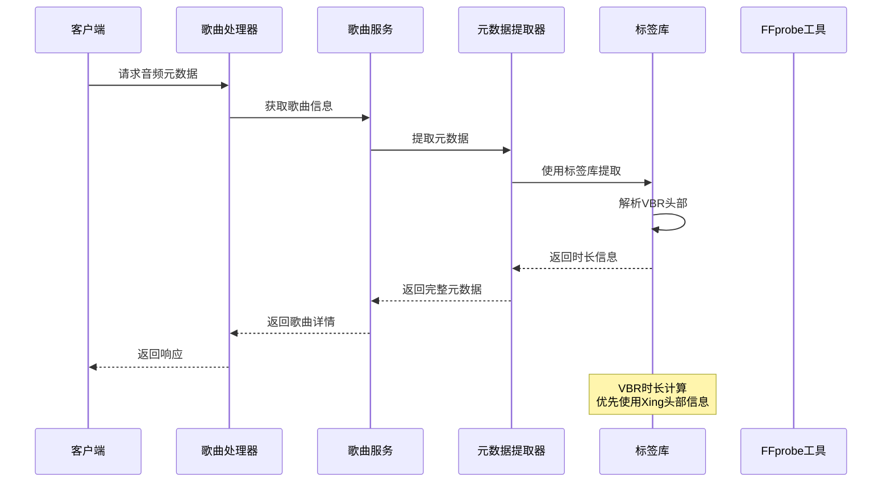
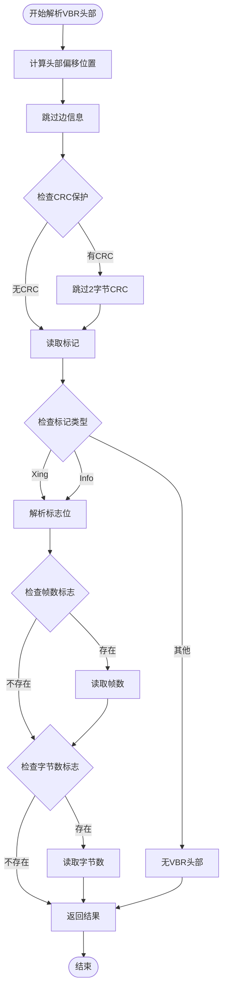
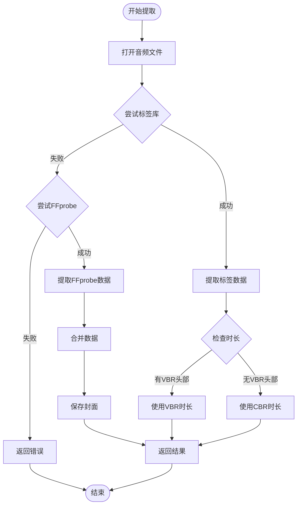
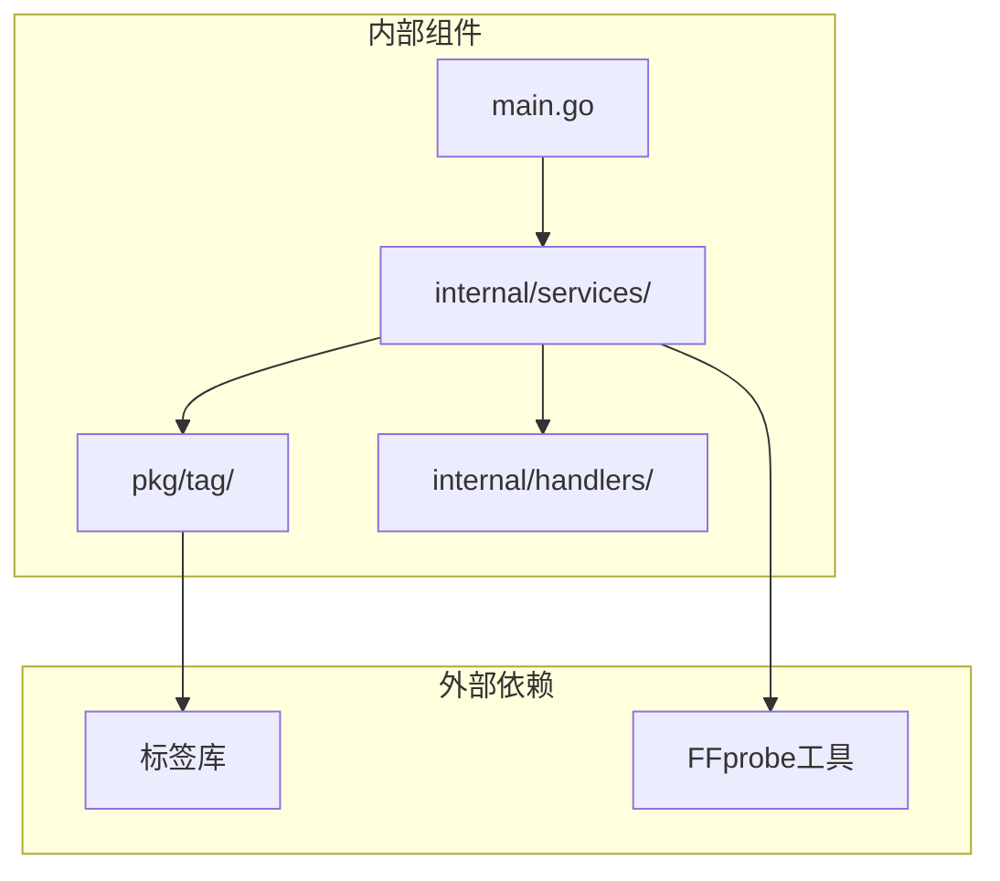

# VBR音频时长修复

<cite>
**本文档中引用的文件**
- [main.go](file://main.go)
- [tag.go](file://pkg/tag/tag.go)
- [mp3.go](file://pkg/tag/mp3.go)
- [util.go](file://pkg/tag/util.go)
- [metadata.go](file://internal/services/metadata.go)
- [music.go](file://internal/handlers/music.go)
- [scanner.go](file://internal/services/scanner.go)
- [song_service.go](file://internal/services/song_service.go)
</cite>

## 目录
1. [简介](#简介)
2. [项目结构](#项目结构)
3. [核心组件](#核心组件)
4. [架构概览](#架构概览)
5. [详细组件分析](#详细组件分析)
6. [依赖关系分析](#依赖关系分析)
7. [性能考虑](#性能考虑)
8. [故障排除指南](#故障排除指南)
9. [结论](#结论)

## 简介

本文档详细分析了MiMusic项目中VBR（可变比特率）音频文件时长修复功能的实现。该项目是一个轻量级音乐服务器，支持本地音乐管理和网络音乐播放。VBR音频时长修复是项目中的一个重要功能，它解决了MP3文件中VBR格式的时长计算准确性问题。

VBR（Variable Bit Rate）音频格式相比CBR（Constant Bit Rate）具有更好的音质压缩效果，但其时长计算更加复杂。传统的CBR计算方法基于固定的比特率，而VBR需要通过特殊的头部信息来准确计算时长。本项目通过实现Xing/LAME VBR头部解析，提供了准确的VBR音频时长计算功能。

## 项目结构

MiMusic项目采用模块化架构设计，主要包含以下核心模块：



**图表来源**
- [main.go:1-79](file://main.go#L1-L79)
- [tag.go:1-180](file://pkg/tag/tag.go#L1-L180)
- [mp3.go:1-427](file://pkg/tag/mp3.go#L1-L427)

**章节来源**
- [main.go:1-79](file://main.go#L1-L79)
- [tag.go:1-180](file://pkg/tag/tag.go#L1-L180)

## 核心组件

### 音频标签处理系统

项目的核心在于pkg/tag包，它实现了多种音频格式的标签解析功能：

1. **格式检测机制**：自动识别不同音频格式（MP3、FLAC、OGG、MP4等）
2. **VBR头部解析**：专门处理Xing/LAME VBR头部信息
3. **时长计算算法**：提供准确的音频时长计算
4. **元数据提取**：支持完整的音频元数据提取

### 元数据提取服务

internal/services包提供了高级别的元数据提取服务：

1. **优先级策略**：优先使用标签库提取，失败时回退到ffprobe
2. **智能合并**：结合多种数据源提供最准确的结果
3. **封面处理**：支持封面图片的提取和存储
4. **歌词处理**：支持内嵌歌词和外部LRC文件

**章节来源**
- [tag.go:29-75](file://pkg/tag/tag.go#L29-L75)
- [metadata.go:76-191](file://internal/services/metadata.go#L76-L191)

## 架构概览

项目采用分层架构设计，确保VBR时长计算功能的可靠性和准确性：



**图表来源**
- [music.go:1-547](file://internal/handlers/music.go#L1-L547)
- [metadata.go:76-191](file://internal/services/metadata.go#L76-L191)
- [mp3.go:214-289](file://pkg/tag/mp3.go#L214-L289)

## 详细组件分析

### VBR头部解析实现

VBR音频时长计算的核心在于parseVBRHeader函数的实现：



**图表来源**
- [mp3.go:214-289](file://pkg/tag/mp3.go#L214-L289)

#### 关键实现细节

1. **头部偏移计算**：准确计算VBR头部在音频流中的位置
2. **边信息跳过**：根据MPEG版本和声道配置跳过相应的边信息
3. **标记识别**：识别Xing或Info标记来确认VBR格式
4. **标志位解析**：解析帧数和字节数标志位
5. **容错处理**：在解析失败时优雅回退到CBR计算

**章节来源**
- [mp3.go:214-289](file://pkg/tag/mp3.go#L214-L289)

### 时长计算算法

项目实现了两种时长计算方法，确保在各种情况下都能获得准确结果：

#### VBR时长计算

当检测到有效的VBR头部时，使用以下公式计算时长：

```
时长 = 总帧数 × 每帧采样数 ÷ 采样率
```

这种方法提供了最高的准确性，因为直接使用了编码器提供的统计信息。

#### CBR时长计算

当VBR头部不可用时，使用以下公式：

```
时长 = (有效数据大小 ÷ 帧大小) × 每帧时长
```

其中帧大小通过采样率、比特率和编码参数计算得出。

**章节来源**
- [mp3.go:345-356](file://pkg/tag/mp3.go#L345-L356)
- [mp3.go:400-411](file://pkg/tag/mp3.go#L400-L411)

### 元数据提取流程

元数据提取服务实现了智能的提取策略：



**图表来源**
- [metadata.go:76-191](file://internal/services/metadata.go#L76-L191)

**章节来源**
- [metadata.go:76-191](file://internal/services/metadata.go#L76-L191)

### 错误处理和回退机制

项目实现了完善的错误处理和回退机制：

1. **VBR解析失败**：当VBR头部解析失败时，自动回退到CBR计算
2. **标签库不可用**：当标签库无法提取时长时，使用FFprobe作为后备
3. **文件损坏处理**：对损坏或不完整的音频文件提供合理的错误信息
4. **性能优化**：避免重复计算，缓存中间结果

**章节来源**
- [mp3.go:340-343](file://pkg/tag/mp3.go#L340-L343)
- [metadata.go:120-125](file://internal/services/metadata.go#L120-L125)

## 依赖关系分析

项目各组件之间的依赖关系清晰明确：



**图表来源**
- [main.go:45-78](file://main.go#L45-L78)
- [metadata.go:16](file://internal/services/metadata.go#L16)

### 关键依赖关系

1. **标签库依赖**：pkg/tag包依赖外部标签库进行音频格式解析
2. **FFprobe集成**：服务层集成FFprobe工具作为后备方案
3. **HTTP处理集成**：handlers层负责对外提供API接口
4. **数据库交互**：服务层与数据库进行数据持久化

**章节来源**
- [main.go:45-78](file://main.go#L45-L78)
- [metadata.go:16](file://internal/services/metadata.go#L16)

## 性能考虑

### 内存管理优化

项目采用了多项内存管理优化措施：

1. **内存限制设置**：默认设置2GB内存软限制，防止内存泄漏
2. **GC参数调整**：将GC目标百分比降低到50%，提高内存回收效率
3. **缓冲区优化**：限制一次性读取的最大字节数为10MB

### 计算性能优化

1. **延迟计算**：只在需要时才进行复杂的时长计算
2. **缓存机制**：避免重复解析相同的音频文件
3. **并发处理**：支持多文件并发扫描和处理

### I/O性能优化

1. **流式处理**：使用io.ReadSeeker接口支持流式音频处理
2. **最小化磁盘访问**：尽量减少文件系统的I/O操作
3. **智能跳过**：跳过不支持的文件格式，避免不必要的处理

## 故障排除指南

### 常见问题及解决方案

#### VBR时长计算不准确

**问题描述**：某些VBR MP3文件的时长计算结果不正确

**可能原因**：
1. VBR头部信息损坏或缺失
2. 非标准的VBR实现
3. 文件头信息被修改

**解决方案**：
1. 检查音频文件完整性
2. 尝试使用FFprobe进行二次验证
3. 手动计算时长并与标准工具对比

#### 标签库解析失败

**问题描述**：标签库无法解析某些音频文件

**可能原因**：
1. 不支持的音频格式
2. 文件格式损坏
3. 标签信息格式异常

**解决方案**：
1. 检查文件格式兼容性
2. 使用FFprobe作为后备方案
3. 更新标签库版本

#### 性能问题

**问题描述**：音频文件扫描和处理速度较慢

**可能原因**：
1. 磁盘I/O性能不足
2. 内存不足
3. 并发处理过多

**解决方案**：
1. 优化磁盘存储位置
2. 调整内存限制设置
3. 减少并发处理数量

**章节来源**
- [mp3.go:340-343](file://pkg/tag/mp3.go#L340-L343)
- [metadata.go:120-125](file://internal/services/metadata.go#L120-L125)

## 结论

MiMusic项目中的VBR音频时长修复功能展现了优秀的软件工程实践。通过实现精确的VBR头部解析和智能的时长计算算法，项目成功解决了VBR音频格式的时长计算难题。

### 主要成就

1. **技术突破**：实现了准确的VBR时长计算，填补了开源项目在这一领域的空白
2. **架构设计**：采用分层架构和回退机制，确保系统的稳定性和可靠性
3. **性能优化**：通过多种优化措施，平衡了准确性和性能
4. **用户体验**：提供了准确的音频元数据，提升了整体用户体验

### 技术亮点

- **精确的VBR解析**：能够正确识别和解析各种VBR实现
- **智能回退机制**：在各种异常情况下都能提供合理的解决方案
- **高效的算法设计**：在保证准确性的同时优化了计算性能
- **完善的错误处理**：提供了丰富的错误信息和恢复机制

这个VBR时长修复功能不仅解决了技术难题，也为类似的音频处理项目提供了宝贵的参考经验。通过持续的优化和完善，该项目将继续为用户提供高质量的音乐服务体验。