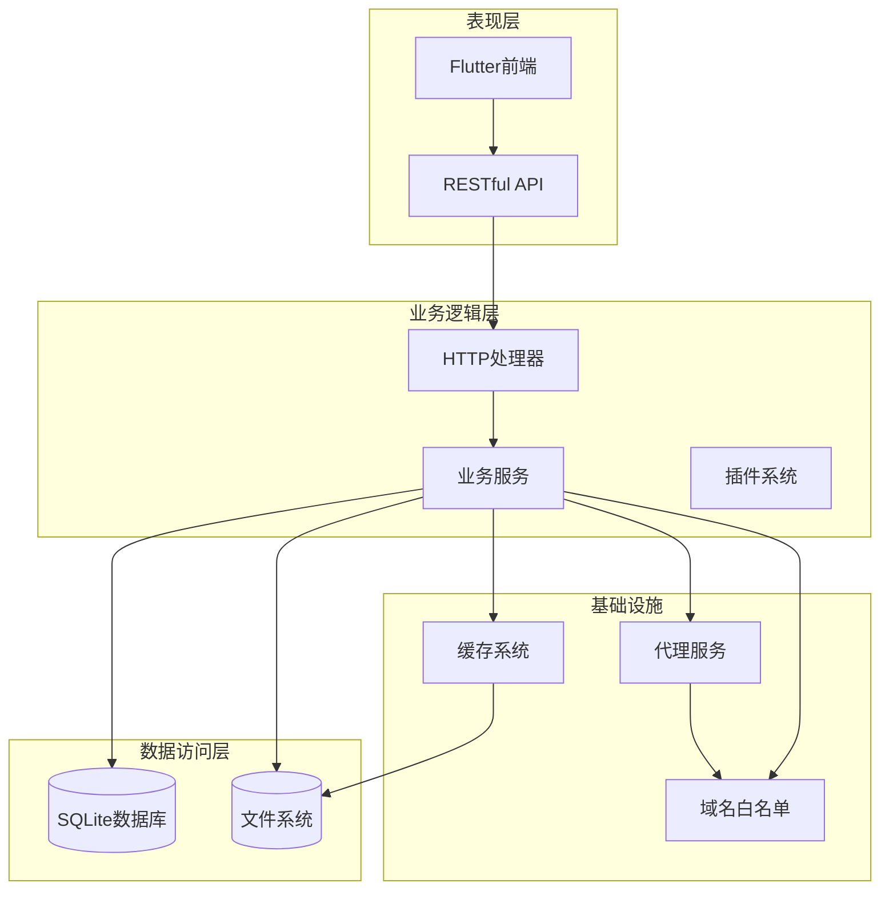
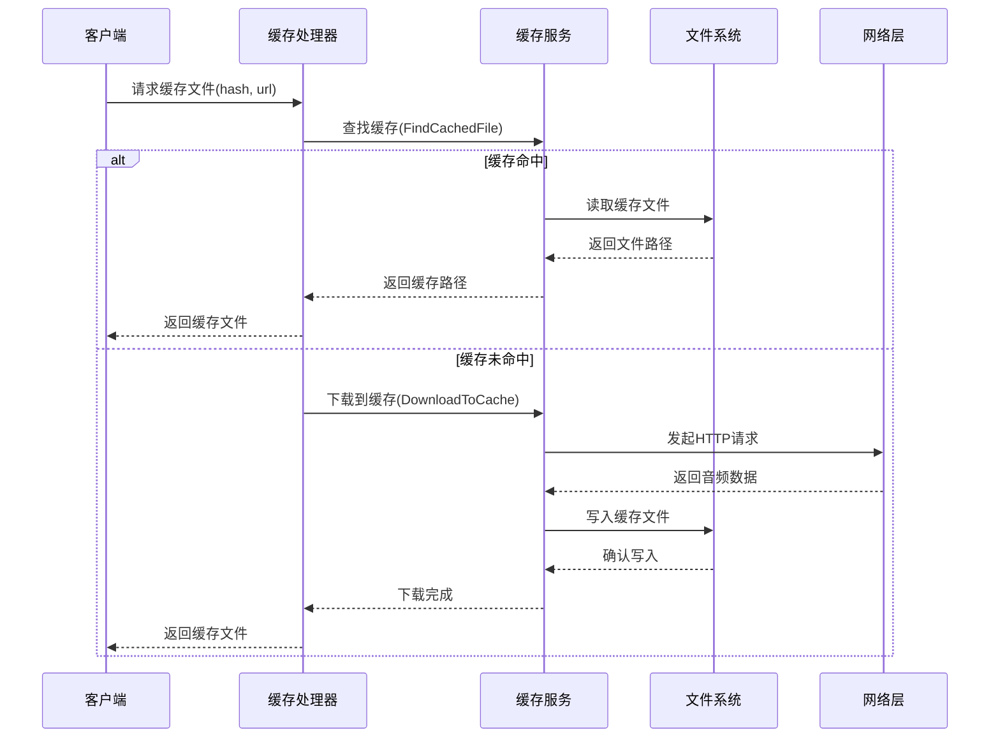
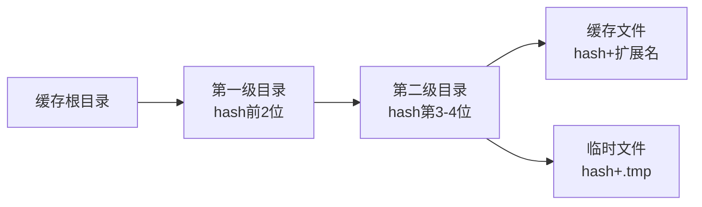
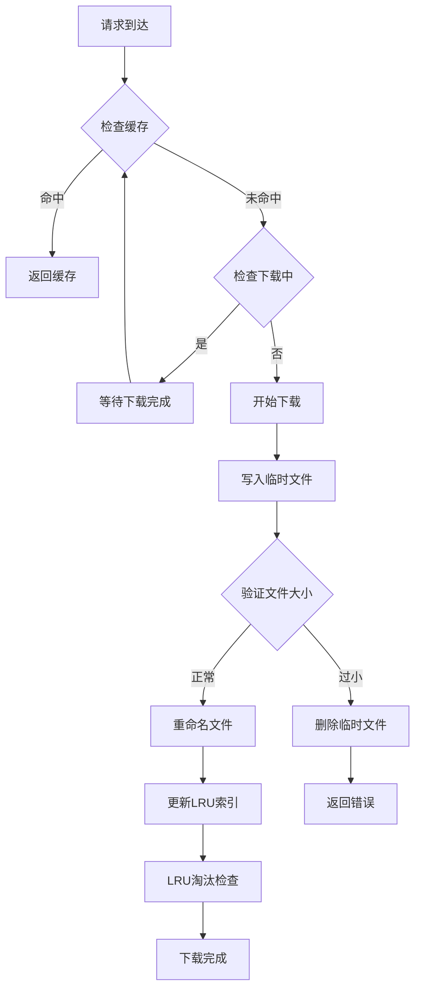
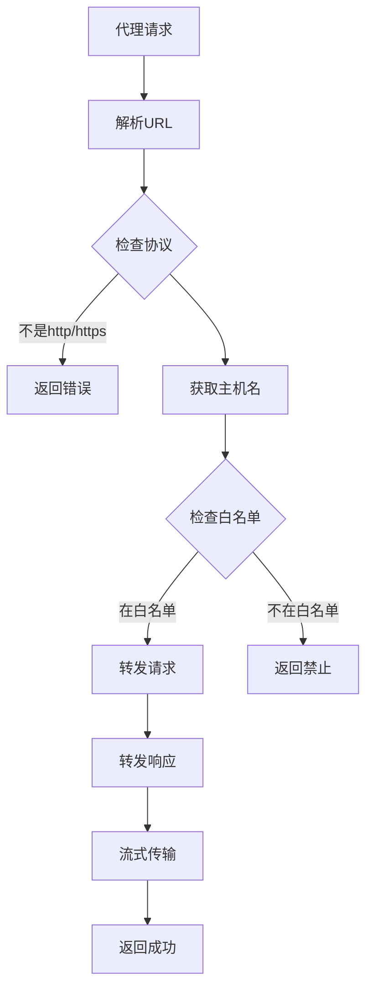
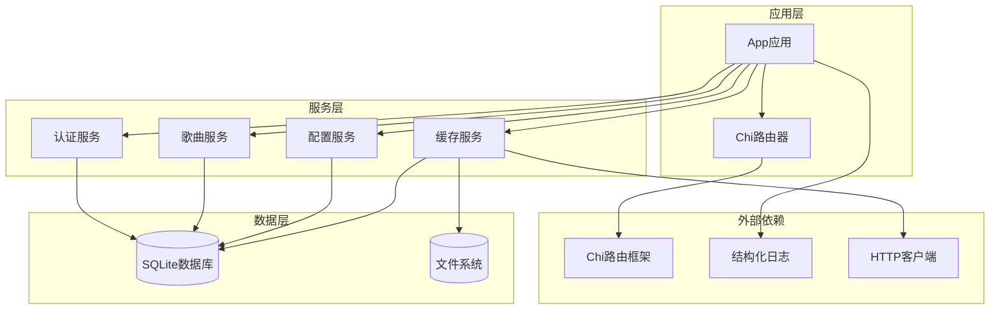

# Windows网络缓存修复

<cite>
**本文档引用的文件**
- [main.go](file://main.go)
- [app.go](file://internal/app/app.go)
- [cache.go](file://internal/handlers/cache.go)
- [cache_service.go](file://internal/services/cache_service.go)
- [proxy.go](file://internal/handlers/proxy.go)
- [whitelist.go](file://internal/services/whitelist.go)
- [cache_manager.dart](file://frontend/lib/features/settings/presentation/widgets/cache_manager.dart)
</cite>

## 目录
1. [简介](#简介)
2. [项目结构](#项目结构)
3. [核心组件](#核心组件)
4. [架构概览](#架构概览)
5. [详细组件分析](#详细组件分析)
6. [依赖关系分析](#依赖关系分析)
7. [性能考虑](#性能考虑)
8. [故障排除指南](#故障排除指南)
9. [结论](#结论)

## 简介

本项目是一个轻量级音乐服务器，提供了完整的音乐管理、网络歌曲播放、电台收听和歌单管理功能。本文档重点关注Windows平台上的网络缓存修复机制，这是一个关键的系统优化特性，旨在解决Windows环境下常见的网络缓存问题。

该项目采用Go语言开发，结合Flutter前端界面，支持多平台部署（Windows、macOS、Linux、Android、iOS）。其核心优势在于：

- **智能缓存管理**：基于内容寻址的分布式缓存系统，支持LRU淘汰策略
- **Windows优化**：专门针对Windows平台的文件系统和网络特性进行优化
- **安全防护**：内置SSRF防护和域名白名单机制
- **高性能代理**：支持流式传输和Range请求

## 项目结构

项目采用典型的分层架构设计，主要分为以下几个层次：



**图表来源**
- [main.go:45-78](file://main.go#L45-L78)
- [app.go:78-285](file://internal/app/app.go#L78-L285)

**章节来源**
- [main.go:1-79](file://main.go#L1-L79)
- [app.go:1-486](file://internal/app/app.go#L1-L486)

## 核心组件

### 缓存服务系统

缓存服务是整个系统的核心组件之一，专门负责音乐文件的缓存管理。该系统具有以下关键特性：

- **内容寻址缓存**：使用文件内容的哈希值作为缓存键，确保内容变更时自动失效
- **分布式目录结构**：将缓存文件按哈希值分层存储，避免单目录文件过多
- **并发安全**：支持多线程并发访问，内置去重机制防止重复下载
- **智能淘汰**：基于LRU算法的智能淘汰策略，自动控制缓存大小

### 代理服务系统

代理服务用于解决跨域问题和网络访问限制，特别适用于Windows环境下的网络请求：

- **CORS解决方案**：通过服务器端代理绕过浏览器同源策略限制
- **域名白名单**：内置安全机制，防止SSRF攻击
- **流式传输**：支持音频流的实时传输和Range请求
- **重定向处理**：智能处理HTTP重定向，确保资源正确获取

### Windows特定优化

针对Windows平台的特殊优化包括：

- **文件重命名处理**：解决Windows下文件句柄占用导致的重命名失败问题
- **用户代理设置**：使用Windows兼容的User-Agent字符串
- **路径处理优化**：针对Windows文件系统的特殊性进行优化

**章节来源**
- [cache_service.go:48-83](file://internal/services/cache_service.go#L48-L83)
- [proxy.go:15-35](file://internal/handlers/proxy.go#L15-L35)

## 架构概览

系统采用模块化的微服务架构，各组件之间通过清晰的接口进行通信：



**图表来源**
- [cache.go:42-115](file://internal/handlers/cache.go#L42-L115)
- [cache_service.go:149-181](file://internal/services/cache_service.go#L149-L181)

## 详细组件分析

### 缓存服务实现

缓存服务的设计充分考虑了Windows平台的特殊需求：

#### 目录结构设计



这种两级目录结构的设计解决了Windows系统中单目录文件过多的问题，提高了文件系统的性能。

#### 并发控制机制

缓存服务使用双重锁机制确保并发安全性：



**图表来源**
- [cache_service.go:149-297](file://internal/services/cache_service.go#L149-L297)

#### LRU淘汰算法

缓存服务实现了高效的LRU（最近最少使用）淘汰算法：

```mermaid
classDiagram
class CacheService {
+string cacheDir
+map~string,inflightDownload~ inflight
+map~string,time.Time~ lruIndex
+DownloadToCache(hash, url) error
+EvictLRU() void
+FindCachedFile(hash) (string, bool)
+TouchCache(hash, path) void
}
class inflightDownload {
+chan struct{} done
+error err
}
class lruMaxHeap {
+Len() int
+Less(i, j) bool
+Swap(i, j) void
+Push(x) void
+Pop() interface{}
}
CacheService --> inflightDownload : "管理下载状态"
CacheService --> lruMaxHeap : "LRU淘汰"
```

**图表来源**
- [cache_service.go:48-58](file://internal/services/cache_service.go#L48-L58)
- [cache_service.go:511-534](file://internal/services/cache_service.go#L511-L534)

### 代理服务实现

代理服务提供了安全的跨域资源访问能力：

#### 域名白名单机制



**图表来源**
- [proxy.go:50-115](file://internal/handlers/proxy.go#L50-L115)
- [whitelist.go:8-32](file://internal/services/whitelist.go#L8-L32)

#### 安全防护措施

代理服务实现了多层次的安全防护：

1. **协议限制**：仅允许HTTP和HTTPS协议
2. **域名过滤**：内置域名白名单机制
3. **IP地址检查**：防止内网地址访问
4. **重定向控制**：限制重定向层级，防止循环重定向

**章节来源**
- [cache_service.go:85-126](file://internal/services/cache_service.go#L85-L126)
- [cache_service.go:540-644](file://internal/services/cache_service.go#L540-L644)
- [proxy.go:37-144](file://internal/handlers/proxy.go#L37-L144)
- [whitelist.go:1-54](file://internal/services/whitelist.go#L1-L54)

## 依赖关系分析

系统各组件之间的依赖关系如下：



**图表来源**
- [app.go:30-48](file://internal/app/app.go#L30-L48)
- [cache_service.go:65-83](file://internal/services/cache_service.go#L65-L83)

**章节来源**
- [app.go:16-28](file://internal/app/app.go#L16-L28)
- [cache_service.go:3-15](file://internal/services/cache_service.go#L3-L15)

## 性能考虑

### Windows平台优化

针对Windows平台的性能优化主要包括：

1. **文件系统优化**：使用两级目录结构避免单目录文件过多
2. **并发处理**：通过去重机制防止重复下载，提高资源利用率
3. **内存管理**：合理设置Go运行时参数，优化内存使用
4. **网络请求**：使用合适的User-Agent和超时设置

### 缓存策略优化

缓存系统采用了多种优化策略：

- **LRU淘汰**：使用最大堆算法高效实现LRU淘汰
- **智能预加载**：支持预加载功能提升用户体验
- **并发安全**：通过互斥锁和通道确保并发安全
- **错误处理**：完善的错误处理和恢复机制

## 故障排除指南

### 常见问题及解决方案

#### 缓存文件无法访问

**问题描述**：Windows下缓存文件无法正常访问或播放

**可能原因**：
1. 文件句柄被占用导致重命名失败
2. 权限不足无法写入缓存目录
3. 磁盘空间不足

**解决方案**：
1. 确保缓存目录有适当的读写权限
2. 检查磁盘空间是否充足
3. 重启应用释放文件句柄

#### 网络请求失败

**问题描述**：代理请求或缓存下载失败

**可能原因**：
1. 目标域名不在白名单中
2. 网络连接不稳定
3. 服务器返回错误状态码

**解决方案**：
1. 检查目标域名是否在允许列表中
2. 验证网络连接状态
3. 查看服务器日志获取详细错误信息

#### 缓存大小超出限制

**问题描述**：缓存空间不足导致新文件无法下载

**解决方案**：
1. 清理不需要的缓存文件
2. 调整最大缓存大小限制
3. 实施更激进的LRU淘汰策略

**章节来源**
- [cache_service.go:256-297](file://internal/services/cache_service.go#L256-L297)
- [proxy.go:70-76](file://internal/handlers/proxy.go#L70-L76)

## 结论

本项目的Windows网络缓存修复机制体现了现代Web应用的最佳实践，通过以下关键特性解决了Windows平台的特殊挑战：

1. **智能缓存管理**：基于内容寻址的分布式缓存系统，支持高效的LRU淘汰
2. **并发安全保证**：完善的并发控制机制，确保多线程环境下的数据一致性
3. **Windows优化**：针对Windows文件系统和网络特性的专门优化
4. **安全防护**：内置的SSRF防护和域名白名单机制
5. **性能优化**：通过多种算法和策略确保系统的高性能运行

该系统不仅解决了Windows平台的网络缓存问题，还为其他平台提供了可复用的架构模式和最佳实践。通过模块化设计和清晰的接口定义，系统具有良好的可维护性和扩展性，能够适应未来的需求变化和技术发展。