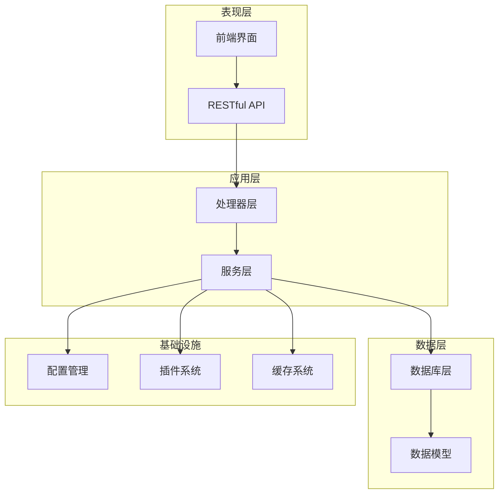
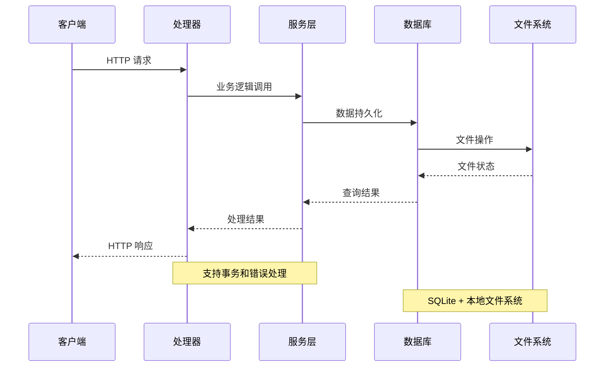
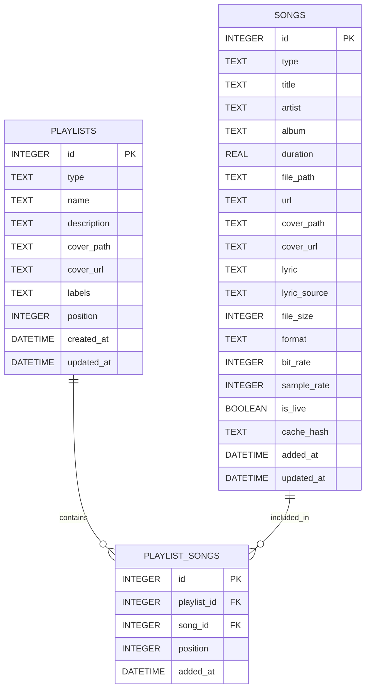
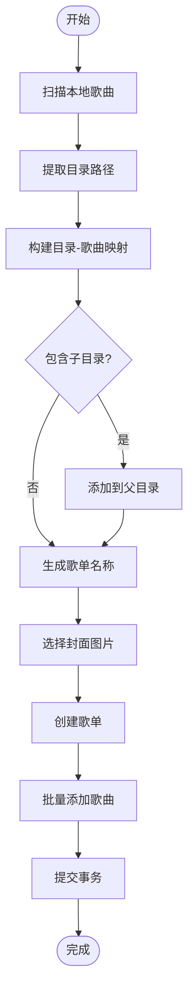
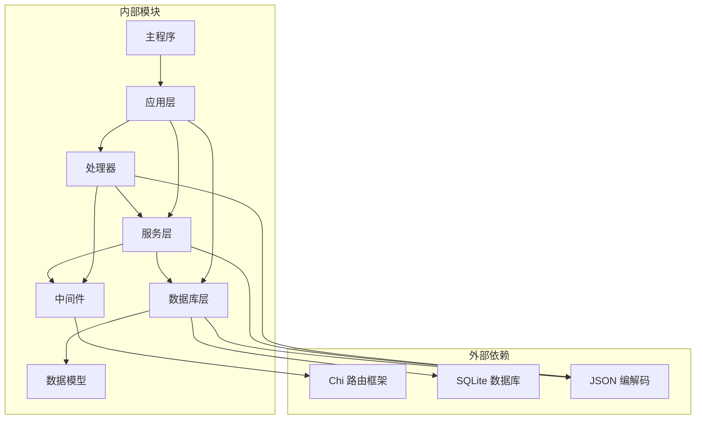
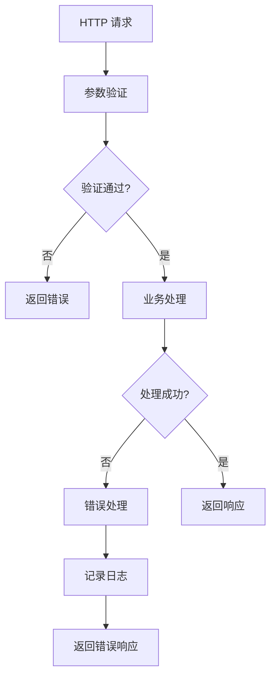

# 增强的歌单管理

<cite>
**本文档引用的文件**
- [main.go](file://main.go)
- [app.go](file://internal/app/app.go)
- [routers.go](file://internal/app/routers.go)
- [playlist.go](file://internal/handlers/playlist.go)
- [playlist_service.go](file://internal/services/playlist_service.go)
- [sqlite_playlist.go](file://internal/database/sqlite_playlist.go)
- [sqlite_playlist_song.go](file://internal/database/sqlite_playlist_song.go)
- [schema.go](file://internal/database/schema.go)
- [models.go](file://internal/models/models.go)
- [api_bridge.go](file://internal/jsplugin/api_bridge.go)
</cite>

## 目录
1. [简介](#简介)
2. [项目结构](#项目结构)
3. [核心组件](#核心组件)
4. [架构概览](#架构概览)
5. [详细组件分析](#详细组件分析)
6. [依赖关系分析](#依赖关系分析)
7. [性能考虑](#性能考虑)
8. [故障排除指南](#故障排除指南)
9. [结论](#结论)

## 简介

MiMusic 是一个轻量级的音乐服务器，专注于本地音乐管理和增强的歌单管理功能。该项目提供了完整的音乐播放器解决方案，包括本地音乐扫描、网络歌曲播放、电台收听以及智能化的歌单管理。

本文档深入分析了增强的歌单管理系统，该系统支持多种歌单类型、智能目录结构识别、批量操作、封面管理等功能。系统采用分层架构设计，确保了良好的可维护性和扩展性。

## 项目结构

MiMusic 项目采用清晰的分层架构，主要分为以下几个层次：

**图表来源**
- [main.go:45-78](file://main.go#L45-L78)
- [app.go:30-48](file://internal/app/app.go#L30-L48)

**章节来源**
- [main.go:1-79](file://main.go#L1-L79)
- [app.go:78-285](file://internal/app/app.go#L78-L285)

## 核心组件

### 应用程序入口

应用程序从 `main.go` 启动，初始化配置、数据库连接，并启动 HTTP 服务器。应用支持环境变量配置，包括管理员凭据、监听端口和数据库路径。

### 路由系统

路由系统基于 Chi 框架构建，提供 RESTful API 接口。所有歌单管理相关的接口都位于 `/api/v1/playlists` 路径下，支持认证中间件保护。

### 数据模型

系统定义了完整的数据模型，包括歌曲、歌单、歌单-歌曲关联等实体。每个实体都有相应的验证逻辑和业务规则。

**章节来源**
- [models.go:127-187](file://internal/models/models.go#L127-L187)
- [schema.go:29-53](file://internal/database/schema.go#L29-L53)

## 架构概览

增强的歌单管理系统采用经典的三层架构模式：

**图表来源**
- [playlist.go:138-153](file://internal/handlers/playlist.go#L138-L153)
- [playlist_service.go:25-38](file://internal/services/playlist_service.go#L25-L38)

## 详细组件分析

### 歌单处理器 (PlaylistHandler)

歌单处理器负责处理所有歌单相关的 HTTP 请求，实现了完整的 CRUD 操作和高级功能：

#### 核心功能

1. **基本操作**
   - 创建歌单 (`POST /playlists`)
   - 获取歌单列表 (`GET /playlists`)
   - 获取单个歌单 (`GET /playlists/{id}`)
   - 更新歌单 (`PUT /playlists/{id}`)
   - 删除歌单 (`DELETE /playlists/{id}`)

2. **高级功能**
   - 批量删除歌单
   - 自动创建歌单（基于目录结构）
   - 歌单重新排序
   - 歌曲管理（添加、移除、重新排序）

3. **封面管理**
   - 上传歌单封面图片
   - 支持多种图片格式
   - 自动缩略图生成

**章节来源**
- [playlist.go:30-93](file://internal/handlers/playlist.go#L30-L93)
- [playlist.go:126-256](file://internal/handlers/playlist.go#L126-L256)
- [playlist.go:585-650](file://internal/handlers/playlist.go#L585-L650)

### 歌单服务 (PlaylistService)

服务层封装了所有业务逻辑，提供了线程安全的操作接口：

#### 业务规则

1. **内置歌单保护**
   - 内置歌单（如"收藏"、"电台收藏"）不可删除
   - 内置歌单只允许更新封面信息
   - 自动创建的歌单具有特殊标签

2. **类型约束**
   - 普通歌单只能包含本地和网络歌曲
   - 电台歌单只能包含电台/广播
   - 自动创建的歌单名称智能生成

3. **事务处理**
   - 所有写操作都在事务中执行
   - 批量操作优化性能
   - 错误回滚保证数据一致性

**章节来源**
- [playlist_service.go:58-86](file://internal/services/playlist_service.go#L58-L86)
- [playlist_service.go:96-117](file://internal/services/playlist_service.go#L96-L117)
- [playlist_service.go:274-283](file://internal/services/playlist_service.go#L274-L283)

### 数据库层

数据库层使用 SQLite 作为主要存储引擎，设计了高效的查询和索引策略：

#### 数据库设计

**图表来源**
- [schema.go:29-53](file://internal/database/schema.go#L29-L53)

#### 查询优化

1. **索引策略**
   - 歌单类型索引
   - 歌单标签 JSON 索引
   - 歌单-歌曲关联索引
   - 歌曲类型和标题索引

2. **智能查询**
   - 支持 JSON 标签查询
   - 关键词搜索支持
   - 分页查询优化
   - 排序性能优化

**章节来源**
- [sqlite_playlist.go:183-279](file://internal/database/sqlite_playlist.go#L183-L279)
- [sqlite_playlist_song.go:45-85](file://internal/database/sqlite_playlist_song.go#L45-L85)

### 自动歌单创建算法

系统提供了智能的自动歌单创建功能，能够根据音乐文件的目录结构自动生成歌单：

**图表来源**
- [sqlite_playlist.go:367-540](file://internal/database/sqlite_playlist.go#L367-L540)

**章节来源**
- [sqlite_playlist.go:542-703](file://internal/database/sqlite_playlist.go#L542-L703)

## 依赖关系分析

### 组件依赖图

**图表来源**
- [app.go:3-28](file://internal/app/app.go#L3-L28)

### 关键依赖关系

1. **处理器到服务层**
   - 每个处理器都依赖对应的服务层实例
   - 服务层提供业务逻辑封装

2. **服务层到数据库层**
   - 服务层通过接口抽象访问数据库
   - 支持测试替身和模拟对象

3. **应用层到配置层**
   - 应用程序管理全局配置
   - 配置影响所有组件行为

**章节来源**
- [routers.go:31-164](file://internal/app/routers.go#L31-L164)
- [app.go:162-180](file://internal/app/app.go#L162-L180)

## 性能考虑

### 查询性能优化

1. **索引策略**
   - 在 playlists 表上建立类型和标签索引
   - 在 playlist_songs 表上建立复合索引
   - 使用 JSON 函数优化标签查询

2. **查询优化**
   - 使用 LEFT JOIN 优化歌单统计查询
   - 分页查询避免大数据集加载
   - 预编译语句减少解析开销

3. **批量操作**
   - 批量插入歌单-歌曲关联
   - 事务包装确保原子性
   - 限制批量大小避免内存溢出

### 缓存策略

1. **内存缓存**
   - 配置信息缓存
   - 插件元数据缓存
   - 经常访问的数据缓存

2. **磁盘缓存**
   - 音乐文件缓存
   - 封面图片缓存
   - 元数据缓存

### 并发处理

1. **线程安全**
   - 数据库连接池管理
   - 服务层状态无共享
   - 原子操作保证

2. **异步处理**
   - 插件异步加载
   - 扫描任务异步执行
   - 缓存后台更新

## 故障排除指南

### 常见问题诊断

1. **歌单操作失败**
   - 检查歌单类型是否正确
   - 验证歌曲类型约束
   - 确认权限和认证状态

2. **自动创建失败**
   - 检查音乐目录可访问性
   - 验证文件权限
   - 查看日志获取详细错误信息

3. **性能问题**
   - 分析慢查询日志
   - 检查索引使用情况
   - 监控数据库连接池

### 错误处理机制

系统实现了完善的错误处理机制：

**图表来源**
- [playlist.go:140-153](file://internal/handlers/playlist.go#L140-L153)

**章节来源**
- [playlist.go:72-85](file://internal/handlers/playlist.go#L72-L85)
- [playlist_service.go:27-38](file://internal/services/playlist_service.go#L27-L38)

## 结论

增强的歌单管理系统展现了现代 Go 项目的最佳实践：

1. **架构清晰**：分层设计确保了良好的关注点分离
2. **功能完整**：支持从基础 CRUD 到高级智能功能的完整歌单管理
3. **性能优化**：通过索引、缓存和批量操作提升系统性能
4. **可扩展性**：插件系统和中间件机制支持功能扩展
5. **可靠性**：事务处理、错误恢复和监控机制保证系统稳定

该系统为音乐播放器提供了强大的歌单管理能力，支持智能化的音乐组织和便捷的用户交互体验。通过模块化的架构设计，开发者可以轻松扩展新功能或集成第三方服务。