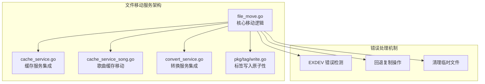
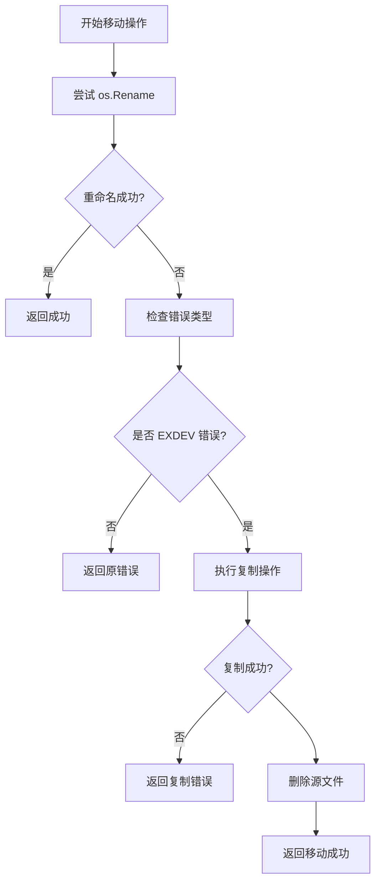
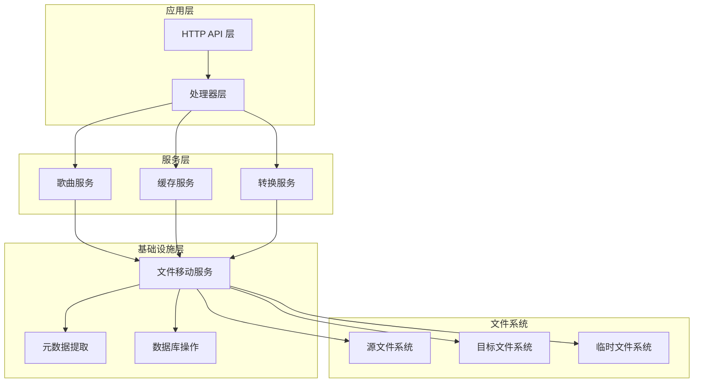
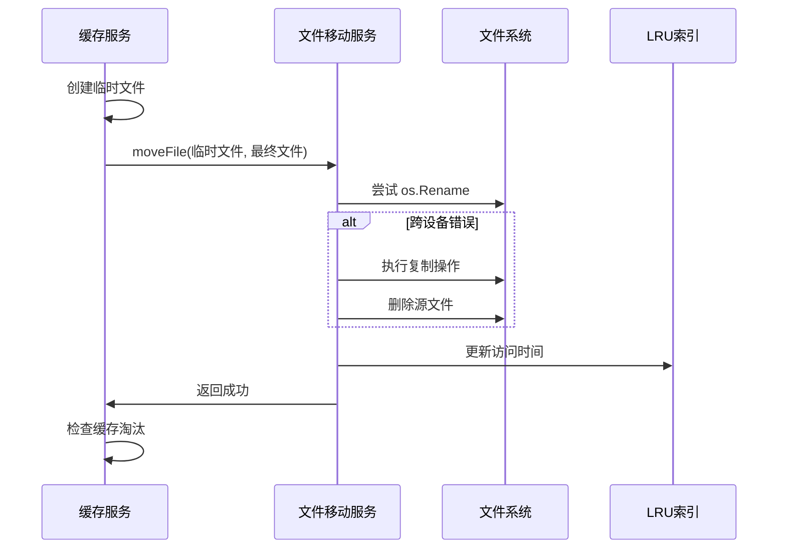
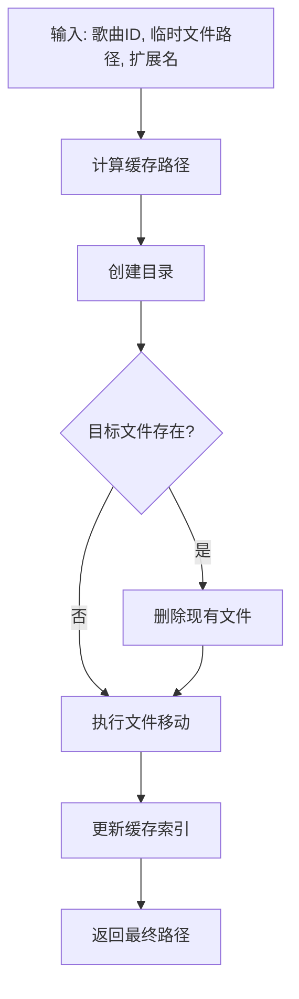
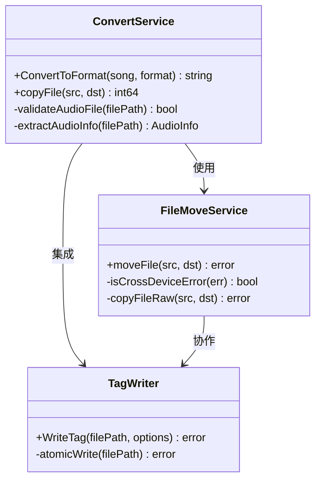
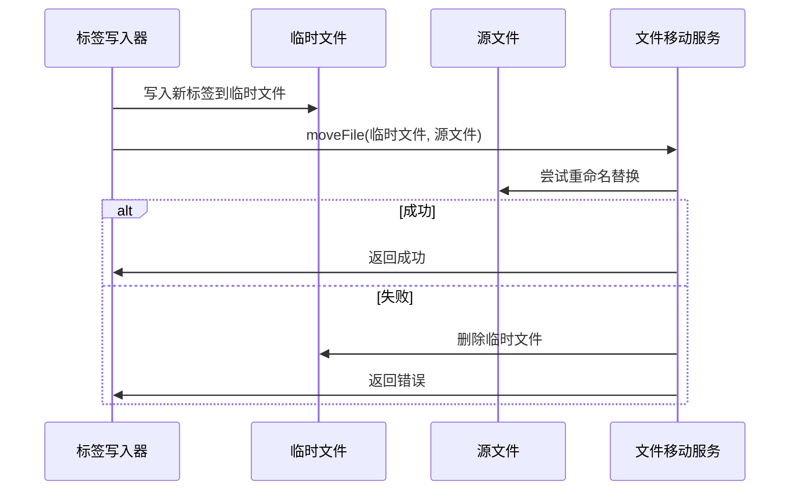
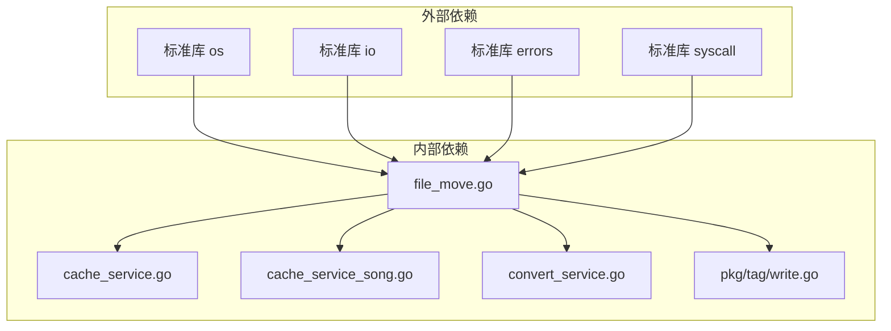
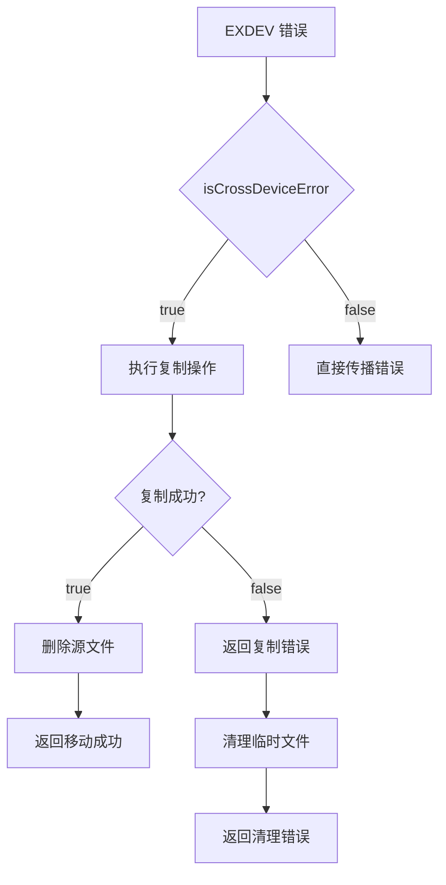

# 文件移动服务

<cite>
**本文档引用的文件**
- [file_move.go](file://internal/services/file_move.go)
- [cache_service.go](file://internal/services/cache_service.go)
- [cache_service_song.go](file://internal/services/cache_service_song.go)
- [convert_service.go](file://internal/services/convert_service.go)
- [AGENTS.md](file://AGENTS.md)
- [write.go](file://pkg/tag/write.go)
</cite>

## 目录
1. [简介](#简介)
2. [项目结构](#项目结构)
3. [核心组件](#核心组件)
4. [架构概览](#架构概览)
5. [详细组件分析](#详细组件分析)
6. [依赖关系分析](#依赖关系分析)
7. [性能考虑](#性能考虑)
8. [故障排除指南](#故障排除指南)
9. [结论](#结论)

## 简介

文件移动服务是 mimusic 音乐应用中的核心基础设施组件，专门处理跨设备文件系统操作和原子性文件移动。该服务解决了操作系统层面的跨设备重命名陷阱（EXDEV 错误），确保文件在不同文件系统之间安全可靠地移动。

主要功能包括：
- 跨设备文件移动的智能回退机制
- 原子性文件操作保证
- 错误处理和恢复机制
- 与缓存系统的集成
- 与转换服务的协作

## 项目结构

文件移动服务位于 `internal/services/` 目录下，采用模块化设计：

**图表来源**
- [file_move.go:1-55](file://internal/services/file_move.go#L1-L55)
- [cache_service.go:278-305](file://internal/services/cache_service.go#L278-L305)
- [cache_service_song.go:285-310](file://internal/services/cache_service_song.go#L285-L310)

## 核心组件

### 文件移动核心逻辑

文件移动服务的核心是 `moveFile` 函数，它实现了智能的跨设备文件移动：

**图表来源**
- [file_move.go:10-24](file://internal/services/file_move.go#L10-L24)

### 错误检测机制

服务内置了精确的错误检测逻辑：

- **EXDEV 错误识别**：通过 `os.LinkError` 和 `syscall.EXDEV` 精确识别跨设备重命名错误
- **错误类型分类**：区分可恢复的跨设备错误和其他不可恢复的文件系统错误
- **智能回退策略**：仅在特定错误条件下执行复制回退

**章节来源**
- [file_move.go:26-32](file://internal/services/file_move.go#L26-L32)

## 架构概览

文件移动服务在整个应用架构中扮演着关键的基础设施角色：

**图表来源**
- [cache_service.go:278-305](file://internal/services/cache_service.go#L278-L305)
- [cache_service_song.go:285-310](file://internal/services/cache_service_song.go#L285-L310)

## 详细组件分析

### 缓存服务中的文件移动

缓存服务是文件移动服务最重要的消费者之一：

**图表来源**
- [cache_service.go:278-305](file://internal/services/cache_service.go#L278-L305)

#### 关键特性

1. **原子性保证**：通过临时文件和重命名操作确保文件移动的原子性
2. **错误恢复**：在跨设备错误时自动回退到复制操作
3. **LRU集成**：移动后自动更新缓存访问时间索引
4. **内存管理**：使用最大堆算法高效管理缓存淘汰

**章节来源**
- [cache_service.go:278-305](file://internal/services/cache_service.go#L278-L305)
- [cache_service.go:559-663](file://internal/services/cache_service.go#L559-L663)

### 歌曲缓存移动

歌曲缓存移动是缓存服务的一个特化实现：

**图表来源**
- [cache_service_song.go:285-310](file://internal/services/cache_service_song.go#L285-L310)

**章节来源**
- [cache_service_song.go:285-310](file://internal/services/cache_service_song.go#L285-L310)

### 转换服务集成

转换服务利用文件移动服务进行高质量音频文件的处理：

**图表来源**
- [convert_service.go:833-854](file://internal/services/convert_service.go#L833-L854)
- [file_move.go:10-24](file://internal/services/file_move.go#L10-L24)

**章节来源**
- [convert_service.go:833-854](file://internal/services/convert_service.go#L833-L854)

### 标签写入的原子性

标签写入服务提供了文件移动的另一个重要应用场景：

**图表来源**
- [write.go:44-58](file://pkg/tag/write.go#L44-L58)

**章节来源**
- [write.go:44-58](file://pkg/tag/write.go#L44-L58)

## 依赖关系分析

文件移动服务的依赖关系相对简单但功能强大：

**图表来源**
- [file_move.go:3-8](file://internal/services/file_move.go#L3-L8)

### 错误传播路径

文件移动服务的错误处理遵循严格的传播规则：

**图表来源**
- [file_move.go:16-24](file://internal/services/file_move.go#L16-L24)

**章节来源**
- [file_move.go:16-24](file://internal/services/file_move.go#L16-L24)

## 性能考虑

文件移动服务在设计时充分考虑了性能优化：

### 内存使用优化

1. **流式复制**：使用 `io.Copy` 进行流式文件复制，避免大文件内存占用
2. **最大堆算法**：LRU 淘汰使用最大堆算法，时间复杂度 O(n log k)，其中 k 为候选数量
3. **内存索引**：LRU 访问时间使用内存映射，避免频繁的文件系统查询

### I/O 操作优化

1. **原子性保证**：通过重命名操作确保文件移动的原子性，避免部分写入
2. **错误恢复**：在跨设备错误时自动回退到复制操作，确保数据完整性
3. **缓存友好**：移动后自动更新访问时间，优化后续访问性能

### 并发处理

1. **并发下载**：缓存服务支持并发下载，使用 `inflight` 映射避免重复下载
2. **等待机制**：使用通道（channel）实现下载完成通知，避免轮询开销
3. **异步回调**：下载完成后异步触发回调，不阻塞主流程

## 故障排除指南

### 常见问题及解决方案

#### 跨设备重命名错误 (EXDEV)

**问题症状**：
- 文件移动操作返回 `cross-device link` 错误
- 缓存下载过程中出现文件移动失败

**诊断方法**：
1. 检查源文件和目标文件是否在同一文件系统
2. 验证文件系统权限设置
3. 确认磁盘空间充足

**解决方案**：
- 系统自动回退到复制操作
- 确保有足够的磁盘空间进行复制
- 检查文件锁定状态

#### 文件移动失败

**问题症状**：
- 文件移动操作失败但没有明确错误信息
- 缓存文件创建后无法正常访问

**诊断方法**：
1. 检查临时文件是否存在
2. 验证目标目录权限
3. 确认文件系统完整性

**解决方案**：
- 手动清理临时文件
- 重新执行文件移动操作
- 检查磁盘空间和权限

#### LRU 淘汰异常

**问题症状**：
- 缓存空间持续增长
- LRU 淘汰算法失效

**诊断方法**：
1. 检查 LRU 索引完整性
2. 验证缓存目录结构
3. 确认文件访问时间更新

**解决方案**：
- 重新加载 LRU 索引
- 手动清理过期缓存
- 调整缓存大小配置

**章节来源**
- [AGENTS.md:137-144](file://AGENTS.md#L137-L144)

## 结论

文件移动服务是 mimusic 应用中不可或缺的基础设施组件，它通过智能的跨设备文件移动机制解决了现代文件系统中的核心问题。该服务的设计体现了以下关键原则：

1. **可靠性**：通过精确的错误检测和智能回退机制确保操作的可靠性
2. **性能**：采用流式处理和内存优化算法保证高效的文件操作
3. **原子性**：通过临时文件和重命名操作确保数据的一致性
4. **可维护性**：清晰的模块化设计和完善的错误处理机制

文件移动服务的成功实施为整个应用的稳定运行奠定了坚实基础，特别是在缓存管理和文件转换等关键场景中发挥着重要作用。其设计模式和实现策略为类似的应用开发提供了宝贵的参考价值。