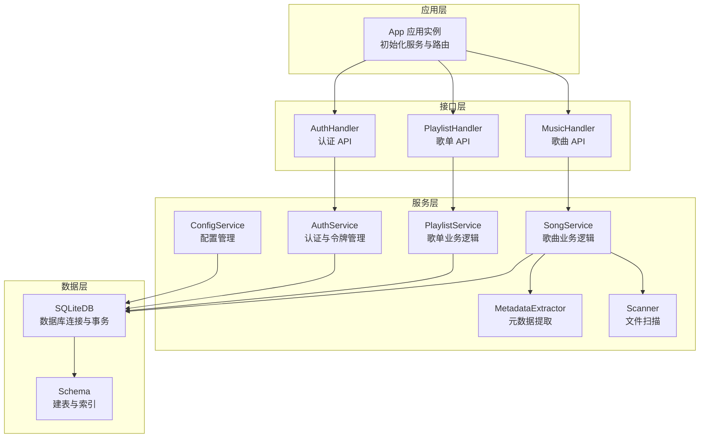
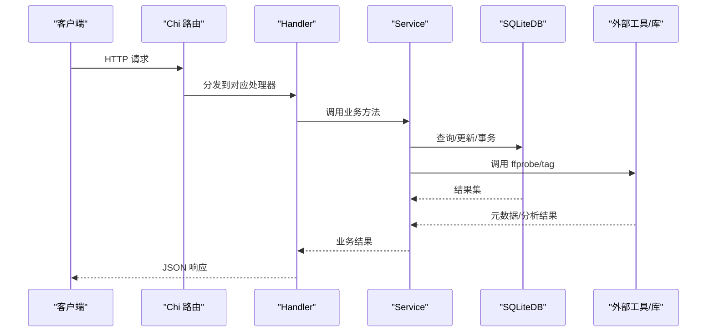
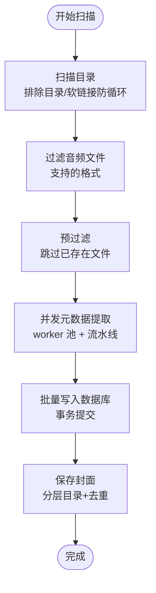
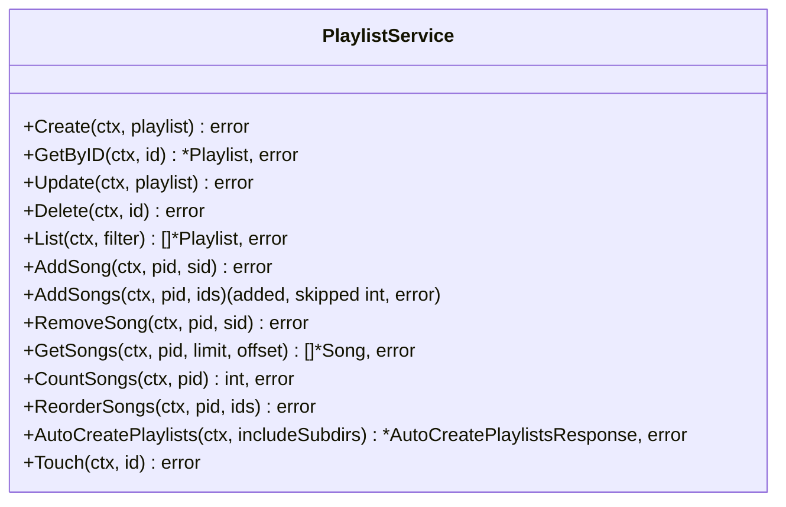
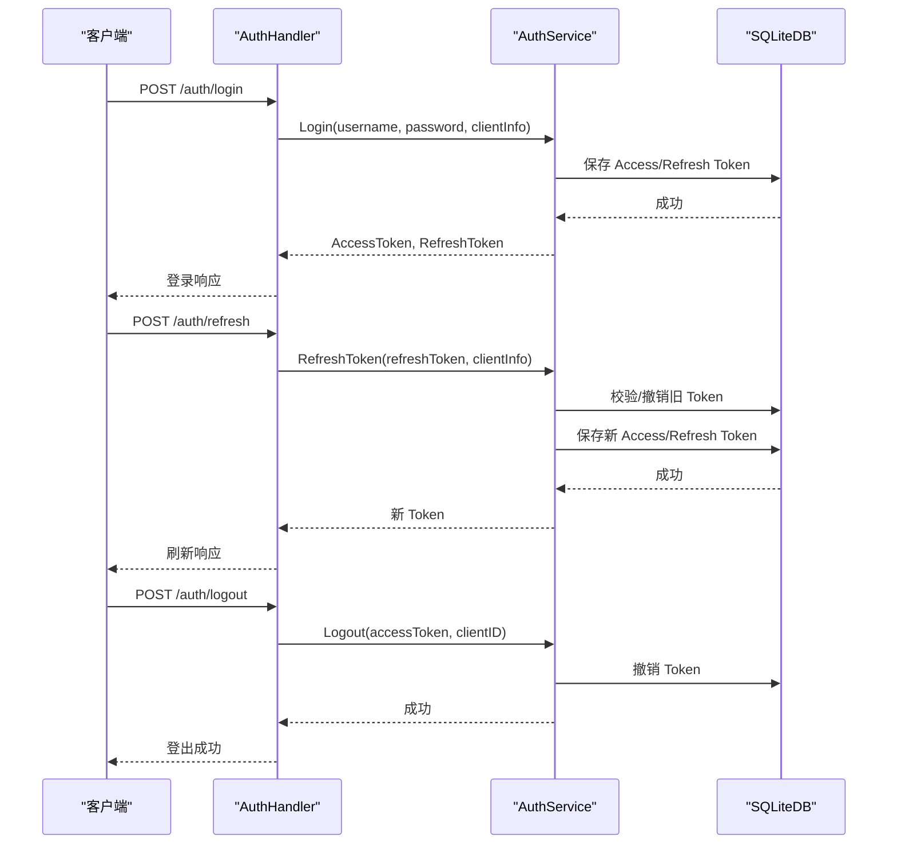
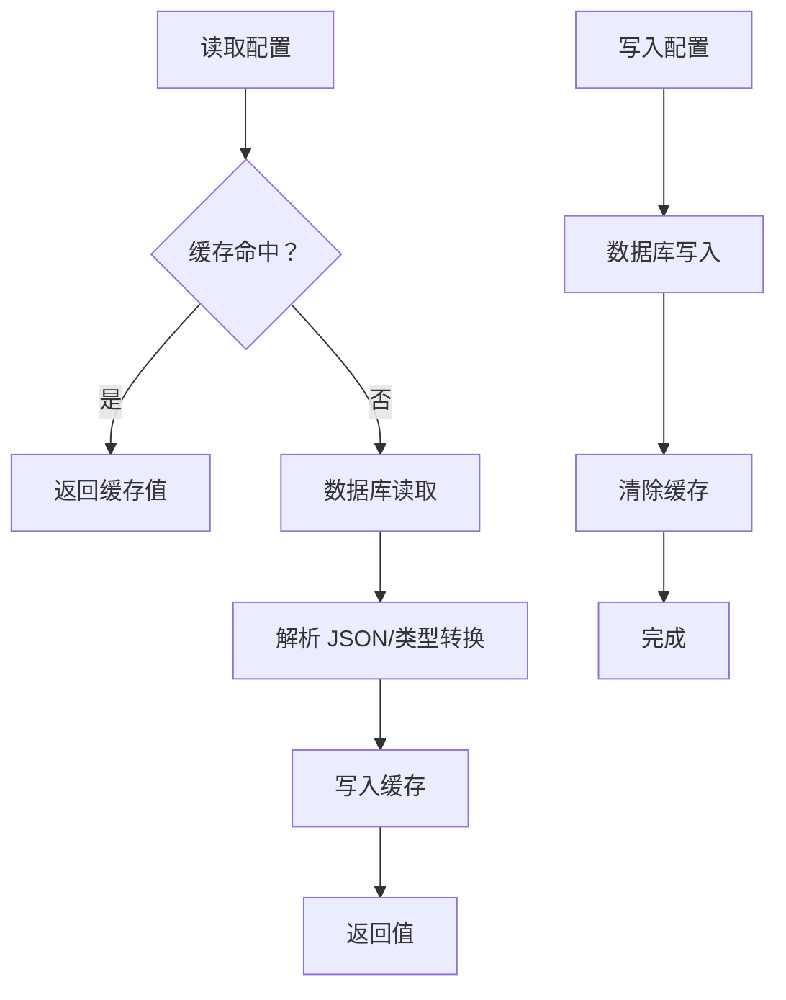
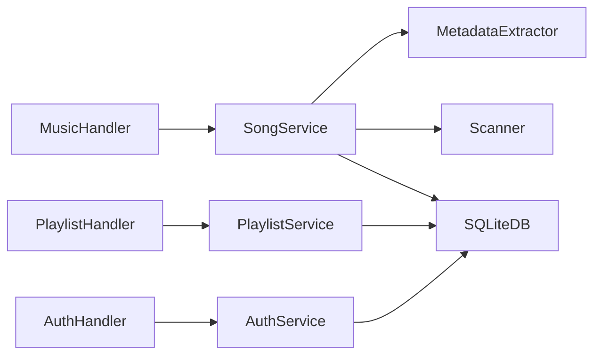

# 核心功能实现

<cite>
**本文档引用的文件**
- [internal/app/app.go](file://internal/app/app.go)
- [internal/handlers/music.go](file://internal/handlers/music.go)
- [internal/handlers/playlist.go](file://internal/handlers/playlist.go)
- [internal/handlers/auth.go](file://internal/handlers/auth.go)
- [internal/services/scanner.go](file://internal/services/scanner.go)
- [internal/services/metadata.go](file://internal/services/metadata.go)
- [internal/services/song_service.go](file://internal/services/song_service.go)
- [internal/services/playlist_service.go](file://internal/services/playlist_service.go)
- [internal/services/auth_service.go](file://internal/services/auth_service.go)
- [internal/services/config_service.go](file://internal/services/config_service.go)
- [internal/database/sqlite.go](file://internal/database/sqlite.go)
- [internal/database/schema.go](file://internal/database/schema.go)
- [internal/models/models.go](file://internal/models/models.go)
- [internal/config/types.go](file://internal/config/types.go)
</cite>

## 目录
1. [简介](#简介)
2. [项目结构](#项目结构)
3. [核心组件](#核心组件)
4. [架构总览](#架构总览)
5. [详细组件分析](#详细组件分析)
6. [依赖关系分析](#依赖关系分析)
7. [性能考虑](#性能考虑)
8. [故障排除指南](#故障排除指南)
9. [结论](#结论)

## 简介
本文件面向 MiMusic 的核心功能实现，围绕以下主题展开：
- 音乐管理：本地音乐扫描、元数据提取、音频分析与封面处理
- 歌单管理：CRUD、歌曲排序、歌单同步与内置歌单
- 认证与授权：JWT 双 Token 机制、令牌管理、权限控制与安全策略
- 配置管理：配置存储、动态配置、配置验证与配置迁移
- 提供 API 接口说明、使用模式、性能优化建议与故障排除指南

## 项目结构
MiMusic 采用 Go 语言后端 + Vue 前端的混合架构，后端通过 Chi 路由提供 REST API，数据库使用 SQLite，并通过自定义服务层封装业务逻辑。前端位于 web/ 目录，提供 Web 控制台与播放器界面。

图表来源
- [internal/app/app.go:44-227](file://internal/app/app.go#L44-L227)
- [internal/handlers/music.go:17-102](file://internal/handlers/music.go#L17-L102)
- [internal/handlers/playlist.go:15-81](file://internal/handlers/playlist.go#L15-L81)
- [internal/handlers/auth.go:15-62](file://internal/handlers/auth.go#L15-L62)
- [internal/services/song_service.go:16-32](file://internal/services/song_service.go#L16-L32)
- [internal/services/playlist_service.go:11-21](file://internal/services/playlist_service.go#L11-L21)
- [internal/services/auth_service.go:24-32](file://internal/services/auth_service.go#L24-L32)
- [internal/services/config_service.go:15-27](file://internal/services/config_service.go#L15-L27)
- [internal/database/sqlite.go:12-53](file://internal/database/sqlite.go#L12-L53)
- [internal/database/schema.go:3-149](file://internal/database/schema.go#L3-L149)

章节来源
- [internal/app/app.go:44-227](file://internal/app/app.go#L44-L227)
- [internal/database/schema.go:3-149](file://internal/database/schema.go#L3-L149)

## 核心组件
- 应用初始化与路由：负责数据库初始化、服务实例化、插件管理、JWT 密钥初始化与路由注册
- 音乐管理服务：扫描本地音乐、提取元数据、保存封面、批量导入、清理无效歌曲
- 歌单服务：歌单 CRUD、歌曲增删改查、排序、自动创建歌单
- 认证服务：双 Token（Access/Refresh）、登录/登出/刷新、令牌撤销与缓存
- 配置服务：配置读取/写入、缓存、JSON 序列化与迁移
- 数据库层：SQLite 连接、事务、索引与触发器

章节来源
- [internal/app/app.go:64-227](file://internal/app/app.go#L64-L227)
- [internal/services/song_service.go:16-552](file://internal/services/song_service.go#L16-L552)
- [internal/services/playlist_service.go:11-213](file://internal/services/playlist_service.go#L11-L213)
- [internal/services/auth_service.go:24-461](file://internal/services/auth_service.go#L24-L461)
- [internal/services/config_service.go:15-198](file://internal/services/config_service.go#L15-L198)
- [internal/database/sqlite.go:12-80](file://internal/database/sqlite.go#L12-L80)

## 架构总览
系统采用分层架构：
- 接口层：HTTP Handler（Chi 路由）
- 服务层：业务逻辑封装（SongService、PlaylistService、AuthService、ConfigService）
- 数据层：SQLite 数据库与 Schema 定义
- 外部集成：ffprobe 音频分析、tag 库元数据读取、插件系统

图表来源
- [internal/handlers/music.go:29-102](file://internal/handlers/music.go#L29-L102)
- [internal/handlers/playlist.go:27-81](file://internal/handlers/playlist.go#L27-L81)
- [internal/handlers/auth.go:27-62](file://internal/handlers/auth.go#L27-L62)
- [internal/services/song_service.go:181-376](file://internal/services/song_service.go#L181-L376)
- [internal/services/metadata.go:76-184](file://internal/services/metadata.go#L76-L184)
- [internal/database/sqlite.go:22-53](file://internal/database/sqlite.go#L22-L53)

## 详细组件分析

### 音乐管理：扫描、元数据提取与封面处理
- 本地扫描
  - 支持排除目录、软链接防循环、格式过滤
  - 并发 worker 池 + 流水线批处理，提升导入效率
- 元数据提取
  - 使用 tag 库读取 ID3/FLAC/Vorbis 等标签
  - 使用 ffprobe 精确提取时长、比特率、采样率
  - 合并文件名与刮削标题，避免冗余
- 封面处理
  - 基于封面内容哈希生成分层目录，避免单目录文件过多
  - 相同封面自动去重，节省存储空间

图表来源
- [internal/services/scanner.go:30-151](file://internal/services/scanner.go#L30-L151)
- [internal/services/song_service.go:181-376](file://internal/services/song_service.go#L181-L376)
- [internal/services/metadata.go:76-184](file://internal/services/metadata.go#L76-L184)
- [internal/services/metadata.go:186-235](file://internal/services/metadata.go#L186-L235)

章节来源
- [internal/services/scanner.go:30-151](file://internal/services/scanner.go#L30-L151)
- [internal/services/metadata.go:76-235](file://internal/services/metadata.go#L76-L235)
- [internal/services/song_service.go:181-485](file://internal/services/song_service.go#L181-L485)

### 歌单管理：CRUD、排序与内置歌单
- CRUD：创建、读取、更新、删除歌单
- 歌曲管理：添加/移除歌曲、批量添加、统计数量
- 排序：根据给定歌曲 ID 列表重新排序
- 自动创建：根据目录结构自动创建歌单（可选包含子目录）
- 内置歌单：初始化“收藏”和“电台收藏”，不可删除

图表来源
- [internal/services/playlist_service.go:23-213](file://internal/services/playlist_service.go#L23-L213)

章节来源
- [internal/handlers/playlist.go:27-473](file://internal/handlers/playlist.go#L27-L473)
- [internal/services/playlist_service.go:23-213](file://internal/services/playlist_service.go#L23-L213)
- [internal/database/schema.go:28-72](file://internal/database/schema.go#L28-L72)

### 认证与授权：JWT 双 Token 机制
- 双 Token 设计
  - Access Token：短期（7 天），用于日常 API 访问
  - Refresh Token：长期（30 天），用于刷新 Access Token
- 登录流程
  - 校验管理员凭据，生成 Access/Refresh Token，持久化到数据库
- 刷新流程
  - 校验 Refresh Token 有效性，撤销旧 Token，发放新 Token
- 登出流程
  - 撤销 Access/Refresh Token，清除缓存
- 令牌缓存
  - 内存缓存（sync.Map），定期清理过期条目，提升验证性能
- 插件 Token
  - 专用的“插件系统” Token，永久有效，不持久化至数据库

图表来源
- [internal/handlers/auth.go:27-134](file://internal/handlers/auth.go#L27-L134)
- [internal/services/auth_service.go:94-164](file://internal/services/auth_service.go#L94-L164)
- [internal/services/auth_service.go:245-324](file://internal/services/auth_service.go#L245-L324)
- [internal/services/auth_service.go:212-243](file://internal/services/auth_service.go#L212-L243)

章节来源
- [internal/handlers/auth.go:27-236](file://internal/handlers/auth.go#L27-L236)
- [internal/services/auth_service.go:24-461](file://internal/services/auth_service.go#L24-L461)

### 配置管理：存储、动态配置与迁移
- 存储与读取
  - 使用 ConfigService 提供 GetString/GetInt/GetBool/GetJSON/Set/SetJSON
  - 内置缓存（sync.Map），减少数据库访问
- 动态配置
  - 音乐目录、扫描配置、ffprobe 路径、封面存储路径等
- 配置验证
  - 解析 JSON 时进行错误处理与默认值回退
- 配置迁移
  - 初始化内置歌单与默认配置（包含 jwt_secret）

图表来源
- [internal/services/config_service.go:29-149](file://internal/services/config_service.go#L29-L149)
- [internal/database/schema.go:140-148](file://internal/database/schema.go#L140-L148)

章节来源
- [internal/services/config_service.go:29-198](file://internal/services/config_service.go#L29-L198)
- [internal/database/schema.go:134-148](file://internal/database/schema.go#L134-L148)

### 数据模型与 API 接口概览
- 歌曲模型：支持本地、远程、电台三类，包含元数据、封面、歌词等
- 歌单模型：支持普通与电台两类，支持标签（如 built_in）
- 认证模型：登录/刷新/撤销等请求与响应结构
- 配置模型：键值对配置，支持 JSON 值

章节来源
- [internal/models/models.go:64-175](file://internal/models/models.go#L64-L175)
- [internal/models/models.go:124-175](file://internal/models/models.go#L124-L175)
- [internal/models/models.go:368-402](file://internal/models/models.go#L368-L402)
- [internal/models/models.go:199-216](file://internal/models/models.go#L199-L216)

## 依赖关系分析
- 组件耦合
  - Handler 依赖 Service，Service 依赖 DB 接口
  - MetadataExtractor 依赖外部工具（ffprobe）与 tag 库
  - AuthService 依赖 DB 与 JWT 库，维护内存缓存
- 外部依赖
  - SQLite（modernc.org/sqlite）
  - golang-jwt/jwt/v5
  - hanxi/tag（音频标签读取）
- 可能的循环依赖
  - 未发现直接循环依赖，各层职责清晰

图表来源
- [internal/handlers/music.go:17-27](file://internal/handlers/music.go#L17-L27)
- [internal/handlers/playlist.go:15-25](file://internal/handlers/playlist.go#L15-L25)
- [internal/handlers/auth.go:15-25](file://internal/handlers/auth.go#L15-L25)
- [internal/services/song_service.go:16-32](file://internal/services/song_service.go#L16-L32)
- [internal/services/playlist_service.go:11-21](file://internal/services/playlist_service.go#L11-L21)
- [internal/services/auth_service.go:24-32](file://internal/services/auth_service.go#L24-L32)

章节来源
- [internal/handlers/music.go:17-27](file://internal/handlers/music.go#L17-L27)
- [internal/handlers/playlist.go:15-25](file://internal/handlers/playlist.go#L15-L25)
- [internal/handlers/auth.go:15-25](file://internal/handlers/auth.go#L15-L25)
- [internal/services/song_service.go:16-32](file://internal/services/song_service.go#L16-L32)
- [internal/services/playlist_service.go:11-21](file://internal/services/playlist_service.go#L11-L21)
- [internal/services/auth_service.go:24-32](file://internal/services/auth_service.go#L24-L32)

## 性能考虑
- 数据库优化
  - WAL 模式、busy_timeout、synchronous、cache_size、foreign_keys 等参数优化
  - 连接池：MaxOpenConns、MaxIdleConns、ConnMaxLifetime
  - 索引覆盖常用查询字段（类型、标题、艺术家、时间戳等）
- 扫描与导入
  - 预过滤跳过已存在文件，减少不必要的处理
  - 并发元数据提取 + 批量事务写入，降低磁盘 IO 与锁竞争
- 令牌验证
  - 内存缓存 + 定期清理，避免频繁数据库查询
- 元数据提取
  - 先用 tag 库快速提取，再用 ffprobe 精确补充技术参数
  - 封面去重与分层目录，避免大量小文件

章节来源
- [internal/database/sqlite.go:22-53](file://internal/database/sqlite.go#L22-L53)
- [internal/services/song_service.go:210-376](file://internal/services/song_service.go#L210-L376)
- [internal/services/auth_service.go:194-210](file://internal/services/auth_service.go#L194-L210)
- [internal/services/metadata.go:122-184](file://internal/services/metadata.go#L122-L184)

## 故障排除指南
- ffprobe 无法运行
  - 检查配置中的 ffprobe 路径，确保可执行文件存在且有执行权限
  - 使用 IsFFProbeAvailable 检测可用性
- 扫描中断或卡住
  - 检查扫描进度管理器是否被取消
  - 确认音乐目录可访问、排除目录配置正确
- 封面保存失败
  - 检查封面存储目录权限与磁盘空间
  - 确认封面数据存在且扩展名正确
- 令牌验证失败
  - 检查 jwt_secret 是否正确（应用启动时自动生成）
  - 确认令牌未被撤销，缓存是否过期
- 数据库异常
  - 检查 SQLite 连接参数与 WAL 模式
  - 确认索引与触发器正常

章节来源
- [internal/services/metadata.go:261-265](file://internal/services/metadata.go#L261-L265)
- [internal/services/song_service.go:39-42](file://internal/services/song_service.go#L39-L42)
- [internal/services/auth_service.go:326-371](file://internal/services/auth_service.go#L326-L371)
- [internal/database/sqlite.go:22-53](file://internal/database/sqlite.go#L22-L53)

## 结论
MiMusic 的核心功能围绕“高效扫描与元数据提取、灵活的歌单管理、健壮的认证与配置体系”构建。通过并发流水线、数据库优化与令牌缓存等手段，在保证功能完整性的同时兼顾了性能与可维护性。内置歌单与默认配置简化了初始使用体验，而插件系统与动态配置为扩展提供了空间。