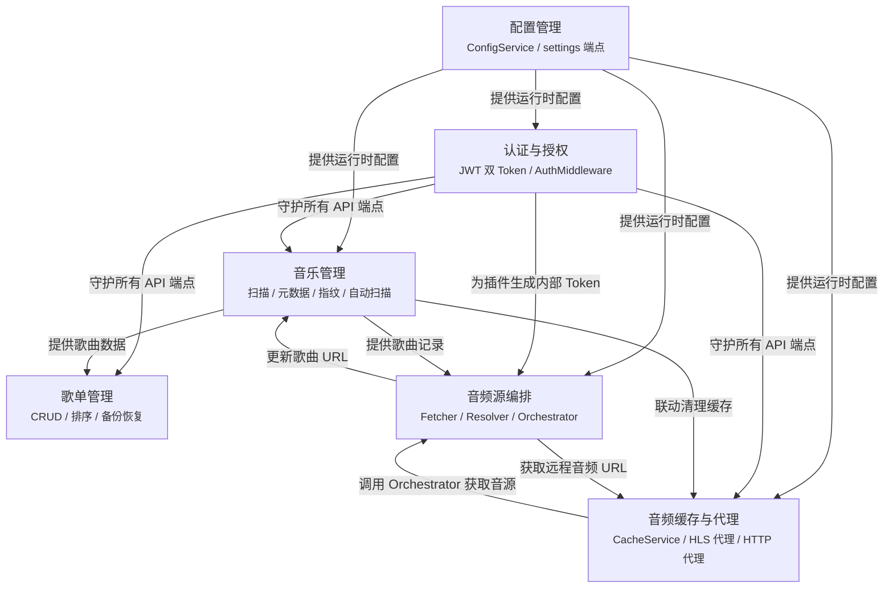

# 核心功能实现

本文档是「核心功能实现」目录的概览页面，索引六大功能域的详细子页面。
源码位于 <code>internal/app/app.go</code>（组件初始化与依赖装配）和 <code>internal/app/routers.go</code>（路由分组与端点注册）。

- [internal/app/app.go](https://github.com/songloft-org/songloft/blob/main/internal/app/app.go) -- App.Init() 中所有核心组件的创建与装配顺序
- [internal/app/routers.go](https://github.com/songloft-org/songloft/blob/main/internal/app/routers.go) -- 路由分组：认证、歌曲、歌单、扫描、缓存、设置、升级等

## 目录

1. [概述](#1-概述)
2. [音乐管理](#2-音乐管理)
3. [歌单管理](#3-歌单管理)
4. [音频源编排](#4-音频源编排)
5. [音频缓存与代理](#5-音频缓存与代理)
6. [认证与授权](#6-认证与授权)
7. [配置管理](#7-配置管理)
8. [功能域依赖关系](#8-功能域依赖关系)

---

## 1. 概述

Songloft 后端的核心业务逻辑分布在六大功能域中，每个功能域由若干 Service、Handler 和 Repository 组件协作完成。`App.Init()` 按严格的依赖顺序完成所有组件装配：先基础设施（数据库、配置），再认证层，然后业务 Service（扫描、歌曲、歌单、缓存），接着音源处理链（Fetcher / Resolver / Orchestrator），最后后台任务（AutoScanner、JS 插件异步加载）。

以下各节简要介绍每个功能域的职责、核心组件和对应的路由分组，详细实现请参阅各子页面。

**章节来源**：`internal/app/app.go` Init()（L87-L391）

---

## 2. 音乐管理

音乐管理涵盖本地文件扫描、音频元数据提取、音频指纹计算和自动扫描调度，是整个系统的数据入口。`Scanner` 按配置的音乐目录和过滤规则遍历文件系统，`MetadataExtractor` 从音频文件中提取标题、艺术家、专辑、封面等元数据，`FingerprintService` 通过 Chromaprint 算法计算音频指纹用于重复检测，`AutoScanner` 则根据持久化配置定期触发全量扫描。

关键组件：

| 组件 | 类型 | 职责 |
|------|------|------|
| `Scanner` | Service | 文件系统遍历，支持格式过滤和排除目录 |
| `MetadataExtractor` | Service | 音频元数据读取（tag 库 + ffprobe 回退） |
| `FingerprintService` | Service | Chromaprint 音频指纹计算与重复检测 |
| `AutoScanner` | Service | 定时扫描调度，从 `auto_scan` 配置恢复 |
| `SongService` | Service | 歌曲 CRUD、批量操作、无效歌曲清理 |
| `ScanHandler` | Handler | `/scan`、`/scan/progress`、`/scan/fingerprints` 端点 |
| `SongHandler` | Handler | `/songs` CRUD、`/songs/{id}/play`、`/songs/{id}/cover` 端点 |

路由分组：`/api/v1/scan/*`（扫描操作）、`/api/v1/songs/*`（歌曲 CRUD 与播放）、`/api/v1/settings/music-path`（音乐路径配置）、`/api/v1/settings/auto-scan`（自动扫描开关）。

**章节来源**：`internal/app/app.go`（L206-L224, L377-L381）、`internal/app/routers.go`（L117-L131, L155-L165, L181-L189）

---

## 3. 歌单管理

歌单管理提供歌单的创建、读取、更新、删除以及歌单内歌曲的增删和排序功能，同时支持歌单数据的导出/导入备份。系统预置两个内建歌单（id=1「收藏」、id=2「电台收藏」，带 `labels=["built_in"]` 标记），由数据库迁移脚本创建。`PlaylistService` 通过 `PlaylistRepository` 和 `PlaylistSongRepository` 管理歌单与歌曲的多对多关系，`BackupService` 负责将歌单数据序列化为 JSON 进行导出和恢复。

关键组件：

| 组件 | 类型 | 职责 |
|------|------|------|
| `PlaylistService` | Service | 歌单 CRUD、歌曲关联、排序 |
| `BackupService` | Service | 歌单导出（JSON）与导入恢复 |
| `PlaylistHandler` | Handler | `/playlists` CRUD、`/playlists/{id}/songs` 端点 |
| `BackupHandler` | Handler | `/playlists/export`、`/playlists/import` 端点 |

路由分组：`/api/v1/playlists/*`（歌单 CRUD、歌曲操作、封面、排序、批量删除、备份导入导出）。

**章节来源**：`internal/app/app.go`（L223）、`internal/app/routers.go`（L133-L151）

---

## 4. 音频源编排

音频源编排是 Songloft 处理网络歌曲播放的核心机制，采用三层架构：`SourceFetcher` 负责对单个音源执行 HTTP 探测和有效性验证；`SourceResolver` 遍历所有已安装的 JS 插件，按健康度指标排序后依次调用插件获取音源候选；`SourceOrchestrator` 作为顶层编排器协调 Fetcher 和 Resolver 的工作流，并在音源成功获取后更新歌曲记录。`PlayActivity` 注册表跟踪每首歌的进行中工作（play/prefetch/transcode/reassign），当用户快速切歌时自动取消旧请求的进行中操作。

关键组件：

| 组件 | 类型 | 职责 |
|------|------|------|
| `SourceFetcher` | source 包 | 单音源 HTTP 探测、有效性验证、指标上报 |
| `SourceResolver` | source 包 | 多插件候选排序、依次尝试获取可用音源 |
| `SourceOrchestrator` | source 包 | 编排 Fetcher + Resolver、更新歌曲 URL |
| `SourceMetrics` | source 包 | 纯内存滚动窗口，收集插件音源健康度指标 |
| `PlayActivity Registry` | playactivity 包 | 跨 song/会话 cancel 的全局表 |

路由分组：音频源编排不直接注册路由端点，而是被 `SongHandler.GetSongPlay`（`/api/v1/songs/{id}/play`）和 `CacheService` 内部调用。`SourceMetrics` 的健康度数据通过 `GET /api/v1/plugins/health`（`JSPluginHandler.handlePluginHealth`）暴露给管理界面。

**章节来源**：`internal/app/app.go`（L254-L322）、`internal/app/routers.go`（L194-L200）

---

## 5. 音频缓存与代理

音频缓存与代理包含三个子系统：音乐缓存（CacheService）透明缓存远程歌曲的音频文件到服务端本地，采用 LRU 淘汰策略和 inflight 去重机制；HLS 代理在代理模式下由服务端拉取并改写 `.m3u8` 播放列表、代理所有切片和密钥段，解决源站防盗链和 CORS 问题；通用 HTTP 代理为所有后端外发请求（插件注册表拉取、升级检查等）提供统一的代理转发能力。

关键组件：

| 组件 | 类型 | 职责 |
|------|------|------|
| `CacheService` | Service | 远程音频文件透明缓存、LRU 淘汰、inflight 去重 |
| `HLSHandler` | Handler | HLS 代理模式下的 m3u8 改写与切片/key 反代 |
| `httputil.ProxyConfig` | 工具包 | 全局 HTTP 代理配置与共享 Transport |
| `CacheHandler` | Handler | `/cache-manage/*` 缓存统计、清理、配置端点 |

路由分组：`/api/v1/cache-manage/*`（缓存统计、清理、配置、目录验证）、`/api/v1/songs/{id}/hls/*`（HLS 反向代理）、`/api/v1/settings/hls-proxy`（HLS 代理开关）、`/api/v1/settings/http-proxy`（通用代理配置）。

**章节来源**：`internal/app/app.go`（L237-L249, L128-L138）、`internal/app/routers.go`（L153-L154, L169-L170, L201-L207, L214-L219）

---

## 6. 认证与授权

认证系统基于 JWT 双 Token 机制：短期 Access Token 用于 API 请求鉴权，长期 Refresh Token 用于无感续期。首次启动时 `initJWTSecret` 自动生成密钥并持久化到 `configs` 表。`AuthService` 管理令牌的签发、刷新、吊销和列举，`TokenRepository` 持久化 Refresh Token 状态支持多设备管理。认证中间件 `AuthMiddleware` 优先从 `Authorization: Bearer` 头提取 token，回退到 `access_token` query 参数（适用于音频流和图片等无法自定义请求头的场景），同时支持 JS 插件声明的 `publicPaths` 豁免机制。

关键组件：

| 组件 | 类型 | 职责 |
|------|------|------|
| `AuthService` | Service | JWT 签发、刷新、吊销、令牌列举 |
| `AuthHandler` | Handler | `/auth/login`、`/auth/refresh`、`/auth/tokens` 端点 |
| `AuthMiddleware` | 中间件 | Bearer + query 回退鉴权、PublicPath 豁免 |
| `TokenRepository` | Repository | Refresh Token 持久化与状态管理 |

路由分组：`/api/v1/auth/*`（登录、刷新为公开端点；登出、令牌管理需认证）。

**章节来源**：`internal/app/app.go`（L140-L142, L227-L232, L257-L262）、`internal/app/routers.go`（L97-L99, L111-L114）

---

## 7. 配置管理

配置管理包含三层配置接口：业务孤立端点（`/settings/<name>`）为前端功能提供强类型 JSON 配置，带默认值和副作用触发；业务模块聚合端点（如 `/cache-manage/config`）将配置与模块动作端点组织在一起；通用 KV 端点（`/configs/{key}`）作为 admin 编辑器后门，允许手动读写任意配置键值。`ConfigService` 封装 `ConfigRepository`，提供 `GetString`、`GetJSON`、`Set` 等便捷方法。Tab 配置（`/settings/tab-config`）控制前端底部导航栏的显示与排序。`onConfigChanged` 回调机制确保通用 KV 端点与业务端点的副作用一致。

关键组件：

| 组件 | 类型 | 职责 |
|------|------|------|
| `ConfigService` | Service | 配置 CRUD、JSON 序列化/反序列化 |
| `ConfigHandler` | Handler | `/configs/*` 通用 KV 端点、`/settings/tab-config` 端点 |
| `ScanHandler` | Handler | `/settings/music-path`、`/settings/auto-scan` 等扫描相关配置 |
| `HLSHandler` | Handler | `/settings/hls-proxy` HLS 代理开关 |
| `JSPluginHandler` | Handler | `/settings/plugin-registries`、`/settings/http-proxy` 端点 |
| `LogHandler` | Handler | `/settings/log-level` 日志等级动态切换 |
| `ConfigRepository` | Repository | `configs` 表的持久化读写 |

路由分组：`/api/v1/configs/*`（通用 KV CRUD）、`/api/v1/settings/*`（各业务配置端点，分布在对应业务 Handler 中）。

**章节来源**：`internal/app/app.go`（L115-L117）、`internal/app/routers.go`（L56-L71, L153-L172, L174-L179）

---

## 8. 功能域依赖关系

六大功能域之间存在明确的依赖关系：配置管理是所有功能域的基础设施，认证与授权守护所有 API 端点，音乐管理为歌单和音频源提供歌曲数据，音频源编排被缓存服务调用以获取远程音频。

**图表来源**：`internal/app/app.go`（Init 方法中的依赖注入顺序与 `Set*` 交叉依赖注入）、`internal/app/routers.go`（路由分组与 Handler 依赖关系）
