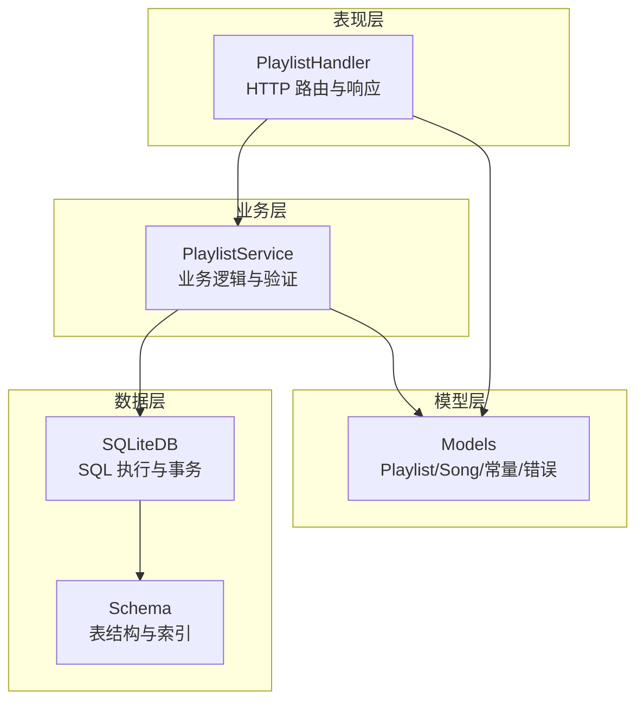
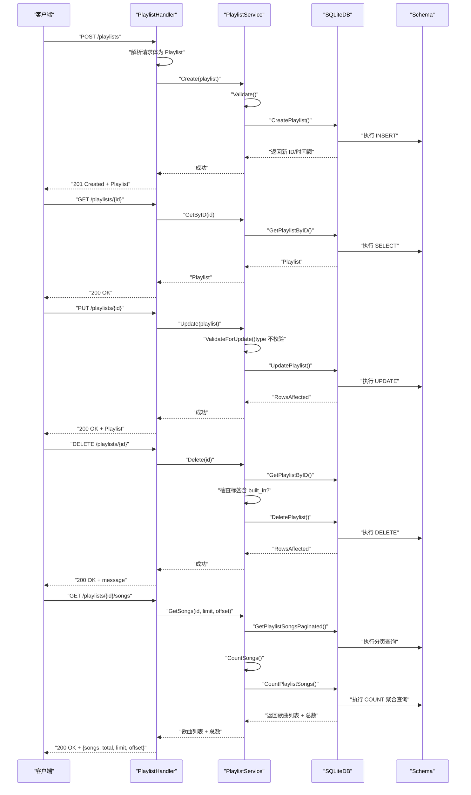
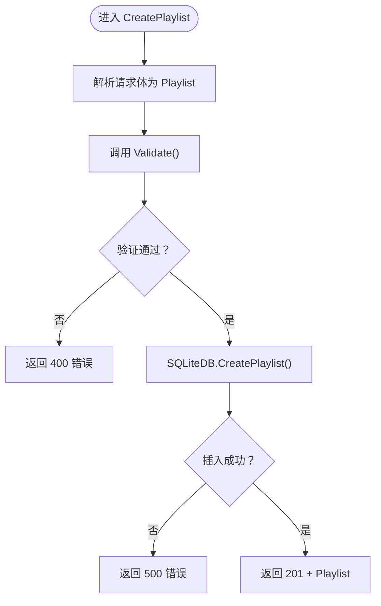
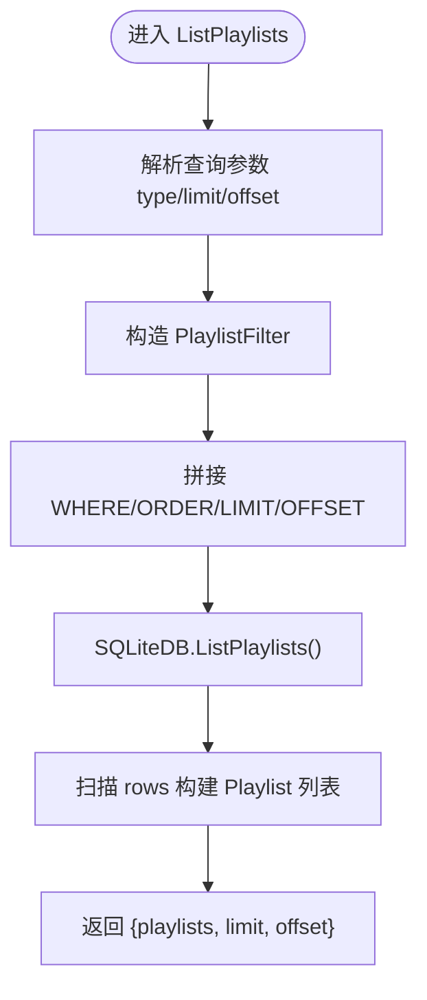
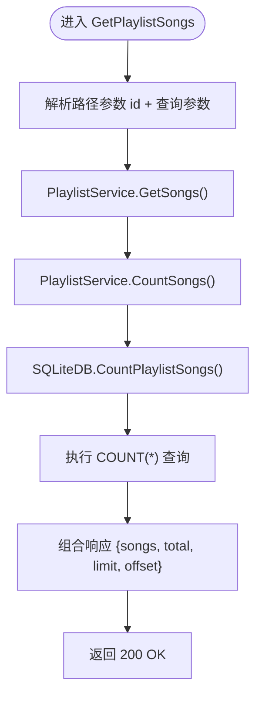
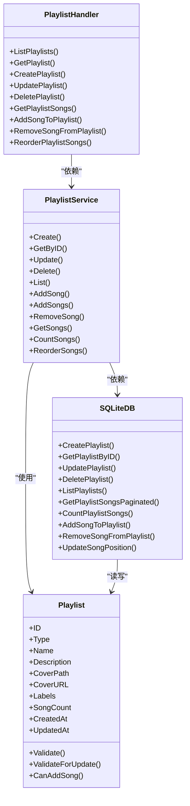

# 歌单 CRUD 操作

<cite>
**本文档引用的文件**
- [playlist.go](file://internal/handlers/playlist.go)
- [playlist_service.go](file://internal/services/playlist_service.go)
- [sqlite_playlist.go](file://internal/database/sqlite_playlist.go)
- [sqlite_playlist_song.go](file://internal/database/sqlite_playlist_song.go)
- [database.go](file://internal/database/database.go)
- [schema.go](file://internal/database/schema.go)
- [models.go](file://internal/models/models.go)
- [constant.go](file://internal/models/constant.go)
- [playlist_test.go](file://internal/handlers/playlist_test.go)
- [playlist_service_test.go](file://internal/services/playlist_service_test.go)
</cite>

## 更新摘要
**所做更改**
- 更新 GetPlaylistSongs 接口文档，新增 total 字段说明
- 新增歌曲计数功能的技术实现说明
- 更新 API 接口说明，包含 total 字段的响应格式
- 增强性能考量部分，说明 COUNT 聚合查询的优化策略

## 目录
1. [简介](#简介)
2. [项目结构](#项目结构)
3. [核心组件](#核心组件)
4. [架构总览](#架构总览)
5. [详细组件分析](#详细组件分析)
6. [依赖关系分析](#依赖关系分析)
7. [性能考量](#性能考量)
8. [故障排查指南](#故障排查指南)
9. [结论](#结论)
10. [附录](#附录)

## 简介
本文件面向 MiMusic 的歌单 CRUD 操作，系统性梳理"创建(Create)"、"读取(Get)"、"更新(Update)"、"删除(Delete)"的实现细节，涵盖数据验证规则、查询逻辑、更新限制、安全机制、错误处理与性能优化建议，并提供 API 接口说明与最佳实践。

**更新** 本次更新重点反映了歌单 CRUD 操作中新增的歌曲计数功能，GetPlaylistSongs 接口现在包含 total 字段，通过数据库层面的 COUNT 聚合查询实现高效的歌曲总数统计。

## 项目结构
围绕歌单 CRUD 的代码主要分布在以下层次：
- 处理器层：负责路由、参数解析、HTTP 响应封装
- 服务层：负责业务逻辑、数据验证、跨模型约束
- 数据访问层：负责 SQLite 持久化、SQL 查询与事务
- 模型层：定义数据结构、验证规则与常量

**图表来源**
- [playlist.go:15-25](file://internal/handlers/playlist.go#L15-L25)
- [playlist_service.go:11-21](file://internal/services/playlist_service.go#L11-L21)
- [sqlite_playlist.go:17-47](file://internal/database/sqlite_playlist.go#L17-L47)
- [schema.go:28-51](file://internal/database/schema.go#L28-L51)
- [models.go:124-135](file://internal/models/models.go#L124-L135)

**章节来源**
- [playlist.go:15-25](file://internal/handlers/playlist.go#L15-L25)
- [playlist_service.go:11-21](file://internal/services/playlist_service.go#L11-L21)
- [sqlite_playlist.go:17-47](file://internal/database/sqlite_playlist.go#L17-L47)
- [schema.go:28-51](file://internal/database/schema.go#L28-L51)
- [models.go:124-135](file://internal/models/models.go#L124-L135)

## 核心组件
- 歌单处理器 PlaylistHandler：暴露 REST API，解析参数，调用服务层，封装响应。
- 歌单服务 PlaylistService：执行业务规则、数据验证、类型约束、内置歌单保护、事务优化。
- SQLite 数据层：提供 CRUD、分页、排序、标签过滤、自动创建歌单等 SQL 实现。
- 模型与常量：定义 Playlist 结构、验证规则、错误类型、分页限制、标签常量。

**章节来源**
- [playlist.go:15-25](file://internal/handlers/playlist.go#L15-L25)
- [playlist_service.go:11-21](file://internal/services/playlist_service.go#L11-L21)
- [sqlite_playlist.go:167-260](file://internal/database/sqlite_playlist.go#L167-L260)
- [models.go:124-174](file://internal/models/models.go#L124-L174)
- [constant.go:3-14](file://internal/models/constant.go#L3-L14)

## 架构总览
歌单 CRUD 的调用链路如下：

**图表来源**
- [playlist.go:126-141](file://internal/handlers/playlist.go#L126-L141)
- [playlist.go:95-112](file://internal/handlers/playlist.go#L95-L112)
- [playlist.go:156-180](file://internal/handlers/playlist.go#L156-L180)
- [playlist.go:226-244](file://internal/handlers/playlist.go#L226-L244)
- [playlist.go:246-312](file://internal/handlers/playlist.go#L246-L312)
- [playlist_service.go:23-36](file://internal/services/playlist_service.go#L23-L36)
- [playlist_service.go:38-46](file://internal/services/playlist_service.go#L38-L46)
- [playlist_service.go:48-61](file://internal/services/playlist_service.go#L48-L61)
- [playlist_service.go:71-92](file://internal/services/playlist_service.go#L71-L92)
- [playlist_service.go:185-203](file://internal/services/playlist_service.go#L185-L203)
- [sqlite_playlist.go:17-47](file://internal/database/sqlite_playlist.go#L17-L47)
- [sqlite_playlist.go:49-90](file://internal/database/sqlite_playlist.go#L49-L90)
- [sqlite_playlist.go:92-124](file://internal/database/sqlite_playlist.go#L92-L124)
- [sqlite_playlist.go:147-165](file://internal/database/sqlite_playlist.go#L147-L165)
- [sqlite_playlist_song.go:129-145](file://internal/database/sqlite_playlist_song.go#L129-L145)

## 详细组件分析

### Create 方法：创建歌单
- 输入：HTTP 请求体解析为 Playlist 对象
- 验证：调用 Playlist.Validate()，要求：
  - 名称非空
  - 类型为 normal 或 radio
- 存储：调用 SQLiteDB.CreatePlaylist()，持久化字段包括 type、name、description、cover_path、cover_url、labels，并设置 created_at/updated_at
- 响应：返回 201 Created 与新建的 Playlist

**图表来源**
- [playlist.go:126-141](file://internal/handlers/playlist.go#L126-L141)
- [playlist_service.go:23-36](file://internal/services/playlist_service.go#L23-L36)
- [sqlite_playlist.go:17-47](file://internal/database/sqlite_playlist.go#L17-L47)
- [models.go:137-150](file://internal/models/models.go#L137-L150)

**章节来源**
- [playlist.go:126-141](file://internal/handlers/playlist.go#L126-L141)
- [playlist_service.go:23-36](file://internal/services/playlist_service.go#L23-L36)
- [sqlite_playlist.go:17-47](file://internal/database/sqlite_playlist.go#L17-L47)
- [models.go:137-150](file://internal/models/models.go#L137-L150)

### GetByID 方法：根据 ID 获取歌单
- 输入：路径参数 id
- 查询：SQLiteDB.GetPlaylistByID()
- 响应：200 OK 返回 Playlist；若不存在返回 404

**章节来源**
- [playlist.go:95-112](file://internal/handlers/playlist.go#L95-L112)
- [sqlite_playlist.go:49-90](file://internal/database/sqlite_playlist.go#L49-L90)

### List 方法：歌单列表查询
- 查询参数：
  - type：过滤歌单类型（normal/radio）
  - limit：分页大小，默认 DefaultPaginationLimit
  - offset：分页偏移
- 过滤与排序：
  - 类型过滤：WHERE type = ?
  - 标签过滤：使用 JSON 查询 EXISTS (SELECT 1 FROM json_each(labels) WHERE value = ?)，可同时匹配多个标签
  - 关键词搜索：name 或 description LIKE %keyword%
  - 排序：默认按 updated_at DESC，可自定义 OrderBy/Order
  - 分页：LIMIT 与 OFFSET
- 响应：返回 playlists 数组、limit、offset

**图表来源**
- [playlist.go:40-81](file://internal/handlers/playlist.go#L40-L81)
- [sqlite_playlist.go:167-260](file://internal/database/sqlite_playlist.go#L167-L260)
- [constant.go:3-14](file://internal/models/constant.go#L3-L14)

**章节来源**
- [playlist.go:40-81](file://internal/handlers/playlist.go#L40-L81)
- [sqlite_playlist.go:167-260](file://internal/database/sqlite_playlist.go#L167-L260)
- [constant.go:3-14](file://internal/models/constant.go#L3-L14)

### Update 方法：更新歌单
- 输入：路径参数 id + 请求体 Playlist
- 验证：调用 Playlist.ValidateForUpdate()，要求：
  - 名称非空（type 不校验）
- 更新：SQLiteDB.UpdatePlaylist()，更新 name/description/cover_path/cover_url/labels/updated_at
- 响应：200 OK 返回更新后的 Playlist

设计考虑：type 字段不可修改，防止歌单类型与歌曲类型约束冲突。例如普通歌单仅允许 local/remote 歌曲，电台歌单仅允许 radio 歌曲。

**章节来源**
- [playlist.go:156-180](file://internal/handlers/playlist.go#L156-L180)
- [playlist_service.go:48-61](file://internal/services/playlist_service.go#L48-L61)
- [models.go:152-160](file://internal/models/models.go#L152-L160)
- [models.go:162-174](file://internal/models/models.go#L162-L174)

### Delete 方法：删除歌单
- 输入：路径参数 id
- 安全机制：
  - 先查询歌单，检查标签是否包含 built_in
  - 若包含 built_in，拒绝删除（内置歌单保护）
  - 否则执行 DELETE
- 级联删除策略：
  - playlists 表的删除会触发 playlist_songs 的 CASCADE 删除（由 SQLite 外键约束保证）

**章节来源**
- [playlist.go:226-244](file://internal/handlers/playlist.go#L226-L244)
- [playlist_service.go:71-92](file://internal/services/playlist_service.go#L71-L92)
- [sqlite_playlist.go:147-165](file://internal/database/sqlite_playlist.go#L147-L165)
- [schema.go:48-51](file://internal/database/schema.go#L48-L51)

### GetPlaylistSongs 方法：获取歌单歌曲（新增歌曲计数功能）
- 输入：路径参数 id + 查询参数 limit、offset
- 查询流程：
  - 调用 PlaylistService.GetSongs() 获取分页歌曲列表
  - 调用 PlaylistService.CountSongs() 获取歌曲总数
  - 通过 SQLiteDB.CountPlaylistSongs() 执行 COUNT 聚合查询
- 响应：返回 { songs, total, limit, offset }
- 性能优化：COUNT 聚合查询在 playlist_songs 表上进行，避免全表扫描

**更新** 新增 total 字段用于表示歌单中的歌曲总数，通过数据库层面的 COUNT 聚合实现高效统计。

**图表来源**
- [playlist.go:246-312](file://internal/handlers/playlist.go#L246-L312)
- [playlist_service.go:185-203](file://internal/services/playlist_service.go#L185-L203)
- [sqlite_playlist_song.go:129-145](file://internal/database/sqlite_playlist_song.go#L129-L145)

**章节来源**
- [playlist.go:246-312](file://internal/handlers/playlist.go#L246-L312)
- [playlist_service.go:185-203](file://internal/services/playlist_service.go#L185-L203)
- [sqlite_playlist_song.go:129-145](file://internal/database/sqlite_playlist_song.go#L129-L145)

### 歌单歌曲管理（扩展）
- 获取歌曲：GetPlaylistSongs（分页），CountSongs（统计总数）
- 批量添加：AddSongToPlaylist（跳过已存在）
- 移除歌曲：RemoveSongFromPlaylist
- 重新排序：ReorderPlaylistSongs（校验数量一致并更新位置）

**章节来源**
- [playlist.go:246-309](file://internal/handlers/playlist.go#L246-L309)
- [playlist.go:311-359](file://internal/handlers/playlist.go#L311-L359)
- [playlist.go:361-399](file://internal/handlers/playlist.go#L361-L399)
- [playlist.go:401-441](file://internal/handlers/playlist.go#L401-L441)
- [playlist_service.go:160-201](file://internal/services/playlist_service.go#L160-L201)

## 依赖关系分析

**图表来源**
- [playlist.go:15-25](file://internal/handlers/playlist.go#L15-L25)
- [playlist_service.go:11-21](file://internal/services/playlist_service.go#L11-L21)
- [sqlite_playlist.go:17-47](file://internal/database/sqlite_playlist.go#L17-L47)
- [models.go:124-174](file://internal/models/models.go#L124-L174)

**章节来源**
- [playlist.go:15-25](file://internal/handlers/playlist.go#L15-L25)
- [playlist_service.go:11-21](file://internal/services/playlist_service.go#L11-L21)
- [sqlite_playlist.go:17-47](file://internal/database/sqlite_playlist.go#L17-L47)
- [models.go:124-174](file://internal/models/models.go#L124-L174)

## 性能考量
- 分页与索引
  - 列表查询默认按 updated_at DESC，配合索引 idx_playlists_type、idx_playlists_labels、idx_playlist_songs_playlist、idx_playlist_songs_position，提升排序与过滤性能
- 标签过滤
  - 使用 JSON 查询 EXISTS (json_each(labels))，适合多标签匹配；建议在 labels 上建立索引以优化查询
- 自动创建歌单
  - 单事务 + 预编译语句 + 批量插入 playlist_songs（每批最多 500 行），显著降低写入开销
- 分页限制
  - DefaultPaginationLimit 与 MaxPaginationLimit 控制查询规模，避免超大数据集导致内存与性能问题
- **新增** 歌曲计数优化
  - GetPlaylistSongs 接口通过 COUNT(*) 聚合查询统计歌曲总数，避免全表扫描
  - SQLiteDB.CountPlaylistSongs() 直接在 playlist_songs 表上执行 COUNT 查询，性能最优
  - 歌曲总数字段 SongCount 在歌单查询时通过 LEFT JOIN 和子查询计算，支持实时统计

**章节来源**
- [schema.go:89-104](file://internal/database/schema.go#L89-L104)
- [sqlite_playlist.go:299-463](file://internal/database/sqlite_playlist.go#L299-L463)
- [constant.go:3-14](file://internal/models/constant.go#L3-L14)
- [sqlite_playlist.go:52-57](file://internal/database/sqlite_playlist.go#L52-L57)
- [sqlite_playlist.go:173-177](file://internal/database/sqlite_playlist.go#L173-L177)
- [sqlite_playlist_song.go:129-145](file://internal/database/sqlite_playlist_song.go#L129-L145)

## 故障排查指南
- 常见错误与处理
  - 无效歌单 ID：解析失败返回 400
  - 歌单不存在：GetByID 返回 404
  - 创建失败：Validate 失败或数据库异常返回 500
  - 更新失败：ValidateForUpdate 失败或数据库异常返回 500
  - 删除失败：内置歌单 built_in 标签拒绝删除；数据库异常返回 500
  - **新增** 歌曲计数失败：CountPlaylistSongs 查询异常返回 500
- 单元测试参考
  - 处理器层测试覆盖 GET/POST/PUT/DELETE、分页、标签过滤等场景
  - 服务层测试覆盖内置歌单保护、类型约束、重新排序数量校验等边界情况
  - **新增** 歌曲计数测试覆盖 CountPlaylistSongs 方法的正确性验证

**章节来源**
- [playlist.go:95-112](file://internal/handlers/playlist.go#L95-L112)
- [playlist.go:126-141](file://internal/handlers/playlist.go#L126-L141)
- [playlist.go:156-180](file://internal/handlers/playlist.go#L156-L180)
- [playlist.go:226-244](file://internal/handlers/playlist.go#L226-L244)
- [playlist_service.go:71-92](file://internal/services/playlist_service.go#L71-L92)
- [playlist_test.go:280-326](file://internal/handlers/playlist_test.go#L280-L326)
- [playlist_service_test.go:311-330](file://internal/services/playlist_service_test.go#L311-L330)

## 结论
MiMusic 的歌单 CRUD 在结构上清晰分层，验证与约束在服务层集中实现，SQL 层提供高效查询与事务优化。type 字段不可修改与 built_in 标签保护确保了数据一致性与安全性。通过合理的分页、索引与批量写入策略，系统在中小规模到中等规模数据下具备良好性能。

**更新** 新增的歌曲计数功能进一步增强了歌单管理能力，GetPlaylistSongs 接口现在能够提供准确的歌曲总数信息，为前端展示和用户交互提供了更好的支持。

## 附录

### API 接口说明
- 获取歌单列表
  - 方法：GET /playlists
  - 查询参数：type（normal/radio）、limit（默认 20）、offset（默认 0）
  - 响应：{ playlists, limit, offset }
- 获取单个歌单
  - 方法：GET /playlists/{id}
  - 响应：Playlist
- 创建歌单
  - 方法：POST /playlists
  - 请求体：Playlist（name 必填，type 必须为 normal/radio）
  - 响应：201 Created + Playlist
- 更新歌单
  - 方法：PUT /playlists/{id}
  - 请求体：Playlist（name 必填，type 不校验）
  - 响应：200 OK + Playlist
- 删除歌单
  - 方法：DELETE /playlists/{id}
  - 响应：200 OK + message
- **更新** 获取歌单歌曲
  - 方法：GET /playlists/{id}/songs
  - 查询参数：limit、offset
  - 响应：{ songs, total, limit, offset }
  - **新增** total 字段表示歌单中的歌曲总数
- 批量添加歌曲
  - 方法：POST /playlists/{id}/songs
  - 请求体：{ song_ids: [int64...] }
  - 响应：{ message, added, skipped }
- 移除歌曲
  - 方法：DELETE /playlists/{id}/songs/{songId}
  - 响应：200 OK + message
- 重新排序歌曲
  - 方法：PUT /playlists/{id}/songs/reorder
  - 请求体：{ song_ids: [int64...] }
  - 响应：200 OK + message

**章节来源**
- [playlist.go:27-81](file://internal/handlers/playlist.go#L27-L81)
- [playlist.go:83-112](file://internal/handlers/playlist.go#L83-L112)
- [playlist.go:114-141](file://internal/handlers/playlist.go#L114-L141)
- [playlist.go:143-180](file://internal/handlers/playlist.go#L143-L180)
- [playlist.go:214-244](file://internal/handlers/playlist.go#L214-L244)
- [playlist.go:246-312](file://internal/handlers/playlist.go#L246-L312)
- [playlist.go:311-359](file://internal/handlers/playlist.go#L311-L359)
- [playlist.go:361-399](file://internal/handlers/playlist.go#L361-L399)
- [playlist.go:401-441](file://internal/handlers/playlist.go#L401-L441)

### 数据模型与验证规则
- Playlist 字段
  - id、type、name、description、cover_path、cover_url、labels、song_count、created_at、updated_at
- 验证规则
  - Create：name 非空；type ∈ {normal, radio}
  - Update：name 非空；type 不校验
- 类型约束
  - 普通歌单：仅允许 local/remote 歌曲
  - 电台歌单：仅允许 radio 歌曲

**章节来源**
- [models.go:124-174](file://internal/models/models.go#L124-L174)

### 歌曲计数技术实现
- **新增** CountPlaylistSongs 方法
  - 通过 SQLiteDB.CountPlaylistSongs() 执行 COUNT(*) 聚合查询
  - 直接在 playlist_songs 表上统计指定歌单的歌曲数量
  - 支持高并发场景下的准确计数
- **新增** GetPlaylistSongs 响应结构
  - 包含 songs（分页歌曲列表）、total（歌曲总数）、limit、offset
  - total 字段通过数据库层面的 COUNT 聚合实现，性能最优
- **新增** 性能优化策略
  - COUNT 聚合查询避免全表扫描
  - 歌曲总数字段 SongCount 在歌单查询时通过 LEFT JOIN 和子查询计算
  - 支持实时统计和缓存策略

**章节来源**
- [sqlite_playlist_song.go:129-145](file://internal/database/sqlite_playlist_song.go#L129-L145)
- [playlist.go:299-311](file://internal/handlers/playlist.go#L299-L311)
- [models.go:133](file://internal/models/models.go#L133)
- [sqlite_playlist.go:52-57](file://internal/database/sqlite_playlist.go#L52-L57)
- [sqlite_playlist.go:173-177](file://internal/database/sqlite_playlist.go#L173-L177)