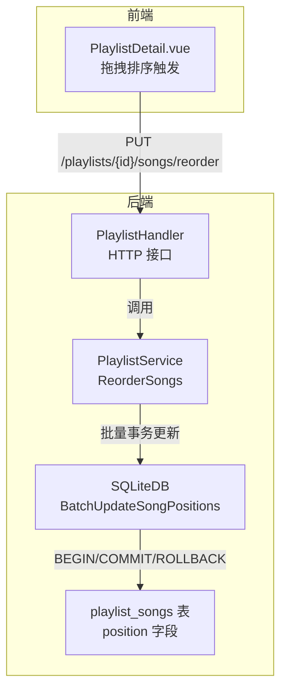
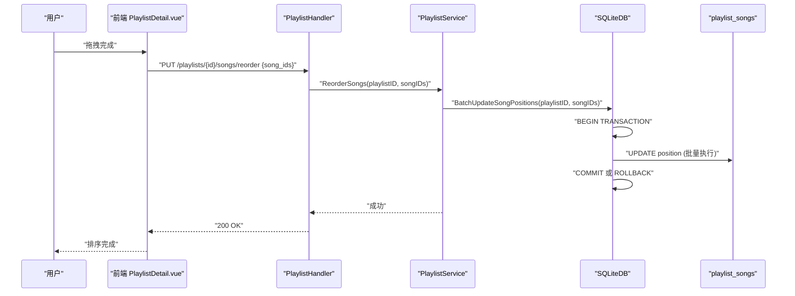
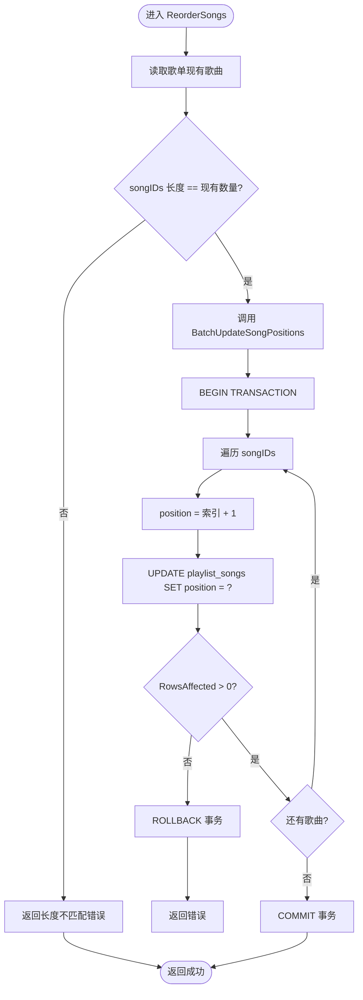
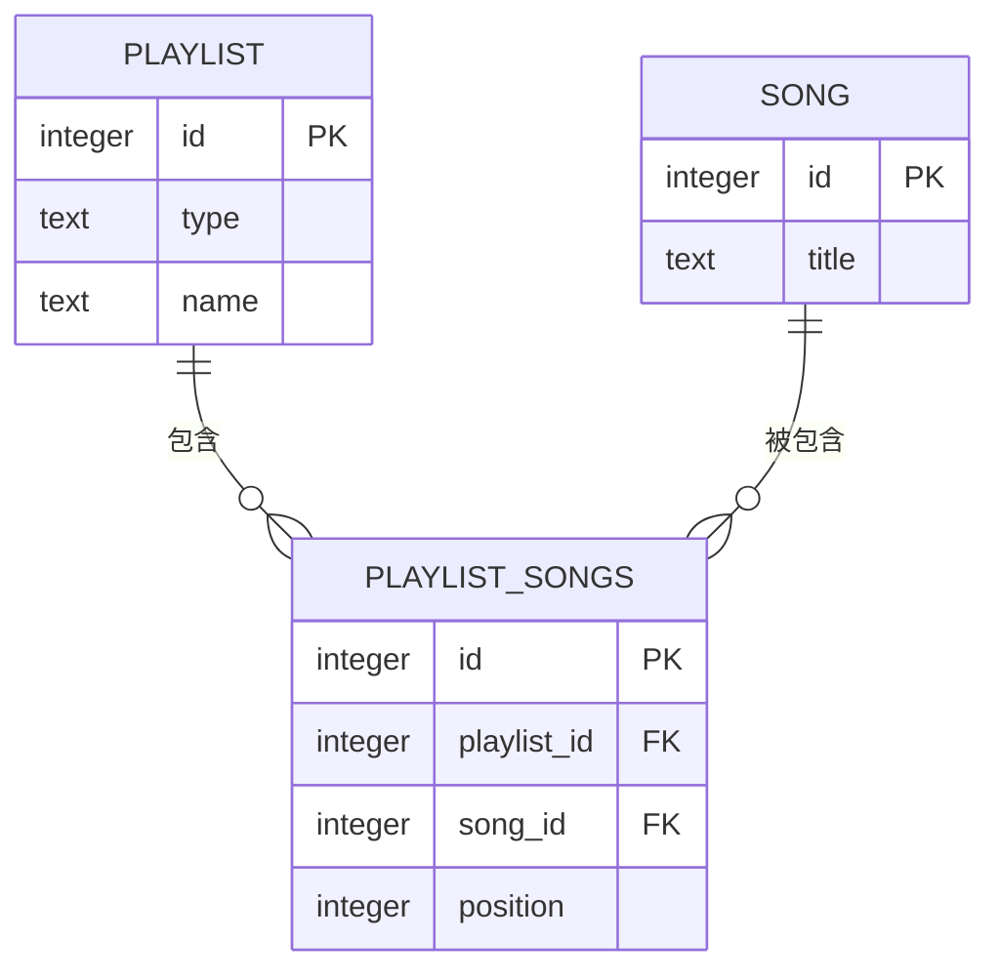
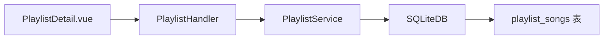

# 歌单歌曲排序管理

<cite>
**本文引用的文件**
- [playlist_service.go](file://internal/services/playlist_service.go)
- [sqlite_playlist_song.go](file://internal/database/sqlite_playlist_song.go)
- [database.go](file://internal/database/database.go)
- [playlist.go](file://internal/handlers/playlist.go)
- [playlist_service_test.go](file://internal/services/playlist_service_test.go)
- [PlaylistDetail.vue](file://web/src/views/Playlists/PlaylistDetail.vue)
</cite>

## 更新摘要
**变更内容**
- 更新了批量事务处理机制的实现细节
- 移除了逐个歌曲位置更新的旧实现
- 强化了事务处理与一致性保障说明
- 更新了性能分析和最佳实践建议

## 目录
1. [简介](#简介)
2. [项目结构](#项目结构)
3. [核心组件](#核心组件)
4. [架构总览](#架构总览)
5. [详细组件分析](#详细组件分析)
6. [依赖分析](#依赖分析)
7. [性能考虑](#性能考虑)
8. [故障排除指南](#故障排除指南)
9. [结论](#结论)
10. [附录](#附录)

## 简介
本文件面向 MiMusic 的"歌单歌曲排序管理"功能，围绕 ReorderSongs 方法的实现进行系统性解析，覆盖以下主题：
- 排序算法实现细节：位置验证、重复检查、批量事务处理机制
- 歌曲位置计算逻辑：新添加歌曲的自动定位与现有歌曲的重新编号
- 事务处理与一致性保障：批量事务的原子性与回滚机制
- 排序变更对播放队列的影响与同步机制
- 用户体验设计：拖拽排序与键盘快捷键支持现状
- 时间复杂度分析与性能优化策略
- 数据库操作与使用场景
- 故障排除与最佳实践

## 项目结构
围绕排序功能的关键代码分布在后端服务层、数据库层与前端界面层：
- 后端服务层：PlaylistService.ReorderSongs 实现排序业务逻辑
- 数据库层：playlist_songs 表存储排序位置；SQLiteDB 提供批量事务更新接口
- 前端界面层：PlaylistDetail.vue 支持拖拽排序与排序完成后的刷新
- API 层：PlaylistHandler.ReorderPlaylistSongs 对外暴露排序接口

**图表来源**
- [playlist.go:401-441](file://internal/handlers/playlist.go#L401-L441)
- [playlist_service.go:205-223](file://internal/services/playlist_service.go#L205-L223)
- [sqlite_playlist_song.go:147-177](file://internal/database/sqlite_playlist_song.go#L147-L177)
- [database.go:40](file://internal/database/database.go#L40)

**章节来源**
- [playlist.go:401-441](file://internal/handlers/playlist.go#L401-L441)
- [playlist_service.go:205-223](file://internal/services/playlist_service.go#L205-L223)
- [sqlite_playlist_song.go:147-177](file://internal/database/sqlite_playlist_song.go#L147-L177)
- [database.go:40](file://internal/database/database.go#L40)

## 核心组件
- PlaylistHandler.ReorderPlaylistSongs：对外提供排序接口，接收歌单 ID 与歌曲 ID 序列，调用服务层执行排序
- PlaylistService.ReorderSongs：核心业务逻辑，负责验证输入、批量事务更新位置
- SQLiteDB.BatchUpdateSongPositions：底层数据库批量事务更新，确保原子性和一致性
- playlist_songs 表：持久化存储歌曲在歌单中的顺序，通过 position 字段维护

**章节来源**
- [playlist.go:401-441](file://internal/handlers/playlist.go#L401-L441)
- [playlist_service.go:205-223](file://internal/services/playlist_service.go#L205-L223)
- [sqlite_playlist_song.go:147-177](file://internal/database/sqlite_playlist_song.go#L147-L177)
- [database.go:40](file://internal/database/database.go#L40)

## 架构总览
排序流程自上而下贯穿 HTTP 层、服务层与数据层，并最终通过事务机制落盘到 playlist_songs 表的 position 字段。

**图表来源**
- [playlist.go:401-441](file://internal/handlers/playlist.go#L401-L441)
- [playlist_service.go:205-223](file://internal/services/playlist_service.go#L205-L223)
- [sqlite_playlist_song.go:147-177](file://internal/database/sqlite_playlist_song.go#L147-L177)

## 详细组件分析

### ReorderSongs 方法实现与排序算法
- 输入验证
  - 获取歌单当前歌曲集合，比较传入的 songIDs 数量与现有数量是否一致，不一致则直接报错
- 事务批量更新
  - 调用 BatchUpdateSongPositions 执行批量事务更新，包含完整的 BEGIN/COMMIT/ROLLBACK 机制
  - 在事务内逐条更新 position，确保要么全部成功，要么全部回滚
- 错误处理
  - 任一更新失败即回滚事务并返回错误
  - 若歌曲不在歌单中，底层会返回"未找到"的错误

**图表来源**
- [playlist_service.go:205-223](file://internal/services/playlist_service.go#L205-L223)
- [sqlite_playlist_song.go:147-177](file://internal/database/sqlite_playlist_song.go#L147-L177)

**章节来源**
- [playlist_service.go:205-223](file://internal/services/playlist_service.go#L205-L223)
- [playlist_service_test.go:505-511](file://internal/services/playlist_service_test.go#L505-L511)

### 位置验证与重复检查
- 重复检查
  - 服务层未对 songIDs 中是否存在重复 ID 进行显式去重；若传入重复 ID，会导致 position 被多次更新，可能造成顺序不稳定
- 位置验证
  - 仅做数量一致性检查，未验证每个 songID 是否确实存在于歌单中；实际存在性由底层 BatchUpdateSongPositions 的 RowsAffected 判断保证

**章节来源**
- [playlist_service.go:205-223](file://internal/services/playlist_service.go#L205-L223)
- [sqlite_playlist_song.go:147-177](file://internal/database/sqlite_playlist_song.go#L147-L177)

### 新添加歌曲的自动定位与现有歌曲重新编号
- 新添加歌曲的默认位置
  - AddSong 在插入时根据当前歌单歌曲数计算 position = len(songs)+1，插入 playlist_songs
- 现有歌曲重新编号
  - ReorderSongs 通过传入完整 songIDs 列表，按顺序重新分配 position，实现"重新编号"

**章节来源**
- [playlist_service.go:104-137](file://internal/services/playlist_service.go#L104-L137)
- [playlist_service.go:205-223](file://internal/services/playlist_service.go#L205-L223)

### 事务处理与一致性保障
- 当前实现
  - ReorderSongs 使用 BatchUpdateSongPositions 执行批量事务更新，包含完整的 BEGIN/COMMIT/ROLLBACK 机制
  - 事务内逐条执行更新，任一失败立即回滚，确保原子性
  - 使用预编译语句减少 SQL 注入风险和提升性能
- 优势
  - 原子性：要么全部更新成功，要么全部回滚
  - 一致性：中间状态不会被其他操作看到
  - 隔离性：与其他并发操作隔离
  - 持久性：提交后数据持久化

**章节来源**
- [playlist_service.go:205-223](file://internal/services/playlist_service.go#L205-L223)
- [sqlite_playlist_song.go:147-177](file://internal/database/sqlite_playlist_song.go#L147-L177)

### 排序变更对播放队列的影响与同步机制
- 播放队列同步
  - 前端在拖拽完成后调用排序接口，随后主动拉取最新歌曲列表以保持 UI 与后端一致
  - 若排序失败，前端会回滚本地列表并提示错误
- 播放行为
  - 播放全部时优先加载第一页，后续异步追加；排序不会改变已加入播放队列的歌曲顺序，但会影响后续播放队列构建

**章节来源**
- [PlaylistDetail.vue:613-626](file://web/src/views/Playlists/PlaylistDetail.vue#L613-L626)
- [playlist.go:401-441](file://internal/handlers/playlist.go#L401-L441)

### 用户体验设计：拖拽排序与键盘快捷键
- 拖拽排序
  - 前端提供排序模式开关与拖拽手柄，拖拽结束后自动提交排序请求
- 键盘快捷键
  - 当前实现未发现键盘快捷键支持；可在排序模式下增加方向键移动、回车确认等交互以提升效率

**章节来源**
- [PlaylistDetail.vue:96-108](file://web/src/views/Playlists/PlaylistDetail.vue#L96-L108)
- [PlaylistDetail.vue:138-140](file://web/src/views/Playlists/PlaylistDetail.vue#L138-L140)
- [PlaylistDetail.vue](file://web/src/views/Playlists/PlaylistDetail.vue#L257)

### 数据模型与数据库操作
- 数据模型
  - playlist_songs 表包含 playlist_id、song_id、position 三元组，position 即排序依据
- 查询与更新
  - GetPlaylistSongs 按 position 升序返回歌曲
  - BatchUpdateSongPositions 通过 playlist_id 与 song_id 定位，批量更新 position

**图表来源**
- [database.go:35-41](file://internal/database/database.go#L35-L41)

**章节来源**
- [database.go:35-41](file://internal/database/database.go#L35-L41)
- [sqlite_playlist_song.go:45-85](file://internal/database/sqlite_playlist_song.go#L45-L85)
- [sqlite_playlist_song.go:147-177](file://internal/database/sqlite_playlist_song.go#L147-L177)

## 依赖分析
- 组件耦合
  - PlaylistHandler 依赖 PlaylistService
  - PlaylistService 依赖 SQLiteDB
  - SQLiteDB 依赖 playlist_songs 表
- 外部依赖
  - HTTP 路由与 JSON 请求/响应
  - 前端通过 API 调用触发排序

**图表来源**
- [playlist.go:401-441](file://internal/handlers/playlist.go#L401-L441)
- [playlist_service.go:205-223](file://internal/services/playlist_service.go#L205-L223)
- [sqlite_playlist_song.go:147-177](file://internal/database/sqlite_playlist_song.go#L147-L177)

**章节来源**
- [playlist.go:401-441](file://internal/handlers/playlist.go#L401-L441)
- [playlist_service.go:205-223](file://internal/services/playlist_service.go#L205-L223)
- [sqlite_playlist_song.go:147-177](file://internal/database/sqlite_playlist_song.go#L147-L177)

## 性能考虑
- 时间复杂度
  - ReorderSongs 对 n 首歌曲执行 n 次批量更新，整体 O(n)
  - 事务内批量执行比逐条执行性能更好
- 空间复杂度
  - 仅使用常数额外空间，O(1)
- 优化策略
  - 事务化批量更新：减少锁竞争与日志写入次数
  - 预编译语句：复用执行计划，减少解析开销
  - 原子性保证：避免部分更新导致的数据不一致
  - 前端分批提交：当歌单很大时，可分批提交以降低单次请求压力
  - 增量更新：仅对发生变化的歌曲更新 position，避免全量重排
  - 索引利用：playlist_songs 已有 (playlist_id, position) 索引，有利于查询与排序

**章节来源**
- [database.go:96-97](file://internal/database/database.go#L96-L97)
- [playlist_service.go:205-223](file://internal/services/playlist_service.go#L205-L223)
- [sqlite_playlist_song.go:147-177](file://internal/database/sqlite_playlist_song.go#L147-L177)

## 故障排除指南
- 常见错误与原因
  - 歌曲数量不匹配：传入的 songIDs 数量与歌单现有数量不一致
  - 歌曲不在歌单：BatchUpdateSongPositions 返回"未找到"，通常因 songID 不存在
  - 事务失败：底层执行异常或并发冲突导致事务回滚
  - 数据库连接问题：连接池耗尽或连接超时
- 前端容错
  - 拖拽失败时回滚本地列表并提示错误
  - 主动重新拉取最新歌曲列表以恢复 UI 与后端一致
- 建议排查步骤
  - 确认传入的 songIDs 是否包含重复项
  - 校验每个 songID 是否仍存在于歌单
  - 检查数据库连接与并发写入情况
  - 查看事务日志和错误信息
  - 如需强一致性，建议使用批量事务更新

**章节来源**
- [playlist_service_test.go:505-511](file://internal/services/playlist_service_test.go#L505-L511)
- [PlaylistDetail.vue:613-626](file://web/src/views/Playlists/PlaylistDetail.vue#L613-L626)
- [sqlite_playlist_song.go:147-177](file://internal/database/sqlite_playlist_song.go#L147-L177)

## 结论
MiMusic 的歌单排序功能已从逐条更新升级为批量事务处理，具备更强的一致性保障和更好的性能表现。新的 BatchUpdateSongPositions 实现确保了原子性，要么全部成功，要么全部回滚。当前实现提供了良好的扩展性与易用性，前端提供了直观的拖拽排序体验，后续可补充键盘快捷键以提升效率。通过索引优化与批量事务策略，可在大规模歌单场景下进一步提升性能与稳定性。

## 附录
- 使用场景示例
  - 用户在歌单详情页开启排序模式，拖拽调整顺序，完成后自动提交排序请求
  - 批量导入歌曲后，按导入顺序自动编号并插入末尾
- 最佳实践
  - 传入的 songIDs 应与歌单现有数量一致，且不包含重复项
  - 出现错误时，前端应回滚本地状态并提示用户
  - 大型歌单建议分批提交排序请求，避免单次写入过大
  - 充分利用事务的原子性特性，确保数据一致性
  - 监控事务执行时间和错误率，及时发现性能问题