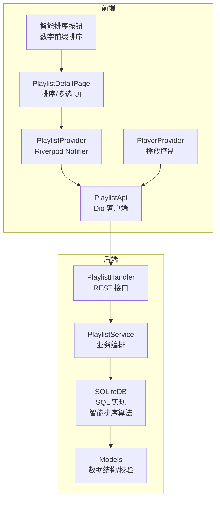
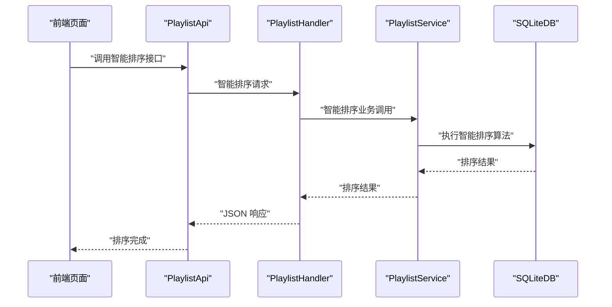
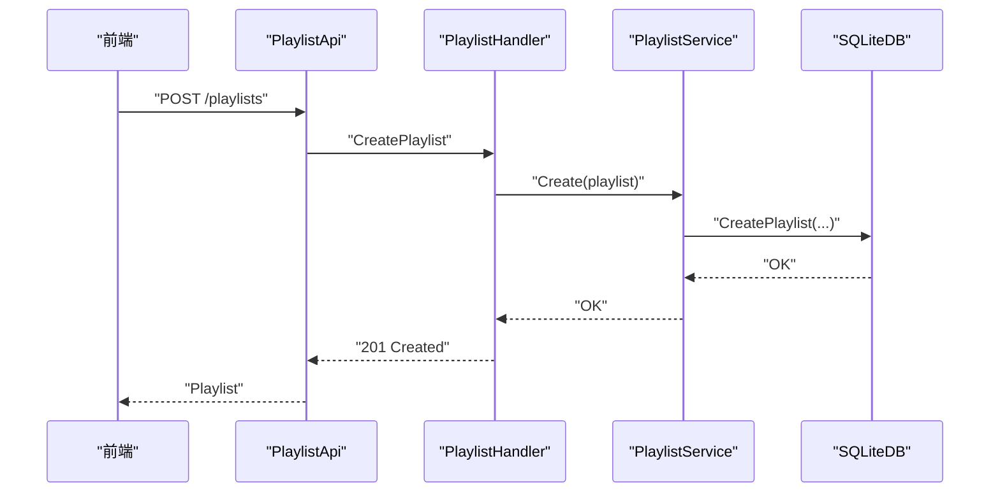
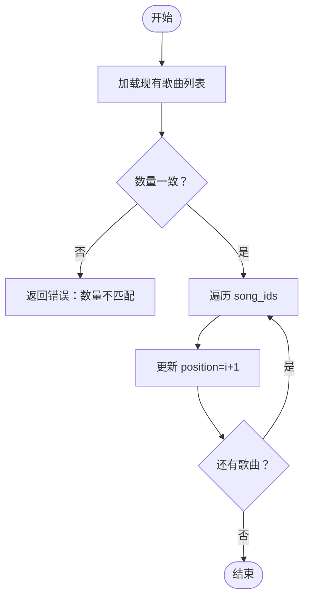
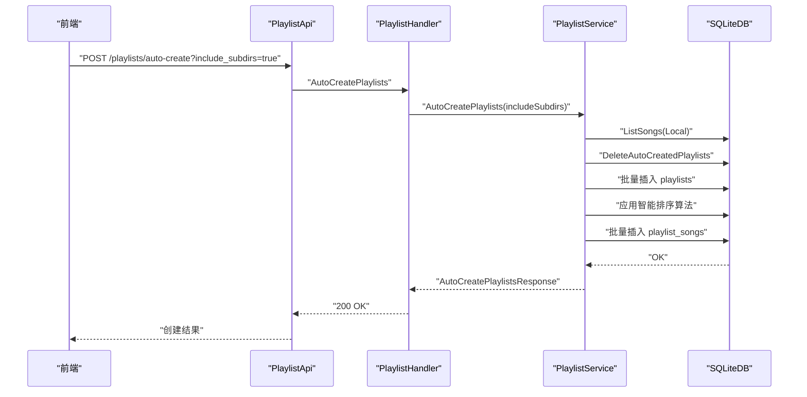
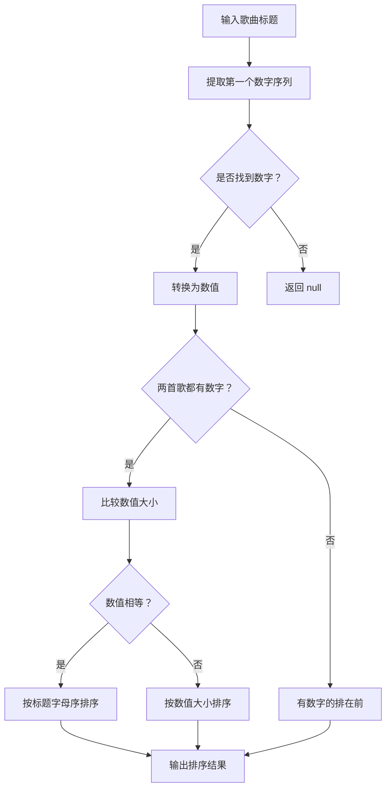
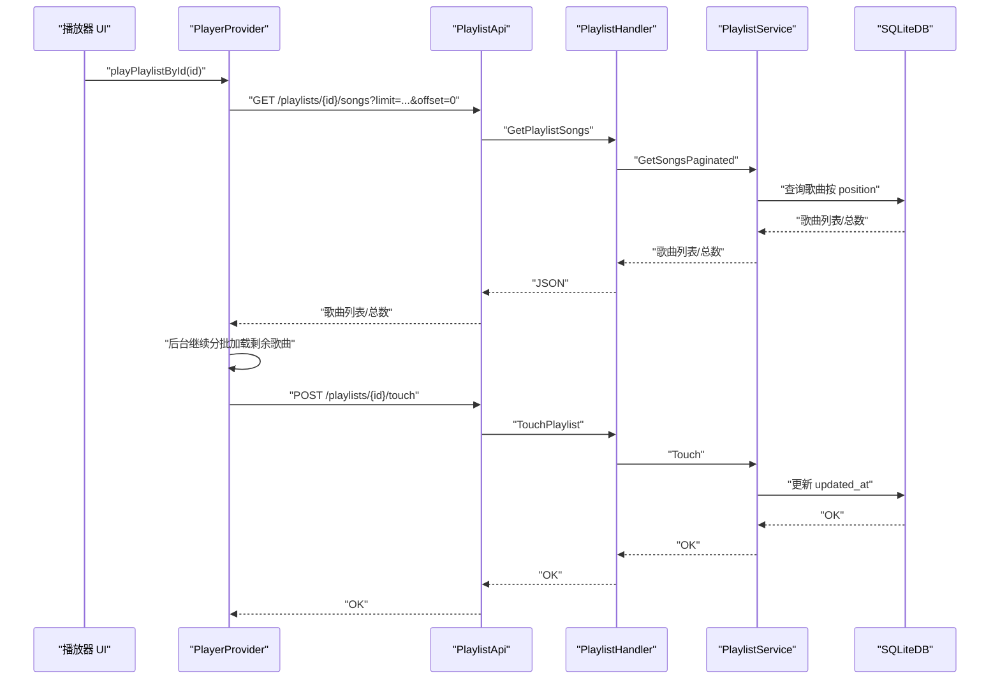
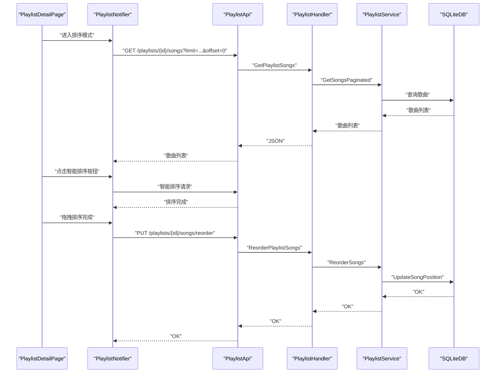
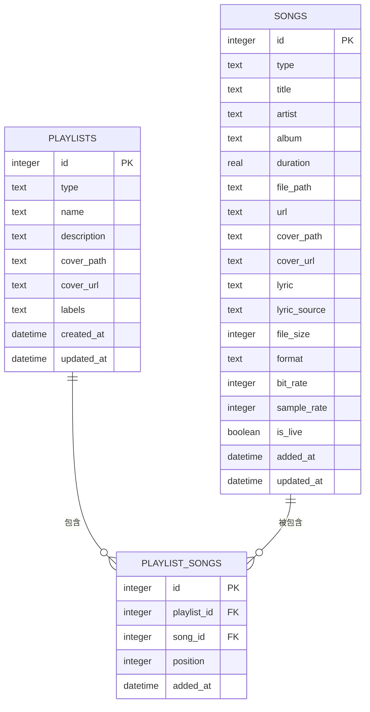

# 歌单管理功能

<cite>
**本文引用的文件**
- [internal/handlers/playlist.go](file://internal/handlers/playlist.go)
- [internal/services/playlist_service.go](file://internal/services/playlist_service.go)
- [internal/database/sqlite_playlist.go](file://internal/database/sqlite_playlist.go)
- [internal/database/sqlite_playlist_song.go](file://internal/database/sqlite_playlist_song.go)
- [internal/models/models.go](file://internal/models/models.go)
- [internal/database/schema.go](file://internal/database/schema.go)
- [frontend/lib/features/playlist/data/playlist_api.dart](file://frontend/lib/features/playlist/data/playlist_api.dart)
- [web/src/api/playlists.ts](file://web/src/api/playlists.ts)
- [frontend/lib/features/playlist/presentation/providers/playlist_provider.dart](file://frontend/lib/features/playlist/presentation/providers/playlist_provider.dart)
- [frontend/lib/features/playlist/presentation/playlist_detail_page.dart](file://frontend/lib/features/playlist/presentation/playlist_detail_page.dart)
- [frontend/lib/features/player/presentation/providers/player_provider.dart](file://frontend/lib/features/player/presentation/providers/player_provider.dart)
- [frontend/lib/features/player/presentation/widgets/mobile_player.dart](file://frontend/lib/features/player/presentation/widgets/mobile_player.dart)
- [frontend/lib/features/library/presentation/providers/favorite_provider.dart](file://frontend/lib/features/library/presentation/providers/favorite_provider.dart)
- [internal/handlers/playlist_test.go](file://internal/handlers/playlist_test.go)
</cite>

## 更新摘要
**变更内容**
- 新增自动歌单智能排序功能，支持按数字前缀排序算法
- 前端新增数字前缀排序按钮，支持歌单和歌曲的智能排序
- 后端实现与前端一致的排序规则，确保排序一致性
- 自动创建歌单时应用智能排序算法

## 目录
1. [简介](#简介)
2. [项目结构](#项目结构)
3. [核心组件](#核心组件)
4. [架构总览](#架构总览)
5. [详细组件分析](#详细组件分析)
6. [依赖分析](#依赖分析)
7. [性能考虑](#性能考虑)
8. [故障排查指南](#故障排查指南)
9. [结论](#结论)
10. [附录](#附录)

## 简介
本文件面向 MiMusic 的"歌单管理"能力，系统性梳理后端接口、服务层、数据库模型与前端交互的实现细节，覆盖以下主题：
- 歌单 CRUD：创建、查询、更新、删除
- 歌曲与歌单的多对多关系与排序管理：手动排序、批量添加、移除、统计
- 内置歌单：收藏、电台收藏等系统预设歌单
- 播放顺序与播放模式：顺序、循环、单曲、随机、单曲播放
- 自动创建歌单：基于本地音乐目录结构生成歌单，支持智能排序
- 智能排序算法：按数字前缀排序，复制 Flutter 前端排序行为
- 前后端 API 与数据模型映射
- 性能优化与最佳实践

## 项目结构
围绕歌单管理的关键模块分布如下：
- 后端
  - 处理器层：REST API 入口，参数解析与响应封装
  - 服务层：业务逻辑编排，权限与约束校验
  - 数据层：SQLite 访问，SQL 语句与索引设计，智能排序算法
  - 模型层：数据结构与校验规则
- 前端
  - API 客户端：统一调用后端接口
  - Provider 层：状态管理与缓存策略
  - 页面与组件：排序、批量选择、播放控制、智能排序按钮

**图表来源**
- [internal/handlers/playlist.go:15-651](file://internal/handlers/playlist.go#L15-L651)
- [internal/services/playlist_service.go:11-313](file://internal/services/playlist_service.go#L11-L313)
- [internal/database/sqlite_playlist.go:17-819](file://internal/database/sqlite_playlist.go#L17-L819)
- [frontend/lib/features/playlist/presentation/playlist_detail_page.dart:160-221](file://frontend/lib/features/playlist/presentation/playlist_detail_page.dart#L160-L221)

**章节来源**
- [internal/handlers/playlist.go:27-651](file://internal/handlers/playlist.go#L27-L651)
- [internal/services/playlist_service.go:23-313](file://internal/services/playlist_service.go#L23-L313)
- [internal/database/sqlite_playlist.go:17-819](file://internal/database/sqlite_playlist.go#L17-L819)
- [frontend/lib/features/playlist/presentation/playlist_detail_page.dart:160-221](file://frontend/lib/features/playlist/presentation/playlist_detail_page.dart#L160-L221)

## 核心组件
- 歌单模型与约束
  - 歌单类型：普通/电台；名称必填；标签数组用于扩展属性（如内置、自动创建）
  - 歌曲类型与歌单类型匹配：普通歌单仅允许本地/网络歌曲；电台歌单仅允许电台
- 数据库表与索引
  - playlists：主表，包含标签字段（JSON）与时间戳
  - playlist_songs：多对多关联表，按 position 排序，外键级联删除
  - 索引：按类型、标签、位置排序等
- 服务层职责
  - 校验、类型约束、位置计算、批量操作、自动创建歌单
- 处理器层职责
  - 参数解析、分页、鉴权、统一响应
- 智能排序算法
  - 数字前缀提取：从歌曲标题中提取第一个连续数字
  - 排序规则：有数字的排在前，数值小的在前，相同数值按标题字母序
  - 与前端保持完全一致的排序行为

**章节来源**
- [internal/models/models.go:124-183](file://internal/models/models.go#L124-L183)
- [internal/database/schema.go:28-104](file://internal/database/schema.go#L28-L104)
- [internal/services/playlist_service.go:23-313](file://internal/services/playlist_service.go#L23-L313)
- [internal/handlers/playlist.go:27-651](file://internal/handlers/playlist.go#L27-L651)
- [internal/database/sqlite_playlist.go:768-819](file://internal/database/sqlite_playlist.go#L768-L819)

## 架构总览
后端采用经典的三层架构：HTTP 处理器 → 业务服务 → 数据库访问。前端通过 API 客户端与后端交互，并在 Provider 中维护状态与缓存。新增的智能排序功能确保前后端排序行为的一致性。

**图表来源**
- [frontend/lib/features/playlist/presentation/playlist_detail_page.dart:169-221](file://frontend/lib/features/playlist/presentation/playlist_detail_page.dart#L169-L221)
- [internal/handlers/playlist.go:473-552](file://internal/handlers/playlist.go#L473-L552)
- [internal/services/playlist_service.go:232-272](file://internal/services/playlist_service.go#L232-L272)
- [internal/database/sqlite_playlist.go:768-819](file://internal/database/sqlite_playlist.go#L768-L819)

## 详细组件分析

### 歌单 CRUD 与查询
- 创建歌单
  - 前端：构造请求体（类型、名称、描述、封面），POST /playlists
  - 后端：解码请求体，调用服务层创建，返回 201
  - 服务层：校验数据，写入 playlists 表
  - 数据层：插入记录，设置创建/更新时间
- 查询歌单列表
  - 支持按类型过滤、分页、按 updated_at 降序
- 查询单个歌单详情
  - 根据 ID 获取，不存在返回 404
- 更新歌单
  - 仅允许更新名称等非类型字段（类型不可变）
- 删除歌单
  - 内置标签歌单禁止删除；其余走删除流程

**图表来源**
- [internal/handlers/playlist.go:114-141](file://internal/handlers/playlist.go#L114-L141)
- [internal/services/playlist_service.go:23-36](file://internal/services/playlist_service.go#L23-L36)
- [internal/database/sqlite_playlist.go:17-47](file://internal/database/sqlite_playlist.go#L17-L47)

**章节来源**
- [internal/handlers/playlist.go:27-244](file://internal/handlers/playlist.go#L27-L244)
- [internal/services/playlist_service.go:23-92](file://internal/services/playlist_service.go#L23-L92)
- [internal/database/sqlite_playlist.go:17-165](file://internal/database/sqlite_playlist.go#L17-L165)

### 歌曲与歌单的多对多关系与排序
- 关系模型
  - playlist_songs：记录歌单与歌曲的多对多关系，按 position 排序
  - 约束：UNIQUE(playlist_id, song_id)，外键级联删除
- 批量添加歌曲
  - 服务层遍历 song_ids，逐个调用 AddSong，自动计算 position（末尾）
  - 跳过已存在歌曲，返回 added/skipped 数量
- 移除歌曲
  - 通过 playlist_id 与 song_id 删除关联
- 分页查询歌曲
  - 按 position 升序返回，支持 limit/offset
- 统计歌曲数量
  - COUNT(*) 用于分页总条数
- 重新排序
  - 服务层校验传入的 song_ids 与现有数量一致
  - 逐项更新 position

**图表来源**
- [internal/services/playlist_service.go:232-250](file://internal/services/playlist_service.go#L232-L250)
- [internal/database/sqlite_playlist_song.go:147-168](file://internal/database/sqlite_playlist_song.go#L147-L168)

**章节来源**
- [internal/database/sqlite_playlist_song.go:10-169](file://internal/database/sqlite_playlist_song.go#L10-L169)
- [internal/services/playlist_service.go:104-250](file://internal/services/playlist_service.go#L104-L250)

### 内置歌单与自动创建歌单
- 内置歌单
  - 初始化脚本中插入"收藏""电台收藏"，标签为 built_in
  - 删除时禁止删除带 built_in 标签的歌单
- 自动创建歌单
  - 服务层扫描本地歌曲，按目录路径聚合
  - 支持 include_subdirs：同时将歌曲加入父级目录歌单
  - 单事务批量删除旧 auto_created 标签歌单，批量插入新歌单与关联
  - 为每个歌单随机挑选一张封面（本地路径优先）
  - **新增**：应用智能排序算法，按数字前缀对歌单内歌曲进行排序

**图表来源**
- [internal/handlers/playlist.go:554-583](file://internal/handlers/playlist.go#L554-L583)
- [internal/services/playlist_service.go:274-283](file://internal/services/playlist_service.go#L274-L283)
- [internal/database/sqlite_playlist.go:381-548](file://internal/database/sqlite_playlist.go#L381-L548)

**章节来源**
- [internal/database/schema.go:134-147](file://internal/database/schema.go#L134-L147)
- [internal/services/playlist_service.go:274-283](file://internal/services/playlist_service.go#L274-L283)
- [internal/database/sqlite_playlist.go:381-548](file://internal/database/sqlite_playlist.go#L381-L548)

### 智能排序算法实现
- 数字前缀提取
  - 从歌曲标题中提取第一个连续数字字符序列
  - 支持数字出现在标题开头或中间位置
  - 例如："04.校园故事" → 4，"干得漂亮 | 01 好意被辜负" → 1
- 排序规则
  - 都有数字：按数值大小排序，数值相同时按标题字母序
  - 只有一方有数字：有数字的排在前面
  - 都没有数字：按标题字母序排序
- 前后端一致性
  - 后端实现与前端完全一致的排序逻辑
  - 自动创建歌单时应用智能排序
  - 支持手动排序功能

**图表来源**
- [frontend/lib/features/playlist/presentation/playlist_detail_page.dart:160-195](file://frontend/lib/features/playlist/presentation/playlist_detail_page.dart#L160-L195)
- [internal/database/sqlite_playlist.go:768-819](file://internal/database/sqlite_playlist.go#L768-L819)

**章节来源**
- [frontend/lib/features/playlist/presentation/playlist_detail_page.dart:160-221](file://frontend/lib/features/playlist/presentation/playlist_detail_page.dart#L160-L221)
- [internal/database/sqlite_playlist.go:768-819](file://internal/database/sqlite_playlist.go#L768-L819)

### 播放顺序与播放模式
- 播放模式
  - 顺序播放、列表循环、单曲循环、随机播放、单曲播放
  - 图标与提示文案由 UI 控件提供
- 播放器加载策略
  - 首屏加载部分歌曲，剩余歌曲分批异步加载
  - 加载过程中通过"代次"检测是否被新的播放请求覆盖
  - 加载完成后调用 touchPlaylist 更新歌单最后播放时间

**图表来源**
- [frontend/lib/features/player/presentation/providers/player_provider.dart:413-517](file://frontend/lib/features/player/presentation/providers/player_provider.dart#L413-L517)
- [frontend/lib/features/player/presentation/widgets/mobile_player.dart:450-478](file://frontend/lib/features/player/presentation/widgets/mobile_player.dart#L450-L478)
- [internal/handlers/playlist.go:182-212](file://internal/handlers/playlist.go#L182-L212)
- [internal/services/playlist_service.go:88-94](file://internal/services/playlist_service.go#L88-L94)
- [internal/database/sqlite_playlist.go:126-145](file://internal/database/sqlite_playlist.go#L126-L145)

**章节来源**
- [frontend/lib/features/player/presentation/providers/player_provider.dart:413-517](file://frontend/lib/features/player/presentation/providers/player_provider.dart#L413-L517)
- [frontend/lib/features/player/presentation/widgets/mobile_player.dart:450-478](file://frontend/lib/features/player/presentation/widgets/mobile_player.dart#L450-L478)
- [internal/handlers/playlist.go:182-212](file://internal/handlers/playlist.go#L182-L212)
- [internal/services/playlist_service.go:88-94](file://internal/services/playlist_service.go#L88-L94)
- [internal/database/sqlite_playlist.go:126-145](file://internal/database/sqlite_playlist.go#L126-L145)

### 前端交互与状态管理
- 歌单详情页
  - 支持进入/退出排序模式，本地副本进行拖拽排序，保存后调用后端重排接口
  - 支持多选模式，批量移除歌曲
  - **新增**：智能排序按钮，支持按数字前缀自动排序
- 歌单列表加载
  - 首页/列表页分页加载，Provider 中合并分页结果
  - **新增**：支持歌单的智能排序功能
- 收藏内置歌单
  - 初始化时查找或创建"收藏""电台收藏"歌单，幂等操作

**图表来源**
- [frontend/lib/features/playlist/presentation/playlist_detail_page.dart:169-221](file://frontend/lib/features/playlist/presentation/playlist_detail_page.dart#L169-L221)
- [frontend/lib/features/playlist/presentation/providers/playlist_provider.dart:45-81](file://frontend/lib/features/playlist/presentation/providers/playlist_provider.dart#L45-L81)
- [internal/handlers/playlist.go:473-552](file://internal/handlers/playlist.go#L473-L552)
- [internal/services/playlist_service.go:232-250](file://internal/services/playlist_service.go#L232-L250)
- [internal/database/sqlite_playlist_song.go:147-168](file://internal/database/sqlite_playlist_song.go#L147-L168)

**章节来源**
- [frontend/lib/features/playlist/presentation/playlist_detail_page.dart:169-221](file://frontend/lib/features/playlist/presentation/playlist_detail_page.dart#L169-L221)
- [frontend/lib/features/playlist/presentation/providers/playlist_provider.dart:45-81](file://frontend/lib/features/playlist/presentation/providers/playlist_provider.dart#L45-L81)
- [frontend/lib/features/library/presentation/providers/favorite_provider.dart:81-117](file://frontend/lib/features/library/presentation/providers/favorite_provider.dart#L81-L117)

### API 接口一览（后端）
- 列表歌单
  - 方法：GET
  - 路径：/playlists
  - 查询参数：type、limit、offset
  - 响应：playlists、limit、offset
- 获取歌单详情
  - 方法：GET
  - 路径：/playlists/{id}
- 创建歌单
  - 方法：POST
  - 路径：/playlists
  - 请求体：Playlist（type、name、description、cover_path）
  - 响应：Playlist
- 更新歌单
  - 方法：PUT
  - 路径：/playlists/{id}
  - 请求体：Playlist（name、description、cover_path）
- 删除歌单
  - 方法：DELETE
  - 路径：/playlists/{id}
- 获取歌单歌曲
  - 方法：GET
  - 路径：/playlists/{id}/songs
  - 查询参数：limit、offset
  - 响应：songs、total、limit、offset
- 批量添加歌曲
  - 方法：POST
  - 路径：/playlists/{id}/songs
  - 请求体：{ song_ids: [int64...] }
  - 响应：{ message, added, skipped }
- 重新排序歌曲
  - 方法：PUT
  - 路径：/playlists/{id}/songs/reorder
  - 请求体：{ song_ids: [int64...] }
- 从歌单移除歌曲
  - 方法：DELETE
  - 路径：/playlists/{id}/songs/{songId}
- 更新歌单最后播放时间
  - 方法：POST
  - 路径：/playlists/{id}/touch
- 自动创建歌单
  - 方法：POST
  - 路径：/playlists/auto-create
  - 查询参数：include_subdirs
  - 响应：AutoCreatePlaylistsResponse
- **新增**：重新排序歌单列表
  - 方法：PUT
  - 路径：/playlists/reorder
  - 请求体：{ playlist_ids: [int64...] }

**章节来源**
- [internal/handlers/playlist.go:27-651](file://internal/handlers/playlist.go#L27-L651)

### 前端 API 客户端（Flutter/Web）
- Flutter（Dio）
  - PlaylistApi 提供 getPlaylists、createPlaylist、getPlaylist、updatePlaylist、deletePlaylist、autoCreatePlaylists、getPlaylistSongs、addSongsToPlaylist、reorderPlaylistSongs、removeSongFromPlaylist、touchPlaylist、**智能排序相关方法**
- Web（Axios）
  - 对应 playlists.ts 提供 listPlaylists、getPlaylist、createPlaylist、updatePlaylist、deletePlaylist、getPlaylistSongs、addSongToPlaylist、reorderPlaylistSongs、removeSongFromPlaylist、touchPlaylist、autoCreatePlaylists

**章节来源**
- [frontend/lib/features/playlist/data/playlist_api.dart:13-149](file://frontend/lib/features/playlist/data/playlist_api.dart#L13-L149)
- [web/src/api/playlists.ts:22-99](file://web/src/api/playlists.ts#L22-L99)

## 依赖分析
- 组件耦合
  - 处理器依赖服务层；服务层依赖数据库接口；数据库实现依赖 SQLite
  - 前端 API 客户端与后端接口一一对应
  - 智能排序算法在前后端保持完全一致
- 外部依赖
  - SQLite：本地存储；索引与触发器保证一致性与性能
  - Dio/Axios：HTTP 客户端
- 循环依赖
  - 未发现循环依赖

**图表来源**
- [frontend/lib/features/playlist/data/playlist_api.dart:8-149](file://frontend/lib/features/playlist/data/playlist_api.dart#L8-L149)
- [internal/handlers/playlist.go:15-25](file://internal/handlers/playlist.go#L15-L25)
- [internal/services/playlist_service.go:11-21](file://internal/services/playlist_service.go#L11-L21)
- [internal/database/sqlite_playlist.go:1-16](file://internal/database/sqlite_playlist.go#L1-L16)
- [internal/models/models.go:1-6](file://internal/models/models.go#L1-L6)

**章节来源**
- [internal/handlers/playlist.go:15-25](file://internal/handlers/playlist.go#L15-L25)
- [internal/services/playlist_service.go:11-21](file://internal/services/playlist_service.go#L11-L21)
- [internal/database/sqlite_playlist.go:1-16](file://internal/database/sqlite_playlist.go#L1-L16)
- [internal/models/models.go:1-6](file://internal/models/models.go#L1-L6)

## 性能考虑
- 数据库层面
  - playlist_songs 上建立复合索引 (playlist_id, position)，确保排序查询高效
  - 使用事务批量插入歌单与关联，减少往返开销
  - 使用预编译语句与批量参数，降低 SQL 解析成本
  - **新增**：智能排序使用稳定的排序算法，避免不必要的重排
- 服务层层面
  - 批量添加歌曲时跳过已存在项，避免重复写入
  - 重新排序前先校验数量一致性，避免多余更新
  - **新增**：智能排序算法复杂度为 O(n log n)，适合大量歌曲场景
- 前端层面
  - 首屏加载 + 分批后台加载，结合"代次"检测避免竞态
  - 排序模式使用本地副本，减少频繁网络请求
  - **新增**：智能排序前先加载全部歌曲到内存，确保排序准确性
- 其他
  - 自动创建歌单时，预先序列化标签 JSON，减少重复编码
  - 选择封面时随机打散候选，提升多样性
  - **新增**：智能排序算法与前端保持一致，避免重复计算

**章节来源**
- [internal/database/schema.go:89-104](file://internal/database/schema.go#L89-L104)
- [internal/database/sqlite_playlist.go:381-548](file://internal/database/sqlite_playlist.go#L381-L548)
- [internal/services/playlist_service.go:232-250](file://internal/services/playlist_service.go#L232-L250)
- [frontend/lib/features/player/presentation/providers/player_provider.dart:460-517](file://frontend/lib/features/player/presentation/providers/player_provider.dart#L460-L517)
- [frontend/lib/features/playlist/presentation/playlist_detail_page.dart:170-221](file://frontend/lib/features/playlist/presentation/playlist_detail_page.dart#L170-L221)

## 故障排查指南
- 常见错误与定位
  - 歌单不存在：查询返回 404；检查 ID 或数据库是否存在
  - 无效请求数据：创建/更新失败；检查必填字段与类型
  - 歌单类型不匹配：向普通歌单添加电台歌曲会失败；确认歌单类型
  - 内置歌单不可删除：带 built_in 标签的歌单禁止删除
  - 歌曲不在歌单：移除或重排时 song not found；确认 song_id 存在于歌单
  - **新增**：智能排序失败：检查歌曲标题是否包含有效数字前缀
- 前端调试
  - 播放器后台加载被覆盖：检查代次变量是否变化；确认网络请求返回时仍在同一代次
  - 排序保存失败：确认 song_ids 与现有数量一致；查看后端返回错误
  - **新增**：智能排序无效果：确认歌曲标题包含数字前缀；检查排序算法是否正确识别
- 单元测试参考
  - mockPlaylistDB 提供了 CRUD 与歌曲关联的基本行为，可用于验证处理器与服务层逻辑

**章节来源**
- [internal/handlers/playlist.go:95-244](file://internal/handlers/playlist.go#L95-L244)
- [internal/services/playlist_service.go:73-92](file://internal/services/playlist_service.go#L73-L92)
- [internal/database/sqlite_playlist.go:147-165](file://internal/database/sqlite_playlist.go#L147-L165)
- [internal/database/sqlite_playlist_song.go:25-43](file://internal/database/sqlite_playlist_song.go#L25-L43)
- [internal/handlers/playlist_test.go:19-252](file://internal/handlers/playlist_test.go#L19-L252)

## 结论
MiMusic 的歌单管理以清晰的三层架构实现：前端通过统一 API 客户端与后端交互，后端以服务层编排业务逻辑，数据库以多对多关系与索引保障性能与一致性。新增的智能排序功能确保了前后端排序行为的一致性，自动创建歌单时应用智能排序算法提升了用户体验。内置歌单与自动创建机制进一步完善了歌单管理功能，播放器的分批加载与播放模式提升了播放体验。整体设计具备良好的扩展性与可维护性。

## 附录

### 数据模型图

**图表来源**
- [internal/database/schema.go:5-51](file://internal/database/schema.go#L5-L51)

### 智能排序算法详细说明
- 数字前缀提取函数
  - 输入：歌曲标题字符串
  - 输出：第一个连续数字序列的数值，如果不存在则返回 0 和 false
  - 算法：遍历字符串，找到第一个数字序列并转换为整数
- 排序比较函数
  - 输入：两首歌曲对象
  - 输出：布尔值，表示是否应该交换位置
  - 规则：优先级为"有数字" > "无数字"，数值相同时按标题字母序
- 应用场景
  - 自动创建歌单时对歌曲进行排序
  - 用户手动触发智能排序功能
  - 保持前后端排序行为一致

**章节来源**
- [internal/database/sqlite_playlist.go:768-819](file://internal/database/sqlite_playlist.go#L768-L819)
- [frontend/lib/features/playlist/presentation/playlist_detail_page.dart:160-221](file://frontend/lib/features/playlist/presentation/playlist_detail_page.dart#L160-L221)