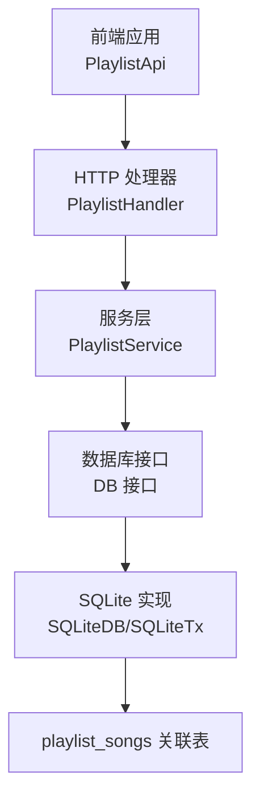
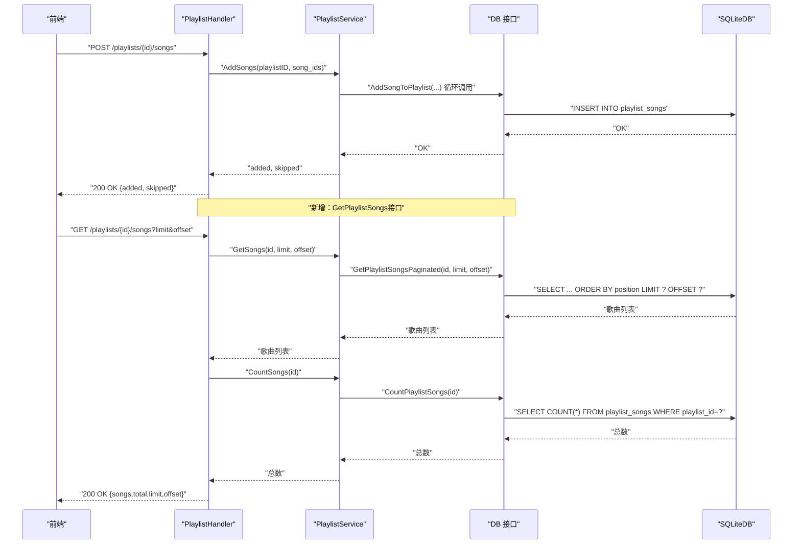
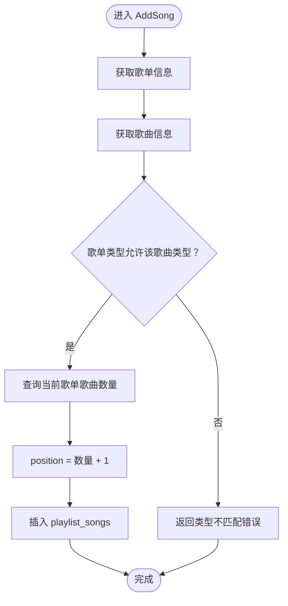
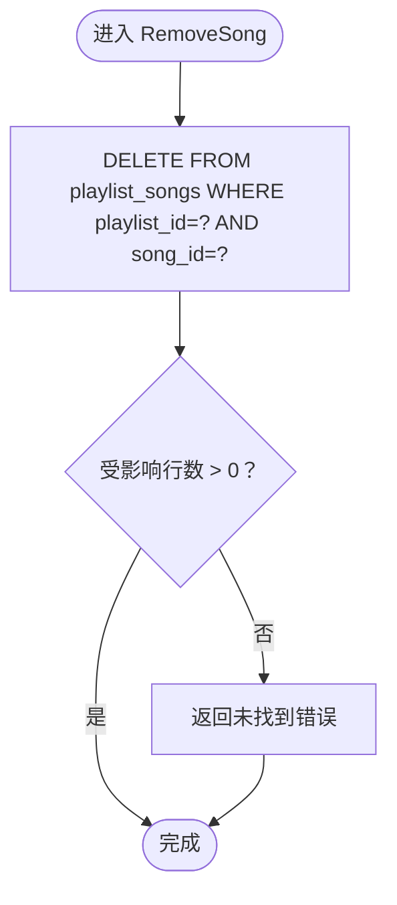
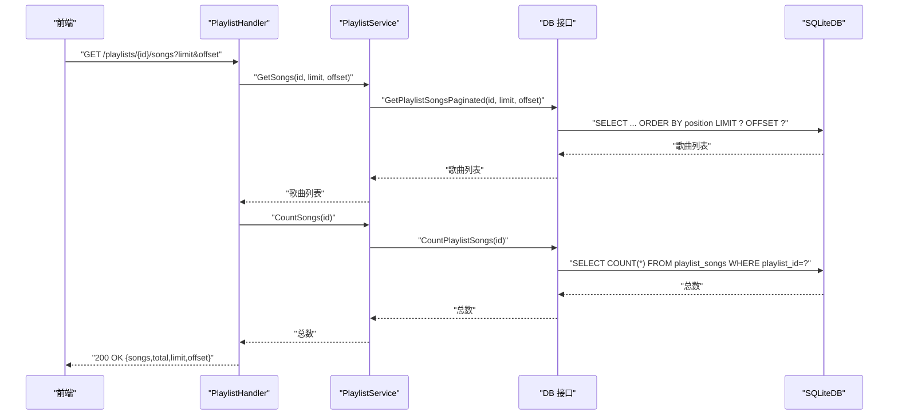
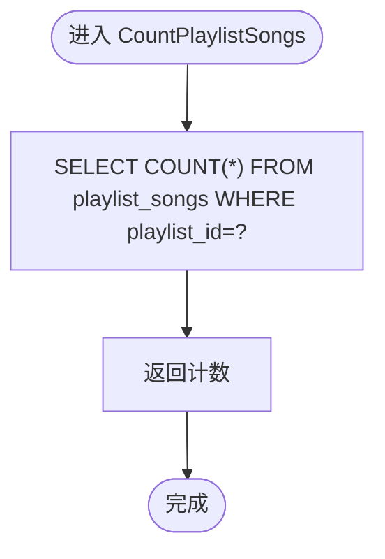
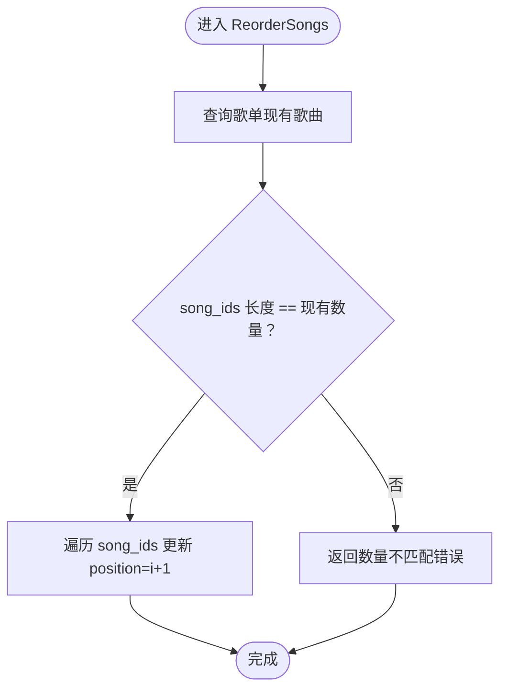
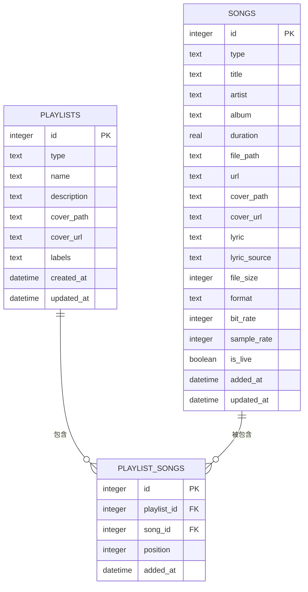

# 歌曲与歌单关联管理

<cite>
**本文引用的文件**
- [internal/handlers/playlist.go](file://internal/handlers/playlist.go)
- [internal/services/playlist_service.go](file://internal/services/playlist_service.go)
- [internal/database/sqlite_playlist_song.go](file://internal/database/sqlite_playlist_song.go)
- [internal/database/schema.go](file://internal/database/schema.go)
- [internal/models/models.go](file://internal/models/models.go)
- [frontend/lib/features/playlist/data/playlist_api.dart](file://frontend/lib/features/playlist/data/playlist_api.dart)
- [frontend/lib/shared/models/song.dart](file://frontend/lib/shared/models/song.dart)
- [frontend/lib/features/playlist/data/playlist_repository.dart](file://frontend/lib/features/playlist/data/playlist_repository.dart)
- [frontend/lib/features/playlist/presentation/providers/playlist_provider.dart](file://frontend/lib/features/playlist/presentation/providers/playlist_provider.dart)
- [internal/database/database.go](file://internal/database/database.go)
- [internal/database/sqlite.go](file://internal/database/sqlite.go)
</cite>

## 更新摘要
**变更内容**
- 更新GetPlaylistSongs接口响应结构，新增total字段表示歌单中的歌曲总数
- 增强分页查询功能，total字段通过数据库COUNT聚合查询实现
- 前端SongListResponse模型支持total字段解析
- 前端播放器和歌单详情页面利用total字段进行完整歌曲加载

## 目录
1. [简介](#简介)
2. [项目结构](#项目结构)
3. [核心组件](#核心组件)
4. [架构总览](#架构总览)
5. [详细组件分析](#详细组件分析)
6. [依赖分析](#依赖分析)
7. [性能考虑](#性能考虑)
8. [故障排查指南](#故障排查指南)
9. [结论](#结论)
10. [附录](#附录)

## 简介
本文档围绕 MiMusic 的"歌曲与歌单关联管理"能力，系统化梳理后端处理流程、数据库模型与索引设计、前端 API 映射以及性能与可靠性保障。重点覆盖以下能力点：
- AddSong 与 AddSongs 的实现逻辑：歌曲类型验证、重复添加处理、位置计算策略
- RemoveSong 的移除机制与级联影响
- GetSongs 的分页查询实现：limit 与 offset 的使用，**新增total字段支持**
- CountSongs 的统计逻辑与性能优化
- 批量操作的事务处理与错误恢复
- 歌曲排序管理：手动排序与自动排序
- 数据库操作示例、API 接口说明与使用模式
- 性能优化建议与最佳实践

## 项目结构
后端采用"处理器 → 服务 → 数据库"的分层架构，前端通过 HTTP API 与后端交互。**新增total字段支持完整的歌单歌曲总数统计**。

**图表来源**
- [internal/handlers/playlist.go:15-25](file://internal/handlers/playlist.go#L15-L25)
- [internal/services/playlist_service.go:11-21](file://internal/services/playlist_service.go#L11-L21)
- [internal/database/database.go:8-64](file://internal/database/database.go#L8-L64)
- [internal/database/sqlite.go:12-80](file://internal/database/sqlite.go#L12-L80)
- [internal/database/schema.go:41-51](file://internal/database/schema.go#L41-L51)

**章节来源**
- [internal/handlers/playlist.go:15-25](file://internal/handlers/playlist.go#L15-L25)
- [internal/services/playlist_service.go:11-21](file://internal/services/playlist_service.go#L11-L21)
- [internal/database/database.go:8-64](file://internal/database/database.go#L8-L64)
- [internal/database/sqlite.go:12-80](file://internal/database/sqlite.go#L12-L80)
- [internal/database/schema.go:41-51](file://internal/database/schema.go#L41-L51)

## 核心组件
- HTTP 处理器：负责解析请求参数、调用服务层并返回响应，**新增total字段统计**
- 服务层：封装业务规则（类型检查、位置计算、排序更新等）
- 数据库层：提供增删改查与事务支持，**新增COUNT聚合查询**
- 前端 API 客户端：封装后端接口调用，**支持total字段解析**

**章节来源**
- [internal/handlers/playlist.go:246-441](file://internal/handlers/playlist.go#L246-L441)
- [internal/services/playlist_service.go:104-201](file://internal/services/playlist_service.go#L104-L201)
- [internal/database/sqlite_playlist_song.go:10-168](file://internal/database/sqlite_playlist_song.go#L10-L168)
- [frontend/lib/features/playlist/data/playlist_api.dart:103-148](file://frontend/lib/features/playlist/data/playlist_api.dart#L103-L148)

## 架构总览
后端通过处理器将前端请求映射到服务层，服务层再委托数据库层执行具体操作。数据库层基于 SQLite，并启用 WAL、超时与缓存优化；通过外键约束与唯一约束保证数据一致性。**新增total字段通过独立的COUNT查询实现，确保分页与总数的一致性**。

**图表来源**
- [internal/handlers/playlist.go:311-359](file://internal/handlers/playlist.go#L311-L359)
- [internal/services/playlist_service.go:139-149](file://internal/services/playlist_service.go#L139-L149)
- [internal/database/sqlite_playlist_song.go:10-23](file://internal/database/sqlite_playlist_song.go#L10-L23)
- [internal/handlers/playlist.go:292-312](file://internal/handlers/playlist.go#L292-L312)
- [internal/services/playlist_service.go:195-203](file://internal/services/playlist_service.go#L195-L203)
- [internal/database/sqlite_playlist_song.go:130-145](file://internal/database/sqlite_playlist_song.go#L130-L145)

## 详细组件分析

### AddSong 与 AddSongs：类型验证、重复处理与位置计算
- 类型验证：服务层在添加前获取歌单与歌曲信息，调用歌单的类型判断函数，确保歌曲类型与歌单类型匹配（普通歌单仅允许本地/网络，电台歌单仅允许电台）。
- 重复处理：AddSongs 对每个 songID 调用 AddSong，若某歌曲已存在于歌单（由唯一约束导致插入失败），AddSong 抛出错误，AddSongs 统计 skipped 并继续处理下一个。
- 位置计算：AddSong 获取当前歌单歌曲列表长度，新歌曲 position = 当前数量 + 1，保证追加到末尾。

**图表来源**
- [internal/services/playlist_service.go:104-137](file://internal/services/playlist_service.go#L104-L137)
- [internal/models/models.go:162-174](file://internal/models/models.go#L162-L174)
- [internal/database/sqlite_playlist_song.go:10-23](file://internal/database/sqlite_playlist_song.go#L10-L23)

**章节来源**
- [internal/services/playlist_service.go:104-137](file://internal/services/playlist_service.go#L104-L137)
- [internal/models/models.go:162-174](file://internal/models/models.go#L162-L174)
- [internal/database/sqlite_playlist_song.go:10-23](file://internal/database/sqlite_playlist_song.go#L10-L23)

### RemoveSong：移除机制与级联影响
- 移除机制：服务层直接调用数据库层的移除方法，按 playlist_id 与 song_id 删除关联记录。
- 级联影响：playlist_songs 的外键指向 songs 与 playlists，删除关联不会级联删除歌曲或歌单本身；但删除歌单时，由于外键定义为 ON DELETE CASCADE，歌单删除会级联删除其所有关联记录（见 schema）。

**图表来源**
- [internal/services/playlist_service.go:151-158](file://internal/services/playlist_service.go#L151-L158)
- [internal/database/sqlite_playlist_song.go:25-43](file://internal/database/sqlite_playlist_song.go#L25-L43)
- [internal/database/schema.go:48-49](file://internal/database/schema.go#L48-L49)

**章节来源**
- [internal/services/playlist_service.go:151-158](file://internal/services/playlist_service.go#L151-L158)
- [internal/database/sqlite_playlist_song.go:25-43](file://internal/database/sqlite_playlist_song.go#L25-L43)
- [internal/database/schema.go:48-49](file://internal/database/schema.go#L48-L49)

### GetSongs：分页查询（limit 与 offset），**新增total字段支持**
- 查询实现：服务层调用数据库层的分页查询方法，按 position 升序返回歌曲列表。
- 参数使用：limit 控制每页数量，offset 控制起始偏移；处理器解析查询参数并传入服务层。
- **新增total字段**：处理器同时调用 CountSongs 获取歌单歌曲总数，确保分页查询的完整性。

**图表来源**
- [internal/handlers/playlist.go:246-309](file://internal/handlers/playlist.go#L246-L309)
- [internal/services/playlist_service.go:160-168](file://internal/services/playlist_service.go#L160-L168)
- [internal/database/sqlite_playlist_song.go:87-128](file://internal/database/sqlite_playlist_song.go#L87-L128)
- [internal/handlers/playlist.go:292-312](file://internal/handlers/playlist.go#L292-L312)
- [internal/services/playlist_service.go:195-203](file://internal/services/playlist_service.go#L195-L203)
- [internal/database/sqlite_playlist_song.go:130-145](file://internal/database/sqlite_playlist_song.go#L130-L145)

**章节来源**
- [internal/handlers/playlist.go:246-309](file://internal/handlers/playlist.go#L246-L309)
- [internal/services/playlist_service.go:160-168](file://internal/services/playlist_service.go#L160-L168)
- [internal/database/sqlite_playlist_song.go:87-128](file://internal/database/sqlite_playlist_song.go#L87-L128)
- [internal/handlers/playlist.go:292-312](file://internal/handlers/playlist.go#L292-L312)
- [internal/services/playlist_service.go:195-203](file://internal/services/playlist_service.go#L195-L203)
- [internal/database/sqlite_playlist_song.go:130-145](file://internal/database/sqlite_playlist_song.go#L130-L145)

### CountSongs：统计逻辑与性能优化
- 统计逻辑：服务层调用数据库层的 CountPlaylistSongs，对 playlist_songs 按 playlist_id 计数。
- 性能优化：schema 中为 playlist_songs 建立复合索引 idx_playlist_songs_position(playlist_id, position)，有利于按歌单分组统计与排序；SQLite WAL 模式提升并发读写性能。

**图表来源**
- [internal/services/playlist_service.go:170-178](file://internal/services/playlist_service.go#L170-L178)
- [internal/database/sqlite_playlist_song.go:130-145](file://internal/database/sqlite_playlist_song.go#L130-L145)
- [internal/database/schema.go:96-97](file://internal/database/schema.go#L96-L97)
- [internal/database/sqlite.go:24-30](file://internal/database/sqlite.go#L24-L30)

**章节来源**
- [internal/services/playlist_service.go:170-178](file://internal/services/playlist_service.go#L170-L178)
- [internal/database/sqlite_playlist_song.go:130-145](file://internal/database/sqlite_playlist_song.go#L130-L145)
- [internal/database/schema.go:96-97](file://internal/database/schema.go#L96-L97)
- [internal/database/sqlite.go:24-30](file://internal/database/sqlite.go#L24-L30)

### 批量操作的事务处理与错误恢复
- 事务支持：数据库接口定义了 Tx 接口，提供 Commit 与 Rollback；SQLiteDB 支持 BeginTx。
- 错误恢复：当批量添加过程中出现错误（如重复添加），AddSongs 会统计 skipped 并继续处理后续项；对于需要原子性的场景，可在上层使用事务包裹（例如在批量创建歌曲或批量重排时）。
- 建议：对涉及多步写入且必须一致性的操作（如批量创建歌曲并建立关联），应在服务层或处理器层开启事务并在失败时回滚。

**章节来源**
- [internal/database/database.go:66-76](file://internal/database/database.go#L66-L76)
- [internal/database/sqlite.go:60-79](file://internal/database/sqlite.go#L60-L79)
- [internal/services/playlist_service.go:139-149](file://internal/services/playlist_service.go#L139-L149)

### 歌曲排序管理：手动排序与自动排序
- 手动排序：前端调用重排序接口，服务层先校验目标 song_ids 与现有歌单中的歌曲数量一致，再逐项更新 position。
- 自动排序：当前仓库未提供自动排序接口；如需实现，可在服务层增加"按标题/艺术家/添加时间"等规则生成 position 序列并批量更新。

**图表来源**
- [internal/services/playlist_service.go:180-201](file://internal/services/playlist_service.go#L180-L201)
- [internal/database/sqlite_playlist_song.go:147-168](file://internal/database/sqlite_playlist_song.go#L147-L168)
- [frontend/lib/features/playlist/data/playlist_api.dart:126-133](file://frontend/lib/features/playlist/data/playlist_api.dart#L126-L133)

**章节来源**
- [internal/services/playlist_service.go:180-201](file://internal/services/playlist_service.go#L180-L201)
- [internal/database/sqlite_playlist_song.go:147-168](file://internal/database/sqlite_playlist_song.go#L147-L168)
- [frontend/lib/features/playlist/data/playlist_api.dart:126-133](file://frontend/lib/features/playlist/data/playlist_api.dart#L126-L133)

### 数据库模型与索引
- 关联表：playlist_songs 存储歌单与歌曲的多对多关系，包含 position 与唯一约束 (playlist_id, song_id)。
- 索引：为 playlist_id 与 position 建立复合索引，支持高效分页与排序；为歌曲/歌单主表建立常用字段索引，提升查询性能。
- 外键：playlist_id 与 song_id 引用 playlists 与 songs，删除歌单时会级联删除关联记录。

**图表来源**
- [internal/database/schema.go:5-51](file://internal/database/schema.go#L5-L51)
- [internal/database/schema.go:96-97](file://internal/database/schema.go#L96-L97)

**章节来源**
- [internal/database/schema.go:5-51](file://internal/database/schema.go#L5-L51)
- [internal/database/schema.go:96-97](file://internal/database/schema.go#L96-L97)

### API 接口说明与使用模式
- 获取歌单歌曲（分页）
  - 方法：GET /api/v1/playlists/{id}/songs
  - 参数：limit（默认值由处理器解析）、offset
  - **返回：songs、total、limit、offset**（total字段表示歌单中的歌曲总数）
- 批量添加歌曲
  - 方法：POST /api/v1/playlists/{id}/songs
  - 请求体：{ song_ids: [int64...] }
  - 返回：{ message, added, skipped }
- 重新排序歌曲
  - 方法：PUT /api/v1/playlists/{id}/songs/reorder
  - 请求体：{ song_ids: [int64...] }
  - 返回：{ message }
- 移除歌曲
  - 方法：DELETE /api/v1/playlists/{id}/songs/{songId}
  - 返回：{ message }

**章节来源**
- [internal/handlers/playlist.go:246-441](file://internal/handlers/playlist.go#L246-L441)
- [frontend/lib/features/playlist/data/playlist_api.dart:103-148](file://frontend/lib/features/playlist/data/playlist_api.dart#L103-L148)

### 前端集成与使用模式
- **SongListResponse模型**：支持total字段解析，确保前端能够正确处理歌单歌曲总数
- **自动分页加载**：playlist_provider使用total字段确保完整加载歌单中的所有歌曲
- **播放器集成**：player_provider利用total字段进行后台加载和播放控制

**章节来源**
- [frontend/lib/shared/models/song.dart:151-172](file://frontend/lib/shared/models/song.dart#L151-L172)
- [frontend/lib/features/playlist/presentation/providers/playlist_provider.dart:39-73](file://frontend/lib/features/playlist/presentation/providers/playlist_provider.dart#L39-L73)
- [frontend/lib/features/player/presentation/providers/player_provider.dart:530-556](file://frontend/lib/features/player/presentation/providers/player_provider.dart#L530-L556)

## 依赖分析
- 处理器依赖服务层；服务层依赖数据库接口；数据库接口由 SQLite 实现。
- 关联表依赖歌曲与歌单主表；外键约束保证引用完整性。
- 前端 API 客户端依赖后端路由与响应结构，**新增total字段支持**。

**图表来源**
- [internal/handlers/playlist.go:15-25](file://internal/handlers/playlist.go#L15-L25)
- [internal/services/playlist_service.go:11-21](file://internal/services/playlist_service.go#L11-L21)
- [internal/database/database.go:8-64](file://internal/database/database.go#L8-L64)
- [internal/database/sqlite.go:12-80](file://internal/database/sqlite.go#L12-L80)
- [internal/database/schema.go:41-51](file://internal/database/schema.go#L41-L51)

**章节来源**
- [internal/handlers/playlist.go:15-25](file://internal/handlers/playlist.go#L15-L25)
- [internal/services/playlist_service.go:11-21](file://internal/services/playlist_service.go#L11-L21)
- [internal/database/database.go:8-64](file://internal/database/database.go#L8-L64)
- [internal/database/sqlite.go:12-80](file://internal/database/sqlite.go#L12-L80)
- [internal/database/schema.go:41-51](file://internal/database/schema.go#L41-L51)

## 性能考虑
- 数据库优化
  - WAL 模式：提升并发读写性能，降低写操作阻塞
  - busy_timeout：避免 SQLITE_BUSY，提升稳定性
  - synchronous=NORMAL：在安全性与性能间取得平衡
  - cache_size：增大页缓存，减少磁盘 IO
  - 外键约束：启用外键保证一致性
- 索引优化
  - playlist_songs(playlist_id, position)：支持按歌单分页与排序
  - **新增：COUNT聚合查询索引优化**，提升total字段统计性能
  - songs/ playlists 常用字段索引：加速查询
- 分页策略
  - limit/offset：适合中小规模歌单；大规模歌单可考虑基于 position 的游标分页
  - **total字段配合分页查询，确保前端显示准确性**
- 批量操作
  - 使用事务包裹批量写入，减少锁竞争与回滚成本
  - 对重复添加场景，优先去重后再批量插入
- **新增：total字段缓存策略**
  - 对于频繁访问的歌单，可考虑在服务层缓存total字段
  - 缓存失效策略：歌单歌曲增删改后及时更新缓存

**章节来源**
- [internal/database/sqlite.go:24-50](file://internal/database/sqlite.go#L24-L50)
- [internal/database/schema.go:96-103](file://internal/database/schema.go#L96-L103)
- [internal/services/playlist_service.go:139-149](file://internal/services/playlist_service.go#L139-L149)

## 故障排查指南
- 添加歌曲失败
  - 检查歌单类型与歌曲类型是否匹配
  - 检查是否已存在重复歌曲（唯一约束）
- 移除歌曲失败
  - 确认 playlist_id 与 song_id 是否正确
  - 确认关联记录是否存在
- 分页查询异常
  - 检查 limit/offset 参数范围
  - 确认数据库连接与 WAL 配置正常
  - **检查total字段是否正确返回**
- 重排序失败
  - 确认传入的 song_ids 数量与歌单现有数量一致
  - 检查 position 更新是否成功
- **新增：total字段问题排查**
  - 确认CountPlaylistSongs查询是否返回正确结果
  - 检查playlist_songs表中是否有脏数据
  - 验证COUNT聚合查询的索引使用情况

**章节来源**
- [internal/services/playlist_service.go:104-137](file://internal/services/playlist_service.go#L104-L137)
- [internal/database/sqlite_playlist_song.go:25-43](file://internal/database/sqlite_playlist_song.go#L25-L43)
- [internal/database/sqlite_playlist_song.go:87-128](file://internal/database/sqlite_playlist_song.go#L87-L128)
- [internal/database/sqlite_playlist_song.go:147-168](file://internal/database/sqlite_playlist_song.go#L147-L168)
- [internal/database/sqlite_playlist_song.go:130-145](file://internal/database/sqlite_playlist_song.go#L130-L145)

## 结论
MiMusic 的歌曲与歌单关联管理以清晰的分层架构实现：前端通过标准 HTTP 接口驱动后端，后端在服务层统一处理业务规则（类型校验、位置计算、排序更新），数据库层通过 SQLite 与索引优化保障性能与一致性。**新增的total字段支持确保了歌单歌曲总数的准确性和前端展示的完整性**。对于大规模歌单与高并发场景，建议结合事务、WAL 与游标分页策略进一步优化，并考虑total字段的缓存机制以提升性能。

## 附录
- 前端调用示例（路径）
  - 获取歌单歌曲：[frontend/lib/features/playlist/data/playlist_api.dart:103-115](file://frontend/lib/features/playlist/data/playlist_api.dart#L103-L115)
  - 批量添加歌曲：[frontend/lib/features/playlist/data/playlist_api.dart:117-124](file://frontend/lib/features/playlist/data/playlist_api.dart#L117-L124)
  - 重新排序歌曲：[frontend/lib/features/playlist/data/playlist_api.dart:126-133](file://frontend/lib/features/playlist/data/playlist_api.dart#L126-L133)
  - 移除歌曲：[frontend/lib/features/playlist/data/playlist_api.dart:135-141](file://frontend/lib/features/playlist/data/playlist_api.dart#L135-L141)
- **新增：前端SongListResponse模型**
  - total字段解析：[frontend/lib/shared/models/song.dart:151-172](file://frontend/lib/shared/models/song.dart#L151-L172)
  - 自动分页加载：[frontend/lib/features/playlist/presentation/providers/playlist_provider.dart:39-73](file://frontend/lib/features/playlist/presentation/providers/playlist_provider.dart#L39-L73)