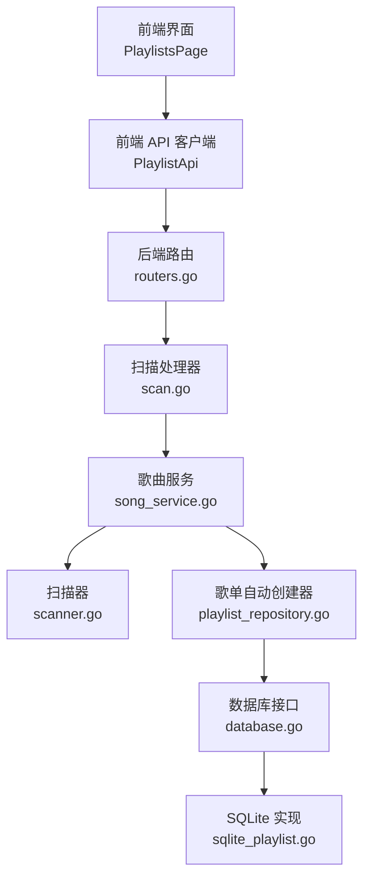
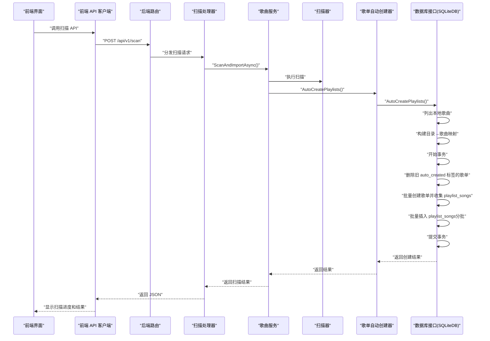
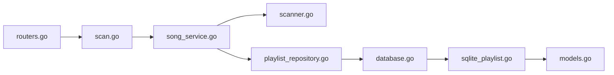

# 自动歌单创建

<cite>
**本文引用的文件**
- [internal/database/playlist_repository.go](file://internal/database/playlist_repository.go)
- [internal/services/song_service.go](file://internal/services/song_service.go)
- [internal/services/scanner.go](file://internal/services/scanner.go)
- [internal/handlers/scan.go](file://internal/handlers/scan.go)
- [internal/models/models.go](file://internal/models/models.go)
- [internal/database/sqlc/playlists.sql.go](file://internal/database/sqlc/playlists.sql.go)
- [internal/database/sqlite_test.go](file://internal/database/sqlite_test.go)
- [frontend/lib/features/playlist/data/playlist_api.dart](file://frontend/lib/features/playlist/data/playlist_api.dart)
- [frontend/lib/features/playlist/presentation/playlists_page.dart](file://frontend/lib/features/playlist/presentation/playlists_page.dart)
- [internal/app/routers.go](file://internal/app/routers.go)
</cite>

## 更新摘要
**所做更改**
- 移除了独立API端点文档，因为自动歌单创建功能已重构为扫描过程的内部流程
- 更新了架构说明，改为扫描后自动创建的流程
- 更新了配置项说明，移除了include_subdirs查询参数
- 更新了测试用例文档，反映了新的实现方式
- 更新了前端交互说明，移除了手动触发自动创建的功能

## 目录
1. [简介](#简介)
2. [项目结构](#项目结构)
3. [核心组件](#核心组件)
4. [架构总览](#架构总览)
5. [详细组件分析](#详细组件分析)
6. [依赖关系分析](#依赖关系分析)
7. [性能考量](#性能考量)
8. [故障排除指南](#故障排除指南)
9. [结论](#结论)
10. [附录](#附录)

## 简介
本文件面向 MiMusic 的"自动歌单创建"功能，围绕 AutoCreatePlaylists 方法的实现进行深入解析。经过重构后，自动歌单创建功能已集成到扫描流程中，不再通过独立API端点提供。本文涵盖以下主题：
- 扫描后自动创建歌单的流程
- includeSubdirs 参数的作用与递归扫描机制
- 自动创建歌单的命名规则与分类逻辑
- 与手动创建歌单的区别与优先级处理
- 自动创建过程中的错误处理与回滚机制
- 配置选项与自定义参数的使用说明
- 使用场景与最佳实践建议
- 对系统性能的影响与优化策略
- 故障排除指南与常见问题解决方案

## 项目结构
自动歌单创建功能现已集成到扫描流程中，涉及后端三层（HTTP 路由 → 处理器 → 服务 → 数据库）与扫描服务的协作，整体调用链如下：

**图表来源**
- [internal/app/routers.go:142-147](file://internal/app/routers.go#L142-L147)
- [internal/handlers/scan.go:48-67](file://internal/handlers/scan.go#L48-L67)
- [internal/services/song_service.go:40-73](file://internal/services/song_service.go#L40-L73)
- [internal/services/scanner.go:27-37](file://internal/services/scanner.go#L27-L37)
- [internal/database/playlist_repository.go:268-421](file://internal/database/playlist_repository.go#L268-L421)

**章节来源**
- [internal/app/routers.go:142-147](file://internal/app/routers.go#L142-L147)
- [internal/handlers/scan.go:48-67](file://internal/handlers/scan.go#L48-L67)
- [internal/services/song_service.go:40-73](file://internal/services/song_service.go#L40-L73)
- [internal/services/scanner.go:27-37](file://internal/services/scanner.go#L27-L37)
- [internal/database/playlist_repository.go:268-421](file://internal/database/playlist_repository.go#L268-L421)

## 核心组件
- **扫描处理器**：处理扫描请求，调用歌曲服务执行扫描和导入
- **歌曲服务**：协调扫描执行和自动歌单创建，提供扫描进度管理
- **扫描器**：执行实际的文件扫描和音乐导入
- **歌单自动创建器**：实现 AutoCreatePlaylists 方法，负责目录扫描、歌单创建、批量插入与事务回滚
- **数据库层**：实现 AutoCreatePlaylists，负责目录扫描、歌单创建、批量插入与事务回滚
- **前端 API 客户端**：通过扫描API触发扫描流程，间接触发自动歌单创建
- **前端页面**：提供扫描界面，用户可以触发扫描和查看进度

**章节来源**
- [internal/handlers/scan.go:48-67](file://internal/handlers/scan.go#L48-L67)
- [internal/services/song_service.go:40-73](file://internal/services/song_service.go#L40-L73)
- [internal/database/playlist_repository.go:268-421](file://internal/database/playlist_repository.go#L268-L421)

## 架构总览
自动创建歌单的端到端流程现已集成到扫描流程中：

**图表来源**
- [internal/app/routers.go:142-147](file://internal/app/routers.go#L142-L147)
- [internal/handlers/scan.go:48-67](file://internal/handlers/scan.go#L48-L67)
- [internal/services/song_service.go:40-73](file://internal/services/song_service.go#L40-L73)
- [internal/database/playlist_repository.go:268-421](file://internal/database/playlist_repository.go#L268-L421)

## 详细组件分析

### AutoCreatePlaylists 方法实现逻辑
- **输入参数**
  - includeSubdirs：是否包含子目录的布尔开关
- **目录扫描与映射**
  - 读取所有本地歌曲，提取文件路径的目录部分，建立"目录 → 歌曲ID列表"的映射
  - 若 includeSubdirs 为真，则将歌曲同时映射到其所有祖先目录（递归向上）
- **歌单创建**
  - 以"目录路径"作为歌单名称，生成描述文本
  - 为每个歌单随机挑选一张封面（优先本地封面路径，其次远程封面 URL）
  - 为所有歌单统一打上 auto_created 标签，便于后续清理
- **事务与批量插入**
  - 在单一事务中执行所有写操作，保证原子性
  - 先删除旧的 auto_created 标签歌单，再批量创建新歌单
  - 收集所有 playlist_songs 关联数据，按批次（每批最多 500 条）批量插入，降低开销
- **返回结果**
  - 返回每个创建的歌单 ID、名称与歌曲数量，以及总创建数量

**章节来源**
- [internal/database/playlist_repository.go:268-421](file://internal/database/playlist_repository.go#L268-L421)
- [internal/models/models.go:424-446](file://internal/models/models.go#L424-L446)

### includeSubdirs 参数与递归扫描机制
- **作用**
  - 控制是否将歌曲加入其所有祖先目录对应的歌单
- **递归扫描**
  - 当 includeSubdirs 为真时，对每个歌曲路径逐级向上计算父目录，直到根目录或当前层级不变为止，将歌曲加入到所有祖先目录映射中
- **示例**
  - 假设存在歌曲 a/b/c.mp3、a/bb/cc.mp3、a/ccc.mp3：
    - 不包含子目录：创建 a、b、bb 三个歌单，a 只包含 ccc.mp3
    - 包含子目录：创建 a、b、bb 三个歌单，a 包含全部三首歌曲

**章节来源**
- [internal/database/playlist_repository.go:290-305](file://internal/database/playlist_repository.go#L290-L305)

### 自动创建歌单的命名规则与分类逻辑
- **命名规则**
  - 歌单名称即为歌曲所在目录的绝对路径（经标准化后的斜杠形式）
- **分类逻辑**
  - 所有自动创建的歌单统一带有 auto_created 标签，便于后续批量清理
- **封面选择**
  - 从该目录下任一有封面的歌曲中随机挑选，优先使用本地封面路径，其次使用远程封面 URL

**章节来源**
- [internal/database/playlist_repository.go:361-372](file://internal/database/playlist_repository.go#L361-L372)
- [internal/database/playlist_repository.go:687-705](file://internal/database/playlist_repository.go#L687-L705)
- [internal/models/models.go:443-446](file://internal/models/models.go#L443-L446)

### 与手动创建歌单的区别与优先级处理
- **区别**
  - 手动创建：由用户指定名称、类型、描述等，适合长期维护的个性化歌单
  - 自动创建：基于目录结构自动生成，适合快速整理与临时分类
- **优先级与覆盖**
  - 自动创建会先删除所有带 auto_created 标签的旧歌单，再重建，确保与当前目录结构一致
  - 若手动歌单与自动歌单同名，自动创建不会覆盖手动歌单；但若手动歌单被打上 auto_created 标签，则会被自动清理流程覆盖

**章节来源**
- [internal/database/playlist_repository.go:335-343](file://internal/database/playlist_repository.go#L335-L343)
- [internal/database/playlist_repository.go:239-247](file://internal/database/playlist_repository.go#L239-L247)

### 错误处理与回滚机制
- **事务回滚**
  - 在 AutoCreatePlaylists 中使用单一事务包裹所有写操作；一旦任一步骤失败，立即回滚，保证数据一致性
- **常见错误点**
  - 列出本地歌曲失败
  - 删除旧歌单失败
  - 插入歌单失败
  - 批量插入 playlist_songs 失败
  - 提交事务失败
- **前端反馈**
  - 前端通过扫描进度接口查看扫描和自动创建的状态

**章节来源**
- [internal/database/playlist_repository.go:435-459](file://internal/database/playlist_repository.go#L435-L459)
- [internal/database/playlist_repository.go:414-421](file://internal/database/playlist_repository.go#L414-L421)

### 配置选项与自定义参数
- **include_subdirs 查询参数**
  - 类型：布尔
  - 默认：false
  - 作用：是否包含子目录
  - **注意**：此参数已移除，现在通过扫描服务的配置控制
- **前端交互**
  - 前端提供扫描界面，用户触发扫描后自动创建歌单
- **后端解析**
  - 扫描服务内部处理自动创建逻辑，不再需要单独的API参数

**章节来源**
- [internal/models/models.go:424-427](file://internal/models/models.go#L424-L427)
- [internal/handlers/scan.go:48-67](file://internal/handlers/scan.go#L48-L67)

### 使用场景与最佳实践
- **使用场景**
  - 首次导入大量本地音乐后，扫描完成后自动按目录结构生成歌单
  - 音乐库结构调整后，重新扫描时自动刷新歌单与歌曲归属
- **最佳实践**
  - 建议首次使用时启用"包含子目录"选项，以便更全面地组织歌曲
  - 定期重新扫描音乐库，保持歌单与目录结构同步
  - 若手动维护了重要歌单，请勿将其命名为与目录相同的名称，避免被自动创建覆盖

**章节来源**
- [internal/handlers/scan.go:48-67](file://internal/handlers/scan.go#L48-L67)

## 依赖关系分析
- **扫描到自动创建**
  - /api/v1/scan → songService.ScanAndImportAsync → playlistRepository.AutoCreate
- **处理器到服务**
  - ScanAndImportAsync(ctx, includeSubdirs) → playlistRepository.AutoCreate
- **服务到数据库**
  - AutoCreatePlaylists(ctx, includeSubdirs) → db.AutoCreatePlaylists
- **数据库到模型**
  - 使用 AutoCreatePlaylistsResponse、PlaylistInfo、标签常量等

**图表来源**
- [internal/app/routers.go:142-147](file://internal/app/routers.go#L142-L147)
- [internal/handlers/scan.go:48](file://internal/handlers/scan.go#L48)
- [internal/services/song_service.go:40](file://internal/services/song_service.go#L40)
- [internal/database/playlist_repository.go:268](file://internal/database/playlist_repository.go#L268)
- [internal/models/models.go:424](file://internal/models/models.go#L424)

**章节来源**
- [internal/app/routers.go:142-147](file://internal/app/routers.go#L142-L147)
- [internal/handlers/scan.go:48-67](file://internal/handlers/scan.go#L48-L67)
- [internal/services/song_service.go:40-73](file://internal/services/song_service.go#L40-L73)
- [internal/database/playlist_repository.go:268-421](file://internal/database/playlist_repository.go#L268-L421)
- [internal/models/models.go:424-446](file://internal/models/models.go#L424-L446)

## 性能考量
- **单事务 + 批量插入**
  - 将所有写操作放入单一事务，减少事务开销与锁竞争
  - playlist_songs 批量插入采用分批（每批最多 500 行）策略，平衡内存占用与吞吐
- **预编译语句**
  - 歌单插入使用预编译语句，避免重复解析 SQL
- **标签过滤删除**
  - 使用 JSON 查询一次性删除旧歌单，避免逐条遍历
- **随机封面选择**
  - 通过打散候选列表后随机选取，避免重复扫描

**章节来源**
- [internal/database/playlist_repository.go:435-459](file://internal/database/playlist_repository.go#L435-L459)
- [internal/database/playlist_repository.go:392-413](file://internal/database/playlist_repository.go#L392-L413)
- [internal/database/playlist_repository.go:335-343](file://internal/database/playlist_repository.go#L335-L343)
- [internal/database/playlist_repository.go:687-705](file://internal/database/playlist_repository.go#L687-L705)

## 故障排除指南
- **现象**：扫描完成后歌单数量为 0
  - 可能原因：本地歌曲为空或路径为空
  - 处理：确认音乐库已扫描并存在本地歌曲
- **现象**：部分歌曲未被加入歌单
  - 可能原因：includeSubdirs 为 false 时仅加入直接父目录
  - 处理：检查扫描配置，确认是否启用了包含子目录选项
- **现象**：封面显示异常或缺失
  - 可能原因：该目录下无封面或封面不可用
  - 处理：为歌曲添加封面或手动更换封面
- **现象**：操作后歌单未更新
  - 可能原因：旧歌单未被清理或事务回滚
  - 处理：确认服务端日志与数据库状态；重新触发扫描
- **现象**：前端提示扫描失败
  - 可能原因：网络中断、权限不足或服务端异常
  - 处理：检查网络与鉴权；查看服务端日志定位错误

**章节来源**
- [internal/database/playlist_repository.go:272-288](file://internal/database/playlist_repository.go#L272-L288)
- [internal/database/playlist_repository.go:290-305](file://internal/database/playlist_repository.go#L290-L305)
- [internal/database/playlist_repository.go:687-705](file://internal/database/playlist_repository.go#L687-L705)

## 结论
MiMusic 的自动歌单创建功能通过"扫描后自动创建"的设计，实现了与扫描流程深度集成的自动化整理能力。经过重构后，用户无需单独触发自动创建，只需正常进行音乐扫描，系统就会自动根据目录结构生成相应的歌单。includeSubdirs 参数提供了灵活的目录组织策略，配合 auto_created 标签与批量清理机制，确保歌单与音乐库结构保持一致。结合扫描进度管理和错误处理机制，用户可以轻松完成大规模音乐库的自动化整理。

## 附录
- **API 文档与路由**
  - POST /api/v1/scan 支持扫描和自动创建功能
  - GET /api/v1/scan/progress 获取扫描进度
  - POST /api/v1/scan/cancel 取消扫描任务
- **前端交互**
  - 提供扫描界面，用户触发扫描后自动创建歌单
  - 通过进度接口查看扫描和自动创建状态

**章节来源**
- [internal/app/routers.go:142-147](file://internal/app/routers.go#L142-L147)
- [internal/handlers/scan.go:48-102](file://internal/handlers/scan.go#L48-L102)
- [internal/database/sqlc/playlists.sql.go:142-169](file://internal/database/sqlc/playlists.sql.go#L142-L169)
- [internal/database/sqlite_test.go:321-362](file://internal/database/sqlite_test.go#L321-L362)