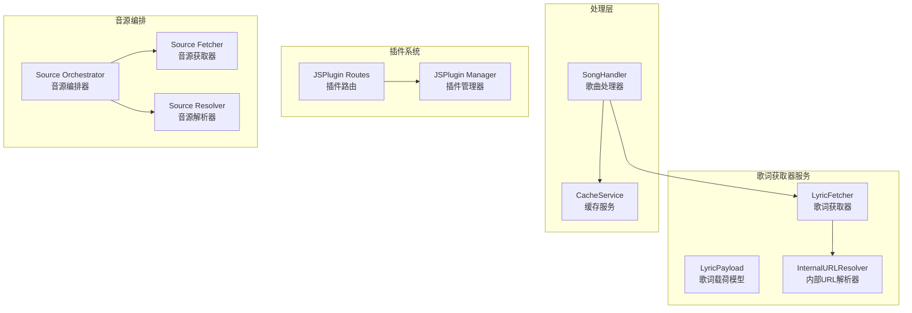
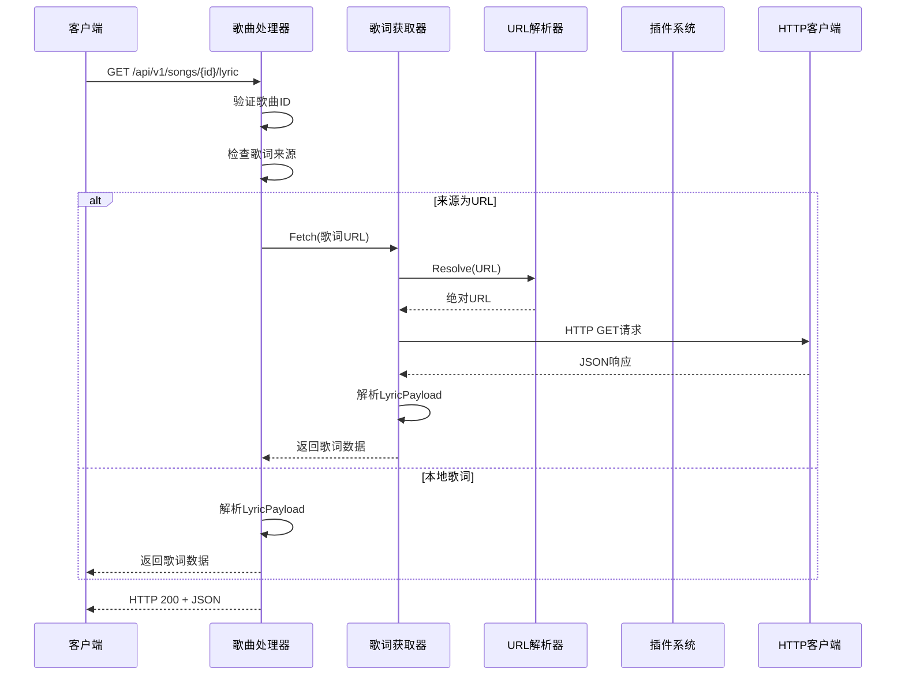
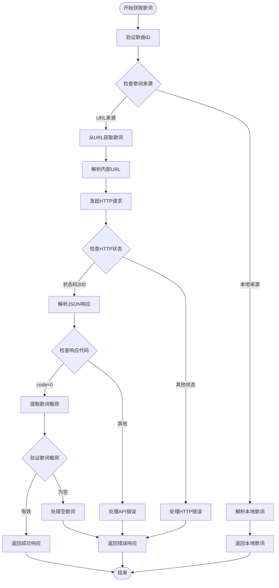
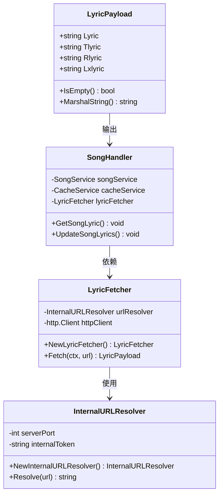
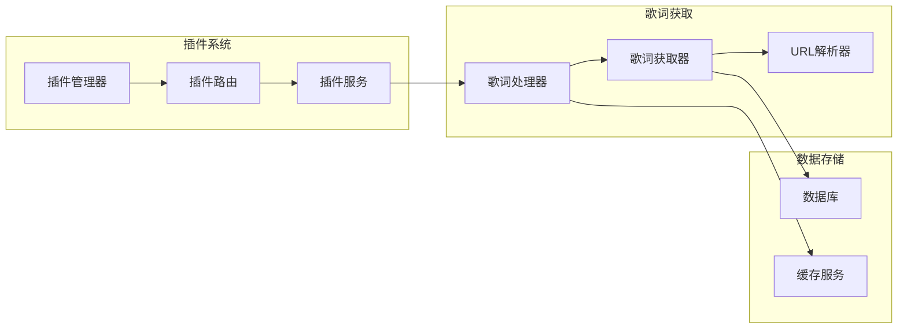
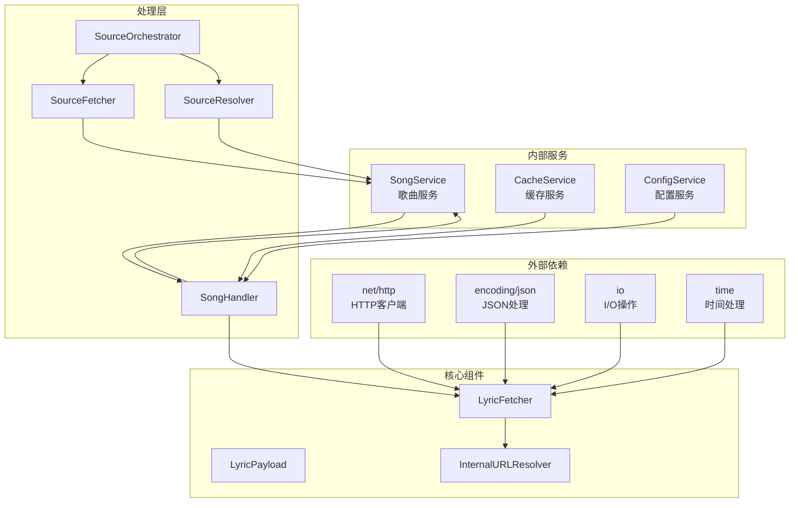

# 歌词获取器服务

<cite>
**本文档引用的文件**
- [lyric_fetcher.go](file://internal/services/lyric_fetcher.go)
- [lyric.go](file://internal/models/lyric.go)
- [music.go](file://internal/handlers/music.go)
- [internal_url.go](file://internal/services/internal_url.go)
- [routes.go](file://internal/jsplugin/routes.go)
- [manager.go](file://internal/jsplugin/manager.go)
- [orchestrator.go](file://internal/services/source/orchestrator.go)
- [fetcher.go](file://internal/services/source/fetcher.go)
- [resolver.go](file://internal/services/source/resolver.go)
- [cache_service.go](file://internal/services/cache_service.go)
</cite>

## 目录
1. [简介](#简介)
2. [项目结构](#项目结构)
3. [核心组件](#核心组件)
4. [架构概览](#架构概览)
5. [详细组件分析](#详细组件分析)
6. [依赖关系分析](#依赖关系分析)
7. [性能考虑](#性能考虑)
8. [故障排除指南](#故障排除指南)
9. [结论](#结论)

## 简介

歌词获取器服务是音乐应用中的关键组件，负责从各种来源获取和处理歌词数据。该服务支持多种歌词来源，包括本地歌词、插件歌词、远程歌词URL等，并提供统一的数据格式输出。系统采用模块化设计，通过接口抽象和依赖注入实现了高度的可扩展性和可维护性。

## 项目结构

歌词获取器服务位于项目的 `internal/services` 目录下，主要包含以下关键文件：

**图表来源**
- [lyric_fetcher.go:1-78](file://internal/services/lyric_fetcher.go#L1-L78)
- [music.go:19-43](file://internal/handlers/music.go#L19-L43)

**章节来源**
- [lyric_fetcher.go:1-78](file://internal/services/lyric_fetcher.go#L1-L78)
- [music.go:19-43](file://internal/handlers/music.go#L19-L43)

## 核心组件

### LyricFetcher（歌词获取器）

LyricFetcher 是歌词获取服务的核心组件，负责从指定URL拉取歌词数据并解析为统一格式。

**主要功能：**
- 从插件返回的歌词URL获取歌词数据
- 解析JSON响应格式
- 支持内部URL解析和认证
- 提供统一的LyricPayload输出

**关键特性：**
- 支持相对路径自动解析为绝对URL
- 5MB响应体大小限制防止内存泄漏
- 统一的错误处理机制
- 可配置的HTTP客户端

**章节来源**
- [lyric_fetcher.go:14-77](file://internal/services/lyric_fetcher.go#L14-L77)

### LyricPayload（歌词载荷模型）

LyricPayload 定义了歌词数据的统一存储和传输格式。

**数据结构：**
- `Lyric`: 主歌词文本
- `Tlyric`: 翻译歌词文本
- `Rlyric`: 罗马音歌词文本
- `Lxlyric`: 逐字歌词文本

**序列化机制：**
- 支持空payload的特殊处理
- JSON序列化兼容历史数据格式
- 字符串化用于数据库存储

**章节来源**
- [lyric.go:8-56](file://internal/models/lyric.go#L8-L56)

### InternalURLResolver（内部URL解析器）

InternalURLResolver 负责将相对路径转换为可访问的绝对URL。

**解析规则：**
- 相对路径：转换为 `http://127.0.0.1:{port}{path}?access_token={token}`
- 绝对URL：原样返回
- 空字符串：返回空字符串

**安全机制：**
- 自动添加访问令牌
- 防止路径遍历攻击
- 支持查询参数合并

**章节来源**
- [internal_url.go:8-44](file://internal/services/internal_url.go#L8-L44)

## 架构概览

歌词获取器服务采用分层架构设计，各组件职责明确，通过清晰的接口进行交互。

**图表来源**
- [music.go:728-774](file://internal/handlers/music.go#L728-L774)
- [lyric_fetcher.go:33-77](file://internal/services/lyric_fetcher.go#L33-L77)

## 详细组件分析

### 歌词获取流程

歌词获取过程涉及多个步骤，从请求处理到数据解析的完整流程如下：

**图表来源**
- [music.go:728-774](file://internal/handlers/music.go#L728-L774)
- [lyric_fetcher.go:33-77](file://internal/services/lyric_fetcher.go#L33-L77)

### 歌词数据处理

歌词数据处理涉及多种格式和来源，系统提供了灵活的数据转换机制：

**图表来源**
- [lyric.go:13-18](file://internal/models/lyric.go#L13-L18)
- [lyric_fetcher.go:20-31](file://internal/services/lyric_fetcher.go#L20-L31)
- [music.go:19-43](file://internal/handlers/music.go#L19-L43)

**章节来源**
- [lyric.go:13-79](file://internal/models/lyric.go#L13-L79)
- [lyric_fetcher.go:20-77](file://internal/services/lyric_fetcher.go#L20-L77)

### 插件集成机制

系统通过JS插件机制提供歌词获取能力，支持多种音乐平台的歌词服务：

**图表来源**
- [manager.go:32-53](file://internal/jsplugin/manager.go#L32-L53)
- [routes.go:46-59](file://internal/jsplugin/routes.go#L46-L59)

**章节来源**
- [manager.go:32-466](file://internal/jsplugin/manager.go#L32-L466)
- [routes.go:46-442](file://internal/jsplugin/routes.go#L46-L442)

## 依赖关系分析

歌词获取器服务的依赖关系体现了清晰的分层架构：

**图表来源**
- [lyric_fetcher.go:3-12](file://internal/services/lyric_fetcher.go#L3-L12)
- [music.go:12-16](file://internal/handlers/music.go#L12-L16)

**章节来源**
- [lyric_fetcher.go:3-12](file://internal/services/lyric_fetcher.go#L3-L12)
- [music.go:12-17](file://internal/handlers/music.go#L12-L17)

## 性能考虑

歌词获取器服务在设计时充分考虑了性能优化：

### 缓存策略
- **响应体大小限制**：5MB限制防止异常响应耗尽内存
- **HTTP客户端超时**：30秒超时避免长时间阻塞
- **连接池管理**：复用HTTP连接减少建立开销

### 错误处理
- **分级错误处理**：区分网络错误、解析错误、业务错误
- **快速失败机制**：及时检测和报告错误状态
- **资源清理**：自动清理临时文件和连接

### 并发控制
- **请求去重**：避免重复请求相同歌词
- **超时控制**：防止长时间阻塞影响用户体验
- **内存管理**：及时释放不再使用的资源

## 故障排除指南

### 常见问题及解决方案

**歌词获取失败**
- 检查插件是否正常加载
- 验证URL解析是否正确
- 确认网络连接状态

**歌词格式错误**
- 检查JSON响应格式
- 验证响应代码是否为0
- 确认歌词载荷字段完整性

**性能问题**
- 检查HTTP客户端配置
- 监控内存使用情况
- 优化缓存策略

**章节来源**
- [lyric_fetcher.go:50-77](file://internal/services/lyric_fetcher.go#L50-L77)
- [music.go:744-774](file://internal/handlers/music.go#L744-L774)

## 结论

歌词获取器服务通过模块化设计和清晰的架构实现了高效的歌词数据处理能力。系统支持多种歌词来源，提供统一的数据格式，并具备良好的扩展性和维护性。通过合理的错误处理机制和性能优化策略，确保了稳定的用户体验。

该服务的成功实施为音乐应用提供了可靠的歌词获取基础设施，为后续的功能扩展和性能优化奠定了坚实基础。