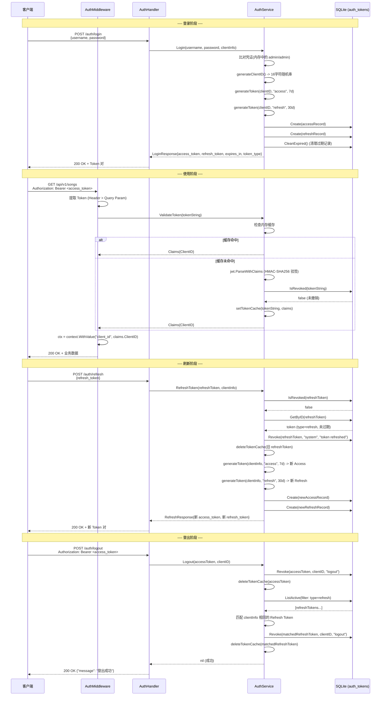

# 认证与授权

internal/services/auth_service.go
internal/middleware/auth.go
internal/handlers/auth.go
internal/database/token_repository.go
internal/models/models.go
internal/app/app.go
internal/config/types.go
internal/database/migrations/0001_init.sql
internal/database/queries/tokens.sql
internal/database/filters.go

## 目录

- [概述](#概述)
- [JWT 双 Token 机制](#jwt-双-token-机制)
- [认证流程](#认证流程)
- [令牌管理](#令牌管理)
- [插件内部 Token](#插件内部-token)
- [中间件流程](#中间件流程)
- [安全策略](#安全策略)
- [流程时序图](#流程时序图)
- [数据库 Schema](#数据库-schema)

---

## 概述

**章节来源**: `internal/services/auth_service.go`, `internal/middleware/auth.go`, `internal/app/app.go`

Songloft 采用 JWT（JSON Web Token）双 Token 机制实现认证与授权。系统为单用户架构，管理员凭证通过命令行参数或环境变量传入，JWT 签名密钥（HMAC-SHA256）在首次启动时自动生成并持久化到 SQLite `configs` 表。所有需要认证的 API 端点通过 Chi v5 中间件统一拦截，插件声明的公开路径可绕过认证。

核心组件：

| 组件 | 文件 | 职责 |
|------|------|------|
| `AuthService` | `services/auth_service.go` | JWT 生成/验证/刷新/撤销，内存缓存 |
| `AuthMiddleware` | `middleware/auth.go` | HTTP 请求拦截，Token 提取与验签 |
| `AuthHandler` | `handlers/auth.go` | REST API 端点（登录/登出/刷新/令牌管理） |
| `TokenRepository` | `database/token_repository.go` | 令牌持久化（sqlc + squirrel） |
| `auth_tokens` 表 | `migrations/0001_init.sql` | 令牌存储 Schema |

---

## JWT 双 Token 机制

**章节来源**: `internal/services/auth_service.go` (L126-L174), `internal/models/models.go` (L450-L462)

系统使用 Access Token + Refresh Token 双令牌模式：

| 属性 | Access Token | Refresh Token |
|------|-------------|---------------|
| 有效期 | 7 天 | 30 天 |
| 用途 | 访问受保护的 API 端点 | 获取新的 Token 对 |
| 数据库存储 | `token_type = 'access'` | `token_type = 'refresh'` |
| 签名算法 | HMAC-SHA256 | HMAC-SHA256 |

### Claims 结构

```go
type Claims struct {
    ClientID string `json:"client_id"` // 客户端标识或 "plugin-system"
    jwt.RegisteredClaims                // 标准字段：ExpiresAt, IssuedAt, ID
}
```

每个 JWT 包含三个标准声明：`exp`（过期时间）、`iat`（签发时间）、`jti`（32 字符随机 Token ID），以及一个自定义的 `client_id` 字段。`client_id` 在用户登录时由 `generateClientID()` 生成 16 字符随机串，在插件 Token 中固定为 `"plugin-system"`。

### Token 生成

`generateToken` 方法（L436-L455）统一负责 Token 签发：构造 Claims、使用 `jwt.SigningMethodHS256` 签名、以数据库中的 `jwt_secret` 作为密钥。生成的 JWT 字符串既作为客户端凭证，也作为 `auth_tokens` 表的 `token_id` 主键存入数据库。

### 响应格式

登录成功返回 `LoginResponse`：

```json
{
  "access_token": "eyJhbGciOiJIUzI1NiIs...",
  "refresh_token": "eyJhbGciOiJIUzI1NiIs...",
  "expires_in": 604800,
  "token_type": "Bearer"
}
```

`expires_in` 为 Access Token 剩余秒数（约 604800 秒即 7 天），`token_type` 固定为 `"Bearer"`。

---

## 认证流程

**章节来源**: `internal/services/auth_service.go` (L105-L174, L256-L334), `internal/handlers/auth.go`

### 登录（Login）

1. 客户端 POST `/api/v1/auth/login`，请求体 `{"username": "...", "password": "..."}`
2. `AuthHandler.Login` 从 `UserAgent` 或 `RemoteAddr` 获取 `clientInfo`
3. `AuthService.Login` 比对凭证（内存中持有的 `username`/`password`，源自命令行参数或默认值）
4. 生成 16 字符随机 `clientID`
5. 分别签发 Access Token（7 天）和 Refresh Token（30 天）
6. 将两个 Token 记录写入 `auth_tokens` 表，`client_info` 存储客户端 UA
7. 触发 `CleanExpired` 清理已过期的 Token 记录
8. 返回 `LoginResponse`（含双 Token + 过期秒数 + 类型）

### 刷新（RefreshToken）

1. 客户端 POST `/api/v1/auth/refresh`，请求体 `{"refresh_token": "..."}`（此端点无需 Bearer 认证）
2. `AuthService.RefreshToken` 检查 Refresh Token 是否已撤销（`IsRevoked`）
3. 从数据库取出 Token 记录，校验 `token_type == "refresh"` 且未过期
4. 撤销旧的 Refresh Token（标记 `revoked_by = "system"`, `reason = "token refreshed"`）
5. 签发全新的 Access Token + Refresh Token 对
6. 将新 Token 对存入数据库，清除旧 Token 缓存
7. 返回 `RefreshResponse`（结构同 `LoginResponse`）

刷新采用 **旋转策略（Token Rotation）**：每次刷新都废弃旧 Refresh Token 并签发新的一对，降低 Token 泄漏后的窗口风险。

### 登出（Logout）

1. 客户端 POST `/api/v1/auth/logout`（需 Bearer 认证）
2. 从 `Authorization` 头提取当前 Access Token
3. 撤销该 Access Token（`reason = "logout"`）
4. 查询所有活跃的 Refresh Token，按 `client_info` 匹配找到同一客户端的 Refresh Token 并一并撤销
5. 清除所有相关 Token 的内存缓存

---

## 令牌管理

**章节来源**: `internal/handlers/auth.go` (L150-L253), `internal/services/auth_service.go` (L383-L396)

系统提供完整的令牌生命周期管理 API，所有端点需 Bearer 认证：

### ListTokens（GET `/api/v1/auth/tokens`）

列出当前活跃（未撤销且未过期）的令牌。支持的查询参数：

| 参数 | 类型 | 默认值 | 说明 |
|------|------|--------|------|
| `type` | string | 空（全部） | 按类型筛选：`access` 或 `refresh` |
| `limit` | int | 20 | 每页数量 |
| `offset` | int | 0 | 分页偏移 |

底层 `TokenRepository.ListActive` 使用 squirrel 动态构建查询，排序字段限定在白名单 `{id, token_type, expires_at, created_at}` 内（防止 SQL 注入），默认按 `created_at DESC` 排序。

返回结构包含 `tokens` 数组（每项含 `token_id`、`token_type`、`client_info`、`expires_at`、`created_at`）、`total`、`limit`、`offset`。

### RevokeToken（DELETE `/api/v1/auth/tokens/{token_id}`）

主动撤销指定令牌。请求体 `{"reason": "..."}` 记录撤销原因。撤销操作会：

1. 在 `auth_tokens` 表设置 `revoked_at`（当前时间）、`revoked_by`（从 `X-Client-ID` 头获取）、`revoked_reason`
2. 清除该 Token 的内存缓存，确保后续请求立即生效

### GetTokenInfo（GET `/api/v1/auth/tokens/{token_id}`）

获取指定令牌的详细信息。当前该端点返回 `501 Not Implemented`，预留给后续实现。对应的 `TokenInfo` 模型已定义，包含完整的审计字段（`revoked_at`、`revoked_by`、`revoked_reason`）。

### client_info 追踪

每次登录和刷新时，handler 自动从 `r.UserAgent()` 获取客户端信息（UA 字符串），若为空则回退到 `r.RemoteAddr`。该信息存入 `auth_tokens.client_info` 字段，用于：
- 在令牌列表中标识不同设备/客户端
- 登出时按 `client_info` 关联撤销同一客户端的 Refresh Token

---

## 插件内部 Token

**章节来源**: `internal/services/auth_service.go` (L398-L433, L357-L363)

JS 插件沙盒（QuickJS）内部调用宿主 API 时需要合法的 JWT，但不适合使用用户的 Access Token。系统提供 `GeneratePluginToken` 专门签发插件用途的永久 Token。

### 特征

| 属性 | 值 |
|------|------|
| `client_id` | 固定 `"plugin-system"` |
| 有效期 | 100 年（等效永久） |
| 数据库存储 | **不存储** |
| 撤销检查 | **跳过**（`ValidateToken` 中 `client_id == "plugin-system"` 直接通过） |
| 生命周期 | 进程级，重启后重新生成 |

### 设计考量

插件 Token 不存入数据库有三个原因：
1. `auth_tokens.token_type` 的 CHECK 约束只允许 `'access'` 和 `'refresh'`，避免修改 Schema
2. 插件 Token 是内部使用，不需要持久化和撤销管理
3. 程序重启后自动重新生成，安全性由 JWT 签名保证

在 `ValidateToken` 验证流程中（L357-L363），检测到 `claims.ClientID == "plugin-system"` 后直接缓存并返回，跳过数据库 `IsRevoked` 查询，避免查无此 Token 导致误报。

---

## 中间件流程

**章节来源**: `internal/middleware/auth.go`, `internal/app/routers.go`

### 认证中间件（AuthMiddleware）

`AuthMiddleware` 是一个 Chi v5 中间件工厂函数，接收 `*AuthService` 和可变参数 `PublicPathChecker`，返回 `func(http.Handler) http.Handler`。

**处理流程**（按优先级从高到低）：

```
请求进入
  |
  v
[1] PublicPathChecker 检查 ──── 命中公开路径 ──── 直接放行 (next.ServeHTTP)
  |
  不匹配
  |
  v
[2] Authorization 头提取 ──── "Bearer <token>" ──── 得到 tokenString
  |
  头为空
  |
  v
[3] Query Param 提取 ──── ?access_token=<token> ──── 得到 tokenString
  |                         (含小爱音箱空格修复)
  无 token
  |
  v
  401 "缺少认证信息"
  |
  有 token
  |
  v
[4] AuthService.ValidateToken ──── 失败 ──── 401 "无效的 token"
  |
  成功
  |
  v
[5] 写入 context("client_id") ──── next.ServeHTTP
```

### Token 提取细节

**Header 优先**：从 `Authorization: Bearer <token>` 提取，使用 `strings.TrimPrefix` 确保只接受 `Bearer` 方案。

**Query Param 回退**：从 `?access_token=<token>` 提取。这是为了支持无法自定义 HTTP 头的场景（`` 标签加载封面图、`<audio>` 标签播放音频、Flutter `CachedNetworkImage` 等）。

**小爱音箱兼容**：HyperOS 等设备固件会将 URL 中的 `&` 替换为空格，导致 `access_token=xxx param2=val2` 变成单个参数值。中间件通过 `strings.Cut(tokenString, " ")` 拆分，将被吞掉的参数还原回 Query String。

### PublicPathChecker 接口

```go
type PublicPathChecker interface {
    IsPublicPath(path string) bool
}
```

由 `JSPluginManager` 实现，用于插件在 manifest 中声明的 `publicPaths`（如 Subsonic 兼容的 `/rest/*` 端点）。插件安装/更新/卸载/热更新时自动调用 `RefreshPublicPaths()` 刷新内存中的路径前缀缓存。

### 路由分层

路由注册中认证中间件的分层应用：

| 层级 | 中间件 | 端点示例 |
|------|--------|----------|
| 无认证 | 无 | `/auth/login`, `/auth/refresh` |
| 插件认证（带 PublicPathChecker） | `AuthMiddleware(authService, jsPluginManager)` | `/jsplugin/{entry_path}/*` |
| 标准认证 | `AuthMiddleware(authService)` | `/auth/logout`, `/auth/tokens`, `/songs/*`, `/playlists/*` 等 |

---

## 安全策略

**章节来源**: `internal/app/app.go` (L460-L463, L485-L509, L582-L601), `internal/config/types.go`, `internal/services/auth_service.go` (L85-L92)

### 默认凭证与安全警告

系统支持通过命令行参数（`-username`, `-password`）或环境变量（`ADMIN_USERNAME`, `ADMIN_PASSWORD`）设置管理员凭证。当两者都未提供时，回退到默认值 `admin`/`admin`，并设置 `AppConfig.UsingDefaultCredentials = true`。

启动时若检测到使用默认凭证，日志输出明确警告：

```
使用默认管理员账号密码启动
默认管理员账号: admin，默认密码: admin
```

凭证优先级：命令行参数 > 环境变量 > 默认值 `admin/admin`。

### JWT Secret 自动生成与持久化

JWT 签名密钥的初始化流程（`initJWTSecret`，L485-L509）：

1. 数据库迁移（`0001_init.sql`）预置 `jwt_secret = lower(hex(randomblob(32)))`，即 64 字符十六进制串（256 位随机）
2. 应用启动时 `initJWTSecret` 检查 `configs` 表是否已存在 `jwt_secret`
3. 已存在则跳过（保证重启后 Token 仍有效）；不存在则调用 `GenerateSecret()` 生成 32 字节随机数的十六进制编码并写入
4. `NewAuthService` 从数据库读取密钥并 `hex.DecodeString` 解码为 32 字节 `[]byte` 用于 HMAC-SHA256 签名

密钥持久化在 SQLite 中，确保服务重启后已签发的 Token 仍然有效。删除数据库会导致所有已签发 Token 失效。

### Token 撤销审计

每次 Token 撤销都记录完整的审计信息：

| 字段 | 说明 | 示例值 |
|------|------|--------|
| `revoked_at` | 撤销时间 | `2024-01-01T12:00:00Z` |
| `revoked_by` | 撤销者标识 | 客户端 ID、`"system"`、`"unknown"` |
| `revoked_reason` | 撤销原因 | `"logout"`、`"token refreshed"` |

不同场景的撤销者和原因：
- 用户登出：`revoked_by` = 客户端 ID，`reason` = `"logout"`
- Token 刷新：`revoked_by` = `"system"`，`reason` = `"token refreshed"`
- 管理员手动撤销：`revoked_by` = 来自 `X-Client-ID` 头，`reason` = 请求体中指定

### Token 内存缓存

`AuthService` 维护一个 `sync.Map` 作为 Token 验证缓存（L27-L42），避免每次请求都查询数据库：

- **缓存键**：JWT 字符串本身
- **缓存值**：`TokenCacheEntry{Claims, ExpiresAt, Revoked}`
- **缓存命中**：直接返回 Claims，不查数据库
- **缓存失效**：Token 过期或被撤销时自动清除
- **定时清理**：后台协程每分钟遍历清理过期/已撤销条目（`startCacheCleanup`，L205-L220）
- **主动失效**：撤销操作（`RevokeToken`、`Logout`、`RefreshToken`）立即调用 `deleteTokenCache` 清除对应缓存

### 过期 Token 清理

数据库层面，`CleanExpired`（`DELETE FROM auth_tokens WHERE expires_at < ?`）在每次成功登录后自动触发，删除所有已过期的 Token 记录，防止表无限膨胀。

---

## 流程时序图

**图表来源**: `internal/services/auth_service.go`, `internal/middleware/auth.go`, `internal/handlers/auth.go`



---

## 数据库 Schema

**章节来源**: `internal/database/migrations/0001_init.sql` (L67-L78, L116-L119, L175), `internal/database/queries/tokens.sql`

### auth_tokens 表

```sql
CREATE TABLE auth_tokens (
    id             INTEGER PRIMARY KEY AUTOINCREMENT,
    token_id       TEXT NOT NULL UNIQUE,          -- JWT 字符串（同时作为主键和凭证）
    token_type     TEXT NOT NULL CHECK(token_type IN ('access', 'refresh')),
    client_info    TEXT NOT NULL DEFAULT '',       -- 客户端 UA / IP
    expires_at     DATETIME NOT NULL,             -- 过期时间
    revoked_at     DATETIME,                      -- 撤销时间（NULL 表示未撤销）
    revoked_by     TEXT NOT NULL DEFAULT '',       -- 撤销者标识
    revoked_reason TEXT NOT NULL DEFAULT '',       -- 撤销原因
    created_at     DATETIME NOT NULL DEFAULT CURRENT_TIMESTAMP
);
```

索引：`token_id`（UNIQUE）、`token_type`、`expires_at`、`revoked_at`。

### JWT Secret 预置

迁移文件中通过 SQLite 内置函数预置 JWT 密钥：

```sql
INSERT INTO configs (key, value) VALUES
    ('jwt_secret', lower(hex(randomblob(32))));
```

`randomblob(32)` 生成 32 字节随机数据，`hex()` 转为 64 字符十六进制串，`lower()` 统一小写。应用启动时 `initJWTSecret` 检测到已存在则不覆盖，确保密钥在数据库生命周期内保持稳定。

### sqlc 固定查询

| 查询名 | 操作 | 说明 |
|--------|------|------|
| `CreateToken` | INSERT | 写入新 Token 记录，返回自增 ID |
| `GetTokenByID` | SELECT | 按 `token_id` 查询单条记录 |
| `RevokeToken` | UPDATE | 设置 `revoked_at`/`revoked_by`/`revoked_reason` |
| `CleanExpiredTokens` | DELETE | 删除所有 `expires_at < ?` 的记录 |
| `IsTokenRevoked` | SELECT EXISTS | 检查 Token 是否已撤销或已过期 |

动态查询 `ListActive` 使用 squirrel 构建，支持按 `token_type` 筛选、白名单排序、分页，排序字段限定在 `{id, token_type, expires_at, created_at}` 内防止注入。
