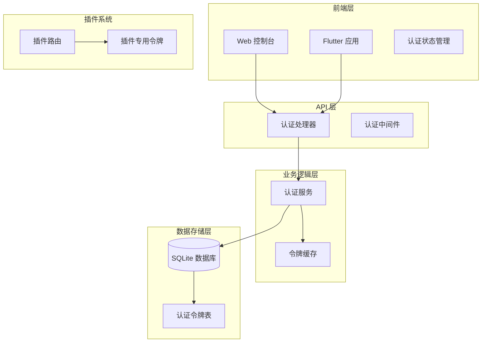
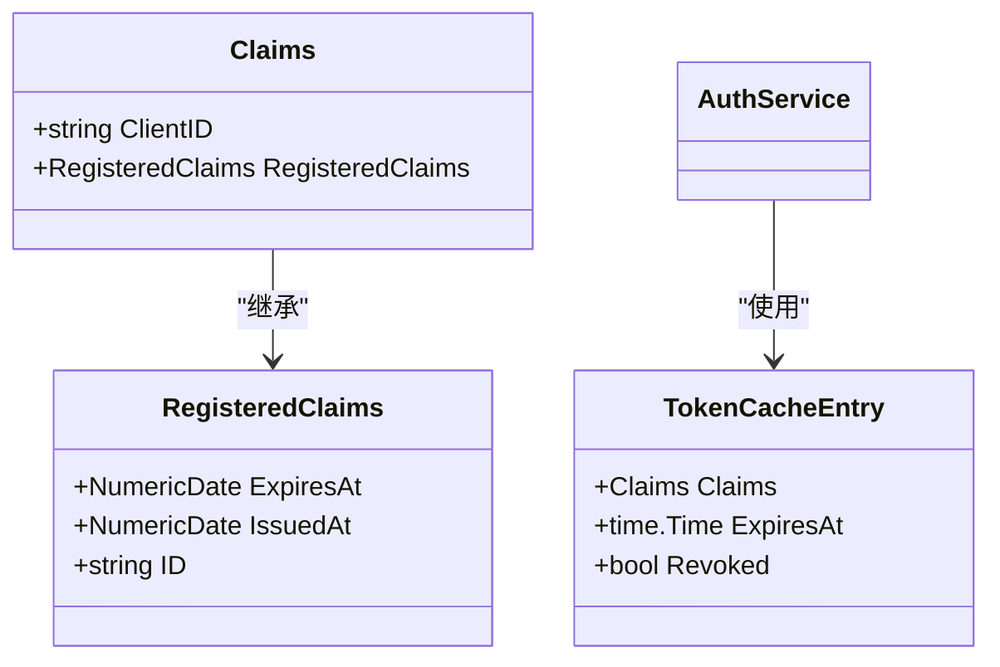
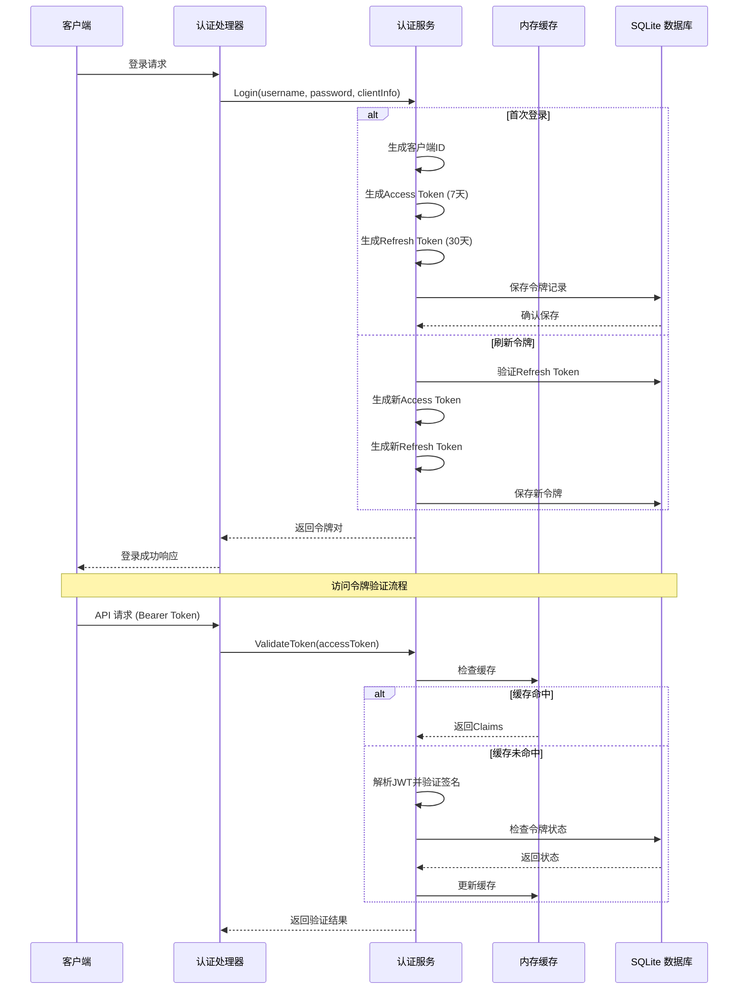
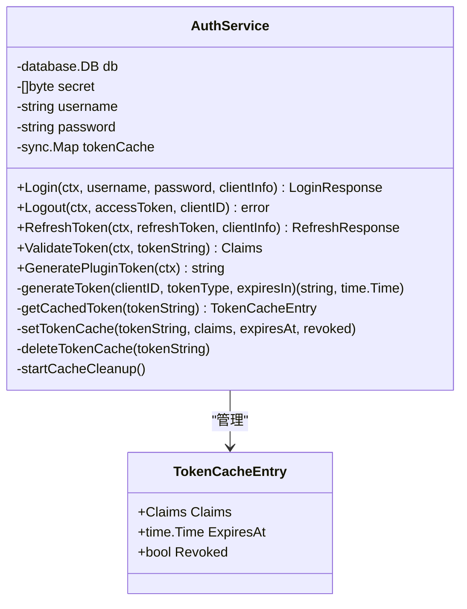
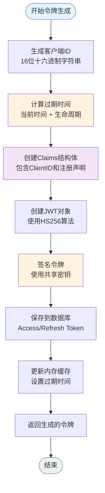
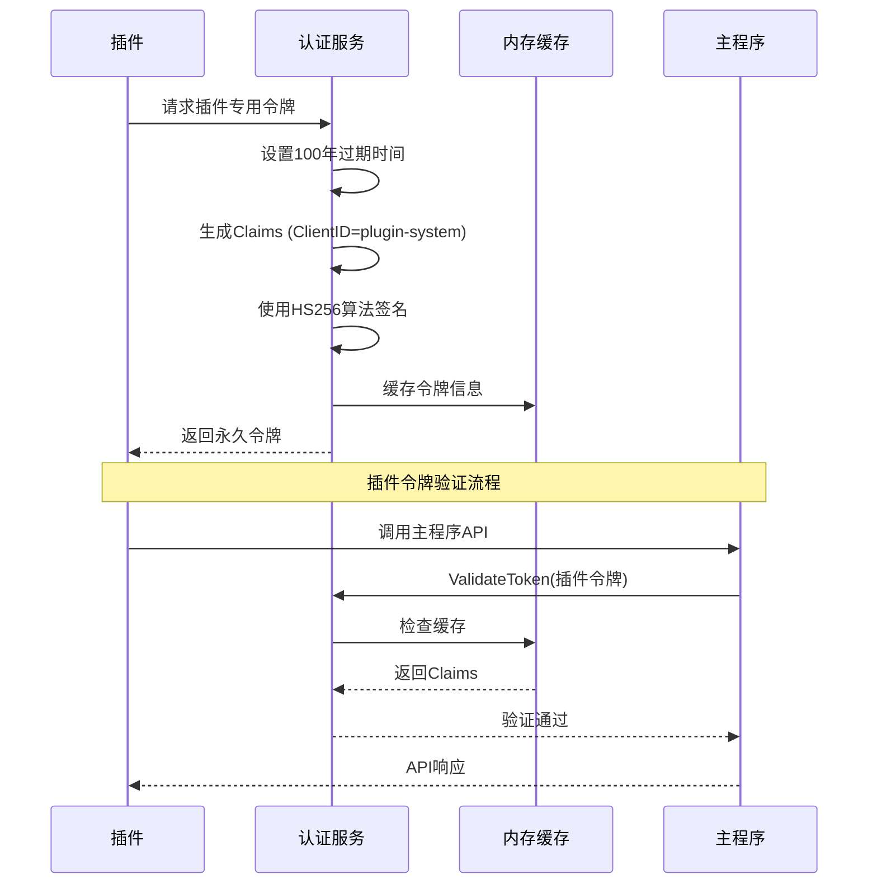
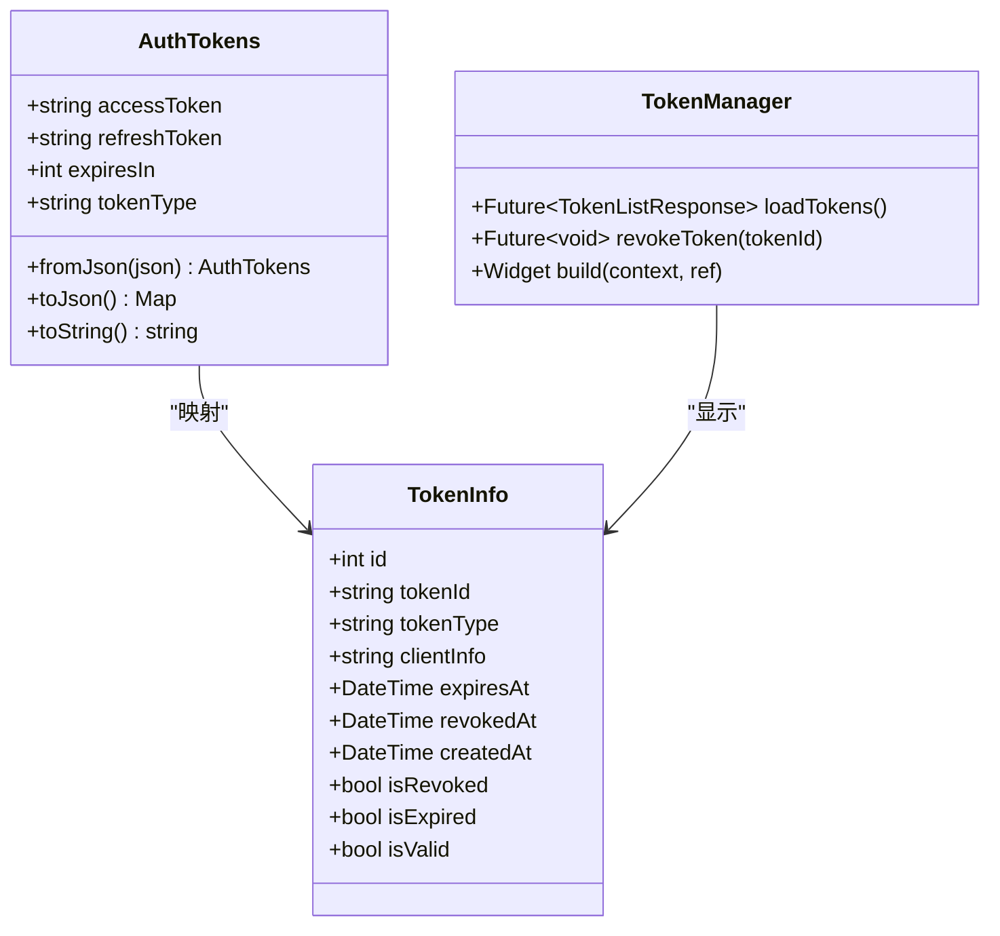
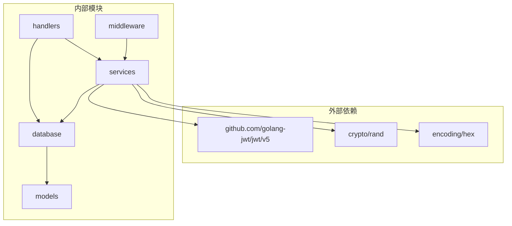
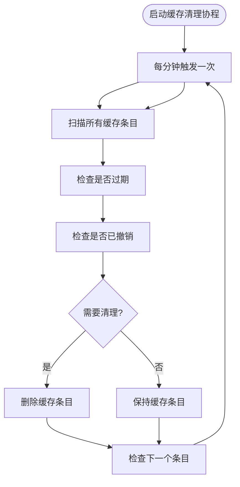

# JWT 双 Token 机制

<cite>
**本文档引用的文件**
- [auth_service.go](file://internal/services/auth_service.go)
- [models.go](file://internal/models/models.go)
- [sqlite_token.go](file://internal/database/sqlite_token.go)
- [auth.go](file://internal/handlers/auth.go)
- [auth.ts](file://web/src/stores/auth.ts)
- [auth_state.dart](file://frontend/lib/features/auth/domain/auth_state.dart)
- [token_manager.dart](file://frontend/lib/features/settings/presentation/widgets/token_manager.dart)
- [router.go](file://plugin/api/plugin/router.go)
</cite>

## 目录
1. [引言](#引言)
2. [项目结构](#项目结构)
3. [核心组件](#核心组件)
4. [架构概览](#架构概览)
5. [详细组件分析](#详细组件分析)
6. [依赖分析](#依赖分析)
7. [性能考虑](#性能考虑)
8. [故障排除指南](#故障排除指南)
9. [结论](#结论)

## 引言

MiMusic 实现了基于 JWT 的双 Token 认证机制，采用访问令牌（Access Token）和刷新令牌（Refresh Token）相结合的安全架构。该机制通过短期有效的访问令牌提供日常 API 访问权限，同时使用长期有效的刷新令牌来安全地获取新的访问令牌。

这种设计提供了以下优势：
- **安全性**：访问令牌短期有效，降低泄露风险
- **用户体验**：用户无需频繁重新登录
- **系统效率**：通过内存缓存减少数据库查询压力
- **灵活管理**：支持令牌撤销和批量管理

## 项目结构

JWT 双 Token 机制涉及多个层次的组件协作：



**图表来源**
- [auth_service.go:1-73](file://internal/services/auth_service.go#L1-L73)
- [auth.go:15-25](file://internal/handlers/auth.go#L15-L25)
- [sqlite_token.go:14-44](file://internal/database/sqlite_token.go#L14-L44)

## 核心组件

### Claims 结构体设计

JWT 的 Claims 结构体是整个认证机制的核心数据载体：



**图表来源**
- [auth_service.go:35-38](file://internal/services/auth_service.go#L35-L38)
- [auth_service.go:18-22](file://internal/services/auth_service.go#L18-L22)

### 令牌类型区分机制

系统支持三种不同的令牌类型：

| 令牌类型 | 生命周期 | 用途 | 存储方式 |
|---------|----------|------|----------|
| Access Token | 7天 | 日常 API 访问 | 数据库 + 内存缓存 |
| Refresh Token | 30天 | 获取新的访问令牌 | 数据库 + 内存缓存 |
| 插件 Token | 永久 | 插件内部调用 | 内存（不持久化） |

**章节来源**
- [auth_service.go:117-127](file://internal/services/auth_service.go#L117-L127)
- [auth_service.go:388-423](file://internal/services/auth_service.go#L388-L423)

## 架构概览

JWT 双 Token 机制的整体架构分为四个主要层次：



**图表来源**
- [auth_service.go:95-164](file://internal/services/auth_service.go#L95-L164)
- [auth_service.go:245-324](file://internal/services/auth_service.go#L245-L324)
- [auth_service.go:326-371](file://internal/services/auth_service.go#L326-L371)

## 详细组件分析

### 认证服务实现

认证服务是整个 JWT 机制的核心实现：



**图表来源**
- [auth_service.go:25-32](file://internal/services/auth_service.go#L25-L32)
- [auth_service.go:18-22](file://internal/services/auth_service.go#L18-L22)

### 令牌生成流程

令牌生成过程包含多个关键步骤：



**图表来源**
- [auth_service.go:426-445](file://internal/services/auth_service.go#L426-L445)
- [auth_service.go:447-460](file://internal/services/auth_service.go#L447-L460)

### 插件系统 Token 特殊处理

插件系统实现了特殊的永久令牌机制：



**图表来源**
- [auth_service.go:388-423](file://internal/services/auth_service.go#L388-L423)
- [auth_service.go:347-353](file://internal/services/auth_service.go#L347-L353)

**章节来源**
- [auth_service.go:388-423](file://internal/services/auth_service.go#L388-L423)
- [auth_service.go:347-353](file://internal/services/auth_service.go#L347-L353)

### 前端 Token 管理

前端实现了完整的令牌生命周期管理：



**图表来源**
- [auth_state.dart:2-36](file://frontend/lib/features/auth/domain/auth_state.dart#L2-L36)
- [auth_state.dart:39-92](file://frontend/lib/features/auth/domain/auth_state.dart#L39-L92)
- [token_manager.dart:15-79](file://frontend/lib/features/settings/presentation/widgets/token_manager.dart#L15-L79)

**章节来源**
- [auth_state.dart:2-36](file://frontend/lib/features/auth/domain/auth_state.dart#L2-L36)
- [auth_state.dart:39-92](file://frontend/lib/features/auth/domain/auth_state.dart#L39-L92)
- [token_manager.dart:15-79](file://frontend/lib/features/settings/presentation/widgets/token_manager.dart#L15-L79)

## 依赖分析

JWT 双 Token 机制的依赖关系如下：



**图表来源**
- [auth_service.go:3-15](file://internal/services/auth_service.go#L3-L15)
- [auth.go:3-13](file://internal/handlers/auth.go#L3-L13)

### 数据库 Schema 设计

认证令牌的数据库结构设计：

```mermaid
erDiagram
AUTH_TOKENS {
int id PK
string token_id UK
string token_type ENUM
string client_info
datetime expires_at
datetime revoked_at
string revoked_by
string revoked_reason
datetime created_at
}
CONFIG {
int id PK
string key UK
string value
datetime updated_at
}
AUTH_TOKENS ||--|| CONFIG : "使用jwt_secret配置"
```

**图表来源**
- [sqlite_token.go:14-44](file://internal/database/sqlite_token.go#L14-L44)
- [models.go:368-379](file://internal/models/models.go#L368-L379)

**章节来源**
- [sqlite_token.go:14-44](file://internal/database/sqlite_token.go#L14-L44)
- [models.go:368-379](file://internal/models/models.go#L368-L379)

## 性能考虑

### 内存缓存策略

系统实现了多层缓存机制来提升性能：

1. **内存缓存**：使用 sync.Map 存储验证过的令牌，避免重复数据库查询
2. **缓存清理**：每分钟自动清理过期或撤销的缓存条目
3. **缓存命中率**：通过内存缓存显著减少数据库压力

### 缓存清理机制



**图表来源**
- [auth_service.go:194-210](file://internal/services/auth_service.go#L194-L210)

### 安全最佳实践

1. **密钥管理**：使用 32 字节随机密钥，支持动态生成和更新
2. **令牌撤销**：支持实时撤销任何已颁发的令牌
3. **过期时间**：访问令牌短期有效，减少泄露风险
4. **日志审计**：记录所有令牌操作，便于安全审计

**章节来源**
- [auth_service.go:75-82](file://internal/services/auth_service.go#L75-L82)
- [auth_service.go:212-243](file://internal/services/auth_service.go#L212-L243)

## 故障排除指南

### 常见问题诊断

| 问题类型 | 症状 | 可能原因 | 解决方案 |
|---------|------|----------|----------|
| 令牌过期 | 401 未授权错误 | Access Token 已过期 | 使用 Refresh Token 获取新令牌 |
| 令牌撤销 | 401 未授权错误 | 令牌被手动撤销 | 重新登录获取新令牌对 |
| 密钥不匹配 | JWT 解析失败 | 密钥被修改或损坏 | 重新生成并部署新密钥 |
| 缓存异常 | 验证结果不一致 | 缓存数据过期 | 等待自动清理或重启服务 |

### 调试工具

1. **令牌状态检查**：通过 `/auth/tokens` 接口查看所有活跃令牌
2. **令牌撤销**：使用 `/auth/tokens/{token_id}` 接口撤销特定令牌
3. **日志分析**：检查服务日志中的认证相关记录

**章节来源**
- [auth.go:136-236](file://internal/handlers/auth.go#L136-L236)
- [sqlite_token.go:186-202](file://internal/database/sqlite_token.go#L186-L202)

## 结论

MiMusic 的 JWT 双 Token 机制通过精心设计的架构实现了高安全性与良好用户体验的平衡。该机制的主要优势包括：

1. **安全性保障**：短期有效的访问令牌配合长期的刷新令牌，有效降低了安全风险
2. **性能优化**：智能的内存缓存机制显著提升了系统性能
3. **管理便利**：完整的令牌生命周期管理，支持撤销和批量操作
4. **扩展性好**：插件系统专用的永久令牌设计，满足不同场景需求

通过合理的密钥管理和严格的访问控制，该机制为 MiMusic 提供了可靠的身份认证基础，为后续的功能扩展奠定了坚实的技术基础。