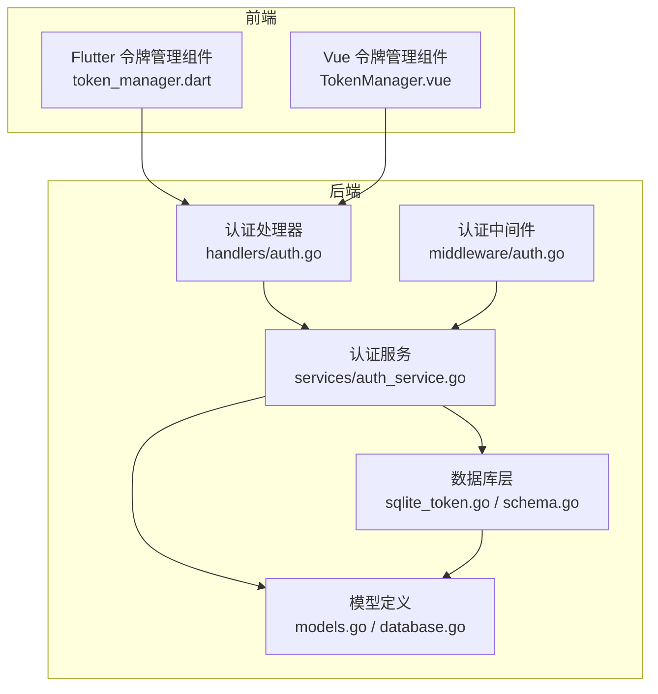
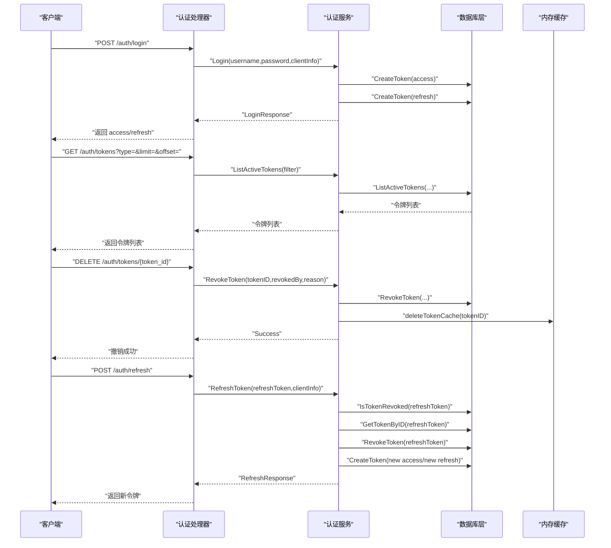
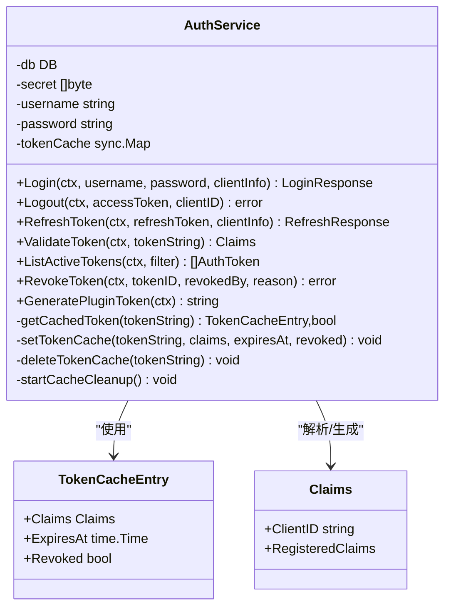
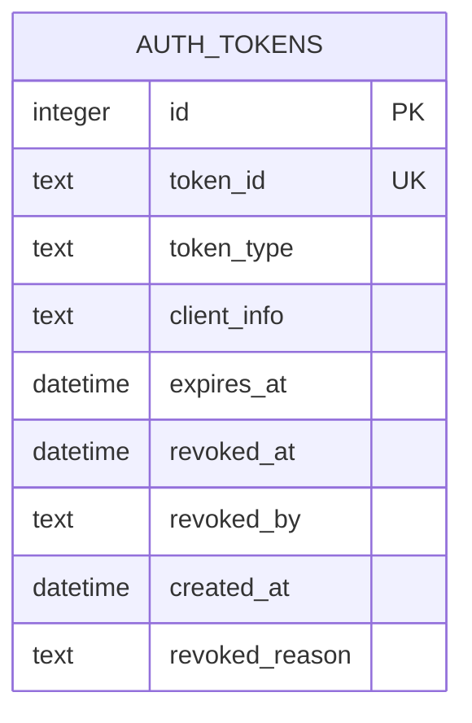
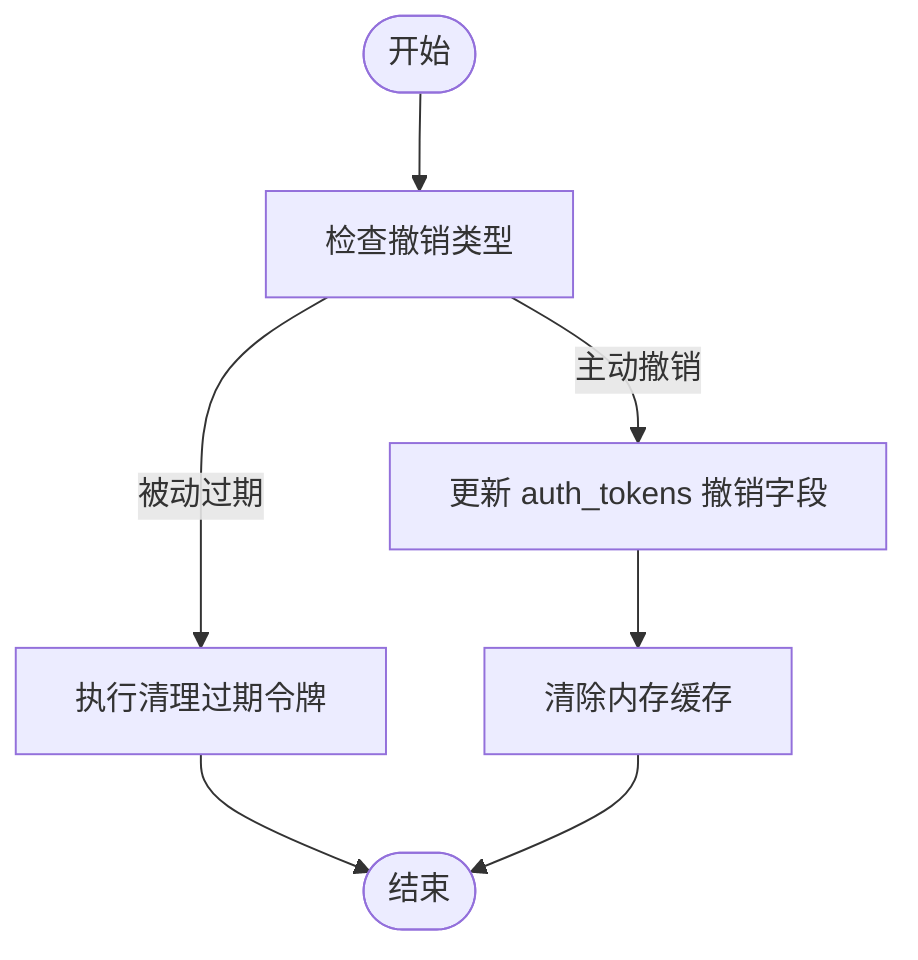
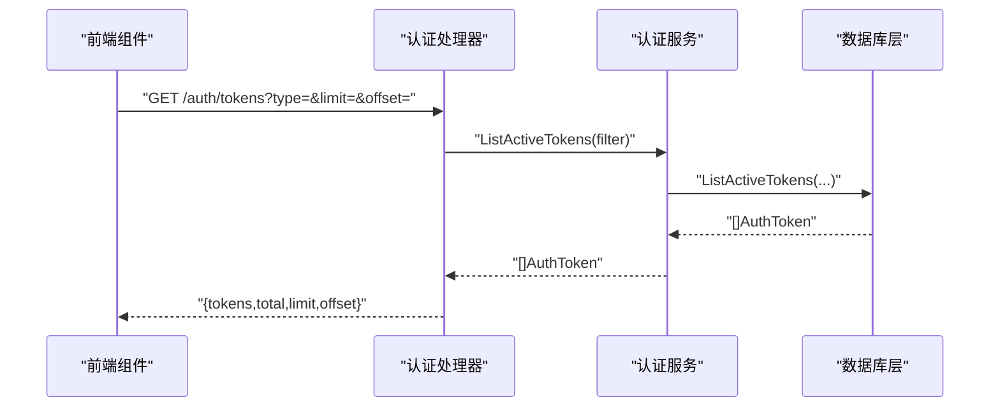
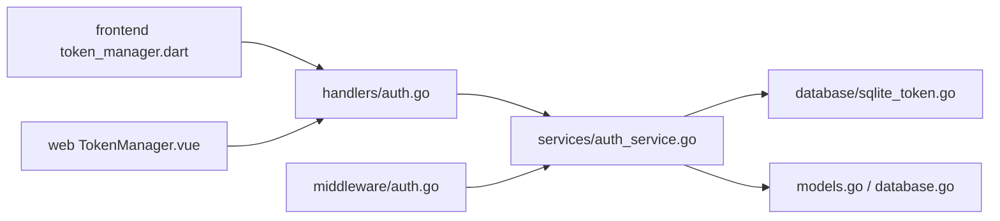

# 令牌管理

<cite>
**本文引用的文件**
- [internal/services/auth_service.go](file://internal/services/auth_service.go)
- [internal/database/sqlite_token.go](file://internal/database/sqlite_token.go)
- [internal/database/schema.go](file://internal/database/schema.go)
- [internal/handlers/auth.go](file://internal/handlers/auth.go)
- [internal/middleware/auth.go](file://internal/middleware/auth.go)
- [internal/models/models.go](file://internal/models/models.go)
- [internal/database/database.go](file://internal/database/database.go)
- [web/src/views/Settings/components/TokenManager.vue](file://web/src/views/Settings/components/TokenManager.vue)
- [frontend/lib/features/settings/presentation/widgets/token_manager.dart](file://frontend/lib/features/settings/presentation/widgets/token_manager.dart)
- [frontend/lib/features/auth/domain/auth_state.dart](file://frontend/lib/features/auth/domain/auth_state.dart)
- [frontend/lib/core/storage/secure_storage.dart](file://frontend/lib/core/storage/secure_storage.dart)
- [docs/swagger.json](file://docs/swagger.json)
</cite>

## 目录
1. [简介](#简介)
2. [项目结构](#项目结构)
3. [核心组件](#核心组件)
4. [架构总览](#架构总览)
5. [详细组件分析](#详细组件分析)
6. [依赖分析](#依赖分析)
7. [性能考虑](#性能考虑)
8. [故障排除指南](#故障排除指南)
9. [结论](#结论)
10. [附录](#附录)

## 简介
本文件面向 MiMusic 的令牌管理系统，系统性梳理令牌的完整生命周期：签发、验证、刷新、撤销与清理，并深入解析内存缓存机制、数据库持久化方案、撤销与过期处理、以及前端令牌列表查询、状态检查与统计分析的实现方式。文档同时提供可视化图示、性能优化建议与故障排除指引，帮助开发者快速理解与维护该系统。

## 项目结构
围绕令牌管理的关键模块分布如下：
- 后端服务层：认证服务负责签发、验证、刷新、撤销与缓存清理；数据库层提供 SQLite 存储与索引；处理器与中间件负责 API 交互与鉴权。
- 前端层：Flutter 与 Vue 两套界面分别提供令牌列表展示、撤销操作与状态检查。
- 文档与模型：Swagger 定义了令牌相关接口；模型定义了令牌实体与过滤参数。

图表来源
- [internal/handlers/auth.go:15-25](file://internal/handlers/auth.go#L15-L25)
- [internal/services/auth_service.go:24-32](file://internal/services/auth_service.go#L24-L32)
- [internal/database/sqlite_token.go:14-44](file://internal/database/sqlite_token.go#L14-L44)
- [internal/database/schema.go:61-72](file://internal/database/schema.go#L61-L72)
- [internal/middleware/auth.go:11-12](file://internal/middleware/auth.go#L11-L12)
- [frontend/lib/features/settings/presentation/widgets/token_manager.dart:15-21](file://frontend/lib/features/settings/presentation/widgets/token_manager.dart#L15-L21)
- [web/src/views/Settings/components/TokenManager.vue:1-20](file://web/src/views/Settings/components/TokenManager.vue#L1-L20)

章节来源
- [internal/handlers/auth.go:15-25](file://internal/handlers/auth.go#L15-L25)
- [internal/services/auth_service.go:24-32](file://internal/services/auth_service.go#L24-L32)
- [internal/database/sqlite_token.go:14-44](file://internal/database/sqlite_token.go#L14-L44)
- [internal/database/schema.go:61-72](file://internal/database/schema.go#L61-L72)
- [internal/middleware/auth.go:11-12](file://internal/middleware/auth.go#L11-L12)
- [frontend/lib/features/settings/presentation/widgets/token_manager.dart:15-21](file://frontend/lib/features/settings/presentation/widgets/token_manager.dart#L15-L21)
- [web/src/views/Settings/components/TokenManager.vue:1-20](file://web/src/views/Settings/components/TokenManager.vue#L1-L20)

## 核心组件
- 认证服务（AuthService）
  - 负责签发、验证、刷新、撤销、缓存与清理过期令牌。
  - 维护内存缓存 TokenCacheEntry，键为 token 字符串，值包含 Claims、过期时间与撤销标记。
  - 启动定时清理协程，定期扫描并删除过期或已撤销的缓存项。
- 数据库层（SQLite）
  - 表 auth_tokens 存储令牌元数据，含 token_id、token_type、client_info、expires_at、revoked_at、revoked_by、created_at、revoked_reason。
  - 提供创建、按 ID 查询、撤销、列出活跃令牌、清理过期令牌、检查撤销状态等操作。
  - 建立多处索引以优化查询性能。
- 处理器与中间件
  - 处理器暴露 /auth/login、/auth/logout、/auth/refresh、/auth/tokens 等接口。
  - 中间件从 Authorization 头或 URL 查询参数提取 token，调用认证服务进行验证。
- 前端组件
  - Flutter 与 Vue 组件分别提供令牌列表、撤销与状态展示，支持分页与筛选。

章节来源
- [internal/services/auth_service.go:17-32](file://internal/services/auth_service.go#L17-L32)
- [internal/database/sqlite_token.go:14-44](file://internal/database/sqlite_token.go#L14-L44)
- [internal/database/schema.go:61-72](file://internal/database/schema.go#L61-L72)
- [internal/handlers/auth.go:15-25](file://internal/handlers/auth.go#L15-L25)
- [internal/middleware/auth.go:11-12](file://internal/middleware/auth.go#L11-L12)
- [frontend/lib/features/settings/presentation/widgets/token_manager.dart:15-21](file://frontend/lib/features/settings/presentation/widgets/token_manager.dart#L15-L21)
- [web/src/views/Settings/components/TokenManager.vue:1-20](file://web/src/views/Settings/components/TokenManager.vue#L1-L20)

## 架构总览
下图展示了令牌生命周期在各层之间的流转与职责划分：

图表来源
- [internal/handlers/auth.go:39-62](file://internal/handlers/auth.go#L39-L62)
- [internal/handlers/auth.go:150-195](file://internal/handlers/auth.go#L150-L195)
- [internal/handlers/auth.go:211-236](file://internal/handlers/auth.go#L211-L236)
- [internal/handlers/auth.go:111-134](file://internal/handlers/auth.go#L111-L134)
- [internal/services/auth_service.go:94-164](file://internal/services/auth_service.go#L94-L164)
- [internal/services/auth_service.go:373-386](file://internal/services/auth_service.go#L373-L386)
- [internal/services/auth_service.go:245-324](file://internal/services/auth_service.go#L245-L324)
- [internal/database/sqlite_token.go:14-44](file://internal/database/sqlite_token.go#L14-L44)
- [internal/database/sqlite_token.go:99-167](file://internal/database/sqlite_token.go#L99-L167)
- [internal/database/sqlite_token.go:75-97](file://internal/database/sqlite_token.go#L75-L97)

## 详细组件分析

### 认证服务（AuthService）
- 内存缓存
  - TokenCacheEntry 结构包含 Claims、ExpiresAt、Revoked 三要素，用于快速验证与状态判断。
  - 缓存策略：命中则直接返回；未命中则解析 JWT 并根据数据库撤销状态决定是否缓存。
  - 过期处理：启动定时器每分钟扫描并删除过期或已撤销的缓存项。
  - 并发安全：基于 sync.Map，适合高并发读取与更新。
- 令牌签发
  - 生成 access/refresh 两类令牌，分别设置不同过期时间，并持久化到数据库。
  - 登录后触发清理过期令牌。
- 令牌验证
  - 优先从缓存命中；缓存未命中则解析 JWT 并检查撤销状态；插件系统令牌跳过数据库检查。
- 令牌刷新
  - 校验刷新令牌是否有效、类型正确且未过期；撤销旧令牌对并生成新令牌对。
- 令牌撤销
  - 支持按 token_id 撤销；撤销后清除对应缓存。
- 插件令牌
  - 生成“永久”（近似）插件令牌，不保存至数据库，仅内存使用。

图表来源
- [internal/services/auth_service.go:17-32](file://internal/services/auth_service.go#L17-L32)
- [internal/services/auth_service.go:166-210](file://internal/services/auth_service.go#L166-L210)
- [internal/services/auth_service.go:94-164](file://internal/services/auth_service.go#L94-L164)
- [internal/services/auth_service.go:245-324](file://internal/services/auth_service.go#L245-L324)
- [internal/services/auth_service.go:378-386](file://internal/services/auth_service.go#L378-L386)

章节来源
- [internal/services/auth_service.go:17-32](file://internal/services/auth_service.go#L17-L32)
- [internal/services/auth_service.go:166-210](file://internal/services/auth_service.go#L166-L210)
- [internal/services/auth_service.go:94-164](file://internal/services/auth_service.go#L94-L164)
- [internal/services/auth_service.go:245-324](file://internal/services/auth_service.go#L245-L324)
- [internal/services/auth_service.go:378-386](file://internal/services/auth_service.go#L378-L386)

### 数据库持久化与索引优化
- 表结构
  - auth_tokens：唯一 token_id、类型（access/refresh）、客户端信息、过期时间、撤销时间/原因、创建时间等。
- 关键操作
  - CreateToken：插入新令牌记录。
  - GetTokenByID：按 ID 查询令牌详情。
  - RevokeToken：更新撤销时间、撤销者与原因。
  - ListActiveTokens：按类型、排序与分页查询活跃令牌。
  - CleanExpiredTokens：清理过期令牌。
  - IsTokenRevoked：判断是否撤销或过期。
- 索引
  - idx_auth_tokens_token_id、idx_auth_tokens_token_type、idx_auth_tokens_expires_at、idx_auth_tokens_revoked_at，显著提升查询与撤销检查效率。

图表来源
- [internal/database/schema.go:61-72](file://internal/database/schema.go#L61-L72)

章节来源
- [internal/database/sqlite_token.go:14-44](file://internal/database/sqlite_token.go#L14-L44)
- [internal/database/sqlite_token.go:46-73](file://internal/database/sqlite_token.go#L46-L73)
- [internal/database/sqlite_token.go:75-97](file://internal/database/sqlite_token.go#L75-L97)
- [internal/database/sqlite_token.go:99-167](file://internal/database/sqlite_token.go#L99-L167)
- [internal/database/sqlite_token.go:169-184](file://internal/database/sqlite_token.go#L169-L184)
- [internal/database/sqlite_token.go:186-202](file://internal/database/sqlite_token.go#L186-L202)
- [internal/database/schema.go:89-103](file://internal/database/schema.go#L89-L103)

### 令牌撤销机制与审计
- 主动撤销：前端发起撤销请求，后端更新撤销时间/原因并清除缓存。
- 被动过期：数据库层面通过 expires_at 与 revoked_at 字段标识过期与撤销；定时清理任务定期删除过期记录。
- 审计记录：revoked_by 与 revoked_reason 记录撤销者与原因，便于审计与追踪。
- 并发与一致性：撤销操作在事务中执行，确保一致性；缓存与数据库状态保持一致。

图表来源
- [internal/handlers/auth.go:211-236](file://internal/handlers/auth.go#L211-L236)
- [internal/database/sqlite_token.go:75-97](file://internal/database/sqlite_token.go#L75-L97)
- [internal/database/sqlite_token.go:169-184](file://internal/database/sqlite_token.go#L169-L184)
- [internal/services/auth_service.go:380-385](file://internal/services/auth_service.go#L380-L385)

章节来源
- [internal/handlers/auth.go:211-236](file://internal/handlers/auth.go#L211-L236)
- [internal/database/sqlite_token.go:75-97](file://internal/database/sqlite_token.go#L75-L97)
- [internal/database/sqlite_token.go:169-184](file://internal/database/sqlite_token.go#L169-L184)
- [internal/services/auth_service.go:380-385](file://internal/services/auth_service.go#L380-L385)

### 令牌列表查询、状态检查与统计
- 列表查询
  - 支持按类型（access/refresh）、分页（limit/offset）、排序（created_at DESC）查询活跃令牌。
  - 前端组件提供筛选与分页交互，后端返回 tokens、total、limit、offset。
- 状态检查
  - 前端通过 isRevoked、isExpired、isValid 等属性直观展示令牌状态。
  - 后端通过 IsTokenRevoked 快速判断撤销或过期。
- 统计分析
  - 可基于活跃令牌数量、类型分布、过期趋势等进行统计（当前实现返回 total，可扩展）。

图表来源
- [internal/handlers/auth.go:150-195](file://internal/handlers/auth.go#L150-L195)
- [internal/services/auth_service.go:373-376](file://internal/services/auth_service.go#L373-L376)
- [internal/database/sqlite_token.go:99-167](file://internal/database/sqlite_token.go#L99-L167)
- [frontend/lib/features/settings/presentation/widgets/token_manager.dart:10-13](file://frontend/lib/features/settings/presentation/widgets/token_manager.dart#L10-L13)
- [web/src/views/Settings/components/TokenManager.vue:224-241](file://web/src/views/Settings/components/TokenManager.vue#L224-L241)

章节来源
- [internal/handlers/auth.go:150-195](file://internal/handlers/auth.go#L150-L195)
- [internal/services/auth_service.go:373-376](file://internal/services/auth_service.go#L373-L376)
- [internal/database/sqlite_token.go:99-167](file://internal/database/sqlite_token.go#L99-L167)
- [frontend/lib/features/settings/presentation/widgets/token_manager.dart:10-13](file://frontend/lib/features/settings/presentation/widgets/token_manager.dart#L10-L13)
- [web/src/views/Settings/components/TokenManager.vue:224-241](file://web/src/views/Settings/components/TokenManager.vue#L224-L241)

### 前端实现要点
- Flutter
  - 使用 Riverpod Provider 获取令牌列表；撤销时弹窗确认并刷新列表。
  - TokenInfo 提供 isRevoked、isExpired、isValid 等便捷属性。
- Vue
  - 支持类型筛选、分页、查看详情与撤销操作；格式化日期与状态徽章。
- 安全存储（Flutter）
  - SecureStorageService 提供跨平台 Token 存储，支持回退策略与过期检测。

章节来源
- [frontend/lib/features/settings/presentation/widgets/token_manager.dart:15-21](file://frontend/lib/features/settings/presentation/widgets/token_manager.dart#L15-L21)
- [frontend/lib/features/settings/presentation/widgets/token_manager.dart:90-138](file://frontend/lib/features/settings/presentation/widgets/token_manager.dart#L90-L138)
- [frontend/lib/features/auth/domain/auth_state.dart:38-92](file://frontend/lib/features/auth/domain/auth_state.dart#L38-L92)
- [frontend/lib/core/storage/secure_storage.dart:11-156](file://frontend/lib/core/storage/secure_storage.dart#L11-L156)

## 依赖分析
- 组件耦合
  - 处理器依赖认证服务；认证服务依赖数据库接口与模型；中间件依赖认证服务。
- 外部依赖
  - JWT 解析与签名；SQLite 驱动；前端框架（Flutter/Vue）与网络库。
- 潜在循环依赖
  - 未发现循环依赖；层次清晰，职责分离。

图表来源
- [internal/handlers/auth.go:15-25](file://internal/handlers/auth.go#L15-L25)
- [internal/services/auth_service.go:24-32](file://internal/services/auth_service.go#L24-L32)
- [internal/database/sqlite_token.go:14-44](file://internal/database/sqlite_token.go#L14-L44)
- [internal/models/models.go:368-379](file://internal/models/models.go#L368-L379)
- [internal/database/database.go:108-117](file://internal/database/database.go#L108-L117)
- [internal/middleware/auth.go:11-12](file://internal/middleware/auth.go#L11-L12)
- [frontend/lib/features/settings/presentation/widgets/token_manager.dart:15-21](file://frontend/lib/features/settings/presentation/widgets/token_manager.dart#L15-L21)
- [web/src/views/Settings/components/TokenManager.vue:1-20](file://web/src/views/Settings/components/TokenManager.vue#L1-L20)

章节来源
- [internal/handlers/auth.go:15-25](file://internal/handlers/auth.go#L15-L25)
- [internal/services/auth_service.go:24-32](file://internal/services/auth_service.go#L24-L32)
- [internal/database/sqlite_token.go:14-44](file://internal/database/sqlite_token.go#L14-L44)
- [internal/models/models.go:368-379](file://internal/models/models.go#L368-L379)
- [internal/database/database.go:108-117](file://internal/database/database.go#L108-L117)
- [internal/middleware/auth.go:11-12](file://internal/middleware/auth.go#L11-L12)
- [frontend/lib/features/settings/presentation/widgets/token_manager.dart:15-21](file://frontend/lib/features/settings/presentation/widgets/token_manager.dart#L15-L21)
- [web/src/views/Settings/components/TokenManager.vue:1-20](file://web/src/views/Settings/components/TokenManager.vue#L1-L20)

## 性能考虑
- 内存缓存
  - 使用 sync.Map 降低频繁解析 JWT 的开销；定时清理避免内存膨胀。
- 数据库优化
  - 为 token_id、token_type、expires_at、revoked_at 建立索引，加速活跃令牌查询与撤销检查。
  - WAL 模式、连接池与超时配置提升并发与稳定性。
- 查询与分页
  - 列表接口支持 limit/offset 与排序，避免一次性加载过多数据。
- 前端体验
  - 列表懒加载与状态徽章减少渲染压力；撤销操作采用确认与加载态提升反馈。

[本节为通用指导，无需特定文件引用]

## 故障排除指南
- 401 未授权
  - 可能原因：缺少认证头、token 无效或已撤销。
  - 排查步骤：检查中间件是否正确提取 token；验证认证服务返回的 Claims；确认数据库撤销状态。
- 刷新失败
  - 可能原因：刷新令牌无效、已撤销或过期。
  - 排查步骤：确认刷新令牌类型与过期状态；检查撤销记录；必要时重新登录。
- 撤销失败
  - 可能原因：token_id 不存在或数据库更新失败。
  - 排查步骤：确认 token_id；查看撤销日志；检查数据库事务与索引。
- 列表为空或分页异常
  - 可能原因：过滤条件或分页参数错误。
  - 排查步骤：核对 type、limit、offset；检查排序字段；确认活跃状态。

章节来源
- [internal/middleware/auth.go:11-52](file://internal/middleware/auth.go#L11-L52)
- [internal/handlers/auth.go:111-134](file://internal/handlers/auth.go#L111-L134)
- [internal/handlers/auth.go:211-236](file://internal/handlers/auth.go#L211-L236)
- [internal/handlers/auth.go:150-195](file://internal/handlers/auth.go#L150-L195)
- [docs/swagger.json:145-259](file://docs/swagger.json#L145-L259)

## 结论
MiMusic 的令牌管理以“内存缓存 + 数据库持久化”为核心，结合严格的撤销与过期处理、完善的前端交互与接口文档，实现了安全、高效且易用的令牌生命周期管理。通过索引优化与定时清理，系统在高并发场景下仍能保持良好性能；通过明确的撤销审计与状态检查，提升了可观测性与可维护性。

[本节为总结性内容，无需特定文件引用]

## 附录
- Swagger 接口定义
  - /auth/login、/auth/logout、/auth/refresh、/auth/tokens（GET/DELETE）等接口的请求与响应规范。
- 前端组件与模型
  - Flutter 与 Vue 令牌管理组件、TokenInfo 模型与状态计算方法。

章节来源
- [docs/swagger.json:145-259](file://docs/swagger.json#L145-L259)
- [frontend/lib/features/auth/domain/auth_state.dart:38-92](file://frontend/lib/features/auth/domain/auth_state.dart#L38-L92)
- [frontend/lib/features/settings/presentation/widgets/token_manager.dart:15-21](file://frontend/lib/features/settings/presentation/widgets/token_manager.dart#L15-L21)
- [web/src/views/Settings/components/TokenManager.vue:1-20](file://web/src/views/Settings/components/TokenManager.vue#L1-L20)