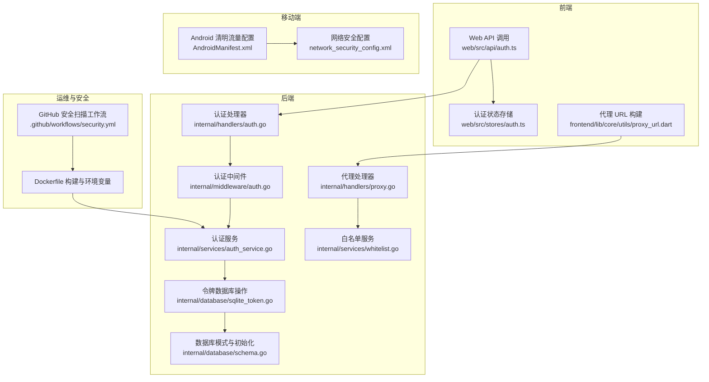
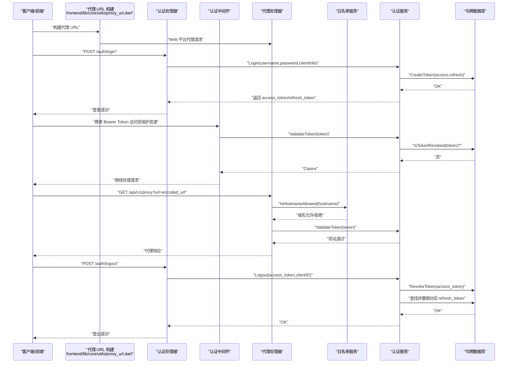
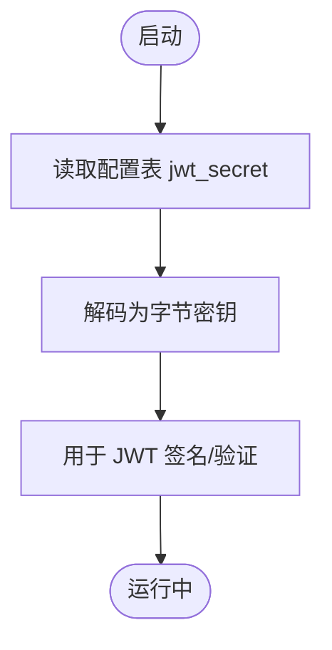
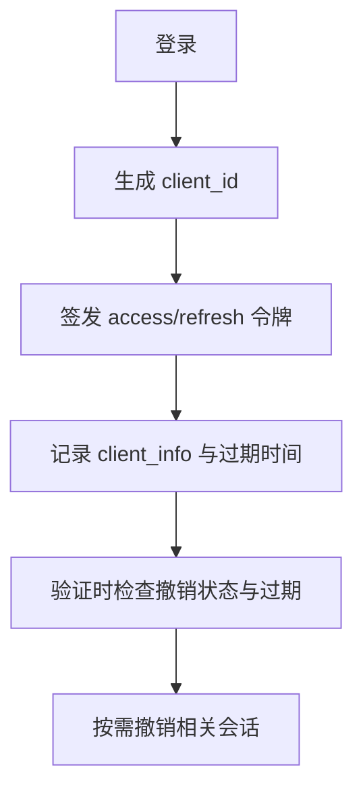
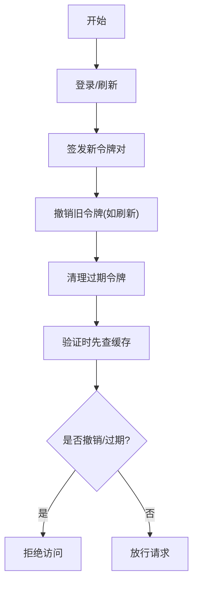
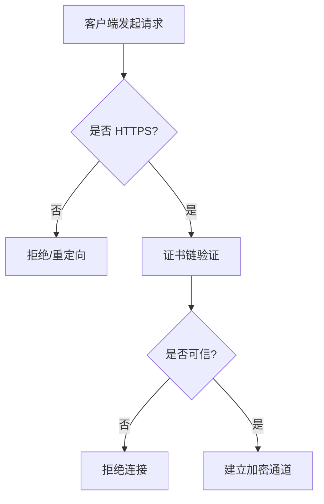
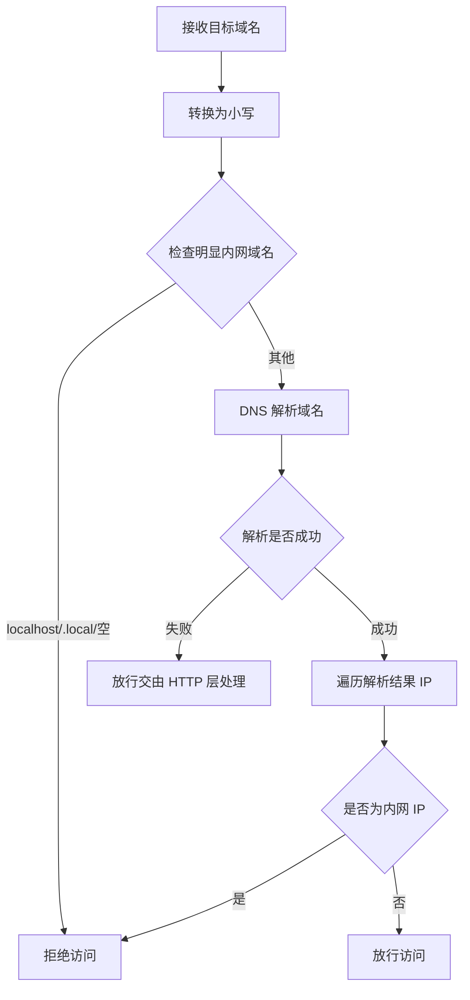
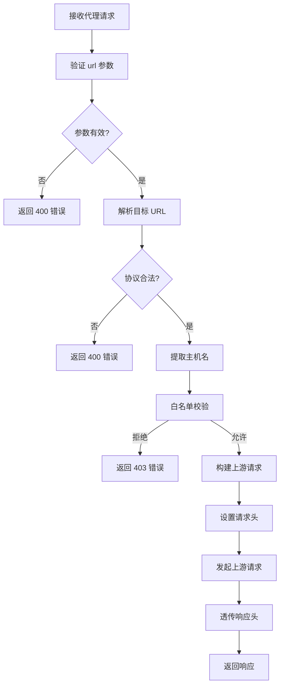
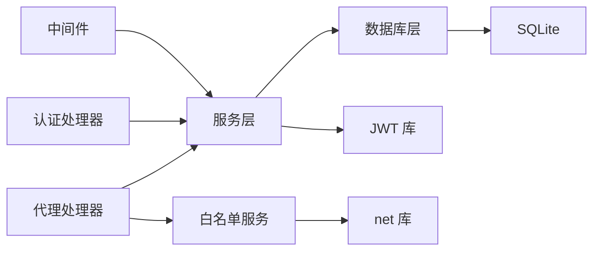

# 安全策略

<cite>
**本文引用的文件**
- [internal/middleware/auth.go](file://internal/middleware/auth.go)
- [internal/handlers/auth.go](file://internal/handlers/auth.go)
- [internal/services/auth_service.go](file://internal/services/auth_service.go)
- [internal/database/sqlite_token.go](file://internal/database/sqlite_token.go)
- [internal/database/schema.go](file://internal/database/schema.go)
- [internal/config/types.go](file://internal/config/types.go)
- [internal/models/models.go](file://internal/models/models.go)
- [internal/handlers/proxy.go](file://internal/handlers/proxy.go)
- [internal/services/whitelist.go](file://internal/services/whitelist.go)
- [internal/app/routers.go](file://internal/app/routers.go)
- [frontend/lib/core/utils/proxy_url.dart](file://frontend/lib/core/utils/proxy_url.dart)
- [web/src/api/auth.ts](file://web/src/api/auth.ts)
- [web/src/stores/auth.ts](file://web/src/stores/auth.ts)
- [frontend/android/app/src/main/AndroidManifest.xml](file://frontend/android/app/src/main/AndroidManifest.xml)
- [frontend/android/app/src/main/res/xml/network_security_config.xml](file://frontend/android/app/src/main/res/xml/network_security_config.xml)
- [Dockerfile](file://Dockerfile)
- [.github/workflows/security.yml](file://.github/workflows/security.yml)
</cite>

## 更新摘要
**所做更改**
- 新增代理系统安全模型重构章节，详细说明集中式白名单服务的引入
- 更新代理处理器安全控制点，包括域名白名单校验和内网保护机制
- 新增前端代理 URL 构建的安全逻辑说明
- 更新架构图以反映新的代理安全控制流程
- 增强 SSRF 防护和私网访问控制的安全策略

## 目录
1. [简介](#简介)
2. [项目结构](#项目结构)
3. [核心组件](#核心组件)
4. [架构总览](#架构总览)
5. [详细组件分析](#详细组件分析)
6. [代理系统安全模型重构](#代理系统安全模型重构)
7. [依赖分析](#依赖分析)
8. [性能考虑](#性能考虑)
9. [故障排查指南](#故障排查指南)
10. [结论](#结论)
11. [附录](#附录)

## 简介
本文件面向 MiMusic 的安全策略体系，围绕多层安全防护机制进行系统化梳理与说明，覆盖 JWT 密钥管理、随机密钥生成与安全存储、会话管理（客户端标识、会话绑定、并发控制、会话劫持防护）、防暴力破解策略（登录尝试限制、IP 限制、速率限制、账户锁定）、安全审计（操作日志、异常检测、安全事件告警）、数据传输安全（HTTPS 强制、证书验证、中间人攻击防护），并提供安全配置指南、漏洞扫描方法、应急响应流程、安全测试与渗透测试建议以及合规性要求。

**更新** 本次更新重点反映了代理系统安全模型的重构，引入了集中式白名单服务进行私网保护，增强了对外部资源代理的安全控制能力。

## 项目结构
MiMusic 的安全相关能力主要分布在以下层次：
- 中间件层：统一鉴权拦截与令牌提取
- 处理器层：认证接口（登录、登出、刷新、令牌列表与撤销）
- 服务层：JWT 生成与验证、密钥管理、令牌缓存与数据库交互
- 数据层：令牌表结构与数据库操作
- 代理服务层：外部资源代理与域名白名单校验
- 前端层：认证 API 调用与本地存储
- 移动端（Android）：网络安全配置
- 运维与安全扫描：容器镜像构建与 GitHub Actions 安全扫描工作流

**图表来源**
- [internal/middleware/auth.go:1-52](file://internal/middleware/auth.go#L1-L52)
- [internal/handlers/auth.go:1-254](file://internal/handlers/auth.go#L1-L254)
- [internal/handlers/proxy.go:1-139](file://internal/handlers/proxy.go#L1-L139)
- [internal/services/auth_service.go:1-461](file://internal/services/auth_service.go#L1-L461)
- [internal/services/whitelist.go:1-54](file://internal/services/whitelist.go#L1-L54)
- [internal/database/sqlite_token.go:1-203](file://internal/database/sqlite_token.go#L1-L203)
- [internal/database/schema.go:1-149](file://internal/database/schema.go#L1-L149)
- [web/src/api/auth.ts:1-45](file://web/src/api/auth.ts#L1-L45)
- [web/src/stores/auth.ts:1-61](file://web/src/stores/auth.ts#L1-L61)
- [frontend/android/app/src/main/AndroidManifest.xml:1-80](file://frontend/android/app/src/main/AndroidManifest.xml#L1-L80)
- [frontend/android/app/src/main/res/xml/network_security_config.xml:1-9](file://frontend/android/app/src/main/res/xml/network_security_config.xml#L1-L9)
- [Dockerfile:1-77](file://Dockerfile#L1-L77)
- [.github/workflows/security.yml:1-70](file://.github/workflows/security.yml#L1-L70)

**章节来源**
- [internal/middleware/auth.go:1-52](file://internal/middleware/auth.go#L1-L52)
- [internal/handlers/auth.go:1-254](file://internal/handlers/auth.go#L1-L254)
- [internal/handlers/proxy.go:1-139](file://internal/handlers/proxy.go#L1-L139)
- [internal/services/auth_service.go:1-461](file://internal/services/auth_service.go#L1-L461)
- [internal/services/whitelist.go:1-54](file://internal/services/whitelist.go#L1-L54)
- [internal/database/sqlite_token.go:1-203](file://internal/database/sqlite_token.go#L1-L203)
- [internal/database/schema.go:1-149](file://internal/database/schema.go#L1-L149)
- [web/src/api/auth.ts:1-45](file://web/src/api/auth.ts#L1-L45)
- [web/src/stores/auth.ts:1-61](file://web/src/stores/auth.ts#L1-L61)
- [frontend/android/app/src/main/AndroidManifest.xml:1-80](file://frontend/android/app/src/main/AndroidManifest.xml#L1-L80)
- [frontend/android/app/src/main/res/xml/network_security_config.xml:1-9](file://frontend/android/app/src/main/res/xml/network_security_config.xml#L1-L9)
- [Dockerfile:1-77](file://Dockerfile#L1-L77)
- [.github/workflows/security.yml:1-70](file://.github/workflows/security.yml#L1-L70)

## 核心组件
- 认证中间件：从请求头或查询参数提取 Bearer 令牌，调用服务层验证，并将客户端标识注入上下文
- 认证处理器：提供登录、登出、刷新、列出与撤销令牌等接口
- 认证服务：负责 JWT 密钥加载与生成、令牌签发与验证、缓存与撤销检查、插件专用令牌生成
- 数据库层：维护令牌表，支持创建、撤销、查询、清理过期令牌与撤销状态检查
- 代理处理器：提供外部资源代理服务，包含域名白名单校验和内网保护机制
- 白名单服务：集中式域名白名单校验，防止 SSRF 和内网访问
- 前端与移动端：通过 API 完成认证流程；移动端采用系统信任根与网络安全配置
- 运维与安全扫描：容器化部署与自动化安全扫描

**更新** 新增代理处理器和白名单服务组件，强化了对外部资源访问的安全控制。

**章节来源**
- [internal/middleware/auth.go:11-52](file://internal/middleware/auth.go#L11-L52)
- [internal/handlers/auth.go:15-254](file://internal/handlers/auth.go#L15-L254)
- [internal/services/auth_service.go:24-461](file://internal/services/auth_service.go#L24-L461)
- [internal/database/sqlite_token.go:14-203](file://internal/database/sqlite_token.go#L14-L203)
- [internal/handlers/proxy.go:15-139](file://internal/handlers/proxy.go#L15-L139)
- [internal/services/whitelist.go:8-53](file://internal/services/whitelist.go#L8-L53)
- [web/src/api/auth.ts:12-44](file://web/src/api/auth.ts#L12-L44)
- [web/src/stores/auth.ts:15-60](file://web/src/stores/auth.ts#L15-L60)
- [frontend/android/app/src/main/AndroidManifest.xml:17-18](file://frontend/android/app/src/main/AndroidManifest.xml#L17-L18)
- [frontend/android/app/src/main/res/xml/network_security_config.xml:1-9](file://frontend/android/app/src/main/res/xml/network_security_config.xml#L1-L9)
- [Dockerfile:69-71](file://Dockerfile#L69-L71)
- [.github/workflows/security.yml:10-70](file://.github/workflows/security.yml#L10-L70)

## 架构总览
下图展示从客户端到后端的认证与会话流转，以及安全控制点：

**图表来源**
- [internal/handlers/auth.go:39-97](file://internal/handlers/auth.go#L39-L97)
- [internal/middleware/auth.go:12-50](file://internal/middleware/auth.go#L12-L50)
- [internal/services/auth_service.go:94-164](file://internal/services/auth_service.go#L94-L164)
- [internal/services/auth_service.go:212-243](file://internal/services/auth_service.go#L212-L243)
- [internal/database/sqlite_token.go:14-97](file://internal/database/sqlite_token.go#L14-L97)
- [frontend/lib/core/utils/proxy_url.dart:14-33](file://frontend/lib/core/utils/proxy_url.dart#L14-L33)
- [internal/handlers/proxy.go:45-110](file://internal/handlers/proxy.go#L45-L110)
- [internal/services/whitelist.go:10-32](file://internal/services/whitelist.go#L10-L32)

## 详细组件分析

### JWT 密钥管理与随机密钥生成
- 密钥来源与加载
  - 启动时从配置表读取密钥键值，解码为字节后作为 HS256 签名密钥
  - 密钥在运行时驻留于内存，避免落盘
- 随机密钥生成
  - 提供生成函数以安全地生成 32 字节随机密钥并编码为十六进制字符串
- 安全存储
  - 密钥以配置项形式存储于 SQLite 配置表，首次安装时由初始化脚本写入随机密钥
  - 建议生产环境通过外部密钥管理服务（如 KMS）注入，避免硬编码

**图表来源**
- [internal/services/auth_service.go:49-73](file://internal/services/auth_service.go#L49-L73)
- [internal/database/schema.go:140-147](file://internal/database/schema.go#L140-L147)

**章节来源**
- [internal/services/auth_service.go:49-82](file://internal/services/auth_service.go#L49-L82)
- [internal/database/schema.go:140-147](file://internal/database/schema.go#L140-L147)

### 会话管理与客户端标识
- 客户端标识
  - 登录时根据 User-Agent 或远端地址生成客户端标识，随令牌记录
  - 中间件将客户端标识注入请求上下文，便于后续审计与绑定
- 会话绑定
  - 令牌与客户端标识绑定，登出时按客户端维度撤销相关令牌
- 并发控制
  - 通过令牌撤销与缓存机制实现并发会话的即时失效
- 会话劫持防护
  - 令牌验证时检查撤销状态与过期时间，结合客户端标识降低跨会话复用风险

**图表来源**
- [internal/services/auth_service.go:94-164](file://internal/services/auth_service.go#L94-L164)
- [internal/middleware/auth.go:44-48](file://internal/middleware/auth.go#L44-L48)
- [internal/services/auth_service.go:212-243](file://internal/services/auth_service.go#L212-L243)

**章节来源**
- [internal/middleware/auth.go:14-48](file://internal/middleware/auth.go#L14-L48)
- [internal/services/auth_service.go:94-164](file://internal/services/auth_service.go#L94-L164)
- [internal/services/auth_service.go:212-243](file://internal/services/auth_service.go#L212-L243)

### 令牌生命周期与撤销
- 生命周期
  - Access Token：短期（示例为 7 天）
  - Refresh Token：中长期（示例为 30 天）
- 撤销与清理
  - 登出时撤销 Access 与对应 Refresh 令牌
  - 刷新时撤销旧 Refresh 令牌并发放新对
  - 定期清理过期令牌
- 缓存策略
  - 内存缓存有效令牌与撤销状态，减少数据库压力

**图表来源**
- [internal/services/auth_service.go:117-164](file://internal/services/auth_service.go#L117-L164)
- [internal/services/auth_service.go:245-324](file://internal/services/auth_service.go#L245-L324)
- [internal/services/auth_service.go:326-371](file://internal/services/auth_service.go#L326-L371)
- [internal/database/sqlite_token.go:169-184](file://internal/database/sqlite_token.go#L169-L184)

**章节来源**
- [internal/services/auth_service.go:117-164](file://internal/services/auth_service.go#L117-L164)
- [internal/services/auth_service.go:245-324](file://internal/services/auth_service.go#L245-L324)
- [internal/database/sqlite_token.go:169-184](file://internal/database/sqlite_token.go#L169-L184)

### 防暴力破解策略
- 登录尝试限制
  - 当前实现未见显式的登录尝试次数限制与 IP 维度的速率限制
- 建议措施
  - 引入基于 IP/账户的滑动窗口计数与临时封禁
  - 结合验证码或二次验证
  - 登录失败记录与异常检测（如短时间内大量失败）

**章节来源**
- [internal/handlers/auth.go:39-62](file://internal/handlers/auth.go#L39-L62)
- [internal/services/auth_service.go:94-110](file://internal/services/auth_service.go#L94-L110)

### 安全审计与异常检测
- 操作日志
  - 令牌创建、撤销、刷新、登出等关键动作可扩展记录到审计日志
- 异常检测
  - 令牌撤销状态缓存可辅助识别异常批量撤销
- 安全事件告警
  - 建议接入集中式日志与告警平台，对高危事件（如大规模撤销、异常地理位置登录）触发告警

**章节来源**
- [internal/database/sqlite_token.go:75-97](file://internal/database/sqlite_token.go#L75-L97)
- [internal/services/auth_service.go:180-210](file://internal/services/auth_service.go#L180-L210)

### 数据传输安全
- HTTPS 强制
  - 建议在反向代理层强制 HTTPS，确保所有通信加密
- 证书验证
  - 生产环境使用受信 CA 证书，定期轮换
- 中间人攻击防护
  - 前端与移动端均应启用证书固定（Pinning）策略（建议在后续版本引入）
- Android 网络安全
  - 当前配置允许系统信任根，建议在生产环境收紧至仅信任自有 CA

**图表来源**
- [frontend/android/app/src/main/AndroidManifest.xml:17-18](file://frontend/android/app/src/main/AndroidManifest.xml#L17-L18)
- [frontend/android/app/src/main/res/xml/network_security_config.xml:1-9](file://frontend/android/app/src/main/res/xml/network_security_config.xml#L1-L9)

**章节来源**
- [frontend/android/app/src/main/AndroidManifest.xml:17-18](file://frontend/android/app/src/main/AndroidManifest.xml#L17-L18)
- [frontend/android/app/src/main/res/xml/network_security_config.xml:1-9](file://frontend/android/app/src/main/res/xml/network_security_config.xml#L1-L9)

### 前端与移动端安全要点
- 前端
  - 令牌存储于浏览器持久化存储，建议配合 HttpOnly Cookie（后端改造）与更严格的 CSP
  - 建议启用 SameSite Cookie 与安全传输
  - 代理 URL 构建仅在 Web 平台生效，原生平台直接访问外部资源
- 移动端
  - Android 允许明文流量，生产环境应关闭
  - 建议启用证书固定与网络安全策略收紧

**更新** 新增代理 URL 构建的安全逻辑，区分 Web 和原生平台的不同处理方式。

**章节来源**
- [web/src/stores/auth.ts:56-60](file://web/src/stores/auth.ts#L56-L60)
- [frontend/android/app/src/main/AndroidManifest.xml:18](file://frontend/android/app/src/main/AndroidManifest.xml#L18)
- [frontend/android/app/src/main/res/xml/network_security_config.xml:3](file://frontend/android/app/src/main/res/xml/network_security_config.xml#L3)
- [frontend/lib/core/utils/proxy_url.dart:14-33](file://frontend/lib/core/utils/proxy_url.dart#L14-L33)

## 代理系统安全模型重构

### 域名白名单服务
代理系统引入了集中式白名单服务，专门用于私网保护和 SSRF 防护：

- **白名单校验机制**
  - `IsHostnameAllowed` 函数负责域名合法性检查
  - 支持 DNS 解析后的 IP 地址检查，防止通过域名绕过限制
  - 实施内网封禁策略，阻止访问内网地址

- **内网地址检测**
  - 回环地址：127.0.0.0/8, ::1
  - 私有地址：10.0.0.0/8, 172.16.0.0/12, 192.168.0.0/16, fc00::/7
  - 链路本地：169.254.0.0/16, fe80::/10
  - 未指定地址：0.0.0.0, ::

- **域名过滤规则**
  - 明确禁止 localhost、.local 结尾的域名
  - 空域名直接拒绝
  - DNS 解析失败时采取宽松策略，交由后续 HTTP 请求处理

**图表来源**
- [internal/services/whitelist.go:10-32](file://internal/services/whitelist.go#L10-L32)
- [internal/services/whitelist.go:35-53](file://internal/services/whitelist.go#L35-L53)

**章节来源**
- [internal/services/whitelist.go:8-53](file://internal/services/whitelist.go#L8-L53)

### 代理处理器安全控制
代理处理器实现了多层次的安全控制：

- **URL 参数验证**
  - 必须提供 url 参数
  - 无效 URL 格式直接拒绝
  - 仅支持 http/https 协议

- **域名白名单检查**
  - 解析目标 URL 的主机名
  - 调用白名单服务进行域名合法性检查
  - 拒绝内网域名访问

- **请求头安全处理**
  - 透传客户端 Range 请求头（支持音频播放 seek）
  - 设置合理的 User-Agent 避免被上游 CDN 拒绝
  - 透传 Accept 头保持兼容性

- **响应头安全转发**
  - 透传关键响应头：Content-Type、Content-Length、Content-Range、Accept-Ranges
  - 透传缓存相关头：Cache-Control、ETag、Last-Modified
  - 对图片资源设置较长缓存时间

**图表来源**
- [internal/handlers/proxy.go:45-110](file://internal/handlers/proxy.go#L45-L110)
- [internal/handlers/proxy.go:113-138](file://internal/handlers/proxy.go#L113-L138)

**章节来源**
- [internal/handlers/proxy.go:37-139](file://internal/handlers/proxy.go#L37-L139)

### 前端代理 URL 构建安全逻辑
前端实现了智能的代理 URL 构建逻辑：

- **平台差异化处理**
  - Web 平台：通过后端代理接口转发，解决 CORS 限制
  - 原生平台：直接访问外部 URL，无需代理

- **URL 类型判断**
  - 仅代理 http/https 协议的外部 URL
  - 同域请求（指向后端的 URL）无需代理
  - 非 http/https URL 直接返回

- **安全参数传递**
  - 从安全存储获取访问令牌
  - 对 URL 进行编码处理
  - 自动附加 access_token 参数

**章节来源**
- [frontend/lib/core/utils/proxy_url.dart:14-43](file://frontend/lib/core/utils/proxy_url.dart#L14-L43)

### 路由注册与安全集成
代理路由在应用启动时完成注册：

- **路由路径**
  - GET /api/v1/proxy - 代理外部资源接口

- **中间件集成**
  - 代理路由位于需要认证的路由组内
  - 自动继承认证中间件，确保只有已认证用户可以使用代理服务

- **缓存处理**
  - 代理服务与音乐缓存模块并列存在
  - 支持缓存相关的优化策略

**章节来源**
- [internal/app/routers.go:111-112](file://internal/app/routers.go#L111-L112)
- [internal/app/routers.go:55-124](file://internal/app/routers.go#L55-L124)

## 依赖分析
- 组件耦合
  - 中间件依赖服务层进行令牌验证
  - 处理器依赖服务层执行业务逻辑
  - 代理处理器依赖白名单服务进行域名校验
  - 服务层依赖数据库层进行令牌持久化与状态检查
- 外部依赖
  - JWT 库用于签名与验证
  - SQLite 用于本地存储与初始化
  - net 库用于 DNS 解析和 IP 地址检查

**图表来源**
- [internal/middleware/auth.go:12-50](file://internal/middleware/auth.go#L12-L50)
- [internal/handlers/auth.go:16-25](file://internal/handlers/auth.go#L16-L25)
- [internal/handlers/proxy.go:12](file://internal/handlers/proxy.go#L12)
- [internal/services/auth_service.go:25-32](file://internal/services/auth_service.go#L25-L32)
- [internal/database/sqlite_token.go:14-44](file://internal/database/sqlite_token.go#L14-L44)
- [internal/services/whitelist.go:3-6](file://internal/services/whitelist.go#L3-L6)

**章节来源**
- [internal/middleware/auth.go:12-50](file://internal/middleware/auth.go#L12-L50)
- [internal/handlers/auth.go:16-25](file://internal/handlers/auth.go#L16-L25)
- [internal/handlers/proxy.go:12](file://internal/handlers/proxy.go#L12)
- [internal/services/auth_service.go:25-32](file://internal/services/auth_service.go#L25-L32)
- [internal/database/sqlite_token.go:14-44](file://internal/database/sqlite_token.go#L14-L44)
- [internal/services/whitelist.go:3-6](file://internal/services/whitelist.go#L3-L6)

## 性能考虑
- 令牌验证缓存
  - 内存缓存有效令牌与撤销状态，降低数据库查询频率
- 定时清理
  - 后台定时清理过期令牌，保持表规模可控
- 并发与锁
  - 缓存使用线程安全结构，避免竞争条件
- 代理性能优化
  - 流式转发响应体，支持大文件下载
  - 合理的超时设置（60 秒）
  - 重定向限制（最多 10 次）

**更新** 新增代理系统的性能优化策略，包括流式传输和超时控制。

**章节来源**
- [internal/services/auth_service.go:166-210](file://internal/services/auth_service.go#L166-L210)
- [internal/database/sqlite_token.go:169-184](file://internal/database/sqlite_token.go#L169-L184)
- [internal/handlers/proxy.go:24-34](file://internal/handlers/proxy.go#L24-L34)
- [internal/handlers/proxy.go:109](file://internal/handlers/proxy.go#L109)

## 故障排查指南
- 常见问题
  - 缺少认证信息：中间件返回未授权
  - 无效令牌：验证失败或已被撤销
  - 登出未生效：确认对应 Refresh 令牌也被撤销
  - 代理请求被拒绝：检查域名是否在白名单中
  - DNS 解析失败：确认网络连通性和 DNS 配置
- 排查步骤
  - 检查令牌是否过期或撤销
  - 核对客户端标识是否一致
  - 查看数据库令牌表状态
  - 检查密钥是否正确加载
  - 验证代理 URL 构建逻辑
  - 检查白名单服务的 DNS 解析结果

**更新** 新增代理系统相关的故障排查指导。

**章节来源**
- [internal/middleware/auth.go:32-42](file://internal/middleware/auth.go#L32-L42)
- [internal/services/auth_service.go:326-371](file://internal/services/auth_service.go#L326-L371)
- [internal/database/sqlite_token.go:75-97](file://internal/database/sqlite_token.go#L75-L97)
- [internal/handlers/proxy.go:65-71](file://internal/handlers/proxy.go#L65-L71)
- [internal/services/whitelist.go:19-23](file://internal/services/whitelist.go#L19-L23)

## 结论
MiMusic 的安全策略以 JWT 为核心，结合数据库令牌管理与内存缓存，实现了基本的会话生命周期控制与撤销能力。**更新** 本次重构引入了代理系统安全模型，通过集中式白名单服务实现了强大的私网保护和 SSRF 防护机制。建议在现有基础上补充登录尝试限制、IP 限制、速率限制、账户锁定、证书固定与更严格的传输安全策略，并完善审计与告警机制，以满足更高强度的安全需求。

## 附录

### 安全配置指南
- 密钥管理
  - 使用强随机源生成密钥，避免硬编码
  - 建议集成外部密钥管理服务
- 传输安全
  - 在反向代理层强制 HTTPS
  - 生产环境关闭 Android 明文流量
  - 引入证书固定（Pinning）
- 存储与权限
  - 严格控制数据库文件访问权限
  - 前端令牌存储建议配合 HttpOnly Cookie 与 SameSite
- 代理安全配置
  - 定期更新白名单规则
  - 监控代理请求日志
  - 配置适当的超时和重定向限制

**更新** 新增代理系统的安全配置建议。

**章节来源**
- [internal/services/auth_service.go:75-82](file://internal/services/auth_service.go#L75-L82)
- [frontend/android/app/src/main/AndroidManifest.xml:18](file://frontend/android/app/src/main/AndroidManifest.xml#L18)
- [frontend/android/app/src/main/res/xml/network_security_config.xml:3](file://frontend/android/app/src/main/res/xml/network_security_config.xml#L3)
- [internal/services/whitelist.go:10-32](file://internal/services/whitelist.go#L10-L32)

### 漏洞扫描方法
- 依赖扫描
  - 使用依赖审查工具检查第三方依赖风险
- 动态扫描
  - 使用静态分析工具（如 Gosec）与漏洞扫描工具（如 govulncheck）持续扫描
- 代理安全扫描
  - 定期测试白名单服务的 DNS 解析准确性
  - 验证内网地址检测的完整性
  - 检查代理请求的异常模式
- 结果处理
  - 将扫描结果纳入 CI/CD 流水线，阻断高危风险合并

**更新** 新增代理系统的漏洞扫描方法。

**章节来源**
- [.github/workflows/security.yml:10-70](file://.github/workflows/security.yml#L10-L70)
- [internal/services/whitelist.go:10-32](file://internal/services/whitelist.go#L10-L32)

### 应急响应流程
- 快速处置
  - 立即轮换密钥并撤销受影响会话
  - 检查并修复暴露面（如明文流量）
  - 临时禁用代理服务进行安全评估
- 事件记录
  - 记录事件时间、影响范围与处置过程
  - 分析代理请求日志中的异常模式
- 复盘改进
  - 补充风控策略与监控告警
  - 优化白名单规则和检测算法

**更新** 新增代理系统的应急响应流程。

**章节来源**
- [internal/services/auth_service.go:75-82](file://internal/services/auth_service.go#L75-L82)
- [internal/database/sqlite_token.go:75-97](file://internal/database/sqlite_token.go#L75-L97)
- [internal/handlers/proxy.go:65-71](file://internal/handlers/proxy.go#L65-L71)

### 安全测试与渗透测试建议
- 自动化测试
  - 单元测试覆盖令牌生成、验证与撤销
  - 集成测试覆盖登录、登出、刷新全流程
  - 代理测试覆盖白名单校验和内网访问防护
- 渗透测试
  - 模拟暴力破解、会话劫持、中间人攻击与越权访问
  - 检查 CORS、CSP、Cookie 安全属性配置
  - 测试代理系统的 SSRF 攻击向量
  - 验证 DNS 重绑定攻击防护
- 代理系统专项测试
  - 内网地址访问测试
  - DNS 解析失败场景测试
  - 大量并发代理请求测试

**更新** 新增代理系统的安全测试建议。

**章节来源**
- [internal/services/auth_service.go:94-164](file://internal/services/auth_service.go#L94-L164)
- [internal/handlers/auth.go:39-134](file://internal/handlers/auth.go#L39-L134)
- [internal/handlers/proxy.go:37-139](file://internal/handlers/proxy.go#L37-L139)
- [internal/services/whitelist.go:8-53](file://internal/services/whitelist.go#L8-L53)

### 合规性要求
- 数据最小化与保留期限
  - 明确令牌与审计日志的保留周期
  - 代理请求日志的处理遵循数据保护法规
- 访问控制与职责分离
  - 管理员权限与审计权限分离
  - 代理服务的访问权限严格控制
- 加密与密钥轮换
  - 定期轮换 JWT 密钥并撤销历史会话
  - 代理系统的安全配置定期审查
- 隐私保护
  - 用户代理信息的收集和使用符合隐私政策
  - 外部资源代理的日志记录遵循最小化原则

**更新** 新增代理系统的合规性要求。

**章节来源**
- [internal/database/schema.go:61-72](file://internal/database/schema.go#L61-L72)
- [internal/services/auth_service.go:75-82](file://internal/services/auth_service.go#L75-L82)
- [internal/handlers/proxy.go:85-91](file://internal/handlers/proxy.go#L85-L91)
- [internal/services/whitelist.go:10-32](file://internal/services/whitelist.go#L10-L32)