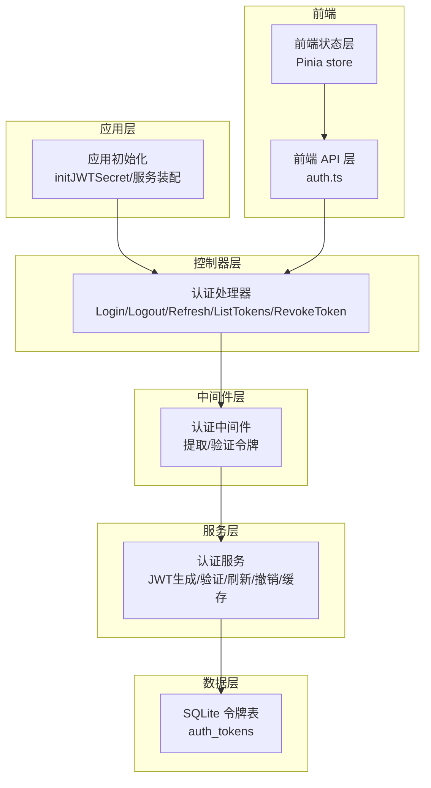
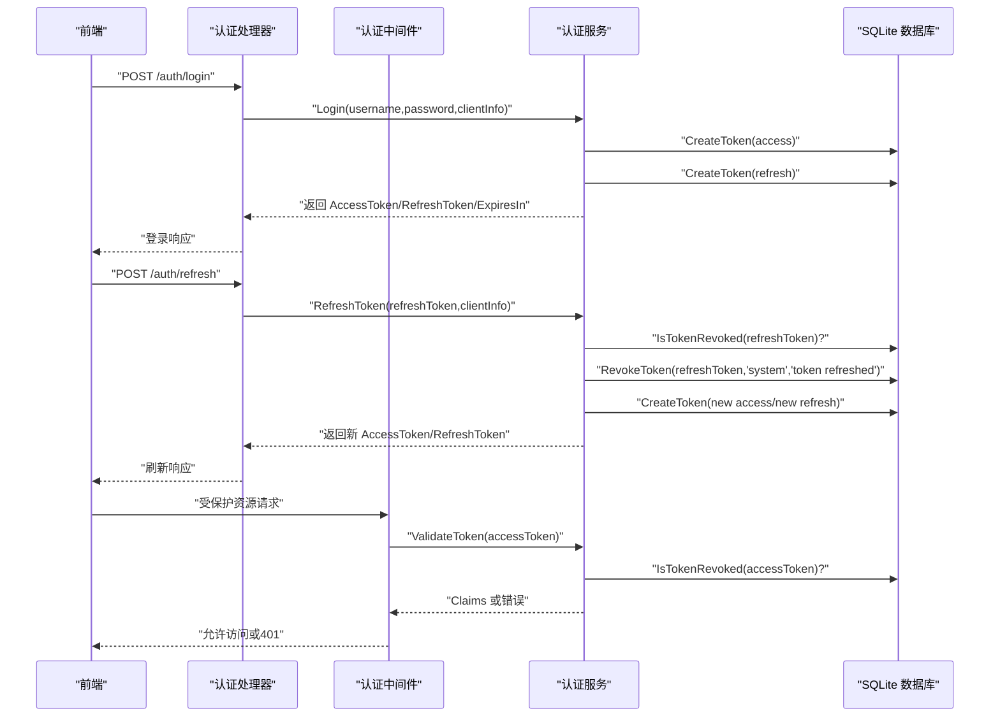
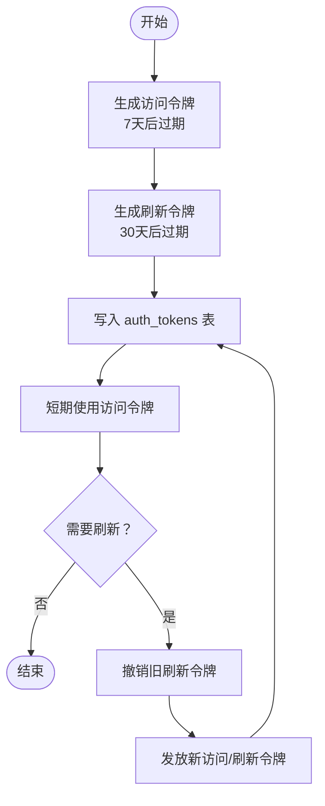
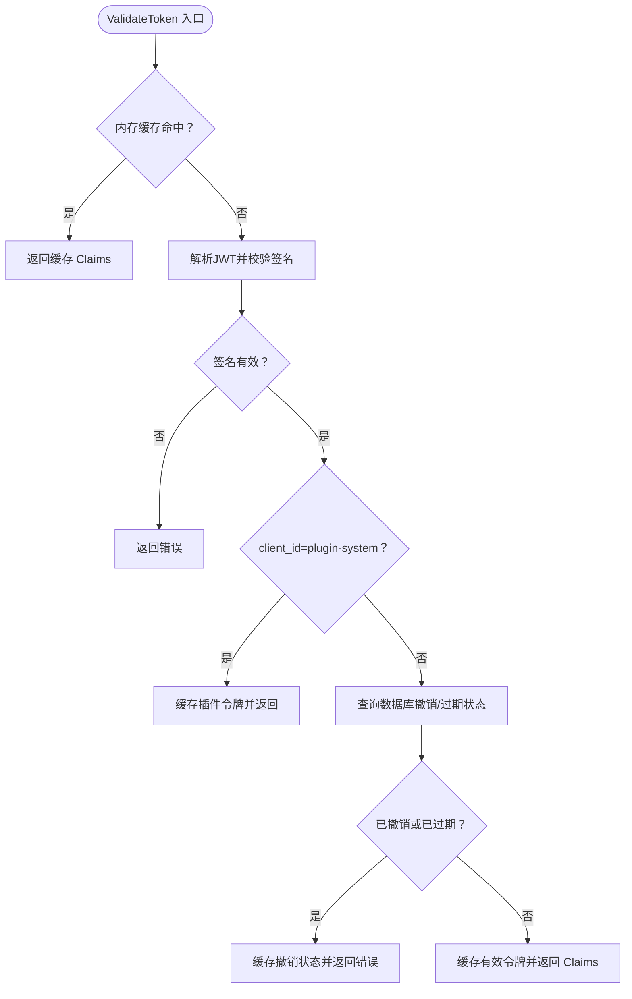
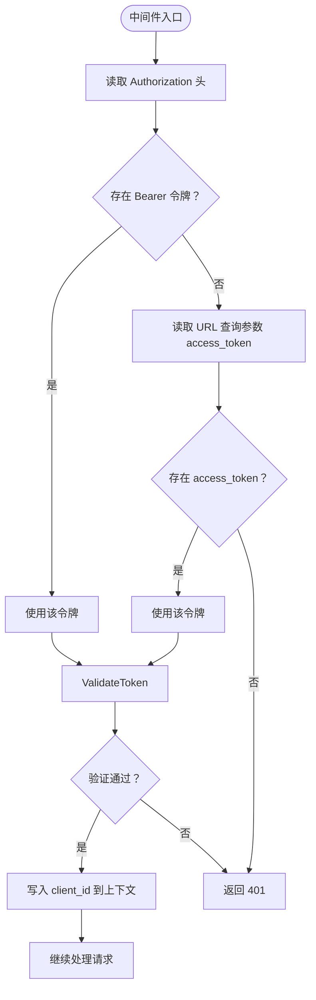
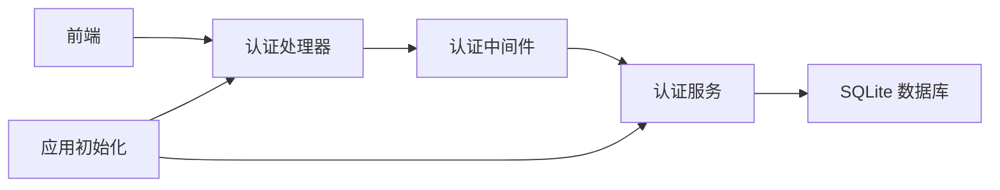

# 认证与授权

<cite>
**本文引用的文件**
- [internal/services/auth_service.go](file://internal/services/auth_service.go)
- [internal/middleware/auth.go](file://internal/middleware/auth.go)
- [internal/handlers/auth.go](file://internal/handlers/auth.go)
- [internal/database/sqlite_token.go](file://internal/database/sqlite_token.go)
- [internal/database/schema.go](file://internal/database/schema.go)
- [internal/models/models.go](file://internal/models/models.go)
- [internal/app/app.go](file://internal/app/app.go)
- [internal/config/types.go](file://internal/config/types.go)
- [web/src/api/auth.ts](file://web/src/api/auth.ts)
- [web/src/stores/auth.ts](file://web/src/stores/auth.ts)
- [internal/handlers/auth_test.go](file://internal/handlers/auth_test.go)
- [internal/middleware/auth_test.go](file://internal/middleware/auth_test.go)
- [main.go](file://main.go)
</cite>

## 目录
1. [简介](#简介)
2. [项目结构](#项目结构)
3. [核心组件](#核心组件)
4. [架构总览](#架构总览)
5. [详细组件分析](#详细组件分析)
6. [依赖分析](#依赖分析)
7. [性能考虑](#性能考虑)
8. [故障排除指南](#故障排除指南)
9. [结论](#结论)
10. [附录](#附录)

## 简介
本文件面向 MiMusic 的认证与授权系统，围绕 JWT 双 Token 机制（访问令牌与刷新令牌）进行深入实现说明，覆盖令牌签发、验证、刷新与撤销的全生命周期；同时阐述权限控制、安全策略（密码与会话、防暴力破解、安全审计）、认证中间件的工作原理与配置，并提供最佳实践与常见问题排查建议。

## 项目结构
认证相关的核心代码分布在以下模块：
- 服务层：负责 JWT 生成、令牌生命周期管理、缓存与撤销检查
- 中间件：统一拦截请求，提取并验证令牌
- 处理器：对外暴露登录、登出、刷新、令牌列表与撤销等 API
- 数据层：基于 SQLite 的令牌持久化与查询
- 前端：提供登录、登出、刷新、令牌管理等交互能力
- 应用初始化：负责 JWT 密钥初始化与服务装配

图表来源
- [internal/app/app.go:243-267](file://internal/app/app.go#L243-L267)
- [internal/handlers/auth.go:15-254](file://internal/handlers/auth.go#L15-L254)
- [internal/middleware/auth.go:11-51](file://internal/middleware/auth.go#L11-L51)
- [internal/services/auth_service.go:24-461](file://internal/services/auth_service.go#L24-L461)
- [internal/database/sqlite_token.go:14-203](file://internal/database/sqlite_token.go#L14-L203)
- [web/src/api/auth.ts:12-45](file://web/src/api/auth.ts#L12-L45)
- [web/src/stores/auth.ts:4-61](file://web/src/stores/auth.ts#L4-L61)

章节来源
- [internal/app/app.go:64-227](file://internal/app/app.go#L64-L227)
- [internal/handlers/auth.go:15-254](file://internal/handlers/auth.go#L15-L254)
- [internal/middleware/auth.go:11-51](file://internal/middleware/auth.go#L11-L51)
- [internal/services/auth_service.go:24-461](file://internal/services/auth_service.go#L24-L461)
- [internal/database/sqlite_token.go:14-203](file://internal/database/sqlite_token.go#L14-L203)
- [web/src/api/auth.ts:12-45](file://web/src/api/auth.ts#L12-L45)
- [web/src/stores/auth.ts:4-61](file://web/src/stores/auth.ts#L4-L61)

## 核心组件
- 认证服务（AuthService）
  - 负责 JWT 密钥加载、访问/刷新令牌生成、令牌验证、撤销检查、内存缓存与清理
  - 支持插件系统专用的“永久”令牌生成（内存态，不入库）
- 认证中间件（AuthMiddleware）
  - 从 Authorization 头或 URL 查询参数提取令牌，调用服务验证并通过上下文传递客户端标识
- 认证处理器（AuthHandler）
  - 对外提供登录、登出、刷新、列出活跃令牌、撤销令牌等接口
- 数据层（SQLite）
  - auth_tokens 表持久化令牌元数据，支持按类型、过期与撤销状态查询
- 前端集成
  - Pinia store 管理令牌与过期时间；API 层封装登录/登出/刷新/令牌管理接口

章节来源
- [internal/services/auth_service.go:24-461](file://internal/services/auth_service.go#L24-L461)
- [internal/middleware/auth.go:11-51](file://internal/middleware/auth.go#L11-L51)
- [internal/handlers/auth.go:15-254](file://internal/handlers/auth.go#L15-L254)
- [internal/database/sqlite_token.go:14-203](file://internal/database/sqlite_token.go#L14-L203)
- [web/src/stores/auth.ts:4-61](file://web/src/stores/auth.ts#L4-L61)
- [web/src/api/auth.ts:12-45](file://web/src/api/auth.ts#L12-L45)

## 架构总览
下图展示从请求进入、中间件验证、服务处理到数据库持久化的整体流程。

图表来源
- [internal/handlers/auth.go:27-134](file://internal/handlers/auth.go#L27-L134)
- [internal/middleware/auth.go:11-51](file://internal/middleware/auth.go#L11-L51)
- [internal/services/auth_service.go:94-324](file://internal/services/auth_service.go#L94-L324)
- [internal/database/sqlite_token.go:14-203](file://internal/database/sqlite_token.go#L14-L203)

## 详细组件分析

### JWT 双 Token 机制设计与实现
- 令牌类型与有效期
  - 访问令牌（access）：短期有效（默认 7 天），用于日常 API 请求
  - 刷新令牌（refresh）：长期有效（默认 30 天），用于换取新的访问令牌
- 生成策略
  - 使用 HS256 签名，密钥来自数据库配置项 jwt_secret
  - 每个令牌包含标准声明与自定义 client_id
- 令牌管理
  - 登录时同时创建 access 与 refresh 两条记录
  - 刷新时先撤销旧 refresh，再发放新 access 与新 refresh
  - 登出时撤销当前 access，并查找同客户端的 refresh 一并撤销
  - 内存缓存命中优先，减少数据库查询与撤销检查开销

图表来源
- [internal/services/auth_service.go:94-164](file://internal/services/auth_service.go#L94-L164)
- [internal/services/auth_service.go:245-324](file://internal/services/auth_service.go#L245-L324)
- [internal/database/sqlite_token.go:14-44](file://internal/database/sqlite_token.go#L14-L44)

章节来源
- [internal/services/auth_service.go:94-164](file://internal/services/auth_service.go#L94-L164)
- [internal/services/auth_service.go:245-324](file://internal/services/auth_service.go#L245-L324)
- [internal/database/sqlite_token.go:14-44](file://internal/database/sqlite_token.go#L14-L44)

### 令牌验证与撤销检查
- 验证流程
  - 优先从内存缓存命中；未命中则解析 JWT 并校验签名
  - 对普通用户令牌进一步检查是否被撤销或过期
  - 插件系统令牌（client_id=plugin-system）不入库，仅做签名验证并缓存
- 缓存策略
  - 使用内存缓存条目，包含 claims、过期时间与撤销标记
  - 后台定时清理过期或已撤销的缓存项

图表来源
- [internal/services/auth_service.go:326-371](file://internal/services/auth_service.go#L326-L371)
- [internal/services/auth_service.go:166-210](file://internal/services/auth_service.go#L166-L210)

章节来源
- [internal/services/auth_service.go:326-371](file://internal/services/auth_service.go#L326-L371)
- [internal/services/auth_service.go:166-210](file://internal/services/auth_service.go#L166-L210)

### 权限控制与访问策略
- 用户角色与权限
  - 系统采用单一管理员角色（用户名/密码由启动参数或环境变量配置）
  - 未在代码中定义细粒度权限级别或资源级权限控制
- 访问控制策略
  - 通过中间件强制要求 Bearer 令牌
  - 令牌类型区分：访问令牌用于受保护资源，刷新令牌用于换取新令牌
  - 令牌撤销与过期检查确保失效令牌无法继续使用

章节来源
- [internal/app/app.go:317-351](file://internal/app/app.go#L317-L351)
- [internal/middleware/auth.go:11-51](file://internal/middleware/auth.go#L11-L51)
- [internal/handlers/auth.go:27-134](file://internal/handlers/auth.go#L27-L134)

### 安全策略实现
- 密码与会话
  - 登录凭据为固定管理员账户（启动参数/环境变量），不涉及动态用户注册与密码加密
  - 会话以令牌形式存在，不维护服务端会话状态
- 防暴力破解
  - 代码中未发现显式的速率限制或账户锁定机制
- 安全审计
  - 令牌表记录创建时间、撤销时间、撤销原因与撤销者，便于审计追踪
- 传输与存储
  - 令牌通过 Authorization 头传输；JWT 密钥存储于数据库配置表中

章节来源
- [internal/database/schema.go:61-72](file://internal/database/schema.go#L61-L72)
- [internal/database/sqlite_token.go:75-97](file://internal/database/sqlite_token.go#L75-L97)
- [internal/app/app.go:243-267](file://internal/app/app.go#L243-L267)

### 认证中间件工作原理与配置
- 工作原理
  - 优先从 Authorization 头提取 Bearer 令牌；若为空，回退到 URL 查询参数 access_token（用于静态资源场景）
  - 调用服务验证令牌，成功后将 client_id 写入请求上下文供后续使用
- 配置选项
  - 通过中间件函数注入 AuthService 实例
  - 令牌来源支持头与查询参数两种方式

图表来源
- [internal/middleware/auth.go:11-51](file://internal/middleware/auth.go#L11-L51)
- [internal/services/auth_service.go:326-371](file://internal/services/auth_service.go#L326-L371)

章节来源
- [internal/middleware/auth.go:11-51](file://internal/middleware/auth.go#L11-L51)

### 前端集成与最佳实践
- 前端状态管理
  - 使用 Pinia store 存储 AccessToken、RefreshToken 与过期时间，支持持久化
  - 提供 isTokenExpiringSoon 逻辑，用于提前刷新
- API 调用
  - 登录成功后保存双令牌与过期时间
  - 登出时清除状态并调用后端登出接口
  - 刷新接口在即将过期时自动调用，确保连续访问

章节来源
- [web/src/stores/auth.ts:4-61](file://web/src/stores/auth.ts#L4-L61)
- [web/src/api/auth.ts:12-45](file://web/src/api/auth.ts#L12-L45)

## 依赖分析
- 组件耦合
  - 处理器依赖服务；中间件依赖服务；服务依赖数据库；前端依赖处理器
- 外部依赖
  - JWT 库用于签名与解析
  - SQLite 用于令牌持久化
  - Chi 路由用于 API 路由组织
- 循环依赖
  - 未发现循环依赖

图表来源
- [internal/handlers/auth.go:15-254](file://internal/handlers/auth.go#L15-L254)
- [internal/middleware/auth.go:11-51](file://internal/middleware/auth.go#L11-L51)
- [internal/services/auth_service.go:24-461](file://internal/services/auth_service.go#L24-L461)
- [internal/database/sqlite_token.go:14-203](file://internal/database/sqlite_token.go#L14-L203)
- [internal/app/app.go:64-227](file://internal/app/app.go#L64-L227)

章节来源
- [internal/handlers/auth.go:15-254](file://internal/handlers/auth.go#L15-L254)
- [internal/middleware/auth.go:11-51](file://internal/middleware/auth.go#L11-L51)
- [internal/services/auth_service.go:24-461](file://internal/services/auth_service.go#L24-L461)
- [internal/database/sqlite_token.go:14-203](file://internal/database/sqlite_token.go#L14-L203)
- [internal/app/app.go:64-227](file://internal/app/app.go#L64-L227)

## 性能考虑
- 内存缓存
  - 令牌验证优先走内存缓存，后台定时清理过期条目，降低数据库压力
- 数据库索引
  - auth_tokens 表对 token_id、token_type、expires_at、revoked_at 建有索引，提升查询与撤销检查效率
- 刷新与登出
  - 刷新时仅撤销旧 refresh 并发放新 pair，避免全量扫描
  - 登出时按 client_id 过滤撤销对应 refresh，减少无关操作

章节来源
- [internal/services/auth_service.go:166-210](file://internal/services/auth_service.go#L166-L210)
- [internal/database/schema.go:89-103](file://internal/database/schema.go#L89-L103)
- [internal/services/auth_service.go:212-243](file://internal/services/auth_service.go#L212-L243)

## 故障排除指南
- 常见错误与定位
  - 401 缺少认证信息：请求未携带令牌或令牌为空
  - 401 无效的 token：签名错误、格式错误或解析失败
  - 401 刷新令牌无效：refresh 令牌被撤销或过期
  - 500 登出/撤销失败：数据库更新失败或未找到令牌
- 前端常见问题
  - 令牌过期但未刷新：检查 isTokenExpiringSoon 逻辑与刷新接口调用
  - 登录后仍提示未授权：确认 Authorization 头是否正确设置
- 单元测试参考
  - 处理器与中间件均有测试用例，可对照验证行为

章节来源
- [internal/middleware/auth.go:32-42](file://internal/middleware/auth.go#L32-L42)
- [internal/handlers/auth.go:56-59](file://internal/handlers/auth.go#L56-L59)
- [internal/handlers/auth.go:128-131](file://internal/handlers/auth.go#L128-L131)
- [internal/handlers/auth_test.go:71-201](file://internal/handlers/auth_test.go#L71-L201)
- [internal/middleware/auth_test.go:68-109](file://internal/middleware/auth_test.go#L68-L109)

## 结论
MiMusic 的认证与授权系统采用简洁可靠的 JWT 双 Token 设计：短期访问令牌与长期刷新令牌配合内存缓存与数据库撤销检查，既满足易用性又具备一定安全性。当前实现聚焦管理员单一角色与基本令牌生命周期管理，未包含细粒度权限与防暴力破解策略。建议在后续版本中引入速率限制、更细粒度的权限模型与审计日志增强。

## 附录

### API 定义与调用示例（路径引用）
- 登录
  - 方法与路径：POST /auth/login
  - 请求体：用户名与密码
  - 返回：访问令牌、刷新令牌与过期时间
  - 示例路径：[internal/handlers/auth.go:27-62](file://internal/handlers/auth.go#L27-L62)
- 刷新
  - 方法与路径：POST /auth/refresh
  - 请求体：刷新令牌
  - 返回：新的访问令牌与刷新令牌
  - 示例路径：[internal/handlers/auth.go:99-134](file://internal/handlers/auth.go#L99-L134)
- 登出
  - 方法与路径：POST /auth/logout
  - 请求头：Authorization Bearer 与 X-Client-ID
  - 返回：成功消息
  - 示例路径：[internal/handlers/auth.go:64-97](file://internal/handlers/auth.go#L64-L97)
- 列出活跃令牌
  - 方法与路径：GET /auth/tokens
  - 查询参数：type、limit、offset
  - 返回：令牌列表与分页信息
  - 示例路径：[internal/handlers/auth.go:136-195](file://internal/handlers/auth.go#L136-L195)
- 撤销令牌
  - 方法与路径：DELETE /auth/tokens/{token_id}
  - 请求体：撤销原因
  - 返回：成功消息
  - 示例路径：[internal/handlers/auth.go:197-236](file://internal/handlers/auth.go#L197-L236)

### 数据模型与数据库表
- 认证令牌模型
  - 字段：token_id、token_type、client_info、expires_at、revoked_at、revoked_by、created_at、revoked_reason
  - 示例路径：[internal/models/models.go:368-379](file://internal/models/models.go#L368-L379)
- 令牌表结构
  - 约束与索引：token_type 限定 access/refresh；多列索引优化查询
  - 示例路径：[internal/database/schema.go:61-103](file://internal/database/schema.go#L61-L103)

### 应用初始化与配置
- JWT 密钥初始化
  - 若不存在则生成并写入配置表
  - 示例路径：[internal/app/app.go:243-267](file://internal/app/app.go#L243-L267)
- 启动参数与环境变量
  - 管理员用户名/密码、监听端口、数据库路径
  - 示例路径：[internal/app/app.go:288-351](file://internal/app/app.go#L288-L351)
  - 配置结构：[internal/config/types.go:3-9](file://internal/config/types.go#L3-L9)
- Swagger 安全定义
  - BearerAuth 在 main.go 注释中定义
  - 示例路径：[main.go:25-28](file://main.go#L25-L28)