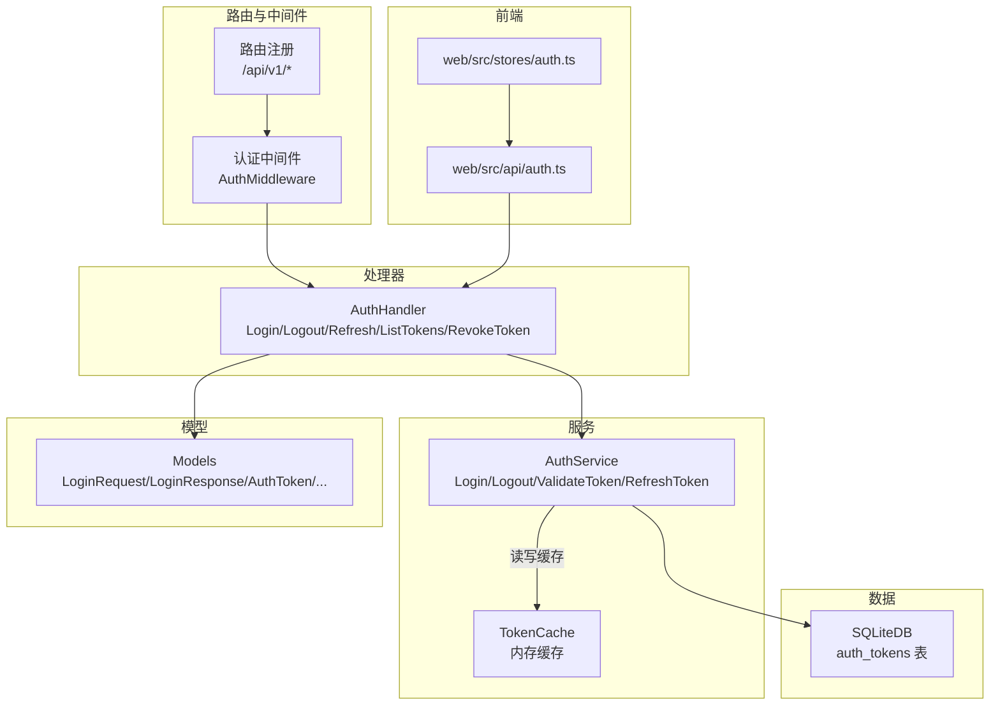
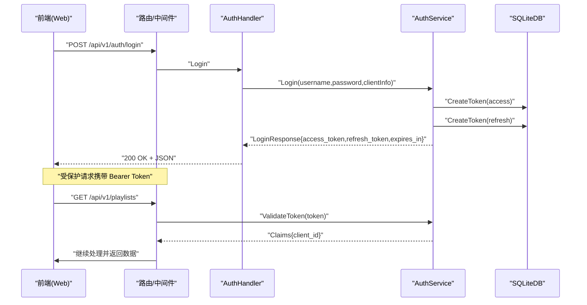
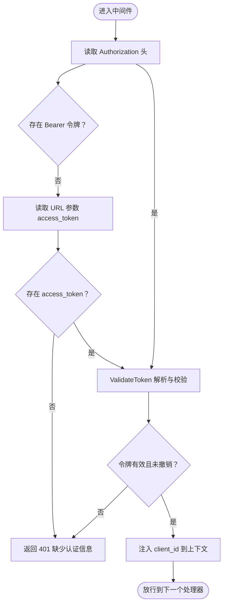
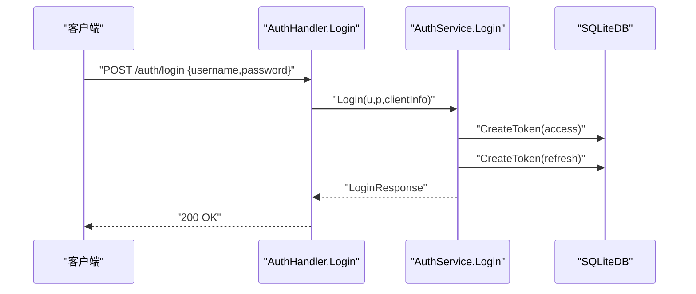
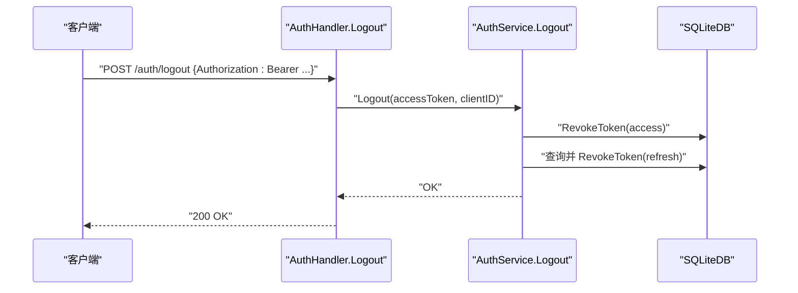
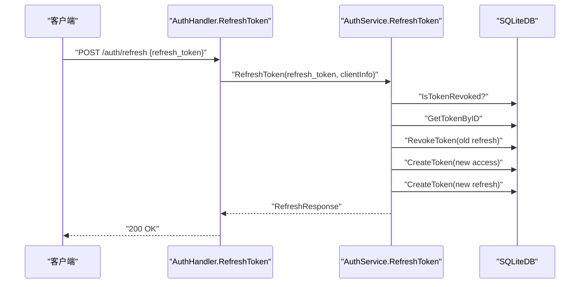
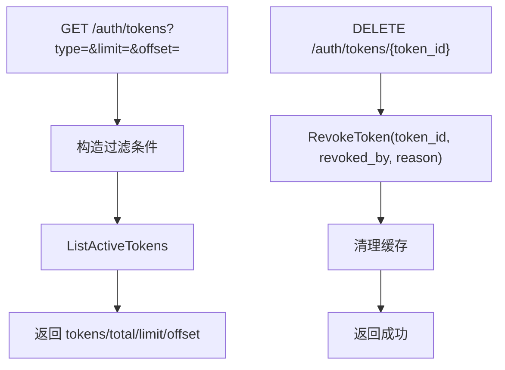
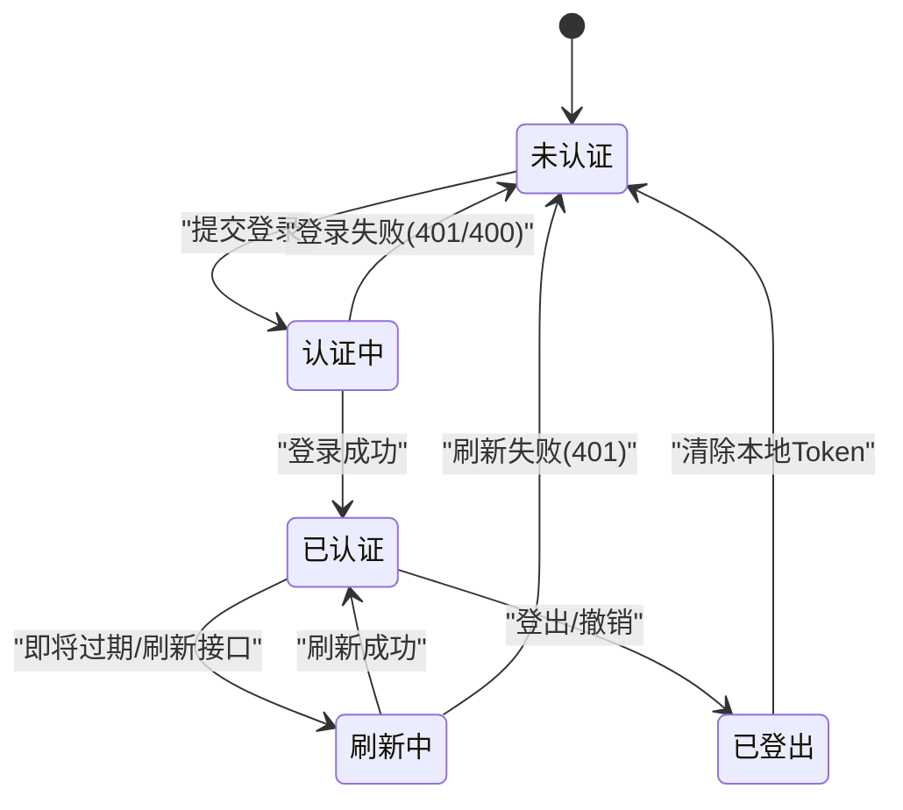
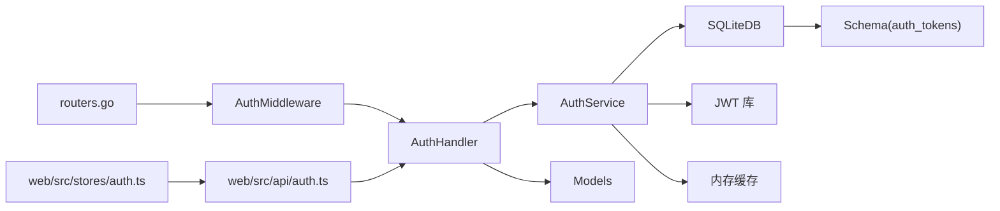

# 认证流程

<cite>
**本文引用的文件**
- [internal/handlers/auth.go](file://internal/handlers/auth.go)
- [internal/middleware/auth.go](file://internal/middleware/auth.go)
- [internal/services/auth_service.go](file://internal/services/auth_service.go)
- [internal/database/sqlite_token.go](file://internal/database/sqlite_token.go)
- [internal/database/schema.go](file://internal/database/schema.go)
- [internal/models/models.go](file://internal/models/models.go)
- [internal/handlers/auth_test.go](file://internal/handlers/auth_test.go)
- [internal/middleware/auth_test.go](file://internal/middleware/auth_test.go)
- [internal/services/auth_service_test.go](file://internal/services/auth_service_test.go)
- [internal/app/routers.go](file://internal/app/routers.go)
- [web/src/api/auth.ts](file://web/src/api/auth.ts)
- [web/src/stores/auth.ts](file://web/src/stores/auth.ts)
</cite>

## 目录
1. [简介](#简介)
2. [项目结构](#项目结构)
3. [核心组件](#核心组件)
4. [架构总览](#架构总览)
5. [详细组件分析](#详细组件分析)
6. [依赖分析](#依赖分析)
7. [性能考量](#性能考量)
8. [故障排查指南](#故障排查指南)
9. [结论](#结论)
10. [附录](#附录)

## 简介
本文件面向 MiMusic 的认证体系，系统性梳理从登录到令牌发放、中间件拦截与验证、登出与撤销、以及失败处理与安全防护的全流程。文档同时给出关键时序图、状态转换图与错误处理示例，并提供安全最佳实践、性能优化建议与调试技巧，帮助开发者与运维人员快速理解与维护认证子系统。

## 项目结构
认证相关代码主要分布在以下层次：
- 路由与中间件层：负责路由注册与请求拦截
- 处理器层：暴露登录、登出、刷新、令牌列表与撤销等接口
- 服务层：实现登录、登出、令牌验证、刷新、撤销与缓存等业务逻辑
- 数据层：基于 SQLite 的令牌持久化与查询
- 模型层：统一的请求/响应与错误模型
- 前端集成：Web 前端通过 API Store 管理 Token 生命周期

**图表来源**
- [internal/app/routers.go:28-116](file://internal/app/routers.go#L28-L116)
- [internal/middleware/auth.go:11-51](file://internal/middleware/auth.go#L11-L51)
- [internal/handlers/auth.go:15-254](file://internal/handlers/auth.go#L15-L254)
- [internal/services/auth_service.go:24-461](file://internal/services/auth_service.go#L24-L461)
- [internal/database/sqlite_token.go:14-203](file://internal/database/sqlite_token.go#L14-L203)
- [internal/models/models.go:368-402](file://internal/models/models.go#L368-L402)
- [web/src/api/auth.ts:12-44](file://web/src/api/auth.ts#L12-L44)
- [web/src/stores/auth.ts:4-61](file://web/src/stores/auth.ts#L4-L61)

**章节来源**
- [internal/app/routers.go:28-116](file://internal/app/routers.go#L28-L116)

## 核心组件
- 认证中间件：拦截所有受保护路由，从 Authorization 头或 URL 查询参数提取令牌，验证并通过后将客户端标识注入请求上下文。
- 认证处理器：提供登录、登出、刷新、令牌列表与撤销等接口；负责请求解码、客户端信息采集与响应封装。
- 认证服务：实现登录凭据校验、JWT 生成与缓存、令牌验证与撤销、刷新流程与数据库交互。
- 数据库层：提供令牌创建、查询、撤销、列表与过期清理等能力。
- 模型层：统一的请求/响应结构与错误类型，便于前后端契约一致。
- 前端集成：Web 前端通过 API 模块与 Pinia Store 管理 Token 生命周期与过期检测。

**章节来源**
- [internal/middleware/auth.go:11-51](file://internal/middleware/auth.go#L11-L51)
- [internal/handlers/auth.go:15-254](file://internal/handlers/auth.go#L15-L254)
- [internal/services/auth_service.go:24-461](file://internal/services/auth_service.go#L24-L461)
- [internal/database/sqlite_token.go:14-203](file://internal/database/sqlite_token.go#L14-L203)
- [internal/models/models.go:368-402](file://internal/models/models.go#L368-L402)
- [web/src/api/auth.ts:12-44](file://web/src/api/auth.ts#L12-L44)
- [web/src/stores/auth.ts:4-61](file://web/src/stores/auth.ts#L4-L61)

## 架构总览
下图展示认证从请求进入至响应返回的关键交互：

**图表来源**
- [internal/app/routers.go:40-116](file://internal/app/routers.go#L40-L116)
- [internal/handlers/auth.go:27-62](file://internal/handlers/auth.go#L27-L62)
- [internal/services/auth_service.go:94-164](file://internal/services/auth_service.go#L94-L164)
- [internal/database/sqlite_token.go:14-44](file://internal/database/sqlite_token.go#L14-L44)

## 详细组件分析

### 认证中间件工作原理
- 请求拦截：对受保护路由启用中间件，优先从 Authorization 头提取 Bearer 令牌；若缺失则回退到 URL 查询参数 access_token（适配图片/音频等无法自定义 Header 的场景）。
- 令牌验证：调用服务层 ValidateToken，解析 JWT 并校验撤销状态；对插件系统 Token（client_id=plugin-system）特殊处理，不查询数据库。
- 上下文注入：将 client_id 写入请求上下文，供后续处理器使用。
- 未授权处理：若缺少令牌或验证失败，返回 401。

**图表来源**
- [internal/middleware/auth.go:11-51](file://internal/middleware/auth.go#L11-L51)

**章节来源**
- [internal/middleware/auth.go:11-51](file://internal/middleware/auth.go#L11-L51)
- [internal/middleware/auth_test.go:14-109](file://internal/middleware/auth_test.go#L14-L109)

### 登录接口实现细节
- 请求解码：处理器从请求体解码 LoginRequest，失败返回 400。
- 凭据验证：服务层获取管理员用户名/密码，与请求进行严格对比，失败返回 401。
- 客户端信息：优先使用 User-Agent，否则回退到 RemoteAddr。
- Token 生成：生成客户端 ID 与两个 JWT：Access（7 天）与 Refresh（30 天），并写入缓存。
- 数据库操作：创建两条记录（access/refresh），随后清理过期令牌。
- 响应封装：返回 LoginResponse，包含 access_token、refresh_token、expires_in、token_type。

**图表来源**
- [internal/handlers/auth.go:27-62](file://internal/handlers/auth.go#L27-L62)
- [internal/services/auth_service.go:94-164](file://internal/services/auth_service.go#L94-L164)
- [internal/database/sqlite_token.go:14-44](file://internal/database/sqlite_token.go#L14-L44)

**章节来源**
- [internal/handlers/auth.go:27-62](file://internal/handlers/auth.go#L27-L62)
- [internal/services/auth_service.go:94-164](file://internal/services/auth_service.go#L94-L164)
- [internal/database/sqlite_token.go:14-44](file://internal/database/sqlite_token.go#L14-L44)

### 登出流程与令牌撤销
- 令牌提取：从请求头 Authorization 中取出 Bearer 令牌；同时读取 X-Client-ID。
- 登出执行：服务层撤销 Access Token，并查找同客户端的 Refresh Token 一并撤销；清理缓存。
- 响应：返回成功消息。

**图表来源**
- [internal/handlers/auth.go:64-97](file://internal/handlers/auth.go#L64-L97)
- [internal/services/auth_service.go:212-243](file://internal/services/auth_service.go#L212-L243)
- [internal/database/sqlite_token.go:75-97](file://internal/database/sqlite_token.go#L75-L97)

**章节来源**
- [internal/handlers/auth.go:64-97](file://internal/handlers/auth.go#L64-L97)
- [internal/services/auth_service.go:212-243](file://internal/services/auth_service.go#L212-L243)
- [internal/database/sqlite_token.go:75-97](file://internal/database/sqlite_token.go#L75-L97)

### 刷新令牌流程
- 输入校验：解码 RefreshTokenRequest，失败返回 400。
- 状态检查：确认 Refresh Token 未被撤销且未过期。
- 撤销旧 Token：将旧 Refresh Token 标记为撤销并清理缓存。
- 生成新 Token：创建新的 Access 与 Refresh Token，写入数据库。
- 响应：返回新的 Access/Refresh Token 与过期时间。

**图表来源**
- [internal/handlers/auth.go:99-134](file://internal/handlers/auth.go#L99-L134)
- [internal/services/auth_service.go:245-324](file://internal/services/auth_service.go#L245-L324)
- [internal/database/sqlite_token.go:46-97](file://internal/database/sqlite_token.go#L46-L97)

**章节来源**
- [internal/handlers/auth.go:99-134](file://internal/handlers/auth.go#L99-L134)
- [internal/services/auth_service.go:245-324](file://internal/services/auth_service.go#L245-L324)
- [internal/database/sqlite_token.go:46-97](file://internal/database/sqlite_token.go#L46-L97)

### 令牌列表与撤销
- 列表接口：支持按类型过滤、分页与排序，返回活跃令牌集合。
- 撤销接口：支持按 token_id 撤销，记录撤销者与原因，同时清理缓存。

**图表来源**
- [internal/handlers/auth.go:136-236](file://internal/handlers/auth.go#L136-L236)
- [internal/services/auth_service.go:373-386](file://internal/services/auth_service.go#L373-L386)
- [internal/database/sqlite_token.go:99-167](file://internal/database/sqlite_token.go#L99-L167)

**章节来源**
- [internal/handlers/auth.go:136-236](file://internal/handlers/auth.go#L136-L236)
- [internal/services/auth_service.go:373-386](file://internal/services/auth_service.go#L373-L386)
- [internal/database/sqlite_token.go:99-167](file://internal/database/sqlite_token.go#L99-L167)

### 认证失败处理与安全防护
- 错误响应格式：统一使用错误模型，包含 error 与 detail 字段，便于前端提示。
- 重试策略：前端在 Token 即将过期时自动刷新；若刷新失败则清空本地 Token 并引导重新登录。
- 安全防护：
  - 令牌仅在内存中缓存，定期清理过期条目。
  - 插件系统 Token 不入库，避免数据库约束限制。
  - 支持按客户端维度批量撤销 Refresh Token，防止会话泄漏。
  - CORS 严格白名单，仅允许特定来源访问。

**图表来源**
- [web/src/stores/auth.ts:10-42](file://web/src/stores/auth.ts#L10-L42)
- [web/src/api/auth.ts:12-44](file://web/src/api/auth.ts#L12-L44)
- [internal/services/auth_service.go:326-371](file://internal/services/auth_service.go#L326-L371)

**章节来源**
- [internal/models/models.go:244-253](file://internal/models/models.go#L244-L253)
- [web/src/stores/auth.ts:10-42](file://web/src/stores/auth.ts#L10-L42)
- [web/src/api/auth.ts:12-44](file://web/src/api/auth.ts#L12-L44)
- [internal/services/auth_service.go:326-371](file://internal/services/auth_service.go#L326-L371)

## 依赖分析
- 路由注册：/api/v1 下的认证路由在受保护组中启用 AuthMiddleware。
- 处理器依赖：AuthHandler 依赖 AuthService；内部使用 models 与 database。
- 服务依赖：AuthService 依赖 SQLiteDB、JWT 库与内存缓存；数据库层依赖 models。
- 前端依赖：web/src/api/auth.ts 与 web/src/stores/auth.ts 与后端接口契约一致。

**图表来源**
- [internal/app/routers.go:28-116](file://internal/app/routers.go#L28-L116)
- [internal/middleware/auth.go:11-51](file://internal/middleware/auth.go#L11-L51)
- [internal/handlers/auth.go:15-25](file://internal/handlers/auth.go#L15-L25)
- [internal/services/auth_service.go:24-32](file://internal/services/auth_service.go#L24-L32)
- [internal/database/schema.go:61-72](file://internal/database/schema.go#L61-L72)
- [internal/models/models.go:368-402](file://internal/models/models.go#L368-L402)
- [web/src/api/auth.ts:12-44](file://web/src/api/auth.ts#L12-L44)
- [web/src/stores/auth.ts:4-61](file://web/src/stores/auth.ts#L4-L61)

**章节来源**
- [internal/app/routers.go:28-116](file://internal/app/routers.go#L28-L116)
- [internal/database/schema.go:61-72](file://internal/database/schema.go#L61-L72)

## 性能考量
- 内存缓存：AuthService 使用 sync.Map 缓存 JWT 解析结果，避免重复数据库查询与解析开销；定时清理过期缓存条目。
- 数据库索引：auth_tokens 表对 token_id、token_type、expires_at、revoked_at 建立索引，提升查询与撤销检查效率。
- 压缩传输：启用 gzip 压缩中间件，降低静态资源与 JSON 的传输体积。
- 刷新策略：前端在 Token 即将过期前自动刷新，减少因过期导致的重试与失败。

**章节来源**
- [internal/services/auth_service.go:16-32](file://internal/services/auth_service.go#L16-L32)
- [internal/database/schema.go:89-103](file://internal/database/schema.go#L89-L103)
- [internal/app/routers.go:137-148](file://internal/app/routers.go#L137-L148)

## 故障排查指南
- 登录失败（401）：检查用户名/密码是否正确；确认 JWT 密钥已初始化；查看服务端日志定位具体错误。
- 令牌无效（401）：确认 Authorization 头格式为 Bearer；若使用图片/音频等场景，检查 URL 参数 access_token 是否传递。
- 刷新失败（401）：确认 refresh_token 未被撤销且未过期；检查服务端是否成功创建新 Token。
- 登出无效：确认传入的 Authorization 与 X-Client-ID 是否正确；检查数据库是否成功撤销对应 Token。
- 前端 Token 异常：检查浏览器存储是否持久化成功；确认 isTokenExpiringSoon 逻辑与刷新流程。

**章节来源**
- [internal/handlers/auth_test.go:71-201](file://internal/handlers/auth_test.go#L71-L201)
- [internal/middleware/auth_test.go:68-109](file://internal/middleware/auth_test.go#L68-L109)
- [internal/services/auth_service_test.go:190-314](file://internal/services/auth_service_test.go#L190-L314)
- [web/src/stores/auth.ts:40-42](file://web/src/stores/auth.ts#L40-L42)

## 结论
MiMusic 的认证体系采用 JWT 令牌与 SQLite 持久化结合的方式，通过中间件统一拦截与验证，配合内存缓存与严格的撤销检查，实现了高效、安全的认证与授权。前端通过 API Store 管理 Token 生命周期，具备完善的过期检测与刷新策略。整体设计在易用性与安全性之间取得平衡，适合桌面与 Web 场景部署。

## 附录
- 安全最佳实践
  - 严格管理 JWT 密钥，避免硬编码；生产环境建议使用密钥管理服务。
  - 限制 CORS 白名单，避免跨站风险。
  - 定期清理过期与撤销的 Token，保持数据库健康。
  - 对敏感操作增加二次确认与审计日志。
- 性能优化建议
  - 合理设置缓存清理周期，避免缓存膨胀。
  - 对高频查询建立复合索引，减少扫描成本。
  - 控制分页大小与默认 limit，避免一次性返回过多数据。
- 调试技巧
  - 使用 Swagger 文档快速验证接口行为。
  - 在开发环境开启详细日志与 panic 捕获，便于定位异常。
  - 前端使用持久化存储与 Token 过期检测，减少无效请求。