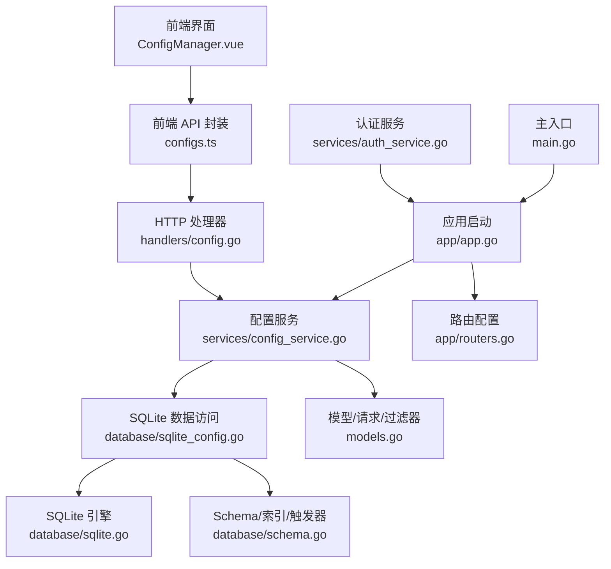
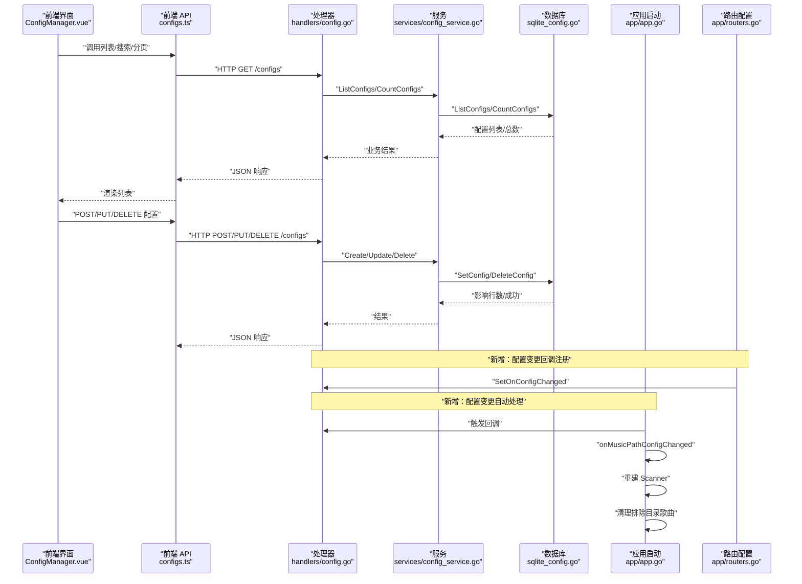
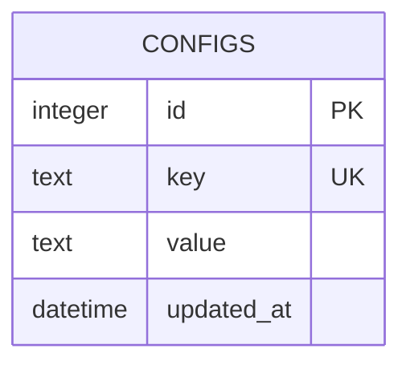
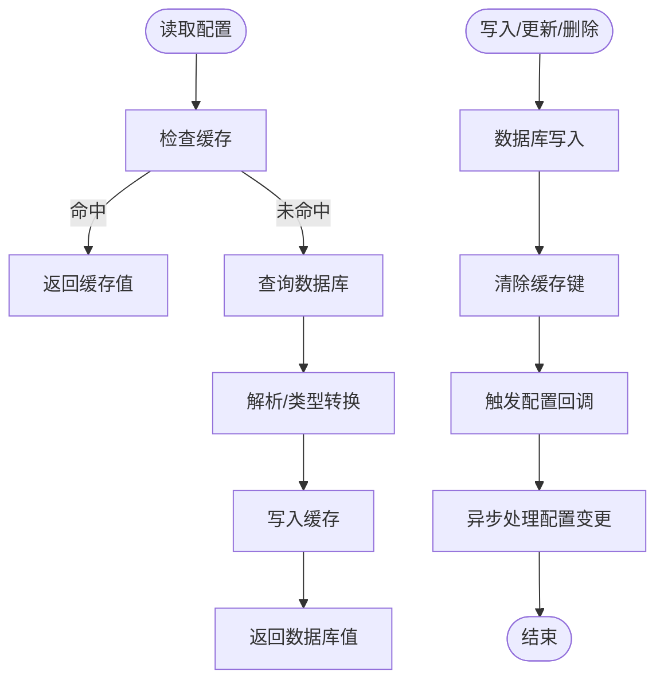
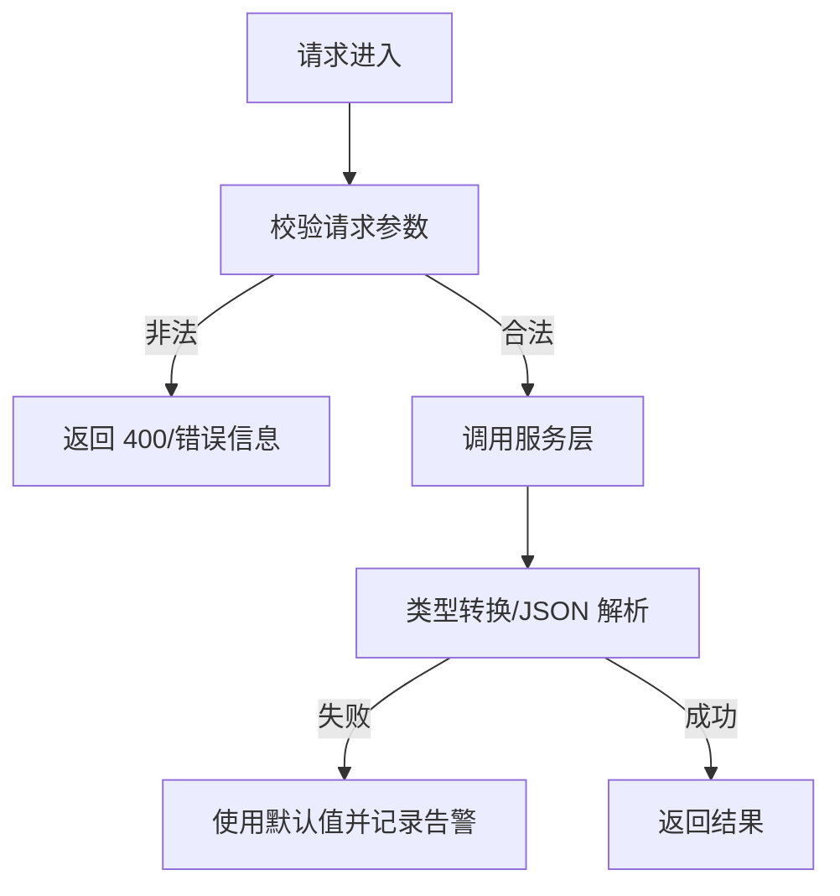
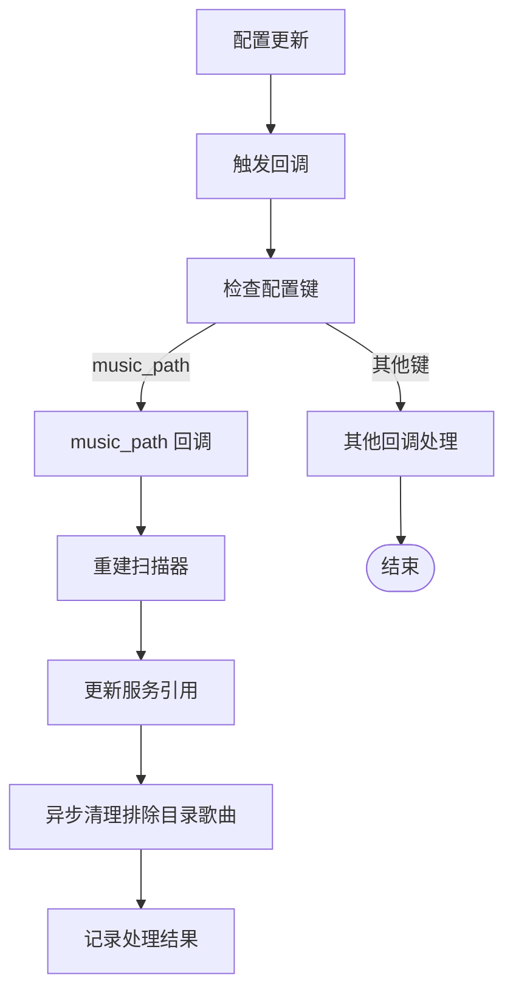
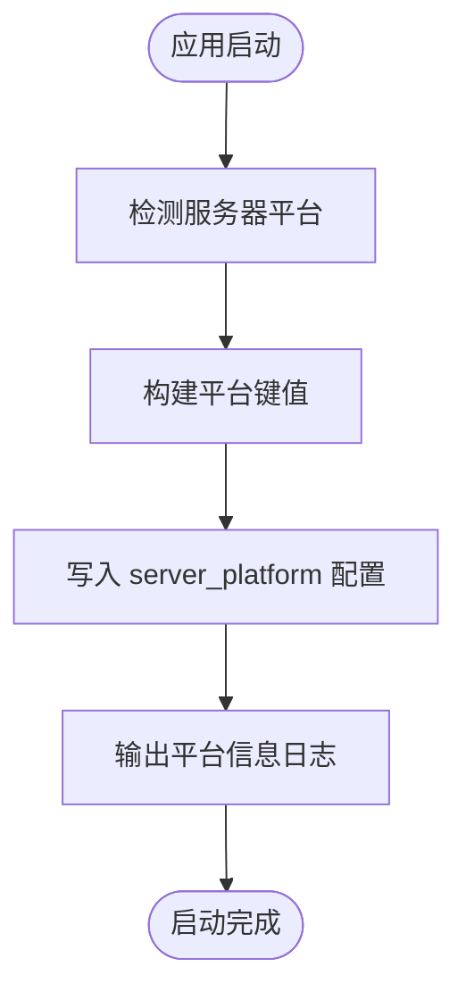
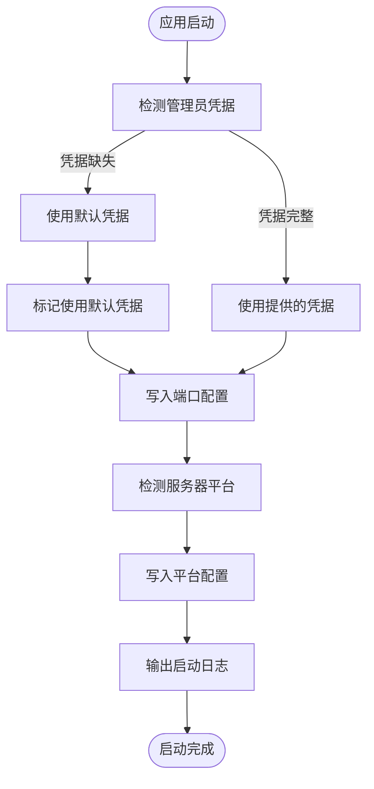
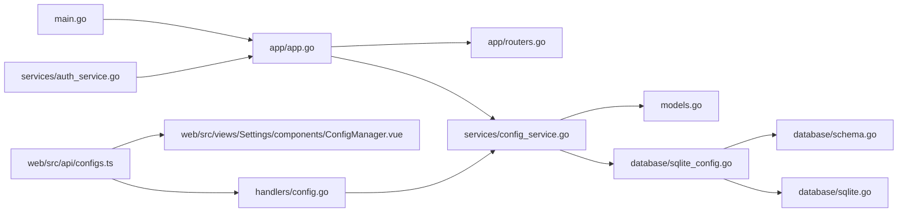

# 配置管理

<cite>
**本文引用的文件**
- [internal/services/config_service.go](file://internal/services/config_service.go)
- [internal/handlers/config.go](file://internal/handlers/config.go)
- [internal/database/sqlite_config.go](file://internal/database/sqlite_config.go)
- [internal/database/sqlite.go](file://internal/database/sqlite.go)
- [internal/database/schema.go](file://internal/database/schema.go)
- [internal/models/models.go](file://internal/models/models.go)
- [internal/app/app.go](file://internal/app/app.go)
- [internal/app/routers.go](file://internal/app/routers.go)
- [internal/config/types.go](file://internal/config/types.go)
- [internal/services/auth_service.go](file://internal/services/auth_service.go)
- [main.go](file://main.go)
- [internal/services/config_service_test.go](file://internal/services/config_service_test.go)
- [internal/database/sqlite_test.go](file://internal/database/sqlite_test.go)
- [plugins/mimusic-plugin-cloudflared/static/js/common.js](file://plugins/mimusic-plugin-cloudflared/static/js/common.js)
- [frontend/lib/features/settings/presentation/widgets/config_manager.dart](file://frontend/lib/features/settings/presentation/widgets/config_manager.dart)
- [frontend/lib/features/settings/presentation/widgets/exclude_dir_manager.dart](file://frontend/lib/features/settings/presentation/widgets/exclude_dir_manager.dart)
- [frontend/lib/features/settings/data/config_api.dart](file://frontend/lib/features/settings/data/config_api.dart)
- [frontend/lib/main.dart](file://frontend/lib/main.dart)
- [README.md](file://README.md)
</cite>

## 更新摘要
**所做更改**
- 新增配置回调系统，支持动态配置重载（onMusicPathConfigChanged）
- 增强应用程序初始化流程，实现配置变更的自动处理
- 新增音乐路径配置变更的实时重载机制
- 完善配置变更通知与异步处理流程

## 目录
1. [简介](#简介)
2. [项目结构](#项目结构)
3. [核心组件](#核心组件)
4. [架构总览](#架构总览)
5. [详细组件分析](#详细组件分析)
6. [依赖分析](#依赖分析)
7. [性能考虑](#性能考虑)
8. [故障排查指南](#故障排查指南)
9. [结论](#结论)
10. [附录](#附录)

## 简介
本文件面向 MiMusic 的"配置管理"能力，系统性阐述配置存储机制、动态配置更新与热重载、配置验证体系、迁移策略、API 使用方式、错误处理与性能优化，并补充备份恢复与批量配置管理的实践建议。文档以代码为依据，结合前端界面与后端服务，帮助开发者与运维人员快速理解与高效使用配置管理功能。

**更新** 本次更新重点增强了配置管理的动态回调系统，新增了音乐路径配置变更的实时重载功能，实现了配置变更的自动处理和异步清理机制，为插件开发和系统配置管理提供了更加智能化的支持。

## 项目结构
配置管理涉及后端服务层、数据访问层、模型定义以及前端 API 与界面组件。关键文件分布如下：
- 后端服务层：配置服务封装了缓存、类型转换、JSON 解析与 CRUD 能力
- 数据访问层：SQLite 实现了配置的增删改查、分页统计与冲突更新
- 模型与过滤器：定义了配置实体、请求/响应结构及分页过滤条件
- 应用启动层：新增配置回调系统，支持动态配置重载
- 认证服务：集成默认凭据处理与 JWT 密钥管理
- 前端 API 与界面：提供配置列表、搜索、分页、创建/编辑/删除等交互
- 迁移与初始化：数据库 Schema 中包含配置表、索引与默认配置初始化

**图表来源**
- [internal/app/app.go:231-235](file://internal/app/app.go#L231-L235)
- [internal/app/routers.go:35-41](file://internal/app/routers.go#L35-L41)
- [internal/services/auth_service.go:49-73](file://internal/services/auth_service.go#L49-L73)
- [main.go:30-63](file://main.go#L30-L63)

**章节来源**
- [internal/services/config_service.go:1-198](file://internal/services/config_service.go#L1-L198)
- [internal/handlers/config.go:1-264](file://internal/handlers/config.go#L1-L264)
- [internal/database/sqlite_config.go:1-146](file://internal/database/sqlite_config.go#L1-L146)
- [internal/database/sqlite.go:1-80](file://internal/database/sqlite.go#L1-L80)
- [internal/database/schema.go:1-151](file://internal/database/schema.go#L1-L151)
- [internal/models/models.go:199-301](file://internal/models/models.go#L199-L301)
- [internal/app/app.go:1-452](file://internal/app/app.go#L1-L452)
- [internal/app/routers.go:1-278](file://internal/app/routers.go#L1-L278)
- [internal/config/types.go:1-11](file://internal/config/types.go#L1-L11)
- [internal/services/auth_service.go:1-461](file://internal/services/auth_service.go#L1-L461)
- [main.go:1-64](file://main.go#L1-L64)

## 核心组件
- 配置服务（ConfigService）：提供字符串、整数、布尔与 JSON 类型读取，支持设置与缓存；提供列表、计数、单条查询、创建、更新、删除等接口
- HTTP 处理器（ConfigHandler）：暴露 REST API，负责参数解析、校验与响应，支持配置变更回调
- 数据访问（SQLiteDB）：基于 SQLite 的配置 CRUD、分页、统计与冲突更新
- 模型与过滤器：定义 Config、CreateConfigRequest、UpdateConfigRequest、ConfigFilter 等
- 应用启动器（App）：新增配置回调系统，支持动态配置重载
- 路由配置（Router）：注册配置变更回调，实现自动处理机制
- 认证服务（AuthService）：集成默认凭据处理与 JWT 密钥管理
- 前端 API 与界面：封装 HTTP 请求，提供搜索、分页、创建/编辑/删除交互

**章节来源**
- [internal/services/config_service.go:15-198](file://internal/services/config_service.go#L15-L198)
- [internal/handlers/config.go:15-264](file://internal/handlers/config.go#L15-L264)
- [internal/database/sqlite_config.go:13-145](file://internal/database/sqlite_config.go#L13-L145)
- [internal/models/models.go:199-301](file://internal/models/models.go#L199-L301)
- [internal/app/app.go:253-312](file://internal/app/app.go#L253-L312)
- [internal/app/routers.go:35-41](file://internal/app/routers.go#L35-L41)
- [internal/services/auth_service.go:24-73](file://internal/services/auth_service.go#L24-L73)

## 架构总览
配置管理采用典型的三层架构：前端通过 API 访问后端；后端处理器将请求委派给服务层；服务层协调数据库访问与缓存；数据库层基于 SQLite 实现持久化。新增的配置回调系统实现了配置变更的自动处理和实时重载。

**图表来源**
- [internal/app/routers.go:35-41](file://internal/app/routers.go#L35-L41)
- [internal/app/app.go:253-312](file://internal/app/app.go#L253-L312)
- [internal/handlers/config.go:226-229](file://internal/handlers/config.go#L226-L229)

## 详细组件分析

### 配置存储机制与数据结构
- 数据结构
  - 配置实体：包含自增 ID、唯一键、值（JSON 字符串）、更新时间
  - 请求/响应：创建与更新请求分别包含键与值；过滤器支持关键词、分页、排序
- 存储实现
  - SQLite 表结构：配置表含唯一键、值与更新时间戳；带索引与触发器自动维护更新时间
  - 冲突更新：插入时若键冲突则更新值，保证幂等
  - 初始化默认配置：在 Schema 中插入若干默认配置项，确保首次启动具备基础能力
- 访问模式
  - 查询：按键精确查询；列表支持关键词模糊匹配、排序与分页
  - 统计：支持按关键词过滤后的总数统计
  - 删除：按键删除，未命中返回错误

**图表来源**
- [internal/database/schema.go:54-60](file://internal/database/schema.go#L54-L60)
- [internal/database/sqlite_config.go:13-29](file://internal/database/sqlite_config.go#L13-L29)

**章节来源**
- [internal/models/models.go:199-216](file://internal/models/models.go#L199-L216)
- [internal/models/models.go:255-262](file://internal/models/models.go#L255-L262)
- [internal/database/schema.go:54-60](file://internal/database/schema.go#L54-L60)
- [internal/database/sqlite_config.go:13-146](file://internal/database/sqlite_config.go#L13-L146)

### 动态配置与热重载
- 缓存策略
  - 读取优先命中缓存；未命中再访问数据库，并将结果写回缓存
  - 写入/更新/删除后清除对应键的缓存，确保后续读取从数据库获取最新值
- 热重载机制
  - 新增配置回调系统，支持特定配置键的实时重载
  - 配置变更时自动触发回调，实现无感更新
  - 异步处理配置变更，避免阻塞主请求线程
- 热重载建议
  - 在需要强一致性的场景，可在写入后显式调用清缓存接口，或在业务层主动失效相关键
  - 对于高频读取的配置，建议在业务侧增加本地内存缓存与过期策略，配合服务层缓存形成两级缓存
- 事务与并发
  - SQLite 通过 WAL 模式提升并发读写性能；服务层对缓存的读写使用互斥保护，避免竞态

**图表来源**
- [internal/services/config_service.go:29-149](file://internal/services/config_service.go#L29-L149)
- [internal/handlers/config.go:226-229](file://internal/handlers/config.go#L226-L229)

**章节来源**
- [internal/services/config_service.go:15-198](file://internal/services/config_service.go#L15-L198)
- [internal/database/sqlite.go:22-53](file://internal/database/sqlite.go#L22-L53)
- [internal/handlers/config.go:226-229](file://internal/handlers/config.go#L226-L229)

### 配置验证系统
- 请求验证
  - 创建/更新接口对键与值进行非空校验；处理器在业务层进一步校验键存在性（更新前）
- 模型验证
  - 配置实体在业务层提供 Validate 方法，确保键与值均不为空
- 默认值与类型转换
  - 提供 GetString/GetInt/GetBool/GetJSON 等读取方法，内部对字符串进行类型转换与错误日志记录，失败时返回默认值
  - JSON 解析失败时记录错误并清理无效缓存键，避免脏数据长期驻留

**图表来源**
- [internal/handlers/config.go:135-221](file://internal/handlers/config.go#L135-L221)
- [internal/models/models.go:207-216](file://internal/models/models.go#L207-L216)
- [internal/services/config_service.go:29-112](file://internal/services/config_service.go#L29-L112)

**章节来源**
- [internal/handlers/config.go:123-221](file://internal/handlers/config.go#L123-L221)
- [internal/models/models.go:199-216](file://internal/models/models.go#L199-L216)
- [internal/services/config_service.go:29-112](file://internal/services/config_service.go#L29-L112)

### 配置迁移策略
- 初始化与默认配置
  - Schema 中包含初始化默认配置项，确保首次部署具备基础能力
- 运行时迁移
  - 服务层提供缓存清理接口，便于在版本升级后强制刷新配置缓存
  - 建议在升级流程中：
    - 新增配置键时，先在 Schema 或初始化脚本中加入默认值
    - 对于废弃键，提供迁移脚本或服务层迁移逻辑，将旧值映射到新键并删除旧键
    - 对于结构变更，提供 JSON 升级器，兼容旧版本配置
- 向后兼容
  - 保持键名与结构的稳定性；如需变更，提供双轨并行与自动迁移
  - 对于 JSON 配置，解析失败时使用默认结构，避免因版本差异导致崩溃

**章节来源**
- [internal/database/schema.go:142-149](file://internal/database/schema.go#L142-L149)
- [internal/services/config_service.go:141-149](file://internal/services/config_service.go#L141-L149)

### 配置回调系统与动态重载
- 回调系统架构
  - ConfigHandler 支持设置配置变更回调函数
  - 路由层注册特定配置键的回调处理
  - 应用层实现具体的配置重载逻辑
- 音乐路径配置重载
  - 当 music_path 配置变更时，自动重建扫描器
  - 重新读取扫描配置（SupportedFormats）
  - 更新扫描器引用到各服务组件
  - 异步清理排除目录中的歌曲
- 回调触发机制
  - 更新配置后异步触发回调，避免阻塞主请求
  - 支持多种配置键的差异化处理
  - 错误处理与日志记录完善

**图表来源**
- [internal/app/routers.go:35-41](file://internal/app/routers.go#L35-L41)
- [internal/app/app.go:253-312](file://internal/app/app.go#L253-L312)
- [internal/handlers/config.go:226-229](file://internal/handlers/config.go#L226-L229)

**章节来源**
- [internal/app/routers.go:35-41](file://internal/app/routers.go#L35-L41)
- [internal/app/app.go:253-312](file://internal/app/app.go#L253-L312)
- [internal/handlers/config.go:28-31](file://internal/handlers/config.go#L28-L31)

### 服务器平台检测与持久化功能
- 平台检测机制
  - 应用启动时自动检测运行时的操作系统和架构信息
  - 使用 runtime.GOOS 和 runtime.GOARCH 获取底层平台标识
  - 将检测到的平台信息格式化为 "os-arch" 的字符串形式（如 linux-amd64、windows-arm64）
- 配置持久化
  - 在应用初始化过程中，将服务器平台信息写入配置表
  - 平台配置键名为 "server_platform"，值为检测到的平台标识
  - 写入失败时记录警告日志，不影响应用正常启动
- 插件兼容性支持
  - 为插件开发提供平台信息查询接口
  - 前端 JavaScript 代码提供 getServerPlatform() 方法获取平台信息
  - 默认平台为 "linux-amd64"，确保在无法获取平台信息时的兼容性
- 启动日志增强
  - 输出检测到的服务器平台信息
  - 提供清晰的平台标识，便于调试和兼容性检查

**图表来源**
- [internal/app/app.go:238-243](file://internal/app/app.go#L238-L243)
- [plugins/mimusic-plugin-cloudflared/static/js/common.js:78-90](file://plugins/mimusic-plugin-cloudflared/static/js/common.js#L78-L90)

**章节来源**
- [internal/app/app.go:238-243](file://internal/app/app.go#L238-L243)
- [plugins/mimusic-plugin-cloudflared/static/js/common.js:78-90](file://plugins/mimusic-plugin-cloudflared/static/js/common.js#L78-L90)

### 默认凭据自动处理功能
- 凭据检测机制
  - 应用启动时自动检测管理员用户名和密码是否为空
  - 若检测到凭据缺失，自动使用默认值 "admin/admin"
  - 记录使用默认凭据的标志位，便于后续处理
- 配置持久化
  - 在应用初始化过程中，将监听端口写入配置表
  - 端口配置采用字符串形式存储，支持任意端口值
  - 写入失败时记录警告日志，不影响应用正常启动
- 启动日志增强
  - 显示使用的默认管理员账号和密码
  - 输出详细的启动信息，包括版本、提交信息、构建时间等
  - 提供清晰的访问地址信息

**图表来源**
- [internal/app/app.go:339-378](file://internal/app/app.go#L339-L378)
- [internal/app/app.go:231-235](file://internal/app/app.go#L231-L235)
- [internal/app/app.go:248-257](file://internal/app/app.go#L248-257)

**章节来源**
- [internal/app/app.go:339-378](file://internal/app/app.go#L339-L378)
- [internal/app/app.go:231-235](file://internal/app/app.go#L231-L235)
- [internal/app/app.go:248-257](file://internal/app/app.go#L248-257)
- [internal/config/types.go:4-10](file://internal/config/types.go#L4-L10)

### 配置 API 使用方法与参数说明
- 列表与搜索
  - GET /api/v1/configs
  - 查询参数：keyword（关键词）、limit（每页数量，默认 20）、offset（偏移量）
  - 返回：配置数组、总数、limit、offset
- 获取单个
  - GET /api/v1/configs/{key}
  - 路径参数：key（配置键）
  - 返回：配置详情
- 创建
  - POST /api/v1/configs
  - 请求体：CreateConfigRequest（key、value）
  - 返回：新建配置
- 更新
  - PUT /api/v1/configs/{key}
  - 路径参数：key；请求体：UpdateConfigRequest（value）
  - 返回：更新后的配置
- 删除
  - DELETE /api/v1/configs/{key}
  - 路径参数：key
  - 返回：成功消息

**章节来源**
- [internal/handlers/config.go:27-264](file://internal/handlers/config.go#L27-L264)
- [internal/models/models.go:292-301](file://internal/models/models.go#L292-L301)
- [README.md:345-351](file://README.md#L345-L351)

### 配置示例
- 示例键与值（来自初始化）
  - music_path：扫描路径与排除目录
  - cover_storage_path：封面存储路径
  - scan_config：自动扫描开关、间隔与支持格式
  - ffprobe_path：ffprobe 可执行文件路径
  - jwt_secret：随机生成的密钥（用于认证）
  - server_port：监听端口配置（新增持久化功能）
  - server_platform：服务器平台信息（新增平台检测功能）
- 前端界面
  - 支持搜索、分页、创建、编辑、删除配置项
  - 提交时区分创建与更新两种场景
  - 音乐路径配置支持排除目录管理

**章节来源**
- [internal/database/schema.go:142-149](file://internal/database/schema.go#L142-L149)
- [internal/app/app.go:231-235](file://internal/app/app.go#L231-L235)
- [internal/app/app.go:238-243](file://internal/app/app.go#L238-L243)
- [frontend/lib/features/settings/presentation/widgets/exclude_dir_manager.dart:56-164](file://frontend/lib/features/settings/presentation/widgets/exclude_dir_manager.dart#L56-L164)

### 错误处理
- 常见错误
  - 请求参数非法：返回 400
  - 配置不存在：返回 404
  - 数据库操作失败：返回 500
- 日志与告警
  - 类型转换失败时记录警告日志并返回默认值
  - JSON 解析失败时清理缓存键，避免脏数据
  - 配置持久化失败时记录警告日志
  - 平台检测失败时使用默认平台标识
  - 配置回调处理失败时记录错误日志
- 前端错误提示
  - 使用统一的错误上报与提示组件，增强用户体验

**章节来源**
- [internal/handlers/config.go:105-264](file://internal/handlers/config.go#L105-L264)
- [internal/services/config_service.go:42-111](file://internal/services/config_service.go#L42-L111)
- [internal/app/app.go:232-234](file://internal/app/app.go#L232-L234)
- [internal/app/app.go:253-312](file://internal/app/app.go#L253-L312)

### 性能优化建议
- 数据库层
  - WAL 模式、连接池参数、索引与触发器已启用，满足常见并发需求
  - 对高频查询键建立索引，避免全表扫描
- 服务层
  - 使用两级缓存（进程内缓存+外部缓存）降低数据库压力
  - 对热点配置设置合理的缓存过期策略
  - 异步处理配置变更，避免阻塞主请求线程
- 前端
  - 列表分页加载，避免一次性拉取过多数据
  - 搜索使用防抖与关键词索引，提升响应速度
  - 配置变更后及时更新 UI 状态

**章节来源**
- [internal/database/sqlite.go:22-53](file://internal/database/sqlite.go#L22-L53)
- [internal/database/schema.go:90-105](file://internal/database/schema.go#L90-L105)
- [internal/services/config_service.go:15-27](file://internal/services/config_service.go#L15-L27)
- [internal/handlers/config.go:226-229](file://internal/handlers/config.go#L226-L229)

### 备份恢复与批量管理
- 备份恢复
  - SQLite 数据库文件即为配置存储介质，可通过复制数据库文件实现备份与恢复
  - 建议在升级前进行数据库快照，以便回滚
- 批量管理
  - 建议通过脚本或工具批量导入/导出配置键值
  - 对于大规模配置变更，建议在维护窗口内执行，并结合缓存清理与健康检查
- 配置迁移
  - 新增配置键时提供默认值，确保向后兼容
  - 配置变更时自动触发回调，实现平滑过渡

**章节来源**
- [internal/database/sqlite.go:22-53](file://internal/database/sqlite.go#L22-L53)
- [internal/app/app.go:253-312](file://internal/app/app.go#L253-L312)

## 依赖分析
- 组件耦合
  - 处理器依赖服务层；服务层依赖数据库接口；模型独立于具体实现
  - 应用启动器依赖配置服务进行配置持久化
  - 路由层注册配置变更回调，实现自动处理
  - 认证服务依赖配置服务获取 JWT 密钥
  - 前端仅依赖 HTTP 接口，与后端实现解耦
- 外部依赖
  - SQLite 驱动与 WAL 模式优化
  - 前端基于 axios 的请求封装

**图表来源**
- [internal/handlers/config.go:1-264](file://internal/handlers/config.go#L1-L264)
- [internal/services/config_service.go:1-198](file://internal/services/config_service.go#L1-L198)
- [internal/database/sqlite_config.go:1-146](file://internal/database/sqlite_config.go#L1-L146)
- [internal/database/sqlite.go:1-80](file://internal/database/sqlite.go#L1-L80)
- [internal/database/schema.go:1-151](file://internal/database/schema.go#L1-L151)
- [internal/models/models.go:199-301](file://internal/models/models.go#L199-L301)
- [internal/app/app.go:1-452](file://internal/app/app.go#L1-L452)
- [internal/app/routers.go:1-278](file://internal/app/routers.go#L1-L278)
- [internal/services/auth_service.go:1-461](file://internal/services/auth_service.go#L1-L461)
- [main.go:1-64](file://main.go#L1-L64)

## 性能考虑
- 读多写少场景
  - 优先利用缓存；对热点键设置短 TTL，平衡一致性与性能
- 写多场景
  - 批量写入时合并事务，减少触发器与索引更新次数
- 网络与前端
  - 列表分页与搜索防抖；长列表虚拟滚动；错误重试与降级策略
- 配置回调
  - 异步处理配置变更，避免阻塞主请求线程
  - 合理设置回调超时时间，确保系统稳定性

## 故障排查指南
- 常见问题
  - 配置读取异常：检查键是否存在、值是否为合法 JSON、缓存是否被污染
  - 更新失败：确认键存在性、值非空、数据库连接与权限
  - 列表为空：检查关键词过滤、分页参数与索引是否生效
  - 默认凭据问题：检查命令行参数、环境变量配置
  - 端口配置异常：检查配置表中 server_port 键值
  - 平台配置异常：检查配置表中 server_platform 键值，确认平台检测是否正常
  - 配置回调异常：检查回调注册、配置键匹配、日志输出
  - 音乐路径重载失败：检查扫描器重建、排除目录清理过程
- 排查步骤
  - 后端：查看日志中的告警与错误；核对处理器与服务层的参数校验
  - 数据库：确认表结构、索引与触发器；必要时重建索引
  - 前端：确认请求参数与响应解析；检查错误提示组件
  - 回调系统：验证回调注册、触发时机、异步处理流程

**章节来源**
- [internal/handlers/config.go:105-264](file://internal/handlers/config.go#L105-L264)
- [internal/services/config_service.go:42-111](file://internal/services/config_service.go#L42-L111)
- [internal/database/sqlite_config.go:13-146](file://internal/database/sqlite_config.go#L13-L146)
- [internal/app/app.go:231-235](file://internal/app/app.go#L231-L235)
- [internal/app/app.go:253-312](file://internal/app/app.go#L253-L312)

## 结论
MiMusic 的配置管理以 SQLite 为持久化引擎，结合服务层缓存与严格的请求校验，提供了稳定、可扩展的配置能力。通过明确的 API、完善的错误处理与性能优化建议，能够在生产环境中可靠地支撑配置的创建、查询、更新与删除。

**更新** 新增的配置回调系统显著提升了配置管理的智能化水平，实现了音乐路径配置的自动重载和实时处理。通过路由层的回调注册机制和应用层的具体处理逻辑，系统能够自动响应配置变更并执行相应的重载操作。这一改进不仅提高了系统的响应速度，还增强了配置管理的用户体验，为插件开发和系统配置提供了更加灵活和强大的支持。

## 附录
- 测试参考
  - 配置读写与事务测试覆盖了基本 CRUD 场景
  - 服务层测试覆盖了类型转换、JSON 解析与缓存清理
  - 应用启动测试覆盖了默认凭据处理、配置持久化和平台检测功能
  - 配置回调测试覆盖了回调注册、触发机制与异常处理

**章节来源**
- [internal/services/config_service_test.go:192-404](file://internal/services/config_service_test.go#L192-L404)
- [internal/database/sqlite_test.go:297-353](file://internal/database/sqlite_test.go#L297-L353)