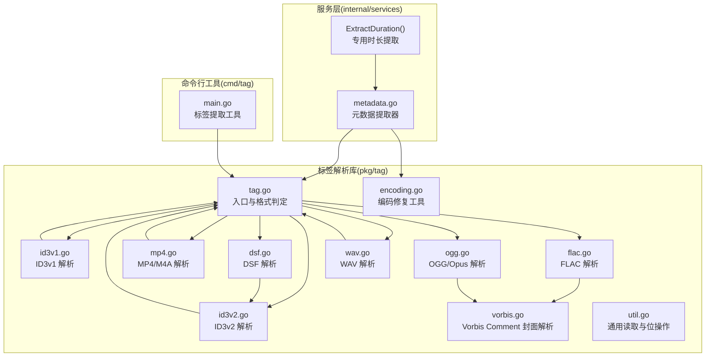
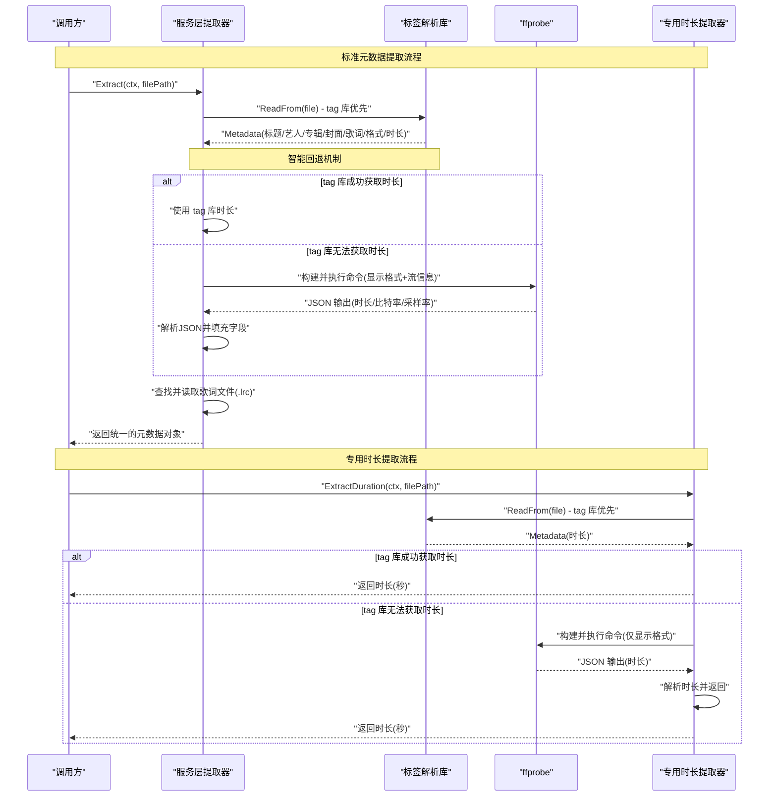
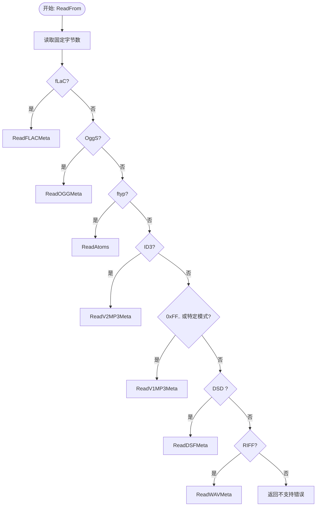
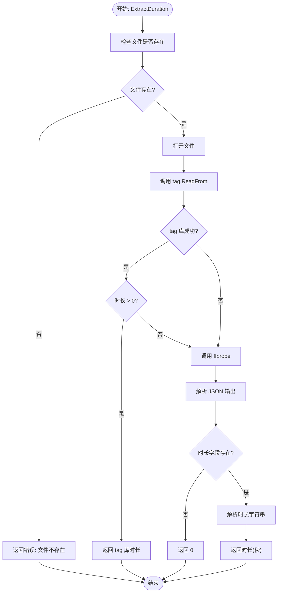
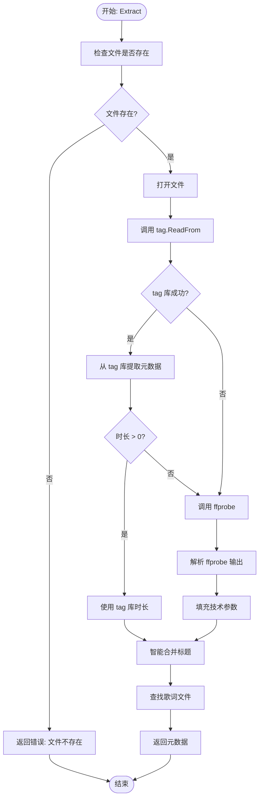
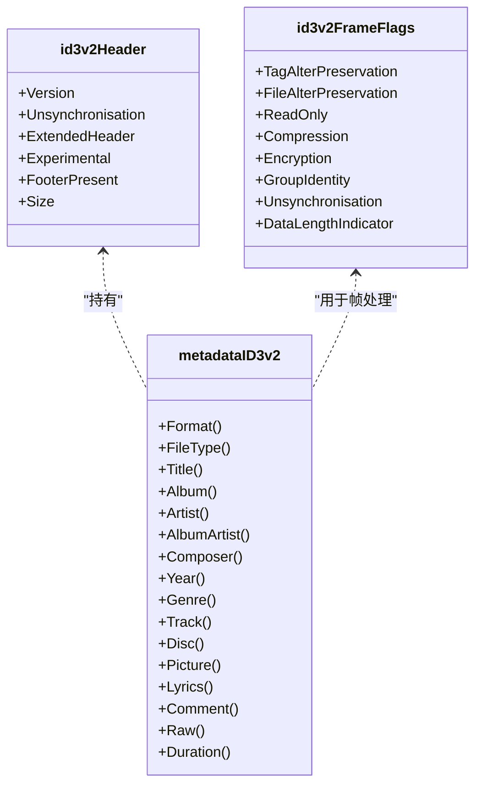
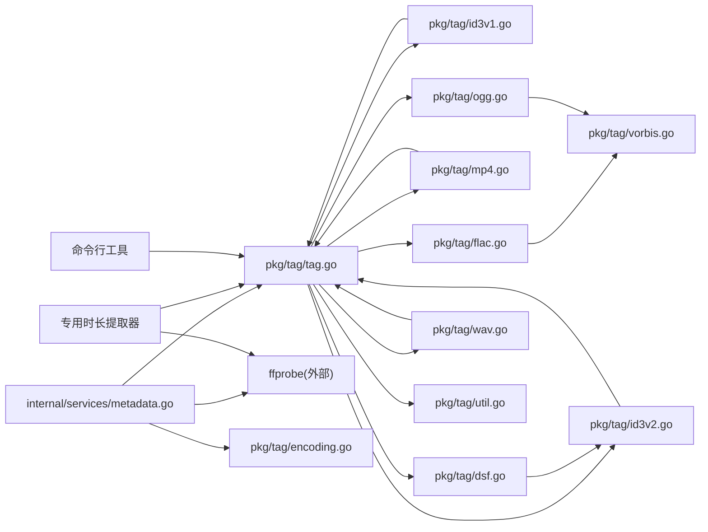

# 元数据提取

<cite>
**本文引用的文件**
- [pkg/tag/tag.go](file://pkg/tag/tag.go)
- [internal/services/metadata.go](file://internal/services/metadata.go)
- [pkg/tag/id3v2.go](file://pkg/tag/id3v2.go)
- [pkg/tag/flac.go](file://pkg/tag/flac.go)
- [pkg/tag/mp4.go](file://pkg/tag/mp4.go)
- [pkg/tag/ogg.go](file://pkg/tag/ogg.go)
- [pkg/tag/vorbis.go](file://pkg/tag/vorbis.go)
- [pkg/tag/id3v1.go](file://pkg/tag/id3v1.go)
- [pkg/tag/util.go](file://pkg/tag/util.go)
- [pkg/tag/dsf.go](file://pkg/tag/dsf.go)
- [pkg/tag/wav.go](file://pkg/tag/wav.go)
- [pkg/tag/encoding.go](file://pkg/tag/encoding.go)
- [pkg/tag/tag_test.go](file://pkg/tag/tag_test.go)
- [internal/services/metadata_test.go](file://internal/services/metadata_test.go)
- [cmd/tag/main.go](file://cmd/tag/main.go)
</cite>

## 更新摘要
**变更内容**
- 采用 tag 库优先策略：元数据提取系统现在优先使用 tag 库进行标签解析，仅在必要时回退到 ffprobe
- 智能回退机制：当 tag 库无法获取时长信息时，自动回退到 ffprobe 进行补充
- 提升 FLAC 和 ID3v2 标签支持：通过改进的格式检测和解析逻辑，增强对 FLAC 和 ID3v2 标签的支持
- 新增 ExtractDuration 方法：提供专门的时长提取功能，支持 tag 库优先策略和智能回退
- 更新架构设计：重新设计元数据提取流程，强调 tag 库的主导作用和 ffprobe 的辅助作用

## 目录
1. [简介](#简介)
2. [项目结构](#项目结构)
3. [核心组件](#核心组件)
4. [架构总览](#架构总览)
5. [详细组件分析](#详细组件分析)
6. [依赖分析](#依赖分析)
7. [性能考量](#性能考量)
8. [故障排查指南](#故障排查指南)
9. [结论](#结论)
10. [附录](#附录)

## 简介
本技术文档围绕 MiMusic 的"元数据提取"能力展开，系统化说明多格式音频文件的标签解析机制、封面图片提取与存储、音频属性分析（采样率、比特率、声道数、时长）、以及元数据标准化处理（编码修复、格式统一、缺失数据填充）。文档同时提供可操作的流程图与时序图，并给出常见问题与最佳实践建议，帮助开发者快速理解并高效集成与优化。

**更新** 采用 tag 库优先策略，智能回退到 ffprobe，显著提升 FLAC 和 ID3v2 标签支持能力。

## 项目结构
元数据提取功能由三部分组成：
- 标签解析库（pkg/tag）：负责识别与解析各类音频容器的标签与封面，如 ID3v2/ID3v1、FLAC Vorbis Comment、MP4/M4A 等。
- 服务层（internal/services）：负责调用标签库与 ffprobe，补充技术参数（时长、比特率、采样率等），并完成封面落盘与歌词文件合并。
- 命令行工具（cmd/tag）：提供独立的标签提取工具，展示 tag 库的功能和输出格式。

**图表来源**
- [pkg/tag/tag.go:29-75](file://pkg/tag/tag.go#L29-L75)
- [pkg/tag/id3v2.go:428-447](file://pkg/tag/id3v2.go#L428-L447)
- [pkg/tag/flac.go:28-54](file://pkg/tag/flac.go#L28-L54)
- [pkg/tag/mp4.go:77-86](file://pkg/tag/mp4.go#L77-L86)
- [pkg/tag/ogg.go:138-183](file://pkg/tag/ogg.go#L138-L183)
- [pkg/tag/vorbis.go:24-71](file://pkg/tag/vorbis.go#L24-L71)
- [pkg/tag/id3v1.go:44-111](file://pkg/tag/id3v1.go#L44-L111)
- [pkg/tag/dsf.go:13-71](file://pkg/tag/dsf.go#L13-L71)
- [pkg/tag/wav.go:9-92](file://pkg/tag/wav.go#L9-L92)
- [pkg/tag/util.go:48-95](file://pkg/tag/util.go#L48-L95)
- [pkg/tag/encoding.go:16-42](file://pkg/tag/encoding.go#L16-L42)
- [internal/services/metadata.go:76-184](file://internal/services/metadata.go#L76-L184)
- [internal/services/metadata.go:186-212](file://internal/services/metadata.go#L186-L212)
- [cmd/tag/main.go:53-132](file://cmd/tag/main.go#L53-L132)

**章节来源**
- [pkg/tag/tag.go:29-75](file://pkg/tag/tag.go#L29-L75)
- [internal/services/metadata.go:69-74](file://internal/services/metadata.go#L69-L74)
- [cmd/tag/main.go:53-132](file://cmd/tag/main.go#L53-L132)

## 核心组件
- 元数据接口与格式枚举：定义统一的 Metadata 接口与 Format/FileType 枚举，确保不同格式解析结果的一致访问方式。
- 标签解析器：根据文件头特征选择具体解析器（ID3v2、ID3v1、FLAC、MP4、OGG、DSF、WAV），并返回统一的 Metadata 实现。
- 服务层提取器：**采用 tag 库优先策略**，优先使用标签库提取基础元数据与封面，仅在 tag 库无法获取时长时回退到 ffprobe 补齐技术参数（时长、比特率、采样率），并处理歌词文件与封面落盘。
- **专用时长提取器**：新增的 `ExtractDuration()` 方法，专门用于提取音频时长，支持 tag 库优先策略和智能回退到 ffprobe。
- 编码修复工具：针对中文乱码场景，尝试修复常见中文编码（GBK/GB18030/GB2312）误判为 UTF-8 的问题。
- 命令行工具：提供独立的标签提取功能，展示 tag 库的能力和输出格式。

**章节来源**
- [pkg/tag/tag.go:97-179](file://pkg/tag/tag.go#L97-L179)
- [internal/services/metadata.go:30-45](file://internal/services/metadata.go#L30-L45)
- [pkg/tag/encoding.go:16-42](file://pkg/tag/encoding.go#L16-L42)
- [internal/services/metadata.go:186-212](file://internal/services/metadata.go#L186-L212)
- [cmd/tag/main.go:53-132](file://cmd/tag/main.go#L53-L132)

## 架构总览
下图展示了从文件输入到最终元数据输出的关键流程，包括 tag 库优先策略和智能回退机制：

**图表来源**
- [internal/services/metadata.go:76-184](file://internal/services/metadata.go#L76-L184)
- [internal/services/metadata.go:186-212](file://internal/services/metadata.go#L186-L212)
- [pkg/tag/tag.go:29-75](file://pkg/tag/tag.go#L29-L75)

## 详细组件分析

### 标签解析入口与格式判定
- ReadFrom 根据文件头特征判断格式，优先级覆盖 FLAC、Ogg、MP4、ID3v2、ID3v1、DSF、WAV，并调用对应解析函数。
- 支持的格式与文件类型枚举统一对外暴露，便于上层逻辑识别与处理。

**图表来源**
- [pkg/tag/tag.go:32-75](file://pkg/tag/tag.go#L32-L75)

**章节来源**
- [pkg/tag/tag.go:29-75](file://pkg/tag/tag.go#L29-L75)

### 专用时长提取器
**新增功能** 专门用于提取音频时长的优化组件，提供更高的性能和更低的资源消耗。

- **ExtractDuration 方法**：专门提取音频文件时长（秒），支持 tag 库优先策略和智能回退
- **tag 库优先策略**：首先尝试使用 tag 库提取时长，失败时才回退到 ffprobe
- **绕过完整流程**：直接调用 ffprobe，仅获取时长信息，避免标签解析和封面处理
- **性能优化**：适用于只需要时长信息的场景，如批量扫描、进度计算等
- **错误处理**：包含文件存在性检查、ffprobe 调用失败处理、JSON 解析错误处理

**图表来源**
- [internal/services/metadata.go:186-212](file://internal/services/metadata.go#L186-L212)

**章节来源**
- [internal/services/metadata.go:186-212](file://internal/services/metadata.go#L186-L212)

### 服务层提取器（采用 tag 库优先策略）
**更新** 服务层提取器现在采用 tag 库优先策略，显著提升 FLAC 和 ID3v2 标签支持能力。

- **tag 库优先策略**：优先使用 tag 库提取所有元数据（标题、艺人、专辑、封面、歌词、格式、时长）
- **智能回退机制**：仅在 tag 库无法获取时长时，回退到 ffprobe 补充技术参数
- **增强的格式支持**：通过改进的格式检测和解析逻辑，提升对 FLAC 和 ID3v2 标签的支持
- **统一的元数据处理**：无论来自 tag 库还是 ffprobe，最终都返回统一的 Metadata 结构

**图表来源**
- [internal/services/metadata.go:76-184](file://internal/services/metadata.go#L76-L184)

**章节来源**
- [internal/services/metadata.go:76-184](file://internal/services/metadata.go#L76-L184)

### ID3v2 解析
- 读取 ID3v2 头部，支持版本 2.2/2.3/2.4，解析扩展头与帧标志。
- 支持多种帧类型（文本、URL、评论、歌词、封面等），并处理压缩、加密、数据长度指示等特性。
- Genre 数值映射扩展，支持 Winamp 扩展风格。

**图表来源**
- [pkg/tag/id3v2.go:57-137](file://pkg/tag/id3v2.go#L57-L137)
- [pkg/tag/id3v2.go:139-194](file://pkg/tag/id3v2.go#L139-L194)
- [pkg/tag/id3v2.go:428-447](file://pkg/tag/id3v2.go#L428-L447)

**章节来源**
- [pkg/tag/id3v2.go:428-447](file://pkg/tag/id3v2.go#L428-L447)

### ID3v1 解析
- 从文件末尾固定偏移处读取 ID3v1 标签，解析标题、艺人、专辑、年份、评论、曲目与流派。
- 仅提供有限字段，适合快速回退与兜底。

**章节来源**
- [pkg/tag/id3v1.go:44-111](file://pkg/tag/id3v1.go#L44-L111)

### FLAC 解析（含 Vorbis Comment 与封面）
- 逐块解析 fLaC，识别 stream_info（计算时长）、vorbis_comment（元数据）、picture（封面）。
- 通过 Vorbis Comment 的 metadata_block_picture 字段解析嵌入式封面。

**章节来源**
- [pkg/tag/flac.go:28-54](file://pkg/tag/flac.go#L28-L54)
- [pkg/tag/flac.go:93-112](file://pkg/tag/flac.go#L93-L112)
- [pkg/tag/vorbis.go:24-71](file://pkg/tag/vorbis.go#L24-L71)

### MP4/M4A 解析（原子结构）
- 递归解析 MP4 原子树，定位 meta/moov/ilst 等容器，读取关键标签（专辑、艺人、年份、标题、流派、作曲者、歌词、评论、封面等）。
- trkn/disk 特殊处理为"当前/总数"二元组；covr 自动识别 PNG/JPEG 并设置 MIME 类型。

**章节来源**
- [pkg/tag/mp4.go:77-86](file://pkg/tag/mp4.go#L77-L86)
- [pkg/tag/mp4.go:160-244](file://pkg/tag/mp4.go#L160-L244)
- [pkg/tag/mp4.go:306-405](file://pkg/tag/mp4.go#L306-L405)

### OGG/OggFLAC/Opus 解析
- Ogg 页面解复用，识别 vorbis/opus 标签页，提取 Vorbis Comment 与采样率。
- 对 Opus 特殊处理采样率为 48kHz；对 OggFLAC 通过 vorbis_comment 块解析元数据。

**章节来源**
- [pkg/tag/ogg.go:138-183](file://pkg/tag/ogg.go#L138-L183)
- [pkg/tag/ogg.go:199-209](file://pkg/tag/ogg.go#L199-L209)
- [pkg/tag/vorbis.go:24-71](file://pkg/tag/vorbis.go#L24-L71)

### DSF 解析（DSD）
- 读取 DSF 头部，解析采样率与样本数以计算时长；随后在指定偏移读取嵌入的 ID3v2 标签。

**章节来源**
- [pkg/tag/dsf.go:13-71](file://pkg/tag/dsf.go#L13-L71)

### WAV 解析
- 解析 RIFF/WAVE 结构，读取 fmt 数据块获取采样率、位深、声道数；结合 data 块计算时长。
- WAV 本身不包含标准元数据格式，Raw 中返回技术参数。

**章节来源**
- [pkg/tag/wav.go:9-92](file://pkg/tag/wav.go#L9-L92)
- [pkg/tag/wav.go:150-217](file://pkg/tag/wav.go#L150-L217)

### 封面提取与存储
- 服务层优先使用标签库提供的 Picture 数据；若存在，保存至分层目录（基于封面内容哈希），实现去重与稳定命名。
- 封面扩展名依据标签或自动推断（PNG/JPEG），默认 .jpg。

**章节来源**
- [internal/services/metadata.go:98-114](file://internal/services/metadata.go#L98-L114)
- [internal/services/metadata.go:186-235](file://internal/services/metadata.go#L186-L235)

### 歌词提取与合并
- 优先读取同名 .lrc 文件内容；若存在内嵌歌词（标签库已处理编码），则优先使用内嵌歌词。
- 合并策略：智能合并文件名与刮削标题，避免冗余与公共子串重复。

**章节来源**
- [internal/services/metadata.go:173-182](file://internal/services/metadata.go#L173-L182)
- [internal/services/metadata.go:308-367](file://internal/services/metadata.go#L308-L367)

### 技术参数补充（时长、比特率、采样率）
- **采用 tag 库优先策略**：优先使用 tag 库提取时长，仅在 tag 库无法获取时长时回退使用 ffprobe。
- 通过 ffprobe JSON 输出解析时长、比特率与音频流采样率；若标签库未提供格式信息，则回退使用 ffprobe 的 format_name。
- 整数与浮点解析均做边界校验与错误处理。
- **专用时长提取**：新增的 ExtractDuration 方法提供更高效的时长获取，支持 tag 库优先策略和智能回退。

**章节来源**
- [internal/services/metadata.go:122-171](file://internal/services/metadata.go#L122-L171)
- [internal/services/metadata.go:186-212](file://internal/services/metadata.go#L186-L212)
- [internal/services/metadata.go:280-306](file://internal/services/metadata.go#L280-L306)

### 编码修复（中文乱码）
- 优先判断是否为纯 ASCII；若为有效 UTF-8 且乱码特征不明显则直接返回。
- 若疑似乱码，尝试使用 GBK/GB18030/GB2312 解码，验证是否包含有效中文字符，成功则返回修复文本。

**章节来源**
- [pkg/tag/encoding.go:16-42](file://pkg/tag/encoding.go#L16-L42)
- [pkg/tag/encoding.go:103-129](file://pkg/tag/encoding.go#L103-L129)

### 命令行工具
**新增功能** 提供独立的标签提取工具，展示 tag 库的功能和输出格式。

- **独立功能**：不依赖服务层，直接使用 tag 库进行标签提取
- **JSON 输出**：提供标准化的 JSON 格式输出，包含文件信息、标签数据和封面信息
- **时长显示**：支持显示音频时长信息
- **临时文件**：将封面图片保存到临时文件，便于查看和验证

**章节来源**
- [cmd/tag/main.go:53-132](file://cmd/tag/main.go#L53-L132)

## 依赖分析
- 组件内聚：各格式解析器独立实现，通过统一的 Metadata 接口对外暴露一致能力。
- 组件耦合：服务层依赖标签库与 ffprobe；标签库内部通过 util 工具函数完成底层读取与位运算。
- 外部依赖：ffprobe 用于技术参数补充；golang.org/x/text/transform 用于编码修复。
- **依赖关系更新**：服务层现在优先依赖 tag 库，仅在必要时依赖 ffprobe，形成清晰的优先级层次。

**图表来源**
- [internal/services/metadata.go:69-74](file://internal/services/metadata.go#L69-L74)
- [pkg/tag/tag.go:18-23](file://pkg/tag/tag.go#L18-L23)
- [pkg/tag/util.go:48-95](file://pkg/tag/util.go#L48-L95)
- [cmd/tag/main.go:53-132](file://cmd/tag/main.go#L53-L132)

**章节来源**
- [internal/services/metadata.go:69-74](file://internal/services/metadata.go#L69-L74)
- [pkg/tag/tag.go:18-23](file://pkg/tag/tag.go#L18-L23)
- [cmd/tag/main.go:53-132](file://cmd/tag/main.go#L53-L132)

## 性能考量
- **tag 库优先策略**：优先使用 tag 库进行标签解析，减少外部进程调用次数，显著提升整体性能。
- **智能回退机制**：仅在 tag 库无法获取时长时才调用 ffprobe，避免不必要的外部进程开销。
- 读取策略：对于超大块读取采用缓冲复制，避免一次性分配过大内存；通用读取函数限制最大预分配大小。
- 时长计算：优先使用标签库解析（如 FLAC stream_info、MP4 mvhd、WAV 计算）减少外部进程开销；仅在必要时调用 ffprobe。
- **专用时长提取优化**：新增的 ExtractDuration 方法绕过完整元数据提取，仅调用 ffprobe 获取时长，显著提升性能。
- 封面去重：基于内容哈希分层存储，避免重复写入与目录膨胀。
- 编码修复：仅在疑似乱码时触发，避免不必要的解码尝试。

**章节来源**
- [pkg/tag/util.go:48-63](file://pkg/tag/util.go#L48-L63)
- [pkg/tag/flac.go:93-112](file://pkg/tag/flac.go#L93-L112)
- [pkg/tag/mp4.go:109-128](file://pkg/tag/mp4.go#L109-L128)
- [pkg/tag/wav.go:62-68](file://pkg/tag/wav.go#L62-L68)
- [internal/services/metadata.go:212-235](file://internal/services/metadata.go#L212-L235)
- [internal/services/metadata.go:186-212](file://internal/services/metadata.go#L186-L212)

## 故障排查指南
- **tag 库优先策略问题**：确认 tag 库是否正确安装和导入；检查文件头是否正确；检查 ReadFrom 分支条件与文件完整性。
- **智能回退失败**：检查 ffprobe 是否可用；验证路径配置与环境变量；服务层提供可用性检测方法。
- 乱码标题/艺人：启用编码修复工具；确保目标文本包含有效中文字符。
- 封面未保存：确认 HasCover 标志与 CoverData 是否存在；检查存储目录权限与路径配置。
- 歌词未合并：确认 .lrc 文件存在且与音频同名；检查歌词来源优先级。
- **专用时长提取失败**：检查文件路径、ffprobe 可用性、JSON 解析错误；确认音频文件格式支持。
- **格式支持问题**：检查 FLAC 和 ID3v2 标签的完整性；验证文件是否包含有效的元数据块。

**章节来源**
- [internal/services/metadata.go:261-265](file://internal/services/metadata.go#L261-L265)
- [pkg/tag/encoding.go:103-129](file://pkg/tag/encoding.go#L103-L129)
- [internal/services/metadata.go:186-210](file://internal/services/metadata.go#L186-L210)
- [internal/services/metadata.go:173-182](file://internal/services/metadata.go#L173-L182)
- [internal/services/metadata.go:186-212](file://internal/services/metadata.go#L186-L212)

## 结论
MiMusic 的元数据提取体系经过重大升级，采用 tag 库优先策略，结合智能回退机制，实现了对主流音频格式的统一解析与标准化输出。通过优先使用 tag 库进行标签解析，仅在必要时回退到 ffprobe，显著提升了 FLAC 和 ID3v2 标签的支持能力和整体性能。新增的专用时长提取功能进一步优化了性能，为只需要时长信息的场景提供了高效的解决方案。建议在生产环境中合理配置 ffprobe 路径、开启编码修复并利用分层存储降低 IO 压力。

## 附录

### 支持的音频格式与能力矩阵
- MP3：ID3v2（2.2/2.3/2.4）、ID3v1；封面、歌词、时长（ID3v2/DSF）、比特率（ffprobe）
- M4A/M4B/M4P/ALAC：MP4 原子结构；封面、歌词、时长（MP4 mvhd）
- FLAC：Vorbis Comment；封面（metadata_block_picture）、时长（stream_info）
- OGG/OggFLAC：Vorbis Comment；封面（metadata_block_picture）、时长（vorbis identification）
- Opus：Vorbis Comment；时长（固定 48kHz）、封面
- DSF：ID3v2（嵌入）；时长（DSF 头部）
- WAV：技术参数（采样率、位深、声道数、时长）；无标准元数据格式

**章节来源**
- [pkg/tag/tag.go:97-128](file://pkg/tag/tag.go#L97-L128)
- [pkg/tag/flac.go:93-112](file://pkg/tag/flac.go#L93-L112)
- [pkg/tag/mp4.go:109-128](file://pkg/tag/mp4.go#L109-L128)
- [pkg/tag/ogg.go:168-177](file://pkg/tag/ogg.go#L168-L177)
- [pkg/tag/dsf.go:50-55](file://pkg/tag/dsf.go#L50-L55)
- [pkg/tag/wav.go:150-217](file://pkg/tag/wav.go#L150-L217)

### 元数据标准化与缺失填充
- **tag 库优先策略**：优先使用 tag 库提供的标准化元数据，确保文本字段的正确性和一致性。
- 格式统一：统一返回结构体字段，缺失字段以零值或空字符串表示。
- 合并策略：文件名与刮削标题智能合并，避免冗余与公共子串重复。

**章节来源**
- [internal/services/metadata.go:308-367](file://internal/services/metadata.go#L308-L367)
- [pkg/tag/encoding.go:16-42](file://pkg/tag/encoding.go#L16-L42)

### 代码示例（路径指引）
- **采用 tag 库优先策略的元数据提取**：[internal/services/metadata.go:76-184](file://internal/services/metadata.go#L76-L184)
- **专用时长提取**：[internal/services/metadata.go:186-212](file://internal/services/metadata.go#L186-L212)
- **命令行标签提取工具**：[cmd/tag/main.go:53-132](file://cmd/tag/main.go#L53-L132)
- 读取 ID3v2 标签：[pkg/tag/id3v2.go:428-447](file://pkg/tag/id3v2.go#L428-L447)
- 读取 FLAC 元数据与封面：[pkg/tag/flac.go:28-54](file://pkg/tag/flac.go#L28-L54)
- 读取 MP4/M4A 标签与封面：[pkg/tag/mp4.go:77-86](file://pkg/tag/mp4.go#L77-L86)
- 读取 OGG/OggFLAC 标签：[pkg/tag/ogg.go:138-183](file://pkg/tag/ogg.go#L138-L183)
- 读取 DSF 标签与时长：[pkg/tag/dsf.go:13-71](file://pkg/tag/dsf.go#L13-L71)
- 读取 WAV 技术参数与时长：[pkg/tag/wav.go:9-92](file://pkg/tag/wav.go#L9-L92)
- 编码修复工具：[pkg/tag/encoding.go:16-42](file://pkg/tag/encoding.go#L16-L42)

### 测试参考
- 标签解析测试：[pkg/tag/tag_test.go:55-100](file://pkg/tag/tag_test.go#L55-L100)
- 服务层功能测试：[internal/services/metadata_test.go:194-211](file://internal/services/metadata_test.go#L194-L211)
- **专用时长提取测试**：[internal/services/metadata_test.go:23-50](file://internal/services/metadata_test.go#L23-L50)
- **命令行工具测试**：[cmd/tag/main.go:53-132](file://cmd/tag/main.go#L53-L132)