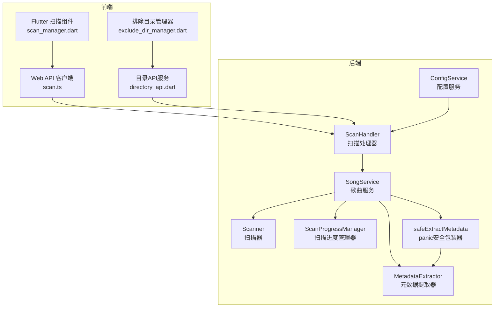
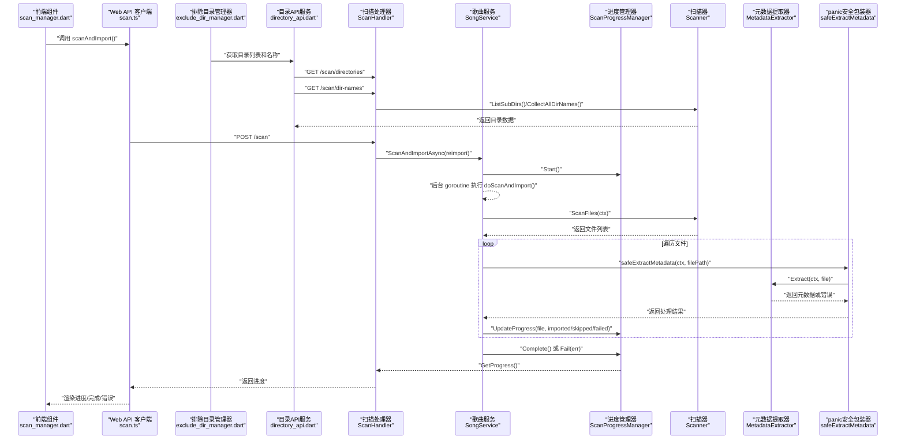
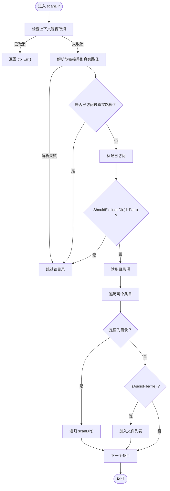
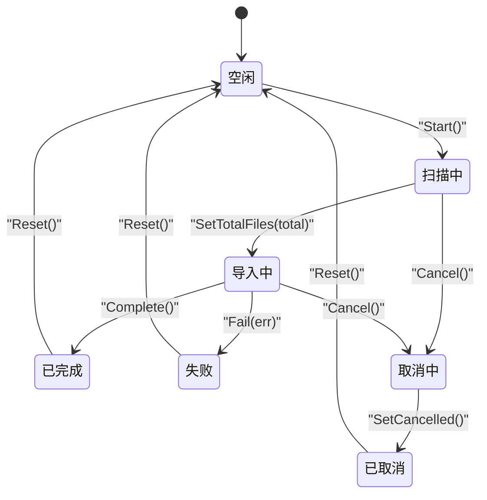
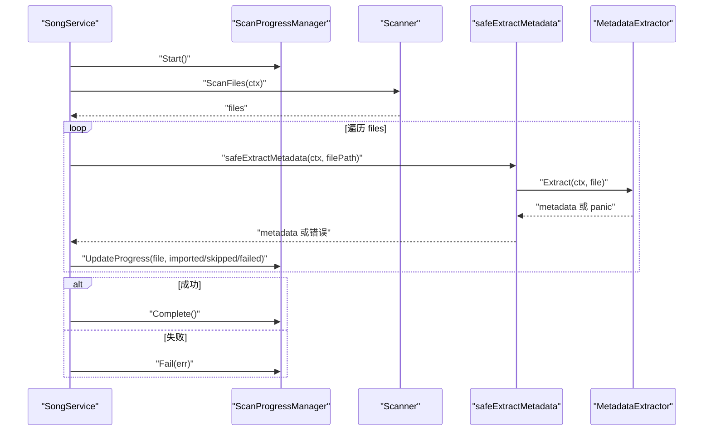
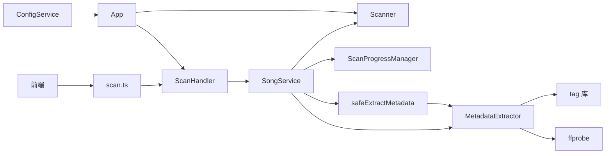

# 本地音乐扫描

<cite>
**本文引用的文件**
- [scanner.go](file://internal/services/scanner.go)
- [scan_progress.go](file://internal/services/scan_progress.go)
- [song_service.go](file://internal/services/song_service.go)
- [scan.go](file://internal/handlers/scan.go)
- [scan.ts](file://web/src/api/scan.ts)
- [scan_manager.dart](file://frontend/lib/features/settings/presentation/widgets/scan_manager.dart)
- [exclude_dir_manager.dart](file://frontend/lib/features/settings/presentation/widgets/exclude_dir_manager.dart)
- [directory_api.dart](file://frontend/lib/features/settings/data/directory_api.dart)
- [metadata.go](file://internal/services/metadata.go)
- [models.go](file://internal/models/models.go)
- [scan_test.go](file://internal/services/scanner_test.go)
- [scan_handler_test.go](file://internal/handlers/scan_test.go)
- [docs.go](file://docs/docs.go)
- [swagger.json](file://docs/swagger.json)
- [app.go](file://internal/app/app.go)
- [song_service_test.go](file://internal/services/song_service_test.go)
</cite>

## 更新摘要
**变更内容**
- 新增双模式目录排除功能（名称排除和路径排除）
- 增强扫描基础设施（目录列表和自动补全）
- 改进清理功能（详细统计信息）
- 新增目录树懒加载和自动补全功能
- 支持配置变更时的动态扫描器重建

## 目录
1. [简介](#简介)
2. [项目结构](#项目结构)
3. [核心组件](#核心组件)
4. [架构总览](#架构总览)
5. [详细组件分析](#详细组件分析)
6. [依赖关系分析](#依赖关系分析)
7. [性能考量](#性能考量)
8. [故障排除指南](#故障排除指南)
9. [结论](#结论)
10. [附录](#附录)

## 简介
本文件面向 MiMusic 的本地音乐扫描功能，系统性阐述扫描器的实现原理、目录遍历算法、软链接处理机制、文件过滤规则与扫描配置选项；同时覆盖扫描进度跟踪机制（状态管理、取消支持、错误处理）、扫描配置参数（音乐目录、排除目录、支持的音频格式）以及前端与后端的交互流程。文档还提供性能优化建议、常见问题排查与故障排除指南，并通过图示帮助读者理解代码结构与调用链路。

**更新** 本版本新增了双模式目录排除功能，支持按名称排除和按路径排除两种模式；增强了扫描基础设施，提供目录列表和自动补全功能；改进了清理功能，提供详细的统计信息。

## 项目结构
围绕"本地音乐扫描"的关键模块分布如下：
- 后端服务层
  - 扫描器：负责目录遍历、软链接处理、文件过滤和双模式排除
  - 扫描进度管理器：负责扫描状态、统计与取消通道
  - 歌曲服务：协调扫描与导入流程，持有扫描器与进度管理器
  - 元数据提取器：补充音频技术参数（时长、比特率、采样率等）
  - 处理器：对外暴露扫描、进度查询、取消等 API
  - 配置服务：管理音乐路径和排除配置
- 前端
  - Web API 客户端：封装扫描、进度查询、取消等接口
  - Flutter 组件：展示扫描进度、触发扫描与取消
  - 排除目录管理器：支持双模式排除配置（名称排除和路径排除）
  - 目录树组件：提供懒加载的目录浏览和自动补全

**图表来源**
- [scanner.go:18-31](file://internal/services/scanner.go#L18-L31)
- [scan_progress.go:44-58](file://internal/services/scan_progress.go#L44-L58)
- [song_service.go:16-32](file://internal/services/song_service.go#L16-L32)
- [metadata.go:25-30](file://internal/services/metadata.go#L25-L30)
- [scan.go:10-20](file://internal/handlers/scan.go#L10-L20)
- [song_service.go:537-547](file://internal/services/song_service.go#L537-L547)
- [app.go:253-312](file://internal/app/app.go#L253-L312)

**章节来源**
- [scanner.go:18-31](file://internal/services/scanner.go#L18-L31)
- [scan_progress.go:44-58](file://internal/services/scan_progress.go#L44-L58)
- [song_service.go:16-32](file://internal/services/song_service.go#L16-L32)
- [metadata.go:25-30](file://internal/services/metadata.go#L25-L30)
- [scan.go:10-20](file://internal/handlers/scan.go#L10-L20)
- [scan.ts:1-18](file://web/src/api/scan.ts#L1-L18)
- [scan_manager.dart:1-20](file://frontend/lib/features/settings/presentation/widgets/scan_manager.dart#L1-L20)
- [exclude_dir_manager.dart:1-20](file://frontend/lib/features/settings/presentation/widgets/exclude_dir_manager.dart#L1-L20)
- [directory_api.dart:70-119](file://frontend/lib/features/settings/data/directory_api.dart#L70-L119)

## 核心组件
- 扫描器（Scanner）
  - 负责目录遍历、软链接处理、文件过滤与双模式排除（名称排除和路径排除）
  - 支持目录懒加载和自动补全功能
- 扫描进度管理器（ScanProgressManager）
  - 管理扫描状态、统计信息、取消通道与错误信息
- 歌曲服务（SongService）
  - 协调扫描与导入流程，持有扫描器、进度管理器与元数据提取器
  - **新增** safeExtractMetadata 方法提供 panic-safe 元数据提取包装
  - **新增** CleanInvalidSongs 方法提供详细的清理统计
- 元数据提取器（MetadataExtractor）
  - 使用 tag 库与 ffprobe 提取标题、艺术家、专辑、封面、歌词、时长、比特率、采样率等
- 扫描处理器（ScanHandler）
  - 对外提供扫描、进度查询、取消的 HTTP 接口
  - **新增** ListDirectories 和 ListDirNames API 支持目录树懒加载和自动补全
- 配置服务（ConfigService）
  - **新增** 管理音乐路径和排除配置，支持动态配置变更
- 前端 API 客户端与组件
  - Web API 客户端封装扫描、进度查询、取消接口
  - Flutter 组件展示进度、触发扫描与取消
  - **新增** 排除目录管理器支持双模式排除配置
  - **新增** 目录树组件提供懒加载的目录浏览

**章节来源**
- [scanner.go:18-31](file://internal/services/scanner.go#L18-L31)
- [scan_progress.go:44-58](file://internal/services/scan_progress.go#L44-L58)
- [song_service.go:16-32](file://internal/services/song_service.go#L16-L32)
- [metadata.go:25-30](file://internal/services/metadata.go#L25-L30)
- [scan.go:10-20](file://internal/handlers/scan.go#L10-L20)
- [scan.ts:1-18](file://web/src/api/scan.ts#L1-L18)
- [scan_manager.dart:1-20](file://frontend/lib/features/settings/presentation/widgets/scan_manager.dart#L1-L20)
- [exclude_dir_manager.dart:12-19](file://frontend/lib/features/settings/presentation/widgets/exclude_dir_manager.dart#L12-L19)
- [directory_api.dart:70-119](file://frontend/lib/features/settings/data/directory_api.dart#L70-L119)

## 架构总览
下图展示了从前端发起扫描请求到后端执行扫描与导入的整体流程，以及进度状态的流转。**更新** 新增了双模式排除、目录懒加载和清理统计的完整流程。

**图表来源**
- [scan_manager.dart:31-48](file://frontend/lib/features/settings/presentation/widgets/scan_manager.dart#L31-L48)
- [scan.ts:4-17](file://web/src/api/scan.ts#L4-L17)
- [exclude_dir_manager.dart:438-664](file://frontend/lib/features/settings/presentation/widgets/exclude_dir_manager.dart#L438-L664)
- [directory_api.dart:76-119](file://frontend/lib/features/settings/data/directory_api.dart#L76-L119)
- [scan.go:39-72](file://internal/handlers/scan.go#L39-L72)
- [song_service.go:181-195](file://internal/services/song_service.go#L181-L195)
- [scan_progress.go:74-134](file://internal/services/scan_progress.go#L74-L134)
- [scanner.go:30-48](file://internal/services/scanner.go#L30-L48)
- [metadata.go:76-184](file://internal/services/metadata.go#L76-L184)
- [song_service.go:537-547](file://internal/services/song_service.go#L537-L547)

**章节来源**
- [scan_manager.dart:31-48](file://frontend/lib/features/settings/presentation/widgets/scan_manager.dart#L31-L48)
- [scan.ts:4-17](file://web/src/api/scan.ts#L4-L17)
- [exclude_dir_manager.dart:438-664](file://frontend/lib/features/settings/presentation/widgets/exclude_dir_manager.dart#L438-L664)
- [directory_api.dart:76-119](file://frontend/lib/features/settings/data/directory_api.dart#L76-L119)
- [scan.go:39-72](file://internal/handlers/scan.go#L39-L72)
- [song_service.go:181-195](file://internal/services/song_service.go#L181-L195)
- [scan_progress.go:74-134](file://internal/services/scan_progress.go#L74-L134)
- [scanner.go:30-48](file://internal/services/scanner.go#L30-L48)
- [metadata.go:76-184](file://internal/services/metadata.go#L76-L184)

## 详细组件分析

### 扫描器（Scanner）
- 目录遍历与软链接处理
  - 使用递归遍历，对每个目录先解析真实路径以处理软链接
  - 使用已访问真实路径集合避免循环软链接
  - 对于无法解析软链接的目标（如目标不存在），跳过该目录
- 文件过滤规则
  - 仅接受配置中列出的音频格式（忽略大小写）
  - 通过扩展名匹配进行过滤
- **新增** 双模式目录排除
  - **名称排除（ExcludeDirs）**：检查路径中任一目录段是否在排除列表中，若匹配则跳过该目录
  - **路径排除（ExcludePaths）**：检查目录路径是否以排除路径为前缀，若是则跳过该目录及其子目录
  - 支持混合模式：同时使用名称排除和路径排除规则
- 基础文件信息
  - 提供文件大小、修改时间、格式等基础信息
- **新增** 目录列表和自动补全
  - ListSubDirs：返回指定目录下的一级子目录列表，支持懒加载
  - CollectAllDirNames：递归收集音乐目录下所有唯一的目录名称，用于自动补全

**图表来源**
- [scanner.go:50-114](file://internal/services/scanner.go#L50-L114)
- [scanner.go:116-134](file://internal/services/scanner.go#L116-L134)
- [scanner.go:136-151](file://internal/services/scanner.go#L136-L151)
- [scanner.go:145-172](file://internal/services/scanner.go#L145-L172)

**章节来源**
- [scanner.go:30-48](file://internal/services/scanner.go#L30-L48)
- [scanner.go:50-114](file://internal/services/scanner.go#L50-L114)
- [scanner.go:116-134](file://internal/services/scanner.go#L116-L134)
- [scanner.go:136-151](file://internal/services/scanner.go#L136-L151)
- [scanner.go:145-172](file://internal/services/scanner.go#L145-L172)
- [scanner.go:187-240](file://internal/services/scanner.go#L187-L240)
- [scanner.go:242-309](file://internal/services/scanner.go#L242-L309)
- [scanner_test.go:60-103](file://internal/services/scanner_test.go#L60-L103)
- [scanner_test.go:295-326](file://internal/services/scanner_test.go#L295-L326)
- [scanner_test.go:328-363](file://internal/services/scanner_test.go#L328-L363)
- [scanner_test.go:397-426](file://internal/services/scanner_test.go#L397-L426)
- [scanner_test.go:428-456](file://internal/services/scanner_test.go#L428-L456)

### 扫描进度管理器（ScanProgressManager）
- 状态模型
  - 空闲、扫描中、导入中、已完成、失败、取消中、已取消
- 进度统计
  - 总文件数、已扫描、已导入、跳过、失败、当前文件、开始/结束时间、错误信息
- 取消机制
  - 提供取消通道，支持在扫描中阶段发送取消信号
  - 取消后关闭通道并设置状态为"已取消"
- 并发安全
  - 使用互斥锁保护状态变更

**图表来源**
- [scan_progress.go:8-19](file://internal/services/scan_progress.go#L8-L19)
- [scan_progress.go:74-134](file://internal/services/scan_progress.go#L74-L134)
- [scan_progress.go:156-186](file://internal/services/scan_progress.go#L156-L186)
- [scan_progress.go:195-208](file://internal/services/scan_progress.go#L195-L208)

**章节来源**
- [scan_progress.go:30-42](file://internal/services/scan_progress.go#L30-L42)
- [scan_progress.go:74-134](file://internal/services/scan_progress.go#L74-L134)
- [scan_progress.go:156-186](file://internal/services/scan_progress.go#L156-L186)
- [scan_progress.go:195-208](file://internal/services/scan_progress.go#L195-L208)

### 歌曲服务（SongService）
- 协调扫描与导入
  - 异步启动扫描：Start() -> 后台 goroutine -> doScanAndImport()
  - 提供进度查询与取消
- 导入流程要点
  - 通过 Scanner 获取文件列表
  - 使用 MetadataExtractor 提取元数据
  - 根据 reimport 模式决定跳过已存在或重新导入
  - 更新进度统计（导入/跳过/失败）
- **新增** panic-safe 元数据提取
  - safeExtractMetadata 方法使用 defer + recover 捕获 panic
  - 防止单个文件的异常崩溃影响整个扫描流程
  - 记录错误日志并返回可处理的错误
- **新增** 清理功能
  - CleanInvalidSongs 方法提供详细的清理统计
  - 支持清理文件不存在和位于排除目录中的歌曲
  - 提供 file_not_found 和 in_excluded_dir 详细统计

**图表来源**
- [song_service.go:181-195](file://internal/services/song_service.go#L181-L195)
- [scanner.go:30-48](file://internal/services/scanner.go#L30-L48)
- [metadata.go:76-184](file://internal/services/metadata.go#L76-L184)
- [scan_progress.go:101-117](file://internal/services/scan_progress.go#L101-L117)
- [song_service.go:537-547](file://internal/services/song_service.go#L537-L547)
- [song_service.go:565-619](file://internal/services/song_service.go#L565-L619)

**章节来源**
- [song_service.go:181-195](file://internal/services/song_service.go#L181-L195)
- [song_service.go:34-42](file://internal/services/song_service.go#L34-L42)
- [song_service.go:537-547](file://internal/services/song_service.go#L537-L547)
- [song_service.go:565-619](file://internal/services/song_service.go#L565-L619)

### 元数据提取器（MetadataExtractor）
- 优先使用 tag 库提取标题、艺术家、专辑、封面、歌词、格式
- 使用 ffprobe 补充精确的时长、比特率、采样率
- 支持从 .lrc 文件提取歌词
- 生成封面分层存储路径并保存封面

**章节来源**
- [metadata.go:76-184](file://internal/services/metadata.go#L76-L184)
- [metadata.go:186-200](file://internal/services/metadata.go#L186-L200)

### 扫描处理器（ScanHandler）与 API
- 提供四个接口
  - POST /scan：异步启动扫描（可传 reimport 参数）
  - GET /scan/progress：查询扫描进度
  - POST /scan/cancel：取消扫描
  - **新增** GET /scan/directories：获取子目录列表（支持懒加载）
  - **新增** GET /scan/dir-names：获取所有目录名称（用于自动补全）
- Swagger 文档中定义了状态枚举与响应结构

**章节来源**
- [scan.go:27-93](file://internal/handlers/scan.go#L27-L93)
- [scan.go:104-166](file://internal/handlers/scan.go#L104-L166)
- [docs.go:1639-1679](file://docs/docs.go#L1639-L1679)
- [swagger.json:1633-1679](file://docs/swagger.json#L1633-L1679)

### 前端交互（Web API 客户端与 Flutter 组件）
- Web API 客户端封装扫描、进度查询、取消接口
- Flutter 组件展示进度条、当前文件、统计信息，并支持取消与重试
- **新增** 排除目录管理器支持双模式排除配置
  - 名称排除：使用 Autocomplete 和 InputChip
  - 路径排除：使用目录树组件
- **新增** 目录树组件提供懒加载的目录浏览和自动补全

**章节来源**
- [scan.ts:4-17](file://web/src/api/scan.ts#L4-L17)
- [scan_manager.dart:117-277](file://frontend/lib/features/settings/presentation/widgets/scan_manager.dart#L117-L277)
- [exclude_dir_manager.dart:12-19](file://frontend/lib/features/settings/presentation/widgets/exclude_dir_manager.dart#L12-L19)
- [directory_api.dart:70-119](file://frontend/lib/features/settings/data/directory_api.dart#L70-L119)

### 配置服务与动态更新
- **新增** ConfigService 管理音乐路径和排除配置
- **新增** onMusicPathConfigChanged 回调函数
  - 监听 music_path 配置变更
  - 重建 Scanner（使用新的排除配置）
  - 触发清理排除目录中的歌曲
  - 异步执行清理并记录统计信息

**章节来源**
- [app.go:98-109](file://internal/app/app.go#L98-L109)
- [app.go:253-312](file://internal/app/app.go#L253-L312)

## 依赖关系分析
- 组件耦合
  - SongService 依赖 Scanner、MetadataExtractor、ScanProgressManager
  - ScanHandler 依赖 SongService、Scanner
  - 前端通过 API 客户端与后端交互
  - **新增** App 依赖 ConfigService 和 Scanner
- 外部依赖
  - tag 库用于读取音频标签与封面
  - ffprobe 用于提取精确音频技术参数
- 潜在风险
  - 若 ffprobe 不可用，元数据提取仍可工作（基于 tag 库），但缺少精确时长、比特率、采样率
  - 软链接可能导致重复扫描或死循环，已通过"解析真实路径+已访问集合"规避
  - **新增** 单个文件的异常不会导致整个扫描崩溃，通过 panic-safe 包装器提供容错保护
  - **新增** 配置变更时的动态扫描器重建确保排除规则的实时生效

**图表来源**
- [song_service.go:16-32](file://internal/services/song_service.go#L16-L32)
- [metadata.go:69-74](file://internal/services/metadata.go#L69-L74)
- [scan.go:10-20](file://internal/handlers/scan.go#L10-L20)
- [scan.ts:1-18](file://web/src/api/scan.ts#L1-L18)
- [song_service.go:537-547](file://internal/services/song_service.go#L537-L547)
- [app.go:253-312](file://internal/app/app.go#L253-L312)

**章节来源**
- [song_service.go:16-32](file://internal/services/song_service.go#L16-L32)
- [metadata.go:69-74](file://internal/services/metadata.go#L69-L74)
- [scan.go:10-20](file://internal/handlers/scan.go#L10-L20)
- [scan.ts:1-18](file://web/src/api/scan.ts#L1-L18)

## 性能考量
- 目录遍历
  - 使用"解析真实路径 + 已访问集合"避免循环软链接，复杂度近似 O(N)，N 为实际访问的节点数
  - 对每个目录项进行一次 Stat，避免不必要的 IO
  - **新增** 目录懒加载机制，只在需要时加载子目录
- 文件过滤
  - 通过扩展名快速过滤，避免对非音频文件进行昂贵的元数据解析
  - **新增** 双模式排除优化，减少不必要的目录遍历
- 并发与取消
  - 扫描在后台 goroutine 执行，避免阻塞 HTTP 请求
  - 上下文取消检查在关键节点（目录读取、文件处理）进行，确保及时响应
- 元数据提取
  - 优先使用 tag 库，减少外部进程开销
  - ffprobe 仅在必要时调用，且输出 JSON 解析成本可控
  - **新增** panic-safe 包装器提供容错保护，避免单个文件异常影响整体性能
- I/O 优化
  - 读取目录项时逐项处理，避免一次性加载所有文件
  - 封面保存采用分层目录，降低单目录文件过多导致的性能问题
  - **新增** 目录名称收集使用 map 去重，提高查找效率

**章节来源**
- [scanner.go:50-114](file://internal/services/scanner.go#L50-L114)
- [metadata.go:76-184](file://internal/services/metadata.go#L76-L184)
- [song_service.go:181-195](file://internal/services/song_service.go#L181-L195)
- [scanner.go:187-240](file://internal/services/scanner.go#L187-L240)
- [scanner.go:242-309](file://internal/services/scanner.go#L242-L309)

## 故障排除指南
- 扫描无法启动
  - 若扫描已在进行中，接口会返回冲突错误；等待当前扫描完成后重试
  - 确认鉴权头（BearerAuth）正确
- 扫描卡住或无响应
  - 检查音乐目录是否存在且可读
  - 检查是否存在大量软链接或深层嵌套目录导致遍历缓慢
  - 确认上下文未提前取消
- 扫描进度不更新
  - 确认前端轮询 /scan/progress 接口正常
  - 检查后端日志中是否有错误
- 元数据缺失
  - 若未安装 ffprobe，时长、比特率、采样率可能为空；安装后可获得更完整信息
  - 确认音频文件标签完整，封面与歌词文件存在
- 取消失败
  - 仅在"扫描中/导入中"状态可取消；否则返回错误
  - 取消后需重置进度方可再次扫描
- **新增** 排除配置问题
  - 检查排除目录配置是否正确
  - 确认名称排除和路径排除的组合逻辑符合预期
  - 配置变更后会自动重建扫描器并清理排除目录中的歌曲
- **新增** 目录懒加载问题
  - 检查 /scan/directories 接口是否正常返回
  - 确认目录树组件的懒加载逻辑
- **新增** 清理功能问题
  - 检查 /songs/clean 接口返回的详细统计信息
  - 确认清理操作是否按预期执行

**章节来源**
- [scan.go:39-58](file://internal/handlers/scan.go#L39-L58)
- [scan.go:84-93](file://internal/handlers/scan.go#L84-L93)
- [scan_progress.go:156-175](file://internal/services/scan_progress.go#L156-L175)
- [metadata.go:122-136](file://internal/services/metadata.go#L122-L136)
- [app.go:297-311](file://internal/app/app.go#L297-L311)

## 结论
MiMusic 的本地音乐扫描功能通过"扫描器 + 进度管理器 + 歌曲服务 + 元数据提取器"的分层设计，实现了稳定、可取消、可观测的扫描流程。其目录遍历算法兼顾性能与健壮性，软链接处理与排除目录策略满足多样化使用场景。**新增的双模式目录排除功能提供了更灵活的排除策略，支持按名称和按路径两种模式；增强的扫描基础设施提供了目录懒加载和自动补全功能；改进的清理功能提供了详细的统计信息。** 结合前端的进度展示与取消能力，用户可以高效地维护本地音乐库。

## 附录

### 扫描配置参数
- 音乐目录（MusicPath）
  - 扫描起始目录，必须存在且可读
- **新增** 排除目录（ExcludeDirs）
  - 目录名称列表，路径中任一目录段匹配即排除
- **新增** 排除路径（ExcludePaths）
  - 完整路径列表，目录路径以排除路径为前缀时排除
- 支持的音频格式（SupportedFormats）
  - 扩展名列表，不区分大小写

**章节来源**
- [scanner.go:11-18](file://internal/services/scanner.go#L11-L18)
- [scanner.go:116-134](file://internal/services/scanner.go#L116-L134)
- [scanner.go:136-151](file://internal/services/scanner.go#L136-L151)
- [app.go:98-109](file://internal/app/app.go#L98-L109)

### API 定义摘要
- POST /scan
  - 请求体：{ reimport: boolean }
  - 响应：扫描任务已启动
- GET /scan/progress
  - 响应：扫描进度信息（状态、统计、当前文件、时间戳、错误）
- POST /scan/cancel
  - 响应：扫描任务已取消
- **新增** GET /scan/directories
  - 查询参数：path（目录路径，为空时使用音乐根目录）
  - 响应：子目录列表和根目录信息
- **新增** GET /scan/dir-names
  - 响应：所有目录名称列表（用于自动补全）

**章节来源**
- [scan.go:27-93](file://internal/handlers/scan.go#L27-L93)
- [scan.go:104-166](file://internal/handlers/scan.go#L104-L166)
- [docs.go:1639-1679](file://docs/docs.go#L1639-L1679)
- [swagger.json:1633-1679](file://docs/swagger.json#L1633-L1679)

### 数据模型（与扫描相关）
- ScanProgress：状态、统计、时间、错误
- Song：歌曲结构（用于导入后的存储）
- Config：配置结构（用于存储音乐目录等配置）
- **新增** CleanResult：清理结果统计（total、file_not_found、in_excluded_dir）
- **新增** DirEntry：目录条目（name、path、has_children）

**章节来源**
- [scan_progress.go:30-42](file://internal/services/scan_progress.go#L30-L42)
- [models.go:64-85](file://internal/models/models.go#L64-L85)
- [models.go:199-205](file://internal/models/models.go#L199-L205)
- [song_service.go:565-570](file://internal/services/song_service.go#L565-L570)
- [scanner.go:20-25](file://internal/services/scanner.go#L20-L25)

### 代码示例（路径指引）
- 配置扫描器
  - [ScanConfig 定义:11-18](file://internal/services/scanner.go#L11-L18)
  - [NewScanner 创建:23-28](file://internal/services/scanner.go#L23-L28)
- 执行扫描
  - [ScanFiles 扫描文件:30-48](file://internal/services/scanner.go#L30-L48)
  - [doScanAndImport 导入流程:181-195](file://internal/services/song_service.go#L181-L195)
- 监控进度
  - [GetScanProgress 查询进度:34-37](file://internal/services/song_service.go#L34-L37)
  - [UpdateProgress 更新统计:101-117](file://internal/services/scan_progress.go#L101-L117)
- 取消扫描
  - [Cancel 取消:156-175](file://internal/services/scan_progress.go#L156-L175)
  - [SetCancelled 设置状态:177-186](file://internal/services/scan_progress.go#L177-L186)
- **新增** 目录懒加载
  - [ListSubDirs 实现:187-240](file://internal/services/scanner.go#L187-L240)
  - [ListDirectories 处理器:104-144](file://internal/handlers/scan.go#L104-L144)
- **新增** 自动补全
  - [CollectAllDirNames 实现:242-309](file://internal/services/scanner.go#L242-L309)
  - [ListDirNames 处理器:146-166](file://internal/handlers/scan.go#L146-L166)
- **新增** 清理功能
  - [CleanInvalidSongs 实现:572-619](file://internal/services/song_service.go#L572-L619)
  - [CleanResult 定义:565-570](file://internal/services/song_service.go#L565-L570)
- **新增** 配置变更处理
  - [onMusicPathConfigChanged 实现:253-312](file://internal/app/app.go#L253-L312)
- 前端调用
  - [scanAndImport:4-7](file://web/src/api/scan.ts#L4-L7)
  - [getScanProgress:9-12](file://web/src/api/scan.ts#L9-L12)
  - [cancelScan:14-17](file://web/src/api/scan.ts#L14-L17)
- **新增** panic-safe 包装器
  - [safeExtractMetadata 实现:537-547](file://internal/services/song_service.go#L537-L547)