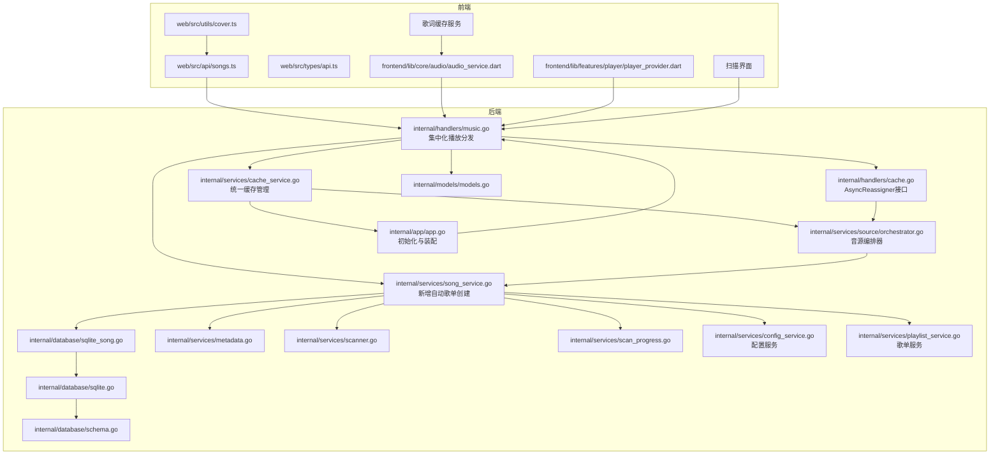
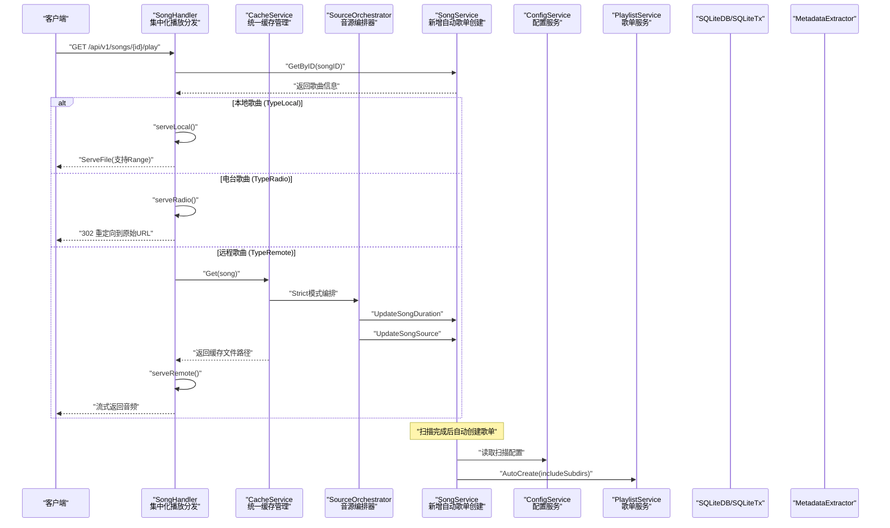
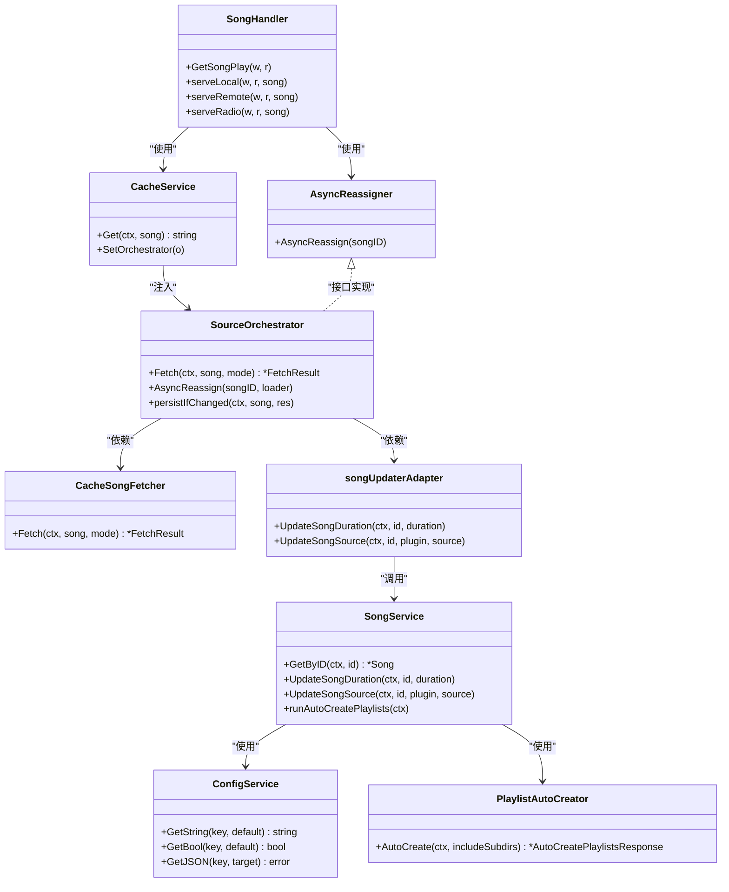

# 歌曲服务

<cite>
**本文引用的文件**
- [internal/handlers/music.go](file://internal/handlers/music.go)
- [internal/services/song_service.go](file://internal/services/song_service.go)
- [internal/services/cache_service.go](file://internal/services/cache_service.go)
- [internal/services/cache_service_song.go](file://internal/services/cache_service_song.go)
- [internal/services/source/orchestrator.go](file://internal/services/source/orchestrator.go)
- [internal/handlers/cache.go](file://internal/handlers/cache.go)
- [internal/app/app.go](file://internal/app/app.go)
- [frontend/lib/core/audio/audio_service.dart](file://frontend/lib/core/audio/audio_service.dart)
- [frontend/lib/features/player/presentation/providers/player_provider.dart](file://frontend/lib/features/player/presentation/providers/player_provider.dart)
- [internal/database/sqlite_song.go](file://internal/database/sqlite_song.go)
- [internal/database/schema.go](file://internal/database/schema.go)
- [internal/models/models.go](file://internal/models/models.go)
- [internal/services/metadata.go](file://internal/services/metadata.go)
- [internal/services/scanner.go](file://internal/services/scanner.go)
- [internal/database/sqlite.go](file://internal/database/sqlite.go)
- [internal/services/cache_service.go](file://internal/services/cache_service.go)
- [internal/app/app.go](file://internal/app/app.go)
- [internal/services/song_service_test.go](file://internal/services/song_service_test.go)
- [internal/database/database.go](file://internal/database/database.go)
- [plugins/mimusic-plugin-lxmusic/handlers/search.go](file://plugins/mimusic-plugin-lxmusic/handlers/search.go)
- [internal/services/scan_progress.go](file://internal/services/scan_progress.go)
- [internal/handlers/scan.go](file://internal/handlers/scan.go)
- [internal/services/config_service.go](file://internal/services/config_service.go)
- [internal/services/playlist_service.go](file://internal/services/playlist_service.go)
</cite>

## 更新摘要
**变更内容**
- 更新 SongService 构造函数签名，新增 configService 和 playlistAutoCreator 参数
- 新增 runAutoCreatePlaylists 方法用于处理自动歌单创建逻辑
- 新增 PlaylistAutoCreator 接口定义和依赖注入说明
- 更新扫描完成后自动创建歌单的流程说明
- 新增配置服务集成，支持按配置动态控制歌单创建行为

## 目录
1. [简介](#简介)
2. [项目结构](#项目结构)
3. [核心组件](#核心组件)
4. [架构总览](#架构总览)
5. [详细组件分析](#详细组件分析)
6. [依赖分析](#依赖分析)
7. [性能考量](#性能考量)
8. [故障排查指南](#故障排查指南)
9. [结论](#结论)
10. [附录](#附录)

## 简介
本文件面向 MiMusic 的"歌曲服务"能力，系统性阐述歌曲的 CRUD 操作、数据模型、搜索与过滤、批量操作、接口说明、数据验证与错误处理策略，并提供前端调用示例与最佳实践建议。读者无需深入 Go 或数据库知识，也能理解如何使用与扩展歌曲服务。

**更新** 新架构引入了集中化的歌曲播放逻辑，支持本地文件、远程插件源和电台流的智能分发，以及扫描后的自动歌单创建功能

## 项目结构
围绕歌曲服务的关键模块如下：
- 服务层：歌曲业务逻辑（增删改查、扫描导入、清理无效歌曲、批量添加网络歌曲等）
- 数据访问层：SQLite 数据库封装与歌曲表操作
- 模型层：歌曲数据结构与验证规则
- 处理器层：HTTP 接口路由与参数解析，**新增集中化播放分发逻辑**
- 元数据与扫描：音频文件扫描、元数据提取、封面保存
- 缓存服务：音乐文件缓存、下载完成回调与时长回填
- **音源编排器**：统一管理音源选择、故障转移和时长回填
- **异步切源器**：支持后台音源切换和故障转移
- **自动歌单创建器**：扫描完成后自动创建歌单
- 扫描管理：扫描进度跟踪、状态管理和错误报告
- 前端 API：歌曲接口调用封装与类型定义

**图表来源**
- [internal/handlers/music.go:20-41](file://internal/handlers/music.go#L20-L41)
- [internal/handlers/cache.go:19-22](file://internal/handlers/cache.go#L19-L22)
- [internal/services/song_service.go:16-32](file://internal/services/song_service.go#L16-L32)
- [internal/services/cache_service.go:48-60](file://internal/services/cache_service.go#L48-L60)
- [internal/services/source/orchestrator.go:46-72](file://internal/services/source/orchestrator.go#L46-L72)
- [internal/app/app.go:241-270](file://internal/app/app.go#L241-L270)

## 核心组件
- **歌曲处理器（SongHandler）**：**新增集中化播放分发**，统一处理本地文件、远程插件源和电台流的播放逻辑
- **音源编排器（SourceOrchestrator）**：**新增**，统一管理音源选择、故障转移和时长回填
- **异步切源器（AsyncReassigner）**：**新增**，支持后台音源切换和故障转移
- **缓存服务（CacheService）**：**增强**，统一管理音乐文件缓存、下载完成回调与时长回填集成
- **歌曲服务（SongService）**：**更新**，新增自动歌单创建功能，提供 CRUD、搜索、统计、扫描导入、批量删除、批量添加网络歌曲、批量添加电台、清理无效歌曲等能力
- **配置服务（ConfigService）**：**新增**，提供配置读取和缓存功能，支持扫描配置管理
- **自动歌单创建器（PlaylistAutoCreator）**：**新增**，扫描完成后自动创建歌单
- 扫描处理器（ScanHandler）：HTTP 层扫描接口，支持异步扫描、进度查询和取消操作
- 扫描进度管理器（ScanProgressManager）：跟踪扫描状态、进度统计和错误报告
- 数据库适配（SQLiteDB/SQLiteTx）：封装 SQLite 连接、事务、SQL 操作
- 元数据提取器（MetadataExtractor）：使用 tag 库与 ffprobe 提取音频元数据、封面与歌词
- 扫描器（Scanner）：遍历音乐目录、过滤音频文件、排除特定目录
- 模型与验证（models.Song/Validate）：统一的数据结构与输入校验
- 前端 API 封装（web/src/api/songs.ts）：对后端接口的调用封装与封面 URL 转换

**章节来源**
- [internal/handlers/music.go:20-41](file://internal/handlers/music.go#L20-L41)
- [internal/services/source/orchestrator.go:46-72](file://internal/services/source/orchestrator.go#L46-L72)
- [internal/handlers/cache.go:19-22](file://internal/handlers/cache.go#L19-L22)
- [internal/services/cache_service.go:48-60](file://internal/services/cache_service.go#L48-L60)
- [internal/services/song_service.go:16-32](file://internal/services/song_service.go#L16-L32)
- [internal/services/config_service.go:24-36](file://internal/services/config_service.go#L24-L36)

## 架构总览
**更新** 歌曲服务采用"集中化播放分发"的新架构，HTTP 请求经由 SongHandler 的统一播放分发逻辑处理，根据歌曲类型自动选择合适的播放源。新增的自动歌单创建功能在扫描完成后自动执行。

**图表来源**
- [internal/handlers/music.go:584-653](file://internal/handlers/music.go#L584-L653)
- [internal/services/cache_service.go:123-162](file://internal/services/cache_service.go#L123-L162)
- [internal/services/source/orchestrator.go:88-142](file://internal/services/source/orchestrator.go#L88-L142)
- [internal/services/song_service.go:407-423](file://internal/services/song_service.go#L407-L423)

## 详细组件分析

### 集中式歌曲播放分发（新增）
**更新** SongHandler 现在提供统一的播放分发逻辑，所有类型的歌曲播放都通过 `/api/v1/songs/{id}/play` 端点处理：

- **本地歌曲（TypeLocal）**：直接使用 `http.ServeFile()` 提供文件服务，支持 HTTP Range 请求，实现客户端 seek 功能
- **电台歌曲（TypeRadio）**：直接 302 重定向到原始直播流 URL，不进行缓存
- **远程歌曲（TypeRemote）**：通过 `CacheService.Get()` 统一处理，支持缓存命中和未命中两种情况

**章节来源**
- [internal/handlers/music.go:584-653](file://internal/handlers/music.go#L584-L653)

### 音源编排器（新增）
**更新** 新增的 SourceOrchestrator 提供统一的音源管理能力：

- **编排模式**：支持 `ModeStrict`（严格模式）和 `ModeFallback`（回退模式）
- **主源尝试**：优先尝试主音源和插件内自搜
- **回退机制**：当主源失败时，自动尝试其他候选音源
- **时长回填**：自动提取并回填音频时长信息
- **音源切换**：在音源切换时自动更新数据库记录

**章节来源**
- [internal/services/source/orchestrator.go:46-72](file://internal/services/source/orchestrator.go#L46-L72)
- [internal/services/source/orchestrator.go:88-142](file://internal/services/source/orchestrator.go#L88-L142)
- [internal/services/source/orchestrator.go:175-202](file://internal/services/source/orchestrator.go#L175-L202)

### 异步切源器（新增）
**更新** AsyncReassigner 接口提供后台音源切换能力：

- **后台切源**：在播放失败时，后台静默尝试其他音源
- **去重保护**：5分钟内同一歌曲ID的多次切源请求会被去重
- **接口抽象**：通过接口抽象避免 handlers 依赖 source 包

**章节来源**
- [internal/handlers/cache.go:19-22](file://internal/handlers/cache.go#L19-L22)

### 缓存服务集成（增强）
**更新** CacheService 现在与 SourceOrchestrator 深度集成：

- **统一入口**：所有缓存相关的操作都通过 CacheService.Get() 统一处理
- **并发去重**：通过 `songID` 索引的并发请求去重机制
- **编排器注入**：通过 `SetOrchestrator()` 注入 SourceOrchestrator
- **严格模式**：cache HTTP 路径使用严格模式，避免长回退阻塞

**章节来源**
- [internal/services/cache_service.go:48-60](file://internal/services/cache_service.go#L48-L60)
- [internal/services/cache_service.go:123-162](file://internal/services/cache_service.go#L123-L162)
- [internal/services/cache_service_song.go:21-25](file://internal/services/cache_service_song.go#L21-L25)

### 自动歌单创建功能（新增）
**更新** 新增的自动歌单创建功能在扫描完成后自动执行：

- **配置驱动**：通过 ConfigService 读取 `scan_auto_create_include_subdirs` 配置
- **自动创建**：调用 PlaylistAutoCreator.AutoCreate() 创建歌单
- **状态管理**：扫描进度管理器切换到 `creating_playlists` 阶段
- **容错处理**：创建失败仅记录日志，不影响扫描完成状态
- **依赖注入**：SongService 构造函数新增 playlistAutoCreator 参数

**章节来源**
- [internal/services/song_service.go:407-423](file://internal/services/song_service.go#L407-L423)
- [internal/services/song_service.go:302-305](file://internal/services/song_service.go#L302-L305)
- [internal/services/song_service.go:403-404](file://internal/services/song_service.go#L403-L404)

### 配置服务集成（新增）
**更新** ConfigService 提供统一的配置管理能力：

- **缓存机制**：使用 sync.Map 实现配置缓存，提升读取性能
- **类型转换**：支持 GetString、GetInt、GetBool、GetJSON 等类型转换
- **配置读取**：提供配置读取和解析功能
- **错误处理**：配置读取失败时使用默认值并记录警告日志

**章节来源**
- [internal/services/config_service.go:24-36](file://internal/services/config_service.go#L24-L36)
- [internal/services/config_service.go:38-90](file://internal/services/config_service.go#L38-L90)

### 歌词缓存服务（新增）
**更新** 新增歌词缓存服务，支持歌词的内存和文件缓存：

- **内存缓存**：使用 `_memoryCache` 存储最近使用的歌词
- **文件缓存**：在非 Web 平台使用文件系统缓存歌词
- **双层缓存**：同时提供内存和文件缓存，提升访问性能
- **缓存清理**：支持清理全部歌词缓存和获取缓存大小

**章节来源**
- [frontend/lib/core/storage/lyric_cache_service.dart:75-153](file://frontend/lib/core/storage/lyric_cache_service.dart#L75-L153)

### 前端播放器统一接口（更新）
**更新** 前端播放器现在使用统一的播放接口：

- **统一 URL**：所有类型歌曲统一使用 `song.url` 进行播放
- **自动分发**：后端自动根据 `song.type` 分发到合适的播放源
- **简化客户端**：客户端无需关心歌曲类型，直接使用统一的播放接口

**章节来源**
- [frontend/lib/core/audio/audio_service.dart:187-204](file://frontend/lib/core/audio/audio_service.dart#L187-L204)

### 歌曲数据模型与验证
- 数据模型：Song 结构体包含类型、标题、艺人、专辑、时长、文件路径/URL、封面路径/URL、歌词、歌词来源、文件大小、格式、比特率、采样率、是否直播、**缓存哈希**、创建/更新时间等字段
- 验证规则：
  - 标题必填
  - 类型必须为 local/remote/radio
  - local 类型必须提供文件路径
  - remote/radio 类型必须提供 URL
- 类型判断辅助：IsLocal/IsRadio
- 前端类型映射：SongType 常量与接口定义保持一致

**章节来源**
- [internal/models/models.go:64-122](file://internal/models/models.go#L64-L122)
- [internal/models/models.go:87-112](file://internal/models/models.go#L87-L112)

### CRUD 操作
- 创建（Create）：服务层先验证模型，再调用数据库插入，返回新 ID 与时间戳
- 查询（GetByID）：按 ID 查询，不存在返回错误
- 更新（Update）：服务层验证后调用数据库更新，返回影响行数
- 删除（Delete）：先查询以获取封面路径，删除记录并尝试删除封面文件
- 列表（List）：支持类型过滤、关键词模糊匹配、分页、排序
- 统计（Count）：按过滤条件统计总数

**章节来源**
- [internal/services/song_service.go:49-99](file://internal/services/song_service.go#L49-L99)
- [internal/database/sqlite_song.go:14-123](file://internal/database/sqlite_song.go#L14-L123)
- [internal/database/sqlite_song.go:125-221](file://internal/database/sqlite_song.go#L125-L221)

### 搜索与过滤机制
- 关键词搜索：在标题/艺人/专辑三列进行 LIKE 模糊匹配
- 条件筛选：按类型过滤
- **缓存哈希过滤**：新增 cache_hash 精确查询过滤，支持通过缓存哈希快速定位歌曲
- 结果排序：默认按 added_at 降序，支持自定义排序字段与方向
- 分页：支持 limit/offset 控制

**更新** 新增缓存哈希过滤功能，支持通过 cache_hash 精确查询歌曲

**章节来源**
- [internal/database/sqlite_song.go:125-196](file://internal/database/sqlite_song.go#L125-L196)
- [internal/handlers/music.go:57-116](file://internal/handlers/music.go#L57-L116)

### 批量操作
- 批量删除（BatchDelete）：先查询待删歌曲的封面路径，事务内删除歌单-歌曲关联与歌曲记录，最后删除封面文件
- 批量导入：扫描器扫描文件，元数据提取器并发提取，服务层流水线式批量写入数据库
- 批量添加网络歌曲（AddRemoteSongs）：支持批量添加网络歌曲，包含 URL、标题、艺术家、专辑、封面URL、时长、**歌词参数**、**缓存哈希**等参数
- 批量添加电台（AddRadios）：支持批量添加电台/广播，包含 URL、标题、封面URL

**更新** 批量添加网络歌曲接口支持歌词参数和缓存哈希，新增 UpsertRemoteSong 智能去重功能

**章节来源**
- [internal/services/song_service.go:101-135](file://internal/services/song_service.go#L101-L135)
- [internal/services/song_service.go:529-582](file://internal/services/song_service.go#L529-L582)
- [internal/handlers/music.go:289-420](file://internal/handlers/music.go#L289-L420)

### 智能去重功能（新增）
- UpsertRemoteSong 方法：当歌曲具有缓存哈希时使用 upsert 去重，无缓存哈希时直接插入
- 智能判断逻辑：根据 CacheHash 字段是否存在决定插入或更新策略
- 向后兼容：无缓存哈希的导入仍使用传统插入方式
- 条件更新：仅在目标字段为空或零值时才进行更新，避免覆盖已有数据

**新增** 新增基于 cache_hash 的智能去重功能，提升导入可靠性

**章节来源**
- [internal/database/sqlite_song.go:454-538](file://internal/database/sqlite_song.go#L454-L538)
- [internal/services/song_service.go:552-556](file://internal/services/song_service.go#L552-L556)

### 扫描与导入（异步）
- 异步扫描：启动扫描流程，后台执行，支持取消
- 预过滤：基于已存在本地歌曲路径快速跳过重复
- 并发提取：多 worker 并行提取元数据，提升 CPU/IO 利用率
- 批量写入：事务批量提交，减少磁盘 fsync 次数与 WAL 刷写开销
- 重新导入：支持覆盖已有歌曲的元数据与封面
- **错误日志记录**：在 flushScanBatch 方法中新增详细的错误日志记录，包括歌曲更新失败和创建失败的日志输出
- **自动歌单创建**：扫描完成后自动调用 runAutoCreatePlaylists 方法创建歌单

**更新** 新增了 flushScanBatch 方法中的错误日志记录，提升调试和故障排查能力，新增自动歌单创建功能

**章节来源**
- [internal/services/song_service.go:171-379](file://internal/services/song_service.go#L171-L379)
- [internal/services/song_service.go:381-471](file://internal/services/song_service.go#L381-L471)
- [internal/services/song_service.go:407-423](file://internal/services/song_service.go#L407-L423)
- [internal/services/metadata.go:76-184](file://internal/services/metadata.go#L76-L184)
- [internal/services/scanner.go:30-177](file://internal/services/scanner.go#L30-L177)

### 清理无效本地歌曲（增强）
- **CleanResult 结构体**：提供详细的清理统计信息，包括 file_not_found（文件不存在）、in_excluded_dir（排除目录中）和 total（总清理数）
- **增强清理逻辑**：遍历本地歌曲，检查文件是否存在，不存在则删除记录并清理封面文件；检查文件是否在排除目录中，是则删除记录
- **结构化返回**：CleanInvalidSongs 方法现在返回 CleanResult 结构体，包含详细的清理统计信息
- **错误处理**：清理过程中出现的错误会被记录并进行相应的回退处理

**更新** 新增 CleanResult 结构体和详细的清理统计信息，提供更精细的清理状态追踪

**章节来源**
- [internal/services/song_service.go:603-650](file://internal/services/song_service.go#L603-L650)
- [internal/handlers/music.go:491-516](file://internal/handlers/music.go#L491-L516)

### 网络歌曲服务增强（更新）
**更新** 网络歌曲播放现在通过集中化架构处理：

- **播放分发**：所有网络歌曲通过 `serveRemote()` 统一分发
- **缓存管理**：使用 `CacheService.Get()` 统一处理缓存命中和未命中
- **故障转移**：当缓存获取失败时，触发后台音源切换
- **时长回填**：通过 SourceOrchestrator 自动回填音频时长

**章节来源**
- [internal/handlers/music.go:633-653](file://internal/handlers/music.go#L633-L653)
- [internal/services/song_service.go:657-668](file://internal/services/song_service.go#L657-L668)

### HTTP 接口说明（更新）
**更新** 新增集中化播放分发相关的 HTTP 接口：

- **播放接口**：GET `/api/v1/songs/{id}/play`，**新增**统一播放分发端点
- **歌词接口**：GET `/api/v1/songs/{id}/lyric`，支持歌词来源分发
- **列表**：GET /songs，支持 type、keyword、**cache_hash**、limit、offset，返回 songs、total、limit、offset
- 详情：GET /songs/{id}
- 删除：DELETE /songs/{id}
- 批量删除：POST /songs/batch-delete，请求体包含 ids 数组
- 更新：PUT /songs/{id}，支持 title、artist、album、url、cover_url
- 添加网络歌曲：POST /songs/remote，请求体包含 url、title、artist、album、duration、cover_url、**cache_hash、lyric、lyric_source**
- 添加电台：POST /songs/radio，请求体包含 url、title、cover_url
- 获取封面：GET /songs/{id}/cover
- **清理无效歌曲**：POST /songs/clean，返回 CleanResult 结构体，包含 total、file_not_found、in_excluded_dir 字段
- **扫描管理**：POST /scan（异步扫描）、GET /scan/progress（获取进度）、POST /scan/cancel（取消扫描）
- **自动歌单创建**：POST /playlists/auto-create，支持 includeSubdirs 参数

**更新** 新增了统一的播放分发接口 `/api/v1/songs/{id}/play`，支持所有类型的歌曲播放，新增自动歌单创建接口

**章节来源**
- [internal/handlers/music.go:566-742](file://internal/handlers/music.go#L566-L742)
- [internal/handlers/music.go:57-116](file://internal/handlers/music.go#L57-L116)
- [internal/handlers/music.go:167-202](file://internal/handlers/music.go#L167-L202)
- [internal/handlers/music.go:289-420](file://internal/handlers/music.go#L289-L420)
- [internal/handlers/music.go:491-516](file://internal/handlers/music.go#L491-L516)
- [internal/handlers/scan.go:27-94](file://internal/handlers/scan.go#L27-L94)

### 前端调用示例（更新）
**更新** 前端播放器现在使用统一的播放接口：

- **播放接口**：`playSong(song, accessToken)`，**新增**所有类型歌曲统一使用
- 列表：listSongs({ limit, offset, type, **cache_hash** })
- 详情：getSong(id)
- 添加网络歌曲：addRemoteSong({ url, title, artist?, album?, duration?, cover_url?, **cache_hash, lyric, lyric_source** })
- 添加电台：addRadio({ url, title, cover_url? })
- 删除：deleteSong(id)
- 更新：updateSong(id, { title, artist?, album?, url, cover_url? })
- 清理：cleanInvalidSongs() -> 返回 { total, fileNotFound, inExcludedDir }
- **扫描管理**：startScan({ reimport }), getScanProgress(), cancelScan()
- **自动歌单创建**：createAutoPlaylists({ includeSubdirs })

**章节来源**
- [frontend/lib/core/audio/audio_service.dart:187-204](file://frontend/lib/core/audio/audio_service.dart#L187-L204)
- [frontend/lib/features/player/presentation/providers/player_provider.dart:550-994](file://frontend/lib/features/player/presentation/providers/player_provider.dart#L550-L994)

### 数据库表结构
- songs 表：主键 id、类型 type、标题 title、艺人 artist、专辑 album、时长 duration、文件路径 file_path、URL url、封面路径/URL cover_path/cover_url、歌词 lyric、歌词来源 lyric_source、文件大小 file_size、格式 format、比特率 bit_rate、采样率 sample_rate、是否直播 is_live、**缓存哈希 cache_hash**、时间戳 added_at/updated_at
- 索引：按 type/title/artist/added_at 建立索引，加速查询
- 触发器：更新时自动刷新 updated_at

**章节来源**
- [internal/database/schema.go:4-26](file://internal/database/schema.go#L4-L26)
- [internal/database/schema.go:89-103](file://internal/database/schema.go#L89-L103)
- [internal/database/schema.go:105-132](file://internal/database/schema.go#L105-L132)

### 元数据提取与封面存储
- 元数据来源：tag 库（基础标签、封面、内嵌歌词）、ffprobe（时长、比特率、采样率）
- 封面存储：基于封面内容哈希生成分层目录，避免单目录文件过多，相同封面自动去重
- 歌词来源：优先 .lrc 文件，其次内嵌歌词

**章节来源**
- [internal/services/metadata.go:76-184](file://internal/services/metadata.go#L76-L184)
- [internal/services/metadata.go:186-235](file://internal/services/metadata.go#L186-L235)
- [internal/services/metadata.go:237-259](file://internal/services/metadata.go#L237-L259)

### 扫描配置与文件过滤
- 支持目录、排除目录、音频格式白名单
- 递归扫描，解析软链接，防止循环

**章节来源**
- [internal/services/scanner.go:11-17](file://internal/services/scanner.go#L11-L17)
- [internal/services/scanner.go:30-177](file://internal/services/scanner.go#L30-L177)

### 前端封面URL转换
- 封面路径转换：将本地封面路径转换为可访问的URL，支持Base62编码和访问令牌
- 自动转换：在前端API层自动处理封面URL转换，提升用户体验
- 支持多种格式：支持 JPEG、PNG、GIF、BMP 等图片格式

**章节来源**
- [web/src/utils/cover.ts:1-17](file://web/src/utils/cover.ts#L1-L17)
- [web/src/api/songs.ts:12-19](file://web/src/api/songs.ts#L12-L19)

### 批量添加网络歌曲和电台功能（新增）
- RemoteSongInput 结构体：包含 URL、Title、Artist、Album、CoverURL、Duration、**CacheHash、Lyric、LyricSource** 字段，用于批量添加网络歌曲
- RadioInput 结构体：包含 URL、Title、CoverURL 字段，用于批量添加电台
- AddRemoteSongs 方法：批量创建网络歌曲，支持事务批量插入，提升性能
- AddRadios 方法：批量创建电台，设置 IsLive 为 true
- HTTP 接口：新增 /songs/remote 和 /songs/radio 接口，支持批量添加
- 数据验证：确保 URL 和标题必填，提供详细的错误信息

**新增** 新增批量添加网络歌曲和电台功能，完善了歌曲服务的批量操作能力

**章节来源**
- [internal/services/song_service.go:508-527](file://internal/services/song_service.go#L508-L527)
- [internal/services/song_service.go:529-582](file://internal/services/song_service.go#L529-L582)
- [internal/handlers/music.go:289-420](file://internal/handlers/music.go#L289-L420)

### 缓存服务与时长回填集成（更新）
**更新** 缓存服务现在与 SourceOrchestrator 深度集成：

- **下载完成回调**：CacheService 在音乐文件下载完成后触发回调函数
- **回调注册**：应用初始化时将 BackfillDuration 方法注册为下载完成回调
- **异步处理**：回调在独立 goroutine 中执行，不影响下载性能
- **完整流程**：下载完成 → 回调触发 → 查找歌曲 → 提取时长 → 更新数据库
- **编排器集成**：通过 SourceOrchestrator 内联调用 UpdateSongDuration

**章节来源**
- [internal/services/cache_service.go:62-65](file://internal/services/cache_service.go#L62-L65)
- [internal/services/cache_service.go:123-162](file://internal/services/cache_service.go#L123-L162)
- [internal/app/app.go:271-273](file://internal/app/app.go#L271-L273)

### URL歌词支持与缓存哈希过滤（更新）
**更新** 歌词获取现在通过集中化架构处理：

- **歌词来源枚举扩展**：新增歌词来源类型：url（URL延迟加载）、cached（从URL获取后缓存）
- **支持歌词内容或歌词获取URL两种模式**
- **与现有 file、embedded 类型并存**
- **缓存哈希过滤功能**：SongFilter 结构体新增 CacheHash 字段，数据库查询支持按 cache_hash 精确过滤
- **批量添加网络歌曲的歌词参数**：RemoteSongInput 结构体新增 Lyric 和 LyricSource 字段
- **歌词获取流程**：通过 cache_hash 查主程序数据库中的歌曲，支持延迟加载和缓存回写

**章节来源**
- [internal/models/models.go:21-27](file://internal/models/models.go#L21-L27)
- [internal/database/database.go:91-100](file://internal/database/database.go#L91-L100)
- [internal/database/sqlite_song.go:116-120](file://internal/database/sqlite_song.go#L116-L120)
- [internal/services/song_service.go:508-520](file://internal/services/song_service.go#L508-L520)
- [plugins/mimusic-plugin-lxmusic/handlers/search.go:408-494](file://plugins/mimusic-plugin-lxmusic/handlers/search.go#L408-L494)

### 扫描进度管理器（新增）
- **状态跟踪**：跟踪扫描状态（idle、scanning、importing、completed、failed、cancelling、cancelled）
- **进度统计**：记录总文件数、已扫描文件数、已导入文件数、跳过文件数、失败文件数
- **错误报告**：支持错误信息存储和报告
- **取消机制**：提供扫描取消功能和取消通道
- **实时更新**：支持并发安全的进度更新和查询

**新增** 新增完整的扫描进度管理功能，提供详细的扫描状态跟踪

**章节来源**
- [internal/services/scan_progress.go:1-209](file://internal/services/scan_progress.go#L1-L209)

### 扫描处理器（新增）
- **异步扫描**：POST /scan 接口启动异步扫描任务
- **进度查询**：GET /scan/progress 接口获取实时扫描进度
- **取消扫描**：POST /scan/cancel 接口取消正在进行的扫描任务
- **状态管理**：与扫描进度管理器协作，提供完整的扫描生命周期管理

**新增** 新增扫描处理器，提供完整的扫描管理接口

**章节来源**
- [internal/handlers/scan.go:1-94](file://internal/handlers/scan.go#L1-L94)

### flushScanBatch 方法错误日志记录（更新）
- **事务开始失败**：记录详细的错误信息，包括错误类型和受影响的文件路径
- **歌曲更新失败**：记录更新失败的歌曲信息和错误详情，便于定位具体问题
- **歌曲创建失败**：记录创建失败的歌曲信息和错误详情，支持批量操作的故障排查
- **封面保存失败**：记录封面保存失败的文件路径和错误详情
- **事务提交失败**：记录事务提交失败的错误信息
- **进度跟踪**：为每个失败的文件更新进度状态，确保用户界面的准确性

**更新** 新增了 flushScanBatch 方法中的详细错误日志记录，显著提升调试和故障排查能力

**章节来源**
- [internal/services/song_service.go:381-471](file://internal/services/song_service.go#L381-L471)

### SongService 构造函数更新（新增）
**更新** SongService 构造函数签名已更新，新增了两个重要参数：

- **configService**：配置服务依赖，用于读取扫描配置（如 `scan_auto_create_include_subdirs`）
- **playlistAutoCreator**：自动歌单创建器依赖，用于扫描完成后自动创建歌单

**更新** 新增的构造函数参数使 SongService 能够：
- 读取扫描配置并控制歌单创建行为
- 在扫描完成后自动调用自动歌单创建功能
- 提供更好的配置驱动的自动化能力

**章节来源**
- [internal/services/song_service.go:56-74](file://internal/services/song_service.go#L56-L74)
- [internal/app/app.go:179](file://internal/app/app.go#L179)

### runAutoCreatePlaylists 方法（新增）
**更新** 新增的 runAutoCreatePlaylists 方法实现了自动歌单创建的核心逻辑：

- **条件检查**：首先检查 playlistAutoCreator 是否为 nil，避免空指针调用
- **状态更新**：调用 scanProgressManager.BeginCreatingPlaylists() 切换到创建歌单阶段
- **配置读取**：通过 configService.GetBool() 读取 `scan_auto_create_include_subdirs` 配置
- **歌单创建**：调用 playlistAutoCreator.AutoCreate() 创建歌单，传入 includeSubdirs 参数
- **错误处理**：创建失败时仅记录警告日志，不影响扫描完成状态

**章节来源**
- [internal/services/song_service.go:407-423](file://internal/services/song_service.go#L407-L423)

### PlaylistAutoCreator 接口（新增）
**更新** 新增的 PlaylistAutoCreator 接口定义了自动歌单创建的能力：

- **AutoCreate 方法**：接收 includeSubdirs 布尔参数，返回 AutoCreatePlaylistsResponse 和 error
- **接口设计**：通过接口抽象避免 SongService 直接依赖具体实现
- **依赖注入**：通过构造函数注入，支持测试替身和不同实现

**章节来源**
- [internal/services/song_service.go:40-43](file://internal/services/song_service.go#L40-L43)

## 依赖分析
**更新** 新架构引入了新的依赖关系：

- **SongHandler 依赖**：SongService、CacheService、ConfigService、AsyncReassigner
- **AsyncReassigner 依赖**：SourceOrchestrator（通过接口抽象）
- **CacheService 依赖**：ConfigService、SourceOrchestrator（通过接口注入）
- **SourceOrchestrator 依赖**：SourceFetcher、SourceResolver、SongUpdater
- **SongService 依赖**：ConfigService、PlaylistAutoCreator（新增）
- **App 初始化**：装配 SourceOrchestrator、CacheService、ConvertService、PlaylistAutoCreator
- **前端依赖**：统一的播放接口，无需关心歌曲类型

**图表来源**
- [internal/handlers/music.go:20-41](file://internal/handlers/music.go#L20-L41)
- [internal/handlers/cache.go:19-22](file://internal/handlers/cache.go#L19-L22)
- [internal/services/cache_service.go:48-60](file://internal/services/cache_service.go#L48-L60)
- [internal/services/source/orchestrator.go:25-30](file://internal/services/source/orchestrator.go#L25-L30)
- [internal/services/source/orchestrator.go:144-173](file://internal/services/source/orchestrator.go#L144-L173)
- [internal/services/song_service.go:52-53](file://internal/services/song_service.go#L52-L53)

## 性能考量
**更新** 新架构的性能优化策略：

- **集中化播放分发**：统一的播放逻辑减少了分支判断开销
- **并发去重**：通过 `songID` 索引的并发请求去重，避免重复下载
- **严格模式**：cache HTTP 路径使用严格模式，避免长回退阻塞
- **异步切源**：后台静默尝试其他音源，不影响当前播放
- **编排队列**：SourceOrchestrator 使用队列管理候选音源，避免重复尝试
- **LRU 缓存**：缓存服务使用 LRU 算法管理缓存文件，提升命中率
- **内存歌词缓存**：前端歌词缓存服务提供内存缓存，减少网络请求
- **文件歌词缓存**：非 Web 平台使用文件系统缓存歌词，提升访问速度
- **配置缓存**：ConfigService 使用 sync.Map 缓存配置，提升读取性能
- **自动歌单创建**：扫描完成后异步创建歌单，不影响扫描性能

**更新** 新增了集中化播放分发和异步切源的性能优化策略，以及配置缓存和自动歌单创建的性能考量

**章节来源**
- [internal/handlers/music.go:584-653](file://internal/handlers/music.go#L584-L653)
- [internal/services/cache_service.go:123-162](file://internal/services/cache_service.go#L123-L162)
- [internal/services/source/orchestrator.go:144-173](file://internal/services/source/orchestrator.go#L144-L173)
- [frontend/lib/core/storage/lyric_cache_service.dart:75-153](file://frontend/lib/core/storage/lyric_cache_service.dart#L75-L153)
- [internal/services/config_service.go:25-29](file://internal/services/config_service.go#L25-L29)

## 故障排查指南
**更新** 新架构的故障排查指导：

- **播放失败**：检查 SongHandler 的播放分发逻辑，确认歌曲类型和 URL
- **缓存失败**：检查 CacheService 的缓存状态和 SourceOrchestrator 的编排结果
- **异步切源失败**：检查 AsyncReassigner 的去重机制和 SourceOrchestrator 的回退逻辑
- **音源切换失败**：检查 SourceOrchestrator 的候选音源配置和网络连接
- **歌词获取失败**：检查歌词缓存服务的状态和歌词来源配置
- **集中化播放分发异常**：检查路由配置和 SongHandler 的方法调用顺序
- **自动歌单创建失败**：检查 ConfigService 的配置读取和 PlaylistAutoCreator 的实现
- **配置服务异常**：检查 ConfigService 的缓存机制和配置读取逻辑

**更新** 新增了自动歌单创建和配置服务的故障排查指导

**章节来源**
- [internal/handlers/music.go:584-653](file://internal/handlers/music.go#L584-L653)
- [internal/services/cache_service.go:123-162](file://internal/services/cache_service.go#L123-L162)
- [internal/services/source/orchestrator.go:144-173](file://internal/services/source/orchestrator.go#L144-L173)
- [internal/services/song_service.go:407-423](file://internal/services/song_service.go#L407-L423)

## 结论
MiMusic 的歌曲服务通过引入**集中化播放分发**的新架构，显著提升了系统的可维护性和扩展性。新的 SongHandler 统一处理所有类型的歌曲播放，SourceOrchestrator 提供了强大的音源管理能力，AsyncReassigner 支持后台音源切换，CacheService 与编排队列深度集成，为用户提供稳定可靠的音乐播放体验。

**新增的集中化播放分发**通过统一的 `/api/v1/songs/{id}/play` 端点，实现了本地文件、远程插件源和电台流的智能分发。客户端无需关心歌曲类型，所有播放逻辑都在后端统一处理，大大简化了客户端实现。

**新增的音源编排器**提供了完整的音源管理解决方案，包括主源尝试、回退机制、时长回填和音源切换。通过严格模式和回退模式的组合，确保了播放的稳定性和可靠性。

**新增的异步切源器**支持后台音源切换，当播放失败时自动尝试其他音源，5分钟内的去重保护避免了重复尝试。这种设计既保证了用户体验，又避免了资源浪费。

**新增的自动歌单创建功能**在扫描完成后自动执行，通过 ConfigService 读取配置并调用 PlaylistAutoCreator 创建歌单。这一功能提升了用户的使用体验，减少了手动操作。

**新增的配置服务**提供了统一的配置管理能力，使用缓存机制提升了配置读取性能，支持多种数据类型的配置读取和转换。

建议在生产环境关注集中化播放分发的路由配置、音源编排器的候选音源设置、异步切源器的去重保护机制、歌词缓存服务的缓存策略、自动歌单创建的配置管理，以及配置服务的缓存机制，以确保最佳性能与稳定性。

## 附录

### 常见使用场景与最佳实践
**更新** 新增了集中化架构的最佳实践指导：

- **播放接口使用**：所有类型歌曲统一使用 `playSong(song, accessToken)` 接口
- **集中化播放分发**：通过 `/api/v1/songs/{id}/play` 端点处理所有类型的歌曲播放
- **音源管理**：利用 SourceOrchestrator 的编排队列和回退机制
- **异步切源**：利用 AsyncReassigner 的后台音源切换能力
- **缓存优化**：合理配置 CacheService 的缓存策略和淘汰机制
- **歌词缓存**：利用歌词缓存服务提升歌词获取性能
- **批量管理**：使用批量添加网络歌曲和电台功能
- **扫描管理**：使用扫描接口进行异步扫描，实时监控扫描进度
- **自动歌单创建**：配置扫描完成后自动创建歌单，提升用户体验
- **配置管理**：使用 ConfigService 管理各种配置，支持缓存和类型转换
- **错误排查**：利用集中化架构的日志记录快速定位问题

**更新** 新增了集中化播放分发、异步切源、自动歌单创建、配置管理的最佳实践指导

**章节来源**
- [internal/handlers/music.go:566-742](file://internal/handlers/music.go#L566-L742)
- [internal/services/source/orchestrator.go:144-173](file://internal/services/source/orchestrator.go#L144-L173)
- [frontend/lib/core/audio/audio_service.dart:187-204](file://frontend/lib/core/audio/audio_service.dart#L187-L204)
- [frontend/lib/core/storage/lyric_cache_service.dart:75-153](file://frontend/lib/core/storage/lyric_cache_service.dart#L75-L153)
- [internal/services/song_service.go:407-423](file://internal/services/song_service.go#L407-L423)
- [internal/services/config_service.go:38-90](file://internal/services/config_service.go#L38-L90)