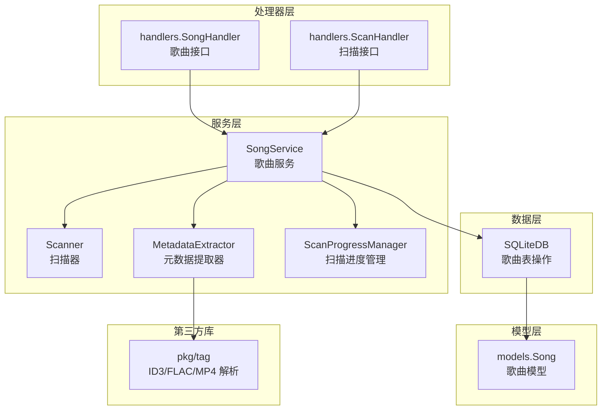
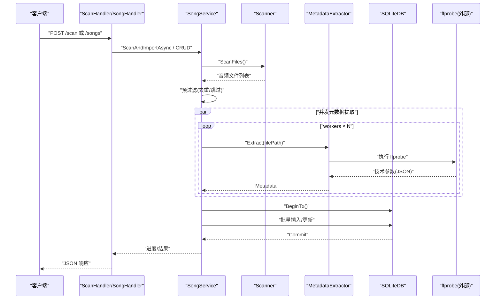
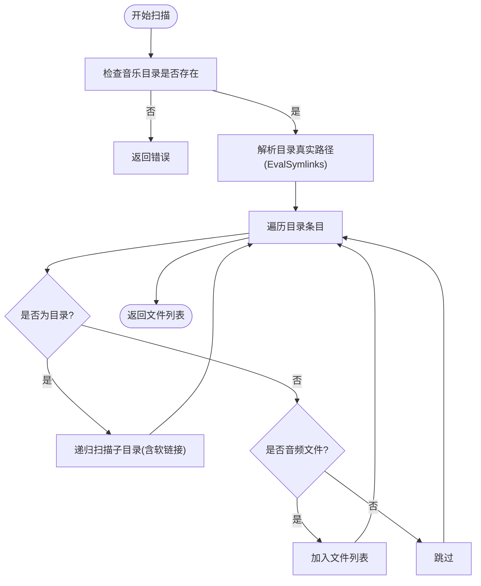
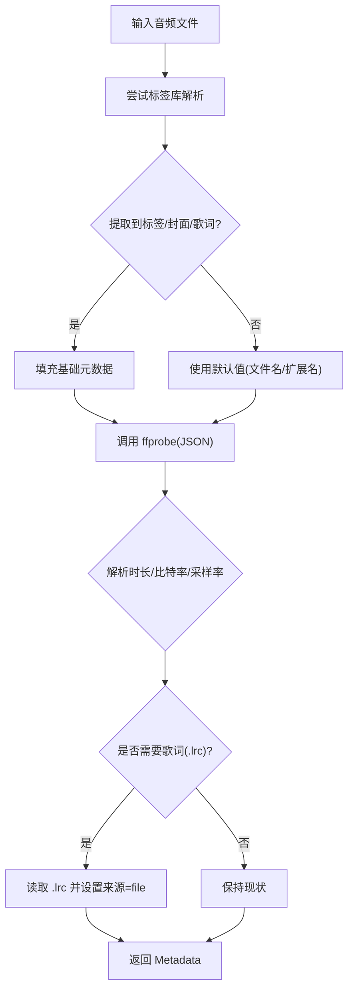
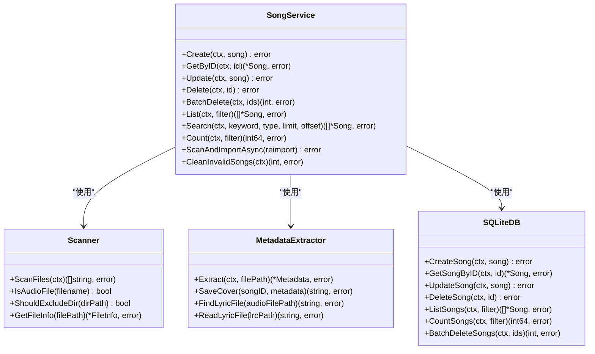
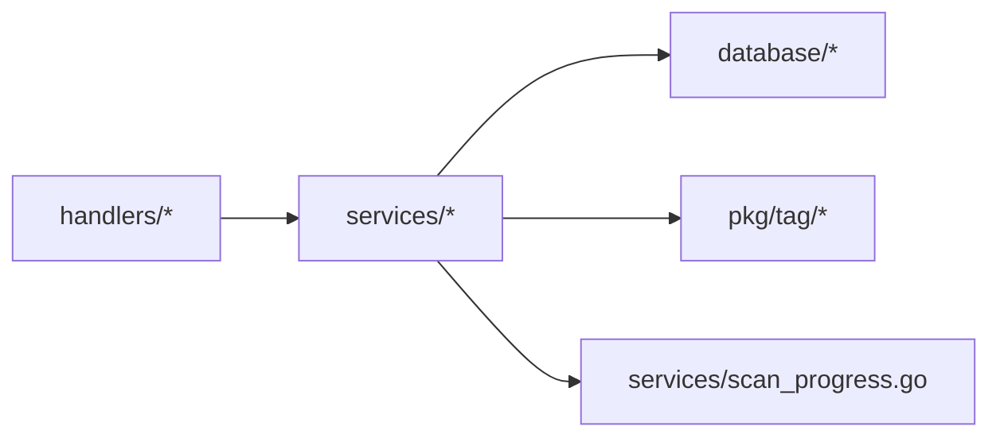

# 音乐管理功能

<cite>
**本文引用的文件**
- [scanner.go](file://internal/services/scanner.go)
- [metadata.go](file://internal/services/metadata.go)
- [song_service.go](file://internal/services/song_service.go)
- [scan_progress.go](file://internal/services/scan_progress.go)
- [music.go](file://internal/handlers/music.go)
- [scan.go](file://internal/handlers/scan.go)
- [sqlite_song.go](file://internal/database/sqlite_song.go)
- [models.go](file://internal/models/models.go)
- [tag.go](file://pkg/tag/tag.go)
- [flac.go](file://pkg/tag/flac.go)
- [mp4.go](file://pkg/tag/mp4.go)
- [scanner_test.go](file://internal/services/scanner_test.go)
- [metadata_test.go](file://internal/services/metadata_test.go)
</cite>

## 目录
1. [简介](#简介)
2. [项目结构](#项目结构)
3. [核心组件](#核心组件)
4. [架构总览](#架构总览)
5. [详细组件分析](#详细组件分析)
6. [依赖分析](#依赖分析)
7. [性能考虑](#性能考虑)
8. [故障排查指南](#故障排查指南)
9. [结论](#结论)
10. [附录](#附录)

## 简介
本文件面向 MiMusic 的音乐管理功能，系统化阐述本地音乐扫描机制、元数据提取流程、音频文件信息获取与歌曲服务的 CRUD 操作。文档覆盖以下关键主题：
- 本地音乐扫描：目录遍历算法、软链接处理、文件过滤规则与扫描配置选项
- 元数据提取：ID3、FLAC、MP4 等多种音频格式的标签解析、封面提取与音频属性分析
- 音频文件信息：文件大小、修改时间、音频格式检测与文件完整性验证
- 歌曲服务 CRUD：歌曲添加、更新、删除与查询
- API 与 Handler：REST 接口、进度查询与取消
- 性能优化：并发提取、批量入库、事务与流水线
- 故障排查：常见问题定位与解决建议

## 项目结构
围绕音乐管理功能，核心代码分布在以下模块：
- 服务层：扫描器、元数据提取器、歌曲服务、扫描进度管理
- 数据层：SQLite 歌曲表操作
- 模型层：歌曲模型与验证
- 处理器层：HTTP 接口封装
- 第三方标签库：pkg/tag 提供 ID3、FLAC、MP4 等解析能力

图表来源
- [song_service.go:16-32](file://internal/services/song_service.go#L16-L32)
- [scanner.go:18-28](file://internal/services/scanner.go#L18-L28)
- [metadata.go:25-74](file://internal/services/metadata.go#L25-L74)
- [sqlite_song.go:14-44](file://internal/database/sqlite_song.go#L14-L44)
- [models.go:64-85](file://internal/models/models.go#L64-L85)
- [music.go:17-27](file://internal/handlers/music.go#L17-L27)
- [scan.go:10-20](file://internal/handlers/scan.go#L10-L20)
- [tag.go:29-75](file://pkg/tag/tag.go#L29-L75)

章节来源
- [song_service.go:16-32](file://internal/services/song_service.go#L16-L32)
- [scanner.go:18-28](file://internal/services/scanner.go#L18-L28)
- [metadata.go:25-74](file://internal/services/metadata.go#L25-L74)
- [sqlite_song.go:14-44](file://internal/database/sqlite_song.go#L14-L44)
- [models.go:64-85](file://internal/models/models.go#L64-L85)
- [music.go:17-27](file://internal/handlers/music.go#L17-L27)
- [scan.go:10-20](file://internal/handlers/scan.go#L10-L20)
- [tag.go:29-75](file://pkg/tag/tag.go#L29-L75)

## 核心组件
- 扫描器 Scanner：负责本地目录遍历、软链接解析与去环、目录排除、音频文件过滤与基础文件信息获取
- 元数据提取器 MetadataExtractor：优先使用第三方标签库解析标签与封面，再用 ffprobe 补充精确技术参数（时长、比特率、采样率），并支持 .lrc 歌词文件
- 歌曲服务 SongService：提供 CRUD、搜索、统计、扫描导入（异步）、批量删除、清理无效本地歌曲等
- 扫描进度管理 ScanProgressManager：统一管理扫描状态、进度与取消
- SQLite 歌曲表操作：提供创建、查询、更新、删除、批量删除与统计
- 歌曲模型 models.Song：定义歌曲字段与验证逻辑
- 处理器 handlers：封装 HTTP 接口，暴露歌曲与扫描相关 API

章节来源
- [scanner.go:11-177](file://internal/services/scanner.go#L11-L177)
- [metadata.go:19-416](file://internal/services/metadata.go#L19-L416)
- [song_service.go:16-552](file://internal/services/song_service.go#L16-L552)
- [scan_progress.go:8-209](file://internal/services/scan_progress.go#L8-L209)
- [sqlite_song.go:14-414](file://internal/database/sqlite_song.go#L14-L414)
- [models.go:64-112](file://internal/models/models.go#L64-L112)
- [music.go:17-450](file://internal/handlers/music.go#L17-L450)
- [scan.go:10-94](file://internal/handlers/scan.go#L10-L94)

## 架构总览
下图展示从 HTTP 请求到数据库写入的完整链路，以及并发与批处理优化：

图表来源
- [song_service.go:181-376](file://internal/services/song_service.go#L181-L376)
- [scanner.go:30-48](file://internal/services/scanner.go#L30-L48)
- [metadata.go:76-184](file://internal/services/metadata.go#L76-L184)
- [sqlite_song.go:223-253](file://internal/database/sqlite_song.go#L223-L253)
- [scan.go:27-58](file://internal/handlers/scan.go#L27-L58)
- [music.go:29-102](file://internal/handlers/music.go#L29-L102)

## 详细组件分析

### 本地音乐扫描机制
- 目录遍历算法
  - 使用递归遍历，支持软链接解析与循环检测（通过真实路径去重）
  - 对每个目录读取条目，区分文件与目录，递归进入子目录
- 软链接处理
  - 使用真实路径解析，避免循环软链接导致的无限递归
  - 跟随软链接读取文件信息，若目标不可达则跳过
- 文件过滤规则
  - 仅匹配配置中声明的音频格式扩展名（大小写不敏感）
  - 支持隐藏文件（以点开头的扩展名）
- 扫描配置选项
  - 音乐目录路径、排除目录名称列表、支持的音频格式列表
- 文件信息获取
  - 基础信息：文件名、大小、修改时间、格式（不含点号的扩展名）

图表来源
- [scanner.go:30-114](file://internal/services/scanner.go#L30-L114)

章节来源
- [scanner.go:11-177](file://internal/services/scanner.go#L11-L177)
- [scanner_test.go:43-103](file://internal/services/scanner_test.go#L43-L103)

### 元数据提取功能
- 标签解析
  - 优先使用第三方标签库解析 ID3、FLAC、MP4、OGG 等格式的标签
  - 支持封面图片提取与歌词提取（内嵌与 .lrc 文件）
- 技术参数补充
  - 使用 ffprobe 获取精确时长、比特率、采样率
  - 若标签库未提供格式信息，则回退到 ffprobe 的 format_name
- 歌词来源
  - 优先从 .lrc 文件读取歌词，否则使用内嵌歌词
- 封面存储
  - 基于封面内容计算哈希，采用两级分层目录去重存储
  - 保存封面文件并返回绝对路径

图表来源
- [metadata.go:76-184](file://internal/services/metadata.go#L76-L184)
- [tag.go:29-75](file://pkg/tag/tag.go#L29-L75)
- [flac.go:30-54](file://pkg/tag/flac.go#L30-L54)
- [mp4.go:79-86](file://pkg/tag/mp4.go#L79-L86)

章节来源
- [metadata.go:19-416](file://internal/services/metadata.go#L19-L416)
- [tag.go:29-180](file://pkg/tag/tag.go#L29-L180)
- [flac.go:30-121](file://pkg/tag/flac.go#L30-L121)
- [mp4.go:79-406](file://pkg/tag/mp4.go#L79-L406)

### 音频文件信息获取
- 文件大小：通过扫描器的基础信息接口获取
- 修改时间：同上
- 音频格式检测：优先来自标签库，回退到 ffprobe
- 文件完整性验证：扫描阶段通过 Stat 与读取目录条目进行基础校验；导入阶段通过数据库写入与事务保证一致性

章节来源
- [scanner.go:153-167](file://internal/services/scanner.go#L153-L167)
- [metadata.go:165-171](file://internal/services/metadata.go#L165-L171)

### 歌曲服务 CRUD 操作
- 创建 Create：校验模型后写入数据库
- 查询 GetByID：按 ID 获取歌曲
- 更新 Update：校验模型后更新数据库
- 删除 Delete：先获取歌曲信息，删除数据库记录，再删除封面文件
- 批量删除 BatchDelete：获取封面路径，事务中删除歌单关联与歌曲记录
- 列表 List：支持类型过滤、关键词搜索、排序与分页
- 搜索 Search：关键词与类型组合过滤
- 统计 Count：按过滤条件统计数量
- 扫描导入 ScanAndImportAsync：异步执行扫描与导入，支持取消与进度上报
- 清理无效本地歌曲 CleanInvalidSongs：遍历本地歌曲，删除不存在的文件与封面

图表来源
- [song_service.go:44-552](file://internal/services/song_service.go#L44-L552)
- [scanner.go:30-177](file://internal/services/scanner.go#L30-L177)
- [metadata.go:76-210](file://internal/services/metadata.go#L76-L210)
- [sqlite_song.go:14-414](file://internal/database/sqlite_song.go#L14-L414)

章节来源
- [song_service.go:44-552](file://internal/services/song_service.go#L44-L552)
- [sqlite_song.go:14-414](file://internal/database/sqlite_song.go#L14-L414)
- [models.go:64-112](file://internal/models/models.go#L64-L112)

### API 与 Handler
- 歌曲接口
  - GET /songs：分页列出歌曲，支持类型过滤与关键词搜索
  - GET /songs/{id}：按 ID 获取歌曲
  - PUT /songs/{id}：更新歌曲（仅网络歌曲与电台）
  - DELETE /songs/{id}：删除歌曲
  - POST /songs/batch-delete：批量删除
  - POST /songs/remote：添加网络歌曲
  - POST /songs/radio：添加电台/广播
  - GET /songs/{id}/cover：获取封面图片
  - POST /songs/clean：清理不存在的本地歌曲
- 扫描接口
  - POST /scan：异步启动扫描导入
  - GET /scan/progress：获取扫描进度
  - POST /scan/cancel：取消扫描

章节来源
- [music.go:29-450](file://internal/handlers/music.go#L29-L450)
- [scan.go:27-94](file://internal/handlers/scan.go#L27-L94)

## 依赖分析
- 组件耦合
  - SongService 依赖 Scanner、MetadataExtractor、SQLiteDB、ScanProgressManager
  - Handlers 依赖 SongService
  - MetadataExtractor 依赖第三方标签库 pkg/tag
- 外部依赖
  - ffprobe：用于精确提取音频技术参数
  - SQLite：持久化歌曲与歌单关联
- 循环依赖
  - 未发现循环依赖

图表来源
- [song_service.go:16-32](file://internal/services/song_service.go#L16-L32)
- [music.go:17-27](file://internal/handlers/music.go#L17-L27)
- [scan.go:10-20](file://internal/handlers/scan.go#L10-L20)
- [metadata.go:69-74](file://internal/services/metadata.go#L69-L74)

章节来源
- [song_service.go:16-32](file://internal/services/song_service.go#L16-L32)
- [metadata.go:69-74](file://internal/services/metadata.go#L69-L74)

## 性能考虑
- 并发提取
  - 使用固定 worker 数（默认 4）并行提取元数据，充分利用 CPU 与 IO
- 流水线与批处理
  - 输入队列与结果队列缓冲，批量收集结果后一次性事务提交，降低磁盘 fsync 次数
- 预过滤
  - 导入前预加载本地歌曲路径，快速跳过已存在文件，减少无效处理
- 事务优化
  - 将多条写入合并到同一事务中，减少锁竞争与 WAL 刷写开销
- 封面去重
  - 基于内容哈希的分层目录存储，避免重复写入
- 上下文取消
  - 扫描过程支持取消，及时释放资源

章节来源
- [song_service.go:210-485](file://internal/services/song_service.go#L210-L485)
- [scan_progress.go:74-193](file://internal/services/scan_progress.go#L74-L193)

## 故障排查指南
- 扫描无法启动
  - 检查音乐目录是否存在与权限
  - 确认扫描状态不是“正在扫描”
- 扫描卡住或进度不更新
  - 检查是否触发了取消
  - 查看日志中进度更新与错误信息
- 元数据提取失败
  - 确认 ffprobe 可用且路径正确
  - 检查音频文件是否损坏或不受支持
- 封面未显示
  - 检查封面文件是否存在与缓存头设置
  - 确认封面路径与存储目录权限
- 数据库写入异常
  - 查看事务提交日志，确认批量写入是否成功
  - 检查磁盘空间与 SQLite 文件权限

章节来源
- [scan.go:74-94](file://internal/handlers/scan.go#L74-L94)
- [song_service.go:378-485](file://internal/services/song_service.go#L378-L485)
- [metadata.go:261-265](file://internal/services/metadata.go#L261-L265)
- [music.go:357-424](file://internal/handlers/music.go#L357-L424)

## 结论
MiMusic 的音乐管理功能通过清晰的服务分层与并发优化，实现了高效稳定的本地音乐扫描、元数据提取与歌曲管理。扫描器与元数据提取器分别承担目录遍历与标签解析职责，结合 SQLite 的事务批量写入，确保了大规模音乐库的导入性能与数据一致性。配合完善的 HTTP 接口与进度管理，用户可便捷地进行音乐库维护与管理。

## 附录

### 配置参数说明
- 扫描配置 ScanConfig
  - MusicPath：音乐目录路径
  - ExcludeDirs：排除的目录名称列表
  - SupportedFormats：支持的音频格式扩展名列表
- 元数据配置 MetadataConfig
  - FFProbePath：ffprobe 可执行文件路径
  - CoverStoragePath：封面存储根目录

章节来源
- [scanner.go:11-16](file://internal/services/scanner.go#L11-L16)
- [metadata.go:19-23](file://internal/services/metadata.go#L19-L23)

### 代码示例路径（不展示具体代码）
- 扫描器创建与扫描
  - [NewScanner:23-28](file://internal/services/scanner.go#L23-L28)
  - [ScanFiles:30-48](file://internal/services/scanner.go#L30-L48)
- 元数据提取
  - [NewMetadataExtractor:69-74](file://internal/services/metadata.go#L69-L74)
  - [Extract:76-184](file://internal/services/metadata.go#L76-L184)
- 歌曲服务 CRUD
  - [Create:44-57](file://internal/services/song_service.go#L44-L57)
  - [Update:69-82](file://internal/services/song_service.go#L69-L82)
  - [Delete:84-109](file://internal/services/song_service.go#L84-L109)
  - [List:147-155](file://internal/services/song_service.go#L147-L155)
  - [Search:157-169](file://internal/services/song_service.go#L157-L169)
  - [Count:171-179](file://internal/services/song_service.go#L171-L179)
- 扫描与进度
  - [ScanAndImportAsync:181-195](file://internal/services/song_service.go#L181-L195)
  - [GetScanProgress:34-37](file://internal/services/song_service.go#L34-L37)
  - [CancelScan:39-42](file://internal/services/song_service.go#L39-L42)
  - [ScanProgressManager:44-209](file://internal/services/scan_progress.go#L44-L209)
- 数据库操作
  - [CreateSong:14-44](file://internal/database/sqlite_song.go#L14-L44)
  - [UpdateSong:73-103](file://internal/database/sqlite_song.go#L73-L103)
  - [DeleteSong:105-123](file://internal/database/sqlite_song.go#L105-L123)
  - [ListSongs:125-196](file://internal/database/sqlite_song.go#L125-L196)
  - [CountSongs:198-221](file://internal/database/sqlite_song.go#L198-L221)
  - [BatchDeleteSongs:334-413](file://internal/database/sqlite_song.go#L334-L413)
- 模型与验证
  - [Song:64-85](file://internal/models/models.go#L64-L85)
  - [Validate:87-112](file://internal/models/models.go#L87-L112)