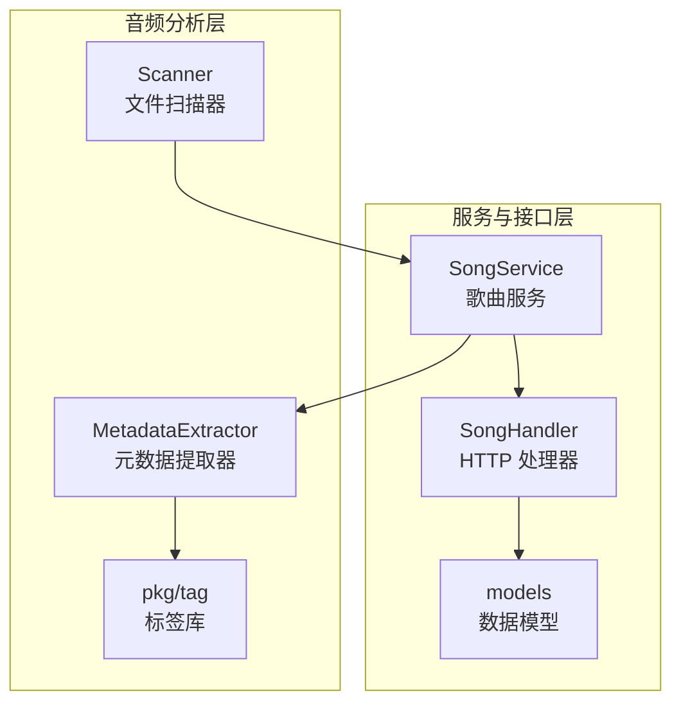
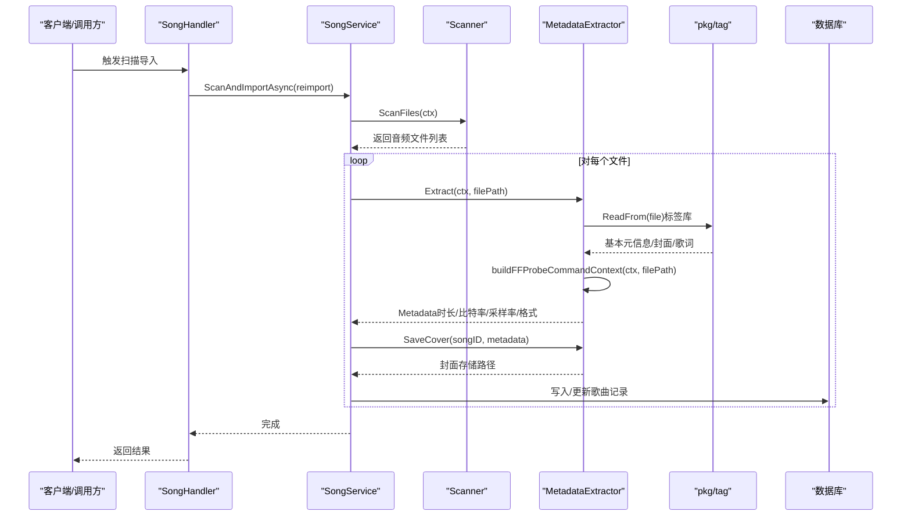
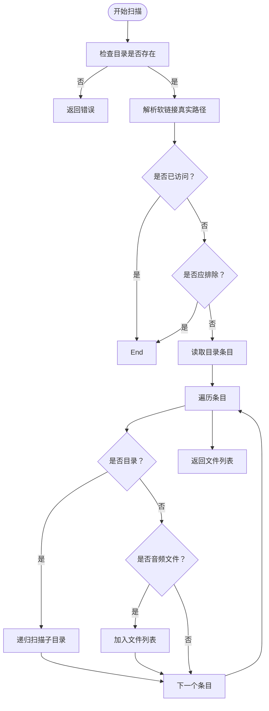
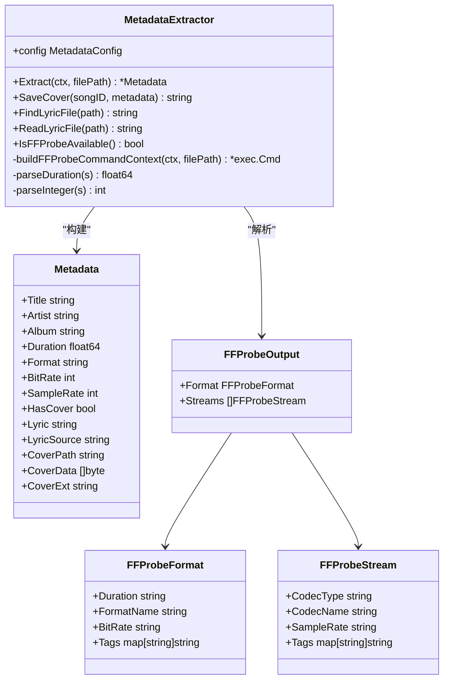
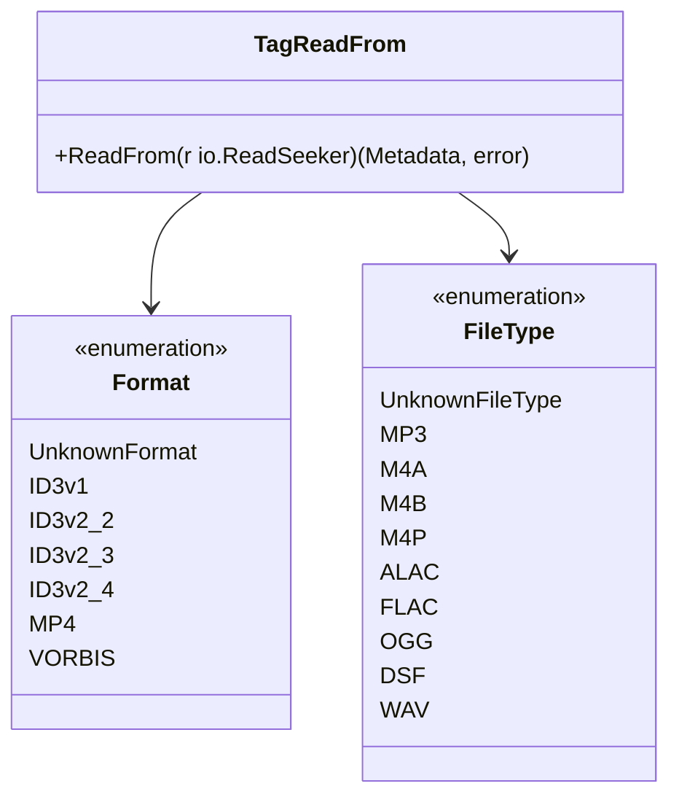
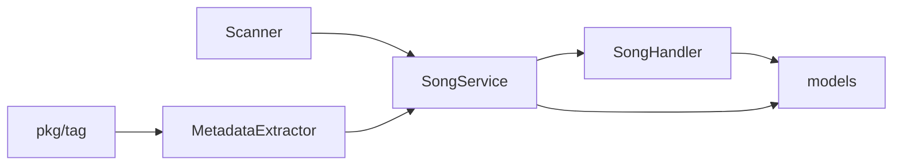

# 音频分析

<cite>
**本文引用的文件**
- [internal/services/metadata.go](file://internal/services/metadata.go)
- [pkg/tag/tag.go](file://pkg/tag/tag.go)
- [pkg/tag/mp3.go](file://pkg/tag/mp3.go)
- [pkg/tag/flac.go](file://pkg/tag/flac.go)
- [pkg/tag/ogg.go](file://pkg/tag/ogg.go)
- [pkg/tag/wav.go](file://pkg/tag/wav.go)
- [internal/services/scanner.go](file://internal/services/scanner.go)
- [internal/services/song_service.go](file://internal/services/song_service.go)
- [internal/handlers/music.go](file://internal/handlers/music.go)
- [internal/models/models.go](file://internal/models/models.go)
</cite>

## 目录
1. [简介](#简介)
2. [项目结构](#项目结构)
3. [核心组件](#核心组件)
4. [架构总览](#架构总览)
5. [详细组件分析](#详细组件分析)
6. [依赖关系分析](#依赖关系分析)
7. [性能考量](#性能考量)
8. [故障排查指南](#故障排查指南)
9. [结论](#结论)
10. [附录](#附录)

## 简介
本技术文档围绕 MiMusic 的音频分析能力展开，系统性说明音频文件的基本信息采集、属性检测、完整性验证、质量评估与性能优化策略。文档重点覆盖以下方面：
- 基本信息：文件大小、修改时间、音频格式识别
- 属性检测：采样率、比特率、声道、音频时长
- 完整性验证：文件头检查、损坏检测、无效文件过滤
- 质量评估：参数分析与质量等级判断
- 实践示例：如何获取元信息、验证完整性、优化分析性能
- 支持格式与精度说明

## 项目结构
MiMusic 的音频分析由“扫描器”“元数据提取器”“标签库”“服务层”“模型与接口”等模块协同完成。下图给出与音频分析相关的关键模块与交互关系。

**图表来源**
- [internal/services/scanner.go:18-134](file://internal/services/scanner.go#L18-L134)
- [internal/services/metadata.go:25-184](file://internal/services/metadata.go#L25-L184)
- [pkg/tag/tag.go:29-75](file://pkg/tag/tag.go#L29-L75)
- [internal/services/song_service.go:16-32](file://internal/services/song_service.go#L16-L32)
- [internal/handlers/music.go:17-27](file://internal/handlers/music.go#L17-L27)
- [internal/models/models.go:64-85](file://internal/models/models.go#L64-L85)

**章节来源**
- [internal/services/scanner.go:18-134](file://internal/services/scanner.go#L18-L134)
- [internal/services/metadata.go:25-184](file://internal/services/metadata.go#L25-L184)
- [pkg/tag/tag.go:29-75](file://pkg/tag/tag.go#L29-L75)
- [internal/services/song_service.go:16-32](file://internal/services/song_service.go#L16-L32)
- [internal/handlers/music.go:17-27](file://internal/handlers/music.go#L17-L27)
- [internal/models/models.go:64-85](file://internal/models/models.go#L64-L85)

## 核心组件
- 文件扫描器（Scanner）：遍历音乐目录，识别受支持的音频文件，提供基础文件信息（大小、修改时间、格式）。
- 元数据提取器（MetadataExtractor）：优先使用标签库读取基本元信息（标题、艺人、专辑、封面、歌词），再通过 ffprobe 补充精确的技术参数（时长、比特率、采样率），并保存封面。
- 标签库（pkg/tag）：内置对多种音频格式的头部识别与解析，支持 MP3、FLAC、OGG（含 Vorbis/Opus）、WAV、MP4/Atom 等。
- 歌曲服务（SongService）：协调扫描、提取与入库流程，并提供进度管理与清理能力。
- 数据模型（models）：统一的 Song 结构承载文件大小、格式、比特率、采样率、时长等字段。

**章节来源**
- [internal/services/scanner.go:116-177](file://internal/services/scanner.go#L116-L177)
- [internal/services/metadata.go:76-184](file://internal/services/metadata.go#L76-L184)
- [pkg/tag/tag.go:29-75](file://pkg/tag/tag.go#L29-L75)
- [internal/services/song_service.go:16-32](file://internal/services/song_service.go#L16-L32)
- [internal/models/models.go:64-85](file://internal/models/models.go#L64-L85)

## 架构总览
下图展示一次典型“扫描并导入本地音乐”的调用链路，涵盖文件发现、元数据提取、封面保存与入库。

**图表来源**
- [internal/handlers/music.go:180-202](file://internal/handlers/music.go#L180-L202)
- [internal/services/song_service.go:181-195](file://internal/services/song_service.go#L181-L195)
- [internal/services/scanner.go:30-48](file://internal/services/scanner.go#L30-L48)
- [internal/services/metadata.go:76-184](file://internal/services/metadata.go#L76-L184)
- [pkg/tag/tag.go:29-75](file://pkg/tag/tag.go#L29-L75)

## 详细组件分析

### 文件扫描与基本信息
- 功能职责
  - 递归扫描音乐目录，支持软链接与循环保护
  - 过滤受支持的音频格式
  - 提供 FileInfo（路径、名称、大小、修改时间、格式）
- 关键点
  - 使用 map 记录真实路径，避免循环软链接
  - 支持排除目录列表
  - 基于扩展名匹配格式，不依赖文件内容

**图表来源**
- [internal/services/scanner.go:30-114](file://internal/services/scanner.go#L30-L114)
- [internal/services/scanner.go:116-177](file://internal/services/scanner.go#L116-L177)

**章节来源**
- [internal/services/scanner.go:30-114](file://internal/services/scanner.go#L30-L114)
- [internal/services/scanner.go:116-177](file://internal/services/scanner.go#L116-L177)

### 元数据提取与属性检测
- 功能职责
  - 优先使用标签库提取标题、艺人、专辑、封面、歌词与格式
  - 使用 ffprobe 补充精确时长、比特率、采样率
  - 合并文件名与刮削标题，智能去重
  - 保存封面至分层目录，实现去重
- 关键点
  - 标签库支持 FLAC、OGG（Vorbis/Opus）、MP3（ID3v1/ID3v2）、WAV、MP4/Atom 等
  - ffprobe 命令行参数：json 输出、显示 format 与 streams
  - 解析时长、比特率、采样率时进行容错处理

**图表来源**
- [internal/services/metadata.go:25-184](file://internal/services/metadata.go#L25-L184)
- [internal/services/metadata.go:47-67](file://internal/services/metadata.go#L47-L67)

**章节来源**
- [internal/services/metadata.go:76-184](file://internal/services/metadata.go#L76-L184)
- [internal/services/metadata.go:25-46](file://internal/services/metadata.go#L25-L46)

### 标签库与格式支持
- 支持格式
  - MP3：ID3v1、ID3v2（v2.2/2.3/2.4）
  - MP4/Atom：常见移动设备音频容器
  - FLAC：无损压缩
  - OGG：Vorbis/Opus
  - WAV：PCM 基本格式
  - DSF：DSD Sony 格式
- 识别机制
  - 通过文件头部字节序列快速判定格式
  - 对特定格式解析帧头、块头、页头等，提取元信息与时长

**图表来源**
- [pkg/tag/tag.go:29-75](file://pkg/tag/tag.go#L29-L75)
- [pkg/tag/tag.go:97-128](file://pkg/tag/tag.go#L97-L128)

**章节来源**
- [pkg/tag/tag.go:29-75](file://pkg/tag/tag.go#L29-L75)
- [pkg/tag/tag.go:97-128](file://pkg/tag/tag.go#L97-L128)

### 具体格式解析要点
- MP3
  - 通过 ID3v2/ID3v1 头部与首个音频帧解析时长、采样率、比特率等
  - 依据版本/层查找查表计算帧长，估算总时长
- FLAC
  - 解析 StreamInfo 块获取采样率与样本数，推导时长
  - 支持封面块提取封面
- OGG（Vorbis/Opus）
  - Demux 页面，解析 Identification/Comment 块，提取采样率与元数据
  - Opus 固定采样率为 48kHz
- WAV
  - 解析 RIFF/WAVE 头与 fmt/data 块，计算时长（字节数/字节速率）

**章节来源**
- [pkg/tag/mp3.go:109-148](file://pkg/tag/mp3.go#L109-L148)
- [pkg/tag/flac.go:93-112](file://pkg/tag/flac.go#L93-L112)
- [pkg/tag/ogg.go:138-183](file://pkg/tag/ogg.go#L138-L183)
- [pkg/tag/wav.go:9-92](file://pkg/tag/wav.go#L9-L92)

### 封面保存与去重
- 采用封面内容的 SHA-256 哈希生成两级目录，避免单目录文件过多
- 相同封面仅保存一份，实现物理去重

**章节来源**
- [internal/services/metadata.go:186-235](file://internal/services/metadata.go#L186-L235)

### 歌曲服务与 HTTP 处理器
- 歌曲服务负责协调扫描、提取、入库与封面清理
- HTTP 处理器提供歌曲列表、详情、删除、批量删除、封面获取等接口

**章节来源**
- [internal/services/song_service.go:181-195](file://internal/services/song_service.go#L181-L195)
- [internal/handlers/music.go:29-102](file://internal/handlers/music.go#L29-L102)
- [internal/handlers/music.go:104-133](file://internal/handlers/music.go#L104-L133)
- [internal/handlers/music.go:135-165](file://internal/handlers/music.go#L135-L165)
- [internal/handlers/music.go:167-202](file://internal/handlers/music.go#L167-L202)
- [internal/handlers/music.go:357-424](file://internal/handlers/music.go#L357-L424)

## 依赖关系分析
- Scanner 依赖文件系统 API，用于遍历与统计文件信息
- MetadataExtractor 依赖标签库与外部工具 ffprobe
- SongService 协调 Scanner 与 MetadataExtractor，并与数据库交互
- Handler 作为对外接口，调用 SongService 并返回 JSON 响应
- models 为各层共享的数据契约

**图表来源**
- [internal/services/scanner.go:18-134](file://internal/services/scanner.go#L18-L134)
- [internal/services/metadata.go:25-184](file://internal/services/metadata.go#L25-L184)
- [internal/services/song_service.go:16-32](file://internal/services/song_service.go#L16-L32)
- [internal/handlers/music.go:17-27](file://internal/handlers/music.go#L17-L27)
- [internal/models/models.go:64-85](file://internal/models/models.go#L64-L85)

**章节来源**
- [internal/services/scanner.go:18-134](file://internal/services/scanner.go#L18-L134)
- [internal/services/metadata.go:25-184](file://internal/services/metadata.go#L25-L184)
- [internal/services/song_service.go:16-32](file://internal/services/song_service.go#L16-L32)
- [internal/handlers/music.go:17-27](file://internal/handlers/music.go#L17-L27)
- [internal/models/models.go:64-85](file://internal/models/models.go#L64-L85)

## 性能考量
- 并行化与并发控制
  - 扫描阶段可按目录分片并行处理，但需注意磁盘 IO 争用
  - 元数据提取阶段建议限制并发数，避免 ffprobe 进程过多导致资源竞争
- I/O 优化
  - 使用分层目录保存封面，减少单目录文件数量，提升文件系统性能
  - 仅在必要时读取封面二进制，避免不必要的内存占用
- 解析精度与代价
  - 标签库解析速度快，适合快速提取标题、艺人、专辑、封面与歌词
  - ffprobe 提供更精确的时长、比特率、采样率，但会引入外部进程开销
- 上下文与超时
  - 所有关键操作均使用 context 控制生命周期，便于中断与超时管理
- 分页与限流
  - HTTP 接口对分页参数进行限制，防止过大查询导致性能问题

[本节为通用性能指导，不直接分析具体文件，故无“章节来源”]

## 故障排查指南
- ffprobe 不可用
  - 现象：元数据提取时长、比特率、采样率缺失
  - 排查：确认 ffprobe 路径配置正确，且可执行
  - 参考：[internal/services/metadata.go:261-265](file://internal/services/metadata.go#L261-L265)
- 文件损坏或格式不受支持
  - 现象：标签库返回“未找到标签”或解析失败
  - 排查：检查文件头是否完整；确认扩展名与实际格式一致
  - 参考：[pkg/tag/tag.go:25-27](file://pkg/tag/tag.go#L25-L27)
- 封面保存失败
  - 现象：封面未写入或路径为空
  - 排查：确认封面数据存在、目标目录可写、路径生成逻辑正常
  - 参考：[internal/services/metadata.go:186-235](file://internal/services/metadata.go#L186-L235)
- 歌词文件未生效
  - 现象：歌词来源仍为内嵌
  - 排查：确认 .lrc 文件存在且与音频文件同名同路径
  - 参考：[internal/services/metadata.go:237-259](file://internal/services/metadata.go#L237-L259)
- 清理无效本地歌曲
  - 现象：数据库存在记录但文件已不存在
  - 处理：调用清理接口，服务会删除记录并尝试删除对应封面文件
  - 参考：[internal/handlers/music.go:426-449](file://internal/handlers/music.go#L426-L449)

**章节来源**
- [internal/services/metadata.go:261-265](file://internal/services/metadata.go#L261-L265)
- [pkg/tag/tag.go:25-27](file://pkg/tag/tag.go#L25-L27)
- [internal/services/metadata.go:186-235](file://internal/services/metadata.go#L186-L235)
- [internal/services/metadata.go:237-259](file://internal/services/metadata.go#L237-L259)
- [internal/handlers/music.go:426-449](file://internal/handlers/music.go#L426-L449)

## 结论
MiMusic 的音频分析体系以“标签库 + ffprobe”的组合为核心，既保证了快速的基础元信息提取，又通过精确解析补全关键音频参数。结合分层封面存储、严格的文件扫描与过滤、以及完善的错误处理与清理机制，整体方案在准确性、稳定性与性能之间取得良好平衡。建议在生产环境中合理配置并发度与超时策略，并持续关注新格式的支持与兼容性。

[本节为总结性内容，不直接分析具体文件，故无“章节来源”]

## 附录

### 音频格式支持列表
- MP3：ID3v1、ID3v2（v2.2/2.3/2.4）
- MP4/Atom：常见移动设备音频容器
- FLAC：无损压缩
- OGG：Vorbis/Opus
- WAV：PCM 基础格式
- DSF：DSD Sony 格式

**章节来源**
- [pkg/tag/tag.go:97-128](file://pkg/tag/tag.go#L97-L128)
- [pkg/tag/mp3.go:150-212](file://pkg/tag/mp3.go#L150-L212)
- [pkg/tag/flac.go:30-54](file://pkg/tag/flac.go#L30-L54)
- [pkg/tag/ogg.go:138-183](file://pkg/tag/ogg.go#L138-L183)
- [pkg/tag/wav.go:9-92](file://pkg/tag/wav.go#L9-L92)

### 分析精度说明
- 标题、艺人、专辑、歌词、封面：由标签库解析，通常高精度
- 时长：优先使用 ffprobe；若不可用则依赖标签库内部算法（如 MP3 的首帧估算）
- 比特率：由 ffprobe 提供，单位转换为 kbps
- 采样率：由 ffprobe 从音频流中提取
- 格式：优先使用 ffprobe；若不可用则回退到标签库识别结果

**章节来源**
- [internal/services/metadata.go:122-171](file://internal/services/metadata.go#L122-L171)
- [pkg/tag/mp3.go:109-148](file://pkg/tag/mp3.go#L109-L148)
- [pkg/tag/flac.go:93-112](file://pkg/tag/flac.go#L93-L112)
- [pkg/tag/ogg.go:138-183](file://pkg/tag/ogg.go#L138-L183)
- [pkg/tag/wav.go:9-92](file://pkg/tag/wav.go#L9-L92)

### 性能优化建议
- 控制并发：限制同时运行的 ffprobe 进程数量，避免 CPU/IO 抢占
- 缓存策略：对已解析的元数据进行短期缓存，减少重复解析
- I/O 分层：封面与大文件采用分层目录，降低文件系统压力
- 超时与中断：为扫描与提取过程设置合理的 context 超时，支持用户取消
- 分页与过滤：前端接口对分页参数进行限制，避免一次性加载过多数据

[本节为通用优化建议，不直接分析具体文件，故无“章节来源”]

### 代码示例（路径指引）
- 获取文件元信息
  - [internal/services/metadata.go:76-184](file://internal/services/metadata.go#L76-L184)
- 验证音频文件完整性
  - [pkg/tag/tag.go:29-75](file://pkg/tag/tag.go#L29-L75)
- 优化分析性能
  - [internal/services/metadata.go:261-278](file://internal/services/metadata.go#L261-L278)
  - [internal/services/scanner.go:30-48](file://internal/services/scanner.go#L30-L48)

**章节来源**
- [internal/services/metadata.go:76-184](file://internal/services/metadata.go#L76-L184)
- [pkg/tag/tag.go:29-75](file://pkg/tag/tag.go#L29-L75)
- [internal/services/metadata.go:261-278](file://internal/services/metadata.go#L261-L278)
- [internal/services/scanner.go:30-48](file://internal/services/scanner.go#L30-L48)