# 音乐缓存系统

<cite>
**本文档引用的文件**
- [main.go](file://main.go)
- [app.go](file://internal/app/app.go)
- [routers.go](file://internal/app/routers.go)
- [cache_service.go](file://internal/services/cache_service.go)
- [cache_service_song.go](file://internal/services/cache_service_song.go)
- [cache.go](file://internal/handlers/cache.go)
- [music.go](file://internal/handlers/music.go)
- [types.go](file://internal/config/types.go)
- [models.go](file://internal/models/models.go)
- [sqlite.go](file://internal/database/sqlite.go)
- [sqlite_song.go](file://internal/database/sqlite_song.go)
- [song_service.go](file://internal/services/song_service.go)
- [metadata.go](file://internal/services/metadata.go)
- [database.go](file://internal/database/database.go)
- [audio_service.dart](file://frontend/lib/core/audio/audio_service.dart)
- [cache_api.dart](file://frontend/lib/features/settings/data/cache_api.dart)
- [cache_manager.dart](file://frontend/lib/features/settings/presentation/widgets/cache_manager.dart)
- [swagger.yaml](file://docs/swagger.yaml)
</cite>

## 更新摘要
**所做更改**
- 更新缓存服务架构：从统一的缓存播放功能迁移到专注的缓存管理操作
- 播放功能已迁移至 SongHandler，提供统一的播放端点 `/api/v1/songs/{id}/play`
- 新增基于歌曲ID的播放URL生成机制，支持本地、远程和电台三种播放类型
- 更新路由配置，分离缓存管理API和播放端点
- 移除基于哈希的缓存播放功能，删除 `/cache/{hash}` 端点
- 新增播放URL统一生成机制，简化客户端集成
- **新增**：引入基于歌曲ID的多键缓存系统，支持插件来源和外链来源的精确缓存隔离
- **新增**：实现智能缓存键生成算法，防止跨数据库重建导致的缓存冲突
- **新增**：实现冲突解决机制，确保不同来源的同一首歌曲不会相互干扰
- **更新**：缓存目录结构从基于哈希的两级目录改为基于歌曲ID的三级目录

## 目录
1. [简介](#简介)
2. [项目结构](#项目结构)
3. [核心组件](#核心组件)
4. [架构概览](#架构概览)
5. [详细组件分析](#详细组件分析)
6. [基于歌曲ID的多键缓存系统](#基于歌曲id的多键缓存系统)
7. [缓存管理API](#缓存管理api)
8. [播放端点架构](#播放端点架构)
9. [前端播放URL生成](#前端播放url生成)
10. [缓存管理API](#缓存管理api)
11. [前端缓存管理界面](#前端缓存管理界面)
12. [LRU缓存淘汰算法](#lru缓存淘汰算法)
13. [并发下载控制](#并发下载控制)
14. [文件大小验证](#文件大小验证)
15. [背景预取功能](#背景预取功能)
16. [缓存配置管理](#缓存配置管理)
17. [缓存统计监控](#缓存统计监控)
18. [下载完成回调](#下载完成回调)
19. [依赖关系分析](#依赖关系分析)
20. [性能考虑](#性能考虑)
21. [故障排除指南](#故障排除指南)
22. [结论](#结论)

## 简介

MiMusic 是一个基于 Go 和 Chi 框架的轻量级音乐服务器，专门设计用于提供高效的音乐缓存系统。该系统通过智能缓存机制、并发下载管理和预加载策略，为用户提供流畅的音乐播放体验。

音乐缓存系统的核心目标是：
- **统一缓存接口**：从哈希系统迁移到歌曲ID系统，提供统一的缓存访问方式
- **专注的缓存管理**：缓存处理器专注于缓存统计、清理和配置管理
- **统一播放端点**：播放功能集中在 SongHandler，提供 `/api/v1/songs/{id}/play` 统一播放接口
- **降低延迟**：通过本地缓存减少网络请求次数
- **提高可靠性**：在网络不稳定时提供离线播放能力
- **优化带宽**：避免重复下载相同内容
- **增强用户体验**：支持无缝播放和快速切换
- **智能内存管理**：通过 LRU 算法优化缓存空间使用
- **完整的缓存管理**：提供统计、清理和配置管理功能
- **多键缓存支持**：基于歌曲ID的多键缓存系统，防止缓存冲突
- **智能冲突解决**：确保不同来源的同一首歌曲不会相互干扰
- **精确缓存隔离**：插件来源和外链来源的缓存完全隔离

## 项目结构

MiMusic 采用模块化的架构设计，主要分为以下几个层次：

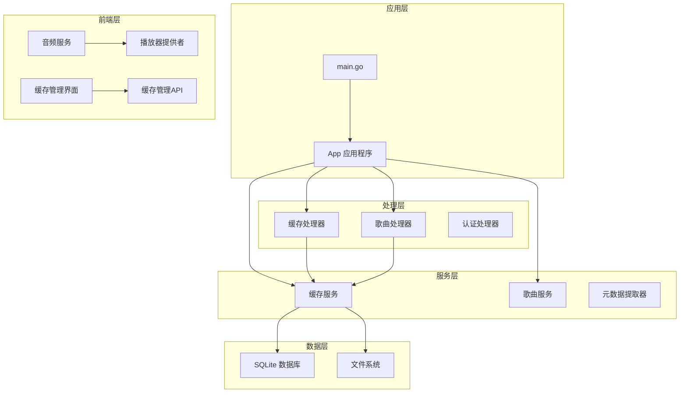
```mermaid
graph TB
subgraph "应用层"
Main[main.go]
App[App 应用程序]
end
subgraph "服务层"
CacheService[缓存服务]
SongService[歌曲服务]
MetadataExtractor[元数据提取器]
end
subgraph "处理层"
CacheHandler[缓存处理器]
SongHandler[歌曲处理器]
AuthHandler[认证处理器]
end
subgraph "数据层"
SQLiteDB[SQLite 数据库]
FileSystem[文件系统]
end
subgraph "前端层"
AudioService[音频服务]
PlayerProvider[播放器提供者]
CacheManager[缓存管理界面]
CacheAPI[缓存管理API]
end
Main --> App
App --> CacheService
App --> SongService
App --> CacheHandler
App --> SongHandler
CacheHandler --> CacheService
SongHandler --> CacheService
CacheService --> SQLiteDB
CacheService --> FileSystem
AudioService --> PlayerProvider
CacheManager --> CacheAPI
```

**图表来源**
- [main.go:30-63](file://main.go#L30-L63)
- [app.go:46-54](file://internal/app/app.go#L46-L54)

**章节来源**
- [main.go:1-64](file://main.go#L1-L64)
- [app.go:27-54](file://internal/app/app.go#L27-L54)

## 核心组件

### 应用程序入口

应用程序通过 `main.go` 启动，负责初始化配置、数据库连接和路由设置。

### 缓存服务核心

缓存服务是整个系统的核心组件，提供了完整的音乐文件缓存管理功能，包括 LRU 缓存淘汰、并发下载控制、文件大小验证和背景预取等高级功能。

### 处理器层

处理器层负责处理 HTTP 请求，将业务逻辑与网络请求分离。现在分为两个专门的处理器：
- **缓存处理器**：专注于缓存管理操作（统计、清理、配置）
- **歌曲处理器**：专注于播放和歌曲管理操作

### 缓存管理API

系统提供了完整的缓存管理API，包括统计信息查询、缓存清理和配置管理功能，支持服务端缓存的完整生命周期管理。

**章节来源**
- [cache_service.go:28-49](file://internal/services/cache_service.go#L28-L49)
- [cache.go:12-22](file://internal/handlers/cache.go#L12-L22)

## 架构概览

音乐缓存系统采用分层架构设计，确保了良好的可维护性和扩展性：

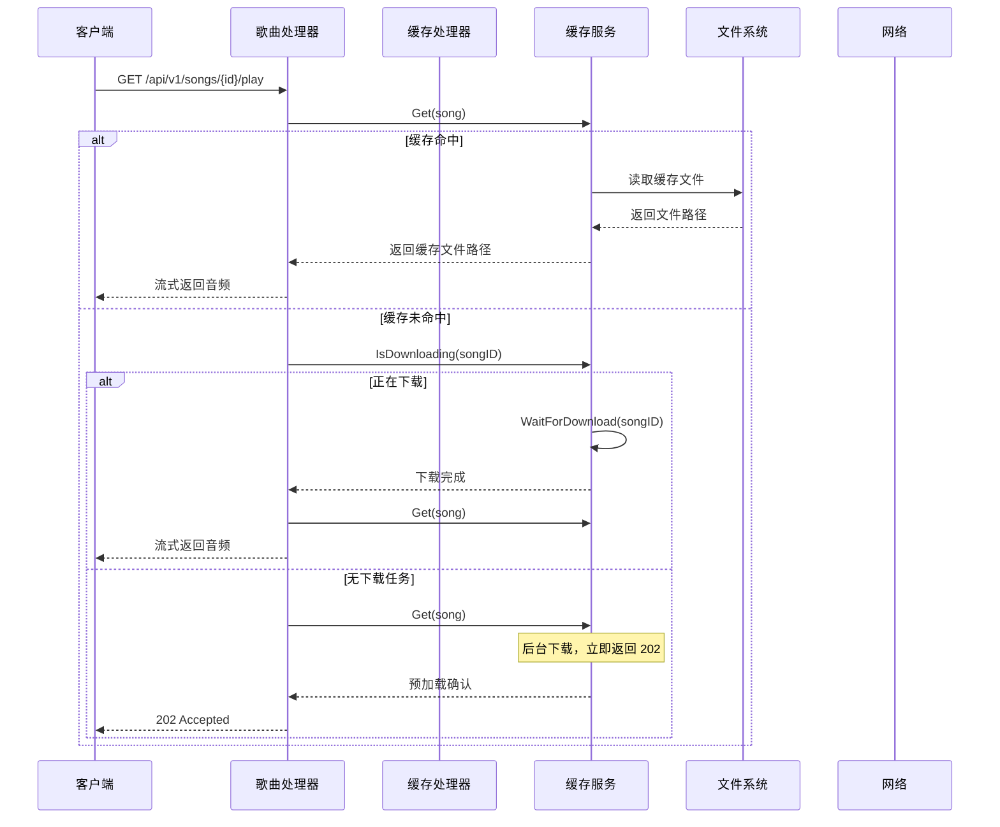
```mermaid
sequenceDiagram
participant Client as 客户端
participant SongHandler as 歌曲处理器
participant CacheHandler as 缓存处理器
participant CacheService as 缓存服务
participant FS as 文件系统
participant Network as 网络
Client->>SongHandler : GET /api/v1/songs/{id}/play
SongHandler->>CacheService : Get(song)
alt 缓存命中
CacheService->>FS : 读取缓存文件
FS-->>CacheService : 返回文件路径
CacheService-->>SongHandler : 返回缓存文件路径
SongHandler-->>Client : 流式返回音频
else 缓存未命中
SongHandler->>CacheService : IsDownloading(songID)
alt 正在下载
CacheService->>CacheService : WaitForDownload(songID)
CacheService-->>SongHandler : 下载完成
SongHandler->>CacheService : Get(song)
SongHandler-->>Client : 流式返回音频
else 无下载任务
SongHandler->>CacheService : Get(song)
Note over CacheService : 后台下载，立即返回 202
CacheService-->>SongHandler : 预加载确认
SongHandler-->>Client : 202 Accepted
end
end
```

**图表来源**
- [music.go:584-653](file://internal/handlers/music.go#L584-L653)
- [cache_service.go:114-143](file://internal/services/cache_service.go#L114-L143)

## 详细组件分析

### 缓存服务架构

缓存服务采用了先进的并发控制和去重机制：

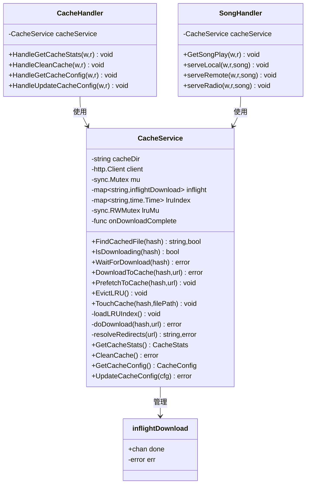
```mermaid
classDiagram
class CacheService {
-string cacheDir
-http.Client client
-sync.Mutex mu
-map~string,inflightDownload~ inflight
-map~string,time.Time~ lruIndex
-sync.RWMutex lruMu
-func onDownloadComplete
+FindCachedFile(hash) string,bool
+IsDownloading(hash) bool
+WaitForDownload(hash) error
+DownloadToCache(hash,url) error
+PrefetchToCache(hash,url) void
+EvictLRU() void
+TouchCache(hash,filePath) void
-loadLRUIndex() void
-doDownload(hash,url) error
-resolveRedirects(url) string,error
+GetCacheStats() CacheStats
+CleanCache() error
+GetCacheConfig() CacheConfig
+UpdateCacheConfig(cfg) error
}
class inflightDownload {
+chan done
-error err
}
class CacheHandler {
-CacheService cacheService
+HandleGetCacheStats(w,r) void
+HandleCleanCache(w,r) void
+HandleGetCacheConfig(w,r) void
+HandleUpdateCacheConfig(w,r) void
}
class SongHandler {
-CacheService cacheService
+GetSongPlay(w,r) void
+serveLocal(w,r,song) void
+serveRemote(w,r,song) void
+serveRadio(w,r,song) void
}
CacheHandler --> CacheService : 使用
SongHandler --> CacheService : 使用
CacheService --> inflightDownload : 管理
```

**图表来源**
- [cache_service.go:28-49](file://internal/services/cache_service.go#L28-L49)
- [cache.go:12-22](file://internal/handlers/cache.go#L12-L22)
- [music.go:20-41](file://internal/handlers/music.go#L20-L41)

### 缓存目录结构

系统采用基于歌曲ID的分层目录结构来组织缓存文件，提高文件系统性能：

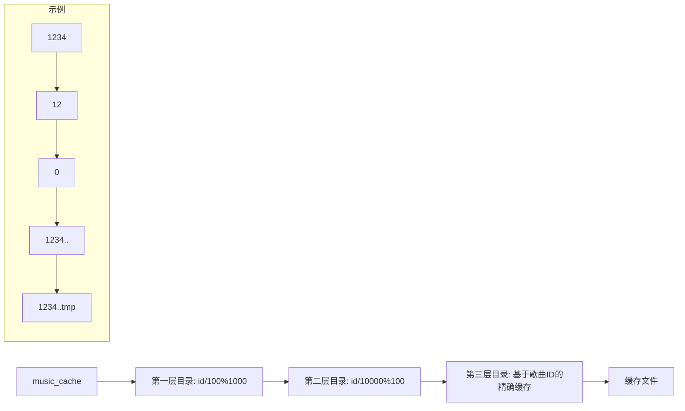
```mermaid
graph LR
CacheRoot[music_cache] --> Level1[第一层目录: id/100%1000]
Level1 --> Level2[第二层目录: id/10000%100]
Level2 --> Level3[第三层目录: 基于歌曲ID的精确缓存]
Level3 --> Files[缓存文件]
subgraph "示例"
A[1234] --> B[12]
B --> C[0]
C --> D[1234.<key>.<ext>]
D --> E[1234.<key>.tmp]
end
```

**图表来源**
- [cache_service_song.go:62-82](file://internal/services/cache_service_song.go#L62-L82)

### 前端集成

前端播放器通过智能预加载机制充分利用缓存系统：

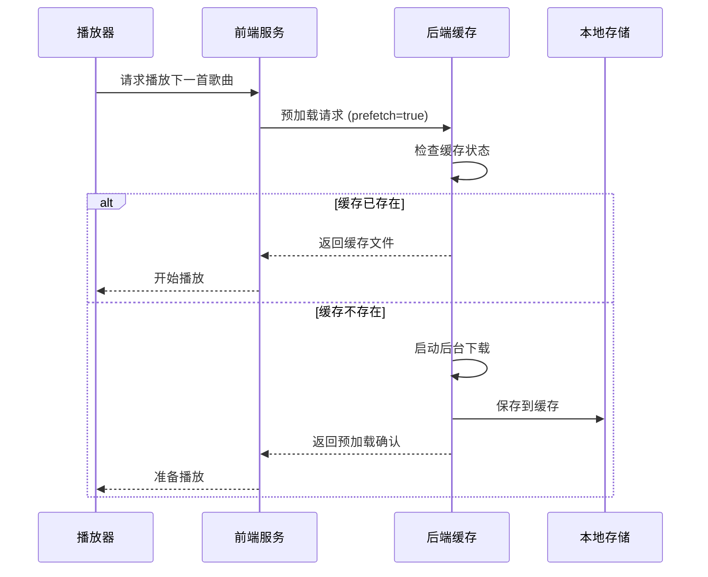
```mermaid
sequenceDiagram
participant Player as 播放器
participant Frontend as 前端服务
participant Backend as 后端缓存
participant Storage as 本地存储
Player->>Frontend : 请求播放下一首歌曲
Frontend->>Backend : 预加载请求 (prefetch=true)
Backend->>Backend : 检查缓存状态
alt 缓存已存在
Backend-->>Frontend : 返回缓存文件
Frontend-->>Player : 开始播放
else 缓存不存在
Backend->>Backend : 启动后台下载
Backend->>Storage : 保存到缓存
Backend-->>Frontend : 返回预加载确认
Frontend-->>Player : 准备播放
end
```

**图表来源**
- [audio_service.dart:185-228](file://frontend/lib/core/audio/audio_service.dart#L185-L228)

**章节来源**
- [cache_service.go:15-49](file://internal/services/cache_service.go#L15-L49)
- [cache_service.go:51-88](file://internal/services/cache_service.go#L51-L88)
- [cache_service.go:90-143](file://internal/services/cache_service.go#L90-L143)

### 配置管理系统

系统通过配置服务管理各种运行时参数：

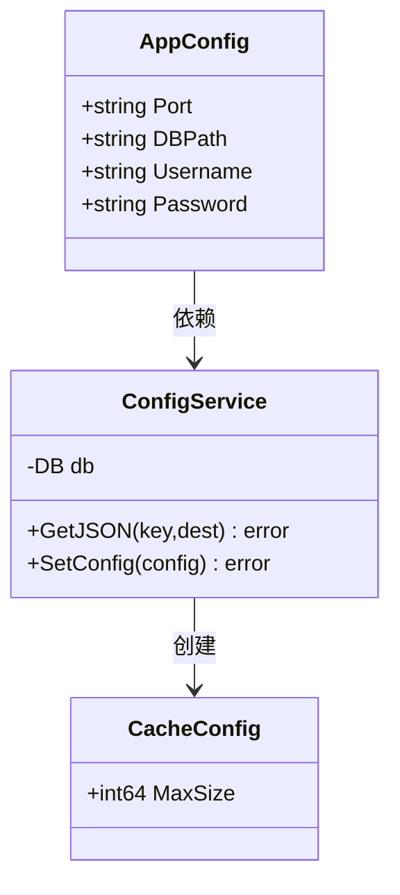
```mermaid
classDiagram
class AppConfig {
+string Port
+string DBPath
+string Username
+string Password
}
class ConfigService {
-DB db
+GetJSON(key,dest) error
+SetConfig(config) error
}
class CacheConfig {
+int64 MaxSize
}
AppConfig --> ConfigService : 依赖
ConfigService --> CacheConfig : 创建
```

**图表来源**
- [types.go:3-9](file://internal/config/types.go#L3-L9)
- [app.go:84-178](file://internal/app/app.go#L84-L178)

**章节来源**
- [types.go:1-10](file://internal/config/types.go#L1-L10)
- [app.go:65-232](file://internal/app/app.go#L65-L232)

## 基于歌曲ID的多键缓存系统

### 歌曲ID寻址机制

系统采用基于歌曲ID的寻址机制，通过音乐文件的唯一标识符直接访问缓存：

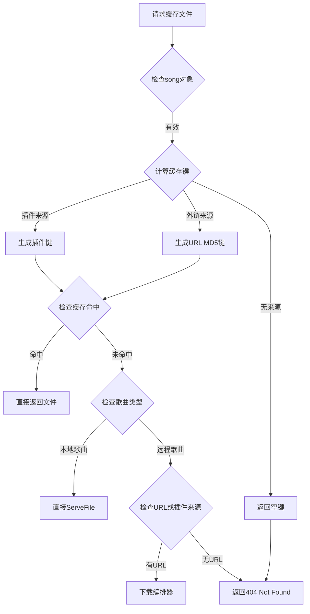
```mermaid
flowchart TD
Start[请求缓存文件] --> CheckSong{检查song对象}
CheckSong --> |有效| CheckKey{计算缓存键}
CheckKey --> |插件来源| PluginKey[生成插件键]
CheckKey --> |外链来源| URLKey[生成URL MD5键]
CheckKey --> |无来源| NoKey[返回空键]
PluginKey --> CheckCache{检查缓存命中}
URLKey --> CheckCache
NoKey --> Return404[返回404 Not Found]
CheckCache --> |命中| ServeFile[直接返回文件]
CheckCache --> |未命中| CheckType{检查歌曲类型}
CheckType --> |本地歌曲| DirectServe[直接ServeFile]
CheckType --> |远程歌曲| CheckURL{检查URL或插件来源}
CheckURL --> |有URL| DownloadOrchestrator[下载编排器]
CheckURL --> |无URL| Return404[返回404 Not Found]
```

**图表来源**
- [music.go:608-705](file://internal/handlers/music.go#L608-L705)

### 缓存键生成算法

系统实现了智能的缓存键生成算法，确保不同来源的同一首歌曲不会相互干扰：

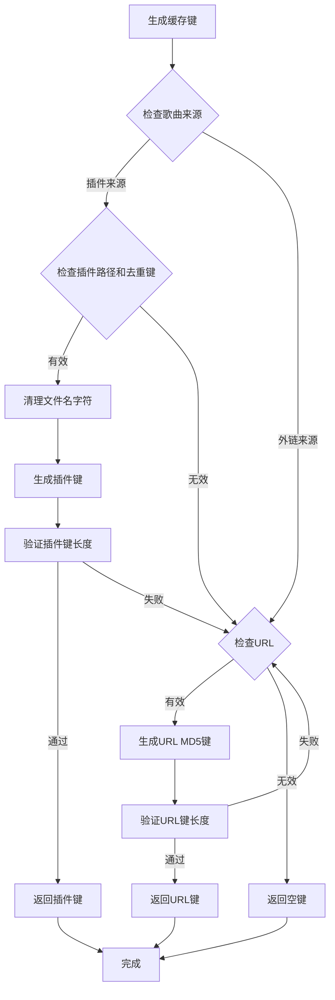
```mermaid
flowchart TD
Start[生成缓存键] --> CheckSource{检查歌曲来源}
CheckSource --> |插件来源| CheckPlugin{检查插件路径和去重键}
CheckPlugin --> |有效| SanitizeKey[清理文件名字符]
SanitizeKey --> GeneratePluginKey[生成插件键]
CheckPlugin --> |无效| CheckURL
CheckSource --> |外链来源| CheckURL{检查URL}
CheckURL --> |有效| GenerateURLKey[生成URL MD5键]
CheckURL --> |无效| ReturnEmpty[返回空键]
GeneratePluginKey --> ValidatePluginKey[验证插件键长度]
GenerateURLKey --> ValidateURLKey[验证URL键长度]
ValidatePluginKey --> |通过| ReturnPluginKey[返回插件键]
ValidateURLKey --> |通过| ReturnURLKey[返回URL键]
ValidatePluginKey --> |失败| CheckURL
ValidateURLKey --> |失败| CheckURL
ReturnPluginKey --> End[完成]
ReturnURLKey --> End
ReturnEmpty --> End
```

**图表来源**
- [cache_service_song.go:84-100](file://internal/services/cache_service_song.go#L84-L100)
- [cache_service_song.go:102-124](file://internal/services/cache_service_song.go#L102-L124)

### 缓存键冲突解决机制

系统实现了智能的冲突解决机制，防止跨数据库重建导致的缓存冲突：

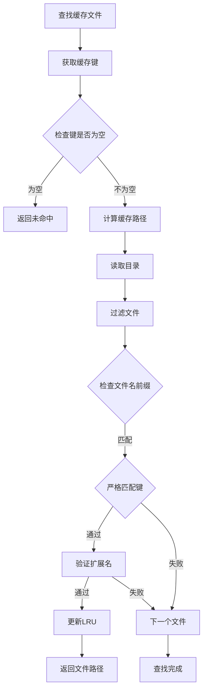
```mermaid
flowchart TD
Start[查找缓存文件] --> GetKey[获取缓存键]
GetKey --> CheckKey{检查键是否为空}
CheckKey --> |为空| ReturnMiss[返回未命中]
CheckKey --> |不为空| GetPath[计算缓存路径]
GetPath --> ReadDir[读取目录]
ReadDir --> FilterFiles[过滤文件]
FilterFiles --> CheckPrefix{检查文件名前缀}
CheckPrefix --> |匹配| CheckStrict{严格匹配键}
CheckStrict --> |通过| ValidateExt[验证扩展名]
CheckStrict --> |失败| NextFile[下一个文件]
ValidateExt --> |通过| TouchLRU[更新LRU]
ValidateExt --> |失败| NextFile
NextFile --> Complete[查找完成]
TouchLRU --> ReturnHit[返回文件路径]
```

**图表来源**
- [cache_service_song.go:126-161](file://internal/services/cache_service_song.go#L126-L161)

### 缓存目录结构优化

系统实现了基于歌曲ID的三级目录结构，提供更好的文件组织和性能：

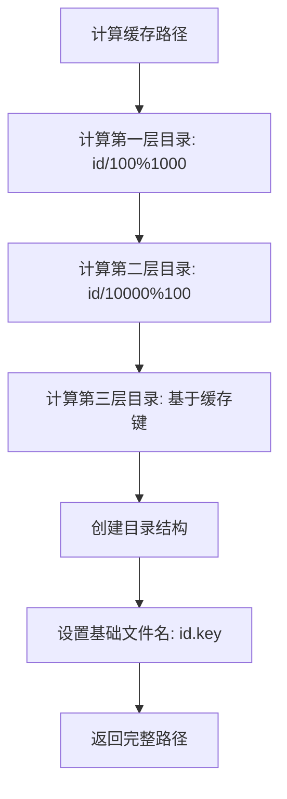
```mermaid
flowchart TD
Start[计算缓存路径] --> CalcFirst[计算第一层目录: id/100%1000]
CalcFirst --> CalcSecond[计算第二层目录: id/10000%100]
CalcSecond --> CalcThird[计算第三层目录: 基于缓存键]
CalcThird --> CreateDir[创建目录结构]
CreateDir --> SetBase[设置基础文件名: id.key]
SetBase --> ReturnPath[返回完整路径]
```

**图表来源**
- [cache_service_song.go:62-82](file://internal/services/cache_service_song.go#L62-L82)

### 歌曲ID缓存查找

系统提供了基于歌曲ID的缓存文件查找功能：


```mermaid
flowchart TD
Start[查找缓存文件] --> GetKey[获取缓存键]
GetKey --> CheckKey{检查键是否为空}
CheckKey --> |为空| ReturnMiss[返回未命中]
CheckKey --> |不为空| GetPath[计算缓存路径]
GetPath --> ReadDir[读取目录]
ReadDir --> FilterFiles[过滤文件]
FilterFiles --> CheckPrefix{检查文件名前缀}
CheckPrefix --> |匹配| CheckStrict{严格匹配键}
CheckStrict --> |通过| ValidateExt[验证扩展名]
CheckStrict --> |失败| NextFile[下一个文件]
ValidateExt --> |通过| TouchLRU[更新LRU]
ValidateExt --> |失败| NextFile
NextFile --> Complete[查找完成]
TouchLRU --> ReturnHit[返回文件路径]
```

**图表来源**
- [cache_service_song.go:126-161](file://internal/services/cache_service_song.go#L126-L161)

**章节来源**
- [cache_service_song.go:62-161](file://internal/services/cache_service_song.go#L62-L161)

### 缓存键生成算法详解

系统实现了复杂的缓存键生成算法，确保缓存的精确性和安全性：

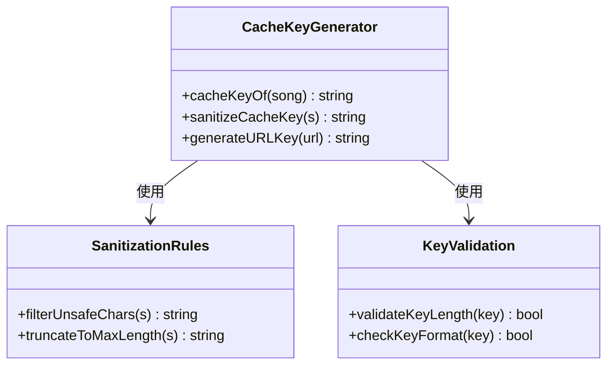
```mermaid
classDiagram
class CacheKeyGenerator {
+cacheKeyOf(song) string
+sanitizeCacheKey(s) string
+generateURLKey(url) string
}
class SanitizationRules {
+filterUnsafeChars(s) string
+truncateToMaxLength(s) string
}
class KeyValidation {
+validateKeyLength(key) bool
+checkKeyFormat(key) bool
}
CacheKeyGenerator --> SanitizationRules : 使用
CacheKeyGenerator --> KeyValidation : 使用
```

**图表来源**
- [cache_service_song.go:84-124](file://internal/services/cache_service_song.go#L84-L124)

**章节来源**
- [cache_service_song.go:84-124](file://internal/services/cache_service_song.go#L84-L124)

## 缓存管理API

### API端点概览

系统提供了完整的缓存管理API，支持对服务端缓存进行全面的管理：

```mermaid
classDiagram
class CacheAPI {
+GET /cache-manage/stats 获取缓存统计信息
+POST /cache-manage/clean 清理全部缓存
+GET /cache-manage/config 获取缓存配置
+PUT /cache-manage/config 更新缓存配置
+GET /api/v1/cache/{song_id} 获取缓存文件
+HEAD /api/v1/cache/{song_id} 检查缓存状态
}
class CacheHandler {
-cacheService : CacheService
-configService : ConfigService
+HandleGetCacheStats() CacheStats
+HandleCleanCache() void
+HandleGetCacheConfig() CacheConfig
+HandleUpdateCacheConfig() CacheConfig
+HandleGetCache() void
}
CacheHandler --> CacheService : 使用
CacheHandler --> ConfigService : 使用
```

**图表来源**
- [cache.go:117-199](file://internal/handlers/cache.go#L117-L199)
- [routers.go:162-166](file://internal/app/routers.go#L162-L166)

### 缓存统计信息API

系统提供了详细的缓存统计信息查询接口：

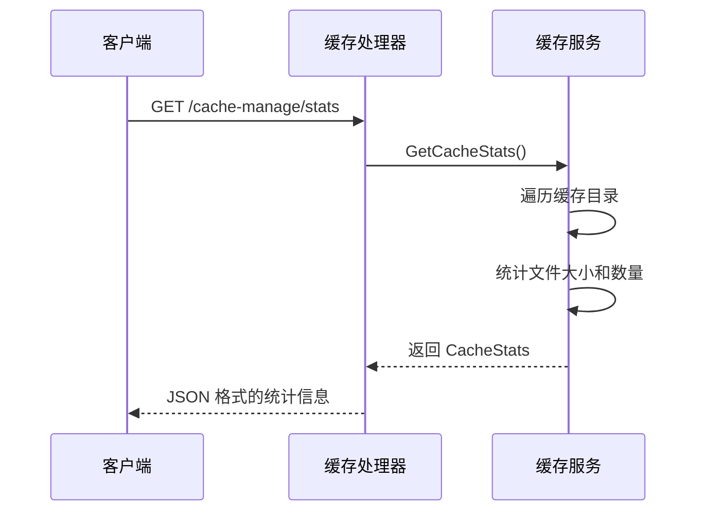
```mermaid
sequenceDiagram
participant Client as 客户端
participant Handler as 缓存处理器
participant Service as 缓存服务
Client->>Handler : GET /cache-manage/stats
Handler->>Service : GetCacheStats()
Service->>Service : 遍历缓存目录
Service->>Service : 统计文件大小和数量
Service-->>Handler : 返回 CacheStats
Handler-->>Client : JSON 格式的统计信息
```

**图表来源**
- [cache.go:45-48](file://internal/handlers/cache.go#L45-L48)
- [cache_service.go:441-466](file://internal/services/cache_service.go#L441-L466)

### 缓存清理API

系统提供了完整的缓存清理功能：

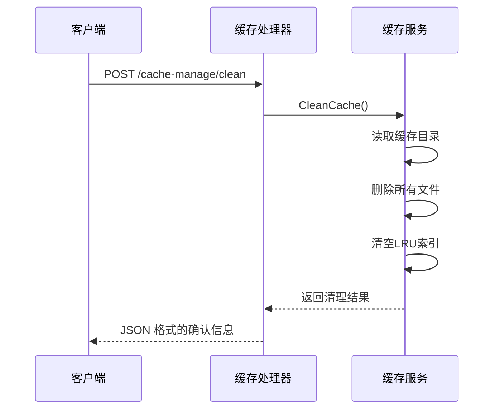
```mermaid
sequenceDiagram
participant Client as 客户端
participant Handler as 缓存处理器
participant Service as 缓存服务
Client->>Handler : POST /cache-manage/clean
Handler->>Service : CleanCache()
Service->>Service : 读取缓存目录
Service->>Service : 删除所有文件
Service->>Service : 清空LRU索引
Service-->>Handler : 返回清理结果
Handler-->>Client : JSON 格式的确认信息
```

**图表来源**
- [cache.go:60-67](file://internal/handlers/cache.go#L60-L67)
- [cache_service.go:468-493](file://internal/services/cache_service.go#L468-L493)

### 缓存配置管理API

系统提供了灵活的缓存配置管理功能：

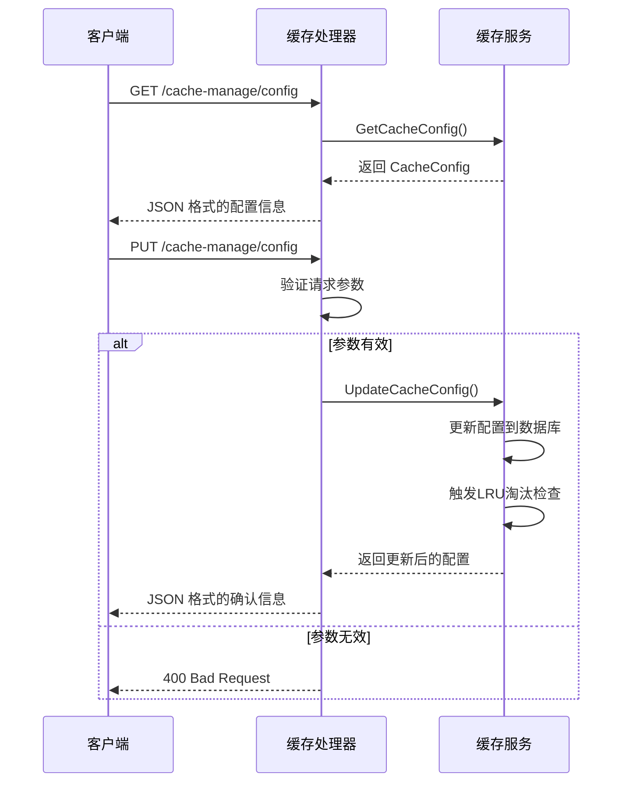
```mermaid
sequenceDiagram
participant Client as 客户端
participant Handler as 缓存处理器
participant Service as 缓存服务
Client->>Handler : GET /cache-manage/config
Handler->>Service : GetCacheConfig()
Service-->>Handler : 返回 CacheConfig
Handler-->>Client : JSON 格式的配置信息
Client->>Handler : PUT /cache-manage/config
Handler->>Handler : 验证请求参数
alt 参数有效
Handler->>Service : UpdateCacheConfig()
Service->>Service : 更新配置到数据库
Service->>Service : 触发LRU淘汰检查
Service-->>Handler : 返回更新后的配置
Handler-->>Client : JSON 格式的确认信息
else 参数无效
Handler-->>Client : 400 Bad Request
end
```

**图表来源**
- [cache.go:79-115](file://internal/handlers/cache.go#L79-L115)
- [cache_service.go:592-609](file://internal/services/cache_service.go#L592-L609)

**章节来源**
- [cache.go:117-199](file://internal/handlers/cache.go#L117-L199)
- [cache_service.go:441-609](file://internal/services/cache_service.go#L441-L609)

## 播放端点架构

### 统一播放端点设计

系统现在提供统一的播放端点 `/api/v1/songs/{id}/play`，所有类型的歌曲（本地、远程、电台）都通过同一个端点进行播放：

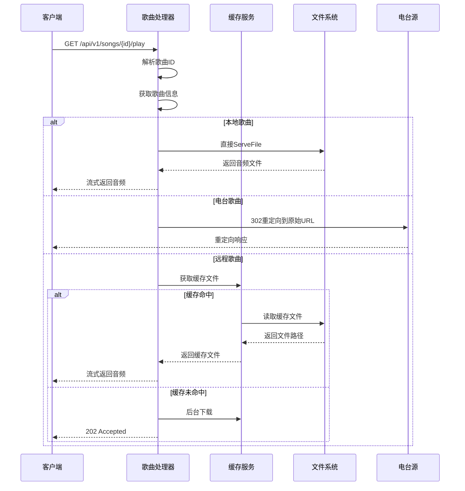
```mermaid
sequenceDiagram
participant Client as 客户端
participant SongHandler as 歌曲处理器
participant CacheService as 缓存服务
participant FS as 文件系统
participant Radio as 电台源
Client->>SongHandler : GET /api/v1/songs/{id}/play
SongHandler->>SongHandler : 解析歌曲ID
SongHandler->>SongHandler : 获取歌曲信息
alt 本地歌曲
SongHandler->>FS : 直接ServeFile
FS-->>SongHandler : 返回音频文件
SongHandler-->>Client : 流式返回音频
else 电台歌曲
SongHandler->>Radio : 302重定向到原始URL
Radio-->>Client : 重定向响应
else 远程歌曲
SongHandler->>CacheService : 获取缓存文件
alt 缓存命中
CacheService->>FS : 读取缓存文件
FS-->>CacheService : 返回文件路径
CacheService-->>SongHandler : 返回缓存文件
SongHandler-->>Client : 流式返回音频
else 缓存未命中
SongHandler->>CacheService : 后台下载
SongHandler-->>Client : 202 Accepted
end
end
```

**图表来源**
- [music.go:608-705](file://internal/handlers/music.go#L608-L705)

### 播放类型分发机制

系统根据歌曲类型自动分发到相应的播放处理逻辑：

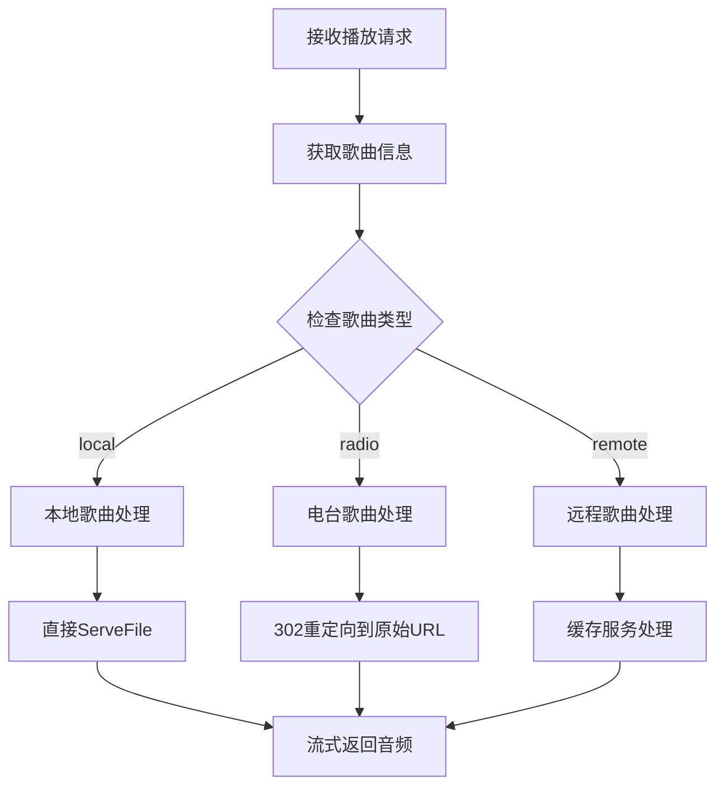
```mermaid
flowchart TD
Start[接收播放请求] --> GetSong[获取歌曲信息]
GetSong --> CheckType{检查歌曲类型}
CheckType --> |local| LocalHandler[本地歌曲处理]
CheckType --> |radio| RadioHandler[电台歌曲处理]
CheckType --> |remote| RemoteHandler[远程歌曲处理]
LocalHandler --> ServeLocal[直接ServeFile]
RadioHandler --> RedirectRadio[302重定向到原始URL]
RemoteHandler --> CacheHandler[缓存服务处理]
ServeLocal --> StreamAudio[流式返回音频]
RedirectRadio --> StreamAudio
CacheHandler --> StreamAudio
```

**图表来源**
- [music.go:641-651](file://internal/handlers/music.go#L641-L651)

### 播放缓存策略

系统为不同类型的歌曲采用不同的缓存策略：

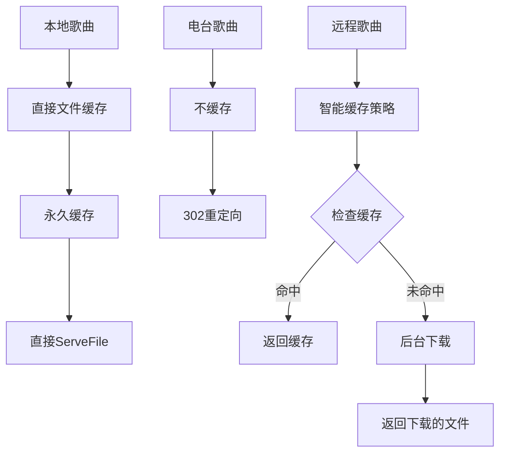
```mermaid
flowchart TD
LocalSong[本地歌曲] --> LocalCache[直接文件缓存]
LocalCache --> PermanentCache[永久缓存]
PermanentCache --> ServeLocal[直接ServeFile]
RadioSong[电台歌曲] --> NoCache[不缓存]
NoCache --> Redirect[302重定向]
RemoteSong[远程歌曲] --> CacheStrategy[智能缓存策略]
CacheStrategy --> CheckCache{检查缓存}
CheckCache --> |命中| ServeCached[返回缓存]
CheckCache --> |未命中| Download[后台下载]
Download --> ServeDownloaded[返回下载的文件]
```

**图表来源**
- [music.go:674-705](file://internal/handlers/music.go#L674-L705)

**章节来源**
- [music.go:608-705](file://internal/handlers/music.go#L608-L705)

## 前端播放URL生成

### 统一播放URL生成

前端通过 `PlaybackURL()` 方法生成统一的播放URL，所有类型的歌曲都使用相同的播放端点：

```mermaid
flowchart TD
Start[生成播放URL] --> CheckID{检查歌曲ID}
CheckID --> |有效| GenerateURL[生成 /api/v1/songs/{id}/play]
CheckID --> |无效| ReturnEmpty[返回空URL]
GenerateURL --> ReturnURL[返回播放URL]
ReturnEmpty --> End[结束]
ReturnURL --> End
```

**图表来源**
- [models.go:98-106](file://internal/models/models.go#L98-L106)

### 前端播放器集成

前端播放器通过统一的URL接口实现播放功能：

```mermaid
sequenceDiagram
participant Player as 播放器
participant AudioService as 音频服务
participant Song as 歌曲模型
AudioService->>Song : 调用 PlaybackURL()
Song-->>AudioService : 返回统一播放URL
AudioService->>AudioService : 处理相对路径和认证
AudioService->>Player : 创建音频源
Player->>Player : 开始播放
```

**图表来源**
- [audio_service.dart:185-228](file://frontend/lib/core/audio/audio_service.dart#L185-L228)

### 播放URL处理机制

前端对播放URL进行统一处理，支持相对路径和绝对路径：

```mermaid
flowchart TD
Start[接收播放URL] --> CheckProtocol{检查URL协议}
CheckProtocol --> |相对路径| AddToken[添加访问令牌]
CheckProtocol --> |绝对路径| ProxyURL[通过代理转发]
AddToken --> BuildAbsolute[构建完整URL]
ProxyURL --> BuildAbsolute
BuildAbsolute --> PlayAudio[播放音频]
```

**图表来源**
- [audio_service.dart:206-228](file://frontend/lib/core/audio/audio_service.dart#L206-L228)

**章节来源**
- [models.go:98-150](file://internal/models/models.go#L98-L150)
- [audio_service.dart:185-228](file://frontend/lib/core/audio/audio_service.dart#L185-L228)

## 缓存管理API

### API端点概览

系统提供了完整的缓存管理API，支持对服务端缓存进行全面的管理：

```mermaid
classDiagram
class CacheAPI {
+GET /cache-manage/stats 获取缓存统计信息
+POST /cache-manage/clean 清理全部缓存
+GET /cache-manage/config 获取缓存配置
+PUT /cache-manage/config 更新缓存配置
+GET /api/v1/cache/{song_id} 获取缓存文件
+HEAD /api/v1/cache/{song_id} 检查缓存状态
}
class CacheHandler {
-cacheService : CacheService
-configService : ConfigService
+HandleGetCacheStats() CacheStats
+HandleCleanCache() void
+HandleGetCacheConfig() CacheConfig
+HandleUpdateCacheConfig() CacheConfig
+HandleGetCache() void
}
CacheHandler --> CacheService : 使用
CacheHandler --> ConfigService : 使用
```

**图表来源**
- [cache.go:117-199](file://internal/handlers/cache.go#L117-L199)
- [routers.go:162-166](file://internal/app/routers.go#L162-L166)

### 缓存统计信息API

系统提供了详细的缓存统计信息查询接口：

```mermaid
sequenceDiagram
participant Client as 客户端
participant Handler as 缓存处理器
participant Service as 缓存服务
Client->>Handler : GET /cache-manage/stats
Handler->>Service : GetCacheStats()
Service->>Service : 遍历缓存目录
Service->>Service : 统计文件大小和数量
Service-->>Handler : 返回 CacheStats
Handler-->>Client : JSON 格式的统计信息
```

**图表来源**
- [cache.go:45-48](file://internal/handlers/cache.go#L45-L48)
- [cache_service.go:441-466](file://internal/services/cache_service.go#L441-L466)

### 缓存清理API

系统提供了完整的缓存清理功能：

```mermaid
sequenceDiagram
participant Client as 客户端
participant Handler as 缓存处理器
participant Service as 缓存服务
Client->>Handler : POST /cache-manage/clean
Handler->>Service : CleanCache()
Service->>Service : 读取缓存目录
Service->>Service : 删除所有文件
Service->>Service : 清空LRU索引
Service-->>Handler : 返回清理结果
Handler-->>Client : JSON 格式的确认信息
```

**图表来源**
- [cache.go:60-67](file://internal/handlers/cache.go#L60-L67)
- [cache_service.go:468-493](file://internal/services/cache_service.go#L468-L493)

### 缓存配置管理API

系统提供了灵活的缓存配置管理功能：

```mermaid
sequenceDiagram
participant Client as 客户端
participant Handler as 缓存处理器
participant Service as 缓存服务
Client->>Handler : GET /cache-manage/config
Handler->>Service : GetCacheConfig()
Service-->>Handler : 返回 CacheConfig
Handler-->>Client : JSON 格式的配置信息
Client->>Handler : PUT /cache-manage/config
Handler->>Handler : 验证请求参数
alt 参数有效
Handler->>Service : UpdateCacheConfig()
Service->>Service : 更新配置到数据库
Service->>Service : 触发LRU淘汰检查
Service-->>Handler : 返回更新后的配置
Handler-->>Client : JSON 格式的确认信息
else 参数无效
Handler-->>Client : 400 Bad Request
end
```

**图表来源**
- [cache.go:79-115](file://internal/handlers/cache.go#L79-L115)
- [cache_service.go:592-609](file://internal/services/cache_service.go#L592-L609)

**章节来源**
- [cache.go:117-199](file://internal/handlers/cache.go#L117-L199)
- [cache_service.go:441-609](file://internal/services/cache_service.go#L441-L609)

## 前端缓存管理界面

### 缓存管理Widget

前端提供了完整的缓存管理界面，支持服务端和本地缓存的统一管理：

```mermaid
classDiagram
class CacheManager {
-bool _isCleaningServer
-bool _isCleaningLocal
-int _localCacheSize
-int _localCacheMaxSizeIndex
-CacheSizeOption[] _cacheSizeOptions
+build() Widget
+_cleanServerCache() Future~void~
+_cleanLocalCache() Future~void~
+_updateServerCacheConfig(size) Future~void~
+_loadLocalCacheSize() Future~void~
}
class CacheAPI {
+getCacheStats() Future~CacheStats~
+cleanCache() Future~void~
+updateCacheConfig(config) Future~void~
}
CacheManager --> CacheAPI : 使用
```

**图表来源**
- [cache_manager.dart:25-34](file://frontend/lib/features/settings/presentation/widgets/cache_manager.dart#L25-L34)
- [cache_api.dart:43-58](file://frontend/lib/features/settings/data/cache_api.dart#L43-L58)

### 缓存清理功能

前端实现了直观的缓存清理界面：

```mermaid
sequenceDiagram
participant User as 用户
participant UI as 缓存管理界面
participant API as 缓存管理API
User->>UI : 点击"清理服务端缓存"
UI->>UI : 显示确认对话框
User->>UI : 确认清理
UI->>API : POST /cache-manage/clean
API-->>UI : 返回清理结果
UI->>UI : 刷新统计信息
UI->>User : 显示清理完成提示
```

**图表来源**
- [cache_manager.dart:128-152](file://frontend/lib/features/settings/presentation/widgets/cache_manager.dart#L128-L152)

### 缓存配置管理

前端支持动态调整缓存配置：

```mermaid
flowchart TD
Start[用户选择缓存大小] --> Validate{检查输入有效性}
Validate --> |有效| UpdateConfig[更新缓存配置]
Validate --> |无效| ShowError[显示错误信息]
UpdateConfig --> SendRequest[发送配置更新请求]
SendRequest --> CheckResponse{检查响应状态}
CheckResponse --> |成功| RefreshStats[刷新统计信息]
CheckResponse --> |失败| ShowError
RefreshStats --> End[完成]
ShowError --> End
```

**图表来源**
- [cache_manager.dart:205-217](file://frontend/lib/features/settings/presentation/widgets/cache_manager.dart#L205-L217)
- [cache_api.dart:26-41](file://frontend/lib/features/settings/data/cache_api.dart#L26-L41)

**章节来源**
- [cache_manager.dart:1-200](file://frontend/lib/features/settings/presentation/widgets/cache_manager.dart#L1-L200)
- [cache_api.dart:1-58](file://frontend/lib/features/settings/data/cache_api.dart#L1-L58)

## LRU缓存淘汰算法

### LRU算法概述

LRU（Least Recently Used）缓存淘汰算法是 MiMusic 缓存系统的重要组成部分，通过维护访问时间索引来实现智能的缓存空间管理。该算法基于"最近最少使用"的原则，自动淘汰最久未使用的缓存文件，确保缓存空间的有效利用。

### LRU索引管理

系统维护两个层面的 LRU 索引：

```mermaid
classDiagram
class LRUIndex {
-map~string,time.Time~ memoryIndex
-sync.RWMutex lock
+TouchCache(hash,filePath) void
+EvictLRU() void
+loadLRUIndex() void
}
class CacheService {
-map~string,time.Time~ lruIndex
-sync.RWMutex lruMu
}
LRUIndex --> CacheService : 管理
```

**图表来源**
- [cache_service.go:426-439](file://internal/services/cache_service.go#L426-L439)
- [cache_service.go:503-581](file://internal/services/cache_service.go#L503-L581)

### 访问时间更新机制

当缓存文件被访问时，系统会自动更新其访问时间：

```mermaid
flowchart TD
Start[缓存文件访问] --> CheckCache{检查缓存命中}
CheckCache --> |命中| UpdateLRU[更新 LRU 索引]
UpdateLRU --> UpdateMTime[更新文件 mtime]
UpdateMTime --> LoadMemory[加载到内存索引]
LoadMemory --> End[完成]
CheckCache --> |未命中| End
```

**图表来源**
- [cache_service.go:426-439](file://internal/services/cache_service.go#L426-L439)

### 缓存淘汰策略

系统实现了智能的缓存淘汰机制，确保缓存空间不超过配置的上限：

```mermaid
flowchart TD
Start[开始淘汰检查] --> CheckLimit{检查缓存大小}
CheckLimit --> |未超限| End[无需淘汰]
CheckLimit --> |超限| CollectFiles[收集所有缓存文件]
CollectFiles --> SortFiles[按访问时间排序]
SortFiles --> DeleteOld[删除最旧文件]
DeleteOld --> UpdateIndex[更新 LRU 索引]
UpdateIndex --> CheckSize{检查是否仍超限}
CheckSize --> |是| DeleteOld
CheckSize --> |否| End
```

**图表来源**
- [cache_service.go:503-581](file://internal/services/cache_service.go#L503-L581)

### LRU索引加载

系统启动时会从文件系统加载现有的 LRU 索引：

```mermaid
flowchart TD
Start[系统启动] --> WalkDir[遍历缓存目录]
WalkDir --> FilterFiles{过滤有效文件}
FilterFiles --> |是| ExtractHash[提取文件名哈希]
ExtractHash --> LoadIndex[加载到内存索引]
FilterFiles --> |否| SkipFile[跳过文件]
LoadIndex --> NextFile[处理下一个文件]
SkipFile --> NextFile
NextFile --> Complete[加载完成]
```

**图表来源**
- [cache_service.go:393-424](file://internal/services/cache_service.go#L393-L424)

**章节来源**
- [cache_service.go:426-439](file://internal/services/cache_service.go#L426-L439)
- [cache_service.go:503-581](file://internal/services/cache_service.go#L503-L581)
- [cache_service.go:393-424](file://internal/services/cache_service.go#L393-L424)

## 并发下载控制

### inflight下载管理

系统实现了智能的并发下载控制，避免重复下载相同内容：

```mermaid
classDiagram
class inflightDownload {
+chan done
-error err
}
class CacheService {
-map~string,inflightDownload~ inflight
-sync.Mutex mu
+IsDownloading(hash) bool
+WaitForDownload(hash) error
+DownloadToCache(hash,url) error
}
CacheService --> inflightDownload : 管理
```

**图表来源**
- [cache_service.go:39-43](file://internal/services/cache_service.go#L39-L43)
- [cache_service.go:125-144](file://internal/services/cache_service.go#L125-L144)

### 下载去重机制

系统通过 inflight 映射实现下载去重：

```mermaid
flowchart TD
Start[开始下载请求] --> CheckInflight{检查是否正在下载}
CheckInflight --> |是| WaitDownload[等待现有下载完成]
CheckInflight --> |否| RegisterInflight[注册下载任务]
RegisterInflight --> Download[执行下载]
WaitDownload --> CheckResult{下载完成?}
CheckResult --> |是| ReturnResult[返回结果]
CheckResult --> |否| HandleError[处理错误]
Download --> ValidateSize{验证文件大小}
ValidateSize --> |通过| RenameFile[重命名文件]
ValidateSize --> |失败| RemoveTemp[删除临时文件]
RenameFile --> Cleanup[清理下载状态]
RemoveTemp --> HandleError
Cleanup --> ReturnResult
```

**图表来源**
- [cache_service.go:146-234](file://internal/services/cache_service.go#L146-L234)
- [cache_service.go:146-281](file://internal/services/cache_service.go#L146-L281)

### 下载状态管理

系统提供了完整的下载状态管理机制：

```mermaid
sequenceDiagram
participant Client as 客户端
participant Service as 缓存服务
participant Network as 网络
Client->>Service : DownloadToCache(hash, url)
Service->>Service : 检查 inflight 状态
alt 无下载任务
Service->>Service : 注册 inflight 任务
Service->>Network : 发起下载请求
Network-->>Service : 返回音频数据
Service->>Service : 验证文件大小
Service->>Service : 重命名临时文件
Service->>Service : 更新 LRU 索引
Service->>Service : 触发下载完成回调
Service-->>Client : 返回下载结果
else 有下载任务
Service->>Service : 等待现有下载完成
Service-->>Client : 返回下载结果
end
```

**图表来源**
- [cache_service.go:146-281](file://internal/services/cache_service.go#L146-L281)

**章节来源**
- [cache_service.go:125-144](file://internal/services/cache_service.go#L125-L144)
- [cache_service.go:146-281](file://internal/services/cache_service.go#L146-L281)

## 文件大小验证

### 最小文件大小检查

系统实现了严格的文件大小验证机制，防止下载无效的音频文件：

```mermaid
flowchart TD
Start[下载完成] --> CheckSize{检查文件大小}
CheckSize --> |大于最小值| ValidFile[验证通过]
CheckSize --> |小于最小值| InvalidFile[验证失败]
InvalidFile --> RemoveTemp[删除临时文件]
RemoveTemp --> ErrorReturn[返回错误]
ValidFile --> RenameFile[重命名文件]
RenameFile --> UpdateLRU[更新 LRU 索引]
UpdateLRU --> Complete[下载完成]
```

**图表来源**
- [cache_service.go:253-265](file://internal/services/cache_service.go#L253-L265)

### 验证参数配置

系统使用常量定义最小文件大小：

```go
const (
    // MinAudioSize 最小有效音频文件大小（1KB），低于此值认为是错误响应
    MinAudioSize = 1024
    // maxRedirects 最大重定向层数
    maxRedirects = 5
    // defaultMaxCacheSize 默认最大缓存大小（1GB）
    defaultMaxCacheSize int64 = 1 * 1024 * 1024 * 1024
    // cacheConfigKey 缓存配置在 configs 表中的 key
    cacheConfigKey = "music_cache_config"
    // maxErrorBodySize 限制非音频响应读取大小，防止内存爆炸
    maxErrorBodySize = 1024 * 1024 // 1MB
)
```

**章节来源**
- [cache_service.go:16-28](file://internal/services/cache_service.go#L16-L28)
- [cache_service.go:253-265](file://internal/services/cache_service.go#L253-L265)

## 背景预取功能

### 预取机制概述

系统支持智能的背景预取功能，通过 `prefetch=true` 参数实现下一首歌曲的提前下载：

```mermaid
sequenceDiagram
participant Player as 播放器
participant Frontend as 前端服务
participant Backend as 缓存服务
Player->>Frontend : 预加载下一首歌曲
Frontend->>Backend : PrefetchToCache(hash, url)
Backend->>Backend : 检查缓存状态
alt 文件已缓存
Backend-->>Frontend : 直接返回
Frontend-->>Player : 预加载完成
else 文件未缓存
Backend->>Backend : 启动后台下载
Note over Backend : 异步执行，不阻塞主线程
Backend-->>Frontend : 返回 202 Accepted
Frontend-->>Player : 预加载确认
end
```

**图表来源**
- [cache_service.go:350-372](file://internal/services/cache_service.go#L350-L372)
- [music.go:631-653](file://internal/handlers/music.go#L631-L653)

### 前端预加载实现

前端播放器实现了智能的预加载机制：

```mermaid
flowchart TD
Start[开始播放] --> CheckNext{检查下一首歌曲}
CheckNext --> |有下一首| BuildURL[构建预加载 URL]
BuildURL --> SendRequest[发送预加载请求]
SendRequest --> WaitResponse{等待响应}
WaitResponse --> |202 Accepted| BackgroundDownload[后台下载]
WaitResponse --> |200 OK| ImmediatePlay[立即播放]
BackgroundDownload --> ContinuePlay[继续播放]
ImmediatePlay --> ContinuePlay
CheckNext --> |无下一首| ContinuePlay
```

**图表来源**
- [audio_service.dart:185-228](file://frontend/lib/core/audio/audio_service.dart#L185-L228)

### 插件预加载支持

系统还支持插件的预加载功能：

```mermaid
flowchart TD
Start[插件触发预加载] --> CheckSong{检查歌曲类型}
CheckSong --> |本地歌曲| SkipLocal[跳过本地歌曲]
CheckSong --> |网络歌曲| CheckURL{检查 URL 类型}
CheckURL --> |相对路径| BuildPluginURL[构建插件 URL]
CheckURL --> |绝对路径| SkipExternal[跳过外部 URL]
BuildPluginURL --> SendPluginRequest[发送插件预加载请求]
SendPluginRequest --> HandleResponse{处理响应}
HandleResponse --> |成功| LogSuccess[记录成功]
HandleResponse --> |失败| LogError[记录错误]
SkipLocal --> End[结束]
SkipExternal --> End
LogSuccess --> End
LogError --> End
```

**图表来源**
- [playlist_manager.go:549-619](file://plugins/mimusic-plugin-xiaomi/player/playlist_manager.go#L549-L619)

**章节来源**
- [cache_service.go:350-372](file://internal/services/cache_service.go#L350-L372)
- [music.go:631-653](file://internal/handlers/music.go#L631-L653)
- [audio_service.dart:185-228](file://frontend/lib/core/audio/audio_service.dart#L185-L228)
- [playlist_manager.go:549-619](file://plugins/mimusic-plugin-xiaomi/player/playlist_manager.go#L549-L619)

## 缓存配置管理

### 缓存配置结构

系统提供了灵活的缓存配置管理机制：

```mermaid
classDiagram
class CacheConfig {
+int64 MaxSize
}
class CacheService {
-CacheConfig config
-func onDownloadComplete
+GetCacheConfig() CacheConfig
+UpdateCacheConfig(cfg) error
+GetMaxCacheSize() int64
}
CacheService --> CacheConfig : 使用
```

**图表来源**
- [cache_service.go:34-37](file://internal/services/cache_service.go#L34-L37)
- [cache_service.go:592-609](file://internal/services/cache_service.go#L592-L609)

### 配置持久化

缓存配置通过配置服务进行持久化存储：

```mermaid
flowchart TD
Start[更新缓存配置] --> SaveConfig[保存到配置服务]
SaveConfig --> LoadConfig[从配置服务加载]
LoadConfig --> ValidateConfig{验证配置}
ValidateConfig --> |有效| ApplyConfig[应用配置]
ValidateConfig --> |无效| UseDefault[使用默认配置]
ApplyConfig --> TriggerEvict[触发缓存淘汰]
TriggerEvict --> Complete[配置更新完成]
UseDefault --> TriggerEvict
```

**图表来源**
- [cache_service.go:601-609](file://internal/services/cache_service.go#L601-L609)

### 配置选项

系统支持以下缓存配置选项：

- **最大缓存大小**：设置缓存空间上限，支持 0 表示无限制
- **实时淘汰**：配置更新后立即检查并执行缓存淘汰
- **默认配置**：提供合理的默认缓存大小（1GB）

**章节来源**
- [cache_service.go:34-37](file://internal/services/cache_service.go#L34-L37)
- [cache_service.go:592-609](file://internal/services/cache_service.go#L592-L609)

## 缓存统计监控

### 缓存统计信息

系统提供了详细的缓存统计功能：

```mermaid
classDiagram
class CacheStats {
-int64 TotalSize
-int FileCount
-int64 MaxSize
}
class CacheService {
-func GetCacheStats() CacheStats
-func CleanCache() error
}
CacheService --> CacheStats : 生成
```

**图表来源**
- [cache_service.go:27-32](file://internal/services/cache_service.go#L27-L32)
- [cache_service.go:441-466](file://internal/services/cache_service.go#L441-L466)

### 统计信息收集

系统通过遍历缓存目录收集统计信息：

```mermaid
flowchart TD
Start[开始统计] --> WalkDir[遍历缓存目录]
WalkDir --> FilterFiles{过滤有效文件}
FilterFiles --> |临时文件| SkipTemp[跳过临时文件]
FilterFiles --> |有效文件| CountFile[统计文件信息]
SkipTemp --> NextFile[处理下一个文件]
CountFile --> NextFile
NextFile --> Calculate[计算总大小和数量]
Calculate --> ReturnStats[返回统计结果]
```

**图表来源**
- [cache_service.go:441-466](file://internal/services/cache_service.go#L441-L466)

### 缓存清理功能

系统提供了完整的缓存清理机制：

```mermaid
flowchart TD
Start[开始清理] --> ReadDir[读取缓存目录]
ReadDir --> IterateFiles[遍历文件]
IterateFiles --> DeleteFile[删除文件]
DeleteFile --> ClearIndex[清空 LRU 索引]
ClearIndex --> LogClean[记录清理日志]
LogClean --> Complete[清理完成]
```

**图表来源**
- [cache_service.go:468-493](file://internal/services/cache_service.go#L468-L493)

**章节来源**
- [cache_service.go:27-32](file://internal/services/cache_service.go#L27-L32)
- [cache_service.go:441-493](file://internal/services/cache_service.go#L441-L493)

## 下载完成回调

### 回调机制概述

系统实现了下载完成回调机制，支持在下载完成后执行自定义操作：

```mermaid
classDiagram
class CacheService {
-func onDownloadComplete
+SetOnDownloadComplete(fn) void
}
class SongService {
-func BackfillDuration
}
CacheService --> SongService : 调用回调
```

**图表来源**
- [cache_service.go:57-60](file://internal/services/cache_service.go#L57-L60)
- [song_service.go:592-623](file://internal/services/song_service.go#L592-L623)

### 时长回填功能

系统通过回调机制实现音频时长的自动回填：

```mermaid
flowchart TD
Start[下载完成] --> CallCallback[调用回调函数]
CallCallback --> LoadSong[按 hash 查找歌曲]
LoadSong --> CheckDuration{检查时长}
CheckDuration --> |已有时长| SkipBackfill[跳过回填]
CheckDuration --> |无时长| ExtractDuration[提取时长]
ExtractDuration --> UpdateDatabase[更新数据库]
UpdateDatabase --> LogSuccess[记录成功日志]
SkipBackfill --> End[完成]
LogSuccess --> End
```

**图表来源**
- [song_service.go:592-623](file://internal/services/song_service.go#L592-L623)

### 回调注册流程

系统在应用启动时注册下载完成回调：

```mermaid
sequenceDiagram
participant App as 应用程序
participant CacheService as 缓存服务
participant SongService as 歌曲服务
App->>CacheService : NewCacheService()
CacheService->>CacheService : 初始化回调函数
App->>CacheService : SetOnDownloadComplete()
CacheService->>SongService : 注册 BackfillDuration 回调
Note over CacheService,SongService : 下载完成后自动调用
```

**图表来源**
- [app.go:185-187](file://internal/app/app.go#L185-L187)

**章节来源**
- [cache_service.go:57-60](file://internal/services/cache_service.go#L57-L60)
- [song_service.go:592-623](file://internal/services/song_service.go#L592-L623)
- [app.go:185-187](file://internal/app/app.go#L185-L187)

## 依赖关系分析

音乐缓存系统的关键依赖关系如下：

```mermaid
graph TB
subgraph "外部依赖"
Chi[Chi Router v5]
SQLite[SQLite Driver]
Tag[音频元数据库]
Slog[结构化日志]
Dio[Dart HTTP Client]
Riverpod[Flutter状态管理]
end
subgraph "内部模块"
Main[main.go]
App[app.go]
CacheService[cache_service.go]
CacheServiceSong[cache_service_song.go]
CacheHandler[cache.go]
SongHandler[music.go]
Router[routers.go]
Config[types.go]
Models[models.go]
DB[sqlite.go]
SongDB[sqlite_song.go]
SongService[song_service.go]
MetadataExtractor[metadata.go]
DatabaseInterface[database.go]
end
Main --> App
App --> CacheService
App --> SongService
App --> CacheHandler
App --> SongHandler
CacheHandler --> CacheService
SongHandler --> CacheService
CacheService --> DB
CacheService --> Models
CacheServiceSong --> CacheService
App --> Config
CacheService --> Slog
CacheHandler --> Chi
CacheService --> Tag
DB --> SQLite
SongService --> SongDB
SongDB --> Models
MetadataExtractor --> Tag
DatabaseInterface --> SongDB
```

**图表来源**
- [main.go:3-9](file://main.go#L3-L9)
- [app.go:3-25](file://internal/app/app.go#L3-L25)
- [cache_service.go:3-13](file://internal/services/cache_service.go#L3-L13)

**章节来源**
- [main.go:1-64](file://main.go#L1-L64)
- [app.go:1-358](file://internal/app/app.go#L1-L358)

## 性能考虑

### 缓存策略优化

1. **智能目录分层**：使用歌曲ID的三级目录结构，避免单个目录中文件过多
2. **并发控制**：通过 `inflight` 映射避免重复下载相同内容
3. **内存管理**：使用 `ServeFile` 直接返回文件，避免将整个文件加载到内存
4. **超时控制**：设置合理的 HTTP 超时时间，防止长时间阻塞
5. **LRU淘汰**：基于访问时间的智能缓存淘汰，优化存储空间使用
6. **缓存控制头**：使用适当的 HTTP 头信息优化浏览器缓存行为
7. **多键缓存**：基于歌曲ID的多键缓存系统，防止缓存冲突
8. **智能冲突解决**：确保不同来源的同一首歌曲不会相互干扰
9. **精确缓存隔离**：插件来源和外链来源的缓存完全隔离

### 存储优化

1. **文件系统优化**：SQLite 使用 WAL 模式提高并发性能
2. **连接池管理**：合理设置数据库连接池大小
3. **磁盘空间管理**：定期清理无效缓存文件
4. **索引优化**：`cache_hash` 唯一索引确保查询性能
5. **LRU索引优化**：内存中的 LRU 索引提高访问速度
6. **缓存键优化**：智能的缓存键生成算法提高缓存命中率

### 网络优化

1. **重定向处理**：使用 HEAD 请求解析重定向，减少不必要的数据传输
2. **内容类型验证**：确保下载的是有效的音频文件
3. **范围请求支持**：利用 `ServeFile` 自动支持 Range 请求
4. **预加载优化**：后台下载不阻塞主线程
5. **HTTP方法优化**：HEAD 请求专门用于状态检查，避免不必要的数据传输
6. **缓存键冲突避免**：防止跨数据库重建导致的缓存冲突

### 歌曲ID系统优化

1. **去重效率**：通过 `song_id` 字段实现高效的重复检测
2. **原子操作**：UPSERT 操作确保数据一致性
3. **条件更新**：避免覆盖已有的正确元数据
4. **索引优化**：唯一索引确保查询性能
5. **多键缓存**：支持插件来源和外链来源的精确缓存隔离

### LRU算法优化

1. **双索引机制**：内存索引 + 文件 mtime 双重保证
2. **读写分离**：LRU索引使用 RWMutex 实现读写分离
3. **批量淘汰**：按访问时间排序后批量删除
4. **实时监控**：配置更新后立即执行缓存淘汰
5. **智能堆管理**：使用 container/heap 实现最大堆，优化内存使用

### 缓存管理API优化

1. **批量操作**：清理缓存时一次性删除所有文件
2. **异步处理**：配置更新后异步触发淘汰检查
3. **状态检查**：HEAD 请求专门用于检查下载状态
4. **错误处理**：完善的错误处理和日志记录
5. **多键缓存支持**：支持基于歌曲ID的多键缓存管理

### 播放端点优化

1. **统一接口**：所有歌曲类型通过同一端点播放，简化客户端集成
2. **类型分发**：根据歌曲类型自动选择最优的播放策略
3. **缓存策略**：本地歌曲直接缓存，远程歌曲智能缓存，电台歌曲不缓存
4. **错误处理**：插件来源歌曲失败时自动切换音源
5. **多键缓存集成**：与多键缓存系统无缝集成

## 故障排除指南

### 常见问题及解决方案

#### 缓存文件无法找到

**症状**：播放时提示找不到缓存文件

**可能原因**：
1. 缓存目录权限问题
2. 文件被意外删除
3. 目录结构损坏
4. LRU索引不同步
5. 缓存键生成失败
6. 多键缓存冲突

**解决方案**：
1. 检查缓存目录权限
2. 重新下载音乐文件
3. 清理并重建缓存目录
4. 重启应用以重新加载 LRU 索引
5. 检查缓存键生成算法
6. 清理多键缓存冲突

#### 下载超时

**症状**：下载过程中出现超时错误

**可能原因**：
1. 网络连接不稳定
2. 目标服务器响应慢
3. 超时时间设置过短
4. 并发下载过多
5. 缓存键冲突导致的重复下载

**解决方案**：
1. 检查网络连接
2. 增加超时时间配置
3. 使用代理服务器
4. 调整并发下载限制
5. 检查缓存键冲突解决机制

#### 并发下载冲突

**症状**：多个请求同时下载相同文件

**可能原因**：
1. 缺少并发控制
2. 缓存状态检查失败
3. inflight状态不同步
4. 多键缓存系统异常

**解决方案**：
1. 确保 `inflight` 机制正常工作
2. 检查锁机制实现
3. 验证下载状态清理
4. 检查多键缓存系统状态

#### LRU淘汰异常

**症状**：缓存空间持续增长或淘汰不生效

**可能原因**：
1. LRU索引加载失败
2. 文件mtime更新失败
3. 淘汰算法异常
4. 配置参数错误
5. 多键缓存系统影响LRU索引

**解决方案**：
1. 检查缓存目录权限
2. 验证文件系统支持mtime
3. 手动触发缓存淘汰
4. 检查配置参数设置
5. 检查多键缓存系统对LRU的影响

#### 预加载失败

**症状**：预加载请求返回错误或无效果

**可能原因**：
1. 预加载URL构建错误
2. 访问令牌失效
3. 网络连接问题
4. 后台下载失败
5. 多键缓存键生成失败

**解决方案**：
1. 检查URL构建逻辑
2. 刷新访问令牌
3. 检查网络连接
4. 查看后台下载日志
5. 检查多键缓存键生成

#### 缓存配置异常

**症状**：缓存配置无法保存或应用

**可能原因**：
1. 配置服务异常
2. 数据库连接问题
3. 权限不足
4. 配置格式错误
5. 多键缓存配置冲突

**解决方案**：
1. 检查配置服务状态
2. 验证数据库连接
3. 检查文件权限
4. 重新设置配置参数
5. 检查多键缓存配置

#### 缓存管理API错误

**症状**：缓存管理API调用失败

**可能原因**：
1. 认证令牌无效
2. 请求参数格式错误
3. 服务器内部错误
4. 网络连接问题
5. 多键缓存API异常

**解决方案**：
1. 检查JWT令牌有效性
2. 验证请求参数格式
3. 查看服务器日志
4. 检查网络连接状态
5. 检查多键缓存API状态

#### 播放端点错误

**症状**：播放请求返回错误

**可能原因**：
1. 歌曲ID无效
2. 歌曲不存在
3. 播放源不可用
4. 缓存服务异常
5. 多键缓存查找失败

**解决方案**：
1. 检查歌曲ID格式
2. 验证歌曲存在性
3. 检查播放源可用性
4. 重启缓存服务
5. 检查多键缓存查找逻辑

#### 前端播放问题

**症状**：前端无法播放音乐

**可能原因**：
1. 播放URL生成错误
2. 认证令牌过期
3. 网络连接问题
4. 播放器配置错误
5. 多键缓存键生成错误

**解决方案**：
1. 检查播放URL生成逻辑
2. 刷新访问令牌
3. 检查网络连接
4. 重新初始化播放器
5. 检查多键缓存键生成

#### 多键缓存冲突

**症状**：同一首歌曲在不同来源间冲突

**可能原因**：
1. 缓存键生成算法缺陷
2. 文件名冲突
3. 缓存目录结构问题
4. 冲突解决机制失效

**解决方案**：
1. 检查缓存键生成算法
2. 验证文件名唯一性
3. 检查缓存目录结构
4. 重启应用以重新加载缓存键

**章节来源**
- [cache_service.go:146-234](file://internal/services/cache_service.go#L146-L234)
- [cache_service.go:236-293](file://internal/services/cache_service.go#L236-L293)
- [music.go:608-705](file://internal/handlers/music.go#L608-L705)

## 结论

MiMusic 的音乐缓存系统通过精心设计的架构和优化策略，为用户提供了高效、可靠的音乐播放体验。系统的主要优势包括：

1. **统一缓存接口**：从哈希系统迁移到歌曲ID系统，提供统一的缓存访问方式
2. **专注的缓存管理**：缓存处理器专注于缓存统计、清理和配置管理
3. **统一播放端点**：播放功能集中在 SongHandler，提供 `/api/v1/songs/{id}/play` 统一播放接口
4. **高性能缓存**：智能的目录结构和并发控制确保了最佳的性能表现
5. **智能LRU淘汰**：基于访问时间的缓存管理优化了存储空间使用
6. **可靠的下载管理**：完善的并发控制和去重机制保证了下载的稳定性
7. **严格的质量控制**：文件大小验证和内容类型检查确保了缓存质量
8. **智能化的预加载**：后台下载机制提升了用户体验
9. **灵活的配置管理**：动态配置和实时淘汰机制适应不同使用场景
10. **全面的监控功能**：统计信息和日志记录便于系统维护和优化
11. **完整的缓存管理API**：提供统计、清理和配置管理的完整功能
12. **用户友好的前端界面**：直观的缓存管理界面提升用户体验
13. **统一的播放URL生成**：简化了客户端集成，支持所有类型的歌曲播放
14. **多键缓存支持**：基于歌曲ID的多键缓存系统，防止缓存冲突
15. **智能冲突解决**：确保不同来源的同一首歌曲不会相互干扰
16. **精确缓存隔离**：插件来源和外链来源的缓存完全隔离

缓存系统的重大优化包括：
- **歌曲ID系统**：实现了基于歌曲ID的统一缓存访问
- **LRU算法**：实现了基于访问时间的智能缓存淘汰
- **并发下载控制**：通过 inflight机制避免重复下载
- **文件大小验证**：防止无效音频文件进入缓存
- **背景预取功能**：支持智能预加载下一首歌曲
- **缓存配置管理**：动态调整缓存策略和空间限制
- **下载完成回调**：自动回填音频时长等元数据
- **缓存管理API**：提供完整的统计、清理和配置管理功能
- **前端缓存管理界面**：支持服务端和本地缓存的统一管理
- **统一播放端点**：简化了客户端集成，提升了用户体验
- **多键缓存系统**：实现了基于歌曲ID的精确缓存隔离
- **智能冲突解决**：防止跨数据库重建导致的缓存冲突
- **缓存键生成算法**：确保缓存的精确性和安全性

这些优化显著提升了系统的性能和可靠性，为用户提供了更加流畅和稳定的音乐播放体验。未来可以考虑的改进方向包括：
- 实现更智能的缓存预测算法
- 增强缓存一致性保证机制
- 优化大文件的下载和缓存策略
- 扩展缓存监控和告警功能
- 支持分布式缓存架构
- 增加缓存压缩和去重功能
- 提供缓存使用情况的可视化报告
- 实现播放历史和推荐算法
- 增强插件系统的缓存支持
- 优化多键缓存的性能表现
- 增加缓存冲突检测和自动修复功能