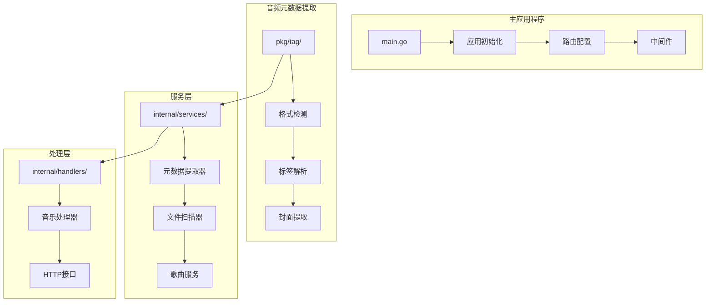
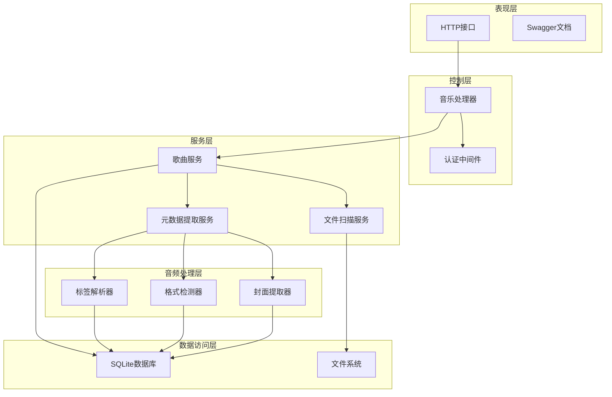
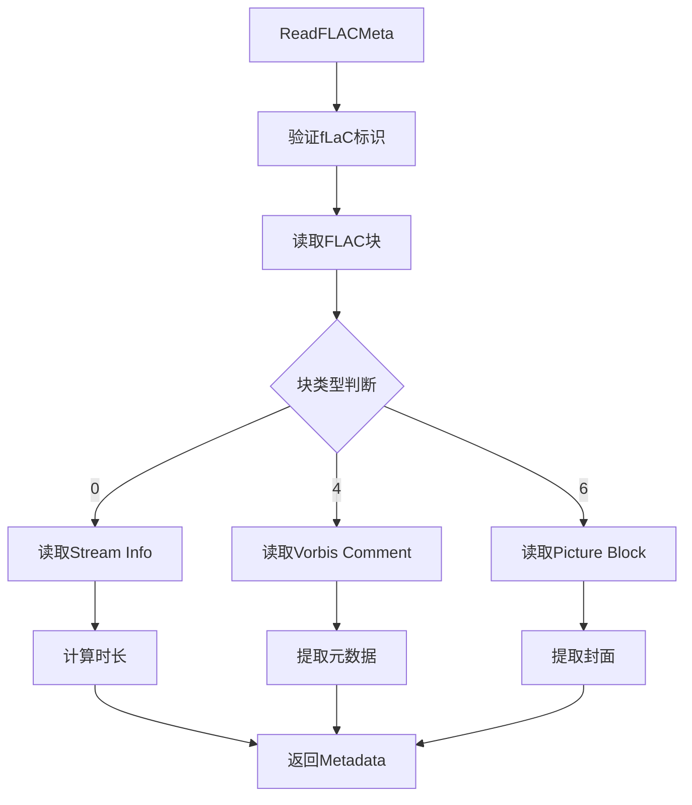
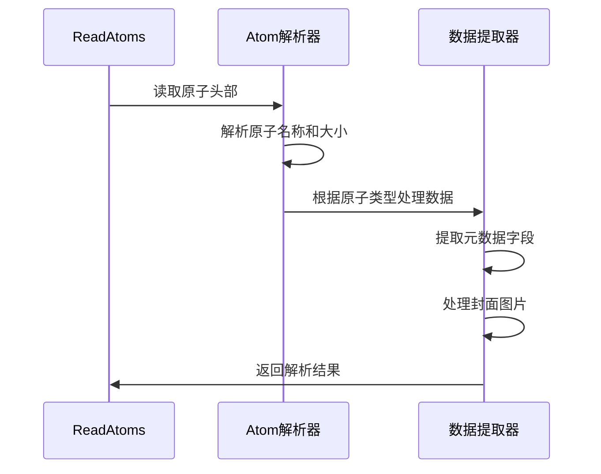
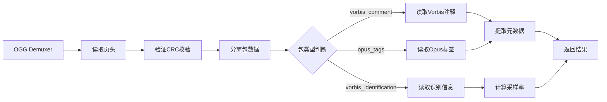
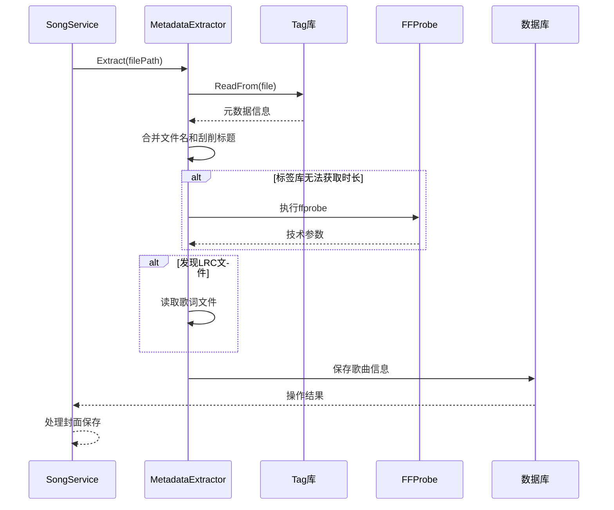
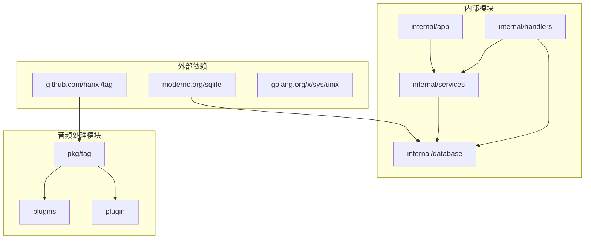

# 音频元数据提取工具

<cite>
**本文档引用的文件**
- [main.go](file://main.go)
- [tag.go](file://pkg/tag/tag.go)
- [metadata.go](file://internal/services/metadata.go)
- [scanner.go](file://internal/services/scanner.go)
- [song_service.go](file://internal/services/song_service.go)
- [music.go](file://internal/handlers/music.go)
- [id3v2.go](file://pkg/tag/id3v2.go)
- [flac.go](file://pkg/tag/flac.go)
- [mp3.go](file://pkg/tag/mp3.go)
- [mp4.go](file://pkg/tag/mp4.go)
- [ogg.go](file://pkg/tag/ogg.go)
- [wav.go](file://pkg/tag/wav.go)
- [dsf.go](file://pkg/tag/dsf.go)
- [README.md](file://README.md)
</cite>

## 目录
1. [简介](#简介)
2. [项目结构](#项目结构)
3. [核心组件](#核心组件)
4. [架构概览](#架构概览)
5. [详细组件分析](#详细组件分析)
6. [依赖关系分析](#依赖关系分析)
7. [性能考虑](#性能考虑)
8. [故障排除指南](#故障排除指南)
9. [结论](#结论)

## 简介

MiMusic 是一个自托管的轻量级音乐服务器，专注于音频元数据提取和管理。该项目的核心是一个强大的音频元数据提取工具，能够识别和解析多种音频格式的标签信息，包括 MP3、FLAC、WAV、OGG、M4A 等。

该工具的主要特点包括：
- 支持多种音频格式的元数据提取
- 纯 Go 实现，无需外部依赖
- 高性能的并发处理能力
- 完整的封面图片提取功能
- 智能的歌词文件处理
- 结构化的日志记录

## 项目结构

项目采用模块化设计，主要分为以下几个核心部分：



**图表来源**
- [main.go:30-63](file://main.go#L30-L63)
- [tag.go:29-75](file://pkg/tag/tag.go#L29-L75)
- [metadata.go:69-74](file://internal/services/metadata.go#L69-L74)

**章节来源**
- [README.md:415-466](file://README.md#L415-L466)

## 核心组件

### 音频元数据提取器

音频元数据提取器是整个系统的核心组件，负责从各种音频格式中提取元数据信息。它支持以下功能：

- **格式自动检测**：自动识别音频文件类型
- **标签信息提取**：提取标题、艺术家、专辑、年份等信息
- **封面图片提取**：支持 JPEG、PNG 等格式的封面提取
- **歌词处理**：支持内嵌歌词和外部 LRC 文件
- **技术参数获取**：时长、比特率、采样率等

### 文件扫描器

文件扫描器负责遍历音乐目录，识别和筛选有效的音频文件：

- **递归目录扫描**：支持深层目录结构
- **格式验证**：确保文件符合支持的音频格式
- **软链接处理**：安全处理符号链接，防止循环
- **性能优化**：使用并发处理提高扫描效率

### 歌曲服务

歌曲服务提供完整的音乐管理功能：

- **批量导入**：支持大量文件的并发处理
- **数据库集成**：使用 SQLite 存储音乐信息
- **进度跟踪**：实时显示扫描进度
- **错误恢复**：单个文件错误不影响整体进程

**章节来源**
- [metadata.go:25-74](file://internal/services/metadata.go#L25-L74)
- [scanner.go:18-28](file://internal/services/scanner.go#L18-L28)
- [song_service.go:16-32](file://internal/services/song_service.go#L16-L32)

## 架构概览

系统采用分层架构设计，确保各组件职责明确且易于维护：



**图表来源**
- [music.go:19-29](file://internal/handlers/music.go#L19-L29)
- [song_service.go:16-32](file://internal/services/song_service.go#L16-L32)
- [metadata.go:25-74](file://internal/services/metadata.go#L25-L74)

## 详细组件分析

### 音频格式支持

系统支持多种主流音频格式，每种格式都有专门的解析器：

#### MP3 格式支持

```mermaid
classDiagram
class MetadataV2MP3 {
+metadataID3v2
+duration time.Duration
+Format() Format
+FileType() FileType
+Title() string
+Artist() string
+Album() string
+Year() int
+Genre() string
+Track() (int, int)
+Disc() (int, int)
+Picture() *Picture
+Lyrics() string
+Comment() string
+Raw() map[string]interface{}
+Duration() time.Duration
}
class MetadataV1MP3 {
+metadataID3v1
+duration time.Duration
+Format() Format
+FileType() FileType
+Title() string
+Artist() string
+Album() string
+Year() int
+Genre() string
+Track() (int, int)
+Disc() (int, int)
+Picture() *Picture
+Lyrics() string
+Comment() string
+Raw() map[string]interface{}
+Duration() time.Duration
}
MetadataV2MP3 --> MetadataID3v2 : "继承"
MetadataV1MP3 --> MetadataID3v1 : "继承"
```

**图表来源**
- [mp3.go:99-107](file://pkg/tag/mp3.go#L99-L107)
- [id3v2.go:57-65](file://pkg/tag/id3v2.go#L57-L65)

系统支持以下 MP3 特性：
- **ID3v1 标签**：基本元数据信息
- **ID3v2.2/2.3/2.4 标签**：高级元数据和自定义字段
- **帧头解析**：计算音频时长
- **比特率检测**：支持可变比特率(VBR)

#### FLAC 格式支持

FLAC 格式的解析相对简单，因为其元数据结构标准化程度较高：



**图表来源**
- [flac.go:30-54](file://pkg/tag/flac.go#L30-L54)
- [flac.go:61-91](file://pkg/tag/flac.go#L61-L91)

#### MP4/M4A 格式支持

MP4 格式使用原子(Atom)结构存储元数据：



**图表来源**
- [mp4.go:79-86](file://pkg/tag/mp4.go#L79-L86)
- [mp4.go:88-158](file://pkg/tag/mp4.go#L88-L158)

#### OGG/Opus 格式支持

OGG 格式使用包(Packet)和页(Page)结构：



**图表来源**
- [ogg.go:143-183](file://pkg/tag/ogg.go#L143-L183)
- [ogg.go:62-136](file://pkg/tag/ogg.go#L62-L136)

### 元数据提取流程



**图表来源**
- [song_service.go:205-361](file://internal/services/song_service.go#L205-L361)
- [metadata.go:76-170](file://internal/services/metadata.go#L76-L170)

**章节来源**
- [metadata.go:76-170](file://internal/services/metadata.go#L76-L170)
- [song_service.go:205-361](file://internal/services/song_service.go#L205-L361)

## 依赖关系分析

系统采用清晰的依赖层次结构，确保模块间的松耦合：



**图表来源**
- [README.md:481-489](file://README.md#L481-L489)
- [go.mod](file://go.mod)

### 关键依赖说明

1. **音频标签库**：`github.com/hanxi/tag` 提供了强大的音频元数据解析能力
2. **数据库驱动**：`modernc.org/sqlite` 提供纯 Go 实现的 SQLite 支持
3. **HTTP路由**：`github.com/go-chi/chi/v5` 提供高性能的路由处理
4. **JWT认证**：`github.com/golang-jwt/jwt/v5` 提供安全的身份验证

**章节来源**
- [README.md:481-489](file://README.md#L481-L489)

## 性能考虑

### 并发处理优化

系统采用了多层次的并发处理策略：

1. **元数据提取并发**：使用 4 个 worker 并发处理文件
2. **批量数据库操作**：每批处理 50 个文件，减少数据库锁竞争
3. **流水线处理**：生产者-消费者模式，避免内存峰值

### 内存管理

- **流式处理**：避免一次性加载整个文件到内存
- **智能缓存**：封面图片使用内容哈希去重
- **垃圾回收优化**：及时释放不再使用的对象

### I/O 优化

- **预过滤**：快速跳过已存在的文件
- **批量写入**：使用事务批量提交数据库操作
- **异步处理**：扫描过程完全异步，不影响主线程

## 故障排除指南

### 常见问题及解决方案

#### 元数据提取失败

**症状**：某些文件无法提取元数据
**原因**：文件格式不受支持或文件损坏
**解决方案**：
1. 检查文件格式是否在支持列表中
2. 验证文件完整性
3. 更新音频标签库版本

#### 封面图片缺失

**症状**：歌曲显示没有封面
**原因**：封面数据提取失败或文件损坏
**解决方案**：
1. 检查封面文件格式（JPEG/PNG）
2. 验证封面数据完整性
3. 重新提取元数据

#### 扫描进度异常

**症状**：扫描进度停滞或显示错误
**原因**：文件权限问题或磁盘空间不足
**解决方案**：
1. 检查目录访问权限
2. 确认磁盘空间充足
3. 重启扫描进程

**章节来源**
- [song_service.go:548-558](file://internal/services/song_service.go#L548-L558)
- [metadata.go:221-245](file://internal/services/metadata.go#L221-L245)

## 结论

MiMusic 的音频元数据提取工具展现了优秀的软件工程实践：

1. **模块化设计**：清晰的组件分离和职责划分
2. **性能优化**：多层次的并发处理和内存管理
3. **可靠性保证**：完善的错误处理和恢复机制
4. **扩展性**：插件系统支持功能扩展

该工具不仅满足了基本的音频元数据提取需求，还提供了丰富的功能和良好的用户体验。通过合理的架构设计和性能优化，能够在处理大量音频文件时保持高效和稳定。

未来的发展方向包括：
- 支持更多音频格式
- 增强机器学习驱动的元数据识别
- 优化移动端性能
- 扩展云存储集成